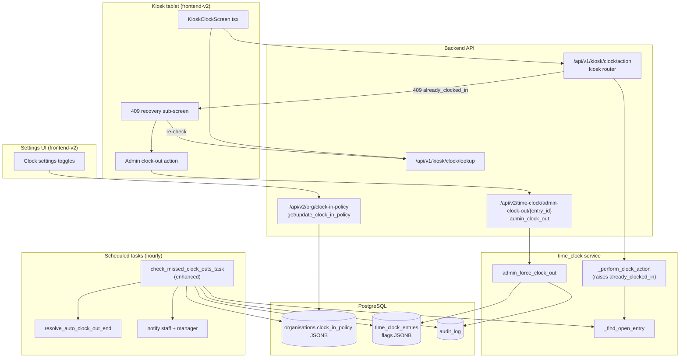
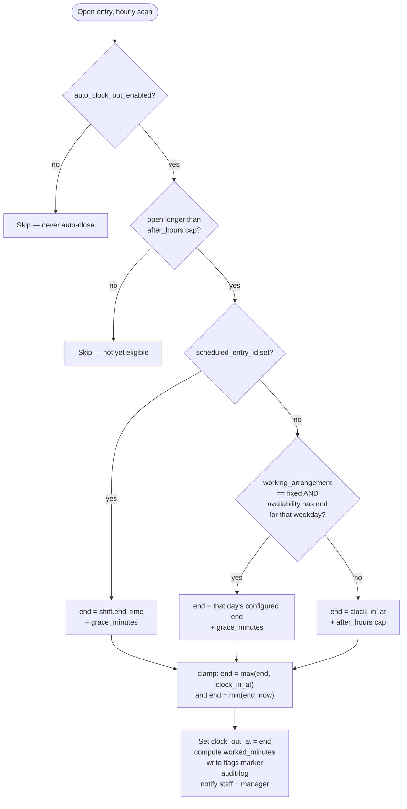

# Design Document: auto-clock-out

## Overview

Staff hit `409 already_clocked_in` at the kiosk (`POST /api/v1/kiosk/clock/action`)
when they have a dangling open `time_clock_entries` row — almost always a forgotten
clock-out from a previous shift. Today the kiosk treats that 409 as a dead end
("…Please see your manager.") and the only cleanup path is an admin manually closing
the entry.

This feature delivers four coordinated changes:

- **A. Kiosk 409 recovery** — make `already_clocked_in` recoverable. A genuine
  double-submit/retry is treated idempotently (the entry I just created means I *am*
  clocked in → show success); a real stale-open entry re-checks live state and routes
  to a manager with actionable context instead of a generic dead end.
- **B. Auto clock-out + notify** — an opt-in, OFF-by-default org policy that lets the
  existing hourly `check_missed_clock_outs_task` automatically close entries that are
  open past a threshold, using a deterministic end-time **basis hierarchy**, flag them
  for review, audit-log the closure, and notify **both** the staff member and their
  manager.
- **C. Settings UI** — toggles in the org clock settings surface for enable / after-hours
  cap / grace minutes, written through the existing clock-in-policy endpoint.
- **D. Admin clock-out from the kiosk / clocked-in view** — surface the *existing*
  `POST /api/v2/time-clock/admin-clock-out/{entry_id}` endpoint so a manager can close a
  stale entry on the spot.

All configuration lives in the existing `organisations.clock_in_policy` JSONB and all
auto-close markers live in the existing `time_clock_entries.flags` JSONB.
**No database migration is required** (see [Decisions](#decisions)).

---

# Part 1 — High-Level Design

## Where each piece lives

| Piece | Layer | File(s) | Nature of change |
|---|---|---|---|
| A. Kiosk 409 recovery | Frontend (kiosk) | `frontend-v2/src/pages/kiosk/KioskClockScreen.tsx` | New client logic in `handleCapture` + `getErrorMessage` + recovery sub-screen |
| B. Auto clock-out engine | Backend (scheduled) | `app/tasks/scheduled.py` (`check_missed_clock_outs_task` + new helpers) | Enhance existing hourly task |
| B. End-time resolution | Backend (service) | new helper in `app/tasks/scheduled.py`, reusing `app/modules/timesheets/service.py` helpers | New pure function |
| B. Policy keys + defaults | Backend (config) | `app/modules/organisations/service.py` (`_CLOCK_IN_POLICY_DEFAULTS`), `app/modules/organisations/schemas.py` (`ClockInPolicyBlock`), `app/tasks/scheduled.py` (`_ALERT_POLICY_FALLBACK`) | Add 3 keys |
| C. Settings UI | Frontend (settings) | Timesheets/clock settings area, via `GET/PUT /api/v2/org/clock-in-policy` | New toggles |
| D. Admin clock-out wiring | Frontend (kiosk + clocked-in view) | kiosk recovery screen + clocked-in dashboard | Call existing endpoint |

## Architecture



## The policy model

Configuration is stored in `organisations.clock_in_policy` (JSONB, added by migration
0207). Three new keys are added; everything else is unchanged.

| Key | Type | Default | Meaning |
|---|---|---|---|
| `auto_clock_out_enabled` | bool | `false` | Master switch. OFF by default because auto-closing affects pay. |
| `auto_clock_out_after_hours` | int (hours) | `14` | Safety-net cap. An open entry older than this is eligible; also the fallback end time for staff with no schedule basis. |
| `auto_clock_out_grace_minutes` | int (minutes) | `15` | Grace buffer added after a rostered/fixed end time before the auto-close timestamp is set. |

These join the existing alert keys already honoured by the task
(`missed_clock_out_alert_enabled`, `missed_clock_out_alert_channels`). Auto-close reuses
the same alert channels for its staff + manager notifications.

The keys are surfaced through the existing read/write helpers
`get_clock_in_policy` / `update_clock_in_policy` and the
`GET/PUT /api/v2/org/clock-in-policy` endpoints — `clock_in_policy` is exposed on **org
settings**, not on `/api/v2/timesheet-settings`. (The clock settings area in the UI reads
org settings for this block.) Both `_CLOCK_IN_POLICY_DEFAULTS` (service merge) and
`ClockInPolicyBlock` (Pydantic outbound shape) gain the three fields so a partially-set
JSONB still serialises to a populated, defaulted object.

## Auto-clock-out decision flow (basis hierarchy)

The task runs hourly. For each open entry it first checks **eligibility** (policy enabled
AND entry open longer than the cap), then resolves the **clock-out timestamp** using a
strict basis hierarchy. The resolved end time is always clamped so it is never before
`clock_in_at`.



Basis hierarchy, in priority order:

1. **Linked scheduled shift** — if `scheduled_entry_id` is set, look up the
   `schedule_entries` row and use its `end_time + auto_clock_out_grace_minutes`.
2. **Fixed working arrangement** — else, if the staff member's `working_arrangement`
   is `fixed`, derive that calendar day's configured end from `availability_schedule`
   (reusing the timesheets `_WEEKDAY_KEYS` / `_parse_hhmm` parsing), then add
   `auto_clock_out_grace_minutes`.
3. **Safety-net cap** — else (casual / on-call / no schedule), use
   `clock_in_at + auto_clock_out_after_hours`.

In all cases the result is clamped: `end = min(max(end, clock_in_at), now)` so the
timestamp can never precede clock-in and never lands in the future.

## Notification flow

Auto-close reuses the existing missed-clock-out alert plumbing (`send_sms`, `send_email`,
the DLQ-backed senders) and the `missed_clock_out_alert_channels` channel list, and
notifies **both parties** — but with an asymmetry the requirements pin down (REQ 4):

- **Staff notification is required and gates the closure.** The task computes the
  resolved end time, attempts the staff notification first, and only *finalises* the
  closure (sets `clock_out_at` / `worked_minutes` / flags / audit) once that staff
  notification has been dispatched successfully. If it cannot be dispatched (send
  failure, or the staff member has no contactable channel), the entry is **deferred** —
  left open, not closed un-notified — and retried on a later hourly run.
- **Manager notification is best-effort.** Once the entry is closed, the manager
  notification is attempted; a manager-notify failure is logged but never reverts the
  (already staff-notified) closure nor poisons the batch.

```mermaid
sequenceDiagram
    participant T as check_missed_clock_outs_task
    participant DB as DB (entry + staff + manager)
    participant N as send_sms / send_email
    participant R as Redis (dedupe)

    T->>DB: find open entry past cap; load staff + resolve manager
    T->>T: compute resolved end (basis hierarchy)
    T->>N: notify STAFF ("auto clocked out at HH:MM, flagged for review")
    alt staff notification dispatched
        T->>DB: close entry, set flags.auto_clocked_out, audit
        T->>N: notify MANAGER (best-effort)
        T->>R: SET auto_clockout:{entry_id} (24h TTL)
    else staff notification failed / no channel
        T->>T: DEFER — leave entry open, no dedupe, retry next run
    end
```

The Redis dedupe key is set **only after** a finalised closure, so a deferred entry is
naturally retried, and a closed entry is never re-closed or re-notified across runs or
after a worker restart.

> **Operational note (flagged for review):** gating the closure on a successful *staff*
> notification means an org whose alert channel is down — or a staff member with no
> phone/email on file — will see the shift stay open until the channel recovers or a
> contact is added (a manager can still close it via admin clock-out). This is the
> deliberate consequence of REQ 4.1/4.2; the alternative (close + best-effort notify) is
> recorded as a rejected option in [Decisions](#decisions).

## How casual / no-schedule clock-in is preserved (constraint)

Casual, on-call, and no-schedule staff can already clock in today: `_match_scheduled_entry`
is best-effort and returns `None` when there is no matching shift, and clock-in does **not**
require a schedule. This design must **preserve** that:

- The auto-clock-out engine only ever *closes* entries; it never gates clock-in.
- The basis hierarchy explicitly has a no-schedule branch (the safety-net cap) so
  casual staff are handled, not rejected.
- The kiosk 409-recovery logic does not introduce any new schedule requirement on
  clock-in.

This is called out as a correctness property to test ([CP-9](#correctness-properties)).

---

# Part 2 — Low-Level Design

Language: Python (backend) and TypeScript/React (frontend), matching the existing code.

## B1. Policy keys + defaults

```python
# app/modules/organisations/service.py — _CLOCK_IN_POLICY_DEFAULTS (add three keys)
_CLOCK_IN_POLICY_DEFAULTS: dict[str, Any] = {
    # ... existing keys unchanged ...
    "missed_clock_out_alert_enabled": True,
    "missed_clock_out_alert_channels": ["sms"],
    # --- auto-clock-out (NEW) ---
    "auto_clock_out_enabled": False,        # opt-in, OFF by default (affects pay)
    "auto_clock_out_after_hours": 14,       # safety-net cap (hours)
    "auto_clock_out_grace_minutes": 15,     # grace after rostered/fixed end (minutes)
}
```

```python
# app/modules/organisations/schemas.py — ClockInPolicyBlock (add three fields)
class ClockInPolicyBlock(BaseModel):
    # ... existing fields unchanged ...
    auto_clock_out_enabled: bool = False
    auto_clock_out_after_hours: int = Field(default=14, ge=1, le=48)
    auto_clock_out_grace_minutes: int = Field(default=15, ge=0, le=240)
```

```python
# app/tasks/scheduled.py — _ALERT_POLICY_FALLBACK (add three keys so a missing
# clock_in_policy still has safe auto-close defaults — OFF)
_ALERT_POLICY_FALLBACK = {
    "late_clock_in_alert_enabled": True,
    "late_clock_in_alert_channels": ["sms"],
    "missed_clock_out_alert_enabled": True,
    "missed_clock_out_alert_channels": ["sms"],
    "auto_clock_out_enabled": False,
    "auto_clock_out_after_hours": 14,
    "auto_clock_out_grace_minutes": 15,
}
```

No ORM/migration change: `get_clock_in_policy` already merges `_CLOCK_IN_POLICY_DEFAULTS`
over the raw JSONB, and `update_clock_in_policy` already merges field-by-field, so the new
keys are readable/writable immediately.

## B2. End-time resolution (pure function)

```python
# app/tasks/scheduled.py
def _resolve_auto_clock_out_end(
    *,
    clock_in_at: datetime,            # tz-aware UTC
    now: datetime,                    # tz-aware UTC
    after_hours: int,                 # policy.auto_clock_out_after_hours
    grace_minutes: int,               # policy.auto_clock_out_grace_minutes
    scheduled_end: datetime | None,   # schedule_entries.end_time, or None
    fixed_end_minutes: int | None,    # minutes-since-midnight for that weekday, or None
) -> datetime:
    """Resolve the clock-out timestamp for an auto-closed entry using the
    basis hierarchy. Pure / deterministic — all DB reads happen in the caller.

    Hierarchy:
      1. scheduled_end + grace            (when scheduled_end is not None)
      2. fixed day's end + grace          (when fixed_end_minutes is not None)
      3. clock_in_at + after_hours        (safety-net cap)

    Always clamped to [clock_in_at, now] so the result is never before
    clock-in and never in the future.
    """
    if scheduled_end is not None:
        end = scheduled_end + timedelta(minutes=grace_minutes)
    elif fixed_end_minutes is not None:
        day_start = clock_in_at.replace(hour=0, minute=0, second=0, microsecond=0)
        end = day_start + timedelta(minutes=fixed_end_minutes + grace_minutes)
        # Overnight / wrapped fixed shift: if the configured end is at or before
        # clock-in time-of-day, it belongs to the next calendar day.
        if end <= clock_in_at:
            end = end + timedelta(days=1)
    else:
        end = clock_in_at + timedelta(hours=after_hours)

    # Clamp — never before clock_in, never in the future.
    if end < clock_in_at:
        end = clock_in_at
    if end > now:
        end = now
    return end
```

```python
# app/tasks/scheduled.py — derive fixed-staff end-minutes for a given date,
# reusing the timesheets parsing helpers (single source of truth).
def _fixed_end_minutes_for_date(availability_schedule: dict | None, on_date) -> int | None:
    from app.modules.timesheets.service import _WEEKDAY_KEYS, _parse_hhmm
    if not availability_schedule:
        return None
    entry = availability_schedule.get(_WEEKDAY_KEYS[on_date.weekday()])
    if not isinstance(entry, dict):
        return None
    return _parse_hhmm(entry.get("end"))   # minutes-since-midnight, or None
```

## B3. Enhanced `check_missed_clock_outs_task`

The hourly task keeps its current "remind at 12h" behaviour but folds the threshold into
config and adds an auto-close branch. Pseudocode of the enhanced per-entry loop:

```python
async def check_missed_clock_outs_task() -> dict:
    summary = {"entries_checked": 0, "reminders_sent": 0,
               "auto_closed": 0, "skipped": 0, "errors": 0}
    policy_cache: dict = {}

    async with async_session_factory() as session:
        async with session.begin():
            # Widen the candidate scan: any open entry. Per-entry eligibility
            # (reminder threshold vs auto-close cap) is decided below using policy.
            open_entries = await _select_open_entries(session)

            for entry in open_entries:
                summary["entries_checked"] += 1
                policy = await _load_org_clock_in_policy(session, entry.org_id, policy_cache)
                now = datetime.now(timezone.utc)
                open_hours = (now - entry.clock_in_at).total_seconds() / 3600.0

                # ---- AUTO-CLOSE branch (opt-in) ----
                if policy.get("auto_clock_out_enabled", False):
                    cap = int(policy.get("auto_clock_out_after_hours", 14))
                    if open_hours >= cap:
                        dedupe = f"auto_clockout:{entry.id}"
                        if await _redis_seen(dedupe):       # already closed in a prior run
                            summary["skipped"] += 1
                            continue
                        try:
                            closed = await _auto_close_entry(session, entry, policy, now)
                        except Exception as exc:
                            summary["errors"] += 1
                            logger.warning("auto_clock_out: entry=%s failed=%s", entry.id, exc)
                            continue   # leave open; retry next run
                        if closed:
                            summary["auto_closed"] += 1
                            await _redis_set(dedupe, ttl=86400)   # dedupe ONLY after a finalised closure
                        else:
                            # Deferred: staff notification not dispatched (REQ 4.2).
                            # Leave the entry open, set NO dedupe, retry next run.
                            summary["deferred"] = summary.get("deferred", 0) + 1
                        continue   # closed or deferred → no "did you forget?" reminder this run

                # ---- REMINDER branch (existing behaviour, threshold now from config) ----
                reminder_hours = int(policy.get("missed_clock_out_reminder_hours", 12))
                if open_hours < reminder_hours:
                    summary["skipped"] += 1
                    continue
                # ... existing reminder dedupe + missed_clock_out_alert_enabled gate +
                #     staff SMS/email send (unchanged) ...
                summary["reminders_sent"] += 1

    return summary
```

> Note: the existing 12h reminder constant becomes `missed_clock_out_reminder_hours`
> (default 12) read from policy, satisfying "the existing 12h alert behaviour is currently
> hardcoded — fold the threshold into config." Auto-close takes precedence over the
> reminder for the same entry (a closed entry needs no "did you forget?" nudge).

```python
async def _auto_close_entry(session, entry, policy, now) -> bool:
    """Resolve the end time, notify STAFF first (gating), then close + flag +
    audit the entry and notify the manager (best-effort). Returns True when the
    entry was finalised (closed), False when it was DEFERRED because the staff
    notification could not be dispatched (REQ 4.1, 4.2). Reuses
    _compute_worked_minutes and the existing alert senders."""
    grace = int(policy.get("auto_clock_out_grace_minutes", 15))
    after_hours = int(policy.get("auto_clock_out_after_hours", 14))

    # --- Basis 1: linked scheduled shift end_time ---
    scheduled_end = None
    if entry.scheduled_entry_id is not None:
        sched = await session.get(ScheduleEntry, entry.scheduled_entry_id)
        scheduled_end = getattr(sched, "end_time", None) if sched else None

    # --- Basis 2: fixed-arrangement configured end for that weekday ---
    staff = await session.get(StaffMember, entry.staff_id)
    fixed_end_minutes = None
    if scheduled_end is None and staff and staff.working_arrangement == "fixed":
        fixed_end_minutes = _fixed_end_minutes_for_date(
            staff.availability_schedule, entry.clock_in_at.date()
        )

    # --- Resolve + clamp (no DB write yet) ---
    end = _resolve_auto_clock_out_end(
        clock_in_at=entry.clock_in_at, now=now,
        after_hours=after_hours, grace_minutes=grace,
        scheduled_end=scheduled_end, fixed_end_minutes=fixed_end_minutes,
    )
    basis = ("scheduled_shift" if scheduled_end is not None
             else "fixed_schedule" if fixed_end_minutes is not None
             else "safety_net_cap")
    channels = policy.get("missed_clock_out_alert_channels") or ["sms"]

    # --- STAFF notification GATES the closure (REQ 4.1, 4.2) ---
    # Attempt the staff notify BEFORE finalising. If it cannot be dispatched
    # (send failure, or no contactable channel), DEFER: do not close, no dedupe,
    # retry next run.
    staff_notified = await _notify_staff_auto_clock_out(
        session, entry=entry, staff=staff, end=end, channels=channels,
    )
    if not staff_notified:
        return False   # deferred

    # --- Close the entry (staff has been notified) ---
    before = _entry_to_dict(entry)
    entry.clock_out_at = end
    entry.worked_minutes = _compute_worked_minutes(
        clock_in_at=entry.clock_in_at, clock_out_at=end,
        break_minutes=entry.break_minutes or 0,
    )
    await session.flush()   # close columns committed within the task txn

    # --- Flag for review — NON-FATAL (REQ 3.4) ---
    # A marker-write failure must NOT leave the entry open/un-closed, so the
    # marker is written in a SAVEPOINT; on failure we roll back ONLY the marker
    # and log it, keeping the clock_out_at / worked_minutes close intact.
    try:
        async with session.begin_nested():
            flags = dict(entry.flags or {})
            flags.update({
                "auto_clocked_out": True,
                "auto_clock_out_reason": basis,
                "auto_clock_out_at": end.isoformat(),
                "needs_review": True,
            })
            entry.flags = flags
            await session.flush()
    except Exception as exc:                       # marker is best-effort
        logger.warning("auto_clock_out: marker write failed entry=%s err=%s", entry.id, exc)

    # --- Audit (system-attributable) ---
    await write_audit_log(
        session=session, org_id=entry.org_id, user_id=None,
        action="time_clock.auto_clock_out",
        entity_type="time_clock_entry", entity_id=entry.id,
        before_value=before,
        after_value={**_entry_to_dict(entry), "basis": basis},
    )

    # --- Manager notification — BEST-EFFORT (REQ 4.3, 4.5) ---
    manager = await _resolve_manager(session, staff)   # reporting_to chain
    if manager is not None:
        try:
            await _notify_manager_auto_clock_out(
                session, entry=entry, staff=staff, manager=manager,
                end=end, channels=channels,
            )
        except Exception as exc:                   # never reverts the closure
            logger.warning("auto_clock_out: manager notify failed entry=%s err=%s", entry.id, exc)

    return True
```

`_resolve_manager` walks the `reporting_to` chain exactly as `check_late_arrivals_task`
already does (first reachable manager with a phone or email).
`_notify_staff_auto_clock_out` returns `True` only when a notification was actually
dispatched over a configured channel (so a staff member with no contactable channel
yields `False` → deferral, REQ 4.2). `_notify_manager_auto_clock_out` is best-effort.

## A. Kiosk 409-recovery client logic

Today `getErrorMessage(..., 'action')` maps any 409 to a dead-end "see your manager"
message, and `handleCapture` surfaces it as a terminal error. The recovery logic
reinterprets the 409 by re-checking live state.

```typescript
// New error shape detection — backend returns { detail: "already_clocked_in" } on 409.
function is409AlreadyClockedIn(err: unknown): boolean {
  const ax = err as AxiosError<ApiError>
  return ax?.response?.status === 409 &&
         (ax?.response?.data?.detail ?? '') === 'already_clocked_in'
}
```

```typescript
// Inside handleCapture, replace the terminal catch for the action call:
catch (err) {
  if (controller.signal.aborted) return

  // RECOVERY: clock-IN returned already_clocked_in.
  if (intendedAction === 'in' && is409AlreadyClockedIn(err)) {
    // Re-check live state via the lookup endpoint (cheap, no photo needed).
    const fresh = await reLookup(lookup.staff_id, controller.signal)

    if (fresh?.currently_clocked_in) {
      // Two sub-cases distinguished by how long the open entry has been open:
      //   (a) Idempotent double-submit/retry → the entry I just made IS my clock-in.
      //       Treat as SUCCESS (show the confirmation screen).
      //   (b) Genuine stale/forgotten clock-out → route to the manager recovery
      //       sub-screen, which offers the admin-clock-out action (Part D).
      if (looksLikeJustNow(fresh)) {
        setActionResult(synthesiseInResult(fresh))   // optimistic success
        setStep('confirmation')
      } else {
        setStep('needs-manager')                      // recovery sub-screen (Part D)
      }
      return
    }
    // State disagrees (no longer clocked in) → safe to retry the clock-in once.
  }

  const axiosErr = err as AxiosError<ApiError>
  const url = axiosErr?.config?.url ?? ''
  const ctx = url.includes('/uploads/') ? 'upload' : 'action'
  setActionError(getErrorMessage(err, ctx))
}
```

Idempotency heuristic: because the kiosk only ever submits the photo-driven action once
per capture, an `already_clocked_in` immediately after *this* submit means our own write
landed (network retry / double-submit) — `looksLikeJustNow` confirms by comparing the
fresh lookup's open-entry age (exposed as the existing `currently_clocked_in` plus a
short client-side timer since this capture). When the open entry is old, it is a genuine
forgotten clock-out and we route to the manager sub-screen rather than silently
"clocking in".

`getErrorMessage` keeps a refined fallback for non-recoverable 409s:

```typescript
if (context === 'action') {
  if (detail === 'already_clocked_in') {
    // Now handled by recovery flow; this message only shows if recovery itself failed.
    return 'You still have an open shift. A manager can close it for you here.'
  }
  if (detail === 'not_clocked_in') {
    return "You don't appear to be clocked in. Tap Clock In to start a shift."
  }
  // ... existing branches ...
}
```

The existing `stateMismatch` guard in `IdentityConfirmStep` is kept but softened: instead
of disabling the photo button on `intendedAction === 'in' && currently_clocked_in`, it
shows a "You may already be clocked in — continue to let us sort it out" hint and lets the
flow proceed into the recovery logic above. The genuine forgotten-clock-out path still
ends at a manager.

## D. Admin clock-out UI wiring

The endpoint already exists — this is wiring only.

```typescript
// Existing backend endpoint (no change):
//   POST /api/v2/time-clock/admin-clock-out/{entry_id}
//   body: { reason_note: string (3..500), clock_out_at?: ISO8601 }
//   → TimeClockEntryResponse
async function adminClockOut(entryId: string, reasonNote: string) {
  return apiClient.post<TimeClockEntryResponse>(
    `/api/v2/time-clock/admin-clock-out/${entryId}`,
    { reason_note: reasonNote },
  )
}
```

Two surfaces call it:

1. **Kiosk `needs-manager` recovery sub-screen** — a manager authenticates (existing
   kiosk manager gate), the screen looks up the stale open `entry_id` (from the lookup /
   a `currently_clocked_in` detail call), collects a required reason, calls
   `adminClockOut`, then drops the staff member back to a clean clock-in.
2. **Clocked-in dashboard** (`list_currently_clocked_in` already returns
   `time_clock_entry_id` per open row) — each row gets a "Clock out" action opening a
   reason modal and calling the same endpoint.

RBAC and 409/404 handling are already enforced server-side (`already_clocked_out`,
`time_clock_entry_not_found`, `timesheet_locked`); the UI maps those to inline messages
and refreshes the list on success.

## C. Settings UI wiring

```typescript
// Read + write through the existing org clock-in-policy endpoint.
const { data } = await apiClient.get('/api/v2/org/clock-in-policy')
const p = data?.clock_in_policy ?? {}
// toggles bind to:
//   p.auto_clock_out_enabled        (boolean switch — default OFF)
//   p.auto_clock_out_after_hours    (number 1..48, hours)
//   p.auto_clock_out_grace_minutes  (number 0..240, minutes)

await apiClient.put('/api/v2/org/clock-in-policy', {
  clock_in_policy: {
    auto_clock_out_enabled: enabled,
    auto_clock_out_after_hours: afterHours,
    auto_clock_out_grace_minutes: graceMinutes,
  },
})
```

The PUT merges field-by-field (existing `update_clock_in_policy` behaviour), so sending
only the three auto-clock-out keys leaves the rest of the policy intact. The grace/cap
inputs are disabled in the UI when the toggle is OFF (visual only — the backend ignores
them while disabled). A short explainer notes that auto clock-out affects pay and is OFF
by default.

## Components and Interfaces

### Component 1: Auto-clock-out engine (scheduled task)

**Purpose**: Enhances the hourly `check_missed_clock_outs_task` to close eligible open
entries using the basis hierarchy, flag + audit them, and notify both parties.

**Interface** (new/changed functions in `app/tasks/scheduled.py`):
```python
async def check_missed_clock_outs_task() -> dict          # enhanced (auto-close branch)
async def _auto_close_entry(session, entry, policy, now) -> bool   # True=closed, False=deferred
async def _resolve_manager(session, staff) -> StaffMember | None
async def _notify_staff_auto_clock_out(session, entry, staff, end, channels) -> bool  # gates closure
async def _notify_manager_auto_clock_out(session, entry, staff, manager, end, channels) -> None  # best-effort
def _resolve_auto_clock_out_end(*, clock_in_at, now, after_hours, grace_minutes,
                                scheduled_end, fixed_end_minutes) -> datetime   # pure
def _fixed_end_minutes_for_date(availability_schedule, on_date) -> int | None
```

**Responsibilities**:
- Decide eligibility (policy enabled + open past cap).
- Resolve clock-out timestamp via basis hierarchy and clamp it.
- Notify staff FIRST — the staff notification gates the closure (REQ 4.1/4.2);
  if it cannot be dispatched the entry is deferred (left open, no dedupe) and
  retried on a later run.
- Write closure (`clock_out_at`, `worked_minutes`), `flags` marker (non-fatal,
  in a savepoint — REQ 3.4), audit row.
- Notify the manager best-effort after closure; dedupe via Redis set ONLY after a
  finalised closure.

### Component 2: Clock-in-policy config surface (existing, extended)

**Purpose**: Read/write the three new auto-clock-out keys.

**Interface** (unchanged endpoints, extended payloads):
```
GET  /api/v2/org/clock-in-policy  -> { clock_in_policy: ClockInPolicyBlock, ... }
PUT  /api/v2/org/clock-in-policy     { clock_in_policy: { auto_clock_out_* } }
```

**Responsibilities**: Merge-with-defaults read; field-by-field merge write; audit via
`org.clock_in_policy_updated`.

### Component 3: Kiosk 409 recovery (frontend)

**Purpose**: Reinterpret `409 already_clocked_in` into idempotent success or a manager
recovery sub-screen.

**Interface** (within `KioskClockScreen.tsx`):
```typescript
function is409AlreadyClockedIn(err: unknown): boolean
async function reLookup(staffId: string, signal: AbortSignal): Promise<LookupResult>
// new step value: 'needs-manager'
```

**Responsibilities**: On 409, re-check live state; treat self-caused conflict as success;
route genuine stale entries to the manager affordance.

### Component 4: Admin clock-out wiring (frontend, existing endpoint)

**Purpose**: Let a manager close a stale entry from the kiosk recovery screen or the
clocked-in dashboard.

**Interface** (existing endpoint, no backend change):
```
POST /api/v2/time-clock/admin-clock-out/{entry_id}   { reason_note, clock_out_at? }
```

**Responsibilities**: Collect a required reason, call the endpoint, handle
`already_clocked_out` / `time_clock_entry_not_found` / `timesheet_locked`, refresh.
The endpoint enforces authorisation scope server-side (REQ 6.4/6.5): an org-level
admin may force-close any Open_Entry in the org, while a branch-scoped user
(branch_admin / location_manager) may force-close only entries for staff in their
assigned branches; an out-of-scope request is rejected (403 / `forbidden_scope`)
and the entry is left unchanged. The UI surfaces only entries within the
operator's scope and maps a scope rejection to an inline "outside your branch
scope" message.

## Data Models

No migration — both stores are existing JSONB columns.

### Model 1: `organisations.clock_in_policy` (JSONB) — new keys

```python
{
    "auto_clock_out_enabled": bool,        # default False
    "auto_clock_out_after_hours": int,     # default 14, range 1..48 (hours)
    "auto_clock_out_grace_minutes": int,   # default 15, range 0..240 (minutes)
    "missed_clock_out_reminder_hours": int # default 12 (folds the hardcoded 12h)
    # ... all existing clock_in_policy keys unchanged ...
}
```

**Validation Rules**:
- `auto_clock_out_after_hours` clamped to `[1, 48]` by `ClockInPolicyBlock`.
- `auto_clock_out_grace_minutes` clamped to `[0, 240]`.
- Missing keys resolve to defaults via `_CLOCK_IN_POLICY_DEFAULTS` / `_ALERT_POLICY_FALLBACK`.

### Model 2: `time_clock_entries.flags` (JSONB) — auto-close marker

```python
{
    "auto_clocked_out": True,
    "auto_clock_out_reason": "scheduled_shift" | "fixed_schedule" | "safety_net_cap",
    "auto_clock_out_at": "2026-05-26T18:15:00+00:00",
    "needs_review": True
    # ... any pre-existing flags preserved ...
}
```

**Validation Rules**:
- Marker merged into existing `flags` dict (never clobbers other flag keys).
- `clock_out_at` and `worked_minutes` (existing columns) written alongside.

### Model 3: `audit_log` — new action

```python
{
    "action": "time_clock.auto_clock_out",
    "entity_type": "time_clock_entry",
    "user_id": None,                       # system task
    "before_value": { ...open entry... },
    "after_value": { ...closed entry..., "basis": "<reason>" }
}
```

---

## Correctness Properties

These are stated for later test derivation (property-based + example tests).

### Property 1: Disabled means never closed
For any open entry, if `auto_clock_out_enabled` is false, the task never sets
`clock_out_at` for that entry.
**Validates: Requirements 1.4, 9.2**

### Property 2: Threshold gate
An entry is only auto-closed when its open duration `(now - clock_in_at)` is ≥
`auto_clock_out_after_hours`.
**Validates: Requirements 2.1**

### Property 3: End never before clock-in
For all resolved end times, `clock_out_at >= clock_in_at`.
**Validates: Requirements 2.5**

### Property 4: End never in the future
`clock_out_at <= now` at closure time.
**Validates: Requirements 2.1**

### Property 5: Basis hierarchy priority
When `scheduled_entry_id` is set with a valid `end_time`, the basis is the scheduled shift
(+grace); else fixed-staff configured end (+grace); else the safety-net cap. The chosen
basis is recorded in `flags` and audit.
**Validates: Requirements 2.2, 2.3, 2.4**

### Property 6: Grace applied
For scheduled/fixed bases, the (pre-clamp) end equals the basis end plus exactly
`auto_clock_out_grace_minutes`.
**Validates: Requirements 2.2, 2.3**

### Property 7: Flagged + audited
Every auto-closed entry has `flags.auto_clocked_out == true` (with reason) AND a
`time_clock.auto_clock_out` audit row carrying before/after snapshots.
**Validates: Requirements 3.1, 3.2, 3.3**

### Property 8: Staff notification gates closure; manager best-effort
A staff notification is attempted **before** the closure is finalised. The entry is
only closed (`clock_out_at`/`worked_minutes`/flags/audit written) once the staff
notification has been dispatched successfully; if it cannot be dispatched the entry
is deferred (left open, no dedupe) and retried. The manager notification is attempted
after closure and is best-effort — a manager-notify failure never reverts the
(already staff-notified) closure.
**Validates: Requirements 4.1, 4.2, 4.3, 4.5**

### Property 9: Casual clock-in preserved
A casual / on-call / no-schedule staff member can still clock in (no schedule is
required); the engine resolves their auto-close via the safety-net cap rather than
rejecting them.
**Validates: Requirements 5.1, 5.2**

### Property 10: Idempotent run
Running the task twice in the same window closes a given entry at most once and notifies
at most once (Redis dedupe key `auto_clockout:{entry_id}`).
**Validates: Requirements 2.6, 4.6**

### Property 11: worked_minutes consistency
`worked_minutes` equals `_compute_worked_minutes(clock_in_at, clock_out_at, break_minutes)`
(floored at zero).
**Validates: Requirements 2.1**

### Property 12: Kiosk idempotent retry
A clock-in that returns `already_clocked_in` for an entry created by *this* submission
resolves to a success confirmation, not a dead end.
**Validates: Requirements 7.1, 7.2**

### Property 13: Genuine stale entry routes to manager
A clock-in that returns `already_clocked_in` for a pre-existing (old) open entry routes to
the manager recovery sub-screen, never silently fabricates a new clock-in.
**Validates: Requirements 7.3**

### Property 14: Marker write is non-fatal
If writing the `flags` review marker fails, the closure still completes
(`clock_out_at` and `worked_minutes` remain set) and the marker failure is logged;
a marker-write failure never leaves the entry open.
**Validates: Requirements 3.4**

### Property 15: Force-close scope enforced
A force-close request for a staff member outside the requester's authorisation scope
(a branch-scoped user targeting a staff member in another branch) is rejected and the
Open_Entry is left unchanged; an org-level admin may force-close any entry in the org.
**Validates: Requirements 6.4, 6.5**

## Error Handling

| Scenario | Handling |
|---|---|
| Org `clock_in_policy` read fails in task | Fall back to `_ALERT_POLICY_FALLBACK` (auto-close OFF) — fail safe, never auto-close on a read error. |
| Staff notification send fails / staff has no contactable channel | Closure is **gated** on the staff notify (REQ 4.1/4.2): the entry is **deferred** — left open, no dedupe key set — and retried on a later run. It is never closed un-notified. |
| Manager notification send fails | Best-effort: log + count error; the (already staff-notified) closure stands; never poisons the batch. DLQ captures the failed send. |
| `flags` review-marker write fails | Non-fatal (REQ 3.4): the marker is written in a savepoint (`begin_nested`); on failure only the marker is rolled back and logged — the `clock_out_at` / `worked_minutes` closure remains intact. |
| `scheduled_entry_id` set but shift row missing/cancelled | Treat as no scheduled basis → fall through to fixed / cap. |
| Fixed staff with malformed `availability_schedule` | `_parse_hhmm` returns None → fall through to safety-net cap. |
| Kiosk re-lookup during recovery fails | Show the refined `already_clocked_in` message with the manager-clock-out affordance. |
| Admin clock-out on already-closed entry | Backend returns 409 `already_clocked_out`; UI shows "already closed" and refreshes. |
| Admin clock-out outside authorisation scope | Backend rejects (403 / `forbidden_scope`) and leaves the entry unchanged (REQ 6.5); UI shows an "outside your branch scope" inline message. |
| Auto-close clamps end into the past relative to a later approved week | Closure proceeds (clamp keeps end ≤ now); review flag ensures human follow-up. |

## Testing Strategy

- **Unit / example tests** — `_resolve_auto_clock_out_end` across the three bases incl.
  clamping edges; `_fixed_end_minutes_for_date` for present/absent/overnight days;
  the eligibility gate (disabled, below-cap, at-cap).
- **Property-based tests (Hypothesis)** — CP-1..CP-6, CP-11: generate random
  `clock_in_at`, `now`, policy values, and schedule data; assert the invariants
  (end within `[clock_in_at, now]`, basis priority, grace application, disabled never
  closes). Hypothesis is already the project's PBT library.
- **Integration tests** — task run over a seeded mix of entries (disabled org, enabled
  org with scheduled / fixed / casual staff); assert closure, flags, audit row, and that
  both notifications were dispatched; assert idempotency on a second run.
- **Frontend tests (Vitest + RTL)** — kiosk recovery: 409 idempotent-retry → confirmation;
  409 stale entry → `needs-manager`; admin clock-out modal happy path + already-closed
  409; settings toggle disables/enables the numeric inputs and PUTs the right body.

## Performance Considerations

The task already scans open entries hourly. The added work is O(open entries past cap)
per run with one extra `ScheduleEntry`/`StaffMember` fetch per auto-close candidate and a
single policy read per org (memoised in `policy_cache`). Redis dedupe avoids repeat work.
This is well within the existing hourly budget.

## Security Considerations

- Auto-close runs as a system task (no user); audit rows record `user_id=None` with action
  `time_clock.auto_clock_out` so closures are attributable to the system, distinct from
  `time_clock.admin_force_clock_out` (manager-initiated).
- Admin clock-out is already RBAC-gated (`org_admin` / `branch_admin` /
  `location_manager`) and requires a reason — unchanged.
- The kiosk recovery path never lets a staff member close *another's* entry; the manager
  affordance requires the existing kiosk manager gate before exposing admin-clock-out.

## Dependencies

- Existing: `app/tasks/scheduled.py` (`_load_org_clock_in_policy`, `_ALERT_POLICY_FALLBACK`,
  `send_sms`/`send_email`, Redis dedupe), `app/modules/time_clock/service.py`
  (`_find_open_entry`, `_compute_worked_minutes`, `_entry_to_dict`, `admin_force_clock_out`),
  `app/modules/timesheets/service.py` (`_WEEKDAY_KEYS`, `_parse_hhmm`),
  `app/modules/organisations/service.py` (`get_clock_in_policy`, `update_clock_in_policy`),
  `app/core/audit.write_audit_log`.
- No new external libraries. No new DB tables or columns.

---

## Decisions

- **D1 — Opt-in, OFF by default.** `auto_clock_out_enabled` defaults to `false` because
  auto-closing an entry sets `worked_minutes` and therefore affects pay. Orgs must
  consciously enable it.
- **D2 — Safety-net cap default 14 hours, configurable per org.**
  `auto_clock_out_after_hours` defaults to 14 and is both the eligibility threshold and
  the no-schedule fallback end basis.
- **D3 — End-time basis hierarchy.** (1) linked scheduled shift `end_time` + grace, then
  (2) fixed-arrangement configured end for that weekday + grace, then (3)
  `clock_in_at + after_hours` cap. End is always clamped to `[clock_in_at, now]`.
- **D4 — Grace buffer default 15 minutes.** `auto_clock_out_grace_minutes` defaults to 15
  and applies only to the scheduled/fixed bases (the cap basis needs no grace).
- **D5 — Reuse missed-clock-out alert channels, with asymmetric notify semantics.**
  Auto-close notifications use the existing `missed_clock_out_alert_channels` rather
  than a separate channel set. The **staff** notification is required and **gates** the
  closure (the entry is deferred, not closed, if it cannot be dispatched); the
  **manager** notification is best-effort after closure. *Rejected option:* "close
  immediately, then best-effort notify both" — simpler and never blocks a closure, but
  it can auto-edit pay with no message reaching the staff member (e.g. channel down or
  no contact on file), which is unacceptable for pay-affecting automation. The tradeoff
  is that a down channel / missing contact leaves the shift open until it recovers (a
  manager can still close it via admin clock-out).
- **D6 — Fold the hardcoded 12h reminder into config** as
  `missed_clock_out_reminder_hours` (default 12), so the reminder threshold and the
  auto-close cap are independently configurable.
- **D7 — No DB migration.** `organisations.clock_in_policy` and `time_clock_entries.flags`
  are already JSONB; the new keys/markers require no schema change.
- **D8 — Auto-close precedence over reminder.** When an entry qualifies for auto-close,
  the task closes it instead of sending the "did you forget to clock out?" reminder.
- **D9 — Manager force-close is scope-restricted.** Admin clock-out is gated by the
  operator's authorisation scope: an org-level admin may force-close any Open_Entry in
  the org, while a branch-scoped user (branch_admin / location_manager) may force-close
  only entries for staff in their assigned branches. Out-of-scope requests are rejected
  and leave the entry unchanged. This reuses the existing RBAC/branch-scope enforcement
  rather than introducing a new permission.
- **D10 — Review marker is non-fatal.** The `flags` review marker is written in a
  savepoint after the closure columns are set, so a marker-write failure rolls back only
  the marker (logged for follow-up) and never leaves the entry open. Closing the shift
  correctly takes precedence over flagging it.
