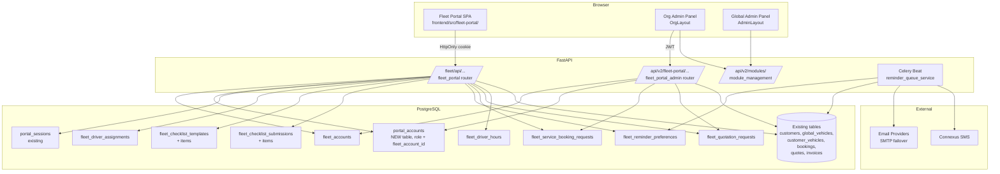
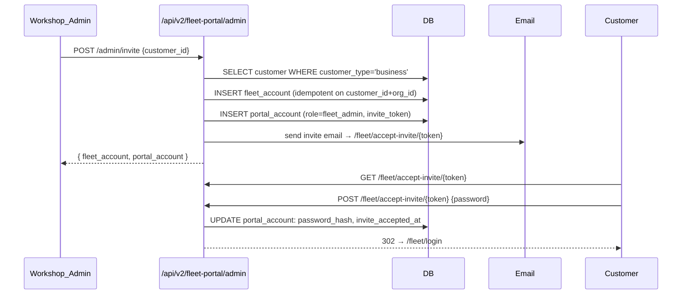

# Design Document — B2B Fleet Portal

## ⚠️ Naming Note (added during execution of task 1.1)

The spec originally proposed creating a new table named `fleet_accounts`. During task 1.1 a name collision was discovered with an existing migration-0002 `fleet_accounts` table (used by `customers` and `reports` modules). **The new table created by this feature is named `portal_fleet_accounts`**. Internal column names stay `fleet_account_id` and the ORM model class is `PortalFleetAccount`. All references to `fleet_accounts` below should be read as `portal_fleet_accounts`.

## Overview

The B2B Fleet Portal is a separate, password-authenticated web surface that lets business customers (fleet operators) of an automotive workshop self-service their fleet from anywhere. It is gated behind a new `b2b-fleet-management` module which depends on `vehicles` and is restricted to the `automotive-transport` trade family.

The portal is mounted at a distinct host path or subdomain (e.g. `/fleet/...` or `fleet.<domain>`) so it never shares chrome with the workshop's internal admin UI. Authentication uses a new `portal_accounts` table created by this feature (the design draft in `docs/future/portal-password-login.md` was never migrated — verified by `grepSearch portal_accounts` returning zero matches against `alembic/versions/`). The table is created with bcrypt hashing, invite/reset-token flows, and lockout state. It includes two portal user roles (`fleet_admin`, `driver`) and a new tenancy concept — the `Fleet_Account` — which links a portal tenant to an existing `customers` row of `customer_type='business'`. Portal users get full security parity with org users (configurable MFA / password policy / lockout / session policy / audit log) per Requirement 21.

The feature reuses platform infrastructure aggressively:

- `customers`, `global_vehicles`, `customer_vehicles`, `bookings`, `quotes`, `invoices`, `payments` for domain data.
- `portal_sessions` for HttpOnly cookie session management (4-hour inactivity).
- `module_registry` + `OrgModule` + `DEPENDENCY_GRAPH` (in `app/core/modules.py`) for enablement.
- `email_providers` and Connexus SMS for reminder delivery.
- The existing `notifications.reminder_queue_service` for WOF / COF reminder scheduling — extended to read `fleet_reminder_preferences` in addition to its existing per-vehicle config.
- Celery Beat for the reminder run loop.
- Postgres RLS for hard tenant isolation.

New surface area:

- 15 new tables: `portal_accounts` (created from scratch — the `docs/future/portal-password-login.md` proposal has never been migrated; verified by `grepSearch` returning zero matches in `alembic/versions/`), `portal_account_mfa_methods`, `portal_account_backup_codes`, `portal_account_password_history`, `portal_audit_log`, `portal_account_devices`, `fleet_accounts`, `fleet_driver_assignments`, `fleet_checklist_templates`, `fleet_checklist_template_items`, `fleet_checklist_submissions`, `fleet_checklist_submission_items`, `fleet_reminder_preferences`, `fleet_service_booking_requests`, `fleet_quotation_requests`, `fleet_driver_hours`. (Migration `0191_b2b_fleet_portal.py` — current head is 0190, not 0182 as the project overview steering doc states.)
- A self-contained portal frontend bundle (`frontend/src/fleet-portal/`) with its own router, layout, theming, security pages, and version-check polling.
- A native mobile surface in the existing OraInvoice mobile app (`mobile/src/screens/fleet-portal/`) that authenticates against `/fleet/api/auth/login` (separate from the staff `/auth/login`), routes Portal_Users into a Fleet_Portal_Mobile_Shell with role-appropriate bottom-tab navigation (Driver_User vs Fleet_Account_Admin), and reuses Konsta UI primitives + Capacitor 8 plugins (Camera for checklist photos, Push Notifications for booking/quote alerts, `@capgo/capacitor-native-biometric` for biometric unlock). The Capacitor 7 → 8 upgrade is a prerequisite implemented in task 19L per `docs/DEPENDENCY_AUDIT_2026_05.md`.
- A Workshop_Admin console mounted in the existing `OrgLayout` at `/fleet-portal-admin/...`, gated by `<ModuleGate module="b2b-fleet-management">`, including a Portal Settings page (Requirement 21.2), Account Detail page (Requirement 21.17), and a "View as Portal User" impersonation flow (Requirement 21.21).
- An NZTA-compliant default checklist seeded per Fleet_Account on first login.
- Trade-family gating implemented in code via a constant `TRADE_FAMILY_REQUIRED_MODULES: dict[str, str]` in `app/core/modules.py` (matches the `CORE_MODULES` pattern; no new DB column on `module_registry`, consistent with the setup-guide spec's decision documented in `.kiro/specs/setup-guide/design.md`).

Out of scope (explicitly): GPS tracking, telemetry, fuel cards, driver scoring, route optimisation, regulatory reporting beyond NZTA pre-trip.

## Architecture

### High-Level Component Diagram



### Authentication & Session Architecture

The portal extends the existing `PortalSession` + cookie pattern from `app/modules/portal/`. It does NOT reuse the staff JWT system — only `portal_accounts`-backed sessions grant access.

Auth flow:

1. Workshop_Admin invites a business customer → creates `portal_accounts` row (`portal_user_role='fleet_admin'`, `fleet_account_id=...`, `invite_token`).
2. Customer clicks invite link → sets password → `password_hash` stored, `invite_token` cleared.
3. Customer logs in at `/fleet/login` → server validates bcrypt → creates `portal_sessions` row → sets HttpOnly `fleet_portal_session` cookie scoped to the fleet host.
4. Subsequent requests under `/fleet/api/...` validate the cookie via a new `require_fleet_portal_session` FastAPI dependency.
5. The dependency resolves: `Workshop_Org` (via session→portal_account.org_id), `Fleet_Account` (via portal_account.fleet_account_id), `portal_user_role`, then re-checks `b2b-fleet-management` module is still enabled and both records are `is_active=true`. Failure of any check destroys the session and returns 403.

The portal is hosted on a distinct origin (subdomain) or path so that:

- The session cookie is scoped only to fleet portal traffic (no leak into staff origin).
- A staff JWT in `localStorage` from the same browser cannot accidentally grant fleet access.
- Workshop_Org is resolved from URL: subdomain (`<slug>.fleet.<domain>`), path (`/fleet/<slug>/...`), or single-tenant default (`FLEET_PORTAL_DEFAULT_ORG_SLUG`).

### Module Gating Architecture

The `b2b-fleet-management` module is a normal `module_registry` row with a `vehicles` AND-dependency, so the existing `ModuleService.enable_module()` auto-enables vehicles via `DEPENDENCY_GRAPH`.

Trade-family restriction is implemented **without a new DB column** to stay consistent with the existing setup-guide pattern (`.kiro/specs/setup-guide/design.md` Section 6 — "trade_family_gated not stored in DB"). A new constant in `app/core/modules.py`:

```python
TRADE_FAMILY_REQUIRED_MODULES: dict[str, str] = {
    "b2b-fleet-management": "automotive-transport",
    # add future trade-restricted modules here
}
```

- The module list endpoint (`GET /api/v2/modules`) filters out modules in this dict whose required trade family does not match the org's `tradeFamily`.
- The enable endpoint (`POST /api/v2/modules/{slug}/enable`) rejects with HTTP 403 when the org's trade family does not match.
- The setup-guide endpoint already excludes trade-gated modules; we extend its existing exclusion set to honour the new dict.

When the module is disabled or the org's trade family changes:

- All `portal_sessions` belonging to `portal_accounts` with `org_id` of that org are deleted (cascading session teardown).
- Subsequent `/fleet/api/...` calls return 403 and the SPA redirects to login.
- `/fleet/login` itself returns 404 (not "module disabled") to avoid org enumeration.

### Routing & URL Architecture

Backend prefixes:

| Audience | Prefix | Purpose |
|---|---|---|
| Portal users (browser) | `/fleet/api/auth/*` | login, logout, accept-invite, forgot-password, reset-password |
| Portal users | `/fleet/api/me` | current portal user + fleet account context |
| Portal users | `/fleet/api/vehicles/*` | fleet list, vehicle detail, odometer, hours |
| Portal users | `/fleet/api/checklists/*` | templates (admin), submissions (driver + admin) |
| Portal users | `/fleet/api/drivers/*` | invite, list, assign, deactivate (admin only) |
| Portal users | `/fleet/api/reminders/*` | preferences, ad-hoc SMS (admin only) |
| Portal users | `/fleet/api/bookings/*` | request, list, cancel |
| Portal users | `/fleet/api/quotes/*` | request, view, accept, decline (admin only) |
| Portal users | `/fleet/api/invoices/*` | list, detail, PDF (admin only) |
| Portal users | `/fleet/api/dashboard` | summary cards |
| Workshop staff | `/api/v2/fleet-portal/admin/*` | invite/revoke, fleet account list, booking & quote queues, checklist failure feed |

All `/fleet/api/...` endpoints return:

- Lists: `{ "items": [...], "total": N, "limit": L, "offset": O }`.
- Errors: `{ "detail": "<msg>" }`.
- Pagination params: `offset` (≥0), `limit` (1..100, default 20). `skip` is rejected.
- CSRF: double-submit cookie on all state-changing requests.

Frontend:

- `frontend/src/fleet-portal/` — separate entry composition.
- `<FleetPortalRouter>` chosen at the top of `App.tsx` based on `window.location.host.startsWith('fleet.')` or `window.location.pathname.startsWith('/fleet')`. Outside this match, the existing `OrgLayout` / `AdminLayout` routers run as today.
- `FleetPortalLayout` — own sidebar (Dashboard, Vehicles, Checklists, Drivers, Bookings, Quotes, Invoices, Reminders, Profile), own header (no admin chrome).
- `frontend/src/fleet-portal-admin/` — small set of pages mounted inside `OrgLayout`, gated by `<ModuleGate module="b2b-fleet-management">`.

### Reminder Architecture

`fleet_reminder_preferences` stores per-vehicle WOF / COF / service-due / registration preferences. The existing `reminder_queue_service` (`app/modules/notifications/reminder_queue_service.py`) is a two-phase queue: Phase 1 (`enqueue_customer_reminders`) renders the email/SMS body at queue time using org-level templates; Phase 2 (`process_reminder_queue_scheduled`, every 60 s) sends the pre-rendered body. Existing reminder types are `wof_expiry_reminder`, `cof_expiry_reminder`, `registration_expiry_reminder`, `service_due_reminder` (defined in `app/modules/notifications/schemas.py:27-32`).

This feature extends Phase 1 to ALSO scan `fleet_reminder_preferences`:

1. The org-wide reminder rules (existing `wof_rego_settings` table and other org-level config) — unchanged.
2. The new per-vehicle `fleet_reminder_preferences` rows — when present and `enabled=true`, they OVERRIDE the org-wide rule for that vehicle (per-customer customisation wins).

Reminder types in `fleet_reminder_preferences.reminder_type` use the **existing names** (`wof_expiry_reminder`, `cof_expiry_reminder`, `service_due_reminder`, `registration_expiry_reminder`) so that template resolution and audit trails are consistent across the org-wide and per-fleet paths. Date columns scanned are the existing `wof_expiry`, `cof_expiry`, `service_due_date`, and `registration_expiry` on `global_vehicles` / `org_vehicles` — no new date columns are created.

Idempotency: the existing `reminder_queue` table provides idempotency via `INSERT ... ON CONFLICT DO NOTHING` keyed on `(customer_id, vehicle_id, reminder_type, scheduled_date)` (verified in `app/modules/notifications/reminder_queue_service.py:424-430`). The fleet portal feature **reuses this exact mechanism** — there is no separate `notification_audit_log` table (verified absent via `grepSearch`). Failures are recorded on the `reminder_queue` row itself (`status = 'failed'`, `last_error`, `attempt_count`).

Retry policy is unchanged from Phase 2 (existing exponential-backoff retry handles SMTP/SMS failures — this feature does not reimplement retry logic).

SMS uses the existing Connexus integration with org-level credentials. If no SMS provider is configured for the org, SMS channels are disabled in the UI and rejected by the API.

### RLS and Tenant Isolation Architecture

Every new table has `org_id UUID NOT NULL` and a Postgres RLS policy `USING (org_id = current_setting('app.current_org_id')::uuid)`. The existing `_set_rls_org_id` mechanism (set at the start of every authenticated request) covers fleet portal sessions: the `require_fleet_portal_session` dependency calls `_set_rls_org_id(org_id_from_portal_account)` before any query runs.

Driver-level isolation is enforced at the application layer via `fleet_driver_assignments`:

- Driver_User vehicle list = `customer_vehicles` joined to `fleet_driver_assignments` filtered by `portal_account_id`.
- Any direct vehicle access by a driver is checked against `fleet_driver_assignments`. Missing assignment → HTTP 404 (not 403, to avoid leaking existence).

Cross-fleet isolation: every query also filters by `fleet_account_id`. This is application-level, not RLS-level, because the org owns multiple fleet accounts. A second RLS predicate (`OR fleet_account_id = current_setting('app.current_fleet_account_id')::uuid`) is added to fleet-specific tables to defend against missing application filters.

## Components and Interfaces

### Backend Module Layout

```
app/modules/fleet_portal/
├── __init__.py
├── router.py                  # /fleet/api/* (portal users)
├── admin_router.py            # /api/v2/fleet-portal/admin/* (workshop staff)
├── auth.py                    # password hashing, invite/reset tokens, lockout
├── dependencies.py            # require_fleet_portal_session, require_fleet_admin, require_module_enabled
├── models.py                  # SQLAlchemy ORM (all new tables)
├── schemas.py                 # Pydantic request/response
├── services/
│   ├── __init__.py
│   ├── account_service.py     # Fleet_Account + Portal_User invite, accept, revoke
│   ├── vehicle_service.py     # fleet vehicle list, driver-scoped view, edit gate
│   ├── checklist_service.py   # template CRUD, submission lifecycle, photo upload, NZTA seeding
│   ├── driver_service.py      # driver invite, assignment, activity stats, hours
│   ├── reminder_service.py    # preferences CRUD, ad-hoc SMS, service-due math
│   ├── booking_service.py     # request → bookings draft on accept
│   ├── quote_service.py       # request → quotes draft on accept; portal accept/decline
│   ├── invoice_service.py     # list + PDF (delegates to existing portal invoice service)
│   └── dashboard_service.py   # summary cards for admin and driver
└── nzta_template.py           # Static NZTA item definitions used by checklist seeder
```

### Key Service Interfaces

**FleetAccountService**

```python
async def invite_fleet_admin(
    db: AsyncSession,
    *,
    org_id: UUID,
    customer_id: UUID,
    invited_by_user_id: UUID,
) -> PortalAccount:
    """Idempotent: reuses fleet_account if customer already linked.
    Validates customer.customer_type == 'business'.
    Sends invitation email with /fleet/accept-invite/{token} link.
    """

async def accept_invite(
    db: AsyncSession,
    *,
    invite_token: str,
    new_password: str,
) -> PortalAccount:
    """Validates token freshness (≤ 7 days), enforces password rules,
    sets password_hash, clears invite_token, sets invite_accepted_at.
    """

async def revoke_access(db: AsyncSession, *, portal_account_id: UUID) -> None:
    """Sets is_active=False, deletes all portal_sessions for this account
    within 60 s (immediate delete in same transaction).
    """
```

**ChecklistService**

```python
async def seed_nzta_default_for_fleet(
    db: AsyncSession, *, org_id: UUID, fleet_account_id: UUID
) -> ChecklistTemplate:
    """Idempotent: returns existing system-seeded template if present.
    Inserts the canonical NZTA item set from nzta_template.py.
    """

async def start_submission(
    db: AsyncSession,
    *,
    org_id: UUID,
    portal_account_id: UUID,
    customer_vehicle_id: UUID,
) -> ChecklistSubmission:
    """Resolves template (vehicle override → fleet default → NZTA).
    Creates 'in_progress' submission with one item row per template item.
    """

async def complete_submission(
    db: AsyncSession,
    *,
    submission_id: UUID,
    item_results: list[ItemResult],  # result + notes + photo_url per item
) -> ChecklistSubmission:
    """Validates all required photos uploaded. Computes pass/fail counts.
    Sets status='completed', completed_at=now(). Emits notification if any failure.
    """
```

**ReminderService**

```python
async def upsert_preference(
    db: AsyncSession,
    *,
    org_id: UUID,
    fleet_account_id: UUID,
    customer_vehicle_id: UUID,
    reminder_type: Literal['wof','cof','service_due'],
    enabled: bool,
    lead_time_days: Literal[7, 14, 30],
    channels: list[Literal['email','sms']],
    recipients: list[Literal['fleet_admin','assigned_drivers']],
    service_interval_km: int | None,
    service_interval_months: int | None,
) -> FleetReminderPreference:
    """Validates: when enabled → at least one channel + one recipient.
    Validates: SMS channel only if org has SMS provider configured.
    """
```

### Frontend Component Structure

```
frontend/src/fleet-portal/
├── FleetPortalApp.tsx              # Top-level <FleetPortalRouter>
├── FleetPortalLayout.tsx           # Sidebar + header + auth guard
├── contexts/
│   ├── FleetSessionContext.tsx     # current portal_account, fleet_account, role
│   └── FleetCsrfContext.tsx        # CSRF token from cookie
├── api/
│   ├── client.ts                   # axios instance with /fleet/api baseURL + CSRF header
│   └── endpoints.ts                # typed wrappers per endpoint
├── pages/
│   ├── Login.tsx                   # /fleet/login
│   ├── AcceptInvite.tsx            # /fleet/accept-invite/:token
│   ├── ForgotPassword.tsx
│   ├── ResetPassword.tsx           # /fleet/reset-password/:token
│   ├── Dashboard.tsx               # /fleet/dashboard (admin + driver variants)
│   ├── VehicleList.tsx             # /fleet/vehicles
│   ├── VehicleDetail.tsx           # /fleet/vehicles/:id (edit + odometer + hours log)
│   ├── ChecklistTemplates.tsx      # admin only
│   ├── ChecklistTemplateEdit.tsx
│   ├── ChecklistSubmit.tsx         # /fleet/checklists/submit/:vehicleId
│   ├── ChecklistKiosk.tsx          # /fleet/kiosk/checklist (large touch targets)
│   ├── ChecklistHistory.tsx
│   ├── DriverList.tsx              # admin only
│   ├── DriverDetail.tsx            # admin only — assignments, activity
│   ├── DriverActivity.tsx          # admin only — per-driver activity report + CSV
│   ├── ReminderPreferences.tsx     # admin only
│   ├── BookingRequestForm.tsx
│   ├── BookingList.tsx
│   ├── QuoteRequestForm.tsx        # admin only
│   ├── QuoteList.tsx               # admin only
│   ├── QuoteDetail.tsx             # admin only — view + accept/decline
│   ├── InvoiceList.tsx             # admin only
│   ├── InvoiceDetail.tsx           # admin only
│   └── Profile.tsx
└── components/
    ├── ChecklistItemRow.tsx
    ├── PhotoUpload.tsx              # camera capture for failed-item evidence
    ├── ExpiryBadge.tsx              # WOF/COF status colours
    └── KioskButton.tsx              # ≥56×56 px

frontend/src/fleet-portal-admin/
├── pages/
│   ├── FleetPortalDashboard.tsx
│   ├── BookingQueue.tsx
│   ├── QuoteQueue.tsx
│   ├── FleetAccountList.tsx
│   └── ChecklistFailures.tsx
└── components/
    └── PortalAccessSection.tsx     # rendered on existing CustomerProfile
```

### Native Mobile App Structure (Fleet Portal)

The existing OraInvoice mobile app (`mobile/`) is extended in-place with a dedicated fleet portal surface. The staff app shell remains unchanged when the user is authenticated as a `User`; the fleet portal shell takes over when the user is authenticated as a `PortalAccount`.

**Steering doc note:** The `.kiro/steering/mobile-app.md` doc currently says the mobile app is "for organisation users only". This feature deliberately broadens that scope — Portal_Users (Fleet_Account_Admins, Driver_Users) are now a second, parallel audience. The doc SHALL be updated as part of this feature's implementation (task 19M.0) to add a "Fleet Portal Users" audience section alongside the existing "Organisation Users" section, documenting the dual auth flow and the discriminator (`authMode`).

```
mobile/src/
├── api/
│   └── client.ts                          # extended: detects auth mode, picks
│                                          #   /api/v1 (staff) or /fleet/api (portal)
│                                          #   for outbound calls
├── contexts/
│   └── AuthContext.tsx                    # extended: tracks authMode ('staff' | 'fleet')
│                                          #   in Capacitor Preferences
├── screens/
│   ├── auth/
│   │   ├── LoginScreen.tsx                # extended: "Sign in to Fleet Portal" link
│   │   ├── FleetLoginScreen.tsx           # NEW: /mobile/fleet/login
│   │   ├── FleetForgotPasswordScreen.tsx  # NEW
│   │   ├── FleetMfaVerifyScreen.tsx       # NEW: matches /fleet/login/mfa-verify flow
│   │   └── FleetMfaEnrollScreen.tsx       # NEW: TOTP QR + 6-digit confirm
│   └── fleet-portal/                      # NEW directory — all driver/admin screens
│       ├── FleetDashboardScreen.tsx
│       ├── MyVehiclesScreen.tsx           # driver-scoped
│       ├── FleetVehiclesScreen.tsx        # admin-scoped (full fleet)
│       ├── VehicleDetailScreen.tsx        # tap-to-open, log odometer/hours
│       ├── ChecklistSubmitScreen.tsx      # pre-trip flow with native camera
│       ├── ChecklistHistoryScreen.tsx
│       ├── HoursLogScreen.tsx             # driver
│       ├── DriversScreen.tsx              # admin
│       ├── BookingsScreen.tsx             # admin (with "+ New booking")
│       ├── RemindersScreen.tsx            # admin
│       ├── QuotesScreen.tsx               # admin
│       ├── InvoicesScreen.tsx             # admin (read-only + PDF download)
│       ├── MySecurityScreen.tsx           # change password, MFA, sessions
│       ├── FleetMoreScreen.tsx            # Driver / Admin variants
│       └── FleetKioskScreen.tsx           # depot-tablet kiosk mode (Req 24.18)
├── navigation/
│   └── FleetPortalRoutes.tsx              # NEW: routes mounted under /mobile/fleet/*
│                                          #      with FleetAuthGuard
└── components/
    └── konsta/
        └── (existing Konsta components reused: KonstaNavbar, StatusBadge, HapticButton)
```

The mobile auth context is extended:

```typescript
// mobile/src/contexts/AuthContext.tsx (additions)
type AuthMode = 'staff' | 'fleet'

interface PortalUser {
  id: string                               // portal_account_id
  email: string
  fleet_account_id: string
  portal_user_role: 'fleet_admin' | 'driver'
  org_id: string
  // ...
}

interface AuthContextValue {
  authMode: AuthMode
  staffUser: AuthUser | null               // existing
  portalUser: PortalUser | null            // new
  loginAsFleet: (creds) => Promise<{ mfaRequired: boolean }>
  logoutFleet: () => Promise<void>
  // ...
}
```

The API client is extended to choose the correct base URL:

```typescript
// mobile/src/api/client.ts (additions)
const fleetApiBase = Capacitor.isNativePlatform()
  ? 'https://devin.oraflows.co.nz/fleet/api'
  : '/fleet/api'

// New axios instance for fleet portal calls; uses session cookie not Bearer.
export const fleetApiClient = axios.create({
  baseURL: fleetApiBase,
  withCredentials: true,
  // CSRF interceptor reads `fleet_portal_csrf` cookie and sends X-CSRF-Token
})
```

Push notifications are extended with a new device-token table:

```sql
CREATE TABLE portal_account_devices (
  id UUID PRIMARY KEY DEFAULT gen_random_uuid(),
  org_id UUID NOT NULL,
  portal_account_id UUID NOT NULL REFERENCES portal_accounts(id) ON DELETE CASCADE,
  device_token VARCHAR(500) NOT NULL,
  platform VARCHAR(10) NOT NULL CHECK (platform IN ('ios', 'android')),
  created_at TIMESTAMPTZ NOT NULL DEFAULT now(),
  last_seen_at TIMESTAMPTZ NOT NULL DEFAULT now(),
  UNIQUE(portal_account_id, device_token)
);
```

The new `app/modules/push_notifications/` module (created by this feature) handles dispatch — see task 19M.9 for details. The mobile-side hook `mobile/src/hooks/usePushNotifications.ts` already exists from the existing app and is reused.

The fleet portal SPA follows the project's safe-API consumption rules: every `res.data?.x ?? fallback` and every `useEffect` API call uses `AbortController`.

### Data Flow Examples

**Driver completes a checklist with one failure:**

```mermaid
sequenceDiagram
    participant D as Driver (browser)
    participant FP as /fleet/api
    participant DB as PostgreSQL
    participant N as Notifications

    D->>FP: POST /fleet/api/checklists/start {vehicle_id}
    FP->>DB: SELECT template (vehicle override → fleet default → NZTA)
    FP->>DB: INSERT submission + items (status=in_progress)
    FP-->>D: { submission_id, items: [...] }

    D->>FP: PATCH /fleet/api/checklists/{id}/items/{i} {result:'fail', notes}
    D->>FP: POST /fleet/api/checklists/{id}/items/{i}/photo (multipart)
    FP->>FP: Save image to storage; record photo_url

    D->>FP: POST /fleet/api/checklists/{id}/complete
    FP->>FP: Validate every requires_photo_on_fail item with result=fail has photo
    FP->>DB: UPDATE submission status=completed, counts
    FP->>N: emit fleet_checklist_failure to fleet_admin + workshop admins
    FP-->>D: { submission, summary }
```

**Workshop_Admin invites a business customer:**



## Data Models

All new tables are created in a single migration `0191_b2b_fleet_portal.py` (the current Alembic head is `0190`, not `0182` as the project overview steering doc states — verified by `ls alembic/versions`). Every table has `org_id UUID NOT NULL`, `created_at`, `updated_at`, and a Postgres RLS policy keyed on `org_id`.

### `fleet_accounts`

Represents one business customer's portal tenant. One-to-one with `customers` (business customers only).

| Column | Type | Notes |
|---|---|---|
| `id` | UUID PK | gen_random_uuid() |
| `org_id` | UUID NOT NULL | FK organisations(id) |
| `customer_id` | UUID NOT NULL | FK customers(id), UNIQUE per org |
| `display_name` | VARCHAR(255) | defaults to customer's display_name |
| `is_active` | BOOLEAN NOT NULL DEFAULT true | |
| `created_at`, `updated_at` | TIMESTAMPTZ | |

Indexes: `(org_id, customer_id)` UNIQUE, `(org_id, is_active)`.

### `portal_accounts` (created in this migration — does not exist yet)

The `portal_accounts` table proposed in `docs/future/portal-password-login.md` has never been migrated. This feature creates it from scratch with the foundation columns plus the fleet-specific extensions and security-parity columns from Requirement 21.

| Column | Type | Notes |
|---|---|---|
| `id` | UUID PK | gen_random_uuid() |
| `org_id` | UUID NOT NULL | FK organisations(id) |
| `customer_id` | UUID NOT NULL | FK customers(id), distinguishes per-customer portal accounts |
| `email` | VARCHAR(255) NOT NULL | login identifier |
| `password_hash` | VARCHAR(255) NULL | bcrypt cost 12; NULL until invite accepted |
| `password_changed_at` | TIMESTAMPTZ NULL | for `password_policy.expiry_days` enforcement |
| `must_change_password` | BOOLEAN NOT NULL DEFAULT false | true after admin-initiated reset (Req 21.20) |
| `invite_token` | VARCHAR(255) NULL UNIQUE | one-time token for first password set |
| `invite_sent_at` | TIMESTAMPTZ NULL | freshness check (≤ 7 days) |
| `invite_accepted_at` | TIMESTAMPTZ NULL | |
| `reset_token` | VARCHAR(255) NULL UNIQUE | one-time forgot-password token |
| `reset_token_expires_at` | TIMESTAMPTZ NULL | freshness check (≤ 1 hour) |
| `is_active` | BOOLEAN NOT NULL DEFAULT true | revoked accounts have false |
| `is_locked_permanently` | BOOLEAN NOT NULL DEFAULT false | hit `permanent_lock_threshold` (Req 21.7) |
| `last_login_at` | TIMESTAMPTZ NULL | |
| `last_login_ip` | VARCHAR(45) NULL | for audit |
| `failed_login_attempts` | INTEGER NOT NULL DEFAULT 0 | reset on success |
| `locked_until` | TIMESTAMPTZ NULL | temporary lock window |
| `portal_user_role` | VARCHAR(20) NOT NULL | CHECK IN ('fleet_admin','driver') |
| `fleet_account_id` | UUID NULL | FK fleet_accounts(id) |
| `first_name` | VARCHAR(100) NULL | |
| `last_name` | VARCHAR(100) NULL | |
| `phone` | VARCHAR(50) NULL | |
| `mfa_required_at_next_login` | BOOLEAN NOT NULL DEFAULT false | enforces Req 21.14 |
| `created_at`, `updated_at` | TIMESTAMPTZ | |

Indexes: `(org_id, email)` UNIQUE, `(reset_token)` UNIQUE WHERE NOT NULL, `(invite_token)` UNIQUE WHERE NOT NULL, `(fleet_account_id, portal_user_role, is_active)`.

### `portal_account_mfa_methods`

Mirrors the staff `UserMfaMethod` table but rooted at `portal_account_id`. One row per enrolled method.

| Column | Type | Notes |
|---|---|---|
| `id` | UUID PK | |
| `org_id` | UUID NOT NULL | |
| `portal_account_id` | UUID NOT NULL | FK ON DELETE CASCADE |
| `method` | VARCHAR(20) NOT NULL | CHECK IN ('totp','sms','backup_codes') |
| `secret_encrypted` | BYTEA NULL | TOTP secret, envelope-encrypted (matches `app/core/encryption.py`) |
| `phone_number` | VARCHAR(50) NULL | for SMS only |
| `verified` | BOOLEAN NOT NULL DEFAULT false | true after enrolment confirmed |
| `is_default` | BOOLEAN NOT NULL DEFAULT false | one default per account |
| `created_at`, `last_verified_at` | TIMESTAMPTZ | |

Partial unique: `(portal_account_id, method)` UNIQUE; `(portal_account_id) WHERE is_default = true` UNIQUE.

### `portal_account_backup_codes`

Single-use backup codes (10 generated on first MFA enrolment, Req 21.12).

| Column | Type | Notes |
|---|---|---|
| `id` | UUID PK | |
| `org_id` | UUID NOT NULL | |
| `portal_account_id` | UUID NOT NULL | FK ON DELETE CASCADE |
| `code_hash` | VARCHAR(255) NOT NULL | bcrypt hash of the 10-char code |
| `consumed_at` | TIMESTAMPTZ NULL | NULL until used; one-time |
| `created_at` | TIMESTAMPTZ | |

### `portal_account_password_history`

Per-account history for `password_policy.history_count` enforcement (Req 21.5).

| Column | Type | Notes |
|---|---|---|
| `id` | UUID PK | |
| `org_id` | UUID NOT NULL | |
| `portal_account_id` | UUID NOT NULL | FK ON DELETE CASCADE |
| `password_hash` | VARCHAR(255) NOT NULL | bcrypt |
| `created_at` | TIMESTAMPTZ NOT NULL | for FIFO eviction beyond `history_count` |

Index: `(portal_account_id, created_at DESC)`.

### `portal_audit_log`

Records every Portal_User authentication event (Req 21.15) and admin-side actions (Req 21.18–21.21).

| Column | Type | Notes |
|---|---|---|
| `id` | UUID PK | |
| `org_id` | UUID NOT NULL | |
| `portal_account_id` | UUID NULL | NULL allowed for unknown-email login attempts |
| `actor_user_id` | UUID NULL | the Workshop_Admin for admin actions; NULL for self-actions |
| `action` | VARCHAR(80) NOT NULL | e.g. `portal_auth.login_success` |
| `ip_address` | VARCHAR(45) NULL | |
| `user_agent` | VARCHAR(500) NULL | |
| `details` | JSONB NULL | additional context |
| `created_at` | TIMESTAMPTZ NOT NULL DEFAULT now() | |

Indexes: `(portal_account_id, created_at DESC)`, `(org_id, action, created_at DESC)`.

### `portal_account_devices`

Records mobile device tokens for push notifications (Req 24.15). Created in migration 0191.

| Column | Type | Notes |
|---|---|---|
| `id` | UUID PK | |
| `org_id` | UUID NOT NULL | |
| `portal_account_id` | UUID NOT NULL | FK ON DELETE CASCADE |
| `device_token` | VARCHAR(500) NOT NULL | APNs / FCM token |
| `platform` | VARCHAR(10) NOT NULL | CHECK IN ('ios','android') |
| `app_version` | VARCHAR(50) NULL | sent by mobile on register |
| `os_version` | VARCHAR(50) NULL | |
| `created_at` | TIMESTAMPTZ | |
| `last_seen_at` | TIMESTAMPTZ NOT NULL DEFAULT now() | updated on each app focus |

UNIQUE: `(portal_account_id, device_token)`. Index: `(portal_account_id)` for batch lookups.

### `org_settings.portal_security_policy` (JSONB key)

Reuses the existing `organisations.settings` JSONB pattern (matching how staff `OrgSecuritySettings` is stored). Default values are inserted when the module is enabled. Schema mirrors `OrgSecuritySettings` exactly:

```json
{
  "mfa_policy": {"mode": "optional", "excluded_user_ids": []},
  "password_policy": {
    "min_length": 8, "require_uppercase": false, "require_lowercase": false,
    "require_digit": false, "require_special": false,
    "expiry_days": 0, "history_count": 0, "require_not_pwned": false
  },
  "lockout_policy": {
    "temp_lock_threshold": 5, "temp_lock_minutes": 30,
    "permanent_lock_threshold": 10
  },
  "session_policy": {
    "idle_timeout_minutes": 240, "max_sessions_per_user": 5,
    "refresh_token_expire_days": 7
  }
}
```

### `fleet_driver_assignments`

| Column | Type | Notes |
|---|---|---|
| `id` | UUID PK | |
| `org_id` | UUID NOT NULL | |
| `fleet_account_id` | UUID NOT NULL | FK |
| `portal_account_id` | UUID NOT NULL | FK portal_accounts(id), driver |
| `customer_vehicle_id` | UUID NOT NULL | FK customer_vehicles(id) |
| `assigned_at` | TIMESTAMPTZ NOT NULL DEFAULT now() | |
| `assigned_by_portal_account_id` | UUID NOT NULL | the fleet admin |

Indexes: `(portal_account_id, customer_vehicle_id)` UNIQUE, `(customer_vehicle_id)`.

### `fleet_checklist_templates`

| Column | Type | Notes |
|---|---|---|
| `id` | UUID PK | |
| `org_id` | UUID NOT NULL | |
| `fleet_account_id` | UUID NOT NULL | FK |
| `name` | VARCHAR(200) NOT NULL | |
| `description` | TEXT NULL | |
| `is_default` | BOOLEAN NOT NULL DEFAULT false | only one true per fleet_account |
| `is_system_seeded` | BOOLEAN NOT NULL DEFAULT false | true for the NZTA seed |
| `archived_at` | TIMESTAMPTZ NULL | |
| `created_at`, `updated_at` | TIMESTAMPTZ | |

Partial unique index: `(fleet_account_id) WHERE is_default = true` enforces one default per fleet.

### `fleet_checklist_template_items`

| Column | Type | Notes |
|---|---|---|
| `id` | UUID PK | |
| `org_id` | UUID NOT NULL | |
| `template_id` | UUID NOT NULL | FK fleet_checklist_templates(id) ON DELETE CASCADE |
| `category` | VARCHAR(80) NOT NULL | 'tyres', 'lights', etc. |
| `label` | VARCHAR(200) NOT NULL | |
| `description` | VARCHAR(500) NULL | |
| `requires_photo_on_fail` | BOOLEAN NOT NULL DEFAULT false | |
| `display_order` | INTEGER NOT NULL | |

Index: `(template_id, display_order)`.

### `fleet_checklist_submissions`

| Column | Type | Notes |
|---|---|---|
| `id` | UUID PK | |
| `org_id` | UUID NOT NULL | |
| `fleet_account_id` | UUID NOT NULL | |
| `customer_vehicle_id` | UUID NOT NULL | |
| `template_id` | UUID NOT NULL | |
| `portal_account_id` | UUID NOT NULL | the driver |
| `status` | VARCHAR(20) NOT NULL | 'in_progress' \| 'completed' \| 'cancelled' |
| `started_at` | TIMESTAMPTZ NOT NULL | |
| `completed_at` | TIMESTAMPTZ NULL | |
| `passed_item_count` | INTEGER NOT NULL DEFAULT 0 | |
| `failed_item_count` | INTEGER NOT NULL DEFAULT 0 | |
| `na_item_count` | INTEGER NOT NULL DEFAULT 0 | |

Indexes: `(fleet_account_id, completed_at DESC)`, `(customer_vehicle_id, completed_at DESC)`, `(portal_account_id, completed_at DESC)`.

### `fleet_checklist_submission_items`

| Column | Type | Notes |
|---|---|---|
| `id` | UUID PK | |
| `org_id` | UUID NOT NULL | |
| `submission_id` | UUID NOT NULL | FK ON DELETE CASCADE |
| `template_item_id` | UUID NOT NULL | snapshot reference |
| `category` | VARCHAR(80) | snapshot |
| `label` | VARCHAR(200) | snapshot |
| `requires_photo_on_fail` | BOOLEAN | snapshot |
| `result` | VARCHAR(10) NULL | 'pass' \| 'fail' \| 'na' |
| `notes` | VARCHAR(500) NULL | |
| `photo_urls` | JSONB NOT NULL DEFAULT '[]' | array of storage URLs |
| `recorded_at` | TIMESTAMPTZ NULL | |

Snapshotting `category` / `label` / `requires_photo_on_fail` keeps history intact even if templates are later edited.

### `fleet_reminder_preferences`

| Column | Type | Notes |
|---|---|---|
| `id` | UUID PK | |
| `org_id` | UUID NOT NULL | |
| `fleet_account_id` | UUID NOT NULL | |
| `customer_vehicle_id` | UUID NOT NULL | |
| `reminder_type` | VARCHAR(40) NOT NULL | One of `'wof_expiry_reminder'`, `'cof_expiry_reminder'`, `'service_due_reminder'`, `'registration_expiry_reminder'` (matches existing reminder type names from `app/modules/notifications/schemas.py:27-32`). |
| `enabled` | BOOLEAN NOT NULL DEFAULT false | |
| `lead_time_days` | INTEGER NOT NULL DEFAULT 14 | CHECK IN (7,14,30) |
| `channels` | JSONB NOT NULL DEFAULT '[]' | subset of ['email','sms'] |
| `recipients` | JSONB NOT NULL DEFAULT '[]' | subset of ['fleet_admin','assigned_drivers'] |
| `service_interval_km` | INTEGER NULL | for service_due only |
| `service_interval_months` | INTEGER NULL | for service_due only |
| `created_at`, `updated_at` | TIMESTAMPTZ | |

UNIQUE: `(customer_vehicle_id, reminder_type)`.

### `fleet_service_booking_requests`

| Column | Type | Notes |
|---|---|---|
| `id` | UUID PK | |
| `org_id` | UUID NOT NULL | |
| `fleet_account_id` | UUID NOT NULL | |
| `customer_vehicle_id` | UUID NOT NULL | |
| `requested_by_portal_account_id` | UUID NOT NULL | |
| `preferred_date` | DATE NOT NULL | |
| `preferred_slot` | VARCHAR(20) NOT NULL | 'morning' \| 'afternoon' \| 'all_day' |
| `service_description` | TEXT NOT NULL | min 10 chars |
| `notes` | TEXT NULL | |
| `status` | VARCHAR(20) NOT NULL DEFAULT 'pending' | pending \| accepted \| declined \| completed \| cancelled |
| `decline_reason` | TEXT NULL | |
| `booking_id` | UUID NULL | FK bookings(id) once accepted |
| `created_at`, `updated_at` | TIMESTAMPTZ | |

### `fleet_quotation_requests`

| Column | Type | Notes |
|---|---|---|
| `id` | UUID PK | |
| `org_id` | UUID NOT NULL | |
| `fleet_account_id` | UUID NOT NULL | |
| `customer_vehicle_id` | UUID NOT NULL | |
| `requested_by_portal_account_id` | UUID NOT NULL | |
| `service_description` | TEXT NOT NULL | min 10 chars |
| `notes` | TEXT NULL | |
| `status` | VARCHAR(20) NOT NULL DEFAULT 'pending' | pending \| quoted \| accepted \| declined \| expired \| cancelled |
| `quote_id` | UUID NULL | FK quotes(id) once linked |
| `created_at`, `updated_at` | TIMESTAMPTZ | |

### `fleet_driver_hours`

| Column | Type | Notes |
|---|---|---|
| `id` | UUID PK | |
| `org_id` | UUID NOT NULL | |
| `fleet_account_id` | UUID NOT NULL | |
| `customer_vehicle_id` | UUID NOT NULL | |
| `portal_account_id` | UUID NOT NULL | the driver |
| `start_at` | TIMESTAMPTZ NOT NULL | |
| `end_at` | TIMESTAMPTZ NOT NULL | CHECK end_at >= start_at |
| `notes` | TEXT NULL | |
| `created_at` | TIMESTAMPTZ | |

Indexes: `(portal_account_id, start_at DESC)`, `(customer_vehicle_id, start_at DESC)`.

### Module Registry Row

Inserted via migration. Trade-family restriction is enforced in code (see `TRADE_FAMILY_REQUIRED_MODULES` constant), not via a DB column — consistent with the setup-guide spec's pattern.

```sql
INSERT INTO module_registry (slug, display_name, description, category, is_core,
    dependencies, status, setup_question, setup_question_description)
VALUES (
  'b2b-fleet-management',
  'B2B Fleet Management',
  'Self-service portal for business customers to manage vehicle fleets.',
  'fleet_management',
  false,
  '["vehicles"]'::jsonb,
  'available',
  'Do your business customers need a self-service portal to manage their vehicle fleet?',
  'Let fleet operators log in to view vehicles, invite drivers, run NZTA pre-trip checklists, book services, request quotes, and manage WOF/COF reminders.'
)
ON CONFLICT (slug) DO NOTHING;
```

The accompanying code change adds `b2b-fleet-management` to `TRADE_FAMILY_REQUIRED_MODULES['b2b-fleet-management'] = 'automotive-transport'` in `app/core/modules.py`.

### NZTA Default Template Items

Defined statically in `app/modules/fleet_portal/nzta_template.py` and seeded per fleet account on first fleet-admin login. The seeder is idempotent (skips if a system-seeded template already exists for the fleet account).

```python
NZTA_ITEMS: list[NZTAItem] = [
    # Tyres
    ("tyres", "Tread depth ≥ 1.5 mm on all tyres", True),
    ("tyres", "No visible damage, cuts, or bulges", True),
    ("tyres", "Tyre pressure correct", False),
    # Lights
    ("lights", "Headlights — low beam working", True),
    ("lights", "Headlights — high beam working", True),
    ("lights", "Brake lights working", True),
    ("lights", "Front indicators working", True),
    ("lights", "Rear indicators working", True),
    ("lights", "Hazard lights working", True),
    ("lights", "Reversing light working", False),
    ("lights", "Number plate light working", False),
    # Brakes
    ("brakes", "Foot brake responsive", True),
    ("brakes", "Parking brake holds vehicle", True),
    ("brakes", "No brake warning lights on dash", True),
    # Mirrors
    ("mirrors", "Side mirrors clean and adjusted", False),
    ("mirrors", "Rear-view mirror clean and adjusted", False),
    # Windows / Wipers
    ("windows_wipers", "Windscreen free of cracks obstructing view", True),
    ("windows_wipers", "Wipers and washers functional", False),
    # Fluids
    ("fluids", "Engine oil level OK", False),
    ("fluids", "Coolant level OK", False),
    ("fluids", "Washer fluid level OK", False),
    # Body / Load
    ("body_load", "Load secured", True),
    ("body_load", "Doors close and latch", False),
    ("body_load", "No fluid leaks visible underneath", True),
    # Signage
    ("signage", "Registration label current", False),
    ("signage", "WOF / COF label visible (if applicable)", False),
    ("signage", "Reflective tape and hazard signage where required", False),
    # Horn
    ("horn", "Horn audible", False),
    # Seatbelts
    ("seatbelts", "All seatbelts present and functional", True),
]
```

The third tuple element is `requires_photo_on_fail`. The set above covers every NZTA item enumerated in Requirement 8.2.


## Correctness Properties

*A property is a characteristic or behavior that should hold true across all valid executions of a system — essentially, a formal statement about what the system should do. Properties serve as the bridge between human-readable specifications and machine-verifiable correctness guarantees.*

The properties below were derived from the prework analysis with redundancy elimination — many acceptance criteria collapse into a smaller set of universal invariants (e.g. tenant isolation, role gating, status state machines, expiry math) that are tested once across all relevant entry points.

### Property 1: Trade-family gating governs both visibility and enableability

*For any* organisation and *for any* trade family, the `b2b-fleet-management` module is visible in the module list AND can be enabled if and only if the trade family equals `automotive-transport`. Disabling the module, or having a non-matching trade family, simultaneously hides the UI affordance and rejects enable requests with HTTP 403.

**Validates: Requirements 1.2, 1.3**

### Property 2: Module dependency auto-resolution

*For any* organisation state, calling `enable_module('b2b-fleet-management')` results in the `vehicles` module also being enabled (transitively via `DEPENDENCY_GRAPH`).

**Validates: Requirements 1.4**

### Property 3: Module-disabled gate is uniform and existence-preserving

*For any* organisation with the `b2b-fleet-management` module disabled, *for any* request to `/fleet/api/...`, the response is HTTP 403 with the disabled-module message; *for any* request to `/fleet/login`, the response is HTTP 404 (indistinguishable from an unknown org); and *for any* active fleet portal session at the moment the module is disabled, no further authenticated request from that session succeeds (sessions are torn down within 60 s and subsequent calls return 403).

**Validates: Requirements 1.5, 1.6, 1.7, 17.6**

### Property 4: Workshop_Org URL resolution is deterministic

*For any* incoming `/fleet/...` URL, the resolver returns exactly one `Workshop_Org` (chosen by precedence: subdomain → path slug → `FLEET_PORTAL_DEFAULT_ORG_SLUG`) or HTTP 404; the resolver never silently picks a different org and never falls through to the staff `/login` page.

**Validates: Requirements 2.3, 2.4**

### Property 5: Staff JWTs cannot access fleet portal endpoints

*For any* valid staff JWT and *for any* fleet portal endpoint under `/fleet/api/...`, the response is HTTP 401; only a valid `fleet_portal_session` cookie grants access.

**Validates: Requirements 2.5, 2.6**

### Property 6: Login lockout state machine

*For any* portal account with initial state `(failed_login_attempts=N, locked_until=T)` and *for any* sequence of login attempts:

- Each invalid attempt while unlocked (`T ≤ now()`) increments `failed_login_attempts` by 1 and returns HTTP 401 with the generic "Invalid email or password" message.
- When `failed_login_attempts` reaches 5 within a single unlocked window, `locked_until` becomes `now() + 30 minutes` and the response becomes HTTP 403.
- While `locked_until > now()`, attempts return HTTP 403 and `failed_login_attempts` does not increment further.
- A successful login (only possible when unlocked) sets `failed_login_attempts=0`, `locked_until=NULL`, and updates `last_login_at=now()`.
- An account with `is_active=false` always returns HTTP 403 with the revoked message regardless of the rest of the state.

**Validates: Requirements 3.2, 3.3, 3.4, 3.5, 3.6, 4.10**

### Property 7: Password storage and validation rules

*For any* candidate password and *for any* portal account email, the validator accepts the password iff its length is ≥ 8 AND its lowercase form is not equal to the lowercase local-part of the email; the stored `password_hash` is a bcrypt hash with cost factor 12 that verifies against the original plaintext; the plaintext password never appears in any persisted column or log line.

**Validates: Requirements 3.7, 3.8**

### Property 8: Forgot-password is anti-enumerating

*For any* submitted email (existing or non-existing), the response from `POST /fleet/api/auth/forgot-password` has identical HTTP status code and body. When the email matches an existing active account, a `reset_token` (URL-safe, length ≥ 32) and `reset_token_expires_at = now() + 1 hour` are persisted as a side effect; otherwise no row is mutated. The response timing has no observable signal beyond ordinary jitter.

**Validates: Requirements 3.9, 3.10**

### Property 9: Token validity predicate

*For any* token (`reset_token` or `invite_token`) with a sent timestamp `S` and a used flag `U`, the token is accepted by its respective endpoint iff `U = false` AND `now() - S ≤ token_max_age` (1 hour for reset, 7 days for invite). Acceptance updates the corresponding password hash, clears the token, resets failure counters, and marks the token as consumed; subsequent presentation of the same token is rejected.

**Validates: Requirements 3.11, 3.12, 4.4, 4.5, 4.6, 4.9, 5.4**

### Property 10: CSRF and rate limits gate state-changing requests

*For any* `POST`/`PUT`/`PATCH`/`DELETE` request to `/fleet/api/...`, the request is processed only when the double-submit CSRF token in the header matches the cookie. *For any* sequence of `N` requests in a 60-second window from the same source, the requests numbered `limit+1..N` return HTTP 429 (limits: 10/min for login, 3/min per email for forgot-password).

**Validates: Requirements 3.14, 3.15**

### Property 11: Role gate — driver vs. fleet_admin

*For any* portal account with `portal_user_role = 'driver'`, requests to admin-only endpoints (drivers management, checklist template management, reminder preferences, quotation requests, invoice list/detail/PDF, driver activity) return HTTP 403 with the message "This action requires Fleet Account Admin access". *For any* portal account with `portal_user_role = 'fleet_admin'`, the same endpoints succeed (subject to other invariants).

**Validates: Requirements 5.1, 12.1, 13.7, 14.1, 17.5**

### Property 12: Tenant and fleet isolation

*For any* fleet portal session bound to `(org_id=O, fleet_account_id=F)` and *for any* resource (vehicle, submission, booking, quote, invoice, reminder preference, driver, hours record), the resource is reachable iff the resource's `org_id = O` AND its `fleet_account_id = F`. Any attempt to access a resource with a different `(org_id, fleet_account_id)` returns HTTP 404 (not 403). The same predicate is enforced both by the application-level WHERE filters and by Postgres RLS policies on every new table.

**Validates: Requirements 6.9, 13.6, 17.1, 17.2, 17.3**

### Property 13: Driver-vehicle visibility via assignments

*For any* portal account with `portal_user_role = 'driver'` and *for any* `customer_vehicle_id`, the vehicle is reachable by that driver iff a `fleet_driver_assignments` row exists with `(portal_account_id, customer_vehicle_id)` matching. Vehicle list endpoints, vehicle detail endpoints, hours-log endpoints, odometer-log endpoints, and checklist-start endpoints all enforce this predicate identically; missing assignment returns HTTP 404. Round-trip property: assigning then removing a `(driver, vehicle)` pair returns the visibility set to its original state.

**Validates: Requirements 5.5, 5.6, 5.8, 7.1, 9.1, 17.4**

### Property 14: Per-role field allowlist for vehicle edits

*For any* portal account, *for any* attempted set of edited fields on a `customer_vehicle` / `global_vehicle`, the edit is accepted iff every edited field is in the allowlist for the user's role:

- `fleet_admin`: internal fleet name, fleet number, notes, colour, odometer, WOF/COF expiry (where the workshop permits customer entry), `service_due_date` (on the underlying `global_vehicles` / `org_vehicles` row).
- `driver`: odometer reading, driving hours, `service_due_date` (on the underlying `global_vehicles` / `org_vehicles` row).

Any edit touching a non-allowlisted field is rejected with HTTP 403 and the disallowed-field message; `make`, `model`, `year`, `vin`, and `rego` are never editable from the portal.

**Validates: Requirements 6.6, 7.2, 7.3, 7.4**

### Property 15: Odometer monotonicity

*For any* customer vehicle and *for any* sequence of odometer reading submissions, only readings strictly greater than the maximum of all previously persisted readings for that vehicle are accepted; rejections return HTTP 400 with a message containing the current maximum value. After any accepted submission, `max(odometer_readings) = max(previous_max, submitted_value)` (which is also `submitted_value`).

**Validates: Requirements 7.6, 7.7**

### Property 16: Expiry-status badge function

*For any* (`expiry_date`, `today`) pair, the badge function returns:

- `red` (Expired) iff `expiry_date < today`.
- `amber` (Expiring soon) iff `today ≤ expiry_date ≤ today + 28 days`.
- `green` (OK) iff `expiry_date > today + 28 days`.

These three cases are exhaustive and disjoint; the same function powers both fleet admin and driver views.

**Validates: Requirements 6.3, 6.4, 7.8**

### Property 17: Fleet summary aggregations

*For any* set of customer vehicles in a fleet, the summary card values are equal to direct enumerations of the same set:

- `total_vehicles` = `|fleet|`.
- `valid_wof_cof` = `|{ v ∈ fleet : v.wof_expiry > today AND v.cof_expiry > today }|`.
- `expiring_within_28` = `|{ v ∈ fleet : badge(v.wof_expiry, today) = 'amber' OR badge(v.cof_expiry, today) = 'amber' }|`.
- `service_overdue` = `|{ v ∈ fleet : v.service_due_date < today }|` (using the existing column on `global_vehicles` / `org_vehicles`).
- `checklists_completed_today` = `|{ s ∈ submissions : s.completed_at::date = today }|`.

Recent-failure panels and pending-booking/quote panels follow the same enumeration-equality property over their respective sources.

**Validates: Requirements 6.8, 15.2, 15.3, 15.4, 15.5, 15.6**

### Property 18: NZTA seed is idempotent and complete

*For any* fleet account and *for any* number of repeated calls to `seed_nzta_default_for_fleet`, the result is exactly one template per fleet with `is_system_seeded = true`, and the set of items on that template is exactly the canonical NZTA item set (every label and category from the spec is present, and no extras). The seeded template is non-editable, non-deletable, and non-archivable; the only allowed action is clone, which produces a fresh editable template with the same item set.

**Validates: Requirements 8.1, 8.2, 8.3, 8.8**

### Property 19: At-most-one default checklist template per fleet

*For any* fleet account and *for any* sequence of "set as default" operations, the post-state has at most one `fleet_checklist_templates` row with `is_default = true`. Setting a new default automatically clears the previous default. The default-template setter is an idempotent operation (setting the same default twice is a no-op).

**Validates: Requirements 8.5**

### Property 20: Template resolution for submissions

*For any* customer vehicle, the template used to start a checklist submission is resolved by the precedence:

1. `customer_vehicles.fleet_checklist_template_id` if set.
2. The fleet's default template (`is_default = true`) if any.
3. The NZTA system-seeded template.

The resolver is total (always returns a template) for any vehicle in a fleet that has had its NZTA seed.

**Validates: Requirements 8.6**

### Property 21: Template item CRUD round-trip

*For any* non-system, non-archived template and *for any* sequence of item add/edit/reorder/delete operations, the read-back item list reflects the operations exactly (same labels, categories, descriptions, requires_photo_on_fail flags, and display_order). Cloning a template is the inverse of "extract item list" — clone followed by item read-back equals the source's item read-back.

**Validates: Requirements 8.4**

### Property 22: Templates referenced by submissions cannot be hard-deleted

*For any* template, hard-delete is accepted iff zero non-archived submissions reference the template; if references exist, the operation is rejected and the user is offered archive (`archived_at = now()`) instead, which always succeeds. Submissions reference templates via snapshot-based fields, so archiving a template does not break historical submission rendering.

**Validates: Requirements 8.7, 9.10**

### Property 23: Photo evidence enforcement at completion

*For any* submission and *for any* item in it, completion is accepted iff the predicate `(item.requires_photo_on_fail AND item.result = 'fail') ⇒ |item.photo_urls| ≥ 1` holds for every item. The predicate is checked exclusively at the completion call (not on individual item updates). Rejection returns HTTP 400 with a message naming a missing-photo item.

**Validates: Requirements 9.2, 9.3, 9.4, 9.5**

### Property 24: Submission completion finalises counts and emits exactly the failure-driven notification

*For any* submission with item results `R = (r_1, …, r_n)`, after `complete_submission` the persisted counts equal `(passed=|{r_i=pass}|, failed=|{r_i=fail}|, na=|{r_i=na}|)`, `completed_at` equals the call time, and `status = 'completed'`. A `fleet_checklist_failure` notification is emitted to the fleet admin and workshop admins iff `failed > 0`; otherwise no notification is emitted. Once `status = 'completed'`, further item-level edits are rejected.

**Validates: Requirements 9.6, 9.7**

### Property 25: Reminder preference validity

*For any* preference write `(enabled, channels, recipients, lead_time_days, reminder_type, sms_provider_configured)`, the write is accepted iff:

- `enabled = false`, OR
- `enabled = true` AND `|channels| ≥ 1` AND `|recipients| ≥ 1` AND `lead_time_days ∈ {7, 14, 30}` AND (`'sms' ∉ channels` OR `sms_provider_configured = true`).

Rejected writes leave the database unchanged and return HTTP 400 with the specific validation message; accepted writes are round-trippable (read-back yields the exact same preference values for `enabled`, `channels`, `recipients`, `lead_time_days`, `service_interval_km`, `service_interval_months`).

**Validates: Requirements 10.2, 10.3, 10.8**

### Property 26: Reminder firing is idempotent per (customer, vehicle, type, scheduled_date)

*For any* number of executions of the reminder Celery Beat task in the same scheduled-date window, exactly one notification is sent per `(customer_id, vehicle_id, reminder_type, scheduled_date)` key (the existing `reminder_queue` table's unique index, verified in `app/modules/notifications/reminder_queue_service.py:424-430`); subsequent runs see the existing row and `INSERT ... ON CONFLICT DO NOTHING` skips. Re-firing a reminder requires a new key (a different `scheduled_date`).

**Validates: Requirements 10.4, 10.5, 10.6**

### Property 27: Service-due math

*For any* `(last_service_at, last_odometer, current_odometer, interval_km, interval_months)`, the computed `service_due_date` is the earlier of:

- `last_service_at + interval_months months` (if `interval_months` set, else `+∞`).
- The projected date when the odometer is expected to reach `last_odometer + interval_km` (if `interval_km` set and the vehicle's odometer trend is positive, else `+∞`); when no trend can be derived, the km-component is treated as `+∞`.

When neither interval is set, the function returns `NULL` and no service-due reminder is fired.

**Validates: Requirements 10.6**

### Property 28: Reminder defaults are off on add-vehicle

*For any* vehicle newly linked to a fleet account, all three reminder types (`wof`, `cof`, `service_due`) default to `enabled = false`; no notifications fire for that vehicle until the fleet admin enables a preference.

**Validates: Requirements 10.9**

### Property 29: Reminder retry policy

*For any* reminder send attempt that fails (SMTP error, SMS gateway error), the reminder service retries up to 3 attempts total with delays `[1 s, 2 s, 4 s]` between attempts. After 3 failures, the reminder is recorded on the existing `reminder_queue` row (`status = 'failed'`, `attempt_count = 3`, `last_error` populated) and the same `(customer_id, vehicle_id, reminder_type, scheduled_date)` key is not retried within the current scheduled-date window thanks to the unique index.

**Validates: Requirements 10.10**

### Property 30: Booking/Quote request validation predicate

*For any* booking-request submission `(vehicle_id, preferred_date, preferred_slot, service_description)` from a portal user, the request is accepted iff:

- The vehicle is in the user's accessible vehicle set (Property 13 for drivers; full fleet for admin).
- `preferred_date >= today` (in the workshop's timezone).
- `preferred_slot ∈ {'morning', 'afternoon', 'all_day'}`.
- `|service_description| >= 10` characters.

Quote requests use the same vehicle predicate (admin-only by Property 11) and the same description predicate. Accepted submissions create the corresponding `fleet_service_booking_requests` / `fleet_quotation_requests` row and emit a notification to all workshop admins of the workshop org.

**Validates: Requirements 11.1, 11.2, 11.3, 12.1, 12.2**

### Property 31: Booking/Quote status state machines

*For any* booking request, the state machine has transitions:

- `pending → accepted` (by workshop admin, creates draft `bookings` row, sets `booking_id`, emails requester).
- `pending → declined` (by workshop admin, stores optional reason, emails requester).
- `pending → cancelled` (by requester only, while still pending).
- `accepted → completed` (driven by external booking lifecycle).

For any quotation request, the state machine has transitions:

- `pending → quoted` (when workshop admin links a `quotes` row, emails fleet admin).
- `quoted → accepted` (by fleet admin, marks underlying quote accepted, emits notification).
- `quoted → declined` (by fleet admin, marks underlying quote declined, emits notification).
- `quoted → expired` (when underlying quote `valid_until < now()`; rejects further accept calls).

Any other transition attempt is rejected with HTTP 400. The current status is consistent with the linked `bookings` / `quotes` row at all times.

**Validates: Requirements 11.4, 11.5, 11.6, 11.8, 12.3, 12.5, 12.6, 12.7**

### Property 32: Pagination and list response shape

*For any* `/fleet/api/...` list endpoint with parameters `(offset, limit)` such that `0 ≤ offset` and `1 ≤ limit ≤ 100`, the response has shape `{ "items": [...], "total": N, "limit": L, "offset": O }` with `|items| = min(limit, max(0, total - offset))`. For `total = T` items and any partition of `[0, T)` into adjacent `(offset, limit)` pages, the union of returned `items` arrays equals the full set and the pages are disjoint. Requests that pass `skip` instead of `offset` are rejected with HTTP 422; requests with `limit > 100` are rejected with HTTP 422; the list endpoint never returns a bare array.

**Validates: Requirements 13.1, 13.3, 18.1, 18.2**

### Property 33: Activity aggregation for drivers

*For any* date range `[d_start, d_end]` and any driver, the activity aggregates equal direct enumerations:

- `total_km` = `max(odometer_in_range) - min(odometer_in_range)` over `odometer_readings` recorded by that portal account in the range (or 0 when fewer than two records).
- `total_hours` = `sum(end_at - start_at)` over `fleet_driver_hours` rows for that driver in the range.
- `checklist_count` = number of submissions completed in the range.
- `checklist_failures` = subset of those with `failed_item_count > 0`.

The CSV export contains exactly one row per `(date, vehicle)` pair where any activity occurred in the range, with column values matching the per-vehicle breakdown.

**Validates: Requirements 14.2, 14.3, 14.4, 14.5**

### Property 34: Touch target sizes

*For any* interactive element (button, link, input, toggle row, checkbox, radio) rendered in the fleet portal SPA at a viewport ≥ 320 px wide, the element's bounding box has both width ≥ 44 px and height ≥ 44 px. *For any* interactive element rendered under the kiosk path `/fleet/kiosk/...`, both dimensions are ≥ 56 px and the font size is ≥ 18 px.

**Validates: Requirements 9.11, 19.2, 19.3**

### Property 35: Configurable password policy enforcement

*For any* `PasswordPolicy` configuration (`min_length`, `require_uppercase`, `require_lowercase`, `require_digit`, `require_special`, `expiry_days`, `history_count`, `require_not_pwned`) and *for any* candidate password presented to `validate_password_against_policy(password, email, policy, history)`, the password is accepted iff every clause of the policy passes (length ≥ `min_length`; lowercase form not equal to the email's local-part; required character classes present; lowercase-form not bcrypt-matching any of the last `history_count` historical hashes; if `require_not_pwned` then SHA-1 prefix-suffix not present in the HIBP response). On acceptance, the persisted `password_hash` is a bcrypt cost-12 hash that round-trips, and the previous hash is appended to `portal_account_password_history` with FIFO eviction beyond `history_count`. Rejected writes leave the database unchanged and return HTTP 400 with a message naming the violated clause.

**Validates: Requirements 21.3, 21.4, 21.5, 21.6**

### Property 36: Configurable lockout policy enforcement (temporary + permanent)

*For any* `LockoutPolicy` configuration `(temp_lock_threshold, temp_lock_minutes, permanent_lock_threshold)` with `permanent_lock_threshold > temp_lock_threshold` and *for any* sequence of login attempts on a Portal_User:

- The `failed_login_attempts` counter increments on each invalid attempt while unlocked, and resets to 0 on success.
- Reaching `temp_lock_threshold` sets `locked_until = now() + temp_lock_minutes`; subsequent attempts return HTTP 403 until the timeout passes; after the timeout, attempts resume incrementing the counter.
- Reaching `permanent_lock_threshold` sets `is_locked_permanently = true`; subsequent attempts return HTTP 403 with the "contact the workshop" message; the timeout never auto-unlocks; only a Workshop_Admin manual unlock clears it (sets `failed_login_attempts = 0`, `locked_until = NULL`, `is_locked_permanently = false`, audit-logs `portal_auth.account_unlocked`).

**Validates: Requirements 21.7, 21.18**

### Property 37: Configurable session policy enforcement (max sessions, idle timeout, refresh expiry)

*For any* `SessionPolicy` configuration `(max_sessions_per_user, idle_timeout_minutes, refresh_token_expire_days)` and *for any* sequence of login and request events on a Portal_User:

- After each login that would exceed `max_sessions_per_user` active sessions, the oldest session (smallest `created_at`) is deleted before the new session is created (FIFO eviction); the post-state always has `|active_sessions| ≤ max_sessions_per_user`.
- A request on a session is accepted iff `now - last_activity_at ≤ idle_timeout_minutes`; otherwise the session is destroyed and the request returns HTTP 401. Each accepted request updates `last_activity_at = now()`.
- A refresh attempt on a session whose `refresh_token_expires_at < now()` returns HTTP 401; otherwise the session is rotated.

**Validates: Requirements 21.8, 21.16**

### Property 38: MFA mode enforcement for portal users

*For any* `mfa_policy.mode ∈ {optional, mandatory_admins_only, mandatory_all}` and *for any* `(portal_user_role, mfa_enrolled)` state pair:

- `mode = optional`: login proceeds without MFA when no methods are enrolled; when methods are enrolled, login requires successful MFA verification.
- `mode = mandatory_admins_only` AND `role = fleet_admin` AND `mfa_enrolled = false`: login is rejected with `mfa_setup_required = true` until enrolment completes; once enrolled, MFA verification is required on every login.
- `mode = mandatory_admins_only` AND `role = driver`: behaves like `optional`.
- `mode = mandatory_all`: every Portal_User regardless of role must enrol and verify MFA.
- A Portal_User flagged `mfa_required_at_next_login = true` is forced through enrolment on the next login regardless of mode.

**Validates: Requirements 21.9, 21.13, 21.14**

### Property 39: HIBP breached-password check (k-anonymity, cached)

*For any* candidate password and *for any* HIBP responder (real or stub), the breach check sends only the first 5 hex characters of `SHA-1(password)` to `https://api.pwnedpasswords.com/range/{prefix}` (the suffix is never transmitted), reads the response, and returns true iff the remaining 35 characters of the hash appear in the response. Results are cached in Redis for 24 hours keyed on the 5-character prefix; cache hits do not perform a network call. When `password_policy.require_not_pwned = true`, a true result rejects the password change with HTTP 400; when false, the result is informational only.

**Validates: Requirements 21.6**


## Error Handling

### Error Response Convention

All `/fleet/api/...` and `/api/v2/fleet-portal/admin/...` endpoints return errors as `{ "detail": "<message>" }` with the appropriate HTTP status code, consistent with the rest of the platform. Stack traces are never returned in responses; they are logged server-side via the existing `app.core.logging` infrastructure with the request id and `org_id` (no PII or password material).

### Status Code Strategy

| Class | Status | When |
|---|---|---|
| Validation | 400 | Body fails Pydantic validation (e.g. malformed payload, description too short, past preferred date, missing required photo, bad `preferred_slot`, bad `lead_time_days`). |
| Auth | 401 | Missing or invalid `fleet_portal_session` cookie; staff JWT presented to a fleet endpoint; invalid login credentials. |
| Forbidden | 403 | Module disabled for the org; revoked or locked account; role gate violation; wrong trade family on enable; CSRF mismatch; rate-limit reset (after 429 cooldown). |
| Not Found | 404 | Cross-org or cross-fleet access attempt; driver accessing a non-assigned vehicle; unknown org slug on `/fleet/login`; unknown resource id within fleet scope. |
| Conflict | 409 | Duplicate driver email in same org; duplicate fleet account for same `(org_id, customer_id)`. |
| Payload | 413 | Photo upload exceeds 8 MB. |
| Unprocessable | 422 | Pagination params out of bounds (`limit > 100`, negative `offset`, presence of `skip`). |
| Rate limit | 429 | Login or forgot-password rate-limited. |
| Server | 500 | Unexpected exception; reminder send retry-loop exhaustion is NOT 500 (logged and marked failed in audit). |

### Existence Hiding

Wherever a request would otherwise reveal whether a record exists across a tenant boundary (cross-org access, cross-fleet access, driver accessing non-assigned vehicle, login resolution to a non-existent org, forgot-password for unknown email), the response is shaped to be indistinguishable from the "valid request, nothing found / generic acknowledgement" case:

- Cross-tenant resource access: HTTP 404 with the same body as a missing resource.
- Login on unknown org: HTTP 404 (rather than redirecting to staff login).
- Forgot-password: HTTP 200 with a generic confirmation regardless of whether the email exists.

### Transactional Boundaries

`get_db_session` uses `session.begin()` which auto-commits on successful exit and auto-rolls back on exception. Service functions follow the project rule: use `db.flush()` (not `commit()`) and `await db.refresh(obj)` after flushing before returning ORM objects to Pydantic. Routers do not call `commit()` or `rollback()` manually; they let the session manager handle it (this avoids the closed-transaction class of bugs documented in the issue tracker).

Compound operations that must be atomic (e.g. revoke access → delete sessions → emit notification) are performed in a single transactional context. If the notification-emit fails, the revoke is still committed because the session-cookie invalidation is the safety-critical part; the notification miss is logged and surfaced as a "Notify customer" follow-up action in the admin UI.

### Photo Upload Failures

Photo upload is a multipart `POST` to `/fleet/api/checklists/{id}/items/{i}/photo`. The endpoint:

- Validates MIME type starts with `image/` (allow JPEG, PNG, HEIC, WEBP).
- Validates file size ≤ 8 MB (FastAPI/uvicorn-level limit).
- Stores via the existing storage adapter (S3 if configured, otherwise local volume `STORAGE_LOCAL_PATH`).
- On upload failure, returns 503 with a retry hint; the submission item is unchanged so the user can retry.

### Reminder Send Failures

Reminder sends use the existing email-provider failover path (priority-ordered providers, multi-provider retry) and the existing Connexus SMS path. A single send is retried internally up to 3 times with delays `[1 s, 2 s, 4 s]` (Property 29). On final failure, the failure is recorded on the **existing `reminder_queue` row** (`status = 'failed'`, `attempt_count`, `last_error`) — there is no separate `notification_audit_log` table; the reminder_queue's own status field provides the audit trail and prevents re-firing in the same expiry window via the `(customer_id, vehicle_id, reminder_type, scheduled_date)` unique index. Operations dashboards surface failed reminders so a workshop admin can manually re-send.

### Module-Disable Cascade

When the module is disabled, two effects must propagate within 60 s:

1. All `portal_sessions` for portal accounts whose `org_id` matches the org are deleted in the same transaction as the `OrgModule.is_enabled = false` write.
2. The Redis module-cache key for that org is invalidated (existing `_invalidate_cache` flow).

Until the cache invalidation completes, the per-request module check on `/fleet/api/...` may briefly succeed (≤ 60 s cache TTL); this is acceptable for the disable case because the session deletion in step 1 already prevents authenticated calls.

### Browser-Side Error Surfacing

The fleet portal SPA wraps all API calls in a typed `apiCall<T>` helper that returns `{ ok: true, data: T } | { ok: false, status, detail }`. Components display:

- `400` / `409` / `422` → inline form error using the `detail` text.
- `401` → soft redirect to `/fleet/login` with a "Your session expired" toast.
- `403` (module disabled) → full-page message "This service is no longer available. Please contact the workshop." with a logout button.
- `403` (role) → toast "This action requires Fleet Account Admin access".
- `404` → redirect to the appropriate list page with a "Not found" toast (avoids state leak).
- `429` → toast "Too many attempts — please wait a moment".
- `5xx` → generic error toast and a "Retry" button on the affected card.

Every screen has a fallback empty-state component so a failed list fetch does not leave a blank page.

## Testing Strategy

### Approach

The feature uses a dual testing approach as required by the project:

- **Unit tests** with `pytest` cover specific examples, edge cases, error conditions, and integrations with external services using mocks.
- **Property-based tests** with `hypothesis` cover the universal properties listed in the Correctness Properties section. Each property in that section is realised by exactly one property-based test and is tagged with the format `**Feature: b2b-fleet-portal, Property {N}: {property_text}**` in a comment above the test.
- **Frontend unit tests** with `vitest` + React Testing Library cover the role-gated rendering, form validation, and the badge function (Property 16 mirrored on the client).
- **Frontend property tests** with `fast-check` cover client-side validation predicates that are duplicated for UX (password rules, booking date predicate, odometer monotonicity guard).
- **Integration tests** cover the small set of behaviours classified as `INTEGRATION` in the prework (CarJam vehicle lookup, ad-hoc Connexus SMS send) using existing mock harnesses; each is exercised by 2–3 representative examples, not 100+ iterations.
- **Smoke tests** cover one-time registration concerns (module registry row exists with correct fields; bundle is served at `/fleet/login`; OpenAPI tags present).

### Property-Based Test Library

Backend: `hypothesis` (already used in the project, evidenced by the populated `.hypothesis/` directory).

Frontend: `fast-check` (already used in the project per the mobile-app steering doc).

Both are existing libraries in the codebase. **No PBT framework is implemented from scratch.**

### Property-Test Configuration

- Each property test runs minimum 100 iterations (`hypothesis.settings(max_examples=100)`; `fast-check` default 100). Cheap pure-function properties may run more (e.g. badge function at 500).
- Each property test imports its property number and validates statement from a shared constants module so the comment tag is checked against the design.
- Property tests targeting database-backed invariants (Properties 12, 13, 18, 19, 21, 22) use the existing pytest async test fixture that wraps each example in a savepoint and rolls back at the end of the example.
- Property tests targeting external services use the existing mock harnesses (mock SMTP, mock Connexus); the property is run against a deterministic in-memory facade.

### Coverage Mapping (Properties → Tests)

The 39 correctness properties map to test files as follows:

| Property | Test file (path relative to `tests/`) |
|---|---|
| 1, 2 | `fleet_portal/test_module_gating_property.py` |
| 3, 5 | `fleet_portal/test_session_gate_property.py` |
| 4 | `fleet_portal/test_url_resolution_property.py` |
| 6, 7 | `fleet_portal/test_auth_state_machine_property.py` |
| 8, 9, 10 | `fleet_portal/test_token_and_csrf_property.py` |
| 11 | `fleet_portal/test_role_gate_property.py` |
| 12 | `fleet_portal/test_tenant_isolation_property.py` |
| 13 | `fleet_portal/test_driver_assignment_property.py` |
| 14, 15 | `fleet_portal/test_vehicle_edit_property.py` |
| 16, 17 | `fleet_portal/test_dashboard_aggregation_property.py` |
| 18, 19, 20, 21, 22 | `fleet_portal/test_checklist_template_property.py` |
| 23, 24 | `fleet_portal/test_submission_completion_property.py` |
| 25, 28 | `fleet_portal/test_reminder_validation_property.py` |
| 26, 29 | `fleet_portal/test_reminder_idempotence_property.py` |
| 27 | `fleet_portal/test_service_due_math_property.py` |
| 30, 31 | `fleet_portal/test_request_state_machines_property.py` |
| 32 | `fleet_portal/test_pagination_property.py` |
| 33 | `fleet_portal/test_activity_aggregation_property.py` |
| 34 | `frontend/src/fleet-portal/__tests__/touch-target.property.test.ts` |
| 35, 36, 37, 38, 39 | `fleet_portal/test_security_parity_property.py` |

### Example-Based Test Coverage

Example tests (not properties) cover:

- Sidebar visibility on/off transitions (Requirement 1.8).
- Quote-request detail UI rendering with Accept/Decline (Requirement 12.4).
- Reminder preferences page rendering with mixed-state vehicles (Requirement 10.1).
- Booking-list page rendering and filtering UI (Requirement 11.6 UI surface).
- Workshop_Admin console layouts (Requirement 16 UI surfaces).
- Mobile single-column checklist layout at 375 px viewport (Requirement 9.12).
- Light/dark mode appearance (Requirement 19.6).

### Integration Test Coverage

Integration tests cover:

- CarJam lookup pathway during `Add vehicle` flow (Requirement 6.5) — 2 examples (success, fallback).
- Ad-hoc SMS send via Connexus (Requirement 10.7) — 2 examples (success, gateway error).
- Email delivery via the failover provider chain in invite, reset, booking accept/decline, quote, and reminder flows — 3 representative examples.
- Stripe / payment surface — out of scope (no payment flow added by this feature).

### Smoke Test Coverage

Smoke tests cover:

- Module registry row presence with the right slug, `display_name`, `dependencies = ["vehicles"]`, `setup_question`, and `setup_question_description` (Requirement 1.1). Trade-family gating is enforced by the `TRADE_FAMILY_REQUIRED_MODULES` constant in code (no DB column).
- `/fleet/login` serves the fleet portal SPA bundle and not `OrgLayout` (Requirement 2.1, 2.2).
- Top-level router selection in `App.tsx` chooses `FleetPortalRouter` for fleet hosts/paths (Requirement 2.7).
- OpenAPI document includes `fleet-portal` and `fleet-portal-admin` tags with the expected operation counts (Requirement 18.5).
- React/Vite/Tailwind build succeeds and the fleet bundle compiles (Requirement 19.1).
- Logout invalidates the session (Requirement 3.13).
- Invoice PDF endpoint returns binary content for an existing invoice (Requirement 13.5).

### End-to-End Tests

Two Playwright e2e flows complement the unit and property tests:

1. **Workshop_Admin invites → Customer accepts → Logs in → Adds vehicle → Invites driver → Driver completes checklist with one failure** — exercises the full happy path across ~12 endpoints.
2. **Fleet_Account_Admin requests a quote → Workshop_Admin creates and links the quote → Fleet_Account_Admin accepts via portal** — exercises the quote integration with the existing quote module.

E2E tests are deterministic: clock is fixed via the existing `freezegun`-equivalent fixture so date-dependent properties (badge colours, expiry math) are stable.

### CI Integration

Property tests run on every PR. The Hypothesis database (`.hypothesis/`) is checked into git so failing examples are deterministic across machines. The CI gate fails if:

- Any property test fails.
- Any property test runs with `max_examples < 100`.
- Any property is not referenced by exactly one test file (validated by a small meta-test that scans the design document for `Property N:` headings and verifies the test file map covers them).

### Out of Scope for Tests

Per Requirement 20 and the prework analysis:

- No tests for GPS, telemetry, fuel cards, driver scoring, route optimisation, or DOT regulatory reporting (those features do not exist).
- No load tests in this spec; performance is covered by the existing platform-wide perf gates.
- No accessibility audit beyond the touch-target property (Property 34); WCAG full validation requires manual testing.
