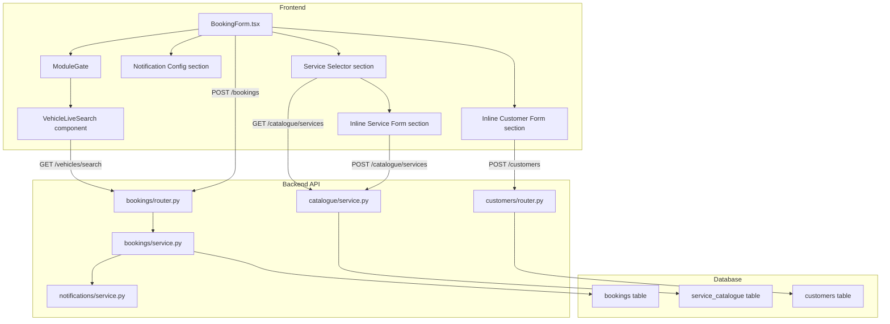

# Design Document: Booking Modal Enhancements

## Overview

This design enhances the existing `BookingForm.tsx` modal with four major capabilities:

1. **Inline customer creation** — an expandable form within the customer search dropdown when no match is found
2. **Vehicle rego field with module gating** — reuses the existing `VehicleLiveSearch` component, gated behind the `vehicles` module
3. **Service type selector with pricing** — searches the `service_catalogue` table, displays pricing, and supports inline service creation
4. **Subscription-aware notifications** — splits the single "send confirmation" checkbox into separate email/SMS checkboxes (SMS gated by subscription plan) and adds configurable booking reminders

All changes build on existing patterns: `ModuleGate`/`useModules` for vehicle gating, the existing catalogue API for services, and the existing notification service for email/SMS dispatch.

## Architecture

The enhancement touches three layers:



The frontend `BookingForm` component grows from a flat form into a multi-section modal. Each new section (inline customer, vehicle, service selector, notifications) is a self-contained block within the same component, keeping the modal as a single file with clearly separated sections.

The backend `create_booking` service function gains new parameters for service catalogue linkage, split notification preferences, and reminder scheduling. A new Alembic migration (0081) adds the required columns to the `bookings` table.

## Components and Interfaces

### Frontend Components

#### BookingForm.tsx (Enhanced)

The existing component is extended with these new sections:

**Customer Search with Inline Add:**
- Existing customer search typeahead remains unchanged
- When search returns 0 results and query ≥ 2 chars, an "Add new customer" option appears at the bottom of the dropdown
- Clicking it expands an `InlineCustomerForm` section below the search field with: first name (pre-populated from search query if it looks like a name), last name, email, phone
- On submit, calls `POST /api/v1/customers` (existing endpoint), then auto-selects the new customer
- Validation errors display inline below the form
- Selecting an existing customer from the dropdown collapses the inline form

**Vehicle Rego Field (Module-Gated):**
- Wrapped in `<ModuleGate module="vehicles">` — completely hidden when vehicles module is disabled
- Renders the existing `VehicleLiveSearch` component with its full search/CarJam lookup capability
- The `onVehicleFound` callback stores the selected vehicle's rego on the booking form state
- Optional field — staff can leave it empty

**Service Selector with Inline Add:**
- New typeahead field that searches `GET /api/v1/catalogue/services?search=...&active_only=true`
- Dropdown shows service name + formatted default_price (e.g. "Full Service — $185.00")
- Selecting a service stores `service_catalogue_id`, `service_type` (name), and `service_price` (default_price)
- When search returns 0 results and query ≥ 2 chars, an "Add new service" option appears
- Clicking it expands an `InlineServiceForm` with: service name (pre-populated from query), default price, category dropdown
- On submit, calls `POST /api/v1/catalogue/services`, then auto-selects the new service
- Selected service price displayed next to the service name after selection

**Notification Configuration:**
- "Send email confirmation" checkbox — always visible on create
- "Send SMS confirmation" checkbox — only visible when org's subscription plan has `sms_included: true`
- Reminder section with preset radio options: None, 24h before, 6h before, Custom
- Custom option reveals a numeric input for hours before booking
- Reminder uses the same channels (email/SMS) as the confirmation checkboxes

#### Subscription Plan Access on Frontend

The `TenantContext` currently does not expose subscription plan features like `sms_included`. The design adds a new lightweight endpoint:

- `GET /api/v1/org/plan-features` returns `{ sms_included: boolean }` (and potentially other plan feature flags in future)
- The `BookingForm` fetches this on mount (or it can be added to the existing `/org/settings` response)
- This avoids exposing the full subscription plan to org users — only the feature flags they need

### Backend API Changes

#### BookingCreate Schema (Enhanced)

```python
class BookingCreate(BaseModel):
    customer_id: uuid.UUID
    vehicle_rego: str | None = None
    branch_id: uuid.UUID | None = None
    service_type: str | None = None
    service_catalogue_id: uuid.UUID | None = None
    service_price: Decimal | None = None
    scheduled_at: datetime
    duration_minutes: int = Field(default=60, ge=15, le=480)
    notes: str | None = None
    assigned_to: uuid.UUID | None = None
    send_email_confirmation: bool = False
    send_sms_confirmation: bool = False
    reminder_offset_hours: float | None = None
```

The old `send_confirmation: bool` field is replaced by `send_email_confirmation` and `send_sms_confirmation`. The schema should accept both for backward compatibility during transition (if `send_confirmation` is true, treat as `send_email_confirmation: true`).

#### BookingResponse Schema (Enhanced)

Adds: `service_catalogue_id`, `service_price`, `send_email_confirmation`, `send_sms_confirmation`, `reminder_offset_hours`, `reminder_scheduled_at`, `reminder_cancelled`.

#### create_booking Service (Enhanced)

New logic in `create_booking()`:

1. **Vehicle rego gating**: If `vehicle_rego` is provided, check `ModuleService.is_enabled(org_id, "vehicles")`. If disabled, set `vehicle_rego = None`.
2. **Service catalogue linkage**: If `service_catalogue_id` is provided, validate it exists and belongs to the org. Store both `service_type` (name) and `service_catalogue_id` + `service_price` on the booking.
3. **Notification dispatch**: After booking creation:
   - If `send_email_confirmation` is true, call notification service to send email
   - If `send_sms_confirmation` is true, validate org has `sms_included` on their plan, then call notification service to send SMS
4. **Reminder scheduling**: If `reminder_offset_hours` is provided:
   - Calculate `reminder_scheduled_at = scheduled_at - timedelta(hours=reminder_offset_hours)`
   - If `reminder_scheduled_at` is in the past, skip scheduling and log a warning
   - Store `reminder_offset_hours` and `reminder_scheduled_at` on the booking
   - The reminder notification uses the same channels as the confirmation

#### Booking Cancellation (Enhanced)

When a booking is cancelled (status → `cancelled`), if `reminder_scheduled_at` is set and `reminder_cancelled` is false, set `reminder_cancelled = True` to prevent the reminder from being sent.

#### Plan Features Endpoint

New endpoint `GET /api/v1/org/plan-features` in the organisations router:

```python
@router.get("/org/plan-features")
async def get_plan_features(request: Request, db: AsyncSession = Depends(get_db_session)):
    org_id = request.state.org_id
    # Query org's subscription plan for sms_included
    result = await db.execute(
        select(SubscriptionPlan.sms_included)
        .join(Organisation, Organisation.plan_id == SubscriptionPlan.id)
        .where(Organisation.id == org_id)
    )
    row = result.scalar_one_or_none()
    return {"sms_included": bool(row) if row is not None else False}
```

### Catalogue Service Search Enhancement

The existing `list_services()` in `catalogue/service.py` already supports a `search` parameter and `active_only` filter. The frontend service selector will use `GET /api/v1/catalogue/services?search={query}&active_only=true&page_size=10`.

## Data Models

### Booking Model Changes (Migration 0081)

New columns added to the `bookings` table:

| Column | Type | Nullable | Default | Description |
|--------|------|----------|---------|-------------|
| `service_catalogue_id` | `UUID` | Yes | `NULL` | FK → `service_catalogue.id` |
| `service_price` | `Numeric(10,2)` | Yes | `NULL` | Price at time of booking |
| `send_email_confirmation` | `Boolean` | No | `false` | Email confirmation requested |
| `send_sms_confirmation` | `Boolean` | No | `false` | SMS confirmation requested |
| `reminder_offset_hours` | `Numeric(5,1)` | Yes | `NULL` | Hours before booking for reminder |
| `reminder_scheduled_at` | `DateTime(tz)` | Yes | `NULL` | Calculated reminder send time |
| `reminder_cancelled` | `Boolean` | No | `false` | Whether reminder was cancelled |

The existing `reminder_sent` column remains for tracking whether the reminder was actually dispatched.

The existing `send_confirmation` field on `BookingCreate` schema is deprecated in favour of `send_email_confirmation` and `send_sms_confirmation`.

### Migration 0081

```python
"""Add booking modal enhancement columns.

Revision ID: 0081
"""

def upgrade():
    op.add_column("bookings", sa.Column("service_catalogue_id", sa.dialects.postgresql.UUID(as_uuid=True), sa.ForeignKey("service_catalogue.id"), nullable=True))
    op.add_column("bookings", sa.Column("service_price", sa.Numeric(10, 2), nullable=True))
    op.add_column("bookings", sa.Column("send_email_confirmation", sa.Boolean(), nullable=False, server_default="false"))
    op.add_column("bookings", sa.Column("send_sms_confirmation", sa.Boolean(), nullable=False, server_default="false"))
    op.add_column("bookings", sa.Column("reminder_offset_hours", sa.Numeric(5, 1), nullable=True))
    op.add_column("bookings", sa.Column("reminder_scheduled_at", sa.DateTime(timezone=True), nullable=True))
    op.add_column("bookings", sa.Column("reminder_cancelled", sa.Boolean(), nullable=False, server_default="false"))

def downgrade():
    op.drop_column("bookings", "reminder_cancelled")
    op.drop_column("bookings", "reminder_scheduled_at")
    op.drop_column("bookings", "reminder_offset_hours")
    op.drop_column("bookings", "send_sms_confirmation")
    op.drop_column("bookings", "send_email_confirmation")
    op.drop_column("bookings", "service_price")
    op.drop_column("bookings", "service_catalogue_id")
```

### Existing Models Referenced (No Changes)

- `ServiceCatalogue` — `service_catalogue` table (name, default_price, category, is_active, org_id)
- `Customer` — `customers` table (first_name, last_name, email, phone, org_id)
- `SubscriptionPlan` — `subscription_plans` table (sms_included, sms_included_quota)


## Correctness Properties

*A property is a characteristic or behavior that should hold true across all valid executions of a system — essentially, a formal statement about what the system should do. Properties serve as the bridge between human-readable specifications and machine-verifiable correctness guarantees.*

### Property 1: Customer search triggers at minimum query length

*For any* search query string of length ≥ 2 entered into the Customer_Search field, the component shall issue a search API call; for any query of length < 2, no API call shall be made and the dropdown shall be empty.

**Validates: Requirements 1.1**

### Property 2: Empty search results show inline add option

*For any* search field (customer or service) where the query is ≥ 2 characters and the API returns zero results, the dropdown shall contain an "Add new" option. For any search that returns ≥ 1 result, the "Add new" option shall not appear.

**Validates: Requirements 1.2, 3.3**

### Property 3: Inline form submission creates entity and auto-selects

*For any* valid inline customer form submission (non-empty first name and last name) or valid inline service form submission (non-empty name and valid price), the system shall create the entity via the appropriate API endpoint and the form state shall reflect the newly created entity as the selected value.

**Validates: Requirements 1.4, 3.5**

### Property 4: Inline form validation errors display without closing form

*For any* inline form (customer or service) submission that returns a validation error from the API, the error message shall be displayed inline below the form, and the form shall remain expanded (not collapsed).

**Validates: Requirements 1.5, 3.6**

### Property 5: Search query pre-populates inline customer name

*For any* search query string that consists only of alphabetic characters and spaces (i.e., appears to be a name, not a phone number or email), when the inline customer form is expanded, the first name field shall be pre-populated with the search query text.

**Validates: Requirements 1.7**

### Property 6: Vehicle rego storage is conditional on module enablement

*For any* booking creation request containing a non-null `vehicle_rego` value, if the vehicles module is enabled for the organisation, the stored booking shall have `vehicle_rego` equal to the submitted value; if the vehicles module is disabled, the stored booking shall have `vehicle_rego` set to null.

**Validates: Requirements 2.5, 2.6**

### Property 7: Service selector returns only active services with pricing

*For any* search query entered into the Service_Selector, all results returned shall have `is_active = true`, and each result shall include both the service `name` and `default_price`.

**Validates: Requirements 3.1**

### Property 8: Service selection stores catalogue ID, name, and price

*For any* service selected from the Service_Selector dropdown, the booking form state shall contain the selected service's `service_catalogue_id`, `service_type` (equal to the service name), and `service_price` (equal to the service's `default_price`).

**Validates: Requirements 3.2, 3.8, 3.9**

### Property 9: Notification channels match confirmation flags

*For any* booking creation request, the set of notification channels triggered (email, SMS, or none) shall exactly match the set of confirmation flags (`send_email_confirmation`, `send_sms_confirmation`) that are set to true. When both flags are false, no notifications shall be sent.

**Validates: Requirements 4.4, 4.5, 4.6**

### Property 10: Reminder scheduled_at equals booking time minus offset

*For any* booking created with a non-null `reminder_offset_hours` where `scheduled_at - reminder_offset_hours` is in the future, the stored `reminder_scheduled_at` shall equal `scheduled_at - timedelta(hours=reminder_offset_hours)`.

**Validates: Requirements 5.5**

### Property 11: Booking cancellation cancels pending reminder

*For any* booking that has a non-null `reminder_scheduled_at` and `reminder_cancelled = false`, when the booking status is changed to `cancelled`, the `reminder_cancelled` field shall be set to `true`.

**Validates: Requirements 5.6**

### Property 12: Reminder sent at most once per booking

*For any* booking with a scheduled reminder, regardless of how many times the booking is updated, the reminder notification shall be dispatched at most once (tracked by the existing `reminder_sent` flag).

**Validates: Requirements 5.7**

### Property 13: Reminder uses same channels as confirmation

*For any* booking with a scheduled reminder, the reminder notification channels shall be identical to the confirmation notification channels stored on the booking (`send_email_confirmation`, `send_sms_confirmation`).

**Validates: Requirements 5.9**

### Property 14: BookingCreate/BookingResponse schema round-trip

*For any* valid combination of the new booking fields (`service_catalogue_id`, `service_price`, `send_email_confirmation`, `send_sms_confirmation`, `reminder_offset_hours`), serializing a `BookingCreate` and then reading the resulting `BookingResponse` shall preserve all field values.

**Validates: Requirements 6.8, 6.9**

## Error Handling

### Frontend Errors

| Scenario | Handling |
|----------|----------|
| Customer search API fails | Silently clear results, show empty dropdown. Existing behavior preserved. |
| Inline customer creation fails (validation) | Display API error message inline below the form. Form remains open. |
| Inline customer creation fails (network) | Display generic "Failed to create customer" error inline. |
| Service search API fails | Silently clear results, show empty dropdown. |
| Inline service creation fails (validation) | Display API error message inline below the form. Form remains open. |
| Inline service creation fails (network) | Display generic "Failed to create service" error inline. |
| Plan features endpoint fails | Default to `sms_included: false` — hide SMS checkbox. Fail safe. |
| Booking creation fails | Display error in the existing error banner at the top of the form. |

### Backend Errors

| Scenario | Handling |
|----------|----------|
| `service_catalogue_id` not found or wrong org | Return 400 with "Service not found in this organisation" |
| `service_catalogue_id` references inactive service | Return 400 with "Selected service is no longer active" |
| SMS confirmation requested but plan has `sms_included: false` | Silently skip SMS, create booking with `send_sms_confirmation: false`. Log warning. |
| Reminder offset results in past reminder time | Skip scheduling, set `reminder_scheduled_at: null`, log warning. Booking still created. |
| Notification dispatch fails (email or SMS) | Booking is still created successfully. Log the notification failure. Do not roll back the booking. |
| Customer not found | Return 400 with "Customer not found in this organisation" (existing behavior) |

## Testing Strategy

### Property-Based Testing

Use `hypothesis` (Python) for backend property tests and `fast-check` (TypeScript) for frontend property tests. Each property test runs a minimum of 100 iterations.

**Backend property tests** (in `tests/test_booking_enhancements_property.py`):

- **Property 6**: Generate random vehicle_rego strings and module enabled/disabled states. Assert stored value matches expectation.
  - Tag: `Feature: booking-modal-enhancements, Property 6: Vehicle rego storage is conditional on module enablement`
- **Property 8**: Generate random service catalogue entries, create bookings referencing them. Assert stored service_type, service_catalogue_id, and service_price match.
  - Tag: `Feature: booking-modal-enhancements, Property 8: Service selection stores catalogue ID, name, and price`
- **Property 9**: Generate random combinations of send_email_confirmation and send_sms_confirmation booleans. Assert notification dispatch calls match flags.
  - Tag: `Feature: booking-modal-enhancements, Property 9: Notification channels match confirmation flags`
- **Property 10**: Generate random scheduled_at datetimes and reminder_offset_hours values (where result is in the future). Assert reminder_scheduled_at = scheduled_at - offset.
  - Tag: `Feature: booking-modal-enhancements, Property 10: Reminder scheduled_at equals booking time minus offset`
- **Property 11**: Generate random bookings with reminders, cancel them. Assert reminder_cancelled is set.
  - Tag: `Feature: booking-modal-enhancements, Property 11: Booking cancellation cancels pending reminder`
- **Property 12**: Generate random bookings with reminders, update them multiple times. Assert reminder_sent transitions from false to true at most once.
  - Tag: `Feature: booking-modal-enhancements, Property 12: Reminder sent at most once per booking`
- **Property 13**: Generate random confirmation channel combinations. Assert reminder channels match.
  - Tag: `Feature: booking-modal-enhancements, Property 13: Reminder uses same channels as confirmation`
- **Property 14**: Generate random valid BookingCreate payloads with all new fields. Round-trip through create → get. Assert field preservation.
  - Tag: `Feature: booking-modal-enhancements, Property 14: BookingCreate/BookingResponse schema round-trip`

**Frontend property tests** (in `frontend/src/__tests__/booking-modal-enhancements.property.test.tsx`):

- **Property 1**: Generate random strings of varying lengths. Assert API call behavior based on length threshold.
  - Tag: `Feature: booking-modal-enhancements, Property 1: Customer search triggers at minimum query length`
- **Property 2**: Generate random search results (empty vs non-empty arrays). Assert "Add new" option visibility.
  - Tag: `Feature: booking-modal-enhancements, Property 2: Empty search results show inline add option`
- **Property 5**: Generate random strings (alphabetic names vs phone numbers vs emails). Assert pre-population behavior.
  - Tag: `Feature: booking-modal-enhancements, Property 5: Search query pre-populates inline customer name`
- **Property 7**: Generate random service catalogue entries with mixed active/inactive status. Assert only active services appear in results.
  - Tag: `Feature: booking-modal-enhancements, Property 7: Service selector returns only active services with pricing`

### Unit Tests

**Backend unit tests** (in `tests/test_booking_enhancements.py`):

- Inline customer creation via existing customer API endpoint (happy path)
- Inline service creation via catalogue API endpoint (happy path)
- Service catalogue ID validation (not found, wrong org, inactive)
- SMS confirmation silently skipped when plan has `sms_included: false`
- Reminder with past time is skipped with warning logged
- Booking cancellation sets `reminder_cancelled = true`
- Migration 0081 adds all expected columns with correct types and defaults
- All new columns on Booking model exist with correct defaults (6.1–6.7)
- Vehicle rego field hidden when vehicles module disabled (2.1, 2.2)
- Vehicle rego field is optional (2.3)
- SMS checkbox visibility based on subscription plan (4.2, 4.3)
- Email checkbox always visible on create (4.1)
- Reminder preset options available (5.1, 5.2)
- Custom reminder input appears when custom option selected (5.4)
- Selected service price displayed after selection (3.7)

**Frontend unit tests** (in `frontend/src/__tests__/booking-modal-enhancements.test.tsx`):

- "Add new customer" option appears when search returns empty
- Inline customer form expands/collapses correctly
- Inline customer form pre-populates first name from search query
- Selecting existing customer hides inline form (1.6)
- Vehicle field visible/hidden based on module gating
- Service selector shows name + price in dropdown
- "Add new service" option appears when service search returns empty
- Inline service form expands/collapses correctly
- Email confirmation checkbox always present on create
- SMS confirmation checkbox visible/hidden based on plan features
- Reminder section with preset options renders correctly
- Custom reminder input appears when custom option selected
