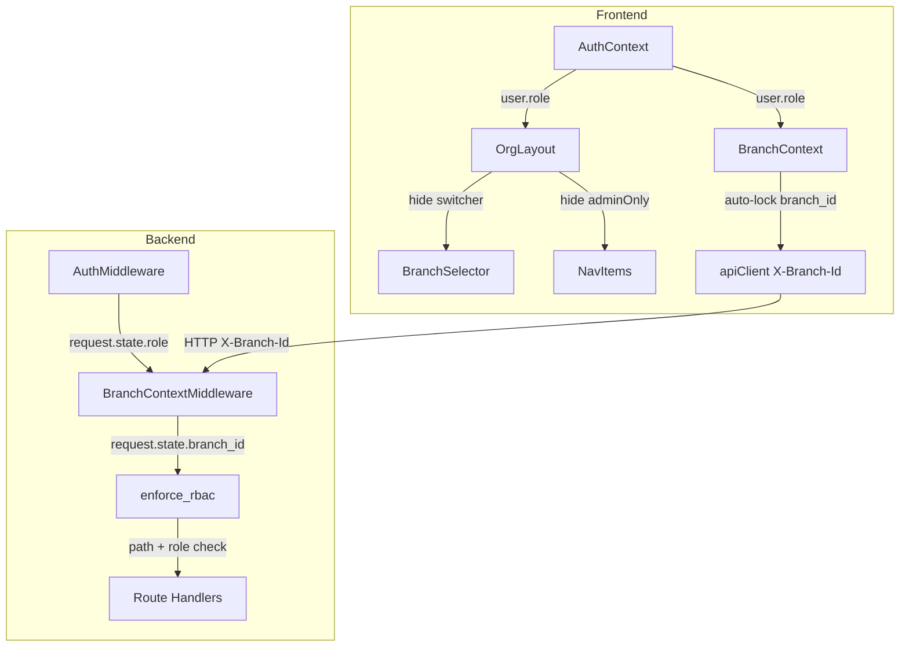

# Design Document: branch_admin Role

## Overview

This feature introduces a `branch_admin` role that sits between `org_admin` and `salesperson` in the role hierarchy. A branch admin has full operational permissions within their assigned branch but zero access to org-level administration (billing, modules, branch management, user roles, org settings). The implementation touches four layers:

1. **Database** — Alembic migration to add `branch_admin` to the `ck_users_role` CHECK constraint.
2. **Backend RBAC** — New role constant, permission set, path-based access rules, and `require_role()` updates in `app/modules/auth/rbac.py`.
3. **Backend Middleware** — Auto-scoping logic in `BranchContextMiddleware` (`app/core/branch_context.py`) that locks `branch_admin` to their assigned branch and rejects cross-branch or all-branch requests.
4. **Frontend** — Updates to `AuthContext` (type union), `OrgLayout` (hide branch switcher + admin nav), `BranchContext` (auto-lock branch), `BranchSelector` (hide for branch_admin), and `BranchManagement` (filter assignment modal).

The design reuses existing patterns established by the `kiosk` role addition (migration 0124) and the `location_manager` scoping system.

## Architecture



### Role Hierarchy

```
global_admin          — platform-wide, no org data access
  └─ org_admin        — full org access, all branches, all settings
      └─ branch_admin — full operational access, single branch, no org settings
          └─ location_manager — branch-scoped, limited to assigned locations
              └─ salesperson   — operational, no admin
                  └─ staff_member — own jobs/time only
                      └─ kiosk    — check-in only
```

## Components and Interfaces

### 1. Backend RBAC (`app/modules/auth/rbac.py`)

**Changes:**

- Add `BRANCH_ADMIN = "branch_admin"` constant.
- Add `"branch_admin"` to `ALL_ROLES` set.
- Add `branch_admin` permission set to `ROLE_PERMISSIONS`:
  ```python
  "branch_admin": [
      "invoices.*", "customers.*", "vehicles.*", "quotes.*", "jobs.*",
      "bookings.*", "inventory.*", "catalogue.*", "expenses.*",
      "purchase_orders.*", "scheduling.*", "pos.*", "staff.*",
      "projects.*", "time_tracking.*", "claims.*", "notifications.*",
      "data_io.*", "reports.*",
  ],
  ```
- Add `branch_admin` denied path prefixes (same as salesperson denied + branch management):
  ```python
  BRANCH_ADMIN_DENIED_PREFIXES: tuple[str, ...] = (
      "/api/v1/org/users",
      "/api/v1/billing/",
      "/api/v1/billing",
      "/api/v1/admin/",
      "/api/v1/org/branches",  # branch creation/management
  )
  ```
- Add `branch_admin` to `check_role_path_access()` with deny rules for:
  - All `GLOBAL_ADMIN_ONLY_PREFIXES`
  - All `BRANCH_ADMIN_DENIED_PREFIXES`
  - Write access to `/api/v1/org/settings` (read allowed for branding)
- Update `require_role()` org-scoped check to include `BRANCH_ADMIN`.
- Update `require_any_org_role()` to include `BRANCH_ADMIN`.
- Update `require_any_org_member()` to include `BRANCH_ADMIN`.
- Add `require_branch_admin_or_above()` convenience dependency.

### 2. Backend Middleware (`app/core/branch_context.py`)

**Changes to `BranchContextMiddleware.__call__`:**

After the existing auth check, add branch_admin auto-scoping logic:

```python
role = getattr(request.state, "role", None)

if role == "branch_admin":
    user_branch_ids = getattr(request.state, "branch_ids", None) or []
    
    if not user_branch_ids:
        # No branch assigned — deny all data access
        response = JSONResponse(status_code=403, content={
            "detail": "No branch assignment. Contact your org admin."
        })
        await response(scope, receive, send)
        return
    
    assigned_branch = uuid.UUID(str(user_branch_ids[0]))
    
    if branch_header:
        # Validate header matches assigned branch
        if branch_id != assigned_branch:
            response = JSONResponse(status_code=403, content={
                "detail": "Invalid branch context"
            })
            await response(scope, receive, send)
            return
    else:
        # No header = "All Branches" — deny for branch_admin
        response = JSONResponse(status_code=403, content={
            "detail": "Invalid branch context"
        })
        await response(scope, receive, send)
        return
    
    request.state.branch_id = assigned_branch
    await self.app(scope, receive, send)
    return
```

**Prerequisite:** The `AuthMiddleware` must populate `request.state.branch_ids` from the JWT claims or a DB lookup. Currently the JWT does not include `branch_ids` — we need to either:
- (A) Add `branch_ids` to the JWT payload in `create_access_token()`, or
- (B) Look up `branch_ids` from the DB in the middleware.

**Decision: Option A** — Add `branch_ids` to the JWT. This avoids a DB query on every request and follows the same pattern as `assigned_location_ids`. The `create_access_token` function in `app/modules/auth/jwt.py` will gain a `branch_ids` parameter, and the auth service will pass the user's `branch_ids` when issuing tokens.

### 3. JWT Token Changes (`app/modules/auth/jwt.py`)

Add `branch_ids: list[str] | None = None` parameter to `create_access_token()`. Include in payload:
```python
"branch_ids": [str(bid) for bid in (branch_ids or [])],
```

Update all call sites (`authenticate_user`, `refresh_token`, `mfa_verify`, etc.) to pass `user.branch_ids` when creating tokens.

### 4. AuthMiddleware Update

The existing `AuthMiddleware` decodes the JWT and sets `request.state` attributes. Add:
```python
request.state.branch_ids = payload.get("branch_ids", [])
```

### 5. Frontend AuthContext (`frontend/src/contexts/AuthContext.tsx`)

**Changes:**
- Add `'branch_admin'` to the `UserRole` type union.
- Add `branch_ids?: string[]` to the `AuthUser` interface.
- Update `userFromToken()` to extract `branch_ids` from the JWT payload.
- Add helper: `isBranchAdmin` computed property.

### 6. Frontend OrgLayout (`frontend/src/layouts/OrgLayout.tsx`)

**Changes:**
- In `visibleNavItems` filter: treat `branch_admin` like non-admin (hide `adminOnly` items).
- Conditionally render `<BranchSelector />` only when `userRole !== 'branch_admin'`.
- When `userRole === 'branch_admin'`, display the assigned branch name as a static badge in the header instead of the selector.

### 7. Frontend BranchContext (`frontend/src/contexts/BranchContext.tsx`)

**Changes:**
- When `user.role === 'branch_admin'`, auto-set `selectedBranchId` to `user.branch_ids[0]` and persist to localStorage.
- Skip the branch fetch + validation flow for `branch_admin` — the branch is fixed.
- Expose `isBranchLocked: boolean` in the context value so components can check if switching is disabled.

### 8. Frontend BranchManagement (`frontend/src/pages/settings/BranchManagement.tsx`)

**Changes to the Assign Users modal:**
- Filter the `users` list to exclude roles: `org_admin`, `global_admin`, `kiosk`.
- Only show users with roles: `branch_admin`, `salesperson`, `location_manager`, `staff_member`.

### 9. Frontend Route Guards

Add a redirect guard: if `user.role === 'branch_admin'` and the current path starts with `/settings`, redirect to `/dashboard`.

## Data Models

### User Model Changes

The `User` model in `app/modules/auth/models.py` requires:

1. **Check constraint update** — Add `'branch_admin'` to the `ck_users_role` constraint:
   ```sql
   role IN ('global_admin','franchise_admin','org_admin','branch_admin','location_manager','salesperson','staff_member','kiosk')
   ```

2. **No new columns** — `branch_admin` reuses the existing `branch_ids` JSONB column. A branch_admin user will have exactly one entry in `branch_ids`.

### Alembic Migration

Following the pattern from migration `0124_add_kiosk_role.py`:

```python
def upgrade() -> None:
    op.drop_constraint("ck_users_role", "users", type_="check")
    op.create_check_constraint(
        "ck_users_role",
        "users",
        "role IN ('global_admin','franchise_admin','org_admin','branch_admin',"
        "'location_manager','salesperson','staff_member','kiosk')",
    )

def downgrade() -> None:
    op.drop_constraint("ck_users_role", "users", type_="check")
    op.create_check_constraint(
        "ck_users_role",
        "users",
        "role IN ('global_admin','franchise_admin','org_admin',"
        "'location_manager','salesperson','staff_member','kiosk')",
    )
```

### Permission Matrix

| Permission Domain | branch_admin | org_admin | salesperson |
|---|---|---|---|
| invoices.* | ✅ | ✅ | ✅ (create/read/update) |
| customers.* | ✅ | ✅ | ✅ (create/read/update) |
| billing.* | ❌ | ✅ | ❌ |
| modules.* | ❌ | ✅ | ❌ |
| settings.write | ❌ | ✅ | ❌ |
| users.role_assign | ❌ | ✅ | ❌ |
| branches.create | ❌ | ✅ | ❌ |
| branches.delete | ❌ | ✅ | ❌ |
| org.* | ❌ | ✅ | ❌ |
| catalogue.* | ✅ | ✅ | ❌ |
| inventory.* | ✅ | ✅ | ❌ |
| scheduling.* | ✅ | ✅ | ❌ |
| staff.* | ✅ | ✅ | ❌ |
| reports.* | ✅ | ✅ | ❌ |


## Correctness Properties

*A property is a characteristic or behavior that should hold true across all valid executions of a system — essentially, a formal statement about what the system should do. Properties serve as the bridge between human-readable specifications and machine-verifiable correctness guarantees.*

### Property 1: branch_admin granted permissions are correct

*For any* permission key in the set `{invoices.*, customers.*, vehicles.*, quotes.*, jobs.*, bookings.*, inventory.*, catalogue.*, expenses.*, purchase_orders.*, scheduling.*, pos.*, staff.*, projects.*, time_tracking.*, claims.*, notifications.*, data_io.*, reports.*}`, calling `has_permission("branch_admin", perm)` should return `True`.

**Validates: Requirements 1.3, 9.1**

### Property 2: branch_admin denied permissions are correct

*For any* permission key in the set `{billing.*, modules.*, settings.write, users.role_assign, branches.create, branches.delete, org.*}`, calling `has_permission("branch_admin", perm)` should return `False`.

**Validates: Requirements 1.4, 9.2**

### Property 3: branch_admin denied org-level paths

*For any* HTTP method and any path that starts with a denied prefix (`/api/v1/billing/`, `/api/v1/admin/`, `/api/v1/org/users`), calling `check_role_path_access("branch_admin", path, method)` should return a non-None denial message. Additionally, for write methods (POST/PUT/DELETE/PATCH) on `/api/v1/org/settings`, the function should return a denial message.

**Validates: Requirements 1.4, 5.1, 5.2, 5.3, 5.4, 5.5, 5.6**

### Property 4: branch_admin auto-scoped to assigned branch

*For any* branch_admin user with a non-empty `branch_ids` list, when the middleware processes a request with `X-Branch-Id` matching `branch_ids[0]`, the middleware should set `request.state.branch_id` to that branch UUID and allow the request to proceed.

**Validates: Requirements 2.1**

### Property 5: branch_admin cross-branch rejection

*For any* branch_admin user with `branch_ids = [B]` and any UUID `X` where `X ≠ B`, when the middleware processes a request with `X-Branch-Id = X`, the middleware should reject the request with HTTP 403.

**Validates: Requirements 2.2, 3.2, 3.3**

### Property 6: branch_admin all-branches scope rejection

*For any* branch_admin user (regardless of branch_ids content), when the middleware processes a request with no `X-Branch-Id` header, the middleware should reject the request with HTTP 403.

**Validates: Requirements 2.3**

### Property 7: branch_admin nav item visibility

*For any* list of nav items where each item has an `adminOnly` boolean flag, when filtered for `role = "branch_admin"`, the result should contain exactly those items where `adminOnly` is `false` (or undefined), and should exclude all items where `adminOnly` is `true`.

**Validates: Requirements 4.2, 4.3**

### Property 8: Branch assignment modal role filtering

*For any* list of users with roles drawn from `{global_admin, franchise_admin, org_admin, branch_admin, location_manager, salesperson, staff_member, kiosk}`, the assignment modal filter should return only users whose role is in `{branch_admin, salesperson, location_manager, staff_member}`.

**Validates: Requirements 6.1, 6.2, 6.3, 6.4**

## Error Handling

| Scenario | HTTP Status | Error Message | Component |
|---|---|---|---|
| branch_admin accesses denied path | 403 | "Branch admin role cannot access this resource" | `check_role_path_access()` |
| branch_admin writes to org settings | 403 | "Branch admin role cannot modify this resource" | `check_role_path_access()` |
| branch_admin sends wrong X-Branch-Id | 403 | "Invalid branch context" | `BranchContextMiddleware` |
| branch_admin omits X-Branch-Id | 403 | "Invalid branch context" | `BranchContextMiddleware` |
| branch_admin has empty branch_ids | 403 | "No branch assignment. Contact your org admin." | `BranchContextMiddleware` |
| branch_admin navigates to /settings | Redirect to /dashboard | N/A (client-side redirect) | Frontend route guard |
| Unknown role in RBAC check | 403 | "Unknown role: {role}" | `check_role_path_access()` |

## Testing Strategy

### Property-Based Testing

Library: **Hypothesis** (Python, backend) and **fast-check** (TypeScript, frontend).

Each property test must run a minimum of 100 iterations and be tagged with a comment referencing the design property.

Tag format: `Feature: branch-admin-role, Property {number}: {property_text}`

**Backend property tests** (`tests/properties/test_branch_admin_properties.py`):

- Property 1: Generate random permission keys from the granted set → assert `has_permission("branch_admin", perm)` returns True.
- Property 2: Generate random permission keys from the denied set → assert `has_permission("branch_admin", perm)` returns False.
- Property 3: Generate random paths under denied prefixes + random HTTP methods → assert `check_role_path_access("branch_admin", path, method)` returns non-None.
- Property 4: Generate random UUIDs for branch_ids, set X-Branch-Id to match → assert middleware sets branch_id correctly.
- Property 5: Generate two distinct random UUIDs (assigned vs requested) → assert middleware rejects with 403.
- Property 6: Generate random branch_admin user state with no header → assert middleware rejects with 403.

**Frontend property tests** (`frontend/src/pages/__tests__/branch-admin-role.properties.test.ts`):

- Property 7: Generate random nav item arrays with varying adminOnly flags → assert filter output excludes all adminOnly items for branch_admin.
- Property 8: Generate random user arrays with varying roles → assert filter output contains only allowed roles.

### Unit Tests

Unit tests complement property tests by covering specific examples and edge cases:

- branch_admin with empty branch_ids gets 403 (edge case for Requirement 2.4)
- branch_admin in ALL_ROLES set (example for Requirement 1.1)
- Database migration applies and accepts branch_admin role value (example for Requirement 8.1)
- BranchSelector not rendered when role is branch_admin (example for Requirement 4.1)
- branch_admin redirected from /settings to /dashboard (example for Requirement 4.4)
- Branch name displayed in header for branch_admin (example for Requirement 4.5)

### Property-Based Testing Configuration

- Python: `@settings(max_examples=100)` decorator on each Hypothesis test
- TypeScript: `fc.assert(fc.property(...), { numRuns: 100 })` for each fast-check test
- Each test tagged: `# Feature: branch-admin-role, Property N: <title>`
