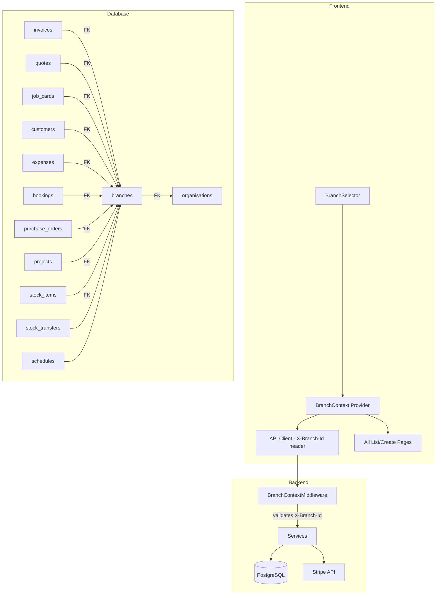

# Design Document: Branch Management Complete

## Overview

This design extends the existing branch infrastructure (`Branch` model, `list_branches`, `create_branch`, `assign_user_branches`) into a full multi-location management system. The existing `branches` table already has `id`, `org_id`, `name`, `address`, `phone`, `is_active`, and `created_at`. Invoices and Bookings already carry a `branch_id` FK.

The design adds:

1. Branch update, soft-delete/reactivate, and per-branch settings (email, logo, operating hours, timezone)
2. Per-branch billing via Stripe subscription quantity — each active branch multiplies the base plan price
3. A `BranchSelector` dropdown + `BranchContext` React provider that injects `X-Branch-Id` into every API call
4. Nullable `branch_id` FK columns on quotes, job_cards, customers, expenses, purchase_orders, and projects
5. Branch-scoped dashboards with comparison view, branch-level reports, stock transfers, staff scheduling
6. Global admin branch overview, branch notifications, and comprehensive E2E/property-based tests

All changes are backward-compatible: existing records with `branch_id = NULL` remain visible under "All Branches".

## Architecture



The architecture follows the existing pattern: FastAPI middleware extracts context from headers, services accept `branch_id` as an optional filter, and the frontend React context provider manages the selected branch state.

### Key Design Decisions

1. **Stripe quantity-based billing** — Rather than creating separate Stripe subscriptions per branch, we update the existing subscription's `quantity` field to match the active branch count. This keeps billing consolidated on one invoice per org.

2. **Middleware-based branch filtering** — A new `BranchContextMiddleware` reads `X-Branch-Id` from request headers and attaches `request.state.branch_id`. Services use this to filter queries. This avoids modifying every endpoint signature.

3. **Nullable branch_id for backward compatibility** — All new `branch_id` columns are nullable. Existing records with `NULL` appear in all branch views. New records created with a branch selected get the branch_id auto-set.

4. **HQ branch designation** — The first branch created for an org is flagged as `is_hq = True`. It cannot be deactivated while other branches exist. All billing charges roll up to the org's single Stripe subscription.

5. **Stock transfers as a state machine** — Transfers follow pending → approved → shipped → received, with cancellation possible at any pre-received stage. Stock is only deducted on ship and added on receive.

## Components and Interfaces

### Backend Components

#### 1. BranchContextMiddleware (`app/core/branch_context.py`)

```python
class BranchContextMiddleware:
    """Reads X-Branch-Id header, validates UUID + org ownership, sets request.state.branch_id."""

    async def __call__(self, request: Request, call_next):
        branch_header = request.headers.get("X-Branch-Id")
        if branch_header:
            # Validate UUID format
            # Validate branch belongs to user's org
            # Set request.state.branch_id = validated UUID
        else:
            request.state.branch_id = None  # "All Branches"
        return await call_next(request)
```

#### 2. Extended Branch Service (`app/modules/organisations/service.py`)

New functions added to the existing service:

| Function | Description |
|----------|-------------|
| `update_branch(db, org_id, branch_id, **fields)` | Update branch fields with audit log |
| `deactivate_branch(db, org_id, branch_id)` | Soft-delete (is_active=False), validates not last active branch, not HQ while others exist |
| `reactivate_branch(db, org_id, branch_id)` | Set is_active=True |
| `get_branch_settings(db, org_id, branch_id)` | Return branch settings JSON |
| `update_branch_settings(db, org_id, branch_id, settings)` | Update settings with timezone validation |

#### 3. Branch Billing Service (`app/modules/billing/branch_billing.py`)

| Function | Description |
|----------|-------------|
| `calculate_branch_cost(base_price, branch_count, interval, discount)` | Pure function: base × count × interval_multiplier |
| `preview_branch_addition(db, org_id)` | Returns cost preview for adding one branch |
| `sync_stripe_branch_quantity(db, org_id)` | Updates Stripe subscription quantity to match active branch count |
| `get_branch_cost_breakdown(db, org_id)` | Returns per-branch cost breakdown for billing dashboard |

#### 4. Stock Transfer Service (`app/modules/inventory/transfer_service.py`)

| Function | Description |
|----------|-------------|
| `create_transfer(db, org_id, from_branch_id, to_branch_id, product_id, quantity, requested_by)` | Create pending transfer |
| `approve_transfer(db, org_id, transfer_id, approved_by)` | Move to approved |
| `ship_transfer(db, org_id, transfer_id)` | Deduct from source stock, move to shipped |
| `receive_transfer(db, org_id, transfer_id)` | Add to destination stock, move to received |
| `cancel_transfer(db, org_id, transfer_id)` | Cancel + restore stock if shipped |

#### 5. Schedule Service (`app/modules/scheduling/service.py`)

| Function | Description |
|----------|-------------|
| `create_schedule_entry(db, org_id, branch_id, user_id, shift_date, start_time, end_time, notes)` | Create with overlap validation |
| `list_schedule_entries(db, org_id, branch_id=None, date_range=None)` | List filtered by branch |
| `update_schedule_entry(db, org_id, entry_id, **fields)` | Update with re-validation |
| `delete_schedule_entry(db, org_id, entry_id)` | Delete entry |

#### 6. Branch Dashboard Service (`app/modules/organisations/dashboard_service.py`)

| Function | Description |
|----------|-------------|
| `get_branch_metrics(db, org_id, branch_id=None)` | Revenue, invoice count/value, customer count, staff count, expenses |
| `get_branch_comparison(db, org_id, branch_ids)` | Side-by-side metrics for selected branches |

### Frontend Components

#### 1. BranchContext Provider (`frontend/src/contexts/BranchContext.tsx`)

```typescript
interface BranchContextValue {
  selectedBranchId: string | null  // null = "All Branches"
  branches: Branch[]
  selectBranch: (id: string | null) => void
  isLoading: boolean
}
```

- Reads `selected_branch_id` from localStorage on mount
- Validates against user's `branch_ids` array
- Resets to null if stored branch is no longer accessible
- Re-validates on every API response (checks user's branch_ids)

#### 2. BranchSelector (`frontend/src/components/branch/BranchSelector.tsx`)

- Dropdown in top navbar
- Lists user's accessible branches + "All Branches" option
- Pre-selects single branch if user has only one
- Persists selection to localStorage

#### 3. API Client Interceptor (modify `frontend/src/api/client.ts`)

```typescript
// Add request interceptor
apiClient.interceptors.request.use((config) => {
  const branchId = localStorage.getItem('selected_branch_id')
  if (branchId && branchId !== 'all') {
    config.headers['X-Branch-Id'] = branchId
  }
  return config
})
```

#### 4. Updated List Pages

All list pages (InvoiceList, QuoteList, JobCardList, CustomerList, ExpenseList, BookingList, POList, ProjectList) gain:
- Automatic branch filtering via the `X-Branch-Id` header (no code changes needed in most pages — the backend filters)
- A "Branch" column in the data table showing the branch name
- Auto-set `branch_id` on create forms from `BranchContext`

#### 5. New Pages

| Page | Path | Description |
|------|------|-------------|
| BranchSettings | `/settings/branches/:id/settings` | Per-branch settings form |
| StockTransfers | `/inventory/transfers` | Transfer list + create/manage |
| StaffSchedule | `/scheduling` | Calendar/table view per branch |
| BranchDashboard | `/dashboard` (enhanced) | Branch-scoped metrics + comparison |
| BranchCostBreakdown | `/settings/billing` (enhanced) | Per-branch cost table |
| GlobalBranchOverview | `/admin/branches` | Global admin branch table |


### API Endpoints

#### Branch CRUD (extend `app/modules/organisations/router.py`)

| Method | Path | Auth | Description |
|--------|------|------|-------------|
| PUT | `/org/branches/{branch_id}` | org_admin | Update branch fields |
| DELETE | `/org/branches/{branch_id}` | org_admin | Soft-delete (deactivate) |
| POST | `/org/branches/{branch_id}/reactivate` | org_admin | Reactivate branch |
| GET | `/org/branches/{branch_id}/settings` | org_admin | Get branch settings |
| PUT | `/org/branches/{branch_id}/settings` | org_admin | Update branch settings |

#### Branch Billing (extend `app/modules/billing/router.py`)

| Method | Path | Auth | Description |
|--------|------|------|-------------|
| GET | `/billing/branch-cost-preview` | org_admin | Preview cost of adding a branch |
| GET | `/billing/branch-cost-breakdown` | org_admin | Per-branch cost breakdown |

#### Stock Transfers (`app/modules/inventory/transfer_router.py`)

| Method | Path | Auth | Description |
|--------|------|------|-------------|
| POST | `/inventory/transfers` | org_admin, salesperson | Create transfer |
| GET | `/inventory/transfers` | org_admin, salesperson | List transfers |
| POST | `/inventory/transfers/{id}/approve` | org_admin | Approve transfer |
| POST | `/inventory/transfers/{id}/ship` | org_admin, salesperson | Mark shipped |
| POST | `/inventory/transfers/{id}/receive` | org_admin, salesperson | Mark received |
| POST | `/inventory/transfers/{id}/cancel` | org_admin | Cancel transfer |

#### Staff Scheduling (`app/modules/scheduling/router.py`)

| Method | Path | Auth | Description |
|--------|------|------|-------------|
| GET | `/scheduling` | org_admin, salesperson | List schedule entries |
| POST | `/scheduling` | org_admin | Create schedule entry |
| PUT | `/scheduling/{id}` | org_admin | Update schedule entry |
| DELETE | `/scheduling/{id}` | org_admin | Delete schedule entry |

#### Branch Dashboard (extend existing dashboard endpoint)

| Method | Path | Auth | Description |
|--------|------|------|-------------|
| GET | `/dashboard/branch-metrics` | org_admin, salesperson | Branch-scoped metrics |
| GET | `/dashboard/branch-comparison` | org_admin | Compare multiple branches |

#### Global Admin Branch Overview (extend `app/modules/admin/router.py`)

| Method | Path | Auth | Description |
|--------|------|------|-------------|
| GET | `/admin/branches` | global_admin | Paginated branch list across all orgs |
| GET | `/admin/branches/{id}` | global_admin | Branch detail with users + activity |
| GET | `/admin/branch-summary` | global_admin | Platform-wide branch stats |
| GET | `/admin/org-branch-revenue` | global_admin | Org table with branch counts + revenue |

## Data Models

### Modified Tables

#### `branches` (existing — add columns)

```sql
ALTER TABLE branches
  ADD COLUMN email VARCHAR(255),
  ADD COLUMN logo_url TEXT,
  ADD COLUMN operating_hours JSONB DEFAULT '{}',
  ADD COLUMN timezone VARCHAR(50) DEFAULT 'Pacific/Auckland',
  ADD COLUMN is_hq BOOLEAN NOT NULL DEFAULT false,
  ADD COLUMN notification_preferences JSONB DEFAULT '{}',
  ADD COLUMN updated_at TIMESTAMPTZ NOT NULL DEFAULT now();
```

#### `quotes` (existing — add branch_id)

```sql
ALTER TABLE quotes
  ADD COLUMN branch_id UUID REFERENCES branches(id) ON DELETE SET NULL;
CREATE INDEX ix_quotes_branch_id ON quotes(branch_id);
```

#### `job_cards` (existing — add branch_id)

```sql
ALTER TABLE job_cards
  ADD COLUMN branch_id UUID REFERENCES branches(id) ON DELETE SET NULL;
CREATE INDEX ix_job_cards_branch_id ON job_cards(branch_id);
```

#### `customers` (existing — add branch_id)

```sql
ALTER TABLE customers
  ADD COLUMN branch_id UUID REFERENCES branches(id) ON DELETE SET NULL;
CREATE INDEX ix_customers_branch_id ON customers(branch_id);
```

#### `expenses` (existing — add branch_id)

```sql
ALTER TABLE expenses
  ADD COLUMN branch_id UUID REFERENCES branches(id) ON DELETE SET NULL;
CREATE INDEX ix_expenses_branch_id ON expenses(branch_id);
```

#### `purchase_orders` (existing — add branch_id)

```sql
ALTER TABLE purchase_orders
  ADD COLUMN branch_id UUID REFERENCES branches(id) ON DELETE SET NULL;
CREATE INDEX ix_purchase_orders_branch_id ON purchase_orders(branch_id);
```

#### `projects` (existing — add branch_id)

```sql
ALTER TABLE projects
  ADD COLUMN branch_id UUID REFERENCES branches(id) ON DELETE SET NULL;
CREATE INDEX ix_projects_branch_id ON projects(branch_id);
```

#### `stock_items` (existing — add branch_id)

```sql
ALTER TABLE stock_items
  ADD COLUMN branch_id UUID REFERENCES branches(id) ON DELETE SET NULL;
CREATE INDEX ix_stock_items_branch_id ON stock_items(branch_id);
```

Note: `invoices` and `bookings` already have `branch_id` FK columns — no migration needed for those.

### New Tables

#### `stock_transfers`

```sql
CREATE TABLE stock_transfers (
  id UUID PRIMARY KEY DEFAULT gen_random_uuid(),
  org_id UUID NOT NULL REFERENCES organisations(id),
  from_branch_id UUID NOT NULL REFERENCES branches(id),
  to_branch_id UUID NOT NULL REFERENCES branches(id),
  stock_item_id UUID NOT NULL REFERENCES stock_items(id),
  quantity NUMERIC(12,3) NOT NULL,
  status VARCHAR(20) NOT NULL DEFAULT 'pending'
    CHECK (status IN ('pending','approved','shipped','received','cancelled')),
  requested_by UUID NOT NULL REFERENCES users(id),
  approved_by UUID REFERENCES users(id),
  shipped_at TIMESTAMPTZ,
  received_at TIMESTAMPTZ,
  cancelled_at TIMESTAMPTZ,
  notes TEXT,
  created_at TIMESTAMPTZ NOT NULL DEFAULT now(),
  updated_at TIMESTAMPTZ NOT NULL DEFAULT now()
);
CREATE INDEX ix_stock_transfers_org_id ON stock_transfers(org_id);
CREATE INDEX ix_stock_transfers_from_branch ON stock_transfers(from_branch_id);
CREATE INDEX ix_stock_transfers_to_branch ON stock_transfers(to_branch_id);
CREATE INDEX ix_stock_transfers_status ON stock_transfers(status);
```

#### `schedules`

```sql
CREATE TABLE schedules (
  id UUID PRIMARY KEY DEFAULT gen_random_uuid(),
  org_id UUID NOT NULL REFERENCES organisations(id),
  branch_id UUID NOT NULL REFERENCES branches(id),
  user_id UUID NOT NULL REFERENCES users(id),
  shift_date DATE NOT NULL,
  start_time TIME NOT NULL,
  end_time TIME NOT NULL,
  notes TEXT,
  created_at TIMESTAMPTZ NOT NULL DEFAULT now(),
  updated_at TIMESTAMPTZ NOT NULL DEFAULT now()
);
CREATE INDEX ix_schedules_org_branch ON schedules(org_id, branch_id);
CREATE INDEX ix_schedules_user_date ON schedules(user_id, shift_date);
CREATE UNIQUE INDEX uq_schedules_no_overlap
  ON schedules(user_id, shift_date, start_time, end_time);
```

### Alembic Migration Strategy

A single migration file handles all schema changes:

1. Add columns to `branches` table (email, logo_url, operating_hours, timezone, is_hq, notification_preferences, updated_at)
2. Add nullable `branch_id` FK + index to: quotes, job_cards, customers, expenses, purchase_orders, projects, stock_items
3. Create `stock_transfers` table
4. Create `schedules` table
5. Set `is_hq = True` on the earliest branch per org (data migration step)

All `branch_id` columns are nullable with `ON DELETE SET NULL`. Existing records keep `branch_id = NULL`.

### SQLAlchemy Model Updates

#### Branch model additions (`app/modules/organisations/models.py`)

```python
class Branch(Base):
    # ... existing fields ...
    email: Mapped[str | None] = mapped_column(String(255), nullable=True)
    logo_url: Mapped[str | None] = mapped_column(Text, nullable=True)
    operating_hours: Mapped[dict] = mapped_column(JSONB, nullable=False, server_default="'{}'")
    timezone: Mapped[str] = mapped_column(String(50), nullable=False, server_default="'Pacific/Auckland'")
    is_hq: Mapped[bool] = mapped_column(Boolean, nullable=False, server_default="false")
    notification_preferences: Mapped[dict] = mapped_column(JSONB, nullable=False, server_default="'{}'")
    updated_at: Mapped[datetime] = mapped_column(
        DateTime(timezone=True), nullable=False, server_default=func.now(), onupdate=func.now()
    )
```

#### StockTransfer model (`app/modules/inventory/transfer_models.py`)

```python
class StockTransfer(Base):
    __tablename__ = "stock_transfers"

    id: Mapped[uuid.UUID] = mapped_column(UUID(as_uuid=True), primary_key=True, default=uuid.uuid4)
    org_id: Mapped[uuid.UUID] = mapped_column(UUID(as_uuid=True), ForeignKey("organisations.id"), nullable=False)
    from_branch_id: Mapped[uuid.UUID] = mapped_column(UUID(as_uuid=True), ForeignKey("branches.id"), nullable=False)
    to_branch_id: Mapped[uuid.UUID] = mapped_column(UUID(as_uuid=True), ForeignKey("branches.id"), nullable=False)
    stock_item_id: Mapped[uuid.UUID] = mapped_column(UUID(as_uuid=True), ForeignKey("stock_items.id"), nullable=False)
    quantity: Mapped[Decimal] = mapped_column(Numeric(12, 3), nullable=False)
    status: Mapped[str] = mapped_column(String(20), nullable=False, server_default="'pending'")
    requested_by: Mapped[uuid.UUID] = mapped_column(UUID(as_uuid=True), ForeignKey("users.id"), nullable=False)
    approved_by: Mapped[uuid.UUID | None] = mapped_column(UUID(as_uuid=True), ForeignKey("users.id"), nullable=True)
    shipped_at: Mapped[datetime | None] = mapped_column(DateTime(timezone=True), nullable=True)
    received_at: Mapped[datetime | None] = mapped_column(DateTime(timezone=True), nullable=True)
    cancelled_at: Mapped[datetime | None] = mapped_column(DateTime(timezone=True), nullable=True)
    notes: Mapped[str | None] = mapped_column(Text, nullable=True)
    created_at: Mapped[datetime] = mapped_column(DateTime(timezone=True), nullable=False, server_default=func.now())
    updated_at: Mapped[datetime] = mapped_column(DateTime(timezone=True), nullable=False, server_default=func.now(), onupdate=func.now())
```

#### Schedule model (`app/modules/scheduling/models.py`)

```python
class Schedule(Base):
    __tablename__ = "schedules"

    id: Mapped[uuid.UUID] = mapped_column(UUID(as_uuid=True), primary_key=True, default=uuid.uuid4)
    org_id: Mapped[uuid.UUID] = mapped_column(UUID(as_uuid=True), ForeignKey("organisations.id"), nullable=False)
    branch_id: Mapped[uuid.UUID] = mapped_column(UUID(as_uuid=True), ForeignKey("branches.id"), nullable=False)
    user_id: Mapped[uuid.UUID] = mapped_column(UUID(as_uuid=True), ForeignKey("users.id"), nullable=False)
    shift_date: Mapped[date] = mapped_column(Date, nullable=False)
    start_time: Mapped[time] = mapped_column(Time, nullable=False)
    end_time: Mapped[time] = mapped_column(Time, nullable=False)
    notes: Mapped[str | None] = mapped_column(Text, nullable=True)
    created_at: Mapped[datetime] = mapped_column(DateTime(timezone=True), nullable=False, server_default=func.now())
    updated_at: Mapped[datetime] = mapped_column(DateTime(timezone=True), nullable=False, server_default=func.now(), onupdate=func.now())
```


## Correctness Properties

*A property is a characteristic or behavior that should hold true across all valid executions of a system — essentially, a formal statement about what the system should do. Properties serve as the bridge between human-readable specifications and machine-verifiable correctness guarantees.*

### Property 1: Branch billing formula

*For any* base plan price P > 0, number of active branches N ≥ 1, and billing interval I with its interval multiplier M, the total subscription charge SHALL equal P × N × M (where M is derived from `compute_effective_price(P, I, discount)`).

**Validates: Requirements 4.1, 4.2, 4.6, 34.1**

### Property 2: Create-then-deactivate proration cancellation

*For any* organisation with an active subscription and any point within a billing period, creating a branch and then immediately deactivating it SHALL result in a net-zero billing change (the prorated charge and prorated credit cancel out).

**Validates: Requirements 4.3, 4.4, 34.2**

### Property 3: Proration sum consistency

*For any* set of branch activations and deactivations within a billing period, the sum of individual per-branch prorated charges SHALL equal the total prorated charge for the period.

**Validates: Requirements 34.3**

### Property 4: HQ branch deactivation protection

*For any* organisation with N > 1 active branches, attempting to deactivate the HQ branch (is_hq=True) SHALL be rejected with a 400 status code.

**Validates: Requirements 6.3, 34.4**

### Property 5: Stock transfer quantity conservation

*For any* stock transfer with quantity Q: shipping SHALL decrease source branch stock by exactly Q, receiving SHALL increase destination branch stock by exactly Q, and cancelling a shipped transfer SHALL restore exactly Q to the source branch. The total stock across both branches is invariant through the transfer lifecycle.

**Validates: Requirements 17.3, 17.4, 17.5, 34.5**

### Property 6: Branch-scoped data filtering

*For any* entity type (invoices, quotes, job_cards, customers, expenses, bookings, purchase_orders, projects) and any branch_id B, querying with branch filter B SHALL return only records where branch_id = B (plus branch_id = NULL for customers). Querying without a branch filter SHALL return all records regardless of branch_id value including NULL.

**Validates: Requirements 10.1, 10.2, 11.2, 11.3, 12.2, 12.3, 13.2, 13.3, 14.4, 14.5, 23.3, 23.4**

### Property 7: New entity branch_id auto-assignment

*For any* entity type and any active branch_id B in the current context, creating a new record SHALL automatically set its branch_id to B. When no branch is selected ("All Branches"), the branch_id SHALL be NULL.

**Validates: Requirements 10.3, 11.4, 12.4, 14.6**

### Property 8: Branch context middleware ownership validation

*For any* X-Branch-Id header value, the backend middleware SHALL return 403 if the value is not a valid UUID or does not belong to the requesting user's organisation. If the header is absent, the request SHALL be treated as "All Branches" scope.

**Validates: Requirements 9.3, 9.4, 9.5**

### Property 9: Deactivated branch blocks new entity creation

*For any* deactivated branch (is_active=False), attempting to create a new invoice, quote, job_card, booking, expense, or purchase_order with that branch_id SHALL be rejected.

**Validates: Requirements 2.2**

### Property 10: Soft-delete preserves historical records

*For any* branch with N existing records (invoices, quotes, etc.), deactivating the branch SHALL not delete or modify any of those N records. The count of records associated with that branch SHALL remain N after deactivation.

**Validates: Requirements 2.1, 2.3**

### Property 11: Schedule overlap rejection

*For any* two schedule entries for the same user on the same date, if their time ranges overlap, the second entry SHALL be rejected with a 409 status code.

**Validates: Requirements 19.5**

### Property 12: Schedule user-branch assignment validation

*For any* schedule entry creation, the specified user_id SHALL be in the branch_ids array of the target branch. If the user is not assigned to the branch, creation SHALL be rejected.

**Validates: Requirements 19.2**

### Property 13: Booking operating hours validation

*For any* branch with operating_hours configured and any booking with start_time/end_time, the booking SHALL be accepted only if it falls entirely within the branch's operating hours for that day of the week.

**Validates: Requirements 3.4**

### Property 14: Invalid timezone rejection

*For any* string that is not a valid IANA timezone identifier, updating a branch's timezone setting SHALL be rejected with a 400 status code.

**Validates: Requirements 3.5**

### Property 15: First branch is HQ

*For any* organisation, the first branch created SHALL have is_hq=True. Subsequent branches SHALL have is_hq=False.

**Validates: Requirements 6.1**

### Property 16: Aggregated metrics equal sum of per-branch metrics

*For any* organisation with branches B1..Bn, the aggregated dashboard metrics (revenue, invoice count, customer count, expenses) SHALL equal the sum of the individual per-branch metrics for B1..Bn.

**Validates: Requirements 15.1, 15.2**

### Property 17: Stale branch selection reset

*For any* stored branch_id in localStorage that is not present in the user's current branch_ids array, the BranchContext provider SHALL reset the selection to "All Branches" (null) and remove the stale value.

**Validates: Requirements 24.2, 24.3**

### Property 18: Branch mutations write audit logs

*For any* branch update, deactivation, or reactivation, an audit log entry SHALL be written with the correct action type, entity_id, and before/after values.

**Validates: Requirements 1.4, 2.5**

### Property 19: Stripe failure rolls back branch creation

*For any* branch creation where the subsequent Stripe subscription quantity update fails, the branch record SHALL be rolled back (not persisted in the database).

**Validates: Requirements 5.5**

### Property 20: Branch selector shows exactly user's accessible branches

*For any* user with branch_ids array [B1, B2, ..., Bn], the BranchSelector SHALL list exactly those n branches plus the "All Branches" option.

**Validates: Requirements 8.2**

### Property 21: Stock transfer state machine validity

*For any* stock transfer, the status transitions SHALL follow only valid paths: pending → approved → shipped → received, with cancellation allowed from pending, approved, or shipped. No other transitions SHALL be permitted.

**Validates: Requirements 17.1, 17.2, 17.3, 17.4, 17.5**


## Error Handling

### Backend Error Responses

| Scenario | Status | Response |
|----------|--------|----------|
| Update branch with empty name | 400 | `{"detail": "Branch name cannot be empty"}` |
| Deactivate only active branch | 400 | `{"detail": "Cannot deactivate the only active branch"}` |
| Deactivate HQ while others exist | 400 | `{"detail": "Cannot deactivate HQ branch while other active branches exist"}` |
| Branch not found / wrong org | 404 | `{"detail": "Branch not found"}` |
| Invalid X-Branch-Id header | 403 | `{"detail": "Invalid branch context"}` |
| Invalid IANA timezone | 400 | `{"detail": "Invalid timezone: {value}"}` |
| Schedule overlap | 409 | `{"detail": "Schedule overlaps with existing entry for this user"}` |
| User not assigned to branch (schedule) | 400 | `{"detail": "User is not assigned to this branch"}` |
| Transfer to same branch | 400 | `{"detail": "Source and destination branches must be different"}` |
| Invalid transfer state transition | 400 | `{"detail": "Cannot transition from {current} to {target}"}` |
| Insufficient stock for transfer | 400 | `{"detail": "Insufficient stock: available {available}, requested {quantity}"}` |
| Stripe charge failure on branch create | 502 | `{"detail": "Payment failed — branch not created"}` |
| Create entity with deactivated branch | 400 | `{"detail": "Cannot assign to deactivated branch"}` |
| Booking outside operating hours | 400 | `{"detail": "Booking time is outside branch operating hours"}` |

### Transaction Rollback Strategy

- Branch creation + Stripe update are wrapped in a single transaction. If Stripe fails, the branch INSERT is rolled back via `db.rollback()`.
- Stock transfer ship/receive/cancel operations update both the transfer record and stock levels in a single transaction to maintain consistency.
- Schedule creation validates overlap within the same transaction using `SELECT ... FOR UPDATE` to prevent race conditions.

### Frontend Error Handling

- All API errors display via the existing `useToast` pattern
- Branch billing confirmation dialog shows specific error messages from the backend on failure
- BranchContext silently resets to "All Branches" on validation failure (no error toast — this is expected behavior when access changes)

## Testing Strategy

### Test Architecture Overview

The testing strategy uses three complementary layers:

1. **Property-based tests** (Hypothesis) — verify universal invariants across randomized inputs
2. **API integration tests** (pytest + httpx) — verify endpoint contracts and RBAC
3. **E2E browser tests** (Playwright) — verify user flows end-to-end

### Property-Based Tests (`tests/properties/test_branch_management_properties.py`)

Library: **Hypothesis** (already used in the project — see `tests/properties/test_direct_billing_properties.py`)

Configuration: minimum 100 examples per property, `deadline=None`, `suppress_health_check=[HealthCheck.too_slow]`

Each test class maps to a design property and is tagged with a comment:

```python
# Feature: branch-management-complete, Property 1: Branch billing formula
class TestP1BranchBillingFormula:
    @given(
        base_price=st.decimals(min_value=Decimal("0.01"), max_value=Decimal("10000"), places=2),
        branch_count=st.integers(min_value=1, max_value=100),
        interval=st.sampled_from(["weekly", "fortnightly", "monthly", "annual"]),
        discount=st.decimals(min_value=Decimal("0"), max_value=Decimal("50"), places=2),
    )
    @settings(max_examples=100, deadline=None)
    def test_total_equals_base_times_branches_times_multiplier(self, base_price, branch_count, interval, discount):
        per_cycle = compute_effective_price(base_price, interval, discount)
        total = calculate_branch_cost(base_price, branch_count, interval, discount)
        assert total == per_cycle * branch_count
```

Properties to implement as property-based tests:

| Property | Test Class | Key Strategies |
|----------|-----------|----------------|
| P1: Billing formula | `TestP1BranchBillingFormula` | base_price, branch_count, interval, discount |
| P2: Create+deactivate = net zero | `TestP2ProrationCancellation` | activation_day_offset within billing period |
| P3: Proration sum consistency | `TestP3ProrationSumConsistency` | list of (activation_date, deactivation_date) pairs |
| P4: HQ deactivation protection | `TestP4HQDeactivationProtection` | branch_count > 1 |
| P5: Stock transfer conservation | `TestP5StockTransferConservation` | transfer_quantity, initial_source_stock, initial_dest_stock |
| P6: Branch-scoped filtering | `TestP6BranchScopedFiltering` | list of records with random branch_ids, filter branch_id |
| P7: Entity branch_id auto-assign | `TestP7EntityBranchAutoAssign` | branch_id or None |
| P8: Middleware ownership validation | `TestP8MiddlewareValidation` | branch_id, user_org_id, branch_org_id |
| P9: Deactivated branch blocks creation | `TestP9DeactivatedBranchBlocks` | entity_type, deactivated branch_id |
| P10: Soft-delete preserves records | `TestP10SoftDeletePreservation` | record_count, branch_id |
| P11: Schedule overlap rejection | `TestP11ScheduleOverlap` | start_time_1, end_time_1, start_time_2, end_time_2 |
| P12: Schedule user-branch validation | `TestP12ScheduleUserBranch` | user_branch_ids, target_branch_id |
| P13: Booking operating hours | `TestP13BookingOperatingHours` | operating_hours, booking_start, booking_end |
| P14: Invalid timezone rejection | `TestP14InvalidTimezone` | random non-IANA strings |
| P15: First branch is HQ | `TestP15FirstBranchHQ` | branch creation sequence |
| P16: Aggregated metrics = sum | `TestP16AggregatedMetrics` | per-branch metric values |
| P17: Stale branch reset | `TestP17StaleBranchReset` | stored_branch_id, current_branch_ids |
| P18: Audit log on mutations | `TestP18AuditLogMutations` | mutation_type, branch_data |
| P19: Stripe failure rollback | `TestP19StripeFailureRollback` | branch_data, stripe_error_type |
| P20: Selector shows user branches | `TestP20SelectorBranches` | user_branch_ids, all_org_branches |
| P21: Transfer state machine | `TestP21TransferStateMachine` | sequence of state transitions |

### API Integration Tests (`tests/e2e/test_e2e_branch_management.py`)

Following existing patterns in `tests/e2e/test_e2e_admin.py`:

- Branch CRUD: create, update, deactivate, reactivate
- X-Branch-Id header validation: valid branch, invalid UUID, wrong org branch, missing header
- Branch-scoped list endpoints: invoices, quotes, job_cards, customers, expenses, bookings, POs, projects
- Stock transfer lifecycle: create → approve → ship → receive; create → cancel
- Branch billing: Stripe quantity sync, proration
- RBAC: org_admin full access, salesperson read-only, unauthorized 403
- Branch-scoped reports: revenue, GST, outstanding invoices, customer statements

### E2E Browser Tests (`tests/e2e/frontend/branch-management.spec.ts`)

Following existing patterns in `tests/e2e/frontend/admin.spec.ts` (Playwright with mocked API routes):

- Branch CRUD flows: add, edit, deactivate, reactivate, assign users
- Branch selector: select branch, verify filtering, persist across navigation/refresh
- Branch billing: confirmation dialog, cost breakdown
- Branch-scoped data creation: create invoice/quote/expense/customer with branch context
- Stock transfer flows: create, approve, ship, receive, cancel
- Dashboard and reports: branch-scoped metrics, comparison view, filtered reports
- Branch settings: operating hours, logo, timezone
- Notifications: branch creation/deactivation notifications
- Global admin: branch overview table, filtering, detail panel

### Unit Tests (`tests/test_branch_management.py`)

Extending existing `tests/test_branches.py`:

- `update_branch` service function with various field combinations
- `deactivate_branch` with last-branch and HQ-branch edge cases
- `reactivate_branch` on inactive branch
- Branch settings CRUD with timezone validation
- `calculate_branch_cost` pure function
- `preview_branch_addition` cost preview
- Stock transfer state machine transitions
- Schedule overlap detection
- BranchContextMiddleware header parsing and validation

