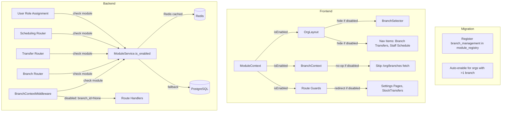

# Design Document: Branch Module Gating

## Overview

This feature gates all branch-related functionality behind a `branch_management` module toggle in the existing module registry system. When disabled, the application operates as a single-location system: branch selectors, branch-scoped navigation, branch settings pages, branch context middleware scoping, branch CRUD endpoints, stock transfers, scheduling, and the `branch_admin` role are all suppressed. When enabled, everything works as currently implemented.

The implementation touches five layers:

1. **Database** — Alembic migration to register `branch_management` in `module_registry` and auto-enable for existing multi-branch organisations.
2. **Frontend Layout** — `OrgLayout` hides `BranchSelector`, active branch badge, and branch-related nav items when module is disabled.
3. **Frontend Context** — `BranchContext` operates in no-op mode (skips fetch, returns null branch) when module is disabled.
4. **Frontend Routing** — Branch Management, Branch Settings, and Stock Transfers pages redirect to Dashboard when module is disabled.
5. **Backend** — `BranchContextMiddleware` passes through without scoping; branch CRUD, stock transfer, and scheduling endpoints return 403; `branch_admin` role is hidden from assignment.

The design reuses the existing module system patterns: `ModuleService.is_enabled(org_id, "branch_management")` on the backend with Redis caching, and `useModules().isEnabled("branch_management")` on the frontend via `ModuleContext`.

## Architecture



### Decision: Dependency-Free Module

`branch_management` is registered as an independent, non-core module with no dependencies and no dependents. It is not added to `DEPENDENCY_GRAPH` in `modules.py`. This means enabling/disabling it has no cascade effects on other modules. Branch features are orthogonal to inventory, scheduling, etc. — those modules work fine without branch scoping (they just operate in single-location mode).

### Decision: Middleware Module Check Placement

The `BranchContextMiddleware` checks module enablement early, right after extracting `org_id` from `request.state`. If disabled, it sets `branch_id = None` and passes through immediately — no header validation, no DB lookup for branch ownership, no 403 for invalid headers. This keeps the hot path fast for single-location orgs.

### Decision: GET /org/branches Still Works When Disabled

`GET /org/branches` remains accessible even when the module is disabled (returns the single default branch). This preserves backward compatibility for any component that references branch data without being explicitly branch-aware. Only mutating endpoints (POST, PUT, DELETE) are gated.

## Components and Interfaces

### 1. Alembic Migration (`0137_register_branch_management_module.py`)

**Operations:**
- Insert into `module_registry`: slug `branch_management`, display_name "Branch Management", category "operations", is_core `false`, dependencies `[]`, status "available".
- Uses `ON CONFLICT ON CONSTRAINT uq_module_registry_slug DO NOTHING` for idempotency.
- Subquery: find all `org_id` values from `branches` table grouped by `org_id` having `COUNT(*) > 1`.
- For each, insert into `org_modules` with `module_slug = 'branch_management'`, `is_enabled = true`, using `ON CONFLICT DO NOTHING`.

### 2. Frontend — OrgLayout Changes (`OrgLayout.tsx`)

**Nav item definitions:**
- Add `module: 'branch_management'` to the "Branch Transfers" and "Staff Schedule" nav items.
- The existing `visibleNavItems` filter already checks `item.module` against `isEnabled()` — no filter logic changes needed.

**Header rendering:**
- Read `isEnabled('branch_management')` from `useModules()`.
- Conditionally render `<BranchSelector />` and active branch indicator only when enabled.

### 3. Frontend — BranchContext Changes (`BranchContext.tsx`)

**New field:** `isBranchModuleEnabled: boolean` derived from `useModules().isEnabled('branch_management')`.

**Behavior when disabled:**
- Skip the `fetchBranches` effect entirely (no API call to `/org/branches`).
- Set `branches` to `[]`, `selectedBranchId` to `null`.
- Still expose the context value so `useBranch()` consumers don't throw.
- The `apiClient` interceptor that sends `X-Branch-Id` header will send nothing (null branch = no header), which is correct for single-location mode.

**Behavior when enabled:** No change from current implementation.

### 4. Frontend — Route Guards

**Affected pages:**
- `BranchManagement.tsx` — settings sub-page
- `BranchSettings.tsx` — settings sub-page
- `StockTransfers.tsx` — inventory sub-page

**Implementation:** Each page checks `isEnabled('branch_management')` at the top of the component. If disabled, render `<Navigate to="/dashboard" replace />`. This is the same pattern used by other module-gated pages.

**Settings navigation:** The settings page sidebar hides "Branch Management" and "Branch Settings" links when the module is disabled, using the same `isEnabled` check.

### 5. Backend — BranchContextMiddleware Changes (`branch_context.py`)

**New early check** after extracting `org_id` from `request.state`:

```python
# Check if branch_management module is enabled for this org
if org_id and not await self._is_branch_module_enabled(org_id):
    request.state.branch_id = None
    await self.app(scope, receive, send)
    return
```

**Helper method** `_is_branch_module_enabled(org_id)`:
- Uses `ModuleService.is_enabled(org_id, "branch_management")` with a lightweight DB session.
- The Redis cache (60s TTL) ensures this adds negligible latency.

### 6. Backend — Branch Router Gating (`organisations/router.py`)

**Gated endpoints:**
- `POST /org/branches` (create)
- `PUT /org/branches/{id}` (update)
- `DELETE /org/branches/{id}` (deactivate)
- `POST /org/branches/{id}/reactivate` (reactivate)

**Not gated:**
- `GET /org/branches` (list) — still returns the default branch for backward compatibility.

**Implementation:** A shared dependency `require_branch_module` that checks `ModuleService.is_enabled(org_id, "branch_management")` and raises HTTP 403 with message "Branch management module is not enabled for this organisation".

### 7. Backend — Transfer Router Gating (`inventory/transfer_router.py`)

All endpoints in the transfer router get the `require_branch_module` dependency. When disabled, all return HTTP 403 with the same message.

### 8. Backend — Scheduling Router Gating (`scheduling/router.py`)

All endpoints in the scheduling router get the `require_branch_module` dependency. When disabled, all return HTTP 403 with the same message.

### 9. Backend — Role Assignment Gating (`organisations/router.py`)

**`invite_user` and `update_user` endpoints:**
- When `branch_management` is disabled and the requested role is `branch_admin`, return HTTP 400 with "branch_admin role requires the Branch Management module to be enabled".
- When listing assignable roles (if such an endpoint exists), exclude `branch_admin` from the response.

**Frontend role selector:**
- Filter out `branch_admin` from the role dropdown when `isEnabled('branch_management')` is false.

### 10. Frontend — GlobalBranchOverview Enhancement (`GlobalBranchOverview.tsx`)

**New column:** "Module Status" showing whether `branch_management` is enabled/disabled per org.
**New filter:** Dropdown to filter by module status (enabled/disabled/all).

The global admin endpoint `GET /admin/branches` will be extended to include `branch_module_enabled: boolean` per row, derived from a LEFT JOIN on `org_modules`.

### 11. Frontend — Module Disable Safeguards

When an org_admin toggles `branch_management` off in the module management UI:
- If the org has >1 active branch, show a confirmation dialog warning about the impact.
- Warning text: "Disabling Branch Management will hide all branch features. Your existing branch data will be preserved but branch scoping will be suspended. Users with the branch_admin role will lose branch-specific access."
- On confirm, the existing `ModuleService.force_disable_module` handles the disable.
- No automatic role changes — org_admin must reassign `branch_admin` users manually.
- Re-enabling restores all features using preserved branch data.

## Data Models

### Module Registry Entry

| Field | Value |
|-------|-------|
| slug | `branch_management` |
| display_name | Branch Management |
| description | Multi-branch support: branch selector, branch-scoped data, inter-branch transfers, per-branch scheduling, and branch_admin role. |
| category | operations |
| is_core | false |
| dependencies | `[]` |
| incompatibilities | `[]` |
| status | available |

### Shared Backend Dependency

```python
async def require_branch_module(request: Request, db: AsyncSession = Depends(get_db_session)):
    """FastAPI dependency that gates endpoints behind branch_management module."""
    org_id = getattr(request.state, "org_id", None)
    if not org_id:
        return  # No org context — let other middleware handle
    svc = ModuleService(db)
    if not await svc.is_enabled(org_id, "branch_management"):
        raise HTTPException(
            status_code=403,
            detail="Branch management module is not enabled for this organisation",
        )
```

### Frontend Guard Pattern

```tsx
// In any gated page component
import { useModules } from '@/contexts/ModuleContext'
import { Navigate } from 'react-router-dom'

export default function BranchManagement() {
  const { isEnabled } = useModules()
  if (!isEnabled('branch_management')) return <Navigate to="/dashboard" replace />
  // ... rest of component
}
```


## Correctness Properties

*A property is a characteristic or behavior that should hold true across all valid executions of a system — essentially, a formal statement about what the system should do. Properties serve as the bridge between human-readable specifications and machine-verifiable correctness guarantees.*

### Property 1: Migration auto-enable correctness

*For any* organisation in the database, after the migration runs, `branch_management` is enabled if and only if the organisation has more than one row in the `branches` table. Organisations with zero or one branch must not have the module enabled.

**Validates: Requirements 1.3, 2.2, 2.4**

### Property 2: BranchSelector and badge conditional rendering

*For any* organisation, the BranchSelector component and active branch indicator badge are rendered in the OrgLayout header if and only if `branch_management` is enabled for that organisation.

**Validates: Requirements 3.1, 3.2, 3.3**

### Property 3: Nav item visibility gating

*For any* organisation, the "Branch Transfers" and "Staff Schedule" navigation items are visible in the sidebar if and only if `branch_management` is enabled (and existing `adminOnly` gating is satisfied).

**Validates: Requirements 4.1, 4.2, 4.3**

### Property 4: Branch-gated page redirect

*For any* organisation with `branch_management` disabled, navigating to any branch-gated page URL (Branch Management, Branch Settings, Stock Transfers) results in a redirect to the Dashboard. When enabled, these pages render normally.

**Validates: Requirements 5.1, 5.2, 5.3, 5.4, 6.1, 6.2**

### Property 5: BranchContext no-op mode

*For any* organisation with `branch_management` disabled, the BranchContext provider returns `selectedBranchId = null`, `branches = []`, makes no API call to `/org/branches`, and `useBranch()` does not throw.

**Validates: Requirements 7.1, 7.2, 7.3, 7.4**

### Property 6: Middleware passthrough when disabled

*For any* organisation with `branch_management` disabled and *for any* value of the `X-Branch-Id` header (valid UUID, invalid string, or absent), the BranchContextMiddleware sets `request.state.branch_id` to `None` and does not return a 403 response.

**Validates: Requirements 8.1, 8.3**

### Property 7: Branch CRUD mutation gating

*For any* organisation with `branch_management` disabled, requests to mutating branch endpoints (POST, PUT, DELETE on `/org/branches`) return HTTP 403 with the message "Branch management module is not enabled for this organisation".

**Validates: Requirements 9.1, 9.2, 9.3**

### Property 8: GET /org/branches accessible when disabled

*For any* organisation with `branch_management` disabled, `GET /org/branches` returns a successful response (HTTP 200) containing the organisation's branch data.

**Validates: Requirements 9.4**

### Property 9: Role assignment gating

*For any* organisation with `branch_management` disabled, `branch_admin` is excluded from assignable roles, and any attempt to assign `branch_admin` to a user returns HTTP 400. When enabled, `branch_admin` is assignable.

**Validates: Requirements 10.1, 10.2, 10.3, 10.4**

### Property 10: Transfer and scheduling endpoint gating

*For any* organisation with `branch_management` disabled, requests to any stock transfer endpoint or scheduling endpoint return HTTP 403 with the message "Branch management module is not enabled for this organisation".

**Validates: Requirements 11.1, 12.1**

### Property 11: Disable preserves branch_admin user roles

*For any* organisation that has users with the `branch_admin` role, disabling `branch_management` does not change those users' roles. The roles remain `branch_admin` in the database.

**Validates: Requirements 14.3**

### Property 12: Disable/re-enable round trip

*For any* organisation with branch data, disabling `branch_management` and then re-enabling it restores all branch features — the branch data, branch context, and branch-gated endpoints all function identically to before the disable.

**Validates: Requirements 14.4**

### Property 13: Module independence — no cascade effects

*For any* organisation, enabling or disabling `branch_management` does not cause any other module to be enabled or disabled. `branch_management` has no entries in `DEPENDENCY_GRAPH` and no dependents.

**Validates: Requirements 15.2, 15.3, 15.4**

### Property 14: Signup plan gating

*For any* new organisation created via the signup wizard, `branch_management` is enabled if and only if the organisation's subscription plan includes `branch_management` in its `enabled_modules` list.

**Validates: Requirements 1.4**

## Error Handling

| Scenario | Layer | Response |
|----------|-------|----------|
| Module disabled + mutating branch endpoint | Backend Router | HTTP 403: "Branch management module is not enabled for this organisation" |
| Module disabled + stock transfer endpoint | Backend Router | HTTP 403: "Branch management module is not enabled for this organisation" |
| Module disabled + scheduling endpoint | Backend Router | HTTP 403: "Branch management module is not enabled for this organisation" |
| Module disabled + assign branch_admin role | Backend Router | HTTP 400: "branch_admin role requires the Branch Management module to be enabled" |
| Module disabled + direct URL to gated page | Frontend | Redirect to `/dashboard` |
| Module disabled + BranchContext | Frontend | No-op: null branch, empty array, no error |
| Module disabled + BranchContextMiddleware | Backend Middleware | Passthrough: branch_id=None, no 403 |
| Redis cache miss during module check | Backend | Falls back to DB query (existing ModuleService behavior) |
| Redis unavailable during module check | Backend | Falls back to DB query with warning log (existing behavior) |
| Migration re-run (idempotent) | Database | ON CONFLICT DO NOTHING — no errors, no duplicates |

## Testing Strategy

### Property-Based Testing

**Library:** Python `hypothesis` (backend), TypeScript `fast-check` (frontend) — both already in use in this project.

**Configuration:** Minimum 100 iterations per property test.

**Tag format:** `Feature: branch-module-gating, Property {N}: {title}`

Each correctness property maps to a single property-based test:

| Property | Test Location | Approach |
|----------|--------------|----------|
| P1: Migration auto-enable | `tests/properties/test_branch_module_gating_properties.py` | Generate random sets of orgs with varying branch counts; verify module enablement matches branch count > 1 |
| P2: BranchSelector rendering | `frontend/src/pages/__tests__/branch-module-gating.properties.test.ts` | Generate random module states; verify BranchSelector presence matches enablement |
| P3: Nav item visibility | `frontend/src/pages/__tests__/branch-module-gating.properties.test.ts` | Generate random module states; verify nav item filtering |
| P4: Page redirect | `frontend/src/pages/__tests__/branch-module-gating.properties.test.ts` | Generate random module states + page URLs; verify redirect behavior |
| P5: BranchContext no-op | `frontend/src/pages/__tests__/branch-module-gating.properties.test.ts` | Generate random module states; verify context values |
| P6: Middleware passthrough | `tests/properties/test_branch_module_gating_properties.py` | Generate random X-Branch-Id headers (valid UUIDs, invalid strings, None); verify branch_id=None and no 403 |
| P7: Branch CRUD gating | `tests/properties/test_branch_module_gating_properties.py` | Generate random HTTP methods (POST/PUT/DELETE) and branch IDs; verify 403 |
| P8: GET still works | `tests/properties/test_branch_module_gating_properties.py` | Generate random orgs with module disabled; verify GET returns 200 |
| P9: Role assignment gating | `tests/properties/test_branch_module_gating_properties.py` | Generate random user/role combinations; verify branch_admin rejected when disabled |
| P10: Transfer + scheduling gating | `tests/properties/test_branch_module_gating_properties.py` | Generate random transfer/scheduling endpoints; verify 403 when disabled |
| P11: Role preservation | `tests/properties/test_branch_module_gating_properties.py` | Generate orgs with branch_admin users; disable module; verify roles unchanged |
| P12: Round trip | `tests/properties/test_branch_module_gating_properties.py` | Generate orgs with branch data; disable then re-enable; verify state restored |
| P13: Module independence | `tests/properties/test_branch_module_gating_properties.py` | Generate random module states; enable/disable branch_management; verify no other modules changed |
| P14: Signup plan gating | `tests/properties/test_branch_module_gating_properties.py` | Generate random plans with/without branch_management; create org; verify enablement |

### Unit Testing

Unit tests complement property tests for specific examples and edge cases:

- **Migration:** Verify exact row values in module_registry after migration; verify idempotency by running twice.
- **Middleware:** Test specific header values (empty string, malformed UUID, valid UUID for wrong org) when module disabled.
- **Router gating:** Test each gated endpoint individually with module disabled/enabled.
- **Frontend:** Test BranchSelector not rendered when disabled; test redirect from each gated page; test settings nav link visibility.
- **Global admin:** Test Module Status column renders; test filter by module status.
- **Disable safeguards:** Test confirmation dialog appears for multi-branch orgs; test dialog does not appear for single-branch orgs.

### E2E Testing

- `tests/e2e/frontend/branch-module-gating.spec.ts`: Full flow — disable module, verify UI hides branch features, re-enable, verify features return.
