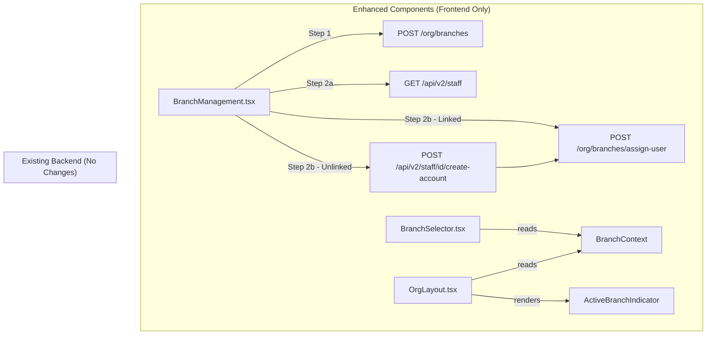

# Design Document: Branch Staff Assignment and Switcher

## Overview

This feature enhances the existing branch management UI with two capabilities:

1. A two-step branch creation modal that lets Org_Admins assign staff to a new branch during creation (Step 1: branch details, Step 2: staff assignment).
2. Enhanced visual prominence for the BranchSelector and an active branch indicator in the OrgLayout header.

No new backend modules or database migrations are required. The feature reuses existing API endpoints:
- `GET /api/v2/staff` — fetch staff list
- `POST /org/branches` — create branch
- `POST /org/branches/assign-user` — assign a user to branches
- `POST /api/v2/staff/{id}/create-account` — create user account for unlinked staff

The existing `BranchContext` already manages `selectedBranchId` and `branches` — this feature only enhances the visual layer and the branch creation workflow.

## Architecture



The architecture is purely frontend. The two-step modal orchestrates multiple existing API calls sequentially. The visual enhancements read from the existing `BranchContext` and apply conditional CSS classes.

### Design Decisions

1. **Sequential API calls in Step 2**: Branch creation happens first, then staff assignments are fired in parallel via `Promise.allSettled`. This ensures the branch exists before assignments, and partial failures don't block the branch creation.

2. **No new backend endpoints**: The existing `POST /org/branches/assign-user` accepts `{ user_id, branch_ids }` which is exactly what we need. For unlinked staff, we first call `POST /api/v2/staff/{id}/create-account` to get a `user_id`, then assign branches.

3. **Client-side filtering for staff search**: The staff list is fetched once on Step 2 mount and filtered in-memory. For most organisations the staff count is manageable (< 200). This avoids adding a search parameter to the existing staff API.

4. **BranchSelector visual enhancement via conditional Tailwind classes**: No new CSS files or design tokens. The colored badge state is achieved by swapping Tailwind classes based on `selectedBranchId !== null`.

## Components and Interfaces

### Modified: `BranchManagement.tsx`

The existing "Add Branch" modal is replaced with a two-step modal:

```typescript
// New internal state for the two-step modal
interface StaffMember {
  id: string
  name: string
  first_name: string
  last_name: string | null
  email: string | null
  position: string | null
  user_id: string | null  // null = Unlinked_Staff
  is_active: boolean
}

interface StaffSelection {
  staffId: string
  userId: string | null   // null means needs account creation
  selected: boolean
}

// Step state
type ModalStep = 'details' | 'staff'
```

**Step 1 (details)**: Same as current modal — name, address, phone fields. "Next" button proceeds to Step 2. "Create" button skips Step 2 and creates immediately.

**Step 2 (staff)**: Fetches `GET /api/v2/staff?is_active=true` on mount. Displays staff list with:
- Linked staff: checkbox labelled "Grant branch access" + "Has account" badge (info variant)
- Unlinked staff: checkbox labelled "Invite to manage this branch" + "No account" badge (neutral variant). Disabled if no email, with tooltip.
- Search input filtering by name/email/position
- Selected count display: "N staff selected"
- "Back", "Skip", and "Create" buttons

**Creation flow**:
1. `POST /org/branches` with `{ name, address, phone }`
2. For each selected linked staff: `POST /org/branches/assign-user` with `{ user_id, branch_ids: [newBranchId] }`
3. For each selected unlinked staff: `POST /api/v2/staff/{id}/create-account` with `{ password: <generated> }`, then `POST /org/branches/assign-user` with the returned `user_id`
4. On partial failure: show warning toast listing failed staff names, keep the branch

### Modified: `BranchSelector.tsx`

Enhanced with conditional styling:

```typescript
// When selectedBranchId is not null (specific branch selected):
// - Apply blue background, white text, blue border
// - Show branch name in a badge-like pill style

// When selectedBranchId is null ("All Branches"):
// - Keep current neutral gray styling
```

The component remains a `<select>` element with the same `onChange` handler. Only the CSS classes change conditionally.

### Modified: `OrgLayout.tsx`

Add an `ActiveBranchIndicator` inline component adjacent to the `<BranchSelector />`:

```typescript
// Renders when selectedBranchId is not null
// Shows: colored dot (●) + branch name text
// Hidden when "All Branches" is selected
// Responsive: truncates branch name on small viewports
```

### New: `useStaffForBranch` hook (inline in BranchManagement.tsx)

Not a separate file — just a local function that:
1. Calls `GET /api/v2/staff?is_active=true`
2. Returns `{ staff, loading, error, retry }`
3. Uses `AbortController` for cleanup

## Data Models

### Frontend Types (no backend changes)

```typescript
// Staff member as returned by GET /api/v2/staff
interface StaffMemberFromAPI {
  id: string
  org_id: string
  user_id: string | null
  name: string
  first_name: string
  last_name: string | null
  email: string | null
  phone: string | null
  position: string | null
  role_type: string          // "employee" | "contractor"
  is_active: boolean
  location_assignments: Array<{
    id: string
    staff_id: string
    location_id: string
    assigned_at: string
  }>
}

// Internal selection tracking
interface StaffAssignmentSelection {
  staffId: string
  userId: string | null       // null = unlinked, needs account creation
  email: string | null
  name: string
  selected: boolean
  canInvite: boolean          // false if unlinked + no email
}

// Branch creation request (existing shape)
interface BranchCreatePayload {
  name: string
  address: string
  phone: string
}

// Assign user to branches request (existing shape)
interface AssignUserBranchesPayload {
  user_id: string
  branch_ids: string[]
}

// Create staff account request (existing shape)
interface CreateStaffAccountPayload {
  password: string
}
```

### API Response Shapes (existing, no changes)

| Endpoint | Response Shape |
|----------|---------------|
| `GET /api/v2/staff` | `{ staff: StaffMemberFromAPI[], total: number, page: number, page_size: number }` |
| `POST /org/branches` | `{ id: string, name: string, address: string \| null, phone: string \| null, is_active: boolean }` |
| `POST /org/branches/assign-user` | `{ message: string, user_id: string, branch_ids: string[] }` |
| `POST /api/v2/staff/{id}/create-account` | `{ message: string, user_id: string, email: string, staff: StaffMemberFromAPI }` |

### Safe API Consumption

All API calls follow the safe-api-consumption patterns:

```typescript
// Staff list fetch
const res = await apiClient.get<{ staff: StaffMemberFromAPI[]; total: number }>('/api/v2/staff', { params: { is_active: true }, signal })
setStaffList(res.data?.staff ?? [])

// Branch creation
const branchRes = await apiClient.post<{ id: string }>('/org/branches', payload)
const newBranchId = branchRes.data?.id ?? ''

// Assign user
const assignRes = await apiClient.post<{ user_id: string; branch_ids: string[] }>('/org/branches/assign-user', payload)
```


## Correctness Properties

*A property is a characteristic or behavior that should hold true across all valid executions of a system — essentially, a formal statement about what the system should do. Properties serve as the bridge between human-readable specifications and machine-verifiable correctness guarantees.*

### Property 1: Step navigation requires valid branch name

*For any* string provided as the branch name, the "Next" button to proceed from Step 1 to Step 2 should be enabled if and only if the trimmed string is non-empty.

**Validates: Requirements 1.2**

### Property 2: Staff display includes required fields

*For any* staff member object with name, position, and email fields, the rendered staff list item should contain all three values (or a placeholder for null fields).

**Validates: Requirements 1.5**

### Property 3: Badge classification by account status

*For any* staff member, the badge text should be "Has account" when `user_id` is not null, and "No account" when `user_id` is null.

**Validates: Requirements 2.4, 3.4**

### Property 4: Checkbox toggle manages selection set

*For any* staff member whose checkbox is enabled, toggling the checkbox should add the staff member to the selection set if not present, and remove them if already present. The selection set size should change by exactly 1 on each toggle.

**Validates: Requirements 2.2, 2.3, 3.2**

### Property 5: Unlinked staff without email cannot be invited

*For any* staff member where `user_id` is null and `email` is null or empty, the invite checkbox should be disabled and the staff member should not be addable to the selection set.

**Validates: Requirements 3.3**

### Property 6: API call orchestration matches staff type

*For any* set of selected staff members, the creation flow should produce exactly one `assign-user` call per linked staff member, and exactly one `create-account` call followed by one `assign-user` call per invitable unlinked staff member.

**Validates: Requirements 4.2, 4.3**

### Property 7: Branch selector styling reflects selection state

*For any* branch selection where `selectedBranchId` is not null, the selector element should have the colored/active CSS classes applied. When `selectedBranchId` is null, the selector should have neutral CSS classes.

**Validates: Requirements 5.1, 5.2, 5.3**

### Property 8: Active branch indicator matches current selection

*For any* sequence of branch switches, the active branch indicator text should always equal the name of the currently selected branch, and should be hidden when "All Branches" is selected.

**Validates: Requirements 6.1, 6.4**

### Property 9: Staff search filters by name, email, or position

*For any* search query string and any list of staff members, the filtered result should contain exactly those staff members whose name, email, or position contains the query as a case-insensitive substring.

**Validates: Requirements 8.1, 8.2, 8.3**

### Property 10: Selected count matches actual selections

*For any* combination of checkbox toggles on the staff list, the displayed "N staff selected" count should equal the number of staff members currently in the selection set.

**Validates: Requirements 8.4**

## Error Handling

| Scenario | Handling |
|----------|----------|
| `GET /api/v2/staff` fails on Step 2 | Display inline error message with "Retry" and "Skip" buttons. Staff list shows empty state. |
| `POST /org/branches` fails | Show error toast "Failed to create branch". Modal stays open on Step 2 (or Step 1 if skipped). |
| `POST /org/branches/assign-user` fails for some staff | Use `Promise.allSettled`. Show warning toast listing failed staff names. Branch is kept. |
| `POST /api/v2/staff/{id}/create-account` fails | Treat as assignment failure for that staff member. Include in warning toast. |
| Staff list returns empty array | Show "No staff members found" message. "Skip" and "Create" buttons remain available. |
| Network timeout on any call | Caught by axios interceptor. Error toast displayed. Modal remains interactive. |
| User navigates away during creation | `AbortController` cancels in-flight requests. No orphaned state. |

All API responses use safe consumption patterns:
- `res.data?.staff ?? []` for staff list
- `res.data?.id ?? ''` for branch ID
- `res.data?.user_id ?? ''` for created user ID

## Testing Strategy

### Unit Tests

- Modal renders Step 1 by default with name, address, phone fields
- "Next" button disabled when name is empty, enabled when name has content
- Step 2 renders staff list after fetch completes
- Linked staff shows "Grant branch access" checkbox and "Has account" badge
- Unlinked staff shows "Invite to manage this branch" checkbox and "No account" badge
- Unlinked staff without email has disabled checkbox with tooltip
- "Skip" button creates branch without assignments
- "Back" button returns to Step 1 with preserved form data
- Error state renders retry button on staff fetch failure
- Empty staff list shows "No staff members found" message
- Branch selector applies colored classes when branch is selected
- Branch selector applies neutral classes when "All Branches" is selected
- Active branch indicator shows branch name when selected
- Active branch indicator hidden when "All Branches" is selected

### Property-Based Tests

Library: `fast-check` (already used in the project for frontend property tests)

Each property test must run a minimum of 100 iterations and be tagged with the design property reference.

```typescript
// Tag format for each test:
// Feature: branch-staff-assignment-and-switcher, Property N: <property_text>
```

- **Property 1**: Generate arbitrary strings. Verify `canProceed` is true iff `name.trim().length > 0`.
- **Property 2**: Generate random staff objects. Verify rendered output contains name, position, email.
- **Property 3**: Generate staff objects with random `user_id` (null or UUID string). Verify badge text matches.
- **Property 4**: Generate a list of staff and a random sequence of toggle actions. Verify selection set size changes by exactly 1 per toggle.
- **Property 5**: Generate unlinked staff (user_id=null) with null/empty email. Verify they cannot be added to selection.
- **Property 6**: Generate a mixed list of linked and unlinked staff selections. Verify the correct count and type of API calls.
- **Property 7**: Generate random branch IDs (including null). Verify CSS class assignment matches selection state.
- **Property 8**: Generate a sequence of branch switches. Verify indicator text matches the last selected branch name.
- **Property 9**: Generate random staff lists and search queries. Verify filtered results match case-insensitive substring containment on name/email/position.
- **Property 10**: Generate random toggle sequences. Verify displayed count equals selection set size.

### Test Configuration

```typescript
// fast-check settings for all property tests
fc.assert(
  fc.property(/* arbitraries */, (input) => {
    // property assertion
  }),
  { numRuns: 100 }
)
```
