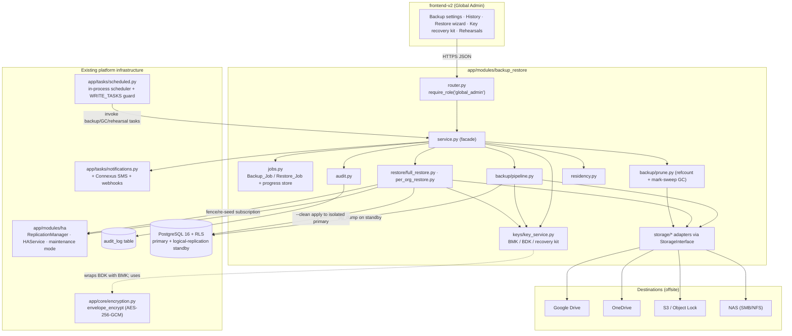
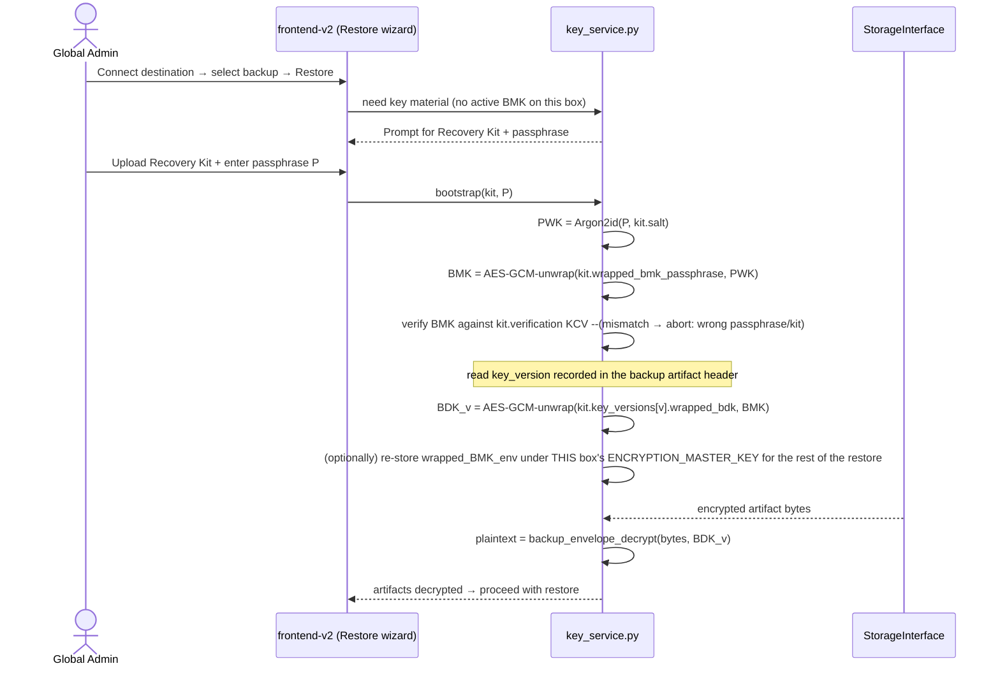

# Design Document — Cloud Backup & Restore (Platform DR/BCP)

## Overview

This feature is a platform-wide Disaster Recovery / Business Continuity (DR/BCP) subsystem for OraInvoice, operated exclusively from the Global Admin tier. It produces full `pg_dump` custom-format database dumps plus content-addressed, incrementally-deduplicated file blobs, encrypts everything client-side under a **dedicated, escrowed backup key hierarchy** (NOT the deployment's `ENCRYPTION_MASTER_KEY`), and uploads the encrypted artifact set to one or more pluggable destinations (Google Drive, OneDrive, S3-compatible, NAS) through a single provider-agnostic `Storage_Interface`. It supports full restore (with maintenance mode, standby fencing, pre-restore snapshot, and automatic rollback), per-organisation restore (with org-scoped vs shared-global classification), dry-run validation, schema-compatibility checks, and scheduled restore rehearsals.

The defining constraint of this feature is **recoverability after total loss of the original deployment**. A fresh deployment that has only just connected a cloud account holding backups must be able to decrypt and restore them. Because `ENCRYPTION_MASTER_KEY` is regenerated on a fresh deploy (it is part of what is lost in a disaster), backup artifacts cannot be encrypted under it. The design therefore introduces a separate **Backup_Master_Key (BMK) → Backup_Data_Key (BDK)** hierarchy whose root of trust is escrowed out-of-band (an operator recovery passphrase / exported recovery kit), with the wrapped key material *also* stored in the DB for seamless normal operation.

### Relationship to existing specs and modules

This feature deliberately reuses, rather than reinvents, established codebase machinery:

| Concern | Reused from | How |
|---|---|---|
| Client-side encryption primitives | `app/core/encryption.py` (`envelope_encrypt`/`envelope_decrypt`) | BDKs wrap/encrypt via the same AES-256-GCM envelope, but under the BMK rather than `ENCRYPTION_MASTER_KEY` |
| Operational secret storage (OAuth tokens, S3/NAS creds) | `app/core/encryption.py` under `ENCRYPTION_MASTER_KEY` | destination credentials are operational secrets, encrypted exactly like Stripe/Xero credentials (Req 2.4, 28.4, 29.4) |
| Scheduling | `app/tasks/scheduled.py` in-process scheduler (`_DAILY_TASKS`, Redis `scheduler:loop_lock`, `WRITE_TASKS` standby guard) | backup schedule + GC + rehearsal register as scheduled tasks; all are `WRITE_TASKS` |
| HA fence / re-seed | `app/modules/ha/` (`ReplicationManager`, `HAService`) and the `ha-orchestrated-switchover` spec | full restore fences the standby by disabling/dropping the logical-replication subscription, then re-seeds it |
| RLS / session pattern | `app/core/database.py` (`get_db_session`, `_set_rls_org_id`, `async_session_factory`) | per-org restore writes are RLS-scoped; full restore uses a raw privileged connection |
| Notifications | `app/tasks/notifications.py`, `app/modules/notifications/service.py`, Connexus SMS | backup/restore outcome emails, SMS, in-app |
| Audit | `app/modules/admin/models.py::AuditLog` (`audit_log` table) | write-ahead + completion audit entries for every action |
| Per-org file backup precedent | `byo-drive-backup` spec (rsync volume copy) | DB dump reads the standby over the network; file capture reads the primary's local volumes (the rsync source) — see Backup Pipeline step 4 |

### Distinction from `byo-drive-backup`

`byo-drive-backup` is per-organisation, org-admin-operated, writes a per-org DB slice to each org's own Drive, and encrypts under `ENCRYPTION_MASTER_KEY`. `cloud-backup-restore` is platform-wide, Global-Admin-only, dumps the *entire* database with `pg_dump`, and encrypts under the escrowed BMK/BDK hierarchy so a fresh deployment can recover. The two coexist; this feature does not replace `byo-drive-backup`.

> **Design note on "CloudNativePG".** Requirement 12 refers to "CloudNativePG streaming replication". The actual OraInvoice deployment topology (Docker Compose on Ubuntu/Raspberry Pi) uses **PostgreSQL logical replication** — a publication `orainvoice_ha_pub` on the primary and a subscription `orainvoice_ha_sub` on the standby, managed by `app/modules/ha/replication.py` — plus rsync volume sync for files (`app/modules/ha/volume_sync_service.py`). Throughout this design, every reference to "fence / detach the Standby_Node" and "re-seed the standby" maps to this logical-replication topology: **fence = disable/drop the subscription on the standby; re-seed = re-create the subscription (and, if needed, a full `copy_data=true` resync)**. The canonical Req 12.15 sequence is implemented against this real mechanism (see Restore Pipeline).

## Architecture

### Module layout

The feature follows the standard module pattern (`router.py` / `service.py` / `models.py` / `schemas.py`) under a new module `app/modules/backup_restore/`:

```
app/modules/backup_restore/
  __init__.py
  router.py                  # Global-admin-only FastAPI router, mounted /api/v1/backup
  models.py                  # SQLAlchemy models (platform/global tables — no org_id)
  schemas.py                 # Pydantic request/response models ({items,total} for lists)
  service.py                 # Orchestration facade used by the router
  keys/
    key_service.py           # BMK/BDK hierarchy, recovery-kit, KDF wrap/unwrap, key-version registry
  storage/
    interface.py             # StorageInterface ABC (the 5 operations)
    google_drive.py          # GoogleDriveAdapter (resumable upload)
    onedrive.py              # OneDriveAdapter (upload session)
    s3.py                    # S3Adapter (multipart + Object Lock)
    nas.py                   # NasAdapter (SMB/NFS/volume, atomic temp-then-rename)
    registry.py              # provider-name -> adapter resolution (Req 3.5/3.6)
  backup/
    pipeline.py              # BackupPipeline: dump + CAS file capture + manifest assembly + fan-out
    pg_dump_runner.py        # pg_dump custom-format against the standby DB
    cas.py                   # content-addressed File_Blob store: hash, dedup, write-through capture
    manifest.py              # Backup_Manifest + File_Index + Per_Org_Index builders
    prune.py                 # retention, count-limit prune, refcount GC, mark-and-sweep orphan GC
  restore/
    full_restore.py          # canonical Req 12.15 full-restore sequence (maintenance + fence + snapshot + --clean + validate + re-seed/rollback)
    per_org_restore.py       # per-org extraction + org-scoped/shared-global classification + apply
    classifier.py            # Org_Scoped_Row vs Shared_Global_Row classification
    dry_run.py               # checksum + schema-compat validation only
    rehearsal.py             # scratch-environment restore rehearsal
  jobs.py                    # Backup_Job / Restore_Job lifecycle + progress/heartbeat store
  audit.py                   # write-ahead + completion audit helpers (wraps admin AuditLog)
  residency.py               # NZ Privacy Act data-residency notice derivation + acknowledgement
  config_service.py          # schedule / retention / RPO-RTO / notification config + validation
```

### Component diagram



### Where it plugs in

- **Scheduler**: `service.py` exposes `run_scheduled_backup_task()`, `run_blob_gc_task()`, and `run_rehearsal_task()`. These register in `_DAILY_TASKS` in `app/tasks/scheduled.py` and are added to `WRITE_TASKS` so they only run on the primary node (the standby skips them — Req 8, ISSUE-147). The scheduled-backup task itself honours the configured cron + `Backup_Window` internally (it short-circuits outside the window) following the `weekly_roster_broadcast` precedent.
- **HA module**: full restore drives the standby fence/re-seed through `ReplicationManager` and `HAService` and coordinates with the `ha-orchestrated-switchover` maintenance-mode endpoints rather than inventing a parallel path.
- **Notifications**: outcome dispatch reuses `app/tasks/notifications.py` (email), the Connexus SMS integration, and adds webhook delivery; new template types `backup_failed`, `backup_succeeded`, `restore_failed`, `restore_succeeded`, `rehearsal_failed`.
- **Audit**: every config change, connect/disconnect, backup, and restore writes to the existing `audit_log` table via `audit.py`.

## Storage Interface Contract and Per-Destination Adapters

### The five operations (Req 3.2)

`storage/interface.py` defines a provider-agnostic ABC. No parameter or return type references a specific provider (Req 3.2). All values are provider-independent.

```python
class ConnectionState(str, Enum):
    connected = "connected"
    disconnected = "disconnected"
    error = "error"

@dataclass
class RemoteObject:
    key: str            # provider-independent logical path/key, e.g. "backups/<id>/dump.enc"
    size_bytes: int
    modified_at: datetime | None

@dataclass
class UploadResult:
    key: str
    size_bytes: int
    checksum: str       # checksum of the encrypted bytes as stored

class StorageInterface(ABC):
    @abstractmethod
    async def upload(self, key: str, source: AsyncByteStream, *,
                     content_length: int, immutable_until: datetime | None = None) -> UploadResult: ...
    @abstractmethod
    async def list(self, prefix: str) -> list[RemoteObject]: ...
    @abstractmethod
    async def download(self, key: str) -> AsyncByteStream: ...
    @abstractmethod
    async def delete(self, key: str) -> None: ...
    @abstractmethod
    async def connection_status(self) -> ConnectionState: ...
```

All backup/restore logic depends only on this interface (Req 3.1, 3.4, 3.8). The active adapter is resolved at runtime from the destination configuration via `storage/registry.py`; if the configured provider has no registered adapter, the operation is rejected with a uniform "provider unavailable" error and no upload/list/download/delete is attempted (Req 3.5, 3.6). Any adapter-level failure is normalised to a uniform error result identifying the failed operation, preserving prior backup state (Req 3.7).

The content-addressed File_Blob model, manifest, File_Index, refcount pruning, and GC operate identically across all destination types (Req 3.9).

### Operation → provider mechanism mapping

| StorageInterface op | google_drive | onedrive | s3 | nas |
|---|---|---|---|---|
| `upload` | Resumable upload session; 16 MiB chunks (multiple of 256 KiB, 5–100 MiB bound); persist last acked byte offset; resume from offset (Req 4.1–4.7) | Upload session; same chunking/resume semantics | **Multipart upload**; persist last acked part; resume from last part; part size within 5–100 MiB subject to S3 5 MiB minimum (Req 4.8); set Object Lock retention when `immutable_until` given (Req 27) | Stream to a temp file in the configured dir, then **atomic rename** to final key; chunking optional but write is always atomic + retryable (Req 4.9) |
| `list` | `files.list` within the app-created folder | Graph `children` listing | `ListObjectsV2` by prefix | `os.scandir`/share walk of the configured dir |
| `download` | `files.get?alt=media`, ranged | Graph content download, ranged | `GetObject` (ranged for resume) | open + stream the file |
| `delete` | `files.delete` | Graph `DELETE` | `DeleteObject` (refused while under Object Lock — Req 27.3) | unlink (refused if path under WORM/immutable snapshot) |
| `connection_status` | token validity + folder reachable | token validity + folder reachable | `HeadBucket` reachability | mount/share reachability probe |

Adapter-specific details:

- **GoogleDriveAdapter / OneDriveAdapter** authenticate via the OAuth `OAuth_Connection` (access/refresh tokens stored envelope-encrypted under `ENCRYPTION_MASTER_KEY` — Req 2.4). Tokens are refreshed when within 60 s of expiry (Req 2.5); a revoked refresh token flips the connection to `disconnected`, dispatches one failure notification, and halts scheduling to that provider (Req 2.6). Tokens are excluded from all logging (Req 2.8).
- **S3Adapter** authenticates by access key ID / secret / optional session token (envelope-encrypted under `ENCRYPTION_MASTER_KEY` — Req 28.4). Honours endpoint URL (MinIO/B2/Wasabi), region, and addressing style (`path_style`/`virtual_hosted`, default virtual-hosted) (Req 28.5, 28.6). A save-time head-bucket-or-put-then-delete connection test gates the `connected` state (Req 28.7). Object Lock in compliance mode is the recommended Immutable_Copy target (Req 27.6).
- **NasAdapter** reaches the share as SMB/CIFS, NFS, or a pre-mounted `volume_path` (Req 29.2). Credentials envelope-encrypted under `ENCRYPTION_MASTER_KEY` (Req 29.4). Every write is temp-file-then-atomic-rename (Req 29.6). Save-time mount + write-then-delete test gates `connected` (Req 29.5). A standard NAS provides no WORM, so it is not an Immutable_Copy substitute unless it natively offers WORM/immutable snapshots (Req 27.6).

All four adapters always receive **already-encrypted bytes** — encryption happens in the pipeline before the adapter is called, so even an onshore NAS or S3 bucket only ever stores ciphertext (Req 16.11, 21.4, 28.9, 29.8).

### Multiple destinations (Req 30)

`config_service.py` allows several destinations with exactly one designated **primary** and zero or more **copy** destinations (one may be the Immutable_Copy). A backup fans out the identical encrypted artifact set to every destination. A copy-destination write failure is surfaced + notified but does not fail the job; a primary write failure fails the Backup_Job (Req 30.3, 30.5, 30.6). Restore may source from any destination holding the chosen backup (Req 30.4).

## Key Hierarchy and Escrow Design

This is the highest-risk section. It must guarantee two seemingly opposed properties: (1) **seamless normal operation** — backups encrypt/decrypt with no operator interaction during day-to-day running; and (2) **fresh-deployment recoverability** — a brand-new deployment that has lost `ENCRYPTION_MASTER_KEY` can still decrypt the backups using only material the operator holds out-of-band (Req 16.5–16.9).

### Why a separate hierarchy (not `ENCRYPTION_MASTER_KEY`)

`ENCRYPTION_MASTER_KEY` lives in the deployment's `.env`/config and is regenerated on a fresh deploy. If backup artifacts were encrypted under it, a total loss of the deployment would make every backup permanently undecryptable. Therefore backup artifacts use a dedicated, escrowed hierarchy whose root of trust is recoverable independently of the backed-up deployment (Req 16.1). `ENCRYPTION_MASTER_KEY` is still used — but only for **operational secrets that live on the running box and are re-provisioned on a fresh deploy**: OAuth tokens (Req 2.4), S3 credentials (Req 28.4), NAS credentials (Req 29.4). The two systems are never conflated.

### The hierarchy

```
Operator Recovery Passphrase  (held out-of-band by the operator; never stored)
        │  KDF (Argon2id)
        ▼
Passphrase-Wrapping Key (PWK)  (derived on demand; never stored)
        │  AES-256-GCM wrap
        ▼
Backup_Master_Key (BMK)  ── 256-bit random, generated once at backup-feature setup
        │  AES-256-GCM wrap           (wrapped-by-PWK form stored in backup_key_versions;
        │                              the same BMK is ALSO wrapped-by-ENCRYPTION_MASTER_KEY
        │                              for seamless normal operation)
        ▼
Backup_Data_Key (BDK)  ── 256-bit random, one per key-version (rotated per Req 16.10)
        │  AES-256-GCM (the envelope DEK layer, reusing app/core/encryption)
        ▼
Encrypted backup artifacts: pg_dump dump, each File_Blob, File_Index inner envelope,
Per_Org_Index org-identifying contents, Per_Org_Logical_Export
```

**Building on the existing envelope primitive.** `app/core/encryption.envelope_encrypt(plaintext) -> bytes` already produces `[4-byte DEK-len][AES-GCM-wrapped DEK][AES-GCM payload]`, wrapping a random per-record DEK under a key derived from `settings.encryption_master_key`. The backup key service reuses the **same AES-256-GCM construction** but substitutes the wrapping key: the BDK plays the role the master key plays in `envelope_encrypt`. Concretely, `keys/key_service.py` provides `backup_envelope_encrypt(plaintext, bdk) -> bytes` and `backup_envelope_decrypt(blob, bdk) -> bytes` — byte-compatible with the existing format but keyed by the BDK, never by `ENCRYPTION_MASTER_KEY`. This keeps one audited crypto code path and one storage format.

### KDF parameters

The PWK is derived from the operator passphrase with **Argon2id** (memory-hard, resistant to GPU brute force):

| Parameter | Value | Rationale |
|---|---|---|
| Algorithm | Argon2id | side-channel + GPU resistant; modern default |
| Memory cost | 256 MiB | strong on server hardware; tunable down to 64 MiB for Raspberry Pi via config |
| Time cost (iterations) | 3 | OWASP-aligned baseline |
| Parallelism | 4 | matches typical core counts |
| Salt | 16 bytes random, stored in the recovery kit and in `backup_key_versions` | unique per BMK |
| Output | 32 bytes (AES-256 key) | |

(The recommended Argon2id is provided by the **already-installed `cryptography` dependency** — `cryptography.hazmat.primitives.kdf.argon2.Argon2id`, available since cryptography 42 and present at the project's pinned `cryptography>=46.0.7` — so **no new dependency is required**. `scrypt` (also available via `cryptography` and the stdlib `hashlib.scrypt`) with `n=2**16, r=8, p=1` remains a config-tunable alternative; the key-version registry records which KDF + parameters were used so older kits remain decryptable. Argon2id is recommended.)

**Passphrase strength rules** (enforced at setup, Req 16): minimum 16 characters; must not be a known-breached value (zxcvbn score ≥ 3); the system also offers to *generate* a high-entropy passphrase (e.g. a 6-word diceware phrase ≈ 77 bits) which is the recommended default. The passphrase is never stored, never logged, and is held only in memory for the duration of a wrap/unwrap.

### Setup workflow (one-time, at backup-feature enablement)

```mermaid
sequenceDiagram
    actor Op as Global Admin
    participant UI as frontend-v2
    participant KS as key_service.py
    participant DB as backup_key_versions
    Op->>UI: Enable Cloud Backup → "Generate recovery kit"
    UI->>Op: Prompt: generate passphrase or enter one (strength-checked)
    Op->>UI: Supply / accept passphrase P
    UI->>KS: setup(P)
    KS->>KS: BMK = random(32)
    KS->>KS: salt = random(16); PWK = Argon2id(P, salt)
    KS->>KS: wrapped_BMK_pw  = AES-GCM-wrap(BMK, PWK)
    KS->>KS: wrapped_BMK_env = envelope_encrypt(BMK)   # under ENCRYPTION_MASTER_KEY, for seamless runtime
    KS->>KS: BDK_v1 = random(32); wrapped_BDK_v1 = AES-GCM-wrap(BDK_v1, BMK)
    KS->>DB: INSERT key_version=1 {salt, kdf_params, wrapped_BMK_pw, wrapped_BMK_env, wrapped_BDK_v1, is_active=true}
    KS-->>UI: Recovery Kit (download once)
    UI-->>Op: Show + download Recovery Kit; require "I have stored this offline" confirmation
```

**The Recovery Kit** is a downloadable file (and printable text) the operator must store offline (password manager, printed in a safe). It contains everything needed to bootstrap a fresh deployment *except the passphrase itself*:

```json
{
  "kit_version": 1,
  "spec": "cloud-backup-restore",
  "created_at": "2026-05-26T03:00:00Z",
  "kdf": {"algo": "argon2id", "mem_kib": 262144, "time": 3, "parallel": 4, "salt_b64": "..."},
  "wrapped_bmk_passphrase_b64": "...",        // BMK wrapped by PWK (passphrase-derived)
  "key_versions": [{"version": 1, "wrapped_bdk_b64": "...", "created_at": "..."}],
  "verification": {"bmk_kcv_b64": "..."}      // key-check value: AES-GCM of a known constant under BMK
}
```

The kit holds the **wrapped** BMK and wrapped BDKs — never the plaintext BMK and never the passphrase. Possession of the kit alone is useless without the passphrase; possession of the passphrase alone is useless without the kit (or the DB copy). At-rest, the same wrapped material lives in `backup_key_versions` so normal operation needs no operator input.

### Per-backup key usage (normal operation)

When a Backup_Job runs, the pipeline:
1. Loads the **active** key version from `backup_key_versions`; unwraps the BMK from `wrapped_BMK_env` using `ENCRYPTION_MASTER_KEY` (seamless — no passphrase needed during normal operation).
2. Unwraps the active BDK from `wrapped_bdk` using the BMK.
3. Encrypts the dump and every File_Blob with `backup_envelope_encrypt(plaintext, bdk)`.
4. Records the **key version** in the Backup_Manifest (cleartext catalog field is not required; the version is stored inside the encrypted envelope header per artifact and also in the manifest so restore knows which BDK to obtain — Req 16.5, 16.9).

### Fresh-deployment restore bootstrap (the DR path)

On a brand-new deployment, `ENCRYPTION_MASTER_KEY` is different/lost, so the `wrapped_BMK_env` copy is useless. The operator instead supplies the **recovery passphrase** + the **Recovery Kit** (or, if the DB survived, the kit material is read from `backup_key_versions`):



Guarantees enforced:
- The original `ENCRYPTION_MASTER_KEY` is **never required** for restore (Req 16.7). It is only an optimisation for normal operation.
- If the operator supplies no key material on a fresh box, the restore is refused before any write (Req 16.8).
- If the recorded key version is not present in the supplied material, or the unwrapped BDK fails to decrypt (KCV/GCM-tag mismatch), the restore aborts naming the required key version, with no partial writes (Req 16.9).
- A wrong passphrase fails fast at the BMK key-check-value step, before any artifact is downloaded.

### Key rotation and retention (Req 16.10)

Rotation mints a **new BDK and key version** (a new row in `backup_key_versions`, `is_active=true`, prior versions `is_active=false` but retained). Subsequent backups use the new version. Historical backups are **not** re-encrypted; their key version's wrapped BDK is retained for at least the configured backup retention period so they remain restorable. The recovery kit can be re-exported after rotation to include the new wrapped BDK; the design keeps every retained version's `wrapped_bdk` in `backup_key_versions` so even a stale kit plus the DB can recover, and a current kit alone can recover after total loss. The BMK itself is long-lived; rotating the *passphrase* re-derives a new PWK and re-wraps the same BMK (a cheap operation that does not touch any backup).

## Backup Pipeline

`backup/pipeline.py` orchestrates a Backup_Job end to end. Steps:

1. **Pre-flight + write-ahead audit.** Validate `Backup_Scope` ∈ {`settings_only`,`organisations_only`,`both`} (Req 6.1, 6.2). Durably write the write-ahead audit entry (`backup.created` start) — if it fails, abort before any work (Req 17.6, 17.7). Acquire the prune/GC mutual-exclusion lock for the destination set so no concurrent prune/GC can delete a blob this backup may reuse (Req 8.11).
2. **Resolve keys.** Load active key version; unwrap BMK (via `ENCRYPTION_MASTER_KEY`) then BDK (via BMK).
3. **Database dump (standby-sourced).** `backup/pg_dump_runner.py` runs `pg_dump -Fc` (custom format) against the **standby replica's database**, not the primary, so the dump never loads the primary serving live traffic (resolves Open Question 7/13, consistent with `byo-drive-backup`). The standby DB is reached over the network via the peer DB connection string built by `HAService.get_peer_db_url()` (the `peer_db_*` fields on `ha_config`); this is feasible from the primary-run task because it is a network connection, unlike the standby's *filesystem* (see file-capture note below). The dump runs within a single `REPEATABLE READ`/serializable export snapshot for an internally consistent database image (Req 23.2). The dump captures every non-template object — all schemas, tables, sequences, views, indexes, constraints, row data, feature flags, integration settings, and DB-stored BYTEA assets such as `platform_branding` images (Req 5.1, 5.2). `pg_dump` exit code 0 is required; a non-zero exit fails the job with a human-readable reason and a failure notification within 60 s (Req 5.6).
4. **File capture (content-addressed, deduplicated).** For `organisations_only`/`both`, `backup/cas.py` enumerates the storage roots `/app/uploads/` (all category subfolders) and `/app/compliance_files/` **wholesale** — no hardcoded category allowlist, so new categories are picked up automatically (Req 21.1, 21.2). DB-stored BYTEA assets (branding) are excluded because they travel inside the dump (Req 21.2).
   > **Code-accuracy note (resolves Open Question 13).** Files are read from the **primary node's own local volumes**, not the standby's copy. Rationale grounded in the actual code: the backup pipeline is registered as a `WRITE_TASK`, so the scheduler runs it **only on the primary** (`if role == "standby" and name in WRITE_TASKS: continue`). `app/modules/ha/volume_sync_service.py` rsyncs files **primary → standby over SSH** (`standby_ssh_host`), so the standby's copy lives on the *standby's* filesystem and is not reachable from a primary-run process; the primary is itself the rsync **source of truth** and already holds every file locally. Reading "the standby's copy to keep load off the primary" is therefore not achievable without a new SSH/mount path, and buys little because write-through CAS (step 5, option D) already provides temporal consistency. The DB dump (step 3) still runs against the standby because that is reachable over the network via the peer DB connection; file capture, which is filesystem-local, reads the primary's volumes. (If offloading file I/O off the primary later proves necessary, a dedicated capture step running *on* the standby host is the deferred alternative — see Open Questions.)
   - Each file's `Content_Hash` = SHA-256 of plaintext (used for change detection/dedup within the platform).
   - Each File_Blob is **named by an HMAC-SHA-256** of the plaintext content under a platform secret, so the destination cannot infer plaintext equality from blob names while the platform's own File_Index still dedups (Req 21.5).
   - A blob is uploaded **only if absent** at the destination (Req 21.3); identical content dedups across orgs and across time.
   - Each blob is encrypted with `backup_envelope_encrypt(bytes, bdk)` before any byte leaves the platform (Req 21.4).
   - Unreadable/missing files are recorded as known-skips, omitted from the File_Index, and counted in the manifest; the job continues (Req 21.9).
5. **Point-in-time consistency (Req 23).** The recommended portable mechanism is **write-through CAS** (option D): files are content-addressed into the store at upload/write time, so a backup references content that demonstrably existed when its referencing row was written — giving true temporal consistency without LVM/ZFS snapshots on Docker/Pi. Where the host filesystem supports atomic block snapshots (LVM/ZFS), option (A) is preferred for the shortest quiesce. The fallback is dump-driven reference-set capture (option C, referential-list consistency with benign known-skips). The manifest records which guarantee level the backup was produced under (Req 23.1). File capture sources from the primary's own local volumes (the rsync source of truth — see step 4 note); the DB dump sources from the standby over the network.
6. **Per-org logical export (opportunistic, Req 31).** Where the size/time budget allows, emit a `Per_Org_Logical_Export` per org (the org's Org_Scoped_Rows as `COPY`/SQL keyed by `org_id`) alongside the full dump, encrypted under the BDK with org-identifying contents inside the envelope. The full dump remains the unconditional system-of-record (Req 31.2). The gating budget threshold is a config value (default: emit per-org exports when total DB size < a configurable cap, e.g. 2 GiB, finalised in implementation — see Open Questions).
7. **Manifest + indexes (Req 7).** `backup/manifest.py` builds:
   - The **Backup_Manifest** with cleartext catalog fields only — backup id, ISO-8601 UTC timestamp, encrypted-artifact byte size, artifact checksum, and `Backup_Scope` (Req 7.8) — and an **encrypted envelope** holding everything that reveals structure: the list of org IDs, the File_Index path/org listing, and the Per_Org_Index org-identifying contents (Req 7.2, 7.8).
   - The **File_Index** mapping each `{file_key/path, owning org_id, Content_Hash, byte size}`; the path/org fields are inside the encrypted envelope (Req 7.2).
   - The **Per_Org_Index** (for `organisations_only`/`both`): per-org per-entity-type record counts + identifiers sufficient to serve browsing without staging the dump, plus, per org, whether a Per_Org_Logical_Export was emitted and where (Req 7.9). Org-identifying contents encrypted under the BDK.
   - The artifact checksum is computed over the **encrypted** dump bytes and recorded before completion (Req 7.3).
8. **Fan-out upload (Req 30).** Upload the encrypted dump, all File_Blobs, the File_Index, the Per_Org_Index, any Per_Org_Logical_Exports, and the manifest to the primary destination and each copy destination through the `StorageInterface`. Immutable_Copy destinations receive the set under Object Lock for the configured lock window (Req 27.2).
9. **Commit + re-assertion (Req 8.12).** Before writing the committed manifest, re-assert that every **reused** (deduped, not re-uploaded) blob still exists at the destination; if a reused blob is missing, re-upload it or fail the job — so a committed manifest never references a deleted blob.
10. **Completion.** On `pg_dump` exit 0 + confirmed stored artifacts, set the job `succeeded`, record artifact location/size/checksum (Req 5.5), write the completion audit entry (Req 17.6), release the prune/GC lock, and dispatch the success notification if enabled.

Any upload failure marks the job `failed`, leaves prior successful backups untouched, and dispatches a failure notification within 60 s (Req 5.7, 21.10).

### Retention, pruning, and garbage collection (`backup/prune.py`, Req 8)

- **Retention by age / count.** When a backup exceeds the retention period, or the count exceeds the configured keep-count, delete that backup's dump + File_Index, then apply reference-counted blob pruning (Req 8.5, 8.6). A failed deletion keeps the record, marks it prune-failed, logs, and retries next cycle (Req 8.7).
- **Reference-counted blob pruning (Req 8.9).** A content-addressed File_Blob is deleted **only when no retained backup's File_Index references its Content_Hash**. `blob_refcounts` tracks references; a blob is never orphaned while still referenced.
- **Mark-and-sweep orphan GC (Req 8.10).** Independently enumerates destination blobs, finds `Orphan_Blob`s referenced by no committed File_Index (e.g. left by a backup that uploaded blobs but failed before writing its manifest), and deletes one only after it has been continuously unreferenced for a configurable safety grace period (default 24 h).
- **Concurrency safety (Req 8.11, 8.12).** Prune/GC holds a per-destination lock excluding any in-progress Backup_Job, plus the grace period, plus commit-time re-assertion — so the "upload only if absent" dedup rule can never race a prune into deleting a blob a committed manifest will reference.
- **RPO/RTO validation (Req 8.13, 25).** Saving schedule/retention validates the inter-backup interval against the configured RPO and warns before save if unmet.

## Restore Pipeline

### Privileged (RLS-bypass) connection for restore

Per-org restore writes Org_Scoped_Rows under RLS by setting `app.current_org_id` to the **target org** via `set_config` exactly as `_set_rls_org_id` does, so RLS confines writes to that org. Full restore, by contrast, must write across *all* orgs and run DDL (`pg_restore --clean`), so it uses a **raw privileged connection** obtained the same way `ReplicationManager._get_raw_conn()` obtains one (a short-lived asyncpg connection on the app DSN with `statement_timeout` disabled), operating without `app.current_org_id` set. `pg_restore`/`psql` run as the database superuser and so apply the dump across every schema/org. This is the appropriate privilege level for a Global-Admin cross-org DR operation and is never exposed to org-tier callers (Req 1).

### Maintenance mode enforcement (resolves Open Question 5)

**Chosen mechanism: a dedicated restore-maintenance flag in `backup_config`, enforced by a net-new `RestoreMaintenanceMiddleware`.**

> **Code-accuracy note.** The *existing* HA maintenance facility is **not** a traffic gate and cannot be reused as-is: `HAService.enter_maintenance_mode` only flips `ha_config.maintenance_mode = True` on the **local node's** row, and that flag is purely *informational* — it is surfaced to the peer via the heartbeat payload and shown on the dashboard, but it rejects/drains no requests. `StandbyWriteProtectionMiddleware` never reads `maintenance_mode`; it blocks writes only when `get_node_role() == "standby"` or split-brain is active. So the request-draining + HTTP 503 behaviour required by Req 12.1/12.2 is **new work**, not an existing capability.

Concretely: the full-restore flow sets a `restore_maintenance_active` flag in the single-row `backup_config` (and, for operator visibility, also calls `HAService.enter_maintenance_mode` so the dashboard/heartbeat reflect the DR event). A net-new `RestoreMaintenanceMiddleware`, registered alongside `StandbyWriteProtectionMiddleware`, reads that flag and returns HTTP 503 with a maintenance body for all non-Global-Admin, non-health-check requests while it is set, and **drains in-flight requests** by waiting for an active-request counter (tracked by the middleware) to reach zero, up to a bounded grace period, before the destructive `--clean` apply begins. Rationale for an app/DB flag over nginx/load-balancer reconfiguration: the Docker-Compose topology cannot reconfigure the proxy atomically across nodes during a DR event, whereas a DB-backed flag is read consistently by every worker. **Platform-wide scope:** because the destructive apply only ever runs against the (isolated) primary and the standby already refuses writes via `StandbyWriteProtectionMiddleware`, draining only needs to be enforced on the node performing the restore; the standby requires no separate quiesce. If maintenance mode cannot be enabled within 10 s, the job aborts before any data is applied (Req 12.2). This coordinates with — rather than forks — the `ha-orchestrated-switchover` spec's promote/demote/maintenance endpoints.

### Full restore — canonical Req 12.15 sequence

`restore/full_restore.py` executes the fixed canonical order. Every reference to "standby" is the logical-replication standby (`orainvoice_ha_sub`):

1. **Enable Maintenance_Mode** (≤10 s) via the HA maintenance endpoint; begin draining in-flight requests (Req 12.1).
2. **Fence/detach every Standby_Node.** Map to logical replication: on the standby, **disable then drop the subscription** (`ReplicationManager.stop_subscription` → `ALTER SUBSCRIPTION orainvoice_ha_sub DISABLE`, then `drop_subscription` → `DROP SUBSCRIPTION`). This isolates the primary so the destructive `--clean` reload is never streamed to the standby (Req 12.10). If the standby cannot be isolated, abort before any data is applied, fail with "standby could not be isolated", leave the DB unchanged, disable maintenance mode (Req 12.11).
3. **Take the Pre_Restore_Snapshot** of the now-isolated primary (Req 12.3). Mechanism below. If it fails: abort before applying data, fail with "snapshot creation failed", leave DB unchanged, disable maintenance mode (Req 12.4).
4. **Apply the restore** with `pg_restore --clean` (custom format) to the isolated primary via the privileged connection (Req 12.4 sequence step 4). Schema-compatibility (Req 10) and checksum integrity (Req 7.4–7.7) were already verified before this point.
5. **Post-restore validation** on the isolated primary (Req 12.5): (a) every table in the Pre_Restore_Snapshot exists; (b) for `--clean`, each restored table's row count equals the count recorded in the backup (for additive mode, ≥); (c) referential-integrity check reports zero violations (defence-in-depth — FK enforcement already guarantees this on a `--clean` restore; the primary integrity gate is the checksum of Req 7.4–7.7).
6. **On validation PASS** → re-seed each Standby_Node from the restored primary, then resume normal HA (Req 12.6, 12.13). Map to logical replication: re-create the subscription on the standby. Because the standby's data no longer matches the freshly-restored primary, this is a **full re-seed** — `ReplicationManager.trigger_resync` (truncate standby tables, then `CREATE SUBSCRIPTION … WITH (copy_data = true)`) rather than the lightweight `resume_subscription (copy_data=false)` used in routine switchover. This is coordinated with the `ha-orchestrated-switchover` spec's promote/demote/maintenance endpoints rather than a parallel path. The platform is reported available with normal HA only after the standby is re-established; the system never re-seeds from an unvalidated or rolled-back primary (Req 12.13).
7. **On validation FAIL** → roll back the isolated primary to the Pre_Restore_Snapshot, leave every standby fenced, do **not** re-seed, surface a manual-intervention failure (Req 12.7). If rollback itself fails, keep maintenance mode enabled, fail with "rollback failed — manual intervention required", and do not report the platform available (Req 12.8).
8. **Disable Maintenance_Mode** within 10 s on terminal `completed` or after a successful rollback (Req 12.9). If standby re-seed fails, keep the platform out of normal HA, record "standby re-seed failed — manual intervention required", notify, and leave the restored primary serving traffic (Req 12.14).

### Pre_Restore_Snapshot mechanism (resolves Open Question 6)

**Chosen: a `pg_dump` custom-format snapshot of the isolated primary to a local path** as the portable default. Rationale against alternatives on a Docker-Compose/logical-replication topology with a 4 h default RTO:
- *Filesystem/block (LVM/ZFS) snapshot* — fastest rollback, but requires host filesystem support absent on the Docker/Colima/Raspberry Pi targets; offered as an optimisation where available.
- *Parallel DB with atomic switchover* — adds avoidable provisioning + switchover churn and doubles storage during restore.
- *`pg_dump` custom-format to a local path* — portable everywhere, requires no special filesystem, and the existing prod-rollback runbook already uses `pg_dump -Fc` + `pg_restore --clean` for exactly this purpose. The snapshot is taken on the isolated primary (no replication target to corrupt), stored on a local volume distinct from the target DB.

**Rollback restore path:** `pg_restore --clean --if-exists --no-owner` of the Pre_Restore_Snapshot dump back into the isolated primary, returning it to its exact pre-restore state, executed before any standby re-seed is attempted (Req 12.7). The snapshot is retained until the Restore_Job reaches a terminal state, then cleaned up.

### Schema-compatibility check (Req 10) and dry-run (Req 11)

Before any data is applied, `restore/full_restore.py` reads the Alembic revision from the manifest and compares it to the target's current revision: equal → proceed (Req 10.4); backup newer than target → refuse, naming both revisions (Req 10.3); backup older → pause and require explicit confirmation within 300 s, else cancel (Req 10.5–10.7); missing/unknown revision → refuse (Req 10.2). The outcome (backup rev, target rev, comparison, decision) is recorded on the Restore_Job (Req 10.8).

`restore/dry_run.py` performs checksum verification (Req 11.2) and the schema-compatibility check (Req 11.3) **only**, applying no write/DDL/data change, and reports an overall PASS/FAIL plus per-step outcomes within 60 s (Req 11.4). It is distinct from a rehearsal, which actually applies the dump into a scratch environment.

### Per-organisation restore (`restore/per_org_restore.py`)

1. **Integrity + presence.** Verify the manifest checksum (Req 7.4); abort unreadable/corrupt backups (Req 14.8). Confirm the selected `org_id` is present in the backup, else abort with "organisation not found" (Req 14.9).
2. **Extraction (Req 31).** If a `Per_Org_Logical_Export` exists for the org, read the org's rows directly from it (fast path, Req 31.3). Otherwise stage the full dump into an **ephemeral scratch database**, extract the org's Org_Scoped_Rows by `org_id`, and tear the scratch DB down afterwards regardless of outcome (Req 31.4, 31.5). If a recorded Per_Org_Logical_Export fails its integrity check, fall back to staging the full dump (Req 31.7).
3. **Classification (`restore/classifier.py`, resolves Open Question 4).** Each row to apply is classified:
   - **Org_Scoped_Row** — carries a non-nullable `org_id` column, or is a nullable-`org_id` row whose `org_id` equals the selected org. Subject to the cross-org prohibition (Req 14.3): insert/update/delete only rows whose `org_id` equals the selected org; never touch another org's rows.
   - **Shared_Global_Row** — has no `org_id` column, is a nullable-`org_id` row with `org_id IS NULL`, **or** belongs to the enumerated global-reference allowlist (below). Handled by **read-and-ensure-exists** (Req 14.7): insert only if no equivalent row exists in the target; never modify or delete an existing one.
4. **Conflict policy (Req 14.5).** Restore-as-new (mint new IDs, rewrite intra-org references; resolve references to Shared_Global_Rows to the ensured-existing target row rather than minting a new shared row — Req 14.6), skip-existing, or overwrite-existing.
5. **Transitive references (Req 14.7).** An Org_Scoped_Row of the selected org referenced outside the chosen scope is included transitively unless an equivalent row already exists; a Shared_Global_Row reference is ensured-exists.
6. **Atomic apply.** The whole per-org apply runs in one transaction (with the target org's RLS context set); any error after writes begin rolls everything back so the target returns to its pre-restore state (Req 14.10).
7. **File restore (Req 22, 24).** Reassemble the file set strictly from the chosen backup's File_Index filtered to the org — org-partitioned categories by the `{category}/{org_id}/` path segment, non-org-partitioned files by the owning `org_id` recorded in the File_Index (resolved from the referencing row) — never touching another org's files. Fetch each File_Blob by Content_Hash; a fetch/integrity failure fails the job (Req 24.4). Run the post-restore file-consistency check, classifying capture-window known-skips as informational and genuine missing references as failures (Req 22.5, 22.6).

### Enumerated Shared_Global_Row tables (resolves Open Question 4)

The classifier decides Org_Scoped vs Shared_Global by **three rules, in order**:
1. **Nullable-`org_id` hybrid (row-level).** A table whose `org_id` column is **nullable** (e.g. `bounced_addresses`, and the excluded `audit_log`) is classified **per row**: a row with `org_id == selected org` is Org_Scoped (restore it); a row with `org_id IS NULL` is Shared_Global (ensure-exists, never modified). This rule is evaluated first so hybrid tables are not mis-swept by rule 2 or 3.
2. **Presence of a non-nullable `org_id` column** — a table with a `NOT NULL` `org_id` column is Org_Scoped by default.
3. **Explicit enumerated allowlist** — a curated set of platform/reference tables that are treated as Shared_Global even though some might (now or later) carry org-like columns; this allowlist also covers reference/edge-case tables and is the authoritative override for tables with **no** `org_id` column.

Grounded in the actual codebase (`app/modules/*/models.py`), the enumerated Shared_Global_Row tables (no `org_id` column; platform/reference data shared by all orgs) are:

| Table | Module | Notes |
|---|---|---|
| `subscription_plans` | `admin` | platform plan catalogue |
| `global_vehicles` | `admin` | shared CarJam/vehicle DB across all orgs |
| `module_registry` | `module_management` | global catalogue of available modules |
| `feature_flags` | `feature_flags` | platform feature flags + targeting |
| `platform_branding` | `branding` | platform branding (BYTEA — travels inside the dump) |
| `platform_settings` | `platform_settings` | global platform settings |
| `trade_families` | `trade_categories` | trade-family reference data |
| `public_holidays` | `admin` | NZ/AU public-holiday reference calendar |
| `exchange_rates` | `multi_currency` | currency reference rates (org-independent) |
| `integration_configs` | `admin` | global integration credentials (encrypted) |
| `email_providers` | `admin` | platform email-provider config |
| `bounced_addresses` | `notifications` | **hybrid** — has a *nullable* `org_id`: NULL rows are the platform-wide blocklist (Shared_Global); non-NULL rows are org-scoped tenant data. Per-org restore treats this table by the nullable-`org_id` rule below, not as wholesale Shared_Global. |

Node-local / non-replicated platform tables — `ha_config`, `ha_event_log` (each node maintains its own row; never replicated), `error_log`, and `audit_log` (nullable `org_id`) — are excluded from per-org restore entirely: a per-org restore never inserts, updates, or deletes them. The allowlist is defined as a constant in `restore/classifier.py` and unit-tested against the live model metadata so a newly-added global table without an `org_id` column is caught (default-Shared_Global by rule 1) and a deliberately-shared table is pinned by rule 2.

> The full dump (full restore) is unaffected by this classification — it restores every table verbatim. Classification matters only for **per-org** restore, where it is the resolution of the Req 14.3 / 14.7 tension: org-scoped rows are confined to the selected org; shared/global rows are ensured-exists and never mutated.

## Components and Interfaces

| Component | File | Responsibility |
|---|---|---|
| `BackupRestoreService` | `service.py` | Facade the router calls; composes key, pipeline, restore, prune, config, audit |
| `BackupKeyService` | `keys/key_service.py` | `setup(passphrase)`, `bootstrap(kit, passphrase)`, `get_active_bdk()`, `get_bdk(version)`, `rotate()`, `export_recovery_kit()`; `backup_envelope_encrypt/decrypt` |
| `StorageInterface` + adapters | `storage/*` | the 5 provider-agnostic operations |
| `StorageRegistry` | `storage/registry.py` | resolve provider name → adapter; reject unknown providers (Req 3.6) |
| `BackupPipeline` | `backup/pipeline.py` | dump + CAS capture + manifest + fan-out + commit |
| `PgDumpRunner` | `backup/pg_dump_runner.py` | `pg_dump -Fc` against the standby in a repeatable-read snapshot |
| `ContentAddressedStore` | `backup/cas.py` | hash, HMAC blob naming, dedup, write-through capture |
| `ManifestBuilder` | `backup/manifest.py` | manifest + File_Index + Per_Org_Index (cleartext catalog vs encrypted envelope split) |
| `PruneService` | `backup/prune.py` | retention, count prune, refcount GC, mark-sweep orphan GC |
| `FullRestoreService` | `restore/full_restore.py` | canonical Req 12.15 sequence |
| `PerOrgRestoreService` | `restore/per_org_restore.py` | extraction + classification + apply + file restore |
| `RowClassifier` | `restore/classifier.py` | Org_Scoped vs Shared_Global allowlist |
| `DryRunService` | `restore/dry_run.py` | checksum + schema-compat only |
| `RehearsalService` | `restore/rehearsal.py` | scratch-env restore + validate + teardown |
| `JobService` | `jobs.py` | Backup_Job/Restore_Job lifecycle, progress %, heartbeat, timeout |
| `AuditWriter` | `audit.py` | write-ahead + completion entries into `audit_log` |
| `ResidencyService` | `residency.py` | derive + persist data-residency acknowledgement |
| `BackupConfigService` | `config_service.py` | schedule/retention/RPO-RTO/notification config + validation |

## Data Models

All new tables are **platform/global** tables: they have **no `org_id` column** and carry **no RLS policy** (this feature is Global-Admin-only; access control is enforced at the API layer via `require_role('global_admin')`, matching how `audit_log`, `error_log`, `subscription_plans`, and the HA tables work). A global-admin request runs with `app.current_org_id` reset, which RLS uses to deny tenant tables — these tables simply have no RLS policy so the global admin reads/writes them directly through the standard session. Services use `flush()` (never `commit()`) per the `get_db_session` `session.begin()` auto-commit pattern; after `flush()`, `await db.refresh(obj)` before returning ORM objects for Pydantic serialization.

### `backup_destinations`
| Column | Type | Notes |
|---|---|---|
| `id` | UUID PK | |
| `provider_type` | VARCHAR(20) | `google_drive` \| `onedrive` \| `s3` \| `nas` |
| `display_name` | VARCHAR(120) | |
| `is_primary` | BOOLEAN | exactly one primary enforced in service layer (Req 30.2) |
| `is_immutable_copy` | BOOLEAN | Object-Lock target (Req 27) |
| `connection_state` | VARCHAR(20) | `connected` \| `disconnected` \| `error` |
| `config_encrypted` | BYTEA | envelope-encrypted (under `ENCRYPTION_MASTER_KEY`) JSON: OAuth tokens / S3 keys / NAS creds (Req 2.4, 28.4, 29.4) |
| `residency` | VARCHAR(20) | `offshore` \| `onshore` \| `unknown` (Req 20.8/20.9) |
| `lock_window_days` | INTEGER NULL | for immutable copy |
| `created_at`/`updated_at`/`updated_by` | TIMESTAMPTZ / UUID | |

### `backup_residency_ack`
| Column | Type | Notes |
|---|---|---|
| `id` | UUID PK | |
| `destination_id` | UUID FK → backup_destinations | |
| `acknowledged_by` | UUID | acting global admin (Req 20.3, 20.5) |
| `acknowledged_at` | TIMESTAMPTZ | |

### `backup_key_versions`
| Column | Type | Notes |
|---|---|---|
| `id` | UUID PK | |
| `version` | INTEGER UNIQUE | monotonic key version (Req 16.10) |
| `is_active` | BOOLEAN | exactly one active |
| `kdf_algo` | VARCHAR(20) | `argon2id` (or `scrypt`) |
| `kdf_params` | JSONB | mem/time/parallel; salt stored separately |
| `kdf_salt` | BYTEA | Argon2id salt |
| `wrapped_bmk_passphrase` | BYTEA | BMK wrapped by PWK (recovery path) |
| `wrapped_bmk_env` | BYTEA | BMK wrapped by `ENCRYPTION_MASTER_KEY` (seamless runtime) |
| `wrapped_bdk` | BYTEA | this version's BDK wrapped by BMK |
| `bmk_kcv` | BYTEA | key-check value (verifies correct passphrase/kit) |
| `created_at` | TIMESTAMPTZ | retained ≥ retention period (Req 16.10) |

### `backup_config`
Single-row (like `ha_config`) global config: `schedule_cron` (NZ tz, Req 8.1), `backup_window_start`/`backup_window_end` (Req 8.2/8.3), `retention_count` + `retention_days` (Req 8.4), `default_scope`, `rpo_seconds` (default 86400) + `rto_seconds` (default 14400) + `rpo_rto_changed_at` (Req 25), notification toggles (`notify_backup_failure/success`, `notify_restore_failure/success`), `webhook_url`, `sms_enabled`, `email_enabled`, `notification_emails` (JSONB array of explicit email recipients) and `notification_sms_numbers` (JSONB array of explicit SMS recipients) — WHERE `notification_emails` is empty the email channel falls back to all `global_admin` users' emails, and an enabled channel that resolves to no recipient is recorded as a per-channel delivery failure rather than a silent success (Req 18.11) — `orphan_gc_grace_hours` (default 24), `perorg_export_size_cap_bytes`, `rehearsal_cron`, and `restore_maintenance_active` (BOOLEAN, default false — the DB-backed flag read by `RestoreMaintenanceMiddleware` to gate/drain traffic during a full restore).

### `backups` (committed Full_Backup catalog)
| Column | Type | Notes |
|---|---|---|
| `id` | UUID PK | |
| `created_at` | TIMESTAMPTZ | cleartext catalog field |
| `scope` | VARCHAR(20) | `settings_only`/`organisations_only`/`both` |
| `app_version` | VARCHAR(20) | |
| `schema_version` | VARCHAR(64) | Alembic revision (Req 10) |
| `key_version` | INTEGER FK → backup_key_versions | which BDK encrypts this backup |
| `dump_size_bytes` | BIGINT | |
| `dump_checksum` | VARCHAR(128) | checksum of encrypted dump (Req 7.3) |
| `file_count` / `file_bytes` | BIGINT | (Req 7.1) |
| `consistency_level` | VARCHAR(2) | `A` or `C` (Req 23.1) |
| `manifest_key` | VARCHAR | logical storage key of the manifest |
| `prune_status` | VARCHAR(20) | `retained`/`prune_failed`/`pruned` (Req 8.7) |
| `org_ids_encrypted` | BYTEA | encrypted list of org IDs (Req 7.8) |

`backup_destination_copies` (M:N `backups` ↔ `backup_destinations`) records which destinations hold each backup, with per-destination write status (Req 30.5) and immutable-lock-expiry.

### `backup_blobs` / `blob_refcounts`
- `backup_blobs`: `content_hash` (SHA-256, PK), `blob_name` (HMAC name as stored), `byte_size`, `first_seen_at`, `last_referenced_at`. Used by mark-and-sweep GC (Req 8.10).
- `blob_refcounts`: (`content_hash`, `backup_id`) join rows materialising each File_Index reference, so refcount pruning (Req 8.9) is a simple "delete blob where no remaining row references it".

### `backup_jobs` / `restore_jobs`
Shared lifecycle columns: `id`, `status` (`queued`/`running`/`completed`/`failed`/`cancelled` — Req 13.1), `progress_pct` (0–100), `last_progress_at`, `last_heartbeat_at` (Req 13.2), `started_at`, `finished_at`, `outcome_summary`, `error_message` (no stack traces — Req 9.10), `triggered_by` (`scheduled`/`manual`), `created_at`.
- `backup_jobs` adds `scope`, `backup_id` (FK once committed), `skipped_file_count`.
- `restore_jobs` adds `backup_id`, `mode` (`full`/`per_org`/`dry_run`), `target_org_id` (null for full), `conflict_policy`, `schema_compare_outcome` + `restore_decision` (Req 10.8), `pre_restore_snapshot_path`, `maintenance_enabled_at`, `standby_fenced`/`standby_reseeded` flags, `destructive_apply_started` (BOOLEAN, default false — set immediately before `pg_restore --clean`; the cancel handler reads it transactionally to allow a pre-apply cancel → `cancelled` vs refuse with 409 once the apply has begun — Req 12.16, 12.17), `validation_results` (JSONB), `file_consistency_outcome`.

### `restore_rehearsals`
`id`, `backup_id`, `result` (`passed`/`failed`), `schema_check`/`rowcount_check`/`file_check`/`smoke_check` outcomes (JSONB), `measured_duration_seconds` (compared to RTO — Req 25.4/25.5), `scratch_env_id`, `teardown_status`, `created_at` (Req 26).

### Alembic migration notes
- New tables created with `CREATE TABLE IF NOT EXISTS` (idempotent per project rule). The migration follows head (currently ~0194); revision id ≤ 64 chars (alembic_version is VARCHAR(64)).
- **Indexes must use `CREATE INDEX CONCURRENTLY IF NOT EXISTS` inside `op.get_context().autocommit_block()`** in a separate index-only migration (project rule; copy `2026_05_30_2300-0202_add_perf_indexes.py`). Indexes needed: `backups(created_at DESC)`, `blob_refcounts(content_hash)`, `blob_refcounts(backup_id)`, `backup_jobs(status, created_at DESC)`, `restore_jobs(status, created_at DESC)`, `backup_destination_copies(backup_id)`. **Never** use `op.create_index`.
- `audit_log` is reused as-is (no schema change). The append-only revoke of UPDATE/DELETE already exists.
- No `org_id` columns and no RLS policies on any new table (platform/global tables). After migration, run `alembic upgrade head` inside the container and verify.

## Job / Progress Model (Req 13)

`jobs.py` models both `Backup_Job` and `Restore_Job` with the lifecycle `queued → running → (completed | failed | cancelled)`. While `running`, the owning pipeline emits, at intervals ≤ 5 s, **either** a percentage increase of ≥ 1 **or** — during a long monotonic phase (multi-GB blob download, long `pg_restore`) — a **liveness heartbeat** that asserts progress without a percentage change (Req 13.2). `GET …/status` returns status, progress %, elapsed seconds, and time since the last progress/heartbeat (Req 13.3). A job that emits **neither** a percentage increase **nor** a heartbeat for > 60 s is force-failed with a progress-timeout outcome; a phase that keeps heart-beating is never force-failed (Req 13.5). Terminal transitions record final status, UTC completion timestamp, and outcome summary (Req 13.4). Unknown job id → not-found, no job created (Req 13.6).

Progress is surfaced to the frontend by polling `GET …/status` every 2 s (the same pattern the `ha-orchestrated-switchover` progress modal uses). Backups and restores run as background work launched from the request handler (`asyncio.create_task`) so a long operation survives the initiating HTTP request returning; the job row in the DB (not in-memory state) is the source of truth, so any gunicorn worker can serve a status poll.

**Restore cancellation (Req 12.16, 12.17).** A Restore_Job can be cancelled via `POST /restore/jobs/{job_id}/cancel` only while it is in a **pre-apply phase** — artifact download, checksum verification, schema-compatibility check, Maintenance_Mode enable, standby fence, or Pre_Restore_Snapshot capture — i.e. before the destructive `pg_restore --clean` apply begins. A pre-apply cancel stops the job with no backup data applied, releases any pre-apply state (disable Maintenance_Mode within 10 s; restore HA if a standby was fenced solely for this cancelled restore), and records `cancelled`. Once `--clean` has begun, cancel is refused with 409 and only the built-in validation/automatic-rollback path decides the outcome. The phase boundary is tracked on the job (a `destructive_apply_started` marker set immediately before `pg_restore --clean`); the cancel handler reads it transactionally to decide 200 vs 409.

**No `awaiting_confirmation` state (schema-confirmation decision).** The older-schema confirmation is resolved **ahead of submission** via the dry-run / pre-restore check, not by an in-flight pause. The UI runs `POST /restore/dry-run`, which returns an `older_schema` flag plus both migration versions; if older, the wizard shows the confirmation gate and, on confirm, calls `POST /restore/full` with `confirm_older_schema=true`. `POST /restore/full` for an older-schema backup without that flag is refused outright (Req 10.7). Consequently the Restore_Job lifecycle stays exactly `queued → running → (completed | failed | cancelled)` with **no** `awaiting_confirmation` state, and a `/status` poll never has to represent a paused-for-confirmation job. The previously-considered in-flight `POST /restore/{job_id}/confirm-schema` endpoint and its 300 s pause are intentionally **removed** as dead paths.

## API Surface

All endpoints are mounted under `/api/v1/backup` on a router whose dependency is `require_role('global_admin')`, so every route is Global-Admin-only (Req 1.1). A valid non-`global_admin` token → 403 with no side effects (Req 1.2); missing/invalid/expired token → 401 (Req 1.3). Every rejected authorisation attempt and every successful action writes an `audit_log` entry (Req 1.5, 1.6). List responses are `{items, total}` (project rule); all list params use `offset`/`limit`.

### Destinations
| Method | Path | Body / Response |
|---|---|---|
| GET | `/destinations` | → `{items, total}` of destinations (secrets masked) |
| POST | `/destinations` | create a destination (type + config); credentials masked in response |
| PUT | `/destinations/{id}` | edit a destination's config (display name, S3 endpoint/region/addressing, NAS path/mode, immutable-copy flag); masked-credential values on save are detected and left unchanged; never changes `is_primary` (use set-primary) |
| POST | `/destinations/{id}/set-primary` | designate this destination as the primary; clears the previous primary and sets this one in one atomic transaction, enforcing exactly-one-primary (Req 30.2, 30.7) → `{items, total}` of destinations with updated badges |
| POST | `/destinations/{id}/connect` | OAuth start (google_drive/onedrive) → `{authorization_url}`; or persist S3/NAS config |
| GET | `/destinations/oauth/callback` | OAuth code exchange; sets `connected` only after a refresh token is stored (Req 2.2, 2.3); returns a tiny HTML page that `postMessage`s the result to the opener and closes (see OAuth callback handoff below) |
| POST | `/destinations/{id}/test` | run the connection/reachability test (Req 28.7, 29.5) → `{state, detail}` |
| DELETE | `/destinations/{id}` | revoke + delete credentials, set `disconnected` (Req 2.7); refused with 409 if this is the only primary and other destinations exist (re-designate first) |
| GET | `/destinations/{id}/residency-notice` | derived notice text + whether ack required (Req 20) |
| POST | `/destinations/{id}/residency-ack` | persist acknowledgement (Req 20.3) |

### Backups
| Method | Path | Body / Response |
|---|---|---|
| GET | `/backups` | `{items, total}` catalog (filename, created_at, size), newest first (Req 9.1) |
| POST | `/backups` | trigger a manual backup `{scope}` → 202 `{job_id}` (Req 8.8) |
| GET | `/backups/jobs/{job_id}/status` | job status/progress/heartbeat (Req 13.3) |
| POST | `/backups/jobs/{job_id}/cancel` | 200 if cancelled, 409 if already terminal |
| GET | `/backups/{backup_id}` | manifest summary (counts), no full File_Index |
| GET | `/backups/{backup_id}/organisations` | per-org summary from the Per_Org_Index (Req 15) |

### Restore
| Method | Path | Body / Response |
|---|---|---|
| POST | `/restore/dry-run` | `{backup_id, destination_id}` → checksum + schema-compat result, including an `older_schema` flag + both migration versions when the backup is older (Req 11, Req 10) |
| POST | `/restore/full` | `{backup_id, destination_id, confirm_older_schema?}` → 202 `{job_id}` (Req 12). An older-schema backup is refused unless `confirm_older_schema=true` is supplied (Req 10.6, 10.7) |
| POST | `/restore/per-org` | `{backup_id, org_id, granularity, entity_types?, conflict_policy}` → 202 `{job_id}` (Req 14) |
| GET | `/restore/{backup_id}/organisations/{org_id}/browse` | entity-type counts from Per_Org_Index (Req 15) |
| GET | `/restore/jobs/{job_id}/status` | restore job status/progress |
| POST | `/restore/jobs/{job_id}/cancel` | cancel a Restore_Job; 200 if cancelled while in a pre-apply phase (download, checksum, schema-check, maintenance/fence/snapshot — before the destructive `--clean` apply); 409 once the `--clean` apply has begun or the job is already terminal (Req 12.16, 12.17) |

### Key management
| Method | Path | Body / Response |
|---|---|---|
| GET | `/keys/status` | → `{has_active_key, active_version, setup_complete}` — whether an active BMK/BDK exists on this deployment, the active key version (null when none), and whether first-run setup completed (Req 16.12). Drives RestoreWizard Step 2 (show key-material step only when `has_active_key` is false) and KeyRecoveryKit (first-run setup vs re-export/rotate) |
| POST | `/keys/setup` | `{passphrase}` → generate BMK/BDK, return one-time Recovery Kit (Req 16 setup) |
| POST | `/keys/rotate` | mint new key version (Req 16.10) |
| POST | `/keys/recovery-kit` | re-export the recovery kit (re-auth required) |
| POST | `/keys/bootstrap` | `{kit, passphrase}` — fresh-deployment unwrap before restore (Req 16.7) |

### Config / Rehearsals
| Method | Path | Body / Response |
|---|---|---|
| GET / PUT | `/config` | schedule, retention, RPO/RTO, notifications (per-event toggles, channel enables, `notification_emails`, `notification_sms_numbers`, `webhook_url`); PUT validates RPO/RTO and warns (Req 8.13, 25.2) |
| POST | `/config/notifications/test` | dispatch a test notification on each currently enabled channel to the resolved recipients → `{results: [{channel, ok, detail}]}`; alters no backup/restore/config/job state (Req 18.12) |
| GET | `/rehearsals` | `{items, total}` rehearsal results |
| PUT | `/rehearsals/config` | rehearsal schedule (Req 26.1) |
| POST | `/rehearsals/run` | trigger a rehearsal now → 202 `{job_id}` |

Credentials are always masked in responses (`sk_****1234` pattern) and a masked value on save is detected and skipped (security-hardening checklist). Error responses never expose stack traces (Req 9.10).

### OAuth callback handoff (Req 2.2, 2.3)

`POST /destinations/{id}/connect` returns `{authorization_url}`; `BackupSettings` opens it in a **popup window** (`window.open`). After the provider redirects back to `GET /destinations/oauth/callback`, the backend completes the code exchange and returns a minimal HTML page that calls `window.opener.postMessage({source:'backup-oauth', destination_id, state})` and then closes itself. `BackupSettings` listens for that `message` (origin-checked against the app origin), and on receipt refetches `GET /destinations` so the destination row reflects `connected` without a manual page refresh. If the popup is blocked or closed before completion, the connection stays `disconnected` and the UI shows a retry affordance; a fallback redirect-back-then-refetch path (same callback, served as a redirect to `/admin/backup/settings`) is used when popups are unavailable. The callback never renders a dead-end blank page.

## Frontend Component Breakdown (frontend-v2, Global Admin)

The active app is `frontend-v2/`. All pages live under the Global Admin area and are guarded by the existing global-admin route guard (analogous to `RequireGlobalAdmin`). Mobile is explicitly **out of scope** (HA/DR admin never appears in the mobile app, per the mobile steering guide).

### Navigation & Access
- Sidebar item **"Cloud Backup"** under the Global Admin section of the admin layout, visible only when `user.role === 'global_admin'` (Req 1.4).
- Routes registered in `frontend-v2/src/App.tsx` (lazy-imported):
  - `/admin/backup` → `BackupDashboard`
  - `/admin/backup/settings` → `BackupSettings`
  - `/admin/backup/history` → `BackupHistory`
  - `/admin/backup/restore` → `RestoreWizard`
  - `/admin/backup/keys` → `KeyRecoveryKit`
  - `/admin/backup/rehearsals` → `Rehearsals`

### Pages
1. **BackupDashboard** (`pages/admin/backup/BackupDashboard.tsx`) — at-a-glance status: last backup outcome, next scheduled time, destinations health, RPO/RTO status, "Run backup now" button (scope picker modal). Empty state when no destination configured → CTA to Settings.
2. **BackupSettings** (`pages/admin/backup/BackupSettings.tsx`) — tabs:
   - *Destinations*: list (type, state, primary/copy/immutable badges), Add Destination modal (per-type forms: OAuth connect button for Drive/OneDrive; access-key form for S3 with endpoint/region/addressing; share-path + mode + creds for NAS), **Edit** (`PUT /destinations/{id}`), **Set as primary** action on each non-primary row (`POST /destinations/{id}/set-primary`, exactly-one-primary enforced server-side — Req 30.7), Test Connection button, Disconnect. OAuth connect opens a popup and refetches on the `postMessage` handoff (see OAuth callback handoff) so the row flips to `connected` without a manual refresh. Data-residency notice banner + acknowledgement checkbox shown before first upload (Req 20).
   - *Schedule & Retention*: cron picker (NZ tz), backup window, retention count + days; inline RPO/RTO warning if schedule fails the objective (Req 8.13, 25.2).
   - *Notifications*: per-event toggles (backup/restore × success/failure), email/SMS/webhook channel enables, **notification email-address list** + **SMS-number list** (with the documented fallback note: if left empty, email alerts go to all `global_admin` users — Req 18.11), webhook URL field, and a **Send test** button (`POST /config/notifications/test`) that reports per-channel success/failure (Req 18.12).
3. **BackupHistory** (`pages/admin/backup/BackupHistory.tsx`) — `{items,total}` table: created_at, scope, size, file count, consistency level, destinations, prune status; row actions: View details, Restore (→ wizard), Cancel (if running). Search + pagination (offset/limit, 20/page). Live progress badge for running jobs (poll `/status` every 2 s).
4. **RestoreWizard** (`pages/admin/backup/RestoreWizard.tsx`) — multi-step. On entry it calls `GET /keys/status`:
   - Step 1 Select backup + destination.
   - Step 2 Key material (fresh-deployment): shown **only when `has_active_key` is false** (from `GET /keys/status`); upload Recovery Kit + passphrase then `POST /keys/bootstrap` before restore (Req 16.7, 16.12). When an active key exists this step is skipped.
   - Step 3 Mode: Full restore vs Per-org restore vs Dry-run.
   - Step 4 (per-org) Browse org → entity-type tree with counts (from Per_Org_Index, Req 15), select entities, conflict policy; restore-scope summary; block if zero selected (Req 15.6).
   - Step 4 (full) Runs `POST /restore/dry-run` first; shows schema-compat result; if the result's `older_schema` flag is set, presents the older-schema confirmation gate naming both versions and, on confirm, submits `POST /restore/full` with `confirm_older_schema=true` (Req 10.5–10.7); maintenance-mode + standby-fence + rollback explanation banner.
   - Step 5 Run → live progress modal (phase list + %/heartbeat), terminal outcome. While the job is in a pre-apply phase the modal shows a **Cancel** control (`POST /restore/jobs/{job_id}/cancel`); the control is disabled/hidden once the destructive `--clean` apply has begun (a cancel then returns 409 — Req 12.16, 12.17).
5. **KeyRecoveryKit** (`pages/admin/backup/KeyRecoveryKit.tsx`) — calls `GET /keys/status` on load: when `setup_complete` is false it shows **first-run setup** (generate/enter passphrase with strength meter, generate kit via `POST /keys/setup`, force "I stored it offline" confirmation); when an active key exists it shows **re-export kit** (`POST /keys/recovery-kit`, re-auth) and **rotate key version** (`POST /keys/rotate`, showing the active version). Strong warnings that the passphrase is never recoverable.
6. **Rehearsals** (`pages/admin/backup/Rehearsals.tsx`) — rehearsal schedule config, history table (result, per-step outcomes, measured duration vs RTO), "Run rehearsal now".

### Error & edge-case UI
Every page consumes API data with `?.`/`?? []`/`?? 0` and AbortController-cleaned effects (safe-api-consumption rule). Standard handling for 403 (hide/redirect), 409 (job already running/terminal), 422 (validation), 500/network (retry banner), loading spinners, and empty states (no destinations / no backups / no rehearsals).

## Component Interaction Diagram — Full-Restore HA Sequence

```mermaid
sequenceDiagram
    actor Op as Global Admin
    participant API as router.py (/restore/full)
    participant FR as FullRestoreService
    participant KS as BackupKeyService
    participant ST as StorageInterface
    participant HA as HAService / ReplicationManager
    participant PRI as Primary DB
    participant STB as Standby DB (orainvoice_ha_sub)
    participant AUD as audit_log

    Op->>API: POST /restore/full {backup_id, destination_id, confirm_older_schema?}
    Note over Op,API: older-schema confirmation (if needed) obtained from POST /restore/dry-run BEFORE this call (Req 10.5-10.7)
    API->>FR: start (202 + job_id)
    FR->>AUD: write-ahead restore.triggered
    FR->>KS: obtain BDK (kit+passphrase on fresh box, else ENCRYPTION_MASTER_KEY)
    FR->>ST: download encrypted dump; verify checksum (Req 7.4)
    FR->>FR: re-assert schema-compat; refuse if older without confirm_older_schema (Req 10.7)
    Note over FR: pre-apply phases above are cancellable (Req 12.16); below the --clean apply is not (Req 12.17)
    FR->>HA: enter_maintenance_mode (≤10s) + drain in-flight (Req 12.1)
    HA-->>FR: maintenance enabled
    Note over FR,STB: (2) FENCE standby
    FR->>HA: stop_subscription + drop_subscription on standby
    HA->>STB: ALTER SUBSCRIPTION orainvoice_ha_sub DISABLE; DROP SUBSCRIPTION
    STB-->>FR: standby fenced (isolated primary) (Req 12.10)
    Note over FR,PRI: (3) PRE-RESTORE SNAPSHOT
    FR->>PRI: pg_dump -Fc → local snapshot path (Req 12.3)
    Note over FR,PRI: (4) APPLY
    FR->>KS: decrypt dump → plaintext
    FR->>PRI: pg_restore --clean (privileged conn) (Req 12.4)
    Note over FR,PRI: (5) VALIDATE
    FR->>PRI: tables exist? row counts == backup? FK violations == 0? (Req 12.5)
    alt validation PASS
        Note over FR,STB: (6) RE-SEED + resume HA
        FR->>HA: trigger_resync (truncate standby + CREATE SUBSCRIPTION copy_data=true)
        HA->>STB: re-seed from restored primary (Req 12.13)
        STB-->>FR: standby re-established
        FR->>HA: exit_maintenance_mode (≤10s) (Req 12.9)
        FR->>AUD: restore.completed
        FR-->>Op: job completed
    else validation FAIL
        Note over FR,PRI: (7) ROLLBACK isolated primary, standby stays fenced
        FR->>PRI: pg_restore --clean of Pre_Restore_Snapshot (Req 12.7)
        alt rollback OK
            FR->>HA: exit_maintenance_mode
            FR->>AUD: restore.failed (rolled back)
            FR-->>Op: job failed — rolled back; standby needs manual re-seed
        else rollback FAILED
            Note over FR: keep maintenance ON; do NOT report available (Req 12.8)
            FR->>AUD: restore.failed (manual intervention required)
            FR-->>Op: job failed — manual intervention required
        end
    end
```

## Correctness Properties

*A property is a characteristic or behavior that should hold true across all valid executions of a system — essentially, a formal statement about what the system should do. Properties serve as the bridge between human-readable specifications and machine-verifiable correctness guarantees.*

The acceptance-criteria testability prework was performed for this feature (stored via the prework tool). The criteria split into: a large body of **PROPERTY**-testable invariants on the pure logic layer (encryption round-trips, key-unwrap chains, CAS dedup/refcount, classification, manifest catalog/envelope split, restore atomicity on mocked stores), **EXAMPLE/EDGE_CASE** unit tests (scope validation, schema-compat comparisons, empty-state listing, residency-notice derivation), and **INTEGRATION/SMOKE** tests that are explicitly **not** PBT (real Google Drive/OneDrive/S3/NAS reachability, real `pg_dump`/`pg_restore`, real logical-replication fence/re-seed, maintenance-middleware wiring). PBT applies to the pure logic layer; the properties below are universally quantified over that layer (storage and DB I/O mocked).

### Property 1: Backup→restore round-trip preserves data
*For any* valid database state and file set, encrypting and uploading a Full_Backup and then downloading and restoring it (with the same key version) yields a database and file set byte-equivalent to the original.
**Validates: Requirements 5.1, 22.1, 24.2**

### Property 2: Artifact encryption round-trip under the BDK
*For any* plaintext artifact and any Backup_Data_Key, `backup_envelope_decrypt(backup_envelope_encrypt(plaintext, bdk), bdk) == plaintext`.
**Validates: Requirements 16.1, 21.4**

### Property 3: Fresh-deployment key-unwrap chain works without ENCRYPTION_MASTER_KEY
*For any* passphrase and randomly generated BMK/BDK, deriving the PWK from the passphrase + recorded KDF salt, unwrapping the BMK from its passphrase-wrapped form, and unwrapping the BDK from the BMK reproduces the exact BDK used to encrypt — using only the recovery kit and passphrase, with no reference to `ENCRYPTION_MASTER_KEY`.
**Validates: Requirements 16.5, 16.6, 16.7**

### Property 4: Wrong key material never yields plaintext
*For any* artifact encrypted under key version V and any supplied key material that does not resolve to version V's BDK (wrong passphrase, wrong kit, or absent version), decryption fails (KCV or GCM-tag mismatch) and no partial plaintext is produced.
**Validates: Requirements 16.8, 16.9**

### Property 5: Content-addressed dedup — identical content uploads once
*For any* set of files, the number of distinct File_Blobs uploaded equals the number of distinct Content_Hashes, and any file whose content already exists at the destination is not re-uploaded.
**Validates: Requirements 21.3, 21.5**

### Property 6: Refcount GC never deletes a referenced blob
*For any* set of retained backups and their File_Indexes, the prune/GC pass deletes a File_Blob only when no retained backup's File_Index references its Content_Hash; every blob referenced by at least one retained backup survives.
**Validates: Requirements 8.9, 8.12**

### Property 7: Orphan GC respects the grace period
*For any* blob that is unreferenced by every committed File_Index, mark-and-sweep deletes it only after it has been continuously unreferenced for at least the configured grace period.
**Validates: Requirements 8.10**

### Property 8: Per-org restore touches no other organisation's rows
*For any* multi-org backup and any selected `org_id`, every insert/update/delete performed by a per-org restore targets only Org_Scoped_Rows whose `org_id` equals the selection; no Org_Scoped_Row of a different org is created, modified, or deleted.
**Validates: Requirements 14.3, 22.2**

### Property 9: Shared-global rows are ensured-exists, never mutated
*For any* per-org restore, a Shared_Global_Row (no `org_id` column, a nullable-`org_id` row with `org_id IS NULL`, or a table in the enumerated allowlist) referenced by a restored row is inserted only if absent in the target and is never modified or deleted; references resolve to the ensured-existing target row.
**Validates: Requirements 14.6, 14.7**

### Property 10: Row classification is total and deterministic
*For any* row in the schema, the classifier assigns exactly one class (Org_Scoped_Row or Shared_Global_Row), determined by the ordered rules — (1) nullable-`org_id` per-row hybrid, (2) non-nullable `org_id` column → Org_Scoped, (3) enumerated allowlist override → Shared_Global — and the assignment is stable across runs.
**Validates: Requirements 14.7**

### Property 11: Restore-as-new preserves referential integrity with zero dangling references
*For any* per-org restore under the restore-as-new policy, every rewritten intra-org reference resolves to a restored row and every shared/global reference resolves to an ensured-existing target row, leaving zero dangling references.
**Validates: Requirements 14.6**

### Property 12: Per-org restore is atomic
*For any* per-org restore that encounters an error after writes have begun, the target database is returned to its exact pre-restore state.
**Validates: Requirements 14.10**

### Property 13: Manifest catalog leaks no customer structure
*For any* Full_Backup, the cleartext catalog fields are confined to {backup id, timestamp, encrypted-artifact size, checksum, scope}; the org-ID list, File_Index path/org listing, and Per_Org_Index org-identifying contents appear only inside the encrypted envelope.
**Validates: Requirements 7.2, 7.8**

### Property 14: Checksum gate is honoured before any restore write
*For any* restore, if the recomputed checksum of the downloaded encrypted artifact does not equal the manifest checksum (or the manifest/checksum is missing), the restore aborts before any data is modified and the target is unchanged.
**Validates: Requirements 7.4, 7.6, 7.5**

### Property 15: Schema-compatibility decision is monotonic in version order
*For any* backup revision B and target revision T, the decision is: B newer than T → refuse; B equal T → proceed; B older than T → require confirmation; missing/unknown B → refuse — and no data is applied in any refuse/await-confirmation case.
**Validates: Requirements 10.2, 10.3, 10.4, 10.5**

### Property 16: Full-restore canonical ordering is always enforced
*For any* full restore, the operations occur in exactly the order: enable maintenance → fence every standby → take pre-restore snapshot → `--clean` apply → validate → (PASS: re-seed then resume HA | FAIL: rollback isolated primary, leave standby fenced, no re-seed); no destructive apply occurs before the standby is fenced and the snapshot exists.
**Validates: Requirements 12.3, 12.10, 12.15**

### Property 17: A standby is never re-seeded from an unvalidated or rolled-back primary
*For any* full restore, standby re-seed occurs only after post-restore validation passes on the isolated primary; on validation failure or rollback, no re-seed is attempted.
**Validates: Requirements 12.7, 12.13**

### Property 18: Scope determines included data exactly
*For any* `Backup_Scope`, `settings_only` includes settings/integration config and excludes org data; `organisations_only` includes org data and excludes settings; `both` includes all — and an invalid scope is rejected with no artifact created.
**Validates: Requirements 6.2, 6.3, 6.4, 6.5**

### Property 19: Restore-set is sourced strictly from the chosen backup's File_Index
*For any* restore of a chosen backup, the reassembled file set is drawn only from that backup's File_Index and includes no file referenced solely by another backup's File_Index.
**Validates: Requirements 24.1, 24.3**

### Property 20: Job progress either advances or heartbeats, and stalls fail
*For any* running job, within any 5-second window it emits a ≥1% progress increase or a liveness heartbeat; and a job emitting neither for >60 s transitions to failed with a progress-timeout outcome, while a continuously heart-beating monotonic phase is never force-failed.
**Validates: Requirements 13.2, 13.5**

### Property 21: Data-residency notice derivation matches destination residency
*For any* destination, the offshore-disclosure warning is shown iff the resolved residency is offshore (or undeterminable, treated as offshore), and is not shown for an onshore destination; no first upload proceeds for an offshore destination without a persisted acknowledgement.
**Validates: Requirements 20.2, 20.8, 20.9**

## Error Handling

- **Provider/transport errors** are normalised by each adapter to a uniform `StorageError` identifying the failed operation; transient errors (timeout >30 s, connection reset, retriable/rate-limit) retry with exponential backoff (1 s initial, ×2, 60 s cap, ≤1 s jitter, ≤5 attempts per chunk/part); non-transient errors (auth, quota, invalid request) stop immediately, mark the job failed, remove partial artifacts, and notify (Req 4.3, 4.4, 4.7, 4.10).
- **`pg_dump`/`pg_restore` non-zero exit** → job failed with a human-readable reason; prior successful backups untouched; failure notification within 60 s (Req 5.6).
- **Encryption failure** → abort upload, transmit no partial/unencrypted bytes, retain source, return an encryption-failed error (Req 16.2).
- **Integrity failures** (missing manifest, missing checksum, checksum mismatch, unfetchable/failed-integrity blob) → abort before any write, mark failed with an integrity error, notify (Req 7.5, 7.6, 24.4).
- **Maintenance / fence / snapshot failures** → abort before applying data, leave DB unchanged, disable maintenance mode (Req 12.2, 12.4, 12.11).
- **Rollback failure** → keep maintenance mode on, mark failed "manual intervention required", do not report available (Req 12.8).
- **Audit write-ahead failure** → abort the operation before any change, return "could not be audited" (Req 17.7); **completion-audit failure** → never undo the completed operation; queue the completion record for async retry and flag for reconciliation (Req 17.8).
- **User-facing errors never expose stack traces** (Req 9.10); secrets/tokens/credentials are excluded from all logs and audit fields (Req 2.8, 16.4, 17.5, 19.5).
- **Network-exposed endpoints** are all behind `require_role('global_admin')` — there are no unauthenticated backup/restore endpoints.

## Testing Strategy

PBT **is** applicable to this feature's pure logic layer, so the dual approach applies:

**Property-based tests** (Python, **Hypothesis** — already a project dependency; `.hypothesis/` exists). Each correctness property above is implemented by a single property test, configured to a **minimum of 100 iterations**, tagged with a comment of the form `# Feature: cloud-backup-restore, Property N: <property text>`. Storage adapters and the database are mocked (in-memory fake `StorageInterface`, in-memory row store) so the logic-layer properties run fast and cheaply: encryption/key-unwrap round-trips, CAS dedup + refcount/orphan GC, row classification, per-org isolation + atomicity, manifest catalog/envelope split, schema-compat decision, scope inclusion, job progress/heartbeat state machine, and residency derivation.

**Example-based unit tests** for concrete scenarios and edge cases: invalid `Backup_Scope` rejection, empty-backup listing empty-state, older/newer/equal schema decisions, masked-credential save handling, OAuth refresh-token-revoked transition, blob name HMAC stability, recovery-kit JSON shape.

**Integration tests (NOT PBT — 1–3 representative examples each):** real `pg_dump`/`pg_restore` round-trip into a scratch database; real logical-replication fence (subscription disable/drop) and re-seed (`trigger_resync`) against the dev HA pair; per-adapter reachability against a local MinIO (S3) and a local NFS/SMB share; Google Drive/OneDrive against test accounts. These verify wiring and external behaviour, where input variation adds no value.

**Smoke tests (single execution):** scheduler registration (backup/GC/rehearsal tasks present in `_DAILY_TASKS` and listed in `WRITE_TASKS`), maintenance middleware registered, migration applies and creates all tables with no `org_id`/RLS.

**Restore rehearsals** (Req 26) are a product feature *and* a living end-to-end test: a scheduled rehearsal restores a recent backup into an isolated scratch environment, runs schema + row-count + file-consistency + smoke checks, records pass/fail and measured duration against the RTO, and tears the scratch environment down.

## Open Questions Deferred to Implementation

The following are called out for the implementation phase (the architectural decisions are fixed above; these are tuning/operational details):

- **OQ9 — provider quota/rate tuning.** Confirm Google Drive/OneDrive per-request and per-day quotas are not exceeded by uploading many small File_Blobs; consider batching/packing very small blobs. The multi-GB single-file limit still applies to the dump artifact (may need splitting).
- **OQ10 — webhook signing.** Sign webhook deliveries with **HMAC-SHA256 using a per-webhook secret** (header `X-OraInvoice-Signature`); the concrete secret-management/storage detail is deferred.
- **OQ11 — OAuth app registration sharing with `byo-drive-backup`.** Confirm whether this feature shares the platform Google Cloud project/client registration and scopes with `byo-drive-backup` or uses a distinct registration to avoid consent-screen/scope conflicts.
- **OQ12 — SMS verbosity.** Decide whether Connexus SMS is restricted to failures/escalations only to control per-message cost (default proposal: SMS on failures only; email/webhook for successes).
- **OQ17 — RPO/RTO business sign-off.** The 24 h RPO / 4 h RTO are documented engineering defaults; obtain explicit business sign-off on contractual targets and confirm schedule/retention/rehearsal cadence satisfy them.
- **OQ18 — immutable lock-window tuning.** Confirm the Object-Lock lock-window duration relative to the retention policy, the (ideally append/write-only) credential model for the immutable copy, and whether the immutable copy stores the full artifact set or only the dump.
- **OQ19 — NAS reachability policy.** Decide behaviour when the NAS is unreachable/unmounted at scheduled-run time (retry-with-backoff vs skip-with-alert vs fail-the-job) and how it interacts with the backup window and multi-destination fan-out (default proposal: verify via the Req 29.5 test before each run; on failure, skip-with-alert for a copy destination, fail-the-job for the primary).
- **OQ20 — S3 endpoint/region validation specifics.** Region-vs-endpoint precedence, path-style vs virtual-hosted per provider, TLS validation for self-hosted endpoints, region-mismatch detection timing, and residency resolution for undeclared-region endpoints (treated as offshore per Req 20.9).
- **OQ21 — S3 access-key rotation UX.** Re-entry flow, optional overlap window so in-flight uploads aren't interrupted, auto re-run of the Req 28.7 connection test on rotation, and surfacing an invalidating rotation as `disconnected` + failure notification.
- **Per-org export budget threshold (Req 31 residual).** The concrete size/time budget that gates `Per_Org_Logical_Export` emission, and the provisioning/teardown details of the ephemeral scratch database, are finalised in implementation.
- **OQ13-residual — offloading file I/O to the standby.** File capture currently reads the primary's local volumes (the rsync source). If the per-backup file-read I/O on the primary proves too costly at scale, the deferred alternative is a dedicated capture step that runs *on the standby host* (which holds the rsync copy) and streams encrypted blobs back, or a primary-initiated read over SSH/NFS of the standby's volumes. Neither path exists today; both add operational complexity and are only warranted if primary I/O contention is observed.
