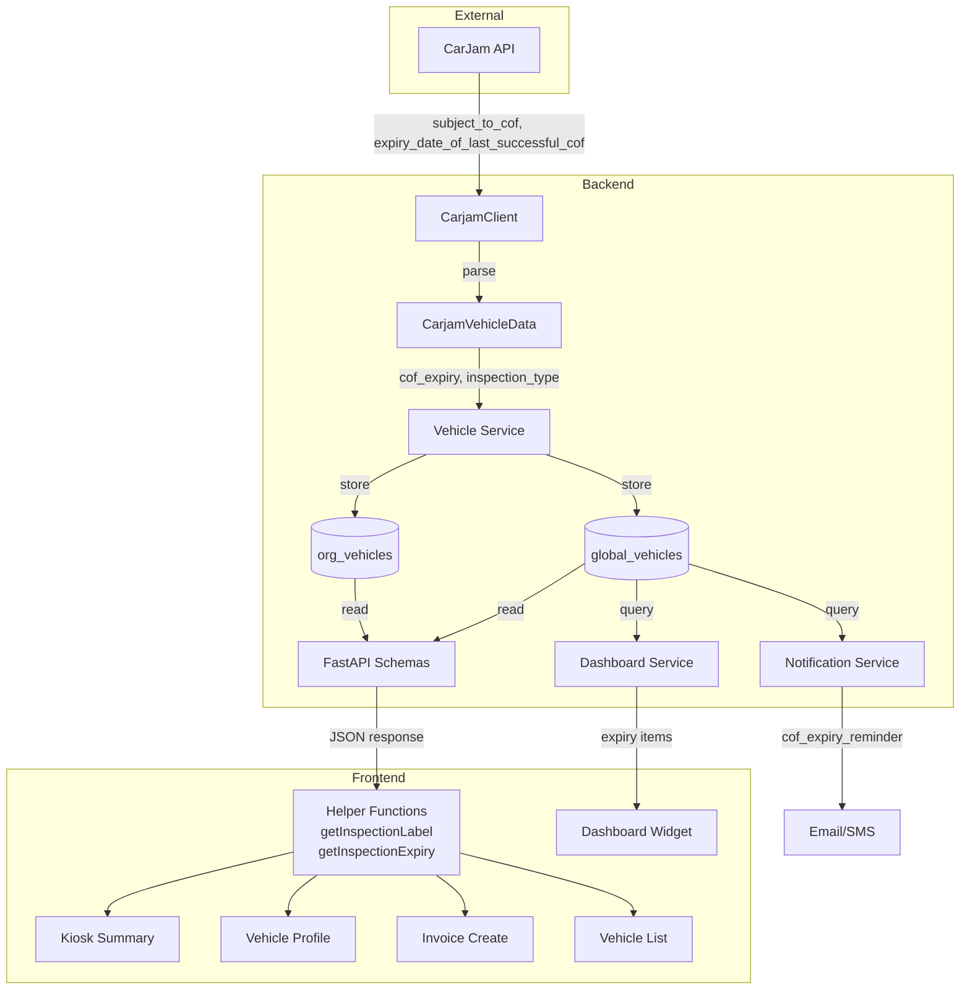

# Design Document: COF Expiry Support

## Overview

This feature adds Certificate of Fitness (COF) expiry support alongside the existing Warrant of Fitness (WOF) system. In New Zealand, vehicles require either a WOF (light vehicles under 3,500 kg) or a COF (heavy vehicles, buses, taxis, rental vehicles). The CarJam API returns separate fields for each inspection type, but the system currently only maps WOF data — COF data is silently discarded.

The design follows **Option B** from the gap analysis: add `cof_expiry` and `inspection_type` columns alongside the existing `wof_expiry` column. This is non-breaking, backward compatible, and preserves clear semantics. All changes are additive — no existing data is modified.

**Key design decisions:**
- `inspection_type` is VARCHAR(3) with values `"wof"`, `"cof"`, or `null`
- Frontend uses helper functions `getInspectionLabel()` and `getInspectionExpiry()` to determine display
- Notifications add one more tuple to the existing `(expiry_type, expiry_field, template_type)` loop
- Dashboard query adds `OR gv.cof_expiry` condition
- Existing WOF-only vehicles continue working unchanged (null `inspection_type` defaults to WOF behavior)

## Architecture

### Data Flow Diagram



### Change Summary by Layer

| Layer | Files Affected | Nature of Change |
|-------|---------------|-----------------|
| CarJam Integration | 1 | Add fields to dataclass + parser |
| Database Models | 2 + migration | Add 2 nullable columns to each table |
| Backend Schemas | 5 | Add `cof_expiry` + `inspection_type` fields |
| Backend Services | 7 | Map new fields through CRUD operations |
| Frontend Types | 4 | Add fields to interfaces |
| Frontend Display | 12 | Dynamic labels via helper functions |
| Notifications | 3 | Add COF tuple to reminder loop + template |
| Dashboard | 1 | Add COF to expiry query |

## Components and Interfaces

### 1. CarJam Integration (`app/integrations/carjam.py`)

**Changes to `CarjamVehicleData` dataclass:**

```python
@dataclass(frozen=True)
class CarjamVehicleData:
    # ... existing fields ...
    cof_expiry: str | None = None          # NEW: ISO date string
    inspection_type: str | None = None     # NEW: "wof", "cof", or None
```

**Changes to `_parse_vehicle_response()`:**

```python
# Add after wof_expiry mapping:
cof_expiry=_timestamp_to_date(data.get("expiry_date_of_last_successful_cof")),
inspection_type=_derive_inspection_type(
    data.get("subject_to_wof"),
    data.get("subject_to_cof"),
),
```

**New helper function:**

```python
def _derive_inspection_type(subject_to_wof: Any, subject_to_cof: Any) -> str | None:
    """Derive inspection type from CarJam subject_to_wof/cof flags."""
    if str(subject_to_cof).upper() == "Y":
        return "cof"
    if str(subject_to_wof).upper() == "Y":
        return "wof"
    return None
```

### 2. Database Models

**GlobalVehicle (`app/modules/admin/models.py`):**

```python
cof_expiry: Mapped[date | None] = mapped_column(Date, nullable=True)
inspection_type: Mapped[str | None] = mapped_column(String(3), nullable=True)
```

**OrgVehicle (`app/modules/vehicles/models.py`):**

```python
cof_expiry: Mapped[date | None] = mapped_column(Date, nullable=True)
inspection_type: Mapped[str | None] = mapped_column(String(3), nullable=True)
```

### 3. Backend Schemas

**Affected schemas (add `cof_expiry: Optional[str]` and `inspection_type: Optional[str]`):**

| Schema | File |
|--------|------|
| `VehicleLookupResponse` | `vehicles/schemas.py` |
| `ManualVehicleCreate` | `vehicles/schemas.py` |
| `ManualVehicleResponse` | `vehicles/schemas.py` |
| `VehicleRefreshResponse` | `vehicles/schemas.py` |
| `VehicleProfileResponse` | `vehicles/schemas.py` |
| `VehicleSearchResult` | `vehicles/schemas.py` |
| `KioskVehicleLookupResponse` | `kiosk/schemas.py` |
| `PortalVehicleItem` | `portal/schemas.py` |
| `InvoiceCreateRequest` | `invoices/schemas.py` |

**Example addition to `VehicleLookupResponse`:**

```python
cof_expiry: Optional[str] = Field(None, description="COF expiry date (ISO)")
inspection_type: Optional[str] = Field(None, description="'wof', 'cof', or null")
```

**Addition to `InvoiceCreateRequest`:**

```python
vehicle_cof_expiry_date: date | None = Field(
    default=None,
    description="COF expiry date — saved to the vehicle record"
)
```

### 4. Vehicle Service (`app/modules/vehicles/service.py`)

**`_carjam_data_to_global_vehicle()` — add mappings:**

```python
cof_expiry=_parse_date(data.cof_expiry),
inspection_type=data.inspection_type,
```

**`_update_global_vehicle_from_carjam()` — add update fields:**

```python
gv.cof_expiry = _parse_date(data.cof_expiry)
gv.inspection_type = data.inspection_type
```

**Response dict builder — add fields:**

```python
"cof_expiry": gv.cof_expiry.isoformat() if gv.cof_expiry else None,
"inspection_type": gv.inspection_type,
```

### 5. Notification Service (`app/modules/notifications/service.py`)

**Add COF tuple to the reminder loop:**

```python
for expiry_type, expiry_field, template_type in [
    ("WOF", "wof_expiry", "wof_expiry_reminder"),
    ("COF", "cof_expiry", "cof_expiry_reminder"),          # NEW
    ("Registration", "registration_expiry", "registration_expiry_reminder"),
]:
```

**Add template type to `notifications/schemas.py`:**

```python
"cof_expiry_reminder",  # NEW
```

### 6. Dashboard Service (`app/modules/organisations/dashboard_service.py`)

**Extend the upcoming expirations query:**

```sql
AND ((gv.wof_expiry IS NOT NULL AND gv.wof_expiry >= :today AND gv.wof_expiry <= :wof_cutoff)
  OR (gv.cof_expiry IS NOT NULL AND gv.cof_expiry >= :today AND gv.cof_expiry <= :cof_cutoff)
  OR (gv.service_due_date IS NOT NULL AND gv.service_due_date >= :today AND gv.service_due_date <= :service_cutoff))
```

**Add COF expiry items with correct label:**

```python
if v.cof_expiry and v.cof_expiry >= today and v.cof_expiry <= cof_cutoff:
    exp_str = str(v.cof_expiry)[:10]
    if (vid, "cof", exp_str) not in dismissed_set:
        items.append({...,"expiry_type": "cof", "expiry_date": exp_str, ...})
```

### 7. Frontend Helper Functions

**New shared utility (`frontend/src/utils/vehicleHelpers.ts`):**

```typescript
export function getInspectionLabel(
  vehicle: { inspection_type?: string | null }
): string {
  if (vehicle.inspection_type === 'cof') return 'COF Expiry'
  return 'WOF Expiry'
}

export function getInspectionExpiry(
  vehicle: {
    wof_expiry?: string | null
    cof_expiry?: string | null
    inspection_type?: string | null
  }
): string | null {
  if (vehicle.inspection_type === 'cof') return vehicle.cof_expiry ?? null
  return vehicle.wof_expiry ?? null
}
```

### 8. Frontend Type Changes

**`frontend/src/pages/kiosk/types.ts` — add to `VehicleLookupResult`:**

```typescript
cof_expiry: string | null
inspection_type: string | null
```

**Similar additions to all vehicle interfaces across:**
- `VehicleLiveSearch.tsx` — `Vehicle` and `SearchResult` interfaces
- `VehicleList.tsx` — vehicle list item type
- `InvoiceCreate.tsx` — vehicle state type

### 9. Frontend Display Changes

All 10 display components replace hardcoded `"WOF Expiry"` labels with:

```tsx
import { getInspectionLabel, getInspectionExpiry } from '@/utils/vehicleHelpers'

// Before:
<dt>WOF Expiry</dt>
<dd>{vehicle.wof_expiry}</dd>

// After:
<dt>{getInspectionLabel(vehicle)}</dt>
<dd>{getInspectionExpiry(vehicle)}</dd>
```

### 10. Invoice Create COF Expiry Input

The invoice creation form's vehicle section adds a dynamic label and handles both WOF and COF expiry updates:

```tsx
<label>{getInspectionLabel(v)} :</label>
<input
  type="date"
  value={v.inspection_type === 'cof'
    ? (v.newCofExpiry ?? v.cof_expiry ?? '')
    : (v.newWofExpiry ?? v.wof_expiry ?? '')}
  onChange={(e) => {
    const val = e.target.value || null
    if (v.inspection_type === 'cof') {
      setVehicles(prev => prev.map((veh, i) => i === index ? { ...veh, newCofExpiry: val } : veh))
    } else {
      setVehicles(prev => prev.map((veh, i) => i === index ? { ...veh, newWofExpiry: val } : veh))
    }
  }}
/>
```

### 11. Portal Service (`app/modules/portal/service.py` + `schemas.py`)

**Add to `PortalVehicleItem` schema (`app/modules/portal/schemas.py`):**

```python
cof_expiry: date | None = None
inspection_type: str | None = None
```

**Update `get_customer_vehicles()` in `app/modules/portal/service.py`:**

```python
# After reading wof_expiry from gv/ov:
cof_expiry = gv.cof_expiry if gv else (ov.cof_expiry if ov else None)
inspection_type = gv.inspection_type if gv else (ov.inspection_type if ov else None)

# Include in PortalVehicleItem construction:
vehicles.append(PortalVehicleItem(
    ...,
    cof_expiry=cof_expiry,
    inspection_type=inspection_type,
))
```

### 12. Customer Notification Preferences (`frontend/src/pages/customers/CustomerProfile.tsx` + `CustomerList.tsx`)

**CustomerProfile.tsx — Add COF reminder config section:**

The existing "WOF Expiry" reminder section is duplicated for COF. The section is conditionally shown when any linked vehicle has `inspection_type === 'cof'`:

```tsx
{/* COF Expiry — shown when customer has COF vehicles */}
{hasCofVehicles && isAutomotive && vehiclesEnabled && (
  <div className="rounded-lg border border-gray-200 p-4 space-y-3">
    <div className="flex items-center justify-between">
      <h3 className="text-sm font-medium text-gray-900">COF Expiry</h3>
      <label className="relative inline-flex items-center cursor-pointer">
        <input
          type="checkbox"
          checked={reminderConfig.cof_expiry.enabled}
          onChange={(e) => updateReminder('cof_expiry', { enabled: e.target.checked })}
          className="sr-only peer"
        />
        {/* ... toggle UI same as WOF ... */}
      </label>
    </div>
    {/* Days before + channel config — same pattern as WOF */}
  </div>
)}
```

**State additions:**

```typescript
interface CustomerReminderConfig {
  service_due: ReminderEntry
  wof_expiry: ReminderEntry
  cof_expiry: ReminderEntry  // NEW
  vehicles: VehicleExpiryData[]
}

interface VehicleExpiryData {
  // ... existing fields ...
  cof_expiry: string | null       // NEW
  inspection_type: string | null  // NEW
}
```

**CustomerList.tsx — Add COF reminder toggle:**

Same pattern as the existing WOF toggle in the customer list reminder column.

### 13. Manual Vehicle Entry Form (`frontend/src/pages/vehicles/VehicleList.tsx`)

**Add inspection type selector to the manual vehicle creation form:**

```tsx
{/* Inspection Type selector */}
<div className="grid grid-cols-2 gap-3">
  <div>
    <label className="text-xs text-gray-500">Inspection Type</label>
    <select
      value={manualForm.inspection_type}
      onChange={(e) => updateManualField('inspection_type', e.target.value)}
      className="w-full rounded border border-gray-300 px-2 py-1.5 text-sm"
    >
      <option value="wof">WOF (Warrant of Fitness)</option>
      <option value="cof">COF (Certificate of Fitness)</option>
    </select>
  </div>
</div>

{/* Dynamic expiry input based on inspection type */}
<div className="grid grid-cols-2 gap-3">
  {manualForm.inspection_type === 'cof' ? (
    <Input label="COF Expiry" type="date" value={manualForm.cof_expiry}
      onChange={(e) => updateManualField('cof_expiry', e.target.value)} />
  ) : (
    <Input label="WOF Expiry" type="date" value={manualForm.wof_expiry}
      onChange={(e) => updateManualField('wof_expiry', e.target.value)} />
  )}
  <Input label="Rego Expiry" type="date" value={manualForm.rego_expiry}
    onChange={(e) => updateManualField('rego_expiry', e.target.value)} />
</div>
```

**Manual form state additions:**

```typescript
const [manualForm, setManualForm] = useState({
  // ... existing fields ...
  inspection_type: 'wof',  // NEW: default to WOF
  cof_expiry: '',          // NEW
})
```

**Payload update:**

```typescript
if (manualForm.inspection_type === 'cof' && manualForm.cof_expiry.trim()) {
  body.cof_expiry = manualForm.cof_expiry.trim()
  body.inspection_type = 'cof'
} else {
  if (manualForm.wof_expiry.trim()) body.wof_expiry = manualForm.wof_expiry.trim()
  body.inspection_type = 'wof'
}
```

### 14. JSON Bulk Import (`frontend/src/pages/data/JsonBulkImport.tsx`)

**Add COF column to the vehicle import preview table:**

```tsx
{entityType === 'vehicles' && (
  <>
    <th>Rego</th>
    <th>Make</th>
    <th>Model</th>
    <th>Year</th>
    <th>Colour</th>
    <th>VIN</th>
    <th>Transmission</th>
    <th>WOF Expiry</th>
    <th>COF Expiry</th>       {/* NEW */}
    <th>Inspection Type</th>  {/* NEW */}
  </>
)}

{/* In table body: */}
<td>{item.cof_expiry || '—'}</td>
<td>{item.inspection_type || '—'}</td>
```

**Import processing — pass COF fields to the backend:**

The bulk import already sends the full JSON object to the backend vehicle creation endpoint. Since the `ManualVehicleCreate` schema now accepts `cof_expiry` and `inspection_type`, no additional frontend processing logic is needed — the fields pass through automatically.

## Data Models

### Database Migration

```sql
-- Migration: add_cof_expiry_columns

ALTER TABLE global_vehicles
  ADD COLUMN IF NOT EXISTS cof_expiry DATE,
  ADD COLUMN IF NOT EXISTS inspection_type VARCHAR(3);

ALTER TABLE org_vehicles
  ADD COLUMN IF NOT EXISTS cof_expiry DATE,
  ADD COLUMN IF NOT EXISTS inspection_type VARCHAR(3);
```

### Column Specifications

| Table | Column | Type | Nullable | Values | Default |
|-------|--------|------|----------|--------|---------|
| `global_vehicles` | `cof_expiry` | DATE | Yes | ISO date | NULL |
| `global_vehicles` | `inspection_type` | VARCHAR(3) | Yes | "wof", "cof", null | NULL |
| `org_vehicles` | `cof_expiry` | DATE | Yes | ISO date | NULL |
| `org_vehicles` | `inspection_type` | VARCHAR(3) | Yes | "wof", "cof", null | NULL |

### Data Flow: CarJam → Database Field Mapping

| CarJam API Field | CarjamVehicleData Field | DB Column |
|-----------------|------------------------|-----------|
| `expiry_date_of_last_successful_wof` | `wof_expiry` | `wof_expiry` (existing) |
| `expiry_date_of_last_successful_cof` | `cof_expiry` | `cof_expiry` (new) |
| `subject_to_wof` | `inspection_type` (derived) | `inspection_type` (new) |
| `subject_to_cof` | `inspection_type` (derived) | `inspection_type` (new) |

### Inspection Type Derivation Logic

| `subject_to_cof` | `subject_to_wof` | Result `inspection_type` |
|-------------------|-------------------|--------------------------|
| "Y" | any | "cof" |
| not "Y" | "Y" | "wof" |
| not "Y" | not "Y" | null |

**Note:** COF takes priority because if a vehicle is subject to COF, it is definitively a heavy/commercial vehicle regardless of any WOF flag.

### API Response Schema (additions)

```json
{
  "id": "uuid",
  "rego": "ABC123",
  "wof_expiry": "2025-06-15",
  "cof_expiry": "2025-08-20",
  "inspection_type": "cof",
  "...": "existing fields unchanged"
}
```


## Correctness Properties

*A property is a characteristic or behavior that should hold true across all valid executions of a system — essentially, a formal statement about what the system should do. Properties serve as the bridge between human-readable specifications and machine-verifiable correctness guarantees.*

### Property 1: Inspection Type Derivation

*For any* pair of `(subject_to_wof, subject_to_cof)` values (including "Y", "N", None, empty string, and arbitrary strings), the `_derive_inspection_type` function SHALL return:
- `"cof"` if `subject_to_cof` uppercased equals "Y"
- `"wof"` if `subject_to_cof` is not "Y" and `subject_to_wof` uppercased equals "Y"
- `null` otherwise

**Validates: Requirements 1.2, 1.3, 1.4**

### Property 2: COF Timestamp Parsing

*For any* valid UNIX timestamp (integer ≥ 0), the `_timestamp_to_date` function SHALL return a valid ISO date string (YYYY-MM-DD format) representing the correct UTC date. *For any* non-integer or empty value, it SHALL return null.

**Validates: Requirements 1.1, 1.5**

### Property 3: CarJam-to-Vehicle Mapping Preserves All Expiry Fields

*For any* valid `CarjamVehicleData` instance containing `wof_expiry`, `cof_expiry`, and `inspection_type` fields, the `_carjam_data_to_global_vehicle` mapping function SHALL produce a `GlobalVehicle` where:
- `wof_expiry` matches the parsed date of the input `wof_expiry`
- `cof_expiry` matches the parsed date of the input `cof_expiry`
- `inspection_type` matches the input `inspection_type`

This property also holds for the update path: given any existing GlobalVehicle and any new CarjamVehicleData, the update function SHALL overwrite all three fields to match the new data.

**Validates: Requirements 2.5, 2.6, 10.4**

### Property 4: getInspectionLabel Returns Correct Label

*For any* vehicle object with an `inspection_type` field, the `getInspectionLabel` function SHALL return `"COF Expiry"` when `inspection_type === "cof"`, and `"WOF Expiry"` for all other values (including `"wof"`, `null`, `undefined`, and any unexpected string).

**Validates: Requirements 7.1, 7.2, 7.3, 7.4, 7.5, 7.6, 7.7, 7.8, 10.2**

### Property 5: getInspectionExpiry Returns Correct Date

*For any* vehicle object with `wof_expiry`, `cof_expiry`, and `inspection_type` fields, the `getInspectionExpiry` function SHALL return:
- `cof_expiry` when `inspection_type === "cof"`
- `wof_expiry` for all other `inspection_type` values (including `"wof"`, `null`, `undefined`)

In all cases, if the selected field is `undefined`, the function SHALL return `null`.

**Validates: Requirements 8.1, 8.2**

### Property 6: Notification Dedup Key Uniqueness

*For any* two distinct tuples of `(template_type, org_id, vehicle_id, expiry_date)`, the generated deduplication subject string SHALL be different. *For any* identical tuple, the generated dedup string SHALL be the same.

**Validates: Requirements 5.3**

### Property 7: Notification Template Variables Completeness

*For any* vehicle with non-null `rego`, `make`, `model`, and `cof_expiry` fields, the COF reminder template variables dictionary SHALL contain keys for vehicle registration, make, model, and expiry date, with values matching the vehicle's data.

**Validates: Requirements 5.5**

### Property 8: Dashboard Expiry Type Labeling

*For any* vehicle appearing in the dashboard expirations widget due to its `cof_expiry` field being within the cutoff range, the expiry item's `expiry_type` label SHALL be `"cof"`. *For any* vehicle appearing due to its `wof_expiry` field, the label SHALL be `"wof"`.

**Validates: Requirements 6.2, 6.3**

## Error Handling

### CarJam Parsing Errors

| Scenario | Handling |
|----------|----------|
| `expiry_date_of_last_successful_cof` is unparseable (non-integer, empty) | `_timestamp_to_date` returns `None`; `cof_expiry` stored as NULL. Log warning. |
| `subject_to_cof` / `subject_to_wof` contain unexpected values (not "Y"/"N") | `_derive_inspection_type` treats anything other than uppercase "Y" as not set. Returns `None`. |
| CarJam response missing COF fields entirely | Fields default to `None` on the dataclass. No error raised. |

### Database Errors

| Scenario | Handling |
|----------|----------|
| `inspection_type` receives value other than "wof"/"cof"/null | No CHECK constraint enforced at DB level (application-level validation only). Invalid values stored but treated as null by frontend. |
| Migration fails on existing data | Migration is additive (ADD COLUMN IF NOT EXISTS). No data transformation. Cannot fail on existing records. |

### Frontend Errors

| Scenario | Handling |
|----------|----------|
| API response missing `cof_expiry` or `inspection_type` | Optional chaining (`?.`) and nullish coalescing (`?? null`) prevent crashes. Helper functions handle undefined gracefully. |
| `inspection_type` contains unexpected value | `getInspectionLabel` defaults to "WOF Expiry". `getInspectionExpiry` defaults to `wof_expiry`. |

### Notification Errors

| Scenario | Handling |
|----------|----------|
| Vehicle has `cof_expiry` but no linked customer | Notification loop skips (no customer to notify). Same as existing WOF behavior. |
| COF reminder template not configured for org | Template lookup returns null; notification skipped with warning log. |
| Duplicate COF reminder attempted | Dedup check prevents re-sending. Same pattern as WOF. |

## Testing Strategy

### Property-Based Tests (Hypothesis — Python backend, fast-check — TypeScript frontend)

Property-based testing is appropriate for this feature because:
- The parsing and derivation functions are pure with clear input/output behavior
- The helper functions have universal properties across all valid inputs
- The input space (timestamps, flag combinations, inspection types) benefits from randomized exploration

**Configuration:** Minimum 100 iterations per property test.

**Backend (Python — Hypothesis):**

| Property | Test File | Tag |
|----------|-----------|-----|
| Property 1: Inspection type derivation | `tests/test_carjam_cof.py` | `Feature: cof-expiry-support, Property 1: Inspection type derivation` |
| Property 2: COF timestamp parsing | `tests/test_carjam_cof.py` | `Feature: cof-expiry-support, Property 2: COF timestamp parsing` |
| Property 3: Mapping preserves expiry fields | `tests/test_vehicle_service_cof.py` | `Feature: cof-expiry-support, Property 3: CarJam-to-vehicle mapping preserves all expiry fields` |
| Property 6: Dedup key uniqueness | `tests/test_notifications_cof.py` | `Feature: cof-expiry-support, Property 6: Notification dedup key uniqueness` |
| Property 7: Template variables completeness | `tests/test_notifications_cof.py` | `Feature: cof-expiry-support, Property 7: Notification template variables completeness` |
| Property 8: Dashboard expiry labeling | `tests/test_dashboard_cof.py` | `Feature: cof-expiry-support, Property 8: Dashboard expiry type labeling` |

**Frontend (TypeScript — fast-check):**

| Property | Test File | Tag |
|----------|-----------|-----|
| Property 4: getInspectionLabel | `frontend/src/utils/vehicleHelpers.test.ts` | `Feature: cof-expiry-support, Property 4: getInspectionLabel returns correct label` |
| Property 5: getInspectionExpiry | `frontend/src/utils/vehicleHelpers.test.ts` | `Feature: cof-expiry-support, Property 5: getInspectionExpiry returns correct date` |

### Unit Tests (Example-Based)

| Test | Purpose |
|------|---------|
| Schema field existence | Verify `cof_expiry` and `inspection_type` exist on all affected Pydantic schemas |
| Manual vehicle creation with COF | Verify endpoint accepts and stores COF fields |
| Invoice COF expiry update | Verify invoice creation updates vehicle's cof_expiry |
| Notification preference skip | Verify disabled COF reminders are not sent |
| Null cof_expiry skip | Verify null cof_expiry vehicles don't trigger COF reminders |
| Module gate skip | Verify orgs without vehicles module skip COF processing |

### Integration Tests

| Test | Purpose |
|------|---------|
| Full CarJam lookup → DB storage | End-to-end: CarJam response with COF data → stored in global_vehicles |
| Invoice creation → vehicle update | Invoice with `vehicle_cof_expiry_date` updates both global and org vehicle |
| Dashboard query with COF vehicles | Vehicles with upcoming cof_expiry appear in widget |
| Notification generation | COF expiry matching lead time generates reminder |
| Bulk import with COF data | JSON import stores cof_expiry and inspection_type |

### Migration Test

| Test | Purpose |
|------|---------|
| Idempotent migration | Running migration twice doesn't error (IF NOT EXISTS) |
| Existing data preserved | Pre-existing records have NULL for new columns, all other fields unchanged |
