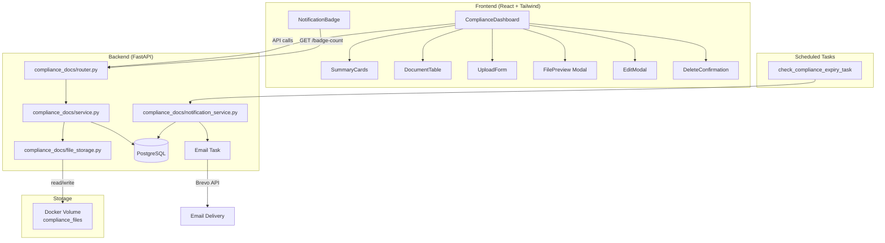
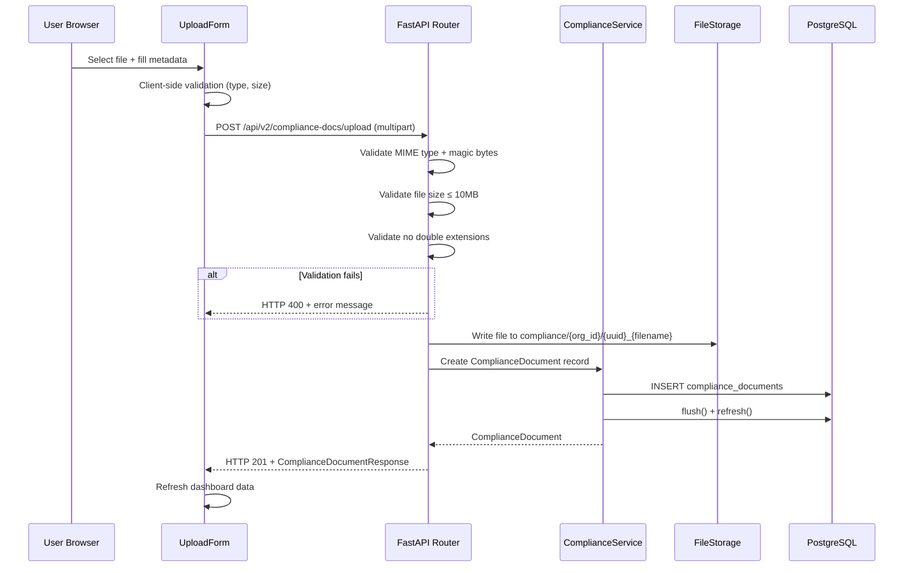

# Design Document: Compliance Documents Rebuild

## Overview

This design rebuilds the Compliance Documents feature from its current skeleton (metadata-only CRUD, unstyled HTML, log-only expiry checks) into a production-ready module with real file upload/storage, a polished Tailwind UI, predefined/custom document categories, email expiry notifications with deduplication, in-app notification badges, and safe API consumption patterns throughout.

The rebuild touches three layers:
1. **Backend** — New endpoints for multipart upload, file download/streaming, edit, delete, categories, and badge-count. New `compliance_notification_log` and `compliance_document_categories` tables. Enhanced scheduled task with real email dispatch.
2. **Frontend** — Full rebuild of `ComplianceDashboard.tsx` into composable components: SummaryCards, DocumentTable (sortable/filterable/searchable), UploadForm (drag-and-drop with file picker), FilePreview modal, EditModal, and DeleteConfirmation dialog.
3. **Infrastructure** — Docker volume mount for file storage, Alembic migrations for new tables.

### Key Design Decisions

| Decision | Rationale |
|---|---|
| Local filesystem volume mount (not S3) | Matches existing Docker infrastructure; no cloud dependency needed for current scale |
| Separate `compliance_notification_log` table (not reusing `notification_log`) | Compliance deduplication needs document_id + threshold compound key; existing notification_log is channel-generic |
| Predefined categories as seed data in migration | Avoids hardcoding in frontend; allows DB-level querying and future admin management |
| Magic-number file validation alongside MIME check | Prevents MIME spoofing attacks (Requirement 12.1) |
| UUID-prefixed filenames | Prevents path traversal and collision (Requirement 12.2) |
| `attachment` Content-Disposition by default | Prevents browser execution of downloaded files (Requirement 12.6) |

## Architecture



### Request Flow: File Upload



## Components and Interfaces

### Backend Components

#### 1. Router (`app/modules/compliance_docs/router.py`)

Extends the existing router with new endpoints:

| Method | Path | Description | Request | Response |
|--------|------|-------------|---------|----------|
| POST | `/upload` | Multipart file upload | `UploadFile` + form fields | `ComplianceDocumentResponse` (201) |
| GET | `/{doc_id}/download` | Stream file download | — | `StreamingResponse` |
| PUT | `/{doc_id}` | Edit document metadata | `ComplianceDocumentUpdate` JSON | `ComplianceDocumentResponse` |
| DELETE | `/{doc_id}` | Delete document + file | — | 204 No Content |
| GET | `/categories` | List predefined + custom categories | — | `{ items: CategoryResponse[], total: int }` |
| GET | `/badge-count` | Expired + expiring-soon count | — | `{ count: int }` |
| GET | `` | List documents (enhanced) | query params: `search`, `status`, `category`, `sort_by`, `sort_dir` | `{ items: ComplianceDocumentResponse[], total: int }` |
| GET | `/dashboard` | Dashboard summary (enhanced) | — | `ComplianceDashboardResponse` |

All endpoints extract `org_id` from `request.state.org_id` (existing pattern). All list endpoints wrap arrays in objects per project convention.

#### 2. Service (`app/modules/compliance_docs/service.py`)

Enhanced with new methods:

```python
class ComplianceService:
    async def upload_document_with_file(org_id, file, metadata, uploaded_by) -> ComplianceDocument
    async def update_document(org_id, doc_id, payload) -> ComplianceDocument
    async def delete_document(org_id, doc_id) -> None
    async def list_documents_filtered(org_id, search, status, category, sort_by, sort_dir) -> tuple[list, int]
    async def get_badge_count(org_id) -> int
    async def get_categories(org_id) -> list[ComplianceDocumentCategory]
    async def create_custom_category(org_id, name) -> ComplianceDocumentCategory
    async def get_document_for_download(org_id, doc_id) -> ComplianceDocument
```

After every `db.flush()`, calls `await db.refresh(obj)` before returning (project pattern to prevent MissingGreenlet).

#### 3. File Storage (`app/modules/compliance_docs/file_storage.py`)

New module for filesystem operations:

```python
class ComplianceFileStorage:
    def __init__(self, base_path: str = "/app/compliance_files")
    
    async def save_file(org_id: UUID, file: UploadFile) -> str  # returns file_key
    async def read_file(file_key: str) -> tuple[AsyncGenerator[bytes, None], str]  # stream + content_type
    async def delete_file(file_key: str) -> None
    
    def _validate_mime_type(file: UploadFile) -> None
    def _validate_file_size(file: UploadFile, content: bytes) -> None
    def _validate_magic_bytes(content: bytes, declared_mime: str) -> None
    def _validate_filename(filename: str) -> None
    def _generate_storage_path(org_id: UUID, filename: str) -> str
```

Path structure: `compliance/{org_id}/{uuid}_{sanitized_filename}`

Magic byte signatures validated:
- PDF: `%PDF` (bytes `25 50 44 46`)
- JPEG: `FF D8 FF`
- PNG: `89 50 4E 47`
- GIF: `47 49 46 38`
- DOCX: `50 4B 03 04` (ZIP header)
- DOC: `D0 CF 11 E0`

#### 4. Notification Service (`app/modules/compliance_docs/notification_service.py`)

New module for expiry email notifications:

```python
class ComplianceNotificationService:
    async def send_expiry_notifications(threshold_days: int) -> dict
    async def check_already_notified(doc_id: UUID, threshold: str) -> bool
    async def log_notification(doc_id: UUID, org_id: UUID, threshold: str) -> None
    def _build_expiry_email(doc: ComplianceDocument, threshold: str, dashboard_url: str) -> tuple[str, str, str]
```

Wires into the existing `check_compliance_expiry_task` in `app/tasks/scheduled.py`. Uses the existing `send_email_task` from `app/tasks/notifications.py` and `log_email_sent` from `app/modules/notifications/service.py` for email dispatch and logging.

### Frontend Components

#### 1. ComplianceDashboard (page container)

Rebuilt from scratch. Manages top-level state, API calls with `AbortController` cleanup, and orchestrates child components.

```typescript
// State
const [documents, setDocuments] = useState<ComplianceDocumentResponse[]>([])
const [summary, setSummary] = useState<DashboardSummary | null>(null)
const [categories, setCategories] = useState<CategoryResponse[]>([])
const [loading, setLoading] = useState(true)
const [error, setError] = useState('')
```

#### 2. SummaryCards

Four cards: Total, Valid (green), Expiring Soon (amber), Expired (red). Uses existing Tailwind card pattern: `rounded-lg border border-gray-200 bg-white p-4 shadow-sm`. Shows skeleton placeholders with `animate-pulse` during loading.

#### 3. DocumentTable

Sortable columns (click header to toggle asc/desc), text search input, status dropdown filter, category dropdown filter. Status badges: green (valid), amber (expiring ≤30 days), red (expired), grey (no expiry). Actions column: download, preview (PDF/image only), edit, delete.

#### 4. UploadForm

Drag-and-drop zone + click-to-select file picker. Shows selected file name/size before submit. Category searchable dropdown with free-text custom entry. Progress indicator during upload. Multipart form submission via `apiClient.post` with `FormData`.

#### 5. FilePreview (modal)

Uses Headless UI `Dialog`. For PDFs: `<iframe>` or `<object>` with the download endpoint URL. For images: `` tag. Word documents show download-only action.

#### 6. EditModal

Headless UI `Dialog` pre-populated with current metadata. Editable fields: document_type (category dropdown), description, expiry_date. Submits PUT request.

#### 7. DeleteConfirmation

Headless UI `Dialog` with confirmation message. On confirm, sends DELETE request, removes row from table, updates summary cards without full page reload.

#### 8. NotificationBadge (sidebar)

Fetches `GET /api/v2/compliance-docs/badge-count`. Renders red circular badge with white text on the Compliance nav item. Hidden when count is 0. Refreshes on navigation to Compliance page.

## Data Models

### Existing Table: `compliance_documents` (enhanced)

The existing table is retained with its current columns. The `document_type` column will now store category names (from predefined or custom categories) instead of free-text.

```sql
-- Existing columns (no schema change needed):
-- id UUID PK, org_id UUID, document_type VARCHAR(50), description TEXT,
-- file_key VARCHAR(500), file_name VARCHAR(255), expiry_date DATE,
-- invoice_id UUID, job_id UUID, uploaded_by UUID, created_at TIMESTAMPTZ
```

The `file_key` column will now store actual filesystem paths (e.g., `compliance/{org_id}/{uuid}_{filename}`) instead of placeholder values.

### New Table: `compliance_notification_log`

Tracks which expiry notifications have been sent to prevent duplicates (Requirement 13).

```sql
CREATE TABLE IF NOT EXISTS compliance_notification_log (
    id UUID PRIMARY KEY DEFAULT gen_random_uuid(),
    document_id UUID NOT NULL REFERENCES compliance_documents(id) ON DELETE CASCADE,
    org_id UUID NOT NULL REFERENCES organisations(id) ON DELETE CASCADE,
    threshold VARCHAR(10) NOT NULL,  -- '30_day', '7_day', 'day_of'
    sent_at TIMESTAMPTZ NOT NULL DEFAULT NOW(),
    
    CONSTRAINT uq_compliance_notif_doc_threshold 
        UNIQUE (document_id, threshold)
);

CREATE INDEX IF NOT EXISTS ix_compliance_notif_log_doc_id 
    ON compliance_notification_log (document_id);
CREATE INDEX IF NOT EXISTS ix_compliance_notif_log_org_id 
    ON compliance_notification_log (org_id);
```

**SQLAlchemy Model:**

```python
class ComplianceNotificationLog(Base):
    __tablename__ = "compliance_notification_log"
    
    id: Mapped[uuid.UUID] = mapped_column(UUID(as_uuid=True), primary_key=True, default=uuid.uuid4)
    document_id: Mapped[uuid.UUID] = mapped_column(UUID(as_uuid=True), ForeignKey("compliance_documents.id", ondelete="CASCADE"), nullable=False)
    org_id: Mapped[uuid.UUID] = mapped_column(UUID(as_uuid=True), ForeignKey("organisations.id", ondelete="CASCADE"), nullable=False)
    threshold: Mapped[str] = mapped_column(String(10), nullable=False)
    sent_at: Mapped[datetime] = mapped_column(DateTime(timezone=True), server_default=func.now(), nullable=False)
    
    __table_args__ = (
        UniqueConstraint("document_id", "threshold", name="uq_compliance_notif_doc_threshold"),
    )
```

### New Table: `compliance_document_categories`

Stores predefined (system-wide) and custom (org-specific) document categories (Requirement 6).

```sql
CREATE TABLE IF NOT EXISTS compliance_document_categories (
    id UUID PRIMARY KEY DEFAULT gen_random_uuid(),
    name VARCHAR(100) NOT NULL,
    org_id UUID REFERENCES organisations(id) ON DELETE CASCADE,  -- NULL = predefined/system
    is_predefined BOOLEAN NOT NULL DEFAULT FALSE,
    created_at TIMESTAMPTZ NOT NULL DEFAULT NOW(),
    
    CONSTRAINT uq_compliance_cat_name_org 
        UNIQUE (name, org_id)
);

CREATE INDEX IF NOT EXISTS ix_compliance_doc_categories_org_id 
    ON compliance_document_categories (org_id);
```

The migration will seed the 15 predefined categories (Requirement 6.1) with `org_id = NULL` and `is_predefined = TRUE`.

**SQLAlchemy Model:**

```python
class ComplianceDocumentCategory(Base):
    __tablename__ = "compliance_document_categories"
    
    id: Mapped[uuid.UUID] = mapped_column(UUID(as_uuid=True), primary_key=True, default=uuid.uuid4)
    name: Mapped[str] = mapped_column(String(100), nullable=False)
    org_id: Mapped[uuid.UUID | None] = mapped_column(UUID(as_uuid=True), ForeignKey("organisations.id", ondelete="CASCADE"), nullable=True)
    is_predefined: Mapped[bool] = mapped_column(Boolean, server_default="false", nullable=False)
    created_at: Mapped[datetime] = mapped_column(DateTime(timezone=True), server_default=func.now(), nullable=False)
    
    __table_args__ = (
        UniqueConstraint("name", "org_id", name="uq_compliance_cat_name_org"),
    )
```

### Updated Pydantic Schemas

```python
class ComplianceDocumentUpdate(BaseModel):
    document_type: str | None = None
    description: str | None = None
    expiry_date: date | None = None

class ComplianceDocumentResponse(BaseModel):
    id: UUID
    org_id: UUID
    document_type: str
    description: str | None = None
    file_key: str
    file_name: str
    expiry_date: date | None = None
    invoice_id: UUID | None = None
    job_id: UUID | None = None
    uploaded_by: UUID | None = None
    created_at: datetime
    status: str  # computed: 'valid', 'expiring_soon', 'expired', 'no_expiry'
    model_config = {"from_attributes": True}

class ComplianceDashboardResponse(BaseModel):
    total_documents: int
    valid_documents: int
    expiring_soon: int
    expired: int
    documents: list[ComplianceDocumentResponse]

class CategoryResponse(BaseModel):
    id: UUID
    name: str
    is_predefined: bool
    model_config = {"from_attributes": True}

class BadgeCountResponse(BaseModel):
    count: int
```

### File Storage Strategy

Files are stored on a Docker volume mounted at `/app/compliance_files` inside the container.

**Docker Compose addition:**

```yaml
services:
  app:
    volumes:
      - compliance_files:/app/compliance_files

volumes:
  compliance_files:
```

**Path structure:** `compliance/{org_id}/{uuid}_{original_filename}`

Example: `compliance/a1b2c3d4-.../f7e8d9c0-..._public_liability_2025.pdf`

Files are stored outside the web-accessible directory tree (Requirement 12.3). Access is only through the authenticated `/download` endpoint.


## Correctness Properties

*A property is a characteristic or behavior that should hold true across all valid executions of a system — essentially, a formal statement about what the system should do. Properties serve as the bridge between human-readable specifications and machine-verifiable correctness guarantees.*

### Property 1: Document status computation

*For any* compliance document with any expiry_date (including null), the computed status should be: `'no_expiry'` when expiry_date is null, `'expired'` when expiry_date < today, `'expiring_soon'` when expiry_date is within 30 days of today (inclusive), and `'valid'` when expiry_date is more than 30 days in the future. Furthermore, filtering documents by a given status should return exactly the documents whose computed status matches.

**Validates: Requirements 2.4, 2.6**

### Property 2: Document sorting correctness

*For any* list of compliance documents and any sortable column (document_type, file_name, expiry_date, created_at), sorting the list by that column in ascending order should produce a list where each element is less than or equal to the next element according to that column's natural ordering, and descending order should produce the reverse.

**Validates: Requirements 2.2**

### Property 3: Text search filtering

*For any* list of compliance documents and any non-empty search string, the filtered results should contain exactly the documents where the search string appears (case-insensitive) in at least one of: file_name, document_type, or description. No matching document should be excluded and no non-matching document should be included.

**Validates: Requirements 2.3**

### Property 4: Category filtering

*For any* list of compliance documents and any selected category name, the filtered results should contain exactly the documents whose document_type matches the selected category. No matching document should be excluded and no non-matching document should be included.

**Validates: Requirements 2.5**

### Property 5: MIME type validation

*For any* MIME type string, the file upload validator should accept it if and only if it is one of: `application/pdf`, `image/jpeg`, `image/png`, `image/gif`, `application/msword`, or `application/vnd.openxmlformats-officedocument.wordprocessingml.document`. All other MIME types should be rejected.

**Validates: Requirements 3.2, 3.4**

### Property 6: File size validation

*For any* non-negative file size in bytes, the file upload validator should accept it if and only if it is less than or equal to 10,485,760 bytes (10 MB). Sizes exceeding this limit should be rejected.

**Validates: Requirements 3.3, 3.5**

### Property 7: Storage path generation

*For any* valid org_id (UUID) and any original filename string, the generated storage path should match the pattern `compliance/{org_id}/{uuid}_{sanitized_filename}` where the UUID prefix is a valid UUID4, the sanitized filename contains no path separators or traversal sequences (`..`), and the file extension is preserved from the original filename.

**Validates: Requirements 3.6, 12.2**

### Property 8: Preview eligibility

*For any* file MIME type, the preview eligibility function should return true if and only if the MIME type is one of: `application/pdf`, `image/jpeg`, `image/png`, or `image/gif`. All other types (including Word documents) should return false.

**Validates: Requirements 4.6**

### Property 9: Notification threshold matching

*For any* compliance document with a non-null expiry_date and any reference date (today), the notification threshold checker should identify the document for notification if and only if the expiry_date minus the reference date equals exactly 30 days, exactly 7 days, or exactly 0 days. Documents at other intervals should not be flagged.

**Validates: Requirements 7.1, 7.2, 7.3**

### Property 10: Expiry email template completeness

*For any* compliance document (with any document_type, file_name, and expiry_date) and any threshold label, the built notification email should contain the document_type, file_name, expiry_date formatted as a string, and a URL path to the compliance dashboard.

**Validates: Requirements 7.4**

### Property 11: Notification deduplication

*For any* set of (document_id, threshold) pairs where some have already been logged as sent, running the notification service should produce send actions only for pairs not already in the log. No pair that already exists in the log should result in a duplicate send.

**Validates: Requirements 7.5, 13.2**

### Property 12: Badge count computation

*For any* set of compliance documents with various expiry_dates (including null), the badge count should equal the number of documents whose computed status is either `'expired'` or `'expiring_soon'`. Documents with status `'valid'` or `'no_expiry'` should not be counted.

**Validates: Requirements 8.1**

### Property 13: Magic byte validation

*For any* file content (byte sequence) and declared MIME type, the magic byte validator should accept the file if and only if the leading bytes match the expected signature for the declared MIME type (PDF: `%PDF`, JPEG: `FF D8 FF`, PNG: `89 50 4E 47`, GIF: `47 49 46 38`, DOCX: `50 4B 03 04`, DOC: `D0 CF 11 E0`). A mismatch between declared MIME type and actual magic bytes should result in rejection.

**Validates: Requirements 12.1, 12.5**

### Property 14: Double extension rejection

*For any* filename string, the filename validator should reject the file if it contains multiple extensions where the final extension is not in the allowed set (`.pdf`, `.jpg`, `.jpeg`, `.png`, `.gif`, `.doc`, `.docx`). Filenames with a single allowed extension should be accepted. Filenames like `document.pdf.exe` should be rejected.

**Validates: Requirements 12.4**

## Error Handling

### Backend Error Handling

| Scenario | HTTP Status | Response Body | Recovery |
|---|---|---|---|
| File MIME type not accepted | 400 | `{ "detail": "File type not accepted. Allowed types: PDF, JPEG, PNG, GIF, Word (.doc, .docx)" }` | User selects a different file |
| File exceeds 10MB | 400 | `{ "detail": "File size exceeds maximum of 10MB" }` | User selects a smaller file |
| Magic byte mismatch | 400 | `{ "detail": "File type could not be verified. The file content does not match the declared type." }` | User selects a valid file |
| Double extension detected | 400 | `{ "detail": "Filename contains invalid extension pattern" }` | User renames the file |
| Document not found | 404 | `{ "detail": "Compliance document not found" }` | — |
| File missing from storage | 404 | `{ "detail": "File not found on server. The document record exists but the file is missing." }` | Admin investigates storage |
| Document belongs to another org | 403 | `{ "detail": "Access denied" }` | — |
| Org context missing | 401 | `{ "detail": "Organisation context required" }` | User re-authenticates |
| Disk write failure | 500 | `{ "detail": "Failed to save file. Please try again." }` | Retry; admin checks disk space |
| Email send failure | Logged, not surfaced | Error logged with doc_id, org_id, error details | Retry on next scheduled run |
| Duplicate category name | 409 | `{ "detail": "Category already exists" }` | User selects existing category |

### Frontend Error Handling

- Every API call is wrapped in try/catch with `AbortController` cleanup
- Errors are displayed within the affected component (upload form, table, etc.) — never crash the whole page
- All API response data accessed with `?.` and `?? []` / `?? 0` fallbacks
- Loading states show skeleton placeholders (summary cards) or spinner (table, forms)
- Network errors show a retry button within the affected section
- File upload errors display the backend error message directly in the upload form

### Notification Error Handling

- If email delivery fails, the error is logged via `log_error()` with severity ERROR, category INTEGRATION
- The notification log entry is NOT created on failure, so the notification will be retried on the next scheduled run
- If the same notification keeps failing, it will be attempted once per scheduled run until the expiry date passes
- The scheduled task wraps each document's notification in its own try/except for isolation — one failure doesn't block others

## Testing Strategy

### Property-Based Tests (Hypothesis)

Property-based tests validate the 14 correctness properties defined above. Each test runs a minimum of 100 iterations with randomly generated inputs.

**Library:** Hypothesis (already used in the project — `.hypothesis/` directory exists)

**Test file:** `tests/property/test_compliance_properties.py`

Each test is tagged with a comment referencing the design property:
```python
# Feature: compliance-documents-rebuild, Property 1: Document status computation
```

**Properties to implement:**

| Property | Test Function | Key Generators |
|---|---|---|
| 1: Status computation | `test_document_status_computation` | Random dates (past, future, near-future, None) |
| 2: Sorting correctness | `test_document_sorting` | Random document lists, random sortable column |
| 3: Text search filtering | `test_text_search_filtering` | Random document lists, random search strings |
| 4: Category filtering | `test_category_filtering` | Random document lists, random category names |
| 5: MIME validation | `test_mime_type_validation` | Random MIME type strings + known valid types |
| 6: File size validation | `test_file_size_validation` | Random integers (0 to 20MB range) |
| 7: Path generation | `test_storage_path_generation` | Random UUIDs, random filename strings |
| 8: Preview eligibility | `test_preview_eligibility` | Random MIME type strings + known types |
| 9: Threshold matching | `test_notification_threshold_matching` | Random dates, random reference dates |
| 10: Email completeness | `test_expiry_email_completeness` | Random document_type, file_name, expiry_date |
| 11: Deduplication | `test_notification_deduplication` | Random (doc_id, threshold) sets with partial pre-logging |
| 12: Badge count | `test_badge_count_computation` | Random document sets with various expiry dates |
| 13: Magic byte validation | `test_magic_byte_validation` | Random byte sequences + known magic bytes, random MIME types |
| 14: Double extension | `test_double_extension_rejection` | Random filename strings with various extension patterns |

### Unit Tests (pytest)

**Test file:** `tests/unit/test_compliance_docs.py`

Focus on specific examples, edge cases, and integration points:

- Upload endpoint returns 201 with valid multipart file
- Upload endpoint returns 400 for invalid MIME type with correct error message
- Upload endpoint returns 400 for oversized file with correct error message
- Download endpoint streams file with correct Content-Type and Content-Disposition headers
- Download endpoint returns 403 for cross-org access
- Download endpoint returns 404 for missing file
- Edit endpoint updates only specified fields
- Delete endpoint removes DB record and file from storage
- Categories endpoint returns predefined + custom categories with predefined first
- Badge count endpoint returns 0 when no documents are expiring
- Dashboard endpoint returns correct summary counts
- Notification service sends emails at 30-day, 7-day, and day-of thresholds
- Notification service skips already-notified documents
- Notification service logs failures without crashing

### Integration Tests

**Test file:** `tests/integration/test_compliance_integration.py`

- Full upload → download → verify file content round-trip
- Upload → edit metadata → verify changes persisted
- Upload → delete → verify record and file removed
- Create custom category → verify it appears in categories list
- Link document to invoice → verify it appears on invoice detail
- Scheduled task sends notifications for expiring documents
- Scheduled task respects deduplication log

### Frontend Tests

**Test file:** `frontend/src/pages/compliance/__tests__/ComplianceDashboard.test.tsx`

- Dashboard renders four summary cards with correct colours
- Document table renders all columns
- Search input filters documents correctly
- Status filter shows only matching documents
- Upload form accepts drag-and-drop files
- Upload form shows file name and size before submit
- Upload form displays error on failed upload
- Edit modal pre-populates with current data
- Delete confirmation dialog appears on delete click
- Badge is hidden when count is 0
- Badge shows correct count when > 0
- Skeleton placeholders shown during loading
- Empty state messages shown when appropriate
