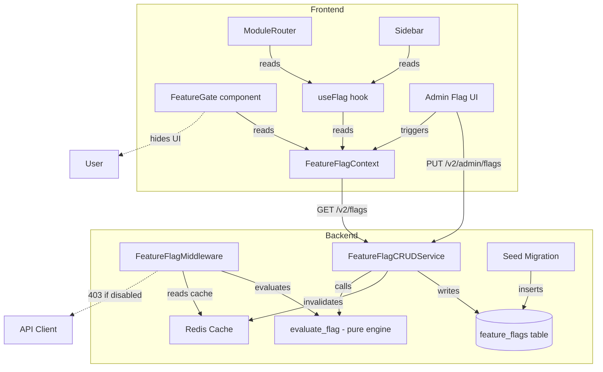

# Design Document: Comprehensive Feature Flags

## Overview

This design extends the existing feature flag system to provide end-to-end feature gating across the entire platform. Currently, the system has a `feature_flags` table, a pure evaluation engine (`app/core/feature_flags.py`), a CRUD service, and a basic admin UI — but only a handful of flags exist and there is no middleware-level API gating or systematic frontend UI hiding.

The enhancement adds:
1. A comprehensive seed migration registering ~45 platform features as flags with category, access level, and dependency metadata
2. A `FeatureFlagMiddleware` that intercepts API requests and returns 403 when a feature's flag is disabled
3. A `FeatureGate` component and enhanced `useFlag` hook for frontend UI gating
4. A redesigned admin UI with category grouping, search, filters, dependency warnings, and toggle switches
5. Bulk evaluation and determinism guarantees in the evaluation engine
6. Schema additions for `category`, `access_level`, `dependencies`, `updated_by` columns
7. Route and navigation gating in `ModuleRouter` and sidebar

The design reuses the existing `evaluate_flag` pure function, `FeatureFlagCRUDService`, `FeatureFlagContext`, and the `BaseHTTPMiddleware` pattern from `RBACMiddleware` / `ModuleMiddleware`.

## Architecture



### Middleware Placement

The `FeatureFlagMiddleware` slots into the existing middleware stack between RBAC (step 6) and Idempotency (step 7). It runs after authentication and RBAC so that `request.state.org_id` is available, and before module middleware so feature flags take precedence over module enablement.

Updated middleware order in `app/main.py`:
1. CORS
2. APIVersion
3. SecurityHeaders / PenTest
4. RateLimit
5. Auth
6. RBAC
7. **FeatureFlag** (new)
8. Idempotency
9. Module
10. Tenant

### Caching Strategy

- Flag evaluations are cached in Redis per org with key pattern `ff:{org_id}` storing a JSON dict of `{flag_key: bool}`
- Default TTL: 30 seconds (configurable via `settings.feature_flag_cache_ttl`)
- On flag update via admin API, the service calls `_invalidate_cache` which deletes all `ff:*` keys (wildcard) to ensure propagation within 5 seconds
- The middleware reads from cache first; on cache miss, it evaluates via the service and populates the cache
- Frontend polls or refetches on admin action; no WebSocket push needed since the 5-second SLA is met by cache invalidation + next request

## Components and Interfaces

### 1. Database Schema Migration

**File:** `alembic/versions/XXXX_enhance_feature_flags_schema.py`

Adds columns to the existing `feature_flags` table:
- `category` (String, default `"Core"`, indexed)
- `access_level` (String, default `"all_users"`)
- `dependencies` (JSONB array, default `[]`)
- `updated_by` (UUID, FK to `users.id`, nullable)

Adds index on `is_active` column.

### 2. Seed Migration

**File:** `alembic/versions/XXXX_seed_comprehensive_feature_flags.py`

Inserts ~45 flag rows using `INSERT ... ON CONFLICT (key) DO NOTHING` for idempotency. Each row includes:
- `key`: snake_case identifier (e.g., `invoicing`, `pos`, `ai_categorization`)
- `display_name`: human-readable name
- `description`: brief explanation
- `category`: one of the defined Feature_Category values
- `access_level`: `"all_users"` or `"admin_only"`
- `dependencies`: JSON array of flag keys this flag depends on
- `default_value`: `true` for core modules, `false` for non-core

### 3. FeatureFlagMiddleware

**File:** `app/middleware/feature_flags.py`

```python
class FeatureFlagMiddleware(BaseHTTPMiddleware):
    async def dispatch(self, request, call_next):
        # 1. Skip non-API, public, and admin flag management paths
        # 2. Resolve path to flag key via FLAG_ENDPOINT_MAP
        # 3. Skip core flags (always allow)
        # 4. Try Redis cache for org's evaluated flags
        # 5. On miss, evaluate via service and cache result
        # 6. If flag is False, return 403 JSON
        # 7. On any error, fail open (allow request)
```

**Interface — FLAG_ENDPOINT_MAP:**
```python
FLAG_ENDPOINT_MAP: dict[str, str] = {
    "/api/v2/quotes": "quotes",
    "/api/v2/jobs": "jobs",
    "/api/v2/projects": "projects",
    "/api/v2/time-entries": "time_tracking",
    "/api/v2/expenses": "expenses",
    "/api/v2/products": "inventory",
    "/api/v2/stock": "inventory",
    "/api/v2/purchase-orders": "purchase_orders",
    "/api/v2/pos": "pos",
    "/api/v2/tips": "tipping",
    "/api/v2/tables": "tables",
    "/api/v2/kitchen": "kitchen_display",
    "/api/v2/schedule": "scheduling",
    "/api/v2/staff": "staff",
    "/api/v2/bookings": "bookings",
    "/api/v2/progress-claims": "progress_claims",
    "/api/v2/retentions": "retentions",
    "/api/v2/variations": "variations",
    "/api/v2/compliance-docs": "compliance_docs",
    "/api/v2/currencies": "multi_currency",
    "/api/v2/recurring": "recurring",
    "/api/v2/loyalty": "loyalty",
    "/api/v2/franchise": "franchise",
    "/api/v2/ecommerce": "ecommerce",
    "/api/v2/admin/branding": "branding",
    "/api/v2/assets": "assets",
    "/api/v2/outbound-webhooks": "webhooks",
    "/api/v2/reports": "reports",
    "/api/v2/portal": "portal",
    "/api/v2/admin/analytics": "analytics",
    "/api/v2/i18n": "i18n",
    "/api/v2/admin/migrations": "migration_tool",
    "/api/v2/printers": "receipt_printer",
    # Banking & payments, AI, etc. added as endpoints exist
}
```

**Core flags** (always allowed): `invoicing`, `customers`, `notifications`

**403 response format:**
```json
{
  "detail": "Feature 'pos' is disabled for your organisation.",
  "flag_key": "pos"
}
```

### 4. Enhanced FeatureFlagContext & FeatureGate

**File:** `frontend/src/contexts/FeatureFlagContext.tsx` (modified)

New exports:
```typescript
// Existing
export function useFlag(flagKey: string): boolean
export function useFeatureFlags(): FeatureFlagContextValue

// New
export function FeatureGate({ 
  flagKey, 
  fallback?, 
  children 
}: { 
  flagKey: string
  fallback?: ReactNode
  children: ReactNode 
}): ReactNode
```

The `FeatureGate` component:
- Renders `children` when `useFlag(flagKey)` returns `true`
- Renders `fallback` (or nothing) when `false`
- Renders nothing while `isLoading` is `true`

### 5. Enhanced Admin Flag UI

**File:** `frontend/src/pages/admin/FeatureFlags.tsx` (rewritten)

Key UI changes:
- Flags grouped by `category` in collapsible `<details>` sections
- Each category header shows `{enabled}/{total}` count
- Each flag row: display_name, description, code key badge, access_level badge, dependency chips, toggle switch
- Search input filters across display_name, key, description
- Filter dropdown: by category, access_level, enabled/disabled
- Toggle sends `PUT /api/v2/admin/flags/{key}` with optimistic update + rollback on error
- Dependency warning modal when disabling a flag that other enabled flags depend on

### 6. Evaluation Engine Enhancement

**File:** `app/core/feature_flags.py` (modified)

New function:
```python
def evaluate_flags_bulk(
    *,
    flags: list[dict],  # each has is_active, default_value, targeting_rules, key
    org_context: OrgContext,
) -> dict[str, bool]:
    """Evaluate all flags for an org context in a single call."""
```

This calls `evaluate_flag` for each flag and returns `{key: bool}`. The existing `evaluate_flag` is already pure and deterministic — no changes needed to its logic.

### 7. Route and Navigation Gating

**File:** `frontend/src/router/ModuleRouter.tsx` (modified)

The `ModuleRouter` already conditionally renders routes based on `enabledModules`. The enhancement adds a parallel check using `useFlag`:
- A route is rendered only if both the module is enabled AND the corresponding flag evaluates to true
- A `FLAG_ROUTE_MAP` maps route path prefixes to flag keys
- Direct URL navigation to a disabled feature redirects to `/dashboard` with a toast

**File:** `frontend/src/layouts/AdminLayout.tsx` or sidebar component (modified)

Sidebar navigation items are wrapped with `useFlag` checks to hide links for disabled features.

## Data Models

### Enhanced FeatureFlag Model

```python
class FeatureFlag(Base):
    __tablename__ = "feature_flags"

    id: Mapped[uuid.UUID]          # UUID PK
    key: Mapped[str]               # unique, indexed, max 100
    display_name: Mapped[str]      # max 255
    description: Mapped[str | None]
    category: Mapped[str]          # NEW — default "Core", indexed
    access_level: Mapped[str]      # NEW — default "all_users"
    dependencies: Mapped[list]     # NEW — JSONB, default []
    default_value: Mapped[bool]    # default False
    is_active: Mapped[bool]        # default True, indexed
    targeting_rules: Mapped[list]  # JSONB, default []
    created_by: Mapped[uuid.UUID | None]
    updated_by: Mapped[uuid.UUID | None]  # NEW
    created_at: Mapped[datetime]   # server_default now()
    updated_at: Mapped[datetime]   # server_default now(), onupdate now()
```

### Seed Data Categories

| Category | Flags |
|---|---|
| Core | invoicing, customers, notifications |
| Sales | quotes |
| Operations | jobs, projects, time_tracking, expenses |
| Inventory | inventory, purchase_orders |
| POS | pos, tipping, receipt_printer |
| Hospitality | tables, kitchen_display, floor_plans, scheduling, bookings |
| Staff | staff |
| Construction | progress_claims, retentions, variations |
| Finance | multi_currency, recurring |
| Compliance | compliance_docs |
| Engagement | loyalty, portal |
| Enterprise | franchise |
| Ecommerce | ecommerce |
| Admin | branding, analytics, migration_tool |
| Banking & Payments | digital_wallet, auto_sync, manual_sync, internal_transfers, external_payments |
| AI & Automation | ai_categorization, ai_vendor_matching, ai_insights, kyc_verification |
| Reports | reports |
| Data | data_import_export, webhooks, i18n, assets |

### Flag Endpoint Map (Backend)

The `FLAG_ENDPOINT_MAP` dict maps `/api/v2/` path prefixes to flag keys. Core flags (`invoicing`, `customers`, `notifications`) are in a `CORE_FLAGS` set and always pass through.

### Flag Route Map (Frontend)

```typescript
const FLAG_ROUTE_MAP: Record<string, string> = {
  '/quotes': 'quotes',
  '/jobs': 'jobs',
  '/job-cards': 'jobs',
  '/projects': 'projects',
  '/time-tracking': 'time_tracking',
  '/expenses': 'expenses',
  '/inventory': 'inventory',
  '/purchase-orders': 'purchase_orders',
  '/pos': 'pos',
  '/floor-plan': 'tables',
  '/kitchen': 'kitchen_display',
  '/schedule': 'scheduling',
  '/staff': 'staff',
  '/bookings': 'bookings',
  '/progress-claims': 'progress_claims',
  '/retentions': 'retentions',
  '/variations': 'variations',
  '/compliance': 'compliance_docs',
  '/loyalty': 'loyalty',
  '/franchise': 'franchise',
  '/ecommerce': 'ecommerce',
  '/assets': 'assets',
  '/recurring': 'recurring',
  // ... etc
}
```

### Redis Cache Schema

- Key: `ff:{org_id}` 
- Value: JSON string `{"invoicing": true, "pos": false, ...}`
- TTL: 30 seconds (configurable)


## Correctness Properties

*A property is a characteristic or behavior that should hold true across all valid executions of a system — essentially, a formal statement about what the system should do. Properties serve as the bridge between human-readable specifications and machine-verifiable correctness guarantees.*

### Property 1: Seed data completeness and validity

*For all* flags in the seed data list, each flag SHALL have a non-null `key` matching the pattern `^[a-z][a-z0-9_]*$`, a non-empty `display_name`, a non-empty `description`, a `category` that is a member of the allowed set {Core, Sales, Operations, Inventory, POS, Hospitality, Staff, Construction, Finance, Compliance, Engagement, Enterprise, Ecommerce, Admin, Banking & Payments, AI & Automation, Reports, Data}, an `access_level` in {"all_users", "admin_only"}, and a `dependencies` list where every dependency key also exists in the seed data.

**Validates: Requirements 1.2, 1.3**

### Property 2: Seed migration idempotency

*For any* initial database state (empty or pre-populated), running the seed migration N times (N ≥ 1) SHALL produce the same set of flag rows as running it once — the count of flags with each key SHALL be exactly 1.

**Validates: Requirements 1.4, 1.5**

### Property 3: Middleware gating correctness

*For any* non-core feature flag key, any org context, and any API request to a path prefix mapped to that flag key: the middleware SHALL return HTTP 403 if and only if the flag evaluates to `false` for that org context. When the flag evaluates to `true`, the request SHALL proceed to the route handler.

**Validates: Requirements 2.2, 2.3, 2.4**

### Property 4: Core flags always pass middleware

*For any* flag key in the core set {invoicing, customers, notifications}, and any org context, and any evaluated flag value (true or false): the middleware SHALL always allow the request to proceed, never returning 403.

**Validates: Requirements 2.5**

### Property 5: FeatureGate renders if and only if flag is true

*For any* flag key and any flag state map, the `FeatureGate` component SHALL render its children if and only if the flag key evaluates to `true` in the current context. When the flag is `false`, it SHALL render the `fallback` prop (if provided) or nothing.

**Validates: Requirements 3.2, 3.3, 3.5**

### Property 6: Admin UI flag row displays all required fields

*For any* flag in the registry, the rendered admin UI row SHALL contain the flag's `display_name`, `description`, code `key`, `access_level` badge, dependency list, and a toggle switch reflecting the `is_active` state.

**Validates: Requirements 4.2**

### Property 7: Admin search filters correctly

*For any* search term string and any set of flags, the filtered result set SHALL contain exactly those flags where the search term appears as a case-insensitive substring of `display_name`, `key`, or `description`.

**Validates: Requirements 4.5**

### Property 8: Admin category and status filters correctly

*For any* filter selection (category, access_level, or enabled/disabled status) and any set of flags, the filtered result set SHALL contain exactly those flags matching the selected filter criteria.

**Validates: Requirements 4.6**

### Property 9: Dependency warning on disable

*For any* flag F that has at least one other enabled flag G where G's `dependencies` list contains F's key, attempting to disable F SHALL trigger a warning in the admin UI before the toggle is committed.

**Validates: Requirements 4.7**

### Property 10: Category enabled count accuracy

*For any* category and any set of flags, the displayed count in the category header SHALL equal the actual number of flags in that category where `is_active` is `true`, out of the total number of flags in that category.

**Validates: Requirements 4.8**

### Property 11: Evaluation respects targeting rule priority

*For any* active flag with multiple targeting rules of different types, and any org context that matches more than one rule, the evaluation result SHALL equal the `enabled` value of the highest-priority matching rule according to the order: org_override > trade_category > trade_family > country > plan_tier > percentage.

**Validates: Requirements 5.1, 5.2**

### Property 12: Inactive flag returns default value

*For any* flag where `is_active` is `false`, and any org context, and any set of targeting rules: the evaluation result SHALL equal the flag's `default_value`.

**Validates: Requirements 5.3**

### Property 13: Bulk evaluation equals individual evaluation

*For any* set of flags and any org context, the result of `evaluate_flags_bulk(flags, org_context)` SHALL be identical to the dictionary produced by calling `evaluate_flag` individually for each flag — i.e., `bulk[key] == evaluate_flag(flag, org_context)` for every flag.

**Validates: Requirements 5.5**

### Property 14: Evaluation determinism

*For any* flag (with fixed `is_active`, `default_value`, `targeting_rules`) and any org context, calling `evaluate_flag` twice with the same inputs SHALL produce the same boolean result.

**Validates: Requirements 5.6**

### Property 15: Unique key constraint

*For any* two flag rows in the Flag_Registry, if they have the same `key` value, the database SHALL reject the second insert with a unique constraint violation.

**Validates: Requirements 6.2**

### Property 16: updated_at auto-updates on modification

*For any* flag row, after an update to any column, the `updated_at` timestamp SHALL be strictly greater than its value before the update.

**Validates: Requirements 6.5**

### Property 17: Backend and frontend evaluation consistency

*For any* feature flag and any org context, the boolean value returned by the backend bulk evaluation endpoint (`/v2/flags`) SHALL equal the boolean value that the `FeatureGate` component uses to decide rendering — ensuring backend API gating and frontend UI gating always agree.

**Validates: Requirements 7.5, 7.6**

### Property 18: Disabled feature hides navigation, routes, and redirects

*For any* feature flag key that evaluates to `false`, the corresponding sidebar navigation item SHALL not be rendered, the corresponding route SHALL not be mounted in the router, and direct URL navigation to that feature's path SHALL redirect to the dashboard.

**Validates: Requirements 8.1, 8.2, 8.3**

## Error Handling

### Backend Middleware Errors

| Scenario | Behaviour | Response |
|---|---|---|
| Redis cache unavailable | Fail open — evaluate from DB, allow on DB error too | Request proceeds |
| Database unavailable during eval | Fail open — allow request | Request proceeds |
| Flag key not found in endpoint map | Not gated — allow request | Request proceeds |
| Org context missing (unauthenticated) | Skip middleware — allow request | Request proceeds |
| Flag evaluation returns `false` | Block request | 403 `{"detail": "Feature '{key}' is disabled...", "flag_key": "{key}"}` |
| Cache invalidation fails | Log error, cache expires naturally via TTL | No user impact (stale for ≤30s) |

### Frontend Errors

| Scenario | Behaviour |
|---|---|
| `/v2/flags` endpoint fails | `error` state set, `flags` remains previous value (or empty on first load), `isLoading` false |
| Flag key not in fetched map | `useFlag` returns `false` (default hidden) |
| Flags still loading | `FeatureGate` renders nothing (not children, not fallback) |
| Admin toggle PUT fails | Optimistic update reverted, error toast displayed |
| Dependency conflict on disable | Warning modal shown, toggle not committed until confirmed |

### Seed Migration Errors

| Scenario | Behaviour |
|---|---|
| Flag key already exists | `ON CONFLICT DO NOTHING` — skip silently |
| Migration run on empty DB | All ~45 flags inserted |
| Invalid category/access_level in seed data | Caught by validation in seed data constants (compile-time) |

## Testing Strategy

### Property-Based Testing

**Library:** `hypothesis` (Python backend), `fast-check` (TypeScript frontend)

**Configuration:** Minimum 100 iterations per property test.

Each property test MUST reference its design property with a comment tag:
```
# Feature: comprehensive-feature-flags, Property {N}: {title}
```

**Backend property tests** (`tests/properties/test_comprehensive_flag_properties.py`):

| Property | Test Description |
|---|---|
| P1 | Generate flag seed data, verify all fields valid and categories in allowed set |
| P2 | Run seed insert logic twice on same DB, verify no duplicates |
| P3 | Generate random org context + flag state, verify middleware returns 403 iff flag is false |
| P4 | Generate random org context + core flag key, verify middleware always allows |
| P11 | Generate flag with multiple targeting rules + org context matching >1 rule, verify highest-priority wins |
| P12 | Generate inactive flag with random rules + org context, verify result == default_value |
| P13 | Generate list of flags + org context, verify bulk eval == individual eval for each |
| P14 | Generate flag + org context, evaluate twice, verify same result |
| P15 | Attempt inserting two flags with same key, verify constraint violation |
| P16 | Update a flag, verify updated_at increased |
| P17 | Generate flag + org context, compare backend eval with the value served to frontend |

**Frontend property tests** (`frontend/src/__tests__/feature-flags.property.test.tsx`):

| Property | Test Description |
|---|---|
| P5 | Generate random flag map, verify FeatureGate renders children iff flag is true |
| P6 | Generate random flag data, verify admin row contains all required fields |
| P7 | Generate random flags + search term, verify filter returns correct subset |
| P8 | Generate random flags + filter criteria, verify filter returns correct subset |
| P9 | Generate flag with dependents, verify warning shown on disable attempt |
| P10 | Generate random flags by category, verify enabled/total count matches |
| P18 | Generate random flag map with some false, verify nav items and routes hidden |

### Unit Tests

**Backend unit tests:**
- Middleware skips non-API paths (health, docs)
- Middleware skips unauthenticated requests
- 403 response body format is correct
- Cache key format is `ff:{org_id}`
- Seed data contains all ~45 expected flag keys
- Schema migration adds correct columns and indexes

**Frontend unit tests:**
- `useFlag` returns `false` for unknown keys
- `FeatureGate` renders fallback when flag is false
- `FeatureGate` renders nothing during loading
- Admin UI shows error toast on failed toggle
- Admin UI reverts toggle on failed PUT
- Direct URL to disabled feature redirects to `/dashboard`
- Sidebar hides items for disabled features

### Integration Tests

- End-to-end: disable a flag via admin API → verify backend returns 403 → verify frontend hides UI
- End-to-end: enable a flag via admin API → verify backend allows → verify frontend shows UI
- Cache invalidation: update flag → verify Redis cache cleared → next request uses new value
- Seed migration: run on fresh DB → verify all flags present with correct metadata
