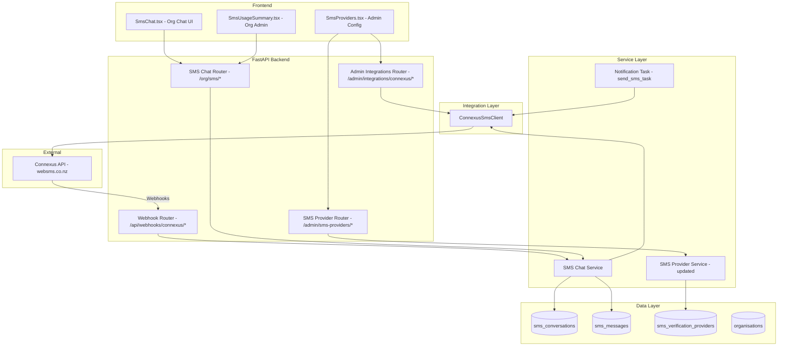
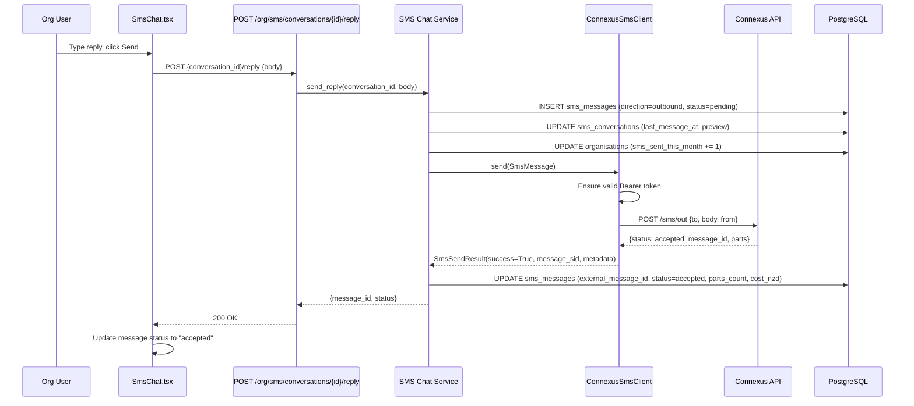
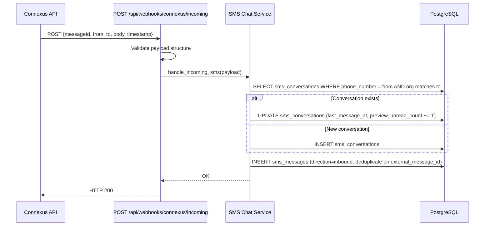

# Design Document: Connexus SMS Integration

## Overview

This design replaces the existing Twilio and AWS SNS SMS providers with WebSMS Connexus as the sole outbound SMS provider, while retaining Firebase Phone Auth for OTP verification. It introduces a new `ConnexusSmsClient` module with token-based authentication, two-way SMS via webhooks, a conversation/message data model with RLS, a chat API and frontend UI, and wires Connexus into the existing SMS billing and usage tracking systems.

The integration touches four layers:

1. **Integration layer** — New `app/integrations/connexus_sms.py` client with auth token management, send, balance, number validation, and webhook configuration methods.
2. **Data layer** — Two new tables (`sms_conversations`, `sms_messages`) with RLS, plus migration to seed Connexus and remove Twilio/AWS SNS providers.
3. **API layer** — Webhook endpoints for incoming SMS and delivery status, org-scoped chat CRUD endpoints, admin endpoints for balance/webhook config, and number validation.
4. **Frontend layer** — Updated `SmsProviders.tsx` admin page, new `SmsChat.tsx` conversation UI, and org admin usage summary components.

### Key Design Decisions

- **Shared SMS types module**: `SmsMessage` and `SmsSendResult` are extracted from the existing Twilio client into a new provider-agnostic module at `app/integrations/sms_types.py` (Requirement 1.2). Both the Connexus client and the notification task layer import from this shared module.
- **In-memory token caching**: The Connexus Bearer token is cached on the client instance with a proactive refresh window (5 minutes before expiry). No external cache (Redis) is needed since the token is short-lived and per-process.
- **Polling for real-time updates**: The SMS Chat UI uses 15-second polling rather than SSE/WebSockets to keep the implementation simple and consistent with the existing frontend patterns. SSE can be added later.
- **Idempotent webhooks**: Both incoming SMS and delivery status webhooks use `external_message_id` as a deduplication key to prevent duplicate records.
- **Explicit module structure**: The SMS chat feature lives in `app/modules/sms_chat/` with `__init__.py`, `router.py`, `service.py`, `models.py`, `schemas.py`, and `router_webhooks.py` (Requirement 8.10), following existing module patterns.
- **Navigation integration**: The SMS chat page is added to `frontend/src/layouts/OrgLayout.tsx` with proper module gating (Requirement 9.9).

### Files to Delete (Legacy Provider Removal)

Per Requirements 3.6–3.8, the following legacy code is removed as part of this integration:

| File / Code | Action |
|-------------|--------|
| `app/integrations/twilio_sms.py` | Delete entire file |
| `_test_twilio()` in `app/modules/sms_providers/service.py` | Remove function |
| `_test_aws_sns()` in `app/modules/sms_providers/service.py` | Remove function |
| Twilio/AWS SNS dispatch in `test_sms_provider()` | Remove branches, add Connexus branch |
| `send_org_sms()` import in `app/tasks/notifications.py` | Replace with Connexus provider resolution |
| `twilio_verify` and `aws_sns` entries in `CREDENTIAL_FIELDS` in `SmsProviders.tsx` | Remove |
| `twilio_verify` and `aws_sns` seed records in DB | Remove via migration |
| `'twilio'` in `integration_configs` check constraint | Remove via migration |

## Architecture



### Request Flow: Sending an Outbound SMS



### Request Flow: Receiving an Inbound SMS



## Components and Interfaces

### 1. Shared SMS Types (`app/integrations/sms_types.py`) — Requirement 1.2

Extracted from the existing Twilio client (`app/integrations/twilio_sms.py`) to be provider-agnostic. The Twilio file is then deleted per Requirement 3.6.

```python
@dataclass
class SmsMessage:
    to_number: str
    body: str
    from_number: str | None = None

@dataclass
class SmsSendResult:
    success: bool
    message_sid: str | None = None
    error: str | None = None
    metadata: dict | None = None  # parts_count, route, etc.
```

### 2. Connexus SMS Client (`app/integrations/connexus_sms.py`)

```python
@dataclass
class ConnexusConfig:
    client_id: str
    client_secret: str
    sender_id: str
    api_base_url: str = "https://websms.co.nz/api/connexus"

    @classmethod
    def from_dict(cls, data: dict) -> ConnexusConfig: ...
    def to_dict(self) -> dict: ...

class ConnexusSmsClient:
    def __init__(self, config: ConnexusConfig) -> None: ...

    # Auth
    async def _ensure_token(self) -> str: ...
    async def _refresh_token(self) -> None: ...

    # Core SMS
    async def send(self, message: SmsMessage) -> SmsSendResult: ...

    # Balance & validation
    async def check_balance(self) -> dict: ...  # {balance: float, currency: str}
    async def validate_number(self, number: str) -> dict: ...

    # Webhook config
    async def configure_webhooks(self, mo_webhook_url: str, dlr_webhook_url: str) -> dict: ...
```

Token management internals:
- `_token: str | None` — cached Bearer token
- `_token_expires_at: float` — Unix timestamp of expiry
- `_REFRESH_MARGIN = 300` — refresh 5 minutes before expiry
- `_TIMEOUT = 30` — HTTP timeout in seconds
- On 401 response: refresh token and retry once

### 3. Webhook Router (`app/modules/sms_chat/router_webhooks.py`) — Requirement 8.10

Part of the `app/modules/sms_chat/` module structure:

```python
router = APIRouter(prefix="/api/webhooks/connexus", tags=["webhooks"])

@router.post("/incoming")   # Incoming SMS webhook
@router.post("/status")     # Delivery status webhook
```

- No auth middleware (external Connexus callbacks)
- Payload validation via Pydantic schemas
- Returns HTTP 200 immediately, processes asynchronously if needed
- Idempotent: deduplicates on `messageId`/`external_message_id`

### 4. SMS Chat Router (`app/modules/sms_chat/router.py`) — Requirement 8.10

Part of the `app/modules/sms_chat/` module structure defined in Requirement 8.10.

```python
router = APIRouter(prefix="/org/sms", tags=["sms-chat"])

@router.get("/conversations")                          # List conversations (paginated)
@router.get("/conversations/{id}/messages")             # Message history (paginated)
@router.post("/conversations/{id}/reply")               # Send reply
@router.post("/conversations/new")                      # New conversation + first message
@router.post("/conversations/{id}/read")                # Mark as read
@router.post("/conversations/{id}/archive")             # Archive conversation
@router.post("/validate-number")                        # Number validation
@router.get("/usage-summary")                           # Org SMS usage summary
```

- All endpoints require authenticated org user (RLS via tenant middleware)
- Usage summary endpoint requires `org_admin` role

### 5. Admin Integrations Router (`app/modules/sms_chat/router_admin.py`) — Requirement 8.10

```python
router = APIRouter(prefix="/admin/integrations/connexus", tags=["admin"])

@router.get("/balance")                    # Check Connexus balance
@router.post("/configure-webhooks")        # Configure webhook URLs
```

- Requires `global_admin` role

### 6. SMS Chat Service (`app/modules/sms_chat/service.py`) — Requirement 8.10

Part of the `app/modules/sms_chat/` module structure. Core business logic functions:

```python
async def list_conversations(db, org_id, page, per_page, search) -> dict: ...
async def get_messages(db, org_id, conversation_id, page, per_page) -> dict: ...
async def send_reply(db, org_id, conversation_id, body) -> dict: ...
async def start_conversation(db, org_id, phone_number, body) -> dict: ...
async def mark_read(db, org_id, conversation_id) -> None: ...
async def archive_conversation(db, org_id, conversation_id) -> None: ...
async def handle_incoming_sms(db, payload) -> None: ...
async def handle_delivery_status(db, payload) -> None: ...
async def get_usage_summary(db, org_id) -> dict: ...
```

### 7. Updated SMS Provider Service (`app/modules/sms_providers/service.py`) — Requirements 3.6–3.8

Changes per Requirements 3.6–3.8:
- Remove `_test_twilio()` and `_test_aws_sns()` functions (Requirement 3.7)
- Add `_test_connexus()` function that sends a test SMS via `ConnexusSmsClient`
- Update `test_sms_provider()` dispatch to route `connexus` to `_test_connexus()`, removing Twilio/AWS SNS branches

### 8. Updated Notification Task (`app/tasks/notifications.py`) — Requirement 3.8

Changes to `send_sms_task()` per Requirement 3.8:
- Remove `from app.integrations.twilio_sms import send_org_sms` import
- Load active SMS provider from `sms_verification_providers` table
- Instantiate `ConnexusSmsClient` with decrypted credentials
- Call `client.send(SmsMessage(...))` and return result

### 9. Frontend Components

**Updated: `frontend/src/pages/admin/SmsProviders.tsx`** — Requirement 4.7
- Remove `twilio_verify` and `aws_sns` from `CREDENTIAL_FIELDS` (Requirement 4.7)
- Add `connexus` entry with `client_id`, `client_secret`, `sender_id` fields
- Add balance display section (calls `GET /admin/integrations/connexus/balance`)
- Add webhook URL display and configure button
- Add "Test Connection" button wired to existing test endpoint

**New: `frontend/src/pages/sms/SmsChat.tsx`** — Requirement 9.10
- Implemented at `frontend/src/pages/sms/SmsChat.tsx` per Requirement 9.10
- Split-panel layout: conversation list (left), message thread (right)
- Conversation list with search, unread badges, timestamps
- Message thread with inbound (left-aligned) / outbound (right-aligned) bubbles
- Status indicators: pending → accepted → delivered / undelivered
- Compose bar with text input, send button, template selector
- "New Conversation" dialog with phone number input and validation
- 15-second polling for new messages
- Navigation entry added to `frontend/src/layouts/OrgLayout.tsx` with module gating per Requirement 9.9

**New: `frontend/src/pages/sms/SmsUsageSummary.tsx`**
- SMS usage card: total sent, total cost, quota remaining, overage status
- Monthly cost trend chart
- 80% quota warning indicator

## Data Models

### sms_conversations

| Column | Type | Constraints |
|--------|------|-------------|
| id | UUID | PK, default gen_random_uuid() |
| org_id | UUID | FK → organisations.id, NOT NULL |
| phone_number | String(20) | NOT NULL, international format |
| contact_name | String(255) | NULLABLE |
| last_message_at | DateTime(tz) | NOT NULL |
| last_message_preview | String(100) | NOT NULL |
| unread_count | Integer | NOT NULL, default 0 |
| is_archived | Boolean | NOT NULL, default false |
| created_at | DateTime(tz) | NOT NULL, default now() |
| updated_at | DateTime(tz) | NOT NULL, default now(), onupdate now() |

**Constraints:**
- UNIQUE(org_id, phone_number)
- RLS policy: `org_id = current_setting('app.current_org_id')::uuid`

**Indexes:**
- `ix_sms_conversations_org_last_msg` on (org_id, last_message_at DESC)

### sms_messages

| Column | Type | Constraints |
|--------|------|-------------|
| id | UUID | PK, default gen_random_uuid() |
| conversation_id | UUID | FK → sms_conversations.id, NOT NULL |
| org_id | UUID | FK → organisations.id, NOT NULL |
| direction | String(10) | NOT NULL, CHECK IN ('inbound', 'outbound') |
| body | Text | NOT NULL |
| from_number | String(20) | NOT NULL |
| to_number | String(20) | NOT NULL |
| external_message_id | String(100) | NULLABLE, for Connexus message_id |
| status | String(20) | NOT NULL, default 'pending' |
| parts_count | Integer | NOT NULL, default 1 |
| cost_nzd | Numeric(10,4) | NULLABLE |
| sent_at | DateTime(tz) | NULLABLE |
| delivered_at | DateTime(tz) | NULLABLE |
| created_at | DateTime(tz) | NOT NULL, default now() |

**Constraints:**
- CHECK direction IN ('inbound', 'outbound')
- CHECK status IN ('pending', 'accepted', 'queued', 'delivered', 'undelivered', 'failed')
- RLS policy: `org_id = current_setting('app.current_org_id')::uuid`

**Indexes:**
- `ix_sms_messages_conv_created` on (conversation_id, created_at ASC)
- `ix_sms_messages_external_id` on (external_message_id) WHERE external_message_id IS NOT NULL — for webhook deduplication

### Connexus Status Code Mapping

| Connexus Code | Connexus Label | Internal Status |
|---------------|---------------|-----------------|
| 1 | DELIVRD | delivered |
| 2 | UNDELIV | undelivered |
| 4 | QUEUED | queued |
| 8 | ACCEPTD | accepted |
| 16 | UNDELIV | undelivered |

### SMS Cost Calculation

```
cost_nzd = parts_count × 0.10 × 1.15  (GST inclusive)
```

Per-part cost: $0.10 + 15% GST = $0.115 per part.


## Correctness Properties

*A property is a characteristic or behavior that should hold true across all valid executions of a system — essentially, a formal statement about what the system should do. Properties serve as the bridge between human-readable specifications and machine-verifiable correctness guarantees.*

### Property 1: ConnexusConfig serialization round-trip

*For any* valid `ConnexusConfig` instance with non-empty `client_id`, `client_secret`, `sender_id`, and `api_base_url`, calling `ConnexusConfig.from_dict(config.to_dict())` should produce a config with identical field values.

**Validates: Requirements 1.1**

### Property 2: Send payload construction

*For any* `SmsMessage` with a valid `to_number` and non-empty `body`, the HTTP payload constructed by `ConnexusSmsClient.send()` should contain `to` equal to `message.to_number`, `body` equal to `message.body`, and `from` equal to the configured `sender_id` (or `message.from_number` if provided).

**Validates: Requirements 1.4**

### Property 3: API failures return structured error results

*For any* Connexus API call that results in a non-success HTTP status code or a network/timeout exception, the client method should return a result with `success=False` and a non-empty `error` string describing the failure, rather than raising an unhandled exception.

**Validates: Requirements 1.6, 1.7, 11.3, 12.3**

### Property 4: Successful send includes parts metadata

*For any* successful SMS send where the Connexus API response includes a `parts` field with value N (N ≥ 1), the returned `SmsSendResult` should have `metadata["parts_count"]` equal to N.

**Validates: Requirements 1.9**

### Property 5: Token caching and Authorization header

*For any* sequence of N API calls (N ≥ 2) made within the token validity window, the client should reuse the same cached Bearer token and include it in the `Authorization: Bearer <token>` header for every call except the initial token request.

**Validates: Requirements 2.2, 2.6**

### Property 6: Proactive token refresh before expiry

*For any* cached token with expiry time T, if the current time is greater than T minus 300 seconds (5-minute margin), the client should request a new token before making the next API call.

**Validates: Requirements 2.3**

### Property 7: Incoming SMS creates conversation and inbound message

*For any* valid incoming SMS webhook payload with a `from` number matching an organisation's sender number, after processing: (a) an `sms_conversations` record exists for that org+phone_number pair, (b) an `sms_messages` record exists with `direction='inbound'` and the payload's body, and (c) the conversation's `unread_count` is incremented by 1.

**Validates: Requirements 5.2, 5.3, 8.9**

### Property 8: Malformed webhook payloads are rejected

*For any* incoming webhook request payload that is missing one or more required fields (`messageId`, `from`, `to`, `body`), the endpoint should return HTTP 400 and no `sms_messages` record should be created.

**Validates: Requirements 5.6**

### Property 9: Webhook idempotency

*For any* valid webhook payload (incoming SMS or delivery status), processing the same payload twice should produce the same database state as processing it once — no duplicate `sms_messages` records are created, and delivery status fields are not modified if already set to the same value.

**Validates: Requirements 5.7, 6.6**

### Property 10: Delivery status code mapping

*For any* delivery status webhook payload containing a `messageId` that matches an existing `sms_messages` record and a Connexus status code in {1, 2, 4, 8, 16}, the message record's `status` field should be updated to the corresponding internal status (1→delivered, 2→undelivered, 4→queued, 8→accepted, 16→undelivered).

**Validates: Requirements 6.2, 6.3**

### Property 11: Conversation uniqueness per org and phone number

*For any* organisation ID and phone number, attempting to create two `sms_conversations` records with the same `(org_id, phone_number)` pair should result in exactly one record (the second insert should be rejected or resolved to the existing record).

**Validates: Requirements 7.3**

### Property 12: RLS tenant isolation

*For any* two distinct organisation IDs (org_A, org_B), when querying `sms_conversations` or `sms_messages` with the database session scoped to org_A, no records belonging to org_B should be returned.

**Validates: Requirements 7.4, 7.5**

### Property 13: Conversations ordered by last message time

*For any* set of non-archived conversations belonging to an organisation, the `GET /org/sms/conversations` endpoint should return them in descending order of `last_message_at`.

**Validates: Requirements 8.1**

### Property 14: Messages ordered by creation time

*For any* set of messages within a conversation, the `GET /org/sms/conversations/{id}/messages` endpoint should return them in ascending order of `created_at`.

**Validates: Requirements 8.2**

### Property 15: New conversation upsert

*For any* phone number and organisation, calling `start_conversation(org_id, phone_number, body)` should: if no conversation exists for that org+phone, create one; if a conversation already exists, reuse it. In both cases, exactly one outbound message should be created.

**Validates: Requirements 8.4**

### Property 16: Outbound SMS creates record and updates state

*For any* outbound SMS sent via reply or new conversation, the system should: (a) create an `sms_messages` record with `direction='outbound'` and `status='pending'`, (b) update the conversation's `last_message_at` and `last_message_preview`, and (c) increment the organisation's `sms_sent_this_month` by exactly 1.

**Validates: Requirements 8.5, 8.6, 10.1**

### Property 17: Mark as read resets unread count

*For any* conversation with `unread_count` > 0, calling the mark-as-read endpoint should set `unread_count` to 0.

**Validates: Requirements 8.7**

### Property 18: Archive sets is_archived flag

*For any* non-archived conversation, calling the archive endpoint should set `is_archived` to true.

**Validates: Requirements 8.8**

### Property 19: Conversation search filtering

*For any* search query string Q and set of conversations, the filtered results should include only conversations where `phone_number` contains Q or `contact_name` contains Q (case-insensitive).

**Validates: Requirements 9.8**

### Property 20: SMS cost calculation

*For any* outbound SMS with `parts_count` = N (N ≥ 1), the `cost_nzd` field should equal N × 0.115 (i.e., $0.10 + 15% GST per part).

**Validates: Requirements 10.2, 14.1**

### Property 21: FIFO package credit deduction

*For any* organisation with multiple active SMS packages ordered by `purchased_at`, when deducting credits for an outbound SMS, credits should be deducted from the package with the earliest `purchased_at` first, and only move to the next package when the first is exhausted.

**Validates: Requirements 10.3**

### Property 22: Usage summary aggregation

*For any* organisation with known SMS message records for the current month, the usage summary endpoint should return `total_sent` equal to the count of outbound messages, `total_cost` equal to the sum of `cost_nzd` across those messages, and `overage_count` equal to `max(0, total_sent - effective_quota)`.

**Validates: Requirements 14.2**

### Property 23: Quota warning threshold

*For any* organisation where `sms_sent_this_month` exceeds 80% of the effective quota (plan included quota + package credits), the usage summary should include a warning flag set to true.

**Validates: Requirements 14.5**

### Property 24: Template variable substitution

*For any* SMS template containing N distinct variable placeholders and a complete variable map providing values for all N placeholders, the rendered body should contain none of the original placeholder tokens and should contain all N substituted values.

**Validates: Requirements 15.2**

## Error Handling

### Connexus API Errors

| Scenario | Handling |
|----------|----------|
| HTTP 401 Unauthorized | Refresh token, retry once. If retry fails, return `SmsSendResult(success=False)` |
| HTTP 4xx (other) | Return `SmsSendResult(success=False, error="{status}: {body}")` |
| HTTP 5xx | Return `SmsSendResult(success=False, error="{status}: {body}")` |
| Network timeout (30s) | Catch `httpx.TimeoutException`, log, return `SmsSendResult(success=False)` |
| Connection error | Catch `httpx.ConnectError`, log, return `SmsSendResult(success=False)` |
| Token refresh failure | Log error, return `SmsSendResult(success=False, error="Authentication failed")` |

### Webhook Error Handling

| Scenario | Handling |
|----------|----------|
| Malformed payload (missing fields) | Return HTTP 400 with error detail |
| Unknown messageId in status webhook | Log warning, return HTTP 200 (acknowledge to Connexus) |
| Unmatched `to` number in incoming webhook | Log warning, store with null org_id for manual review |
| Duplicate messageId (idempotency) | Skip insert, return HTTP 200 |
| Database error during webhook processing | Log error, return HTTP 200 (don't block Connexus retries) |

### SMS Chat API Errors

| Scenario | Handling |
|----------|----------|
| Conversation not found | HTTP 404 |
| Conversation belongs to different org (RLS) | HTTP 404 (RLS prevents access) |
| Empty message body | HTTP 422 validation error |
| SMS provider not configured/active | HTTP 503 with descriptive message |
| Connexus send failure | HTTP 502, message record saved with status "failed" |
| Number validation failure | Return `{success: false, error: "..."}` in response body |

### Balance and Webhook Config Errors

| Scenario | Handling |
|----------|----------|
| Balance check API failure | Return `{error: "..."}` with descriptive message, no unhandled exception |
| Webhook configuration failure | Return error message from Connexus API to frontend |
| Missing Connexus credentials | HTTP 400 with "Connexus credentials not configured" |

## Testing Strategy

### Property-Based Testing

**Library**: [Hypothesis](https://hypothesis.readthedocs.io/) for Python backend tests.

Each correctness property (Properties 1–24) will be implemented as a single property-based test using Hypothesis with a minimum of 100 examples per test. Tests will be tagged with comments referencing the design property:

```python
# Feature: connexus-sms-integration, Property 1: ConnexusConfig serialization round-trip
```

**Key generators needed**:
- `ConnexusConfig` — random client_id, client_secret, sender_id, api_base_url
- `SmsMessage` — random to_number (international format), body (1–1600 chars), optional from_number
- `IncomingWebhookPayload` — random messageId, from, to, body, timestamp
- `DeliveryStatusPayload` — random messageId, status code from {1, 2, 4, 8, 16}
- `SmsConversation` — random org_id, phone_number, contact_name
- `SmsMessageRecord` — random direction, body, status, parts_count

### Unit Testing

Unit tests complement property tests for specific examples, edge cases, and integration points:

- **Connexus client**: Mock httpx responses for success, 401 retry, timeout, connection error
- **Token management**: Test expiry calculation, proactive refresh timing, 401 retry-once behavior
- **Webhook endpoints**: Test with specific valid/invalid payloads, idempotency with known messageIds
- **Status code mapping**: Test each Connexus code (1, 2, 4, 8, 16) maps correctly
- **Chat service**: Test conversation creation, reply flow, archive, mark-as-read with specific data
- **Cost calculation**: Test single-part and multi-part cost with known values
- **FIFO deduction**: Test with 2-3 packages, verify oldest depleted first
- **Migration**: Test upgrade creates tables/indexes/RLS, downgrade drops them
- **Frontend**: Component tests for SmsChat conversation list rendering, message bubbles, template selector

### Test Organization

```
tests/
├── test_connexus_client.py          # Unit tests for ConnexusSmsClient
├── test_sms_chat_service.py         # Unit tests for chat service functions
├── test_sms_webhooks.py             # Unit tests for webhook endpoints
├── test_sms_chat_api.py             # Integration tests for chat API endpoints
├── properties/
│   ├── test_connexus_properties.py  # Properties 1-6 (client layer)
│   ├── test_sms_chat_properties.py  # Properties 7-19 (chat/webhook layer)
│   └── test_sms_billing_properties.py # Properties 20-24 (billing/cost layer)
```
