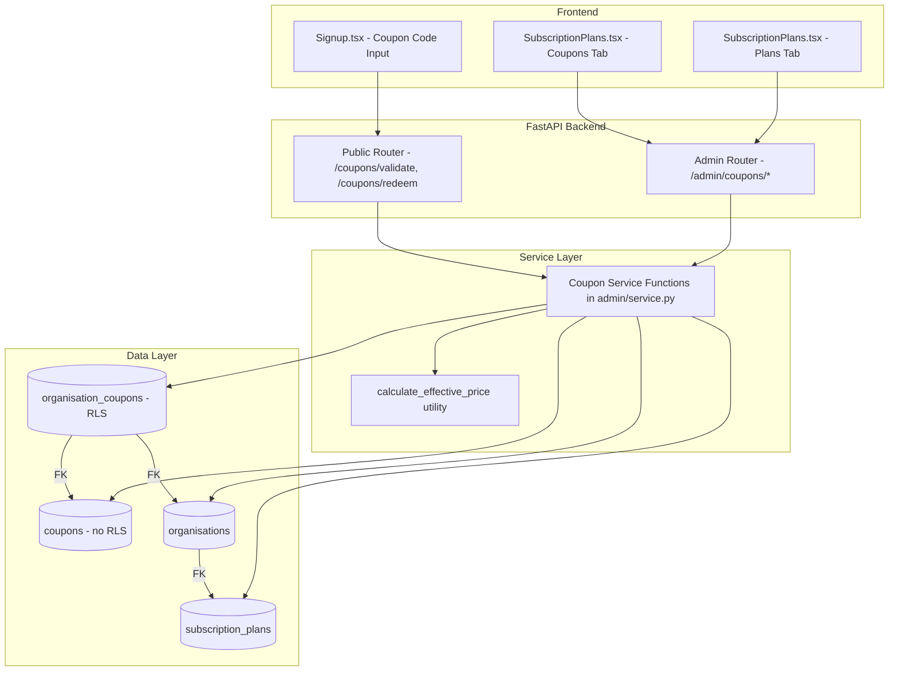
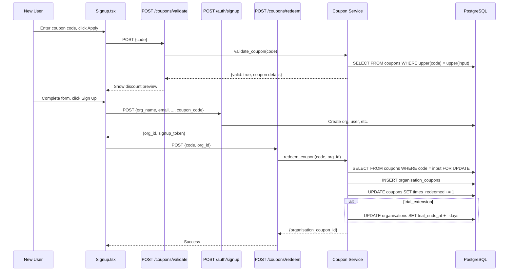
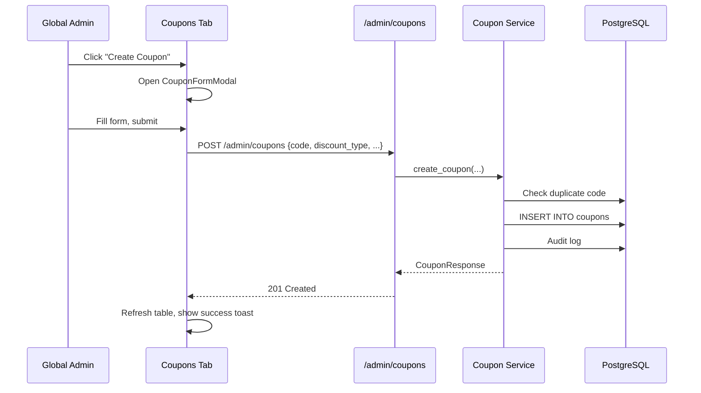

# Design Document: Coupon System

## Overview

This feature adds a coupon management system to the Subscription Management admin page. It introduces two new database tables (`coupons` and `organisation_coupons`), CRUD API endpoints under `/admin/coupons`, public validation/redemption endpoints, a new "Coupons" tab in the admin UI, and coupon code entry in the signup flow.

The implementation touches four layers:

1. **Data layer** — Two new tables: `coupons` (no RLS, global admin managed) and `organisation_coupons` (RLS scoped to `org_id`). Alembic migration 0093.
2. **Backend layer** — New SQLAlchemy models in `app/modules/admin/models.py`, Pydantic schemas in `app/modules/admin/schemas.py`, service functions in `app/modules/admin/service.py`, and router endpoints in `app/modules/admin/router.py`.
3. **Frontend admin layer** — New "Coupons" tab added to `SubscriptionPlans.tsx` with DataTable, create/edit modal, and deactivate/reactivate actions.
4. **Frontend signup layer** — Coupon code input section added to `Signup.tsx` with validate-on-apply and redeem-on-submit flow.

### Key Design Decisions

- **No separate module**: Coupons are part of the existing `admin` module since they're global admin-managed and closely tied to subscription plans. No new module directory needed.
- **Soft delete only**: `DELETE /admin/coupons/{id}` sets `is_active = false` rather than removing the row, preserving redemption history.
- **Code normalisation**: Coupon codes are stored uppercase, trimmed. Lookups are case-insensitive via `func.upper()`.
- **Atomic redemption**: Coupon redemption uses a single DB transaction with `SELECT ... FOR UPDATE` on the coupon row to prevent race conditions on `times_redeemed`.
- **No Stripe sync (yet)**: Coupon discounts are tracked internally. Stripe coupon sync is out of scope for this iteration — the effective price calculation is used for display and future billing integration.
- **Tab-based page layout**: The existing `SubscriptionPlans` component gets a top-level tab bar ("Plans" | "Coupons") wrapping the existing content and the new coupon management UI.

## Architecture



### Request Flow: Coupon Redemption During Signup



### Request Flow: Admin Coupon CRUD



## Components and Interfaces

### 1. Coupon SQLAlchemy Model (`app/modules/admin/models.py`)

```python
class Coupon(Base):
    __tablename__ = "coupons"

    id: Mapped[uuid.UUID]          # PK, gen_random_uuid()
    code: Mapped[str]              # String(50), unique, not null
    description: Mapped[str|None]  # String(255), nullable
    discount_type: Mapped[str]     # String(20), not null, CHECK IN (percentage, fixed_amount, trial_extension)
    discount_value: Mapped[float]  # Numeric(10,2), not null
    duration_months: Mapped[int|None]  # Integer, nullable
    usage_limit: Mapped[int|None]  # Integer, nullable
    times_redeemed: Mapped[int]    # Integer, default 0
    is_active: Mapped[bool]        # Boolean, default true
    starts_at: Mapped[datetime|None]   # DateTime(tz), nullable
    expires_at: Mapped[datetime|None]  # DateTime(tz), nullable
    created_at: Mapped[datetime]   # DateTime(tz), server_default now()
    updated_at: Mapped[datetime]   # DateTime(tz), server_default now(), onupdate now()

    # Relationships
    organisation_coupons: Mapped[list[OrganisationCoupon]] = relationship(back_populates="coupon")
```

### 2. OrganisationCoupon SQLAlchemy Model (`app/modules/admin/models.py`)

```python
class OrganisationCoupon(Base):
    __tablename__ = "organisation_coupons"

    id: Mapped[uuid.UUID]          # PK, gen_random_uuid()
    org_id: Mapped[uuid.UUID]      # FK → organisations.id, not null
    coupon_id: Mapped[uuid.UUID]   # FK → coupons.id, not null
    applied_at: Mapped[datetime]   # DateTime(tz), not null
    billing_months_used: Mapped[int]  # Integer, default 0
    is_expired: Mapped[bool]       # Boolean, default false
    created_at: Mapped[datetime]   # DateTime(tz), server_default now()

    # Relationships
    coupon: Mapped[Coupon] = relationship(back_populates="organisation_coupons")
    organisation: Mapped[Organisation] = relationship()

    __table_args__ = (
        UniqueConstraint("org_id", "coupon_id", name="uq_organisation_coupons_org_coupon"),
    )
```

### 3. Coupon Pydantic Schemas (`app/modules/admin/schemas.py`)

```python
class CouponCreateRequest(BaseModel):
    code: str = Field(..., min_length=3, max_length=50)
    description: str | None = Field(None, max_length=255)
    discount_type: str = Field(...)  # percentage | fixed_amount | trial_extension
    discount_value: float = Field(..., gt=0)
    duration_months: int | None = Field(None, gt=0)
    usage_limit: int | None = Field(None, gt=0)
    starts_at: datetime | None = None
    expires_at: datetime | None = None

class CouponUpdateRequest(BaseModel):
    description: str | None = Field(None, max_length=255)
    discount_value: float | None = Field(None, gt=0)
    duration_months: int | None = Field(None, gt=0)
    usage_limit: int | None = Field(None, gt=0)
    is_active: bool | None = None
    starts_at: datetime | None = None
    expires_at: datetime | None = None

class CouponResponse(BaseModel):
    id: str
    code: str
    description: str | None = None
    discount_type: str
    discount_value: float
    duration_months: int | None = None
    usage_limit: int | None = None
    times_redeemed: int = 0
    is_active: bool = True
    starts_at: datetime | None = None
    expires_at: datetime | None = None
    created_at: datetime
    updated_at: datetime

class CouponListResponse(BaseModel):
    coupons: list[CouponResponse]
    total: int

class CouponRedemptionRow(BaseModel):
    id: str
    org_id: str
    organisation_name: str
    applied_at: datetime
    billing_months_used: int
    is_expired: bool

class CouponDetailResponse(CouponResponse):
    redemptions: list[CouponRedemptionRow] = Field(default_factory=list)

class CouponValidateRequest(BaseModel):
    code: str = Field(..., min_length=1)

class CouponValidateResponse(BaseModel):
    valid: bool
    coupon: CouponResponse | None = None
    error: str | None = None

class CouponRedeemRequest(BaseModel):
    code: str = Field(..., min_length=1)
    org_id: str = Field(...)

class CouponRedeemResponse(BaseModel):
    message: str
    organisation_coupon_id: str
```

### 4. Coupon Service Functions (`app/modules/admin/service.py`)

```python
async def create_coupon(db, *, code, description, discount_type, discount_value,
                        duration_months, usage_limit, starts_at, expires_at,
                        created_by, ip_address) -> dict:
    """Create a new coupon. Normalise code to uppercase. Check for duplicates."""

async def list_coupons(db, *, include_inactive=False, page=1, page_size=50) -> dict:
    """List coupons with pagination, ordered by created_at desc."""

async def get_coupon(db, coupon_id) -> dict:
    """Get single coupon with redemption list (joined to organisations for names)."""

async def update_coupon(db, coupon_id, *, updates, updated_by, ip_address) -> dict:
    """Update coupon fields. Validate usage_limit >= times_redeemed."""

async def deactivate_coupon(db, coupon_id, *, updated_by, ip_address) -> dict:
    """Set is_active = False (soft delete)."""

async def reactivate_coupon(db, coupon_id, *, updated_by, ip_address) -> dict:
    """Set is_active = True."""

async def validate_coupon(db, code) -> dict:
    """Public validation: check is_active, usage_limit, starts_at, expires_at."""

async def redeem_coupon(db, *, code, org_id) -> dict:
    """Atomic redemption: SELECT FOR UPDATE, check limits, create org_coupon,
    increment times_redeemed, extend trial if trial_extension type."""

async def get_coupon_redemptions(db, coupon_id) -> list[dict]:
    """List all organisation_coupons for a given coupon."""

def calculate_effective_price(plan_price: float, discount_type: str,
                              discount_value: float, is_expired: bool) -> float:
    """Pure function: compute discounted price. Returns plan_price if expired."""
```

### 5. Admin Router Endpoints (`app/modules/admin/router.py`)

| Method | Path | Auth | Description |
|--------|------|------|-------------|
| GET | `/admin/coupons` | global_admin | List coupons (paginated) |
| POST | `/admin/coupons` | global_admin | Create coupon |
| GET | `/admin/coupons/{coupon_id}` | global_admin | Get coupon detail + redemptions |
| PUT | `/admin/coupons/{coupon_id}` | global_admin | Update coupon |
| DELETE | `/admin/coupons/{coupon_id}` | global_admin | Soft-delete (deactivate) |
| PUT | `/admin/coupons/{coupon_id}/reactivate` | global_admin | Reactivate coupon |
| GET | `/admin/coupons/{coupon_id}/redemptions` | global_admin | List redemptions |

### 6. Public Router Endpoints (`app/modules/admin/router.py`)

These endpoints are on a separate router without auth middleware, mounted at `/api/v1/coupons`:

| Method | Path | Auth | Description |
|--------|------|------|-------------|
| POST | `/coupons/validate` | None (public) | Validate coupon code |
| POST | `/coupons/redeem` | None (public, called after signup) | Redeem coupon for org |

### 7. Frontend: Coupons Tab (`frontend/src/pages/admin/SubscriptionPlans.tsx`)

The existing `SubscriptionPlans` component is restructured with a top-level tab bar:

```typescript
// New state
const [activeMainTab, setActiveMainTab] = useState<'plans' | 'coupons'>('plans')

// Render structure:
// <div>
//   <h1>Subscription Management</h1>
//   <TabBar tabs={['Plans', 'Coupons']} active={activeMainTab} />
//   <ToastContainer />
//   {activeMainTab === 'plans' && <PlansContent />}
//   {activeMainTab === 'coupons' && <CouponsContent />}
// </div>
```

**CouponsContent** (inline in same file, following existing pattern):
- State: `coupons`, `couponsLoading`, `couponsError`, `couponFormOpen`, `editCoupon`, `couponSaving`
- Fetches from `GET /admin/coupons`
- DataTable with columns: Code, Description, Type, Value, Duration, Usage, Status, Created, Actions
- "Create Coupon" button opens `CouponFormModal`
- Actions: Edit (opens modal), Deactivate/Reactivate (with confirmation)

**CouponFormModal** (inline in same file):
- Fields: code, description, discount_type (select), discount_value, duration_months, usage_limit, starts_at, expires_at
- Dynamic label on discount_value based on discount_type selection
- Client-side validation matching Requirement 8 acceptance criteria
- Resets state on open/close

**Coupon TypeScript interface:**
```typescript
interface Coupon {
  id: string
  code: string
  description: string | null
  discount_type: 'percentage' | 'fixed_amount' | 'trial_extension'
  discount_value: number
  duration_months: number | null
  usage_limit: number | null
  times_redeemed: number
  is_active: boolean
  starts_at: string | null
  expires_at: string | null
  created_at: string
  updated_at: string
}
```

### 8. Frontend: Signup Coupon Code (`frontend/src/pages/auth/Signup.tsx`)

Added between the plan selector and CAPTCHA section:

```typescript
// New state
const [couponCode, setCouponCode] = useState('')
const [couponApplied, setCouponApplied] = useState<CouponResponse | null>(null)
const [couponError, setCouponError] = useState<string | null>(null)
const [couponValidating, setCouponValidating] = useState(false)
const [showCouponInput, setShowCouponInput] = useState(false)
```

**Behavior:**
- "Have a coupon code?" link toggles `showCouponInput`
- Text input + "Apply" button calls `POST /coupons/validate`
- On success: show discount preview (type, value, duration) with green badge
- On error: show error message inline
- "Remove" button clears applied coupon
- On signup submit success: call `POST /coupons/redeem` with `{code, org_id}` from signup response
- Effective price shown next to plan price when coupon is applied

**Discount preview display:**
- Percentage: "20% off" or "20% off for 3 months"
- Fixed amount: "$10.00 off/mo" or "$10.00 off/mo for 6 months"
- Trial extension: "+30 days free trial"

## Data Models

### coupons table

| Column | Type | Constraints |
|--------|------|-------------|
| id | UUID | PK, default gen_random_uuid() |
| code | String(50) | UNIQUE, NOT NULL |
| description | String(255) | NULLABLE |
| discount_type | String(20) | NOT NULL, CHECK IN ('percentage', 'fixed_amount', 'trial_extension') |
| discount_value | Numeric(10,2) | NOT NULL |
| duration_months | Integer | NULLABLE |
| usage_limit | Integer | NULLABLE |
| times_redeemed | Integer | NOT NULL, default 0 |
| is_active | Boolean | NOT NULL, default true |
| starts_at | DateTime(tz) | NULLABLE |
| expires_at | DateTime(tz) | NULLABLE |
| created_at | DateTime(tz) | NOT NULL, default now() |
| updated_at | DateTime(tz) | NOT NULL, default now(), onupdate now() |

**Constraints:**
- `ck_coupons_discount_type`: CHECK discount_type IN ('percentage', 'fixed_amount', 'trial_extension')
- No RLS (global admin table, same pattern as `subscription_plans`)

**Indexes:**
- `ix_coupons_code` on (code) — unique index for fast lookup

### organisation_coupons table

| Column | Type | Constraints |
|--------|------|-------------|
| id | UUID | PK, default gen_random_uuid() |
| org_id | UUID | FK → organisations.id, NOT NULL |
| coupon_id | UUID | FK → coupons.id, NOT NULL |
| applied_at | DateTime(tz) | NOT NULL |
| billing_months_used | Integer | NOT NULL, default 0 |
| is_expired | Boolean | NOT NULL, default false |
| created_at | DateTime(tz) | NOT NULL, default now() |

**Constraints:**
- `uq_organisation_coupons_org_coupon`: UNIQUE(org_id, coupon_id)
- RLS policy: `org_id = current_setting('app.current_org_id')::uuid`

**Indexes:**
- `ix_organisation_coupons_org_id` on (org_id)
- `ix_organisation_coupons_coupon_id` on (coupon_id)

### Alembic Migration: 0093

```python
# alembic/versions/2026_03_17_1000-0093_create_coupon_tables.py
"""Create coupons and organisation_coupons tables.

Revision ID: 0093
Revises: 0092
"""

def upgrade():
    # 1. Create coupons table (no RLS)
    # 2. Create organisation_coupons table
    # 3. Add check constraint on discount_type
    # 4. Add unique constraint on (org_id, coupon_id)
    # 5. Create indexes
    # 6. Enable RLS on organisation_coupons only
    # 7. Create tenant_isolation policy on organisation_coupons

def downgrade():
    # 1. Drop RLS policy on organisation_coupons
    # 2. Disable RLS on organisation_coupons
    # 3. Drop organisation_coupons table
    # 4. Drop coupons table
```

## Correctness Properties

### Property 1: Coupon code normalisation round-trip

*For any* string containing alphanumeric characters, hyphens, and underscores (3–50 chars), creating a coupon with that code and then looking it up by the uppercase version of the same code should return the coupon.

**Validates: Requirements 2.6, 3.1**

### Property 2: Effective price calculation bounds

*For any* plan price ≥ 0, *for any* discount_type in {percentage, fixed_amount, trial_extension}, *for any* discount_value > 0, and *for any* is_expired boolean, `calculate_effective_price` should return a value where `0 ≤ result ≤ plan_price`.

**Validates: Requirements 11.2, 11.3, 11.4, 11.5, 11.6**

### Property 3: Percentage discount calculation

*For any* plan price ≥ 0 and *for any* percentage value between 1 and 100 (inclusive), when is_expired is false, `calculate_effective_price` should return `round(plan_price × (1 - percentage / 100), 2)`.

**Validates: Requirements 5.3, 11.3**

### Property 4: Fixed amount discount calculation

*For any* plan price ≥ 0 and *for any* fixed amount > 0, when is_expired is false, `calculate_effective_price` should return `max(0, round(plan_price - fixed_amount, 2))`.

**Validates: Requirements 5.4, 11.4**

### Property 5: Expired coupon returns full price

*For any* plan price ≥ 0 and *for any* valid coupon parameters, when is_expired is true, `calculate_effective_price` should return exactly `plan_price`.

**Validates: Requirements 11.2**

### Property 6: Trial extension does not affect price

*For any* plan price ≥ 0 and *for any* trial extension value > 0, `calculate_effective_price` with discount_type "trial_extension" should return exactly `plan_price` regardless of is_expired.

**Validates: Requirements 11.5**

### Property 7: Usage limit enforcement

*For any* coupon with `usage_limit = N` and `times_redeemed = N`, attempting to redeem the coupon should fail with "Coupon usage limit reached". For `times_redeemed < N`, redemption should succeed.

**Validates: Requirements 3.2, 6.1**

### Property 8: Duplicate redemption prevention

*For any* organisation and coupon pair, after a successful redemption, attempting to redeem the same coupon for the same organisation should fail with a 409 Conflict error.

**Validates: Requirements 1.8, 3.7**

### Property 9: Coupon validation date range

*For any* coupon with `starts_at` and `expires_at` set, validation should succeed only when `starts_at ≤ current_time ≤ expires_at`. Before `starts_at` should return "Coupon is not yet active". After `expires_at` should return "Coupon has expired".

**Validates: Requirements 3.2, 3.3**

### Property 10: Usage limit update constraint

*For any* coupon with `times_redeemed = R`, updating `usage_limit` to a value `L` should succeed if and only if `L ≥ R`. Setting `L < R` should return a 422 error.

**Validates: Requirements 6.3, 6.4**

### Property 11: Atomic redemption — times_redeemed consistency

*For any* coupon with `times_redeemed = R` before redemption, after a successful redemption `times_redeemed` should equal `R + 1`, and exactly one `organisation_coupons` record should exist for that org+coupon pair.

**Validates: Requirements 3.4, 3.8**

### Property 12: Coupon form validation — discount_value by type

*For any* discount_type, the frontend form validation should: accept values 1–100 for "percentage", accept values > 0 for "fixed_amount", and accept whole numbers > 0 for "trial_extension". Values outside these ranges should be rejected.

**Validates: Requirements 8.3, 8.4, 8.5**

## Error Handling

### Admin API Errors

| Scenario | HTTP Status | Response |
|----------|-------------|----------|
| Duplicate coupon code | 409 | `{"detail": "A coupon with code 'X' already exists"}` |
| Coupon not found | 404 | `{"detail": "Coupon not found"}` |
| Invalid discount_type | 422 | Pydantic validation error |
| usage_limit < times_redeemed | 422 | `{"detail": "Usage limit cannot be less than current redemptions (N)"}` |
| Invalid UUID format | 400 | `{"detail": "Invalid coupon_id format"}` |

### Public API Errors

| Scenario | HTTP Status | Response |
|----------|-------------|----------|
| Coupon not found | 200 | `{"valid": false, "error": "Coupon not found"}` |
| Coupon expired | 200 | `{"valid": false, "error": "Coupon has expired"}` |
| Coupon not yet active | 200 | `{"valid": false, "error": "Coupon is not yet active"}` |
| Usage limit reached | 200 | `{"valid": false, "error": "Coupon usage limit reached"}` |
| Coupon inactive | 200 | `{"valid": false, "error": "Coupon not found"}` |
| Already redeemed by org | 409 | `{"detail": "Coupon already redeemed by this organisation"}` |
| Org not found on redeem | 404 | `{"detail": "Organisation not found"}` |

### Frontend Error Handling

| Scenario | Handling |
|----------|----------|
| Coupon list fetch fails | AlertBanner: "Could not load coupons." |
| Create/update API error | Inline error in modal from `error.response.data.detail` |
| Validate coupon error | Inline error below coupon input field |
| Redeem coupon fails after signup | Console error logged, non-blocking (signup already succeeded) |
| Network error | "Network error. Please try again." inline |

## Testing Strategy

### Property-Based Testing

**Library**: Hypothesis (Python backend), fast-check (TypeScript frontend)

Each correctness property (Properties 1–12) will be implemented as a property-based test. Backend tests use Hypothesis with a minimum of 100 examples. Frontend tests use fast-check with a minimum of 100 iterations.

**Key generators needed (Python/Hypothesis):**
- Coupon code: `st.from_regex(r'[A-Za-z0-9_-]{3,50}', fullmatch=True)`
- Discount type: `st.sampled_from(['percentage', 'fixed_amount', 'trial_extension'])`
- Discount value: `st.floats(min_value=0.01, max_value=10000, allow_nan=False, allow_infinity=False)`
- Plan price: `st.floats(min_value=0, max_value=100000, allow_nan=False, allow_infinity=False)`
- Usage limit: `st.one_of(st.none(), st.integers(min_value=1, max_value=10000))`
- Duration months: `st.one_of(st.none(), st.integers(min_value=1, max_value=120))`

**Key generators needed (TypeScript/fast-check):**
- Discount value by type: conditional generators based on discount_type
- Form field values: strings, numbers within validation bounds

### Test Organization

```
tests/
├── properties/
│   └── test_coupon_properties.py    # Properties 1-11 (backend)
frontend/src/
├── pages/admin/__tests__/
│   └── coupon-system.properties.test.ts  # Property 12 (frontend validation)
│   └── CouponManagement.test.tsx         # Unit tests for coupon UI
```

### Unit Tests

- `create_coupon` with valid/invalid inputs
- `validate_coupon` with active/inactive/expired/not-yet-active/limit-reached coupons
- `redeem_coupon` with valid/duplicate/limit-reached scenarios
- `update_coupon` with usage_limit boundary cases
- `calculate_effective_price` with each discount type and edge cases (0 price, 100% discount, large fixed amount)
- Frontend: CouponFormModal renders, validates, submits correctly
- Frontend: Coupons tab loads, displays table, handles errors
- Frontend: Signup coupon input validates, shows preview, redeems on submit
