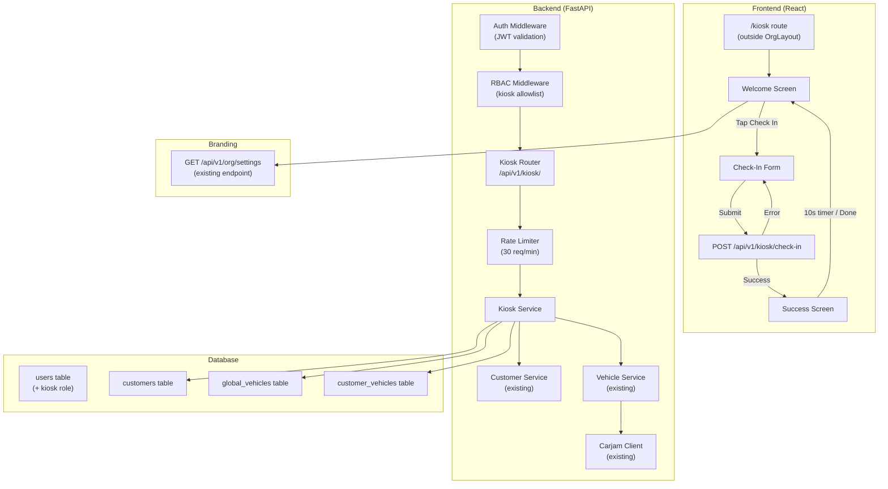

# Design Document: Customer Check-In Kiosk

## Overview

The Customer Check-In Kiosk adds a self-service tablet-facing page at `/kiosk` where walk-in customers enter their name, phone, email, and vehicle registration. The system deduplicates against existing customer records by phone number, resolves vehicle details via the existing Carjam integration, and links vehicles to customers — all through a new `kiosk` role with severely restricted RBAC permissions.

The feature touches three layers:

1. **Database** — Alembic migration to add `kiosk` to the `ck_users_role` CHECK constraint.
2. **Backend** — New `app/modules/kiosk/` module with a single composite check-in endpoint, plus RBAC updates in `rbac.py` to enforce allowlist-based access for the kiosk role.
3. **Frontend** — New `/kiosk` route rendered outside `OrgLayout` (like auth pages), containing Welcome → Form → Success screens with auto-reset.

### Key Design Decisions

- **Single composite endpoint** (`POST /api/v1/kiosk/check-in`): The check-in orchestrates customer lookup/create, vehicle lookup/create, and vehicle-customer linking in one atomic transaction. This keeps the kiosk frontend simple (one API call) and avoids partial-state issues if the tablet loses connectivity mid-flow.
- **Allowlist-based RBAC** (not denylist): The kiosk role uses a `KIOSK_ALLOWED_PREFIXES` tuple in `check_role_path_access`. Any path not in the allowlist is denied. This is the safest approach — new endpoints are automatically blocked.
- **30-day refresh token**: Handled by checking `user.role == "kiosk"` in `authenticate_user` and overriding the expiry delta, similar to the existing `remember_me` logic.
- **No new database tables**: The kiosk creates standard `Customer` and `GlobalVehicle` records using existing service functions. No kiosk-specific tables are needed.

## Architecture



### Request Flow

1. Kiosk tablet loads `/kiosk` → React app renders `KioskPage` outside `OrgLayout`.
2. Welcome screen fetches org branding via `GET /api/v1/org/settings` (already permitted for org roles).
3. Customer fills form → `POST /api/v1/kiosk/check-in` with `{ first_name, last_name, phone, email?, rego? }`.
4. Auth middleware validates JWT → RBAC middleware checks kiosk allowlist → rate limiter checks 30/min.
5. Kiosk service: search customer by phone → create or return existing → if rego provided, lookup/create vehicle → link vehicle to customer.
6. Response: `{ customer_first_name, is_new_customer, vehicle_linked }`.
7. Frontend shows Success screen → 10-second countdown → auto-reset to Welcome.

## Components and Interfaces

### Backend Components

#### 1. Alembic Migration — Add `kiosk` Role

A new migration alters the `ck_users_role` CHECK constraint on `users.role` to include `'kiosk'`:

```sql
ALTER TABLE users DROP CONSTRAINT ck_users_role;
ALTER TABLE users ADD CONSTRAINT ck_users_role
  CHECK (role IN ('global_admin','franchise_admin','org_admin','location_manager','salesperson','staff_member','kiosk'));
```

#### 2. RBAC Updates (`app/modules/auth/rbac.py`)

- Add `KIOSK = "kiosk"` constant.
- Add `KIOSK` to `ALL_ROLES` set.
- Add `KIOSK` to `ROLE_PERMISSIONS` with minimal permissions: `["kiosk.check_in"]`.
- Add `KIOSK_ALLOWED_PREFIXES` tuple:
  ```python
  KIOSK_ALLOWED_PREFIXES: tuple[str, ...] = (
      "/api/v1/kiosk/",
      "/api/v1/kiosk",
      "/api/v1/org/settings",  # branding retrieval (GET only)
  )
  ```
- Add kiosk branch in `check_role_path_access`:
  ```python
  elif role == KIOSK:
      if not _matches_any_prefix(path, KIOSK_ALLOWED_PREFIXES):
          return "Kiosk role can only access check-in and branding endpoints"
      # Kiosk can only GET org/settings, not modify
      if _matches_any_prefix(path, ("/api/v1/org/settings",)) and method.upper() != "GET":
          return "Kiosk role has read-only access to organisation settings"
  ```

#### 3. Kiosk Module (`app/modules/kiosk/`)

New module with:

- `router.py` — Single endpoint `POST /api/v1/kiosk/check-in`
- `service.py` — Orchestration logic
- `schemas.py` — Pydantic request/response models

#### 4. Auth Service Update (`app/modules/auth/service.py`)

In `authenticate_user`, after the MFA check and before issuing tokens, add kiosk-specific refresh token expiry:

```python
if user.role == "kiosk":
    expires_delta = timedelta(days=30)
elif payload.remember_me:
    expires_delta = timedelta(days=settings.refresh_token_remember_days)
else:
    expires_delta = timedelta(days=settings.refresh_token_expire_days)
```

#### 5. Organisation Router Update

Add `"kiosk"` to the `require_role` dependency on `get_settings` so kiosk users can fetch branding:

```python
dependencies=[require_role("org_admin", "salesperson", "location_manager", "kiosk")]
```

### Frontend Components

#### 1. `KioskPage` (`frontend/src/pages/kiosk/KioskPage.tsx`)

Top-level page component rendered at `/kiosk` outside `OrgLayout`. Manages screen state machine:

```typescript
type KioskScreen = 'welcome' | 'form' | 'success' | 'error'
```

No navigation chrome, no sidebar, no header links. Full-screen layout optimised for tablet.

#### 2. `KioskWelcome` (`frontend/src/pages/kiosk/KioskWelcome.tsx`)

- Fetches org branding from `GET /api/v1/org/settings`
- Displays org logo, name, "Welcome to [Org Name]" message
- Single large "Check In" button (min 48×48px tap target, 22px font)

#### 3. `KioskCheckInForm` (`frontend/src/pages/kiosk/KioskCheckInForm.tsx`)

- Fields: first name, last name, phone (required); email, vehicle rego (optional)
- All inputs min 48px height, 18px font
- Client-side validation matching backend rules
- Submit button + Back button
- Loading state with disabled submit to prevent double-tap

#### 4. `KioskSuccess` (`frontend/src/pages/kiosk/KioskSuccess.tsx`)

- "Thanks [First Name], we'll be with you shortly"
- Countdown timer (10 → 0) with visual display
- "Done" button for immediate reset
- Auto-navigates to Welcome when timer hits 0

#### 5. `KioskError` (inline in `KioskPage`)

- "Something went wrong, please try again"
- "Try Again" button returns to form with preserved data

#### 6. Route Registration (`frontend/src/App.tsx`)

Add kiosk route at the same level as portal (outside `RequireAuth` wrapper but with its own auth check):

```tsx
{/* Kiosk (standalone, outside OrgLayout) */}
<Route element={<RequireAuth />}>
  <Route path="/kiosk" element={<SafePage name="kiosk"><KioskPage /></SafePage>} />
</Route>
```

### API Interfaces

#### `POST /api/v1/kiosk/check-in`

**Auth**: JWT with `role: kiosk` required.  
**Rate Limit**: 30 requests/minute per kiosk user.  
**Dependencies**: `require_role("kiosk")`

**Request Body** (`KioskCheckInRequest`):
```json
{
  "first_name": "string (1-100 chars, required)",
  "last_name": "string (1-100 chars, required)",
  "phone": "string (min 7 digits, required)",
  "email": "string (valid email, optional)",
  "vehicle_rego": "string (optional)"
}
```

**Success Response** (200) (`KioskCheckInResponse`):
```json
{
  "customer_first_name": "Jane",
  "is_new_customer": true,
  "vehicle_linked": true
}
```

**Error Responses**:
- `422` — Validation error (invalid phone format, name too long, etc.)
- `401` — JWT expired or missing
- `403` — Role not permitted
- `429` — Rate limit exceeded

#### `GET /api/v1/org/settings` (existing, updated RBAC)

Already exists. Updated to allow `kiosk` role (GET only) for branding retrieval.

## Data Models

### Database Changes

#### Migration: Add `kiosk` to Role CHECK Constraint

```python
# alembic/versions/XXXX_add_kiosk_role.py
def upgrade():
    op.drop_constraint("ck_users_role", "users", type_="check")
    op.create_check_constraint(
        "ck_users_role",
        "users",
        "role IN ('global_admin','franchise_admin','org_admin','location_manager','salesperson','staff_member','kiosk')",
    )

def downgrade():
    op.drop_constraint("ck_users_role", "users", type_="check")
    op.create_check_constraint(
        "ck_users_role",
        "users",
        "role IN ('global_admin','franchise_admin','org_admin','location_manager','salesperson','staff_member')",
    )
```

No new tables are required. The kiosk feature reuses:

- `users` — Kiosk accounts stored with `role = 'kiosk'`, `org_id` set to the creating org_admin's org.
- `customers` — New customer records created with `customer_type = 'individual'`.
- `global_vehicles` — Vehicle records from Carjam lookup or manual entry.
- `customer_vehicles` — Links between customers and vehicles.
- `sessions` — Kiosk sessions with 30-day refresh token expiry.

### Pydantic Schemas

```python
# app/modules/kiosk/schemas.py
from pydantic import BaseModel, Field, field_validator
import re

class KioskCheckInRequest(BaseModel):
    first_name: str = Field(..., min_length=1, max_length=100)
    last_name: str = Field(..., min_length=1, max_length=100)
    phone: str = Field(..., min_length=7)
    email: str | None = Field(None)
    vehicle_rego: str | None = Field(None)

    @field_validator("phone")
    @classmethod
    def validate_phone(cls, v: str) -> str:
        digits = re.sub(r"[\s\-\+\(\)]", "", v)
        if len(digits) < 7 or not digits.isdigit():
            raise ValueError("Phone must contain at least 7 digits")
        return v.strip()

    @field_validator("email")
    @classmethod
    def validate_email(cls, v: str | None) -> str | None:
        if v is None:
            return None
        if not re.match(r"^[^@\s]+@[^@\s]+\.[^@\s]+$", v):
            raise ValueError("Invalid email format")
        return v.strip().lower()

    @field_validator("vehicle_rego")
    @classmethod
    def validate_rego(cls, v: str | None) -> str | None:
        if v is None or v.strip() == "":
            return None
        return v.strip().upper()

class KioskCheckInResponse(BaseModel):
    customer_first_name: str
    is_new_customer: bool
    vehicle_linked: bool
```

### Kiosk Service Logic

```python
# app/modules/kiosk/service.py (pseudocode)
async def kiosk_check_in(db, *, org_id, user_id, data, ip_address):
    # 1. Search for existing customer by phone within org
    existing = await search_customer_by_phone(db, org_id=org_id, phone=data.phone)
    
    if existing:
        customer = existing
        is_new = False
    else:
        # 2. Create new customer
        customer = await create_customer(
            db, org_id=org_id, user_id=user_id,
            first_name=data.first_name, last_name=data.last_name,
            phone=data.phone, email=data.email,
            customer_type="individual",
        )
        is_new = True
    
    vehicle_linked = False
    
    if data.vehicle_rego:
        # 3. Try Carjam lookup, fallback to manual
        try:
            vehicle = await lookup_vehicle(db, redis, rego=data.vehicle_rego, ...)
        except (CarjamNotFoundError, CarjamError):
            vehicle = await create_manual_vehicle(db, org_id=org_id, rego=data.vehicle_rego, ...)
        
        # 4. Link vehicle to customer (idempotent — checks for existing link)
        await link_vehicle_to_customer(db, vehicle_id=vehicle["id"], customer_id=customer["id"], ...)
        vehicle_linked = True
    
    return KioskCheckInResponse(
        customer_first_name=customer["first_name"] if is_new else existing["first_name"],
        is_new_customer=is_new,
        vehicle_linked=vehicle_linked,
    )
```

## Correctness Properties

*A property is a characteristic or behavior that should hold true across all valid executions of a system — essentially, a formal statement about what the system should do. Properties serve as the bridge between human-readable specifications and machine-verifiable correctness guarantees.*

### Property 1: Kiosk role is a valid user role

*For any* user creation attempt, setting `role = "kiosk"` with a valid `org_id` should succeed and persist, while any role value not in the defined set should be rejected by the database constraint.

**Validates: Requirements 1.1, 1.2**

### Property 2: Kiosk authentication produces correct token and session

*For any* kiosk user that authenticates successfully, the resulting JWT must contain `role: "kiosk"` and the user's `org_id`, and the session's `expires_at` must be approximately 30 days from the authentication time.

**Validates: Requirements 1.3, 1.4**

### Property 3: Kiosk RBAC allowlist enforcement

*For any* API path and HTTP method, `check_role_path_access("kiosk", path, method)` should return `None` (allowed) if and only if the path starts with one of the kiosk-allowed prefixes (`/api/v1/kiosk/`, `/api/v1/org/settings` GET-only). For all other paths, it should return a non-None denial reason.

**Validates: Requirements 1.5, 1.6, 6.1**

### Property 4: Session revocation on kiosk deactivation

*For any* kiosk user with one or more active sessions, deactivating the user or revoking their sessions should result in all sessions for that user having `is_revoked = True`.

**Validates: Requirements 1.7, 7.3**

### Property 5: Multiple kiosk accounts per organisation

*For any* organisation, creating N kiosk user accounts (where N ≥ 1) should succeed, resulting in N distinct kiosk users all scoped to that organisation.

**Validates: Requirements 1.8**

### Property 6: Welcome message format

*For any* organisation name string, the welcome screen message should equal `"Welcome to [organisation_name]"` where `[organisation_name]` is the exact org name.

**Validates: Requirements 2.3**

### Property 7: Check-in form validation

*For any* input tuple (first_name, last_name, phone, email, vehicle_rego), the `KioskCheckInRequest` validator should accept the input if and only if: first_name is 1–100 chars, last_name is 1–100 chars, phone contains ≥ 7 digits (allowing spaces/hyphens/plus), email (if provided) matches standard email format, and vehicle_rego (if provided) is non-empty after trimming.

**Validates: Requirements 3.2, 3.3, 3.4**

### Property 8: Phone-based customer deduplication

*For any* organisation and phone number, if a customer with that phone already exists in the organisation, calling the kiosk check-in with that phone should return `is_new_customer: false` and the total customer count for that org should remain unchanged.

**Validates: Requirements 4.1, 4.2**

### Property 9: New customer creation with correct fields

*For any* check-in submission where no customer with the given phone exists in the organisation, the kiosk service should create a new customer with the submitted first_name, last_name, phone, and email, and `customer_type` must equal `"individual"`.

**Validates: Requirements 4.3, 4.4**

### Property 10: Vehicle lookup with Carjam fallback

*For any* check-in submission that includes a vehicle_rego, if the Carjam lookup succeeds, the resulting vehicle record should contain Carjam-sourced data; if the Carjam lookup fails, a manual vehicle record should be created with the registration plate. In both cases, the vehicle must be linked to the resolved customer.

**Validates: Requirements 4.5, 4.6**

### Property 11: Vehicle deduplication

*For any* vehicle registration that already exists in `global_vehicles`, a kiosk check-in with that registration should not create a new vehicle record — the existing vehicle should be linked to the customer.

**Validates: Requirements 4.7**

### Property 12: Check-in response shape

*For any* successful kiosk check-in, the response must contain `customer_first_name` (non-empty string), `is_new_customer` (boolean), and `vehicle_linked` (boolean). The `customer_first_name` must match the resolved customer's first name.

**Validates: Requirements 4.8, 5.1**

### Property 13: Form state preservation on error

*For any* form data submitted to the check-in endpoint that results in an API error, navigating back to the form should restore all previously entered field values.

**Validates: Requirements 5.5**

### Property 14: Form state cleared on reset

*For any* kiosk page state, when the page transitions back to the welcome screen (via auto-reset, "Done" button, or "Back" button), all form field values and customer data must be cleared from component state, and no customer data should be present in browser localStorage or sessionStorage.

**Validates: Requirements 6.3, 6.4**

### Property 15: Rate limiting enforcement

*For any* kiosk user, sending more than 30 check-in requests within a 60-second window should result in subsequent requests being rejected with HTTP 429.

**Validates: Requirements 6.5**

### Property 16: Kiosk user creation requires only email and password

*For any* kiosk user creation request with a valid email and password but no first_name or last_name, the creation should succeed. The first_name and last_name fields should be optional when `role = "kiosk"`.

**Validates: Requirements 7.2**

## Error Handling

### Backend Errors

| Scenario | HTTP Status | Response | Recovery |
|----------|-------------|----------|----------|
| Invalid form data (name too long, bad phone) | 422 | Pydantic validation errors | Frontend shows field-level errors |
| JWT expired | 401 | `{"detail": "Token expired"}` | Frontend redirects to login screen for staff re-auth |
| Kiosk role denied on non-allowed path | 403 | `{"detail": "Kiosk role can only access..."}` | N/A (should never happen in normal flow) |
| Rate limit exceeded | 429 | `{"detail": "Rate limit exceeded"}` | Frontend shows "Please wait" message, retry after cooldown |
| Carjam lookup fails | — | Handled internally; falls back to manual vehicle | Transparent to user |
| Carjam rate limit | — | Handled internally; falls back to manual vehicle | Transparent to user |
| Database error | 500 | `{"detail": "Internal server error"}` | Frontend shows generic error with "Try Again" |
| Network timeout | — | Axios timeout | Frontend shows error with "Try Again", form data preserved |

### Frontend Error States

- **API error on check-in**: Show error screen with "Something went wrong, please try again" and "Try Again" button. Form data is preserved in component state so the customer doesn't have to re-enter everything.
- **Branding fetch failure**: Show a generic welcome screen without org logo/name. The check-in flow still works.
- **Session expired mid-flow**: The 401 interceptor in `apiClient` attempts a refresh. If refresh fails (token expired after 30 days), redirect to `/login`.

### Validation Error Display

Client-side validation runs before submission. If the backend returns 422, the frontend maps Pydantic error paths to form fields and displays inline error messages below each field.

## Testing Strategy

### Property-Based Testing

Use **Hypothesis** (Python) for backend properties and **fast-check** (TypeScript) for frontend properties. Each property test must run a minimum of 100 iterations.

#### Backend Property Tests (`tests/properties/test_kiosk_properties.py`)

Each test is tagged with a comment referencing the design property:

- **Feature: customer-check-in-kiosk, Property 1: Kiosk role is a valid user role** — Generate random role strings; verify "kiosk" is accepted and random non-role strings are rejected by the CHECK constraint logic.
- **Feature: customer-check-in-kiosk, Property 3: Kiosk RBAC allowlist enforcement** — Generate random API paths; verify `check_role_path_access("kiosk", path)` returns None only for allowed prefixes.
- **Feature: customer-check-in-kiosk, Property 7: Check-in form validation** — Generate random (first_name, last_name, phone, email, rego) tuples; verify `KioskCheckInRequest` accepts/rejects correctly based on validation rules.
- **Feature: customer-check-in-kiosk, Property 8: Phone-based customer deduplication** — Generate random phone numbers and pre-existing customer sets; verify check-in with existing phone doesn't create duplicates.
- **Feature: customer-check-in-kiosk, Property 9: New customer creation with correct fields** — Generate random valid check-in data; verify created customer has correct fields and `customer_type = "individual"`.
- **Feature: customer-check-in-kiosk, Property 10: Vehicle lookup with Carjam fallback** — Generate random regos with mocked Carjam success/failure; verify vehicle is created (Carjam or manual) and linked.
- **Feature: customer-check-in-kiosk, Property 11: Vehicle deduplication** — Generate random regos with pre-existing vehicles; verify no duplicate vehicle records.
- **Feature: customer-check-in-kiosk, Property 12: Check-in response shape** — Generate random valid check-in data; verify response contains all required fields with correct types.
- **Feature: customer-check-in-kiosk, Property 15: Rate limiting enforcement** — Generate random request counts; verify requests beyond 30/min are rejected.

#### Frontend Property Tests (`frontend/src/pages/kiosk/__tests__/kiosk.properties.test.ts`)

- **Feature: customer-check-in-kiosk, Property 6: Welcome message format** — Generate random org name strings; verify rendered message matches "Welcome to [name]".
- **Feature: customer-check-in-kiosk, Property 7: Check-in form validation (client-side)** — Generate random input tuples; verify client-side validation matches backend rules.
- **Feature: customer-check-in-kiosk, Property 13: Form state preservation on error** — Generate random form data; simulate API error; verify form fields retain values.
- **Feature: customer-check-in-kiosk, Property 14: Form state cleared on reset** — Generate random form data; trigger reset; verify all fields are empty.

### Unit Tests

Unit tests complement property tests for specific examples and edge cases:

#### Backend Unit Tests (`tests/test_kiosk.py`)

- Check-in with valid data creates customer and returns expected response
- Check-in with existing phone returns existing customer (`is_new_customer: false`)
- Check-in with rego triggers Carjam lookup and links vehicle
- Check-in with rego when Carjam fails creates manual vehicle
- Check-in with rego when vehicle already exists links without duplication
- Check-in without rego skips vehicle flow (`vehicle_linked: false`)
- Check-in with invalid phone format returns 422
- Check-in with empty first_name returns 422
- Kiosk user cannot access `/api/v1/invoices` (403)
- Kiosk user can access `/api/v1/org/settings` GET (200)
- Kiosk user cannot PUT `/api/v1/org/settings` (403)
- Rate limiter blocks 31st request in 60 seconds (429)
- Kiosk authentication produces 30-day session expiry

#### Frontend Unit Tests (`frontend/src/pages/kiosk/__tests__/kiosk.test.tsx`)

- Welcome screen renders org name and logo
- Check In button navigates to form
- Form validates required fields before submission
- Submit sends POST to `/api/v1/kiosk/check-in`
- Success screen shows "Thanks [name]" message
- Success screen auto-resets after 10 seconds (fake timers)
- Done button resets to welcome immediately
- Error screen preserves form data on "Try Again"
- Back button returns to welcome from form
- No localStorage/sessionStorage writes during check-in flow
