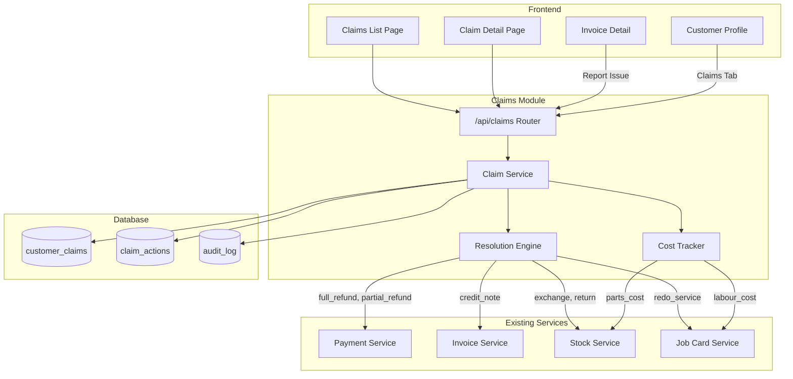
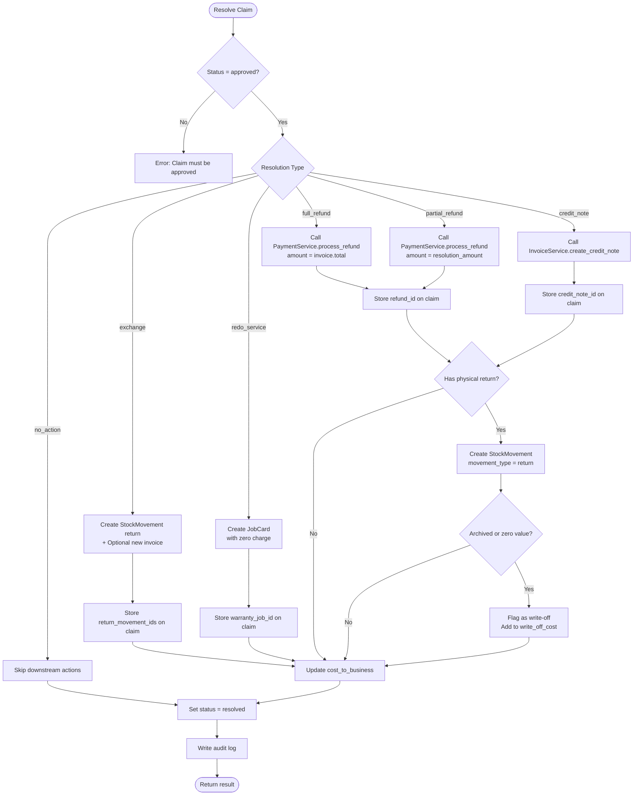

# Design Document: Customer Claims & Returns

## Overview

The Customer Claims & Returns module provides a centralised system for tracking customer complaints, warranty issues, faulty products/services, and managing the resolution process. This module integrates with existing services (Payments, Invoices, Stock, Job Cards) to orchestrate downstream actions based on resolution decisions.

### Key Capabilities

- Claim lifecycle management with defined status workflow
- Resolution engine that triggers appropriate downstream actions (refunds, credit notes, stock returns, warranty jobs)
- Business cost tracking for claims including labour, parts, and write-offs
- Integration with existing invoice, payment, stock, and job card services
- Branch-scoped claims with org-admin cross-branch visibility
- Comprehensive audit trail for compliance

## Architecture



### Component Responsibilities

| Component | Responsibility |
|-----------|----------------|
| Claim Service | Claim CRUD, status workflow enforcement, validation |
| Resolution Engine | Orchestrates downstream actions based on resolution type |
| Cost Tracker | Calculates and updates cost_to_business for claims |
| Claim Router | REST API endpoints with auth/branch context |

## Components and Interfaces

### Claim Service Interface

```python
class ClaimService:
    async def create_claim(
        db: AsyncSession,
        *,
        org_id: UUID,
        user_id: UUID,
        customer_id: UUID,
        claim_type: ClaimType,
        description: str,
        invoice_id: UUID | None = None,
        job_card_id: UUID | None = None,
        line_item_ids: list[UUID] | None = None,
        branch_id: UUID | None = None,
        ip_address: str | None = None,
    ) -> dict:
        """Create a new claim in 'open' status."""

    async def update_claim_status(
        db: AsyncSession,
        *,
        org_id: UUID,
        user_id: UUID,
        claim_id: UUID,
        new_status: ClaimStatus,
        notes: str | None = None,
        ip_address: str | None = None,
    ) -> dict:
        """Transition claim to new status with workflow validation."""

    async def resolve_claim(
        db: AsyncSession,
        *,
        org_id: UUID,
        user_id: UUID,
        claim_id: UUID,
        resolution_type: ResolutionType,
        resolution_amount: Decimal | None = None,
        resolution_notes: str | None = None,
        return_stock_item_ids: list[UUID] | None = None,
        ip_address: str | None = None,
    ) -> dict:
        """Apply resolution and trigger downstream actions."""

    async def get_claim(
        db: AsyncSession,
        *,
        org_id: UUID,
        claim_id: UUID,
    ) -> dict:
        """Get claim details with timeline and related entities."""

    async def list_claims(
        db: AsyncSession,
        *,
        org_id: UUID,
        status: str | None = None,
        claim_type: str | None = None,
        customer_id: UUID | None = None,
        branch_id: UUID | None = None,
        date_from: date | None = None,
        date_to: date | None = None,
        search: str | None = None,
        limit: int = 25,
        offset: int = 0,
    ) -> dict:
        """List claims with filtering and pagination."""

    async def get_customer_claims_summary(
        db: AsyncSession,
        *,
        org_id: UUID,
        customer_id: UUID,
    ) -> dict:
        """Get claims summary for customer profile."""
```

### Resolution Engine Interface

```python
class ResolutionEngine:
    async def execute_resolution(
        db: AsyncSession,
        *,
        claim: CustomerClaim,
        resolution_type: ResolutionType,
        resolution_amount: Decimal | None = None,
        return_stock_item_ids: list[UUID] | None = None,
        user_id: UUID,
        ip_address: str | None = None,
    ) -> ResolutionResult:
        """Execute resolution actions and return created entity references."""

    async def _process_full_refund(self, claim, user_id, ip_address) -> dict
    async def _process_partial_refund(self, claim, amount, user_id, ip_address) -> dict
    async def _process_credit_note(self, claim, amount, user_id, ip_address) -> dict
    async def _process_exchange(self, claim, return_items, user_id, ip_address) -> dict
    async def _process_redo_service(self, claim, user_id, ip_address) -> dict
```

### Cost Tracker Interface

```python
class CostTracker:
    async def calculate_claim_cost(
        db: AsyncSession,
        *,
        claim_id: UUID,
    ) -> CostBreakdown:
        """Calculate total cost breakdown for a claim."""

    async def update_claim_cost(
        db: AsyncSession,
        *,
        claim_id: UUID,
        labour_cost: Decimal | None = None,
        parts_cost: Decimal | None = None,
        write_off_cost: Decimal | None = None,
    ) -> None:
        """Update claim cost after action completion."""
```

### API Endpoints

| Method | Endpoint | Description |
|--------|----------|-------------|
| POST | `/api/claims` | Create new claim |
| GET | `/api/claims` | List claims with filters |
| GET | `/api/claims/{id}` | Get claim details |
| PATCH | `/api/claims/{id}/status` | Update claim status |
| POST | `/api/claims/{id}/resolve` | Apply resolution |
| POST | `/api/claims/{id}/notes` | Add internal note |
| GET | `/api/claims/reports/by-period` | Claims by period report |
| GET | `/api/claims/reports/cost-overhead` | Cost overhead report |
| GET | `/api/claims/reports/supplier-quality` | Supplier quality report |
| GET | `/api/claims/reports/service-quality` | Service quality report |
| GET | `/api/customers/{id}/claims` | Customer claims with summary |

## Data Models

### CustomerClaim Table

```sql
CREATE TABLE customer_claims (
    id UUID PRIMARY KEY DEFAULT gen_random_uuid(),
    org_id UUID NOT NULL REFERENCES organisations(id),
    branch_id UUID REFERENCES branches(id),
    customer_id UUID NOT NULL REFERENCES customers(id),
    
    -- Source references (at least one required)
    invoice_id UUID REFERENCES invoices(id),
    job_card_id UUID REFERENCES job_cards(id),
    line_item_ids JSONB DEFAULT '[]',
    
    -- Claim details
    claim_type VARCHAR(20) NOT NULL,  -- warranty, defect, service_redo, exchange, refund_request
    status VARCHAR(20) NOT NULL DEFAULT 'open',  -- open, investigating, approved, rejected, resolved
    description TEXT NOT NULL,
    
    -- Resolution details
    resolution_type VARCHAR(20),  -- full_refund, partial_refund, credit_note, exchange, redo_service, no_action
    resolution_amount NUMERIC(12,2),
    resolution_notes TEXT,
    resolved_at TIMESTAMPTZ,
    resolved_by UUID REFERENCES users(id),
    
    -- Downstream entity references
    refund_id UUID REFERENCES payments(id),
    credit_note_id UUID REFERENCES credit_notes(id),
    return_movement_ids JSONB DEFAULT '[]',
    warranty_job_id UUID REFERENCES job_cards(id),
    
    -- Cost tracking
    cost_to_business NUMERIC(12,2) DEFAULT 0,
    cost_breakdown JSONB DEFAULT '{"labour_cost": 0, "parts_cost": 0, "write_off_cost": 0}',
    
    -- Audit
    created_by UUID NOT NULL REFERENCES users(id),
    created_at TIMESTAMPTZ NOT NULL DEFAULT now(),
    updated_at TIMESTAMPTZ NOT NULL DEFAULT now(),
    
    CONSTRAINT ck_claim_type CHECK (claim_type IN ('warranty', 'defect', 'service_redo', 'exchange', 'refund_request')),
    CONSTRAINT ck_claim_status CHECK (status IN ('open', 'investigating', 'approved', 'rejected', 'resolved')),
    CONSTRAINT ck_resolution_type CHECK (resolution_type IS NULL OR resolution_type IN ('full_refund', 'partial_refund', 'credit_note', 'exchange', 'redo_service', 'no_action')),
    CONSTRAINT ck_source_reference CHECK (invoice_id IS NOT NULL OR job_card_id IS NOT NULL)
);

CREATE INDEX idx_claims_org ON customer_claims(org_id);
CREATE INDEX idx_claims_customer ON customer_claims(customer_id);
CREATE INDEX idx_claims_status ON customer_claims(org_id, status);
CREATE INDEX idx_claims_branch ON customer_claims(branch_id) WHERE branch_id IS NOT NULL;
CREATE INDEX idx_claims_created ON customer_claims(org_id, created_at DESC);
```

### ClaimAction Table (Timeline)

```sql
CREATE TABLE claim_actions (
    id UUID PRIMARY KEY DEFAULT gen_random_uuid(),
    org_id UUID NOT NULL REFERENCES organisations(id),
    claim_id UUID NOT NULL REFERENCES customer_claims(id) ON DELETE CASCADE,
    
    action_type VARCHAR(50) NOT NULL,  -- status_change, note_added, resolution_applied, cost_updated
    from_status VARCHAR(20),
    to_status VARCHAR(20),
    action_data JSONB DEFAULT '{}',
    notes TEXT,
    
    performed_by UUID NOT NULL REFERENCES users(id),
    performed_at TIMESTAMPTZ NOT NULL DEFAULT now(),
    
    CONSTRAINT ck_action_type CHECK (action_type IN ('status_change', 'note_added', 'resolution_applied', 'cost_updated'))
);

CREATE INDEX idx_claim_actions_claim ON claim_actions(claim_id);
CREATE INDEX idx_claim_actions_performed ON claim_actions(claim_id, performed_at);
```

### SQLAlchemy Models

```python
class CustomerClaim(Base):
    """Organisation-scoped customer claim record."""
    __tablename__ = "customer_claims"

    id: Mapped[uuid.UUID] = mapped_column(UUID(as_uuid=True), primary_key=True, default=uuid.uuid4)
    org_id: Mapped[uuid.UUID] = mapped_column(UUID(as_uuid=True), ForeignKey("organisations.id"), nullable=False)
    branch_id: Mapped[uuid.UUID | None] = mapped_column(UUID(as_uuid=True), ForeignKey("branches.id"), nullable=True)
    customer_id: Mapped[uuid.UUID] = mapped_column(UUID(as_uuid=True), ForeignKey("customers.id"), nullable=False)
    
    invoice_id: Mapped[uuid.UUID | None] = mapped_column(UUID(as_uuid=True), ForeignKey("invoices.id"), nullable=True)
    job_card_id: Mapped[uuid.UUID | None] = mapped_column(UUID(as_uuid=True), ForeignKey("job_cards.id"), nullable=True)
    line_item_ids: Mapped[list] = mapped_column(JSONB, nullable=False, server_default="[]")
    
    claim_type: Mapped[str] = mapped_column(String(20), nullable=False)
    status: Mapped[str] = mapped_column(String(20), nullable=False, server_default="open")
    description: Mapped[str] = mapped_column(Text, nullable=False)
    
    resolution_type: Mapped[str | None] = mapped_column(String(20), nullable=True)
    resolution_amount: Mapped[Decimal | None] = mapped_column(Numeric(12, 2), nullable=True)
    resolution_notes: Mapped[str | None] = mapped_column(Text, nullable=True)
    resolved_at: Mapped[datetime | None] = mapped_column(DateTime(timezone=True), nullable=True)
    resolved_by: Mapped[uuid.UUID | None] = mapped_column(UUID(as_uuid=True), ForeignKey("users.id"), nullable=True)
    
    refund_id: Mapped[uuid.UUID | None] = mapped_column(UUID(as_uuid=True), ForeignKey("payments.id"), nullable=True)
    credit_note_id: Mapped[uuid.UUID | None] = mapped_column(UUID(as_uuid=True), ForeignKey("credit_notes.id"), nullable=True)
    return_movement_ids: Mapped[list] = mapped_column(JSONB, nullable=False, server_default="[]")
    warranty_job_id: Mapped[uuid.UUID | None] = mapped_column(UUID(as_uuid=True), nullable=True)
    
    cost_to_business: Mapped[Decimal] = mapped_column(Numeric(12, 2), nullable=False, server_default="0")
    cost_breakdown: Mapped[dict] = mapped_column(JSONB, nullable=False, server_default='{"labour_cost": 0, "parts_cost": 0, "write_off_cost": 0}')
    
    created_by: Mapped[uuid.UUID] = mapped_column(UUID(as_uuid=True), ForeignKey("users.id"), nullable=False)
    created_at: Mapped[datetime] = mapped_column(DateTime(timezone=True), nullable=False, server_default=func.now())
    updated_at: Mapped[datetime] = mapped_column(DateTime(timezone=True), nullable=False, server_default=func.now(), onupdate=func.now())

    # Relationships
    organisation = relationship("Organisation", backref="claims")
    branch = relationship("Branch")
    customer = relationship("Customer", backref="claims")
    invoice = relationship("Invoice", backref="claims")
    job_card = relationship("JobCard", foreign_keys=[job_card_id])
    warranty_job = relationship("JobCard", foreign_keys=[warranty_job_id])
    refund = relationship("Payment")
    credit_note = relationship("CreditNote")
    actions: Mapped[list["ClaimAction"]] = relationship(back_populates="claim", cascade="all, delete-orphan")
```

```python
class ClaimAction(Base):
    """Claim timeline action record."""
    __tablename__ = "claim_actions"

    id: Mapped[uuid.UUID] = mapped_column(UUID(as_uuid=True), primary_key=True, default=uuid.uuid4)
    org_id: Mapped[uuid.UUID] = mapped_column(UUID(as_uuid=True), ForeignKey("organisations.id"), nullable=False)
    claim_id: Mapped[uuid.UUID] = mapped_column(UUID(as_uuid=True), ForeignKey("customer_claims.id", ondelete="CASCADE"), nullable=False)
    
    action_type: Mapped[str] = mapped_column(String(50), nullable=False)
    from_status: Mapped[str | None] = mapped_column(String(20), nullable=True)
    to_status: Mapped[str | None] = mapped_column(String(20), nullable=True)
    action_data: Mapped[dict] = mapped_column(JSONB, nullable=False, server_default="{}")
    notes: Mapped[str | None] = mapped_column(Text, nullable=True)
    
    performed_by: Mapped[uuid.UUID] = mapped_column(UUID(as_uuid=True), ForeignKey("users.id"), nullable=False)
    performed_at: Mapped[datetime] = mapped_column(DateTime(timezone=True), nullable=False, server_default=func.now())

    # Relationships
    claim: Mapped[CustomerClaim] = relationship(back_populates="actions")
    performed_by_user = relationship("User")
```

### Enums and Types

```python
from enum import Enum

class ClaimType(str, Enum):
    WARRANTY = "warranty"
    DEFECT = "defect"
    SERVICE_REDO = "service_redo"
    EXCHANGE = "exchange"
    REFUND_REQUEST = "refund_request"

class ClaimStatus(str, Enum):
    OPEN = "open"
    INVESTIGATING = "investigating"
    APPROVED = "approved"
    REJECTED = "rejected"
    RESOLVED = "resolved"

class ResolutionType(str, Enum):
    FULL_REFUND = "full_refund"
    PARTIAL_REFUND = "partial_refund"
    CREDIT_NOTE = "credit_note"
    EXCHANGE = "exchange"
    REDO_SERVICE = "redo_service"
    NO_ACTION = "no_action"

# Valid status transitions
VALID_CLAIM_TRANSITIONS: dict[str, set[str]] = {
    "open": {"investigating"},
    "investigating": {"approved", "rejected"},
    "approved": {"resolved"},
    "rejected": {"resolved"},
    "resolved": set(),
}
```

## Resolution Engine Workflow



### Resolution Type Actions

| Resolution Type | Downstream Actions | Cost Impact |
|-----------------|-------------------|-------------|
| full_refund | PaymentService.process_refund(full amount) | None (customer refunded) |
| partial_refund | PaymentService.process_refund(specified amount) | None (customer refunded) |
| credit_note | InvoiceService.create_credit_note | None (credit issued) |
| exchange | StockMovement(return) + optional new Invoice | write_off_cost if archived |
| redo_service | JobCard(zero charge) | labour_cost + parts_cost |
| no_action | None | None |

## Cost Tracking Logic

### Cost Breakdown Structure

```python
@dataclass
class CostBreakdown:
    labour_cost: Decimal = Decimal("0")
    parts_cost: Decimal = Decimal("0")
    write_off_cost: Decimal = Decimal("0")
    
    @property
    def total(self) -> Decimal:
        return self.labour_cost + self.parts_cost + self.write_off_cost
```

### Cost Calculation Rules

1. **Labour Cost** (redo_service resolution):
   - Sum of (hours × hourly_rate) from warranty job card time entries
   - Updated when warranty job is completed

2. **Parts Cost** (redo_service resolution):
   - Sum of (quantity × cost_price) for parts used in warranty job
   - Updated when parts are added to warranty job

3. **Write-off Cost** (exchange/return with archived or zero-value items):
   - Sum of (quantity × cost_price) for returned items flagged as write-off
   - Applied immediately when stock return is processed

### Cost Update Triggers

```python
async def update_claim_cost_on_job_completion(
    db: AsyncSession,
    job_card_id: UUID,
) -> None:
    """Called when a warranty job card is completed."""
    # Find claim linked to this warranty job
    claim = await db.execute(
        select(CustomerClaim).where(CustomerClaim.warranty_job_id == job_card_id)
    )
    if claim is None:
        return
    
    # Calculate labour cost from time entries
    labour_cost = await calculate_job_labour_cost(db, job_card_id)
    
    # Calculate parts cost from job card items
    parts_cost = await calculate_job_parts_cost(db, job_card_id)
    
    # Update claim cost breakdown
    claim.cost_breakdown["labour_cost"] = float(labour_cost)
    claim.cost_breakdown["parts_cost"] = float(parts_cost)
    claim.cost_to_business = labour_cost + parts_cost + Decimal(str(claim.cost_breakdown.get("write_off_cost", 0)))
```

## Integration Points

### Payment Service Integration

```python
# For full_refund and partial_refund resolutions
from app.modules.payments.service import process_refund

async def _process_refund_resolution(
    db: AsyncSession,
    claim: CustomerClaim,
    amount: Decimal,
    user_id: UUID,
    ip_address: str | None,
) -> dict:
    """Process refund via existing Payment Service."""
    if claim.invoice_id is None:
        raise ValueError("Cannot process refund without linked invoice")
    
    result = await process_refund(
        db,
        org_id=claim.org_id,
        user_id=user_id,
        invoice_id=claim.invoice_id,
        amount=amount,
        method="cash",  # or "stripe" based on original payment
        notes=f"Refund for claim: {claim.description[:100]}",
        ip_address=ip_address,
    )
    return {"refund_id": result["refund"].id}
```

### Invoice Service Integration

```python
# For credit_note resolution
from app.modules.invoices.service import create_credit_note

async def _process_credit_note_resolution(
    db: AsyncSession,
    claim: CustomerClaim,
    amount: Decimal,
    user_id: UUID,
    ip_address: str | None,
) -> dict:
    """Create credit note via existing Invoice Service."""
    if claim.invoice_id is None:
        raise ValueError("Cannot create credit note without linked invoice")
    
    result = await create_credit_note(
        db,
        org_id=claim.org_id,
        user_id=user_id,
        invoice_id=claim.invoice_id,
        amount=amount,
        reason=f"Claim resolution: {claim.description[:200]}",
        items=[],  # Full invoice credit
        ip_address=ip_address,
    )
    return {"credit_note_id": result["credit_note"]["id"]}
```

### Stock Service Integration

```python
# For exchange and return handling
from app.modules.stock.service import StockService

async def _process_stock_return(
    db: AsyncSession,
    claim: CustomerClaim,
    stock_item_ids: list[UUID],
    user_id: UUID,
) -> list[dict]:
    """Create stock return movements."""
    stock_service = StockService(db)
    movements = []
    
    for stock_item_id in stock_item_ids:
        # Get stock item and check if archived or zero value
        stock_item = await get_stock_item(db, stock_item_id)
        is_write_off = stock_item.is_archived or stock_item.cost_price == 0
        
        movement = await stock_service.increment_stock(
            product=stock_item.product,
            quantity=Decimal("1"),
            movement_type="return",
            reference_type="claim",
            reference_id=claim.id,
            performed_by=user_id,
        )
        
        movements.append({
            "movement_id": movement.id,
            "is_write_off": is_write_off,
            "write_off_amount": stock_item.cost_price if is_write_off else Decimal("0"),
        })
    
    return movements
```

### Job Card Service Integration

```python
# For redo_service resolution
from app.modules.job_cards.service import create_job_card

async def _process_redo_service_resolution(
    db: AsyncSession,
    claim: CustomerClaim,
    user_id: UUID,
    ip_address: str | None,
) -> dict:
    """Create warranty job card with zero charge."""
    # Get original job card or invoice details
    vehicle_rego = None
    description = f"Warranty redo for claim: {claim.description[:200]}"
    
    if claim.job_card_id:
        original_job = await get_job_card(db, org_id=claim.org_id, job_card_id=claim.job_card_id)
        vehicle_rego = original_job.get("vehicle_rego")
        description = f"Warranty redo: {original_job.get('description', '')}"
    
    result = await create_job_card(
        db,
        org_id=claim.org_id,
        user_id=user_id,
        customer_id=claim.customer_id,
        vehicle_rego=vehicle_rego,
        description=description,
        notes=f"Linked to claim ID: {claim.id}",
        branch_id=claim.branch_id,
        line_items_data=[],  # Zero charge - items added during work
        ip_address=ip_address,
    )
    
    return {"warranty_job_id": result["id"]}
```

## Correctness Properties

*A property is a characteristic or behavior that should hold true across all valid executions of a system—essentially, a formal statement about what the system should do. Properties serve as the bridge between human-readable specifications and machine-verifiable correctness guarantees.*

### Property 1: Claim Creation Data Integrity

*For any* valid claim creation request with a customer_id and at least one source reference (invoice_id, job_card_id, or line_item_id), the created claim SHALL have status "open", a non-null created_by, and a non-null created_at timestamp.

**Validates: Requirements 1.1, 1.6, 1.7**

### Property 2: Source Reference Validation

*For any* claim creation request, if the referenced invoice_id or job_card_id does not exist in the same organisation, the service SHALL reject the request with a validation error.

**Validates: Requirements 1.3, 1.8**

### Property 3: Claim Type Validation

*For any* claim creation request, the claim_type SHALL be one of: warranty, defect, service_redo, exchange, refund_request. Any other value SHALL be rejected with a validation error.

**Validates: Requirements 1.5**

### Property 4: Status Workflow Validity

*For any* claim status transition, the transition SHALL only be allowed if it follows the valid workflow: open → investigating → approved/rejected → resolved. Invalid transitions SHALL be rejected with an error listing allowed transitions.

**Validates: Requirements 2.1, 2.2, 2.3, 2.6**

### Property 5: Approved to Resolved Transition Guard

*For any* claim in "approved" status, transition to "resolved" SHALL only be allowed after a resolution_type has been set and resolution actions have been executed.

**Validates: Requirements 2.4**

### Property 6: Resolution Action Dispatch

*For any* claim resolution, the Resolution Engine SHALL trigger the correct downstream action based on resolution_type:
- full_refund → PaymentService.process_refund with full invoice amount
- partial_refund → PaymentService.process_refund with specified amount
- credit_note → InvoiceService.create_credit_note
- exchange → StockMovement with movement_type "return"
- redo_service → JobCard with zero charge
- no_action → No downstream actions

**Validates: Requirements 3.2, 3.3, 3.4, 3.5, 3.6, 3.7**

### Property 7: Downstream Entity Reference Storage

*For any* resolved claim with downstream actions, the claim record SHALL store the correct reference IDs (refund_id, credit_note_id, return_movement_ids, warranty_job_id) for all created entities.

**Validates: Requirements 3.8**

### Property 8: Stock Return Movement Linking

*For any* claim involving a physical product return, the created StockMovement SHALL have movement_type "return", reference_type "claim", and reference_id equal to the claim ID.

**Validates: Requirements 4.1, 4.2**

### Property 9: Write-off Flagging

*For any* stock return where the catalogue entry is archived OR the item has zero resale value, the movement SHALL be flagged as a write-off and the item's cost_price SHALL be added to the claim's write_off_cost.

**Validates: Requirements 4.3, 4.4, 4.5, 4.6**

### Property 10: Cost Calculation Accuracy

*For any* claim, the cost_to_business SHALL equal the sum of labour_cost + parts_cost + write_off_cost from the cost_breakdown, and each component SHALL be calculated correctly based on linked actions.

**Validates: Requirements 5.1, 5.2, 5.3, 5.4, 5.5, 5.6**

### Property 11: Pagination Correctness

*For any* claim list request with limit and offset, the returned list SHALL contain at most `limit` items, and the total count SHALL reflect the total matching claims regardless of pagination.

**Validates: Requirements 6.1**

### Property 12: Filtering Correctness

*For any* claim list request with filters (status, claim_type, customer_id, date_range, branch_id), all returned claims SHALL match ALL specified filter criteria.

**Validates: Requirements 6.2, 6.3, 6.4, 6.5**

### Property 13: Customer Claims Summary Accuracy

*For any* customer, the claims summary SHALL return accurate counts (total_claims, open_claims) and total_cost_to_business that equals the sum of cost_to_business across all customer claims.

**Validates: Requirements 9.1, 9.2, 9.3**

### Property 14: Branch Inheritance

*For any* claim created without an explicit branch_id, if the linked invoice or job card has a branch_id, the claim SHALL inherit that branch_id.

**Validates: Requirements 11.4**

### Property 15: Audit Log Completeness

*For any* claim action (creation, status change, resolution), an audit log entry SHALL be written with the correct action type, before_value, after_value, user_id, and ip_address.

**Validates: Requirements 12.1, 12.2, 12.3, 12.4, 12.5**

### Property 16: Status Change Timeline Recording

*For any* claim status change, a ClaimAction record SHALL be created with action_type "status_change", the correct from_status and to_status, and the performing user's ID.

**Validates: Requirements 2.7, 7.2**

## Error Handling

### Validation Errors

| Error Condition | HTTP Status | Error Message |
|-----------------|-------------|---------------|
| Missing customer_id | 400 | "customer_id is required" |
| Missing source reference | 400 | "At least one of invoice_id, job_card_id, or line_item_id is required" |
| Invalid claim_type | 400 | "claim_type must be one of: warranty, defect, service_redo, exchange, refund_request" |
| Invoice not found | 404 | "Invoice not found in this organisation" |
| Job card not found | 404 | "Job card not found in this organisation" |
| Invalid status transition | 400 | "Cannot transition from '{current}' to '{target}'. Allowed: {allowed}" |
| Resolution without approval | 400 | "Claim must be approved before resolution" |
| Refund exceeds paid amount | 400 | "Refund amount exceeds invoice amount paid" |
| Credit note exceeds creditable | 400 | "Credit amount exceeds maximum creditable amount" |

### Integration Errors

| Error Condition | Handling |
|-----------------|----------|
| Payment service failure | Rollback claim resolution, return error |
| Credit note creation failure | Rollback claim resolution, return error |
| Stock movement failure | Rollback claim resolution, return error |
| Job card creation failure | Rollback claim resolution, return error |

## Testing Strategy

### Dual Testing Approach

This module requires both unit tests and property-based tests for comprehensive coverage:

- **Unit tests**: Specific examples, edge cases, integration mocks
- **Property tests**: Universal properties across all valid inputs

### Property-Based Testing Configuration

- **Library**: Hypothesis (Python)
- **Minimum iterations**: 100 per property test
- **Tag format**: `Feature: customer-claims-returns, Property {number}: {property_text}`

### Unit Test Coverage

| Area | Test Cases |
|------|------------|
| Claim Creation | Valid creation, missing fields, invalid references, branch inheritance |
| Status Workflow | All valid transitions, all invalid transitions, transition guards |
| Resolution Engine | Each resolution type, downstream action verification, error handling |
| Cost Tracking | Labour cost calculation, parts cost calculation, write-off calculation |
| Filtering | Each filter type, combined filters, search functionality |
| Reports | Period aggregation, cost overhead calculation, quality metrics |

### Property Test Coverage

| Property | Test Strategy |
|----------|---------------|
| Property 1 | Generate random valid claim data, verify status="open" and audit fields |
| Property 2 | Generate claims with mismatched org references, verify rejection |
| Property 3 | Generate random claim_type values, verify validation |
| Property 4 | Generate all status transition combinations, verify workflow |
| Property 5 | Generate approved claims without resolution, verify transition blocked |
| Property 6 | Generate resolutions of each type, verify correct downstream action |
| Property 7 | Generate resolved claims, verify reference IDs stored |
| Property 8 | Generate stock returns, verify movement linking |
| Property 9 | Generate returns with archived/zero-value items, verify write-off |
| Property 10 | Generate claims with various costs, verify calculation |
| Property 11 | Generate claim lists with pagination, verify correctness |
| Property 12 | Generate filter combinations, verify all results match |
| Property 13 | Generate customer claims, verify summary accuracy |
| Property 14 | Generate claims without branch_id, verify inheritance |
| Property 15 | Generate claim actions, verify audit log entries |
| Property 16 | Generate status changes, verify timeline records |

### Integration Test Scenarios

1. **Full Refund Flow**: Create claim → Investigate → Approve → Resolve with full_refund → Verify payment created
2. **Credit Note Flow**: Create claim → Approve → Resolve with credit_note → Verify credit note created
3. **Exchange Flow**: Create claim → Approve → Resolve with exchange → Verify stock return and optional new invoice
4. **Redo Service Flow**: Create claim → Approve → Resolve with redo_service → Complete warranty job → Verify cost updated
5. **Write-off Flow**: Create claim with archived item → Resolve with exchange → Verify write-off flagged and cost calculated

### Playwright E2E Test Strategy

**File:** `tests/e2e/frontend/claims.spec.ts`

**Setup:**
- Authenticate using demo account (demo@orainvoice.com / demo123) via the frontend login form
- Use Playwright's `storageState` to persist auth across tests

**Test Scenarios:**
| Test | Workflow | Verifications |
|------|----------|---------------|
| Login with demo account | Navigate to login → enter credentials → submit | Dashboard loads, user menu shows demo email |
| Create claim from list | Claims list → New Claim → fill form → submit | Claim appears in list with status "open" |
| Full approval + refund | Create → Investigate → Approve → Resolve (full_refund) | Each status change visible, refund linked |
| Rejection flow | Create → Investigate → Reject → Resolve (no_action) | Status badges update correctly |
| Credit note resolution | Create → Approve → Resolve (credit_note) | Credit note linked in claim detail |
| Redo service resolution | Create → Approve → Resolve (redo_service) | Warranty job card linked |
| Exchange resolution | Create → Approve → Resolve (exchange) | Stock return movements linked |
| Report Issue from invoice | Invoice detail → Report Issue button | Claim form pre-populated |
| Customer claims tab | Customer profile → Claims tab | Summary stats displayed |
| Add internal note | Claim detail → Add Note → submit | Note in timeline |

**Post-test:** Rebuild Docker containers and git push.

### Default Main Branch Design

**Problem:** When the branch system was introduced, existing organisations (including the demo org) didn't get a default "Main" branch. New branches created by users appear to be the only branch, with no "Main" to switch back to.

**Solution:**
1. Modify `app/modules/organisations/service.py` — after creating an organisation, auto-create a "Main" branch with `is_default=true`
2. Modify `scripts/seed_demo_org_admin.py` — add a step to ensure the demo org has a "Main" branch, creating one if missing
3. For existing orgs without a Main branch, the seed script assigns all branchless entities to the new Main branch

**Branch model addition:**
```python
# Add is_default column to branches table (migration)
is_default: Mapped[bool] = mapped_column(Boolean, nullable=False, server_default="false")
```
