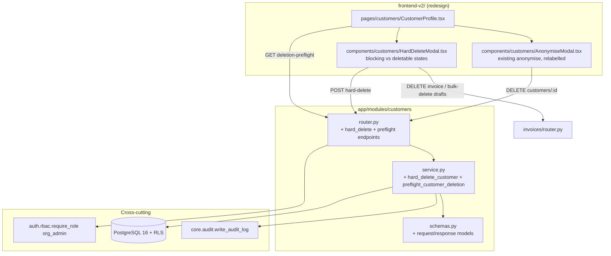

# Design Document — Customer Hard Delete

## Overview

Today, `DELETE /api/v1/customers/{id}` is wired to `anonymise_customer_endpoint` → `anonymise_customer()`. It performs an **in-place anonymise** (sets `is_anonymised=True`, overwrites the name to "Anonymised Customer", clears contact PII, scrubs `invoice_data_json`, and preserves the row, its `customer_vehicles` links, and all invoices/payments). The customer list filters `is_anonymised=True` out, so the row appears to "disappear". A production incident showed two problems: (1) the destructive action ran with no warning and no mandatory reason, and follow-up `PUT` edits then returned `400 "Cannot update an anonymised customer record"`; (2) vehicles were stranded on a ghost "Anonymised Customer" row because the links were preserved.

This feature introduces a **guarded hard delete** — a genuine removal of a `customers` row and its non-financial dependent rows — while keeping anonymise available as the distinct Privacy-Act erasure path. The hard delete blocks when legally-retained financial documents exist (issued invoices and their payment/credit-note chain), forces a mandatory reason, shows the NZ IRD seven-year retention warning, requires an irreversible-confirmation step (type-to-confirm + reason), orphans linked vehicles instead of destroying them, runs in a single transaction, and writes a full audit trail under a distinct action name.

This design resolves the requirements' Open Decisions D1–D6 with concrete choices (see "Resolved Open Decisions" below), each backed by the actual codebase, and traces every section back to requirement IDs (R1–R12, NFR1–4) and the 13 correctness properties.

### Scope note (PROD safety)

The **UI is implemented in the redesign `frontend-v2/`** — the production `frontend/` (v1.13.0) surface is **not touched** by this feature. The **backend** changes (`app/`) must still be PROD-safe because they deploy to Pi PROD, which holds real customer/invoice data; the design therefore prefers **app-level cascade-within-the-transaction** over destructive `ON DELETE` schema migrations. **No Alembic migration is required** (the optional `reminder_queue` `ON DELETE CASCADE` migration is out of scope for the first cut); every table is handled in application code inside the single delete transaction. Do **not** touch docker/nginx or the production `frontend/`.

### Mapping to requirements

| Design area | Requirements |
|---|---|
| New hard-delete + preflight endpoints; keep anonymise; two distinct actions | R1, R12, D1 |
| Block on issued invoices; exact blocking set; drafts/quotes non-blocking | R2, R7, D3 |
| NZ retention warning (seven years) | R3 |
| Mandatory reason | R4 |
| Irreversible confirmation (type-to-confirm + reason) | R5, D5 |
| Orphan vehicles, preserve vehicle rows | R6 |
| Preserve financial/transaction history | R7 |
| Full audit trail, distinct action name, no extra PII | R8, NFR4 |
| Transactional all-or-nothing; idempotent not-found | R9, NFR1, D6 |
| Role gate + multi-tenant RLS scoping | R10, NFR2 |
| Per-table referential-integrity policy | R11, D2 |
| Backend async SQLAlchemy + `flush()` patterns; wrapped responses | NFR2 |
| Frontend safe-API-consumption | NFR3, D4 |

## Resolved Open Decisions

### D1 — Endpoint contract (R1.5, R12)

**Decision:** Keep `DELETE /api/v1/customers/{id}` mapped to **anonymise** (unchanged meaning, unchanged response) so existing callers/UI/mobile keep working and the Privacy-Act erasure path is preserved (R12.1, NFR1.3). Add **two new endpoints**:

- `POST /api/v1/customers/{id}/hard-delete` — the guarded hard delete. Body carries `reason` + `confirmation`. `org_admin`-gated (R10.1).
- `GET /api/v1/customers/{id}/deletion-preflight` — returns the blocking issued-invoice list/count, the orphan-vehicle preview, and the deletable draft-invoice list, so the UI can render the warning/blocking screen *before* the user confirms.

The UI presents **Hard Delete** and **Anonymise** as two clearly distinct actions; the old silent "Delete → anonymise" affordance is replaced (R1.5, R12.2, R12.3). We do **not** repurpose the `DELETE` verb for hard delete because the production incident was caused precisely by an action silently changing meaning — reusing `DELETE` would invert the risk for any caller still expecting anonymise.

### D2 — Per-table referential-integrity policy (R11)

Every `customer_id`-referencing table found in the codebase is assigned exactly one policy: **block**, **require-prior-delete**, **set-null**, or **delete-with-customer**. See the "Referential Integrity Matrix" under Data Models. Financial/legal records are block or require-prior-delete (R11.4); non-financial links are set-null or delete-with-customer; no table is left with a dangling reference (R11.3) and no FK violation can occur (R11.1).

### D3 — Scope of "must delete first" (R2, R11)

The blocking set is **issued (non-draft) invoices + their payment/credit-note chain**. `payments` and `credit_notes` already cascade off `invoices` (`ON DELETE CASCADE` in the models), so they are only ever removed when the user explicitly deletes the parent invoice; the customer hard delete never deletes an invoice itself (R7.1). **Claims** (`customer_claims`) are a legal/financial record (insurance claims) → policy = **block** (treated like issued invoices: must be resolved/removed by the user first). This is justified under R11.4 ("never silently destroy a financial or legal record").

### D4 — Frontend target (NFR3)

**Decision:** Implement the guarded UI in the **redesign `frontend-v2/`** surface. The production `frontend/` (v1.13.0) is **explicitly out of scope and must not be modified** — even though the incident occurred there — per the directive to not touch prod. The v2 `CustomerProfile` already ports the anonymise/export flow (`frontend-v2/src/pages/customers/CustomerProfile.tsx`), so the guarded hard-delete UI lands naturally alongside it. All confirmation/warning UI follows `safe-api-consumption.md` (typed generics, `?.`/`?? []`/`?? 0`, `AbortController`). Do **not** touch docker/nginx or the production `frontend/`.

### D5 — Confirmation mechanism (R4, R5)

**Decision:** **type-to-confirm + mandatory reason**, both required to enable the destructive button. The user must type the customer's display name (case-insensitive, trimmed; falls back to the literal word `DELETE` if the customer has no resolvable name) **and** enter a non-empty reason. The backend independently re-validates both (R4.1, R5.2) — the UI gate is a convenience, not the security boundary.

### D6 — Idempotency (R9.4)

**Decision:** A hard delete of an already-deleted/nonexistent customer (within the org) returns a deterministic **404 not-found** with no state change and no success audit entry. Re-issuing the same request is safe and returns the same 404 (R9.3, R9.4).

## Architecture

### Component view



### Full delete flow (sequence)

```mermaid
sequenceDiagram
  actor U as Org_Admin
  participant UI as CustomerProfile + HardDeleteModal
  participant API as customers/router.py
  participant SVC as customers/service.py
  participant INV as invoices/router.py
  participant DB as Postgres (RLS, one txn)
  participant AUD as audit_log

  U->>UI: Click "Hard Delete"
  UI->>API: GET /customers/{id}/deletion-preflight
  API->>SVC: preflight_customer_deletion(org_id, customer_id)
  SVC->>DB: count issued invoices, draft invoices, linked vehicles
  SVC-->>API: {can_delete, blocking_invoices[], draft_invoices[], orphan_vehicles[], claims[]}
  API-->>UI: 200 preflight (wrapped)

  alt blocked (issued invoices or claims exist)
    UI->>U: Show blocking list + NZ 7-yr retention warning<br/>"delete these invoices first"
    U->>INV: Delete each draft / resolve issued (existing endpoints, reason required)
    UI->>API: GET deletion-preflight (re-check)
    API-->>UI: updated preflight
  end

  alt can_delete == true
    U->>UI: Type customer name + enter reason + confirm
    UI->>API: POST /customers/{id}/hard-delete {reason, confirmation}
    API->>SVC: hard_delete_customer(org_id, customer_id, user_id, reason, confirmation, ip)
    SVC->>DB: re-validate guards (issued invoices, claims, reason, confirmation)
    SVC->>DB: delete children (links, set-null, delete-with-customer) then customer row
    SVC->>AUD: write customer.hard_deleted (reason, ids, orphan vehicle ids)
    Note over SVC,DB: flush() only — get_db_session.begin() commits on success / rolls back on error
    SVC-->>API: {deleted, customer_id, vehicle_links_removed, draft_invoices_deleted, orphaned_vehicle_ids}
    API-->>UI: 200 (wrapped); UI navigates to /customers
  else still blocked / bad reason / bad confirmation
    SVC-->>API: ValueError (blocked) / not-found
    API-->>UI: 409 / 400 / 404 (no state change)
  end
```

### Transaction & commit model (NFR2.2, R9.1)

The service layer uses **async SQLAlchemy** and calls `flush()` only — never `commit()`. The `get_db_session` dependency wraps the request in `session.begin()`, which commits on a clean return and rolls back on any raised exception. So the whole hard delete (all child handling + the customer row delete + the audit insert) is one atomic unit: if any step raises, everything rolls back and **no success audit row is written** (R9.2, R9.3). This matches the project pattern and avoids the ISSUE-044 "closed transaction" class of bug (do not manually commit inside the `begin()` context).

### Security & multi-tenancy (R10, NFR2.3)

- **Role gate:** `POST .../hard-delete` uses `dependencies=[require_role("org_admin")]`, mirroring the existing anonymise endpoint exactly (R10.1). Preflight is read-only and allowed for `org_admin` only as well (it reveals invoice numbers; keep it admin-scoped to avoid surfacing more than the existing profile already shows — `org_admin` is the only role that can act on it anyway).
- **Org scoping / RLS:** Every query and delete filters on `org_id == current org` and runs under Postgres RLS (`app.current_org_id` set by `get_db_session`). A target in another org resolves to not-found (R10.2, R10.3). No cross-org row is ever touched (Property 11).

## Components and Interfaces

### Backend — service functions

```python
# app/modules/customers/service.py

# Statuses that make an invoice a legally-retained Financial_Document (R2, glossary).
ISSUED_INVOICE_STATUSES = (
    "issued", "partially_paid", "paid", "overdue",
    "voided", "refunded", "partially_refunded",
)
# i.e. everything that is NOT 'draft'.

NZ_RETENTION_WARNING = (
    "New Zealand tax law (IRD) requires tax invoices and business records to be "
    "kept for approximately 7 years. Deleting issued invoices or a customer with "
    "issued invoices may breach your record-keeping obligations. This action cannot "
    "be undone."
)


async def preflight_customer_deletion(
    db: AsyncSession,
    *,
    org_id: uuid.UUID,
    customer_id: uuid.UUID,
) -> dict:
    """Read-only assessment for the hard-delete confirmation screen.

    Returns whether the customer can be hard-deleted now, the blocking
    documents that must be removed/resolved first, the deletable draft
    invoices, and the vehicles that would be orphaned.

    Blocking sources (any present ⇒ can_delete = False):
      - issued (non-draft) invoices            → blocking_invoices (R2.1)
      - open customer_claims                   → blocking_claims (D3, matrix Row 9)
      - job_cards referencing the customer     → blocking_job_cards (matrix Row 8)
      - fleet_checklist_submissions for the
        customer's vehicles                    → blocking_fleet_checklists (matrix Row 20)
    can_delete = NOT (any blocking source present).

    Raises ValueError("Customer not found") if the customer does not exist
    within the org (R9.4 / R10.2).

    Requirements: 2.2, 2.3, 3.1, 6.x (preview), 11.x, 12.x
    """


async def hard_delete_customer(
    db: AsyncSession,
    *,
    org_id: uuid.UUID,
    customer_id: uuid.UUID,
    user_id: uuid.UUID,
    reason: str,
    confirmation: str,
    ip_address: str | None = None,
) -> dict:
    """Guarded hard delete of a customer within one transaction.

    Order of operations (all within the caller's session.begin()):
      1. Load customer (org-scoped). Not found -> ValueError (R9.4).
      2. Validate reason non-empty after strip (R4.1, R4.2) -> ValueError.
      3. Validate confirmation present/valid (R5.2) -> ValueError.
      4. Re-count Blocking_Documents: issued invoices (R2.1), open claims
         (matrix Row 9), job_cards (Row 8), and fleet checklist submissions
         for the customer's vehicles (Row 20). If any -> ValueError carrying
         the blocking payload (R2.2/2.3).
      5. Resolve each Referencing_Table per the matrix (children first):
         - delete customer_vehicles links for this customer (R6.1)
         - delete-with-customer: quotes(+quote_line_items), recurring_schedules,
           reminder_queue, loyalty_transactions (Row 19, NOT NULL so cannot null)
         - set-null: pos_transactions, bookings, projects, pricing_rules,
           expenses (Row 16), jobs/jobs_v2 (Row 17), assets (Row 18)
         - cascade (DB-level, no app action): portal_sessions, portal_accounts,
           portal_fleet_accounts (Rows 11–13)
      6. Delete the customers row (R1.1).
      7. write_audit_log(action="customer.hard_deleted", ...) (R8).
      8. flush() — no commit (NFR2.2).
    Returns the result dict (R1.2).

    Requirements: 1.1, 1.2, 1.3, 2.x, 4.x, 5.x, 6.x, 7.x, 8.x, 9.x, 10.x, 11.x
    """
```

`hard_delete_customer` signature exactly matches the requested shape: `hard_delete_customer(db, *, org_id, customer_id, user_id, reason, confirmation, ip_address)`.

### Backend — router endpoints

Both new endpoints are added to `app/modules/customers/router.py`. **Route ordering matters** (FastAPI matches in declaration order, and `/{customer_id}` is a catch-all): the two new static-suffix routes (`/{customer_id}/deletion-preflight`, `/{customer_id}/hard-delete`) must be declared **before** the bare `/{customer_id}` GET/PUT/DELETE handlers, exactly like the existing `/{customer_id}/export`, `/{customer_id}/merge`, `/{customer_id}/notify` routes already are. They will be co-located with those.

```python
@router.get(
    "/{customer_id}/deletion-preflight",
    response_model=CustomerDeletionPreflightResponse,
    responses={400: {...}, 401: {...}, 403: {...}, 404: {...}},
    summary="Preflight checks for hard-deleting a customer",
    dependencies=[require_role("org_admin")],
)
async def customer_deletion_preflight_endpoint(
    customer_id: str,
    request: Request,
    db: AsyncSession = Depends(get_db_session),
):
    org_uuid, _, _ = _extract_org_context(request)
    if not org_uuid:
        return JSONResponse(status_code=403, content={"detail": "Organisation context required"})
    try:
        cust_uuid = uuid.UUID(customer_id)
    except (ValueError, TypeError):
        return JSONResponse(status_code=400, content={"detail": "Invalid customer ID format"})
    try:
        data = await preflight_customer_deletion(db, org_id=org_uuid, customer_id=cust_uuid)
    except ValueError as exc:
        return JSONResponse(status_code=404, content={"detail": str(exc)})
    return CustomerDeletionPreflightResponse(**data)


@router.post(
    "/{customer_id}/hard-delete",
    response_model=CustomerHardDeleteResponse,
    responses={400: {...}, 401: {...}, 403: {...}, 404: {...}, 409: {...}},
    summary="Guarded hard delete of a customer (irreversible)",
    dependencies=[require_role("org_admin")],
)
async def hard_delete_customer_endpoint(
    customer_id: str,
    payload: CustomerHardDeleteRequest,
    request: Request,
    db: AsyncSession = Depends(get_db_session),
):
    org_uuid, user_uuid, ip_address = _extract_org_context(request)
    if not org_uuid:
        return JSONResponse(status_code=403, content={"detail": "Organisation context required"})
    try:
        cust_uuid = uuid.UUID(customer_id)
    except (ValueError, TypeError):
        return JSONResponse(status_code=400, content={"detail": "Invalid customer ID format"})
    try:
        result = await hard_delete_customer(
            db,
            org_id=org_uuid,
            customer_id=cust_uuid,
            user_id=user_uuid or uuid.uuid4(),
            reason=payload.reason,
            confirmation=payload.confirmation,
            ip_address=ip_address,
        )
    except CustomerDeletionBlockedError as exc:   # raised by service when blocking docs exist
        return JSONResponse(status_code=409, content={"detail": exc.message, "blocking": exc.payload})
    except ValueError as exc:
        msg = str(exc)
        status = 404 if "not found" in msg.lower() else 400
        return JSONResponse(status_code=status, content={"detail": msg})
    return CustomerHardDeleteResponse(**result)
```

`CustomerDeletionBlockedError` is a small module-level exception (subclass of `Exception`) carrying `message: str` and `payload: dict` so the router can return a structured 409 with the blocking list (R2.2, R2.3) distinct from the plain 400/404 cases.

### Frontend — component tree (D4, NFR3)

Per `spec-completeness-checklist.md`:

**Navigation & access.** No new route. The actions live on the existing redesign `CustomerProfile` page (`frontend-v2/src/pages/customers/CustomerProfile.tsx`, route `/customers/:id`). Today that page renders a single **"Process Deletion Request"** danger button (opening an anonymise confirm modal) inside the header action toolbar, shown only when `!customer.is_anonymised`. That single affordance is replaced by **two clearly labelled buttons**: **"Hard Delete Customer"** (`variant="danger"`) and **"Anonymise (Privacy Act)"** (`variant="ghost"`). Both are gated on `org_admin` via the existing `useAuth()` hook (`user?.role === 'org_admin'`, matching the pattern used elsewhere in v2, e.g. `Settings.tsx`) **and** `!customer.is_anonymised`. No sidebar/route changes.

**Components.** Both modals use the v2 design-system primitives already imported by `CustomerProfile` (`Modal`, `Button`, `Input`, `Badge`, `Spinner` from `@/components/ui`) and the shared axios instance `apiClient` from `@/api/client`. Note the v2 `Button` has no `secondary` variant — `secondary` maps to `ghost` (as documented in the page header).

1. `HardDeleteModal` (`frontend-v2/src/components/customers/HardDeleteModal.tsx` — colocated with the existing `CustomerEditModal`/`VehiclePickerModal` in `frontend-v2/src/components/customers/`)
   - Props: `customerId: string`, `customerName: string`, `open: boolean`, `onClose: () => void`, `onDeleted: () => void`.
   - On open: `GET /customers/{id}/deletion-preflight` (with `AbortController`).
   - **Blocking state** (`can_delete === false`): renders the NZ retention warning, the list of blocking issued invoices (number + status), any blocking claims, blocking job cards, and blocking fleet-checklist submissions, plus the deletable draft invoices with a "Delete draft" action wired to the existing invoice delete endpoint; a "Re-check" button re-runs preflight. The destructive button is disabled.
   - **Deletable state** (`can_delete === true`): renders the NZ retention warning, the orphan-vehicle preview ("N vehicle(s) will be unlinked but preserved"), the **reason** textarea (required), and the **type-to-confirm** input (must equal `customerName`, case-insensitive trimmed, or `DELETE`). The destructive button enables only when reason is non-empty AND confirmation matches. On click: `POST /customers/{id}/hard-delete { reason, confirmation }`; on success calls `onDeleted()` (navigate to `/customers`); on 409 re-shows blocking state; on 400/404 shows inline error.
2. `AnonymiseModal` — the existing anonymise confirm flow (currently inline in the v2 `CustomerProfile` as the `deleteOpen` modal titled "Process Deletion Request" with its `handleProcessDeletion` → `DELETE /customers/{id}`), relabelled "Anonymise (Privacy Act)" and pointed at the unchanged `DELETE /customers/{id}`. Behaviour preserved (R12.1). It may stay inline or be extracted to `frontend-v2/src/components/customers/AnonymiseModal.tsx`; extraction is preferred for symmetry but not required.

**Safe-API-consumption compliance (NFR3).** All reads use typed generics and guarded access:

```typescript
interface PreflightInvoice { id: string; invoice_number: string | null; status: string }
interface PreflightVehicle { id: string; rego: string | null; source: 'global' | 'org' }
interface PreflightClaim { id: string; claim_number: string | null; status: string }
interface PreflightJobCard { id: string; status: string }
interface PreflightFleetChecklist { id: string; vehicle_rego: string | null }
interface DeletionPreflight {
  can_delete: boolean
  blocking_invoices: PreflightInvoice[]
  blocking_claims: PreflightClaim[]
  blocking_job_cards: PreflightJobCard[]
  blocking_fleet_checklists: PreflightFleetChecklist[]
  draft_invoices: PreflightInvoice[]
  orphan_vehicles: PreflightVehicle[]
  nz_retention_warning: string
}

useEffect(() => {
  const controller = new AbortController()
  const run = async () => {
    try {
      const res = await apiClient.get<DeletionPreflight>(
        `/customers/${customerId}/deletion-preflight`, { signal: controller.signal },
      )
      setBlocking(res.data?.blocking_invoices ?? [])
      setBlockingClaims(res.data?.blocking_claims ?? [])
      setDrafts(res.data?.draft_invoices ?? [])
      setOrphans(res.data?.orphan_vehicles ?? [])
      setCanDelete(res.data?.can_delete ?? false)
      setWarning(res.data?.nz_retention_warning ?? DEFAULT_NZ_WARNING)
    } catch (err) {
      if (!controller.signal.aborted) setError('Failed to load deletion preflight.')
    }
  }
  if (open) run()
  return () => controller.abort()
}, [open, customerId])
```

No `as any`; every array uses `?? []`; counts use `(arr ?? []).length`; field names match the Pydantic schema exactly (NFR3.2).

## Data Models

### Existing schema (read-only context — no changes)

- `customers` (PK `id`, `org_id`, `is_anonymised`, …) — the row removed by hard delete.
- `invoices` (`customer_id` → `customers.id`, **NOT NULL**, no `ON DELETE`; `status` check-constrained to `draft|issued|partially_paid|paid|overdue|voided|refunded|partially_refunded`). `line_items`, `credit_notes`, `payments` all cascade off `invoices` (`ON DELETE CASCADE`). The customer hard delete never deletes an invoice (R7.1).
- `customer_vehicles` (`customer_id` → `customers.id`, **NOT NULL**; `global_vehicle_id` XOR `org_vehicle_id`). `org_vehicles` / `global_vehicles` rows are preserved (R6.2).

### Referential Integrity Matrix (R11, D2)

Every table with a `customer_id` column (whether or not it declares a DB-level foreign key) — verified by an exhaustive `customer_id: Mapped` scan of `app/**/models.py`, **not** just a `ForeignKey("customers.id")` grep. This matters: several tables carry a `customer_id` with **no declared FK** (`projects`, `pricing_rules`, `expenses`, `jobs` (jobs_v2), `assets`), so a hard delete would **not** raise a FK error against them — it would silently leave a **dangling reference**, violating R11.3. Those tables MUST be handled in app code even though the DB would not complain. "Naive delete FK-violates?" flags `NOT NULL` FK columns with no `ON DELETE` rule (these raise on naive delete); "no" with "no FK" means the dangling-reference risk is silent and must still be resolved in app code.

| # | Table | Column / FK | NOT NULL? | Existing ON DELETE | Naive delete FK-violates? | Policy | Mechanism |
|---|---|---|---|---|---|---|---|
| 1 | `customer_vehicles` | `customer_id` FK | yes | none | yes | **delete-with-customer** (remove links; preserve vehicles) | App: `DELETE FROM customer_vehicles WHERE customer_id=:id AND org_id=:org` (R6.1, R6.4) |
| 2 | `invoices` (`status='draft'`) | `customer_id` FK | yes | none | yes | **require-prior-delete** | User deletes drafts via existing invoice delete; surfaced in preflight `draft_invoices` |
| 3 | `invoices` (`status!='draft'`) | `customer_id` FK | yes | none | yes | **block** | Service rejects with blocking payload (R2.1) |
| 3a | `line_items`, `credit_notes`, `payments` | `invoice_id` FK | yes | **CASCADE** (off invoice) | n/a (no direct customer FK) | **inherited** — only removed when user deletes parent invoice | No customer-delete action (R7.1) |
| 4 | `quotes` | `customer_id` FK | yes | none | yes | **delete-with-customer** (quotes are not financial records, R2.6) | App: delete `quote_line_items` then `quotes` for this customer, inside txn |
| 5 | `recurring_schedules` | `customer_id` FK | yes | none | yes | **delete-with-customer** (a schedule for a deleted customer is dead config; generated invoices already block if issued) | App: `DELETE FROM recurring_schedules WHERE customer_id=:id` |
| 6 | `pos_transactions` | `customer_id` FK | **nullable** | none | no | **set-null** (a POS sale row is a financial txn but is not customer-FK-required; keep the sale, drop the link) | App: `UPDATE pos_transactions SET customer_id=NULL WHERE customer_id=:id` (R11.2 — sale preserved) |
| 7 | `reminder_queue` (service reminders/notifications) | `customer_id` FK | yes | none | yes | **delete-with-customer** (queued reminders for a gone customer are noise) | App: `DELETE FROM reminder_queue WHERE customer_id=:id` |
| 8 | `job_cards` | `customer_id` FK | yes | none | yes | **block** if any open job card; otherwise **delete-with-customer** is unsafe (work-order history) → treat as **block** when present, surfaced like claims | Service counts job_cards; if any exist, block (R11.4 conservative). See note. |
| 9 | `customer_claims` | `customer_id` FK | yes | none | yes | **block** (legal/financial record, D3, R11.4) | Service counts claims; if any → block payload |
| 10 | `bookings` (bookings_v2) | `customer_id` FK | **nullable**, indexed | none | no | **set-null** (keep the booking history; `customer_name` is denormalised on the row) | App: `UPDATE bookings SET customer_id=NULL WHERE customer_id=:id` |
| 11 | `portal_sessions` (customer portal) | `customer_id` FK | yes | **CASCADE** | no | **cascade** (already DB-level; ephemeral session rows) | DB handles automatically on customer delete |
| 12 | `portal_accounts` (fleet portal) | `customer_id` FK | yes | **CASCADE** | no | **cascade** (already DB-level) | DB handles automatically; downstream fleet rows cascade off `portal_accounts` |
| 13 | `portal_fleet_accounts` (fleet portal link) | `customer_id` FK | yes | **CASCADE** | no | **cascade** (already DB-level) | DB handles automatically |
| 14 | `pricing_rules` | `customer_id` (no FK, nullable) | nullable | n/a | no | **set-null** | App: `UPDATE pricing_rules SET customer_id=NULL WHERE customer_id=:id` |
| 15 | `projects` | `customer_id` (**no declared FK**, nullable) | nullable | n/a | no | **set-null** | App: `UPDATE projects SET customer_id=NULL WHERE customer_id=:id` (R11.3 — no dangling ref) |
| 16 | `expenses` | `customer_id` (**no declared FK**, nullable) | nullable | n/a | no (silent dangling ref) | **set-null** (expense stays as a financial record; only the customer link drops — R11.2) | App: `UPDATE expenses SET customer_id=NULL WHERE customer_id=:id AND org_id=:org` |
| 17 | `jobs` (jobs_v2) | `customer_id` (**no declared FK**, nullable) | nullable | n/a | no (silent dangling ref) | **set-null** (keep the job/work-order history; `jobs_v2` is distinct from `job_cards`) | App: `UPDATE jobs SET customer_id=NULL WHERE customer_id=:id AND org_id=:org` |
| 18 | `assets` | `customer_id` (**no declared FK**, nullable) | nullable | n/a | no (silent dangling ref) | **set-null** (asset survives, ownership link dropped — mirrors the vehicle-orphaning intent, R6) | App: `UPDATE assets SET customer_id=NULL WHERE customer_id=:id AND org_id=:org` |
| 19 | `loyalty_transactions` | `customer_id` (**no declared FK**, **NOT NULL**) | **yes** | n/a | no (silent dangling ref; set-null impossible) | **delete-with-customer** (a points-ledger row keyed to a gone customer is meaningless and the column is NOT NULL so it cannot be nulled) | App: `DELETE FROM loyalty_transactions WHERE customer_id=:id AND org_id=:org` *(flag for reviewer — confirm loyalty points are not a financial liability the org must retain; if they are, switch to **block**)* |
| 20 | `fleet_checklist_submissions` + `fleet_checklist_submission_items` | `customer_vehicle_id` FK → `customer_vehicles.id` | yes | **CASCADE** (off `customer_vehicles`) | n/a (no direct customer FK) | **block when present** (NZTA pre-trip inspection compliance record — see note) | Service counts submissions for the customer's vehicles; if any → block payload (do NOT let the `customer_vehicles` delete silently cascade them away) |

**Notes / justifications:**

- Rows 11–13 have `ON DELETE CASCADE` at the DB level, so once the customer row is deleted these disappear automatically with no FK violation. `portal_sessions` (Row 11) is genuinely ephemeral (session rows), and `portal_accounts` / `portal_fleet_accounts` (Rows 12–13) are portal login/link rows. **However**, the cascade chain off `portal_fleet_accounts` and (separately) off the Row 1 `customer_vehicles` delete reaches `fleet_checklist_submissions` / `fleet_checklist_submission_items` — these are **NZTA pre-trip inspection compliance records**, NOT ephemeral. Allowing them to cascade away silently would violate R11.4. Row 20 therefore promotes them to an explicit **block-when-present** check (the customer cannot be hard-deleted while fleet checklist submissions exist for their vehicles), rather than relying on the cascade. *(Deliberate choice; flag for reviewer — an org that doesn't use the fleet portal will simply have zero submissions and never hit this block.)*
- Row 8 (`job_cards`): a completed job card is workshop history. To honour R11.2 ("never silently destroy a legal/operational record") we take the **conservative block** stance — if any job card references the customer, the preflight reports it as a blocking item the user must resolve (close/reassign/delete) first, mirroring claims. This keeps the first cut safe; a future iteration may add an explicit job-card reassignment flow. *(This is a deliberate, documented choice; flag for reviewer.)*
- Row 6 (`pos_transactions`) and Row 10 (`bookings`) are **set-null** because their `customer_id` is already nullable and the row carries denormalised identity (`customer_name` on bookings), so dropping the link preserves the financial/operational record without a dangling reference (R11.3).
- Rows 14–18 (`pricing_rules`, `projects`, `expenses`, `jobs`, `assets`) have a `customer_id` with **no declared FK**. A naive delete does NOT raise — it silently strands the reference — so these are explicitly **set-null** in app code to satisfy R11.3. `expenses` stays as a financial record with only the link dropped (R11.2); `assets` mirrors the vehicle-orphaning intent (the asset survives, ownership link cleared, R6).
- Row 19 (`loyalty_transactions`) is the one **NOT NULL** column with no FK, so set-null is impossible; it is **delete-with-customer** inside the transaction. Flagged for reviewer to confirm loyalty points are not a financial liability requiring retention — if they are, the policy switches to **block**.
- Rows 4, 5, 7 are **delete-with-customer** because they are non-legal, customer-scoped operational data (quotes are explicitly non-blocking per R2.6; recurring schedules and queued reminders are dead once the customer is gone). They are deleted **inside the same transaction** before the customer row.

### Proposed Alembic migration (additive, idempotent) — `reminder_queue` only

`reminder_queue.customer_id` is `NOT NULL` with no `ON DELETE`. We handle it by **app-level delete inside the transaction** (Row 7) — **no migration required** for correctness. To make the system robust against any *other* code path that might delete a customer outside this service, we *optionally* add `ON DELETE CASCADE` to `reminder_queue.customer_id`. **Recommendation: skip the migration** for the first cut (prefer app-level deletion, per the PROD-safety scope note) and keep schema changes out of this feature. If a migration is later desired it must be additive and idempotent:

```python
# OPTIONAL — not required for this feature. Drop+recreate the FK with ON DELETE CASCADE.
def upgrade():
    op.execute("ALTER TABLE reminder_queue DROP CONSTRAINT IF EXISTS reminder_queue_customer_id_fkey")
    op.create_foreign_key(
        "reminder_queue_customer_id_fkey", "reminder_queue",
        "customers", ["customer_id"], ["id"], ondelete="CASCADE",
    )
```

The design's **chosen approach is app-level cascade-in-transaction** (no migration), keeping prod schema untouched (PROD-safety scope note, R9.1).

### New Pydantic schemas (`app/modules/customers/schemas.py`)

```python
class CustomerHardDeleteRequest(BaseModel):
    """POST /api/v1/customers/{id}/hard-delete request body. (R4, R5)"""
    reason: str = Field(..., min_length=1, max_length=2000,
                        description="Mandatory non-empty deletion reason (R4.1)")
    confirmation: str = Field(..., min_length=1, max_length=255,
                              description="Type-to-confirm value: customer name or 'DELETE' (R5)")


class DeletionBlockingInvoice(BaseModel):
    id: str
    invoice_number: Optional[str] = None
    status: str


class DeletionBlockingClaim(BaseModel):
    id: str
    claim_number: Optional[str] = None
    status: str


class DeletionBlockingJobCard(BaseModel):
    id: str
    status: str


class DeletionBlockingFleetChecklist(BaseModel):
    id: str
    vehicle_rego: Optional[str] = None


class DeletionOrphanVehicle(BaseModel):
    id: str
    rego: Optional[str] = None
    make: Optional[str] = None
    model: Optional[str] = None
    source: str = Field(..., description="'global' or 'org'")


class CustomerDeletionPreflightResponse(BaseModel):
    """GET /api/v1/customers/{id}/deletion-preflight response. (R2.2, R2.3, R3.1, R6)"""
    can_delete: bool = Field(..., description="True when no blocking docs remain")
    blocking_invoices: list[DeletionBlockingInvoice] = Field(default_factory=list)
    blocking_invoice_count: int = 0
    blocking_claims: list[DeletionBlockingClaim] = Field(default_factory=list)
    blocking_job_cards: list[DeletionBlockingJobCard] = Field(
        default_factory=list, description="Job cards that must be resolved first (matrix Row 8)")
    blocking_fleet_checklists: list[DeletionBlockingFleetChecklist] = Field(
        default_factory=list, description="NZTA fleet inspection submissions that block (matrix Row 20)")
    draft_invoices: list[DeletionBlockingInvoice] = Field(default_factory=list)
    orphan_vehicles: list[DeletionOrphanVehicle] = Field(default_factory=list)
    nz_retention_warning: str = Field(..., description="IRD ~7-year retention warning (R3)")


class CustomerHardDeleteResponse(BaseModel):
    """POST /api/v1/customers/{id}/hard-delete response. (R1.2, R8)"""
    message: str
    deleted: bool = True
    customer_id: str
    vehicle_links_removed: int = Field(0, description="Customer_Vehicle_Links removed (R1.2, R6.1)")
    draft_invoices_deleted: int = Field(0, description="Drafts the user deleted beforehand (R1.2)")
    orphaned_vehicle_ids: list[str] = Field(default_factory=list, description="Preserved, now-unlinked vehicles (R8.3)")
```

These follow the project's **wrapped-response** shape (NFR2.4) and field-name-align with the frontend types (NFR3.2).

### Audit log entry (R8, NFR4)

One `write_audit_log` call on success, with a **distinct action name** `customer.hard_deleted` (vs `customer.anonymised`) (R8.4):

```python
await write_audit_log(
    session=db,
    org_id=org_id,
    user_id=user_id,                       # actor (R8.1)
    action="customer.hard_deleted",        # distinct action (R8.4)
    entity_type="customer",
    entity_id=customer_id,                 # deleted customer id (R8.2)
    before_value={
        "had_email": customer.email is not None,    # booleans only — no PII (R8.5, NFR4.2)
        "had_phone": customer.phone is not None,
        "customer_type": customer.customer_type,
    },
    after_value={
        "reason": reason,                                  # R4.3 / R8.1
        "prerequisite_deleted_invoice_ids": draft_ids,     # R8.2
        "orphaned_vehicle_ids": orphaned_vehicle_ids,      # R8.3
        "vehicle_links_removed": len(orphaned_vehicle_ids),
    },
    ip_address=ip_address,
)
```

The audit row records actor, timestamp (`created_at` set by the helper), reason, deleted customer id, prerequisite-deleted invoice ids, and orphaned vehicle ids — and **excludes** customer name/email/phone values (only booleans/identifiers) (R8.5, NFR4.2). Because the write is inside the same transaction, a rollback removes it too (R9.3).

## Correctness Properties

*A property is a characteristic or behavior that should hold true across all valid executions of a system — essentially, a formal statement about what the system should do. Properties serve as the bridge between human-readable specifications and machine-verifiable correctness guarantees.*

These carry forward the 13 properties defined in the approved requirements, refined against the prework classification. Each is universally quantified and runs cheaply against an in-memory/transactional test database (testing OraInvoice's own logic, not external services). Property reflection (see below) removed facets that are subsumed by another property so each entry provides unique validation value.

### Property 1: Issued-invoice block invariant

*For any* customer that has at least one Issued_Invoice (status in `issued, partially_paid, paid, overdue, voided, refunded, partially_refunded`), a Hard_Delete is always rejected and the customer (and all related rows) still exists afterwards.

**Validates: Requirements 2.1, 7.3**

### Property 2: Blocking set is exact

*For any* mix of invoice statuses on a customer, the blocking set returned by preflight/hard-delete contains exactly the Issued_Invoices: the blocking count equals the number of Issued_Invoices and the returned ids equal exactly that set (no drafts, no missing issued).

**Validates: Requirements 2.2**

### Property 3: Mandatory-reason rejection

*For any* reason that is missing, empty, or composed solely of whitespace, the Hard_Delete is always rejected and leaves the customer and all related rows unchanged.

**Validates: Requirements 4.1, 4.2**

### Property 4: Reason round-trip

*For any* successful Hard_Delete performed with reason R, the persisted `customer.hard_deleted` Audit_Log entry's stored reason equals R.

**Validates: Requirements 4.3, 8.1**

### Property 5: Confirmation gate

*For any* request lacking a valid Irreversible_Confirmation, the Hard_Delete is always rejected and leaves the customer and all related rows unchanged.

**Validates: Requirements 5.2**

### Property 6: No dangling references after delete

*For any* deletable customer with an arbitrary related-row graph, after a successful Hard_Delete the count of `customer_vehicles` rows referencing the deleted customer is zero, and more generally no Referencing_Table row holds a dangling reference to the deleted customer id (links/quotes/recurring/reminders removed; pos/bookings/projects/pricing set to NULL; portal rows cascaded). Links belonging to *other* customers are untouched.

**Validates: Requirements 6.1, 6.4, 11.3**

### Property 7: Vehicles orphaned, not destroyed

*For any* set of vehicles linked to the customer before deletion, the set of linked `org_vehicles`/`global_vehicles` ids before the delete is a subset of the vehicle ids present after the delete (the underlying vehicle rows survive and remain findable).

**Validates: Requirements 6.2, 6.3**

### Property 8: No financial rows destroyed by the delete itself

*For any* related-row graph, the Hard_Delete operation removes zero `invoices`/`payments`/`credit_notes` rows directly; any removed invoice corresponds exactly to an explicit prior user deletion of a Draft_Invoice, never a side effect of the customer delete.

**Validates: Requirements 7.1, 7.2, 11.2**

### Property 9: Atomic rollback

*For any* randomized related-row graph, when a fault is injected mid-operation, the post-state of the database equals the pre-state exactly (all child changes, the customer row delete, and the audit insert are rolled back together; no success audit entry survives).

**Validates: Requirements 9.1, 9.2, 9.3**

### Property 10: Audit completeness without PII

*For any* successful Hard_Delete, the Audit_Log entry contains the acting user id, a timestamp, the reason, the deleted customer id, the prerequisite-deleted invoice ids, and the orphaned vehicle ids — and contains no customer PII values (name, email, phone) beyond the identifiers necessary to attribute the deletion.

**Validates: Requirements 8.1, 8.2, 8.3, 8.5**

### Property 11: Org isolation

*For any* customer belonging to a different organisation than the requesting user, a Hard_Delete returns a not-found result and leaves that customer (and its related rows) unchanged.

**Validates: Requirements 10.2, 10.3**

### Property 12: Drafts and quotes never block

*For any* customer whose only documents are Draft_Invoices and/or quotes (no Issued_Invoice, no blocking claim/job-card), the Hard_Delete is never blocked by Requirement 2 and proceeds when reason + confirmation are valid.

**Validates: Requirements 2.5, 2.6**

### Property 13: Idempotent not-found

*For any* customer id that does not exist (or has already been deleted) within the organisation, the Hard_Delete returns a deterministic not-found result with no state change and no error-state corruption; re-issuing the same request returns the same not-found result.

**Validates: Requirements 9.4**

### Property Reflection

- Acceptance criteria **1.1, 1.3, 5.3** (delete proceeds and the row is absent when guards are satisfied) are exercised as the positive case inside Properties 3, 5, 6, 7, 12 (every "delete proceeds" path asserts the row is gone), so no separate "delete succeeds" property is added — it would be redundant.
- **7.3** is the same invariant as **2.1** → merged into Property 1.
- **4.2** (whitespace = empty) is realised by Property 3's generator (which yields empty and all-whitespace strings) → merged.
- **6.3** (orphan still findable) follows from **6.2** (row preserved) → merged into Property 7, with one example test for the search path.
- **6.4** (other customers' links untouched) and **11.3** (no dangling reference in any table) generalise **6.1** → merged into Property 6.
- **8.5** (no PII in audit) is folded into Property 10 (audit completeness *without PII*) rather than a separate property, since both assert facts about the single audit entry.
- **9.3** (no success audit on failure) is folded into Property 9 (the rollback removes the audit row).
- **10.3** (RLS scoping) is folded into Property 11 (org isolation).
- **11.2** (no financial/legal record silently destroyed) is covered by Property 8 for financial rows and by the block edge-cases (claims, job_cards) for legal records.

Non-property criteria (examples / edge-cases / smoke) are listed in the Testing Strategy.

## Error Handling

All errors leave data unchanged (R9.2) because they are raised before/inside the single `session.begin()` transaction, which rolls back on any exception.

| Condition | Where detected | Result | HTTP | User-facing behaviour |
|---|---|---|---|---|
| Customer not found / already deleted / other org | service `hard_delete_customer` / `preflight_customer_deletion` | `ValueError("Customer not found")` | 404 | Modal shows "Customer not found"; idempotent (R9.4, R10.2, Property 13) |
| Issued invoice(s) or blocking claim/job-card present | service guard step | `CustomerDeletionBlockedError(message, payload)` | 409 | Blocking list + NZ warning + "delete these first" (R2.2, R2.3, Property 1/2) |
| Empty / whitespace-only reason | service guard step (after `reason.strip()`) | `ValueError("A deletion reason is required")` | 400 | Reason field error; button stays disabled client-side too (R4.1, Property 3) |
| Missing / invalid confirmation | service guard step | `ValueError("Confirmation does not match")` | 400 | Type-to-confirm field error (R5.2, Property 5) |
| Not org_admin | `require_role("org_admin")` dependency | 403 before handler runs | 403 | Action not offered in UI; API still enforces (R10.1) |
| No org context | `_extract_org_context` | 403 | 403 | — |
| Invalid UUID in path | router | 400 | 400 | — |
| Unexpected DB error mid-delete | `session.begin()` | full rollback, no audit row | 500 | Generic error; data intact (R9.2, R9.3, Property 9) |
| Frontend: malformed/empty preflight payload | `?.` + `?? []` / `?? 0` guards | safe empty render | — | No crash (NFR3, safe-api-consumption) |
| Frontend: preflight request aborted (navigation) | `AbortController` in `useEffect` | request cancelled silently | — | No state update on stale response (NFR3) |

The 409 blocking payload mirrors the preflight shape so the modal can re-render the blocking state directly from either an initial preflight or a rejected hard-delete attempt without a second round-trip.

## Testing Strategy

### Dual approach

- **Property-based tests (Hypothesis)** verify the 13 universal properties across generated customers, invoice-status mixes, vehicle-link sets, related-row graphs, reasons, and confirmations.
- **Example / edge-case / role-matrix unit tests** verify concrete behaviours that are not universal.

PBT **is appropriate** here: `hard_delete_customer` / `preflight_customer_deletion` are backend business logic with clear input/output behaviour and strong invariants (block, round-trip, idempotence, atomic rollback), and the input space (status mixes, link graphs, reason strings) is large. External services are not involved; tests run against a transactional test DB.

### Property-based test requirements

- Use **Hypothesis** (already in the project; see `tests/test_customer_anonymisation_property.py`). Do not hand-roll generators-as-loops.
- **Minimum 100 iterations** per property test (`@settings(max_examples=100, deadline=None, suppress_health_check=[HealthCheck.too_slow])`). The existing anonymisation test uses 20 for speed; these new tests must use ≥100 per the spec.
- Each property test is **tagged** with a comment referencing its design property, format:
  `# Feature: customer-hard-delete, Property {n}: {property_text}`
- Implement **each correctness property with a single property-based test** (13 tests, `test_hard_delete_property.py`), mirroring the existing customer property-test file's strategies (`nz_first_names`, invoice/payment builders) and extending with status-mix and link-graph strategies.

### Property → test mapping

| Property | Test (in `tests/test_hard_delete_property.py`) | Generators |
|---|---|---|
| 1 Issued-invoice block | `test_issued_invoice_blocks_delete` | customer + ≥1 issued invoice among random status mix |
| 2 Blocking set exact | `test_blocking_set_is_exact` | random status mix; assert returned ids == issued set |
| 3 Mandatory-reason rejection | `test_blank_reason_rejected` | `st.text` filtered to empty/whitespace-only |
| 4 Reason round-trip | `test_reason_round_trip` | arbitrary non-blank reason text |
| 5 Confirmation gate | `test_invalid_confirmation_rejected` | confirmation strings not matching name/`DELETE` |
| 6 No dangling references | `test_no_dangling_references` | random link set + two customers; assert links==0 and other customer intact |
| 7 Vehicles orphaned not destroyed | `test_vehicles_preserved` | random global/org vehicle links |
| 8 No financial rows destroyed | `test_delete_removes_no_financial_rows` | random drafts/quotes graph (no issued) |
| 9 Atomic rollback | `test_atomic_rollback_on_fault` | random graph + injected fault (patch audit write to raise) |
| 10 Audit completeness w/o PII | `test_audit_complete_no_pii` | random PII + reason + link set; assert ids/reason present, PII absent |
| 11 Org isolation | `test_org_isolation` | customer in org B; delete from org A context |
| 12 Drafts/quotes never block | `test_drafts_and_quotes_never_block` | random drafts + quotes, no issued |
| 13 Idempotent not-found | `test_idempotent_not_found` | random non-existent / already-deleted ids |

### Example / edge-case / integration tests (not property-based)

- **Distinct operations (R1.4):** anonymise keeps the row (`is_anonymised=True`); hard delete removes it. (example)
- **Endpoint contract (R1.5, R12.1–12.3, D1):** `DELETE /customers/{id}` still anonymises; `POST /customers/{id}/hard-delete` removes; both exposed as distinct actions. (example)
- **NZ retention warning (R3):** preflight `nz_retention_warning` contains "7 years"/"IRD"; modal shows it before delete. (example)
- **Blocking message (R2.3):** 409 payload contains the "delete these invoices first" instruction. (example)
- **Financial chain (R2.4):** issued invoice + payment + credit note; user deletes the invoice → chain cascades; customer delete removes zero financial rows. (edge-case)
- **Prerequisite invoice-delete reason (R4.4):** deleting a prerequisite draft requires + records a reason. (edge-case)
- **Role matrix (R10.1):** each non-`org_admin` role → 403, data unchanged. (example, enumerable)
- **Per-table referential-integrity mechanics (R11.1, R11.4):** 1–3 representative cases per Referencing_Table per the matrix — set-null leaves the row with `customer_id IS NULL` (pos_transactions, bookings, projects, pricing_rules, expenses, jobs/jobs_v2, assets); delete-with-customer removes the child (quotes, recurring_schedules, reminder_queue, loyalty_transactions); block prevents the delete (issued invoices, customer_claims, job_cards, fleet_checklist_submissions for the customer's vehicles); cascade handled by DB (portal_sessions, portal_accounts, portal_fleet_accounts). (edge-case)
- **Irreversible confirmation UI (R5.1):** modal renders the "cannot be undone" text. (example)

### Frontend tests

All frontend tests live in **`frontend-v2/`** (Vitest + RTL + fast-check), using the shared `frontend-v2/src/test/providers.tsx` harness (preview user is `org_admin`). Run only this feature's new spec(s) — not the full suite.

- **`HardDeleteModal` (fast-check + React Testing Library):** a property over arbitrary `(reasonText, confirmationText)` pairs asserting the destructive button is enabled **iff** `reason.trim().length > 0 && confirmationMatchesNameOrDELETE` — this is the one place a frontend property genuinely applies (a pure predicate over inputs). Tag: `// Feature: customer-hard-delete, Frontend gate property`.
- **Example tests:** blocking state renders the issued-invoice list + warning and disables the button; deletable state renders orphan preview; safe-API-consumption guards verified by feeding `{}` / `undefined` / missing-array responses and asserting no crash (empty render).

### Configuration & migrations

- **No Alembic migration** is required for this feature (app-level cascade-in-transaction). The optional `reminder_queue` `ON DELETE CASCADE` migration, if ever added, must be additive and idempotent (`DROP CONSTRAINT IF EXISTS` then recreate) and is out of scope for the first cut.

### Out of scope / follow-ups

- The production `frontend/` (v1.13.0) surface is **out of scope** and must not be modified — the guarded UI ships in `frontend-v2/` only.
- An explicit job-card reassignment flow so job_cards become require-prior-delete rather than block — future iteration.
