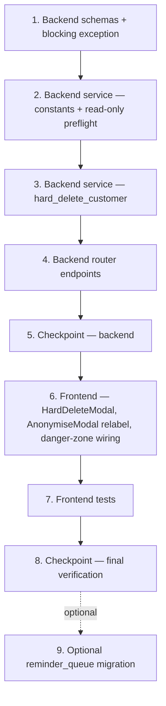

# Implementation Plan: Customer Hard Delete

## Overview

This plan converts the approved design into incremental coding steps for a guarded, transactional customer **hard delete** that sits alongside the existing anonymise path. Work flows backend-first (schemas → service → router → tests) so the frontend (redesign `frontend-v2/`, per D4) only ever consumes endpoints that already exist, then ends with the two danger-zone buttons wired into the v2 `CustomerProfile.tsx` and full verification. The production `frontend/` is **not touched**.

Language is fixed by the design: **Python 3.11 + async SQLAlchemy** (backend) and **React 18 + TypeScript** (frontend-v2) — no pseudocode, so no language choice is needed.

### Hard constraints baked into every task

- **NO Alembic migration is required.** The chosen approach is app-level cascade-within-the-single-transaction (PROD-safety scope note). The `reminder_queue ON DELETE CASCADE` migration is **OPTIONAL only** (marked `*`) and out of scope for the first cut.
- **`DELETE /api/v1/customers/{id}` stays mapped to anonymise** — unchanged meaning, unchanged response (D1, R12).
- **`org_admin`-only**; every query/delete is **org-scoped under RLS** (R10, NFR2.3).
- **Async SQLAlchemy + `flush()` only — never `commit()`.** `get_db_session` owns `session.begin()` (commit on clean return, rollback on raise). Avoids the ISSUE-024/044 "closed transaction" class (NFR2.2, R9).
- **Distinct audit action `customer.hard_deleted`** with reason + deleted customer id + prerequisite invoice ids + orphaned vehicle ids, and **NO PII values** (booleans/ids only) (R8, NFR4).
- **Never** delete `invoices` / `payments` / `credit_notes` as a side effect of the customer delete (R7.1).
- **Issued invoices, `customer_claims`, `job_cards`, and fleet checklist submissions BLOCK**; drafts are require-prior-delete; quotes/recurring_schedules/reminder_queue/loyalty_transactions delete-with-customer; pos_transactions/bookings/projects/pricing_rules/expenses/jobs(jobs_v2)/assets set-null; portal_* cascade at the DB level (Referential Integrity Matrix rows 1–20, R11).
- **This touches PROD code.** All multi-row work is transactional and safe.
- Frontend follows **`safe-api-consumption.md`** (typed generics, `?.` / `?? []` / `?? 0`, `AbortController`, no `as any`).

## Task Dependency Graph



```json
{
  "waves": [
    {
      "wave": 1,
      "tasks": ["1.1", "1.2"]
    },
    {
      "wave": 2,
      "tasks": ["2.1"]
    },
    {
      "wave": 3,
      "tasks": ["3.1", "3.5", "3.9"]
    },
    {
      "wave": 4,
      "tasks": ["4.1"]
    },
    {
      "wave": 5,
      "tasks": ["5"]
    },
    {
      "wave": 6,
      "tasks": ["6.1", "6.2", "6.3"]
    },
    {
      "wave": 7,
      "tasks": ["8"]
    }
  ]
}
```

**Dependency Rules:**
- Task 1 must complete before Task 2 (schemas needed by service)
- Task 2 must complete before Task 3 (preflight logic informs delete validation)
- Task 3 must complete before Task 4 (service functions consumed by router)
- Task 4 must complete before Task 5 (backend checkpoint validates API)
- Task 5 must complete before Task 6 (frontend consumes validated API)
- Task 6 must complete before Task 7 (tests validate UI components)
- Task 7 must complete before Task 8 (final verification)
- Task 9 is optional and independent (migration not required for first cut)

## Tasks

- [x] 1. Backend schemas + blocking exception (`app/modules/customers/schemas.py`)
  - [x] 1.1 Add request/response Pydantic models for hard delete and preflight
    - Add `CustomerHardDeleteRequest` (`reason: str` min_length 1 max_length 2000; `confirmation: str` min_length 1 max_length 255).
    - Add nested models `DeletionBlockingInvoice` (id, invoice_number?, status), `DeletionBlockingClaim` (id, claim_number?, status), `DeletionBlockingJobCard` (id, status), `DeletionBlockingFleetChecklist` (id, vehicle_rego?), `DeletionOrphanVehicle` (id, rego?, make?, model?, source).
    - Add `CustomerDeletionPreflightResponse` (`can_delete`, `blocking_invoices[]`, `blocking_invoice_count`, `blocking_claims[]`, `blocking_job_cards[]`, `blocking_fleet_checklists[]`, `draft_invoices[]`, `orphan_vehicles[]`, `nz_retention_warning`) using `default_factory=list` for arrays.
    - Add `CustomerHardDeleteResponse` (`message`, `deleted=True`, `customer_id`, `vehicle_links_removed`, `draft_invoices_deleted`, `orphaned_vehicle_ids[]`).
    - Field names MUST match the frontend types exactly (NFR3.2). Follow the project wrapped-response shape (NFR2.4).
    - _Design: New Pydantic schemas. Requirements: 1.2, 2.2, 2.3, 3.1, 4.1, 5.x, 6.1, 8.3_
  - [x] 1.2 Add the `CustomerDeletionBlockedError` exception
    - Module-level `Exception` subclass carrying `message: str` and `payload: dict` so the router can emit a structured 409 distinct from plain 400/404. Place it where both service and router can import it (service module per design import in router).
    - _Design: Backend — router endpoints (409 handling). Requirements: 2.2, 2.3_

- [x] 2. Backend service — constants + read-only preflight (`app/modules/customers/service.py`)
  - [x] 2.1 Add `ISSUED_INVOICE_STATUSES`, `NZ_RETENTION_WARNING`, and implement `preflight_customer_deletion(db, *, org_id, customer_id)`
    - `ISSUED_INVOICE_STATUSES = (issued, partially_paid, paid, overdue, voided, refunded, partially_refunded)` — everything that is NOT `draft`.
    - `NZ_RETENTION_WARNING` text stating the IRD ~7-year retention obligation and "cannot be undone".
    - Load customer org-scoped; raise `ValueError("Customer not found")` when absent (R9.4/R10.2).
    - Query, all org-scoped: issued invoices (→ `blocking_invoices` + `blocking_invoice_count`), draft invoices (→ `draft_invoices`), open `customer_claims` (→ `blocking_claims`), `job_cards` (→ `blocking_job_cards`), fleet checklist submissions for the customer's vehicles (→ `blocking_fleet_checklists`), and linked `customer_vehicles` resolved to vehicle rows (→ `orphan_vehicles`).
    - `can_delete = (no issued invoices) AND (no blocking claims) AND (no blocking job_cards) AND (no blocking fleet checklists)`.
    - Return a dict shaped exactly for `CustomerDeletionPreflightResponse`.
    - _Design: Backend service functions; Referential Integrity Matrix (Rows 8, 9, 20); Security & multi-tenancy. Requirements: 2.2, 2.3, 2.5, 2.6, 3.1, 6.1, 10.2, 10.3, 11.4_
  - [ ]* 2.2 Write property test for the issued-invoice block invariant
    - **Property 1: Issued-invoice block invariant** — `test_issued_invoice_blocks_delete` in `tests/test_hard_delete_property.py`; generator = customer + ≥1 issued invoice among a random status mix; assert delete rejected and customer still present.
    - Hypothesis `@settings(max_examples=100, deadline=None)`; tag `# Feature: customer-hard-delete, Property 1: Issued-invoice block invariant`.
    - **Validates: Requirements 2.1, 7.3**
  - [ ]* 2.3 Write property test for the exact blocking set
    - **Property 2: Blocking set is exact** — `test_blocking_set_is_exact`; random status mix; assert returned blocking ids == exactly the issued set and `blocking_invoice_count == len(issued)`.
    - ≥100 examples; tag `# Feature: customer-hard-delete, Property 2: Blocking set is exact`.
    - **Validates: Requirements 2.2**
  - [ ]* 2.4 Write property test that drafts and quotes never block
    - **Property 12: Drafts and quotes never block** — `test_drafts_and_quotes_never_block`; random drafts + quotes, no issued/claims/job_cards; assert `can_delete == true` and delete proceeds with valid reason + confirmation.
    - ≥100 examples; tag `# Feature: customer-hard-delete, Property 12: Drafts and quotes never block`.
    - **Validates: Requirements 2.5, 2.6**

- [x] 3. Backend service — `hard_delete_customer` (`app/modules/customers/service.py`)
  - [x] 3.1 Implement guard validation (load, reason, confirmation, blocking re-check)
    - Signature: `hard_delete_customer(db, *, org_id, customer_id, user_id, reason, confirmation, ip_address=None)`.
    - Order: (1) load customer org-scoped → `ValueError("Customer not found")` if absent (R9.4); (2) `reason.strip()` empty → `ValueError("A deletion reason is required")` (R4.1/4.2); (3) confirmation missing/invalid (must equal customer display name case-insensitive trimmed, or literal `DELETE`) → `ValueError("Confirmation does not match")` (R5.2); (4) re-count issued invoices + open claims + job_cards + fleet checklist submissions → raise `CustomerDeletionBlockedError(message, payload)` carrying the preflight-shaped blocking payload (R2.1–2.3, R11.4).
    - All checks run before any mutation so an early raise leaves data untouched (R9.2).
    - _Design: Backend service functions; Error Handling table. Requirements: 1.1, 2.1, 4.1, 4.2, 5.2, 9.2, 9.4_
  - [ ]* 3.2 Write property test for mandatory-reason rejection
    - **Property 3: Mandatory-reason rejection** — `test_blank_reason_rejected`; `st.text` filtered to empty/whitespace-only; assert rejected, no state change.
    - ≥100 examples; tag `# Feature: customer-hard-delete, Property 3: Mandatory-reason rejection`.
    - **Validates: Requirements 4.1, 4.2**
  - [ ]* 3.3 Write property test for the confirmation gate
    - **Property 5: Confirmation gate** — `test_invalid_confirmation_rejected`; confirmation strings not matching name/`DELETE`; assert rejected, no state change.
    - ≥100 examples; tag `# Feature: customer-hard-delete, Property 5: Confirmation gate`.
    - **Validates: Requirements 5.2**
  - [ ]* 3.4 Write property test for idempotent not-found
    - **Property 13: Idempotent not-found** — `test_idempotent_not_found`; random non-existent / already-deleted ids; assert deterministic not-found, no state change, re-issue returns same result.
    - ≥100 examples; tag `# Feature: customer-hard-delete, Property 13: Idempotent not-found`.
    - **Validates: Requirements 9.4**
  - [x] 3.5 Implement the in-transaction deletion order (Referential Integrity Matrix)
    - Children first, all org-scoped, inside the caller's `session.begin()`, using `flush()` (never `commit()`):
      - `customer_vehicles`: delete links for this customer (capture orphaned vehicle ids first) — preserve vehicle rows (R6.1, R6.2, R6.4).
      - delete-with-customer: `quotes` (+ `quote_line_items`), `recurring_schedules`, `reminder_queue`, and `loyalty_transactions` (Row 19 — `customer_id` is NOT NULL so it cannot be nulled; flag for reviewer per design note).
      - set-null (`customer_id = NULL`): `pos_transactions`, `bookings`, `projects`, `pricing_rules`, `expenses` (Row 16), `jobs`/jobs_v2 (Row 17 — distinct from the blocking `job_cards`), `assets` (Row 18). These tables carry `customer_id` with **no declared FK**, so a naive delete would NOT raise — it would silently leave a dangling reference; they MUST be resolved in app code (R11.3).
      - portal_* (`portal_sessions`, `portal_accounts`, `portal_fleet_accounts`): rely on existing DB `ON DELETE CASCADE` (Rows 11–13).
      - finally delete the `customers` row (R1.1).
    - Never touch `invoices`/`payments`/`credit_notes` (R7.1). Build the result dict (`vehicle_links_removed`, `draft_invoices_deleted`, `orphaned_vehicle_ids`) for `CustomerHardDeleteResponse`.
    - _Design: Referential Integrity Matrix (rows 1–20); Transaction & commit model. Requirements: 1.1, 1.2, 6.1, 6.2, 6.4, 7.1, 9.1, 11.1, 11.2, 11.3_
  - [ ]* 3.6 Write property test for no dangling references
    - **Property 6: No dangling references after delete** — `test_no_dangling_references`; random link set + two customers; assert zero `customer_vehicles` referencing the deleted customer, no dangling references in any Referencing_Table, and the *other* customer's links untouched.
    - ≥100 examples; tag `# Feature: customer-hard-delete, Property 6: No dangling references after delete`.
    - **Validates: Requirements 6.1, 6.4, 11.3**
  - [ ]* 3.7 Write property test that vehicles are orphaned, not destroyed
    - **Property 7: Vehicles orphaned, not destroyed** — `test_vehicles_preserved`; random global/org vehicle links; assert the pre-delete linked vehicle id set ⊆ vehicle ids present after delete.
    - ≥100 examples; tag `# Feature: customer-hard-delete, Property 7: Vehicles orphaned, not destroyed`.
    - **Validates: Requirements 6.2, 6.3**
  - [ ]* 3.8 Write property test that the delete destroys no financial rows
    - **Property 8: No financial rows destroyed by the delete itself** — `test_delete_removes_no_financial_rows`; random drafts/quotes graph (no issued); assert zero `invoices`/`payments`/`credit_notes` removed by the delete itself.
    - ≥100 examples; tag `# Feature: customer-hard-delete, Property 8: No financial rows destroyed by the delete itself`.
    - **Validates: Requirements 7.1, 7.2, 11.2**
  - [x] 3.9 Implement the success audit write (distinct action, no PII)
    - One `write_audit_log` with `action="customer.hard_deleted"`, `entity_id=customer_id`; `before_value` = booleans/type only (`had_email`, `had_phone`, `customer_type`); `after_value` = `reason`, `prerequisite_deleted_invoice_ids`, `orphaned_vehicle_ids`, `vehicle_links_removed`; pass `ip_address`.
    - Write happens inside the same transaction so a rollback also removes it (R9.3). No name/email/phone values (R8.5/NFR4.2).
    - _Design: Audit log entry. Requirements: 8.1, 8.2, 8.3, 8.4, 8.5_
  - [ ]* 3.10 Write property test for reason round-trip
    - **Property 4: Reason round-trip** — `test_reason_round_trip`; arbitrary non-blank reason R; assert the persisted `customer.hard_deleted` audit entry's stored reason == R.
    - ≥100 examples; tag `# Feature: customer-hard-delete, Property 4: Reason round-trip`.
    - **Validates: Requirements 4.3, 8.1**
  - [ ]* 3.11 Write property test for audit completeness without PII
    - **Property 10: Audit completeness without PII** — `test_audit_complete_no_pii`; random PII + reason + link set; assert actor id, timestamp, reason, deleted customer id, prerequisite invoice ids, orphaned vehicle ids all present AND no customer name/email/phone values present.
    - ≥100 examples; tag `# Feature: customer-hard-delete, Property 10: Audit completeness without PII`.
    - **Validates: Requirements 8.1, 8.2, 8.3, 8.5**
  - [ ]* 3.12 Write property test for atomic rollback
    - **Property 9: Atomic rollback** — `test_atomic_rollback_on_fault`; random related-row graph + injected fault (patch the audit write to raise); assert post-state == pre-state exactly and no success audit row survives.
    - ≥100 examples; tag `# Feature: customer-hard-delete, Property 9: Atomic rollback`.
    - **Validates: Requirements 9.1, 9.2, 9.3**
  - [ ]* 3.13 Write property test for org isolation
    - **Property 11: Org isolation** — `test_org_isolation`; customer in org B, delete attempted from org A context; assert not-found and org B customer + related rows unchanged.
    - ≥100 examples; tag `# Feature: customer-hard-delete, Property 11: Org isolation`.
    - **Validates: Requirements 10.2, 10.3**

- [x] 4. Backend router endpoints (`app/modules/customers/router.py`)
  - [x] 4.1 Add the preflight + hard-delete endpoints (declared BEFORE the bare `/{customer_id}` routes)
    - `GET /{customer_id}/deletion-preflight` → `CustomerDeletionPreflightResponse`; `POST /{customer_id}/hard-delete` (body `CustomerHardDeleteRequest`) → `CustomerHardDeleteResponse`.
    - Both `dependencies=[require_role("org_admin")]`. **Route ordering note (design):** declare both static-suffix routes co-located with `/{customer_id}/export|merge|notify`, BEFORE the bare `/{customer_id}` GET/PUT/DELETE, since FastAPI matches in declaration order.
    - Use `_extract_org_context`; 403 when no org context; 400 on invalid UUID.
    - Error mapping: `CustomerDeletionBlockedError` → 409 with `{detail, blocking}`; `ValueError` → 404 if "not found" else 400; idempotent 404 on not-found (R9.4).
    - Import the new schemas + exception; register the new service functions in the existing service import block. Leave `DELETE /{customer_id}` = anonymise unchanged (D1, R12).
    - _Design: Backend — router endpoints; Error Handling table. Requirements: 1.5, 2.2, 2.3, 4.1, 5.2, 9.4, 10.1, 12.1, 12.2, 12.3_
  - [ ]* 4.2 Write role-matrix + endpoint-contract integration tests
    - In `tests/test_hard_delete_integration.py`: each non-`org_admin` role → 403 with data unchanged (R10.1); `DELETE /customers/{id}` still anonymises (row kept, `is_anonymised=True`) while `POST /customers/{id}/hard-delete` removes the row — two distinct actions (R1.4, R1.5, R12.1–12.3); 409 blocking payload contains the "delete these invoices first" instruction (R2.3); preflight `nz_retention_warning` contains "7 years"/"IRD" (R3).
    - _Requirements: 1.4, 1.5, 2.3, 3.1, 3.2, 3.3, 10.1, 12.1, 12.2, 12.3_
  - [ ]* 4.3 Write per-table referential-integrity integration tests
    - 1–3 representative cases per Referencing_Table per the matrix: set-null leaves `customer_id IS NULL` (pos_transactions, bookings, projects, pricing_rules, expenses, jobs/jobs_v2, assets); delete-with-customer removes the child (quotes, recurring_schedules, reminder_queue, loyalty_transactions); block prevents the delete (issued invoices, customer_claims, job_cards, fleet_checklist_submissions for the customer's vehicles); cascade handled by DB (portal_sessions, portal_accounts, portal_fleet_accounts). Include the financial-chain edge case (R2.4) and the prerequisite-invoice-delete reason requirement (R4.4).
    - _Design: Referential Integrity Matrix (rows 1–20). Requirements: 2.4, 4.4, 11.1, 11.2, 11.4_

- [ ] 5. Checkpoint — backend
  - Run only this feature's new tests: `pytest tests/test_hard_delete_property.py tests/test_hard_delete_integration.py` (the 13 property tests + the integration tests). Do not run the full suite. Ensure these pass; ask the user if questions arise.

- [x] 6. Frontend — HardDeleteModal, AnonymiseModal relabel, danger-zone wiring (redesign `frontend-v2/`, per D4)
  - [x] 6.1 Build `HardDeleteModal.tsx` (`frontend-v2/src/components/customers/HardDeleteModal.tsx`, colocated with the existing `CustomerEditModal`/`VehiclePickerModal`)
    - Use the v2 design-system primitives (`Modal`, `Button`, `Input`, `Badge`, `Spinner` from `@/components/ui`) and the shared axios instance `apiClient` from `@/api/client`. The v2 `Button` has no `secondary` variant — use `variant="danger"` for the destructive button and `variant="ghost"` for cancel.
    - Props: `customerId`, `customerName`, `open`, `onClose`, `onDeleted`.
    - On open: `GET /customers/{id}/deletion-preflight` inside a `useEffect` with `AbortController`; typed generic `apiClient.get<DeletionPreflight>(...)`; guard every read with `?.` and `?? []` / `?? false` / default warning; no `as any` (NFR3, safe-api-consumption Patterns 5 & 7).
    - **Blocking state** (`can_delete === false`): render NZ retention warning, blocking issued-invoice list (number + status), blocking claims, blocking job cards, blocking fleet-checklist submissions, and deletable draft invoices with a "Delete draft" action (existing invoice delete endpoint) + a "Re-check" button re-running preflight; destructive button disabled.
    - **Deletable state** (`can_delete === true`): render NZ retention warning, orphan-vehicle preview ("N vehicle(s) will be unlinked but preserved"), required **reason** textarea, and **type-to-confirm** input (must equal `customerName` case-insensitive trimmed, or `DELETE`). Enable the destructive button **iff** reason non-empty AND confirmation matches.
    - On confirm: `POST /customers/{id}/hard-delete { reason, confirmation }`; success → `onDeleted()` (navigate to `/customers`); 409 → re-show blocking state from the returned payload; 400/404 → inline error.
    - _Design: Frontend component tree; safe-API-consumption compliance. Requirements: 1.5, 2.2, 2.3, 3.1, 4.1, 5.1, 5.2, 6.1, NFR3.1, NFR3.2_
  - [x] 6.2 Relabel the existing anonymise flow to "Anonymise (Privacy Act)"
    - In the v2 `CustomerProfile.tsx`, the inline `deleteOpen` modal (currently titled "Process Deletion Request", confirm button "Confirm Anonymisation", `handleProcessDeletion` → `DELETE /customers/{id}`) is relabelled to "Anonymise (Privacy Act)"; endpoint and behaviour preserved (R12.1). Extracting it to `frontend-v2/src/components/customers/AnonymiseModal.tsx` is preferred for symmetry but optional.
    - _Design: Frontend component tree (AnonymiseModal). Requirements: 12.1, 12.2_
  - [x] 6.3 Wire two distinct danger-zone buttons into the v2 `CustomerProfile.tsx`
    - Replace the single "Process Deletion Request" header button with **"Hard Delete Customer"** (`variant="danger"`, opens `HardDeleteModal`) and **"Anonymise (Privacy Act)"** (`variant="ghost"`, opens the relabelled anonymise modal); gate both on `org_admin` via `useAuth()` (`user?.role === 'org_admin'`, the pattern used in `Settings.tsx`) AND `!customer.is_anonymised`. On hard-delete success, `fetchProfile()`/navigate to `/customers`. No route/sidebar changes.
    - _Design: Navigation & access. Requirements: 1.5, 10.1, 12.2, 12.3_

- [ ] 7. Frontend tests (`frontend-v2/`, Vitest + RTL + fast-check)
  - [ ]* 7.1 Write the button-enable gate property test (fast-check)
    - Property over arbitrary `(reasonText, confirmationText)` pairs asserting the destructive button is enabled **iff** `reason.trim().length > 0 AND confirmation matches customerName (case-insensitive, trimmed) or "DELETE"`. Colocate next to the component (e.g. `frontend-v2/src/components/customers/HardDeleteModal.test.tsx`), mirroring the existing `CustomerProfile.claims.test.tsx` test placement.
    - Tag `// Feature: customer-hard-delete, Frontend gate property`.
    - **Validates: Requirements 4.1, 5.2 (frontend gate)**
  - [ ]* 7.2 Write blocking-state render + safe-consumption example tests (RTL)
    - Blocking state renders the issued-invoice list + NZ warning and disables the destructive button; deletable state renders the orphan-vehicle preview. Safe-consumption: feeding `{}` / `undefined` / missing-array preflight responses produces an empty render with no crash (NFR3). Use the shared `frontend-v2/src/test/providers.tsx` harness (its preview user is already `org_admin`).
    - _Requirements: 2.2, 2.3, 3.1, 6.1, NFR3.1_

- [x] 8. Checkpoint — final verification (relevant tests only)
  - Backend: run only the new tests for this feature — `pytest tests/test_hard_delete_property.py tests/test_hard_delete_integration.py` (the 13 properties + integration). Frontend (`frontend-v2/`, `cwd: frontend-v2`, never `cd`): `npm run build` (must exit 0) and run only this feature's specs — `npx vitest run src/components/customers/HardDeleteModal.test.tsx` (plus any colocated new spec). Do NOT run unrelated suites, and do NOT touch docker/nginx or the production `frontend/`. Ensure the relevant tests pass; ask the user if questions arise.

- [ ]* 9. (Optional) `reminder_queue` ON DELETE CASCADE migration
  - NOT required — the feature handles `reminder_queue` via app-level delete-with-customer inside the transaction. If ever added, the Alembic migration MUST be additive and idempotent (`DROP CONSTRAINT IF EXISTS reminder_queue_customer_id_fkey` then recreate with `ondelete="CASCADE"`). Keep PROD schema untouched for the first cut.
  - _Design: Proposed Alembic migration (additive, idempotent) — reminder_queue only_

## Notes

- Tasks marked with `*` are optional and can be skipped for a faster MVP (all are tests and the optional migration). Core implementation tasks are never optional.
- **Scope:** UI lands in the redesign `frontend-v2/` only. The production `frontend/` is out of scope and must not be modified; do not touch docker/nginx.
- **Run only relevant tests** — this feature's new backend test files and the new `frontend-v2` component spec(s). Do not run the full suites.
- Property-based tests use **Hypothesis** with **≥100 examples each** (`@settings(max_examples=100, deadline=None)`), live in `tests/test_hard_delete_property.py`, and map 1:1 to the design's 13 correctness properties via the Property→test table.
- The one frontend property (button-enable gate) uses **fast-check** — the single place a pure predicate over inputs genuinely warrants a property test.
- Each task references specific requirement sub-clauses and the design section it implements for traceability.
- Checkpoints (tasks 5 and 8) enforce incremental validation; the whole hard delete remains transactional and PROD-safe throughout.
