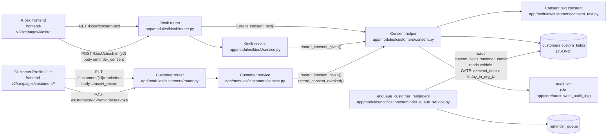

# Design — Customer Reminder Consent

## Overview

This feature adds explicit, evidence-bearing consent capture, recording, and honour-on-revoke flows around the existing per-customer reminder pipeline so that every WOF, COF, registration, and service-due message OraInvoice sends to a New Zealand Customer rests on a record that satisfies the **Unsolicited Electronic Messages Act 2007** burden of proof and the **Privacy Act 2020** consent rules. The kiosk and the Customer Profile feed a single backend helper that writes `customer.custom_fields["reminder_consent"]` together with `customer.custom_fields["reminder_config"]` in one transaction, and emits the corresponding `audit_log` row. The reminder pipeline is read-only against the new `reminder_consent` shape — its only delivery-time change is a new validity-window skip in `enqueue_customer_reminders` that prevents reminders from firing past the relevant expiry. **No new tables, no new columns, no Alembic migration**: the consent record and its revocation list live entirely in JSONB inside the existing `customers.custom_fields` column.

The feature is universal across trade families. Non-vehicle trades (plumbing, electrical, cleaning, …) see only the `service_due` Reminder_Category in the kiosk consent step; the vehicle-aware WOF / COF / registration sub-checkboxes are gated by the per-vehicle `inspection_type` resolution rules in Requirement 1.5a–5e.

## Architecture

The high-level shape is a **single consent helper** (`app/modules/customers/consent.py`) shared by the kiosk write path and the customer-profile write path, plus a **single read-time gate** in the reminder enqueue task. Everything else is wiring.



The two key invariants enforced by this layout:

- **Consent and config are co-persisted.** Both kiosk and customer-profile writes go through `record_consent_given()`, which writes the consent record AND the resulting `reminder_config` AND the audit row in the request-scoped `session.begin()` transaction. If any write fails, all three roll back. (CP-1.)
- **Manual-enable is gated centrally.** `update_customer_reminder_config()` raises `RemindersConsentRequiredError` when a (category, channel) pair is being newly transitioned from `enabled: false` to `enabled: true` and no covering consent record exists and no `consent_record` has been supplied alongside the call. The router maps that exception to HTTP 409. (CP-2.)

The reminder pipeline itself is unchanged in shape — `enqueue_customer_reminders` continues to iterate `(customer, vehicle, category)` and dedup-insert into `reminder_queue`. The single new delivery-time gate (CP-6) is `if relevant_date is None or relevant_date <= today_in_org_tz: continue`, immediately after the existing `expiry_date != target_date` filter.

## Components and Interfaces

### 3.1 New module: `app/modules/customers/consent.py`

This module is the single source of truth for everything consent-related. Public surface follows. **All function signatures below are pseudocode** — full bodies are deferred to the implementation phase.

```python
# Pydantic v2 wire/storage models -------------------------------------------------

class RemindersConsentEntry(BaseModel):
    """One ticked sub-checkbox on the kiosk, OR one (category, channel)
    pair confirmed in the manual Consent Confirmation modal."""
    vehicle_id: UUID | None  # null for manual confirmations (per-Customer, not per-vehicle)
    category: Literal["wof_expiry", "cof_expiry", "registration_expiry", "service_due"]
    channel: Literal["sms", "email", "both"]


class RemindersConsentRecord(BaseModel):
    """Wire shape mirroring `customer.custom_fields["reminder_consent"]`."""
    given_at: datetime           # UTC ISO 8601
    source: str                  # "kiosk_self_checkin" | "manually_recorded_by_staff:<obtained_method>"
    kiosk_session_id: UUID | None = None       # kiosk source only
    entries: list[RemindersConsentEntry]
    ip_address: str | None = None              # kiosk source only
    user_agent: str | None = None              # kiosk source only, truncated 500
    recorded_by_user_id: UUID | None = None    # manual source only
    recorded_by_user_email: str | None = None  # manual source only
    consent_text_version: str
    manual_note: str | None = None             # manual source + obtained_method == "other"


class RemindersRevocationRecord(BaseModel):
    """One entry appended to `customer.custom_fields["reminder_consent_revocations"]`."""
    revoked_at: datetime         # UTC ISO 8601
    source: str                  # "manually_recorded_by_staff:<obtained_method>"
    recorded_by_user_id: UUID
    recorded_by_user_email: str
    channel: Literal["sms", "email", "both"]
    categories_affected: list[Literal["wof_expiry", "cof_expiry", "registration_expiry", "service_due"]]
    reason_note: str


# Coverage helpers ----------------------------------------------------------------

def coverage_for(consent: dict | None) -> set[tuple[str, str]]:
    """Return the set of (category, effective_channel) pairs covered by an
    existing reminder_consent dict. Expands `channel == "both"` into two
    pairs: (cat, "sms") AND (cat, "email"). Returns the empty set when
    consent is None or has no entries."""


def compute_missing_consent(
    existing_consent: dict | None,
    new_config: dict,
) -> list[dict]:
    """Return the list of {category, channel} pairs that the *new* config
    is enabling but that the *existing* consent does not cover. Used by
    the manual-enable gate. Empty list means "no gate triggered"."""


def union_channel_for_category(
    entries: list[RemindersConsentEntry],
    category: str,
) -> Literal["sms", "email", "both"]:
    """Implements the per-Customer union rule from Req 1.14.

    If any entry for `category` chose `both`, return `both`.
    If entries for `category` chose multiple distinct channels, return `both`.
    Otherwise return the single shared channel."""


# Persistence helpers (side-effecting) -------------------------------------------

async def record_consent_given(
    db: AsyncSession,
    *,
    org_id: UUID,
    customer_id: UUID,
    user_id: UUID | None,
    record: RemindersConsentRecord,
    ip_address: str | None = None,
    audit_device_info: str | None = None,
) -> None:
    """Write `customer.custom_fields["reminder_consent"]` (replacing any
    existing value) and emit one `audit_log` row with action
    `customer.reminder_consent.given`.

    Side effects:
    - SELECT customers FOR UPDATE; UPDATE custom_fields; await db.flush().
    - write_audit_log(action="customer.reminder_consent.given", ...) with
      `after_value` REDACTED per Req 7.1: ip_address and user_agent are
      stripped from the dict before write_audit_log() is called. The full
      ip_address and user_agent remain inside customer.custom_fields.
    - Idempotent on identical input (same record dict round-trips to the
      same JSONB; the audit row is still emitted because the request-time
      action is the audit-worthy event)."""


async def record_consent_revoked(
    db: AsyncSession,
    *,
    org_id: UUID,
    customer_id: UUID,
    user_id: UUID,
    record: RemindersRevocationRecord,
) -> None:
    """Append a record to `customer.custom_fields["reminder_consent_revocations"]`
    and flip `reminder_config[<category>].enabled = False` for every
    `category` in `record.categories_affected`. Emit one `audit_log` row
    with action `customer.reminder_consent.revoked`.

    Side effects:
    - SELECT customers FOR UPDATE; UPDATE custom_fields; await db.flush().
    - write_audit_log(action="customer.reminder_consent.revoked", ...)
      with `after_value` REDACTED per Req 7.2: recorded_by_user_id and
      recorded_by_user_email are stripped from the dict before write_audit_log()
      is called (the actor identity is on the audit_log row's own user_id column).
    - Caller is expected to wrap this within the same `session.begin()`
      block as the rest of the request — there is no nested transaction."""


# Consent text source -------------------------------------------------------------

def current_consent_text() -> tuple[str, str]:
    """Return `(text, version)` for the kiosk consent banner.

    DESIGN DECISION (v1): Source is the BACKEND CONSTANT module
    `app/modules/customers/consent_text.py` — see §3.6 below. Not org-level.
    Reason: a single text per platform makes the legal review surface
    minimal, locks the version string, and avoids the failure mode where
    an org admin edits the wording into something that no longer satisfies
    the Act's "clearly identify the sender" requirement. The door is left
    open to add an org-level override in v2 by changing only this function."""
```

#### Side-effect summary

| Function | Writes `customer.custom_fields` | Emits `audit_log` row | Holds transaction |
|---|---|---|---|
| `coverage_for` | no | no | no (pure) |
| `compute_missing_consent` | no | no | no (pure) |
| `union_channel_for_category` | no | no | no (pure) |
| `current_consent_text` | no | no | no (pure) |
| `record_consent_given` | yes — `reminder_consent` | yes — `customer.reminder_consent.given` | uses caller's `session.begin()` |
| `record_consent_revoked` | yes — `reminder_consent_revocations` AND `reminder_config[*].enabled` | yes — `customer.reminder_consent.revoked` | uses caller's `session.begin()` |

### 3.2 Customer service edits — `app/modules/customers/service.py`

#### `update_customer_reminder_config` (signature change)

Current signature:

```python
async def update_customer_reminder_config(
    db, *, org_id, customer_id, reminders: dict
) -> dict
```

New signature:

```python
async def update_customer_reminder_config(
    db,
    *,
    org_id: UUID,
    customer_id: UUID,
    reminders: dict,
    consent_record: RemindersConsentRecord | None = None,
    current_user: Any = None,         # for audit + revocation source attribution
    ip_address: str | None = None,
) -> dict
```

The body becomes:

1. Load the customer row, snapshot `existing_consent = customer.custom_fields.get("reminder_consent")` and `existing_config = customer.custom_fields.get("reminder_config", {})`.
2. Validate and build the new `validated_config` (existing logic — channel/days_before bounds).
3. Compute `missing = compute_missing_consent(existing_consent, validated_config)`.
4. If `missing` is non-empty AND `consent_record is None`: raise `RemindersConsentRequiredError(missing=missing)`. The router maps this to HTTP 409 with body `{"error": "consent_required", "missing": [...]}`.
5. If `consent_record is not None`: validate that the supplied record's `entries` cover every pair in `missing`. If not, raise `RemindersConsentRequiredError(missing=<still-missing pairs>)` — same 409.
6. If `consent_record is not None`: call `record_consent_given(...)` first. This writes `reminder_consent` and emits the `customer.reminder_consent.given` audit row.
7. Persist `validated_config` (existing logic — `custom_fields["reminder_config"] = validated`, `await db.flush()`, `await db.refresh(customer)`).
8. Return `validated_config`.

Steps 6, 7, and the audit row are co-persisted by the surrounding `session.begin()` context manager — no manual `db.commit()`. **CP-1** (kiosk and manual paths both run through the same helper) and **CP-2** (the gate raises before any reminder_config write) follow directly.

#### New service function: `revoke_customer_reminders`

```python
async def revoke_customer_reminders(
    db,
    *,
    org_id: UUID,
    customer_id: UUID,
    current_user: Any,             # the Org_User confirming the revocation
    record: RemindersRevocationRecord,
    ip_address: str | None = None,
) -> dict:
    """Service-layer entry point for `POST /customers/{id}/reminders/revoke`.

    Loads the customer, validates that the affected entries actually exist
    in the active reminder_config, then delegates to `record_consent_revoked`.
    Returns the post-revocation `reminder_config` for the response."""
```

Body shape (pseudocode):
1. Load the customer row.
2. For every `cat` in `record.categories_affected`, ensure `reminder_config[cat]["enabled"] is True`. If none of them are currently enabled (idempotent re-confirmation), return early without writing anything — **CP-5**.
3. Otherwise call `record_consent_revoked(...)` which performs the flip and the append in one transaction-scoped flush.
4. Return the new `reminder_config`.

### 3.3 Customer router edits — `app/modules/customers/router.py`

#### `PUT /customers/{customer_id}/reminders` (extended)

```python
@router.put("/{customer_id}/reminders")
async def update_customer_reminders_endpoint(...):
    body = await request.json()
    # New: pull off optional consent_record block
    consent_block = body.pop("consent_record", None)
    consent_record = (
        RemindersConsentRecord.model_validate(consent_block)
        if consent_block is not None
        else None
    )
    try:
        updated = await update_customer_reminder_config(
            db,
            org_id=org_uuid,
            customer_id=cust_uuid,
            reminders=body,
            consent_record=consent_record,
            current_user=current_user,
            ip_address=ip_address,
        )
    except RemindersConsentRequiredError as exc:
        return JSONResponse(
            status_code=409,
            content={"error": "consent_required", "missing": exc.missing},
        )
    except ValueError as exc:
        return JSONResponse(status_code=404, content={"detail": str(exc)})
    return updated
```

#### `POST /customers/{customer_id}/reminders/revoke` (new)

```python
class RemindersRevokeRequest(BaseModel):
    obtained_method: Literal["phone", "in_person", "email_reply", "other"]
    channel: Literal["sms", "email", "both"]
    categories_affected: list[Literal["wof_expiry", "cof_expiry", "registration_expiry", "service_due"]]
    reason_note: str = Field(..., min_length=1)


@router.post("/{customer_id}/reminders/revoke")
async def revoke_customer_reminders_endpoint(...):
    # ... extract org / user / ip context, validate body ...
    record = RemindersRevocationRecord(
        revoked_at=datetime.now(timezone.utc),
        source=f"manually_recorded_by_staff:{body.obtained_method}",
        recorded_by_user_id=current_user.id,
        recorded_by_user_email=current_user.email,
        channel=body.channel,
        categories_affected=body.categories_affected,
        reason_note=body.reason_note,
    )
    updated = await revoke_customer_reminders(
        db, org_id=org_uuid, customer_id=cust_uuid,
        current_user=current_user, record=record, ip_address=ip_address,
    )
    return updated
```

Both endpoints retain the existing `require_role("org_admin", "salesperson")` guard.

### 3.4 New custom exception types — `app/modules/customers/exceptions.py`

If the file does not exist, it is created. (Today, `CustomerDeletionBlockedError` lives in `schemas.py`; per spec-completeness consistency we keep it there. New exceptions go into a dedicated `exceptions.py` so the audit-redaction lint test can scope its AST walk to a single file.)

```python
class RemindersConsentRequiredError(Exception):
    def __init__(self, *, missing: list[dict]):
        self.missing = missing  # list of {"category": str, "channel": str}
        super().__init__(f"Reminder consent required for {missing}")


class RemindersRevocationError(Exception):
    """Raised when a revocation request references a (category, channel)
    pair that does not currently have an active consent / config entry.
    Mapped to HTTP 422 by the router."""
```

### 3.5 Kiosk schema + service edits — `app/modules/kiosk/`

#### `KioskCheckInRequestV2` extension

```python
class KioskReminderConsentBlock(BaseModel):
    """Optional consent block on the v2 kiosk check-in body."""
    entries: list[RemindersConsentEntry]   # one per ticked sub-checkbox across all vehicle rows
    consent_text_version: str              # echoed back from GET /kiosk/consent-text


class KioskCheckInRequestV2(BaseModel):
    # ... existing fields ...
    reminder_consent: KioskReminderConsentBlock | None = None

    def consent_provided(self) -> bool:
        return self.reminder_consent is not None and len(self.reminder_consent.entries) > 0
```

The new field is **optional**. When the master consent checkbox on the kiosk is unchecked, the frontend simply omits `reminder_consent`, and check-in proceeds with no consent record written (Req 1.12).

#### `kiosk_check_in_v2` service edits

Inside the existing v2 check-in flow, after the customer has been resolved/created and AFTER vehicles have been linked, add:

```python
if data.consent_provided():
    record = RemindersConsentRecord(
        given_at=datetime.now(timezone.utc),
        source="kiosk_self_checkin",
        kiosk_session_id=request_kiosk_session_id,   # from request.state or new request id
        entries=data.reminder_consent.entries,
        ip_address=ip_address,
        user_agent=user_agent[:500] if user_agent else None,
        consent_text_version=data.reminder_consent.consent_text_version,
    )
    # Compute the per-Customer union per Req 1.14
    derived_config = {}
    for cat in {"wof_expiry", "cof_expiry", "registration_expiry", "service_due"}:
        cat_entries = [e for e in record.entries if e.category == cat]
        if cat_entries:
            derived_config[cat] = {
                "enabled": True,
                "channel": union_channel_for_category(record.entries, cat),
                "days_before": existing_config.get(cat, {}).get("days_before", DEFAULT_REMINDER_DAYS),
            }
    # update_customer_reminder_config performs the gate-then-write flow,
    # writes reminder_consent + reminder_config + audit row in this same
    # session.begin() transaction.
    await update_customer_reminder_config(
        db,
        org_id=org_id,
        customer_id=customer_id,
        reminders=derived_config,
        consent_record=record,
        current_user=user,
        ip_address=ip_address,
    )
```

This deliberately reuses `update_customer_reminder_config` so the kiosk path and the manual path **share the same gate, the same persistence write, and the same audit emission** — there is one write site for `customer.reminder_consent.given`. (CP-3.)

The whole block is wrapped in the same `session.begin()` that the kiosk router establishes via `get_db_session` — there is no manual SAVEPOINT. If consent persistence fails the surrounding context manager rolls the entire check-in back, satisfying Req 1.16 (HTTP 500 + `{"error": "consent_persistence_failed"}` shape is produced by an exception handler at the router layer).

#### New endpoint `GET /kiosk/consent-text`

```python
@router.get("/consent-text")
async def get_kiosk_consent_text():
    text, version = current_consent_text()
    return {"text": text, "version": version}
```

Public endpoint, no auth on the kiosk role beyond the existing kiosk router scoping. Returns the live wording plus the version string the frontend echoes back in the check-in submission.

### 3.6 New constant module — `app/modules/customers/consent_text.py`

```python
"""Source of truth for kiosk reminder Consent_Text and Consent_Text_Version.

The version string MUST be updated whenever KIOSK_CONSENT_TEXT changes.
The frontend reads this via GET /kiosk/consent-text at kiosk boot, includes
the version in the check-in submission body, and the backend persists the
echoed version on every reminder_consent record. This locks the legal text
to a verifiable timestamped string for compliance audits.
"""

KIOSK_CONSENT_TEXT_VERSION = "2026-06-08-v1"

KIOSK_CONSENT_TEXT = (
    "I agree to receive reminders about my vehicle's WOF, COF, registration, "
    "and service due dates from {workshop_name} by SMS or email. "
    "I can revoke this consent at any time by phoning the workshop, "
    "without penalty."
)
```

The `{workshop_name}` placeholder is filled in by the kiosk frontend at render time using the org name from `TenantContext`. The version string DOES NOT change when only the placeholder changes — it changes when the legal substance changes.

### 3.7 Reminder queue validity-window gate

File: `app/modules/notifications/reminder_queue_service.py`. Function: `enqueue_customer_reminders`.

The existing inner loop already iterates `for cv, vehicle in vehicle_rows: ... expiry_date = getattr(vehicle, expiry_field, None); if expiry_date is None or expiry_date != target_date: continue`. The change is one new clause **after** the NULL check and **before** the `target_date` match check (the order matters because we want to log the skip even when the date wouldn't have hit the target window):

```python
expiry_date = getattr(vehicle, expiry_field, None)
if expiry_date is None:
    continue                  # existing NULL skip — no log
if expiry_date <= today_in_org_tz:
    log.debug(
        "skipped: %s for %s — date %s is on or before today",
        reminder_type, vehicle.rego or "<unknown>", expiry_date,
    )
    continue
if expiry_date != target_date:
    continue
```

`today_in_org_tz` is computed once per (loop iteration's) org via:

```python
def _today_in_org_tz(org_settings: dict) -> date:
    tz_name = (org_settings or {}).get("timezone") or "Pacific/Auckland"
    try:
        tz = ZoneInfo(tz_name)
    except Exception:
        tz = ZoneInfo("Pacific/Auckland")
    return datetime.now(tz).date()
```

Because the function already pre-fetches per-org settings into `org_data`, the helper is called once per org and stashed alongside `org_data`. **No audit row is written for the skip** (Req 4.6) — the only signal is the debug log line. **No mutation** of `reminder_config` or `reminder_consent_revocations` (Req 4.5) — auto-suppression is purely an enqueue-time gate, so when the date next moves to the future the existing config is reused and reminders resume without consent re-grant (CP-6).

## Data Models

### 4.1 `customer.custom_fields["reminder_consent"]` (replacement on every grant)

```jsonc
{
  "given_at": "2026-06-08T10:07:23Z",
  "source": "kiosk_self_checkin",          // OR "manually_recorded_by_staff:phone"
                                           //    "manually_recorded_by_staff:verbal_in_person"
                                           //    "manually_recorded_by_staff:email_reply"
                                           //    "manually_recorded_by_staff:written_form"
                                           //    "manually_recorded_by_staff:other"
  "kiosk_session_id": "<uuid>",            // only present for kiosk source
  "entries": [
    {"vehicle_id": "<uuid or null>", "category": "wof_expiry", "channel": "sms"},
    {"vehicle_id": "<uuid or null>", "category": "service_due", "channel": "both"}
  ],
  "ip_address": "1.2.3.4",                 // kiosk source only
  "user_agent": "Mozilla/...",             // kiosk source only, truncated 500
  "recorded_by_user_id": "<uuid>",         // manual source only
  "recorded_by_user_email": "...",         // manual source only
  "consent_text_version": "2026-06-08-v1",
  "manual_note": "..."                     // manual source AND obtained_method == "other"
}
```

### 4.2 `customer.custom_fields["reminder_consent_revocations"]` (append-only list)

```jsonc
[
  {
    "revoked_at": "2026-06-09T11:12:00Z",
    "source": "manually_recorded_by_staff:phone",
    "recorded_by_user_id": "<uuid>",
    "recorded_by_user_email": "...",
    "channel": "sms",
    "categories_affected": ["wof_expiry"],
    "reason_note": "Customer asked over the phone to stop reminders"
  }
]
```

### 4.3 `customer.custom_fields["reminder_config"]` (shape unchanged)

Per-Customer (not per-vehicle) reminder configuration. The existing four keys are unchanged — this feature only mutates `enabled` and `channel` based on the consent flow.

```jsonc
{
  "wof_expiry":          {"enabled": true,  "days_before": 30, "channel": "sms"},
  "cof_expiry":          {"enabled": false, "days_before": 30, "channel": "email"},
  "registration_expiry": {"enabled": true,  "days_before": 14, "channel": "both"},
  "service_due":         {"enabled": true,  "days_before": 30, "channel": "email"}
}
```

The reminder pipeline source-of-truth wording is unchanged: `enqueue_customer_reminders` reads `wof_expiry`, `cof_expiry`, `registration_expiry`, and `service_due_date` from `org_vehicles` and `global_vehicles` (depending on which link type the per-customer link uses), via the existing two-pass query.

### 4.4 No schema migration

There is no Alembic migration in this feature. The consent record is JSONB-only. (Req out-of-scope item 1.)

## Correctness Properties

*A property is a characteristic or behavior that should hold true across all valid executions of a system — essentially, a formal statement about what the system should do. Properties serve as the bridge between human-readable specifications and machine-verifiable correctness guarantees.*

The six properties below mirror the CP-1 through CP-6 enumeration in the requirements document. They map cleanly onto the prework analysis recorded for this feature: each one is testable as a property, the testable surface is YOUR code (helpers, gate logic, service functions, and the enqueue task) rather than third-party infrastructure, and 100+ iterations are cost-justified because every helper is a pure function or a thin DB wrapper that is easily mockable.

### Property 1: Consent persistence is transactional

*For all* successful kiosk check-in submissions and `PUT /customers/{id}/reminders` requests that supply a `consent_record`, both `customer.custom_fields["reminder_consent"]` and `customer.custom_fields["reminder_config"]` are persisted in the same database transaction; *for all* such submissions whose write of either value fails, neither value is persisted.

**Validates: Requirements 1.13, 1.14, 1.15, 1.16, 2.7, 2.8**

### Property 2: Manual-enable consent gate

*For all* `PUT /customers/{id}/reminders` requests that newly transition at least one (Reminder_Category, Reminder_Channel) pair from `enabled: false` to `enabled: true` without an existing covering `reminder_consent` and without a `consent_record` field on the request body, the response is HTTP 409 with body `{"error": "consent_required", "missing": [...]}` and `customer.custom_fields["reminder_config"]` is unchanged from its pre-request value.

**Validates: Requirements 2.2, 2.3, 2.10, 2.11, 2.12, 2.13**

### Property 3: Audit completeness for consent events

*For all* successful executions of `record_consent_given`, exactly one `audit_log` row with `action = "customer.reminder_consent.given"` is written, with `after_value` containing the consent record fields and excluding `ip_address` and `user_agent`. *For all* successful executions of `record_consent_revoked`, exactly one `audit_log` row with `action = "customer.reminder_consent.revoked"` is written, with `after_value` containing `revoked_at`, `source`, `channel`, `categories_affected`, and `reason_note`, and excluding `recorded_by_user_id` and `recorded_by_user_email`.

**Validates: Requirements 1.17, 2.9, 3.7, 7.1, 7.2**

### Property 4: Kiosk default-unchecked invariant (frontend, fast-check)

*For all* mounts of the kiosk Reminder Consent step or section — including mounts where `localStorage`, `sessionStorage`, browser-autofill values, and the kiosk's previously-completed check-in already contain consent-related state — the master consent checkbox renders unchecked, every Reminder_Category sub-checkbox renders unchecked, and every per-checkbox channel sub-control renders with no option selected.

**Validates: Requirements 1.2, 1.3**

### Property 5: Manual-revocation idempotence

*For all* sequences of two or more `POST /customers/{id}/reminders/revoke` invocations against a Customer whose `reminder_config[<category>].enabled` is already `false` for every `<category>` in the request's `categories_affected`, the resulting state of `customer.custom_fields["reminder_config"]` is unchanged after the second and subsequent calls, and no additional entry is appended to `reminder_consent_revocations`. (Per Req 3.1, the UI does not even render the Revoke control when there are no active consented entries — but the backend nonetheless guards the write so that any client-side bypass is harmless.)

**Validates: Requirement 3 (CP-5)**

### Property 6: Validity-window auto-suppression

*For all* `(Customer, vehicle, Reminder_Category)` tuples where the relevant date (`vehicle.wof_expiry` for `wof_expiry`, `vehicle.cof_expiry` for `cof_expiry`, `vehicle.registration_expiry` for `registration_expiry`, `vehicle.service_due_date` for `service_due`) is `NULL` OR is on or before today's date in the organisation's local timezone, an `enqueue_customer_reminders` pass produces zero rows in `reminder_queue` for that tuple. *For all* such tuples whose relevant date is subsequently updated to a future value, the next `enqueue_customer_reminders` pass produces exactly the configured set of rows (one per ticked channel) without any consent re-grant, by virtue of the unchanged `reminder_config` and `reminder_consent` records.

**Validates: Requirements 4.1, 4.2, 4.3, 4.7**

## Validity-window gate behaviour (sequence)

```mermaid
sequenceDiagram
  participant V as Vehicle row
  participant E as enqueue_customer_reminders
  participant RQ as reminder_queue
  participant SMS as SMS / Email
  participant Op as Operator

  Note over V: WOF expires 2026-05-31 (yesterday)
  E->>V: SELECT wof_expiry
  V-->>E: 2026-05-31
  E->>E: today_in_org_tz = 2026-06-01
  E->>E: 2026-05-31 <= 2026-06-01 → SKIP
  E-->>Op: log.debug("skipped: wof_expiry for ABC123 ...")
  Note over RQ: no row inserted
  Note over SMS: no message sent

  Note over V: WOF renewed; row updated to 2027-05-30
  E->>V: SELECT wof_expiry
  V-->>E: 2027-05-30
  E->>E: today_in_org_tz = 2026-06-15
  E->>E: 2027-05-30 > 2026-06-15 → continue
  E->>E: target_date = today + days_before; matches?
  alt match
    E->>RQ: INSERT row (idempotent on (org, customer, vehicle, type, scheduled_date))
    RQ-->>SMS: dispatched on next run
  else no match
    Note over E: row not inserted this run; will be picked up when target_date hits
  end
```

This is the sequence behind CP-6: the validity-window gate is purely a read-time skip. No mutation of consent or config; no re-consent required when the underlying date moves back into the future.

## Frontend changes

### 5.1 Kiosk

#### New step component `ReminderConsentStep.tsx`

Path: `frontend-v2/src/pages/kiosk/ReminderConsentStep.tsx`. Sits between `KioskCheckInForm` (customer details) and `KioskSuccess` (final confirmation) in the existing kiosk wizard hosted by `KioskPage.tsx`.

Props:

```typescript
interface ReminderConsentStepProps {
  vehicles: KioskVehicleSummary[]   // from the existing vehicle summary step
  consentText: string               // from /kiosk/consent-text
  consentTextVersion: string        // from /kiosk/consent-text
  isAutomotive: boolean             // tradeFamily === 'automotive-transport' (or the multi-trade variant)
  onChange: (block: KioskReminderConsentBlock | null) => void
  onContinue: () => void
}
```

Per-vehicle row resolution rules (Req 1.5a–5e) live in a single helper `resolveInspectionTypeRow(vehicle): 'wof' | 'cof' | 'none'`:

```typescript
function resolveInspectionTypeRow(v: KioskVehicleSummary): 'wof' | 'cof' | 'none' {
  if (v.inspection_type === 'cof') return 'cof'
  if (v.inspection_type === 'wof') return 'wof'
  // Both populated: prefer COF if inspection_type is null (heavier-compliance)
  if (v.wof_expiry && v.cof_expiry) return 'cof'
  if (v.cof_expiry && !v.wof_expiry) return 'cof'
  if (v.wof_expiry && !v.cof_expiry) return 'wof'
  return 'none'
}
```

Each vehicle row renders:
- Rego + make/model heading.
- The single inspection-type checkbox: `WOF expiry`, `COF expiry`, or none — pre-selected as checked when the master toggle is checked (Req 1.5).
- `Registration expiry` and `Service due` sub-checkboxes — pre-selected as checked. For non-automotive trade families, the registration and inspection rows are hidden (Req 1.5e + NFR-6); only `Service due` shows.
- For each ticked sub-checkbox: an inline tri-state channel control (`SMS` / `Email` / `Both`), no preselection (Req 1.6).

The component owns its local state (no Context, no localStorage write — explicit reset-on-mount per Req 1.3 / CP-4), debounces nothing, and calls `onChange()` on every state change so the parent `KioskPage` can decide whether to enable its own "Continue" button.

The parent submit button is disabled when any ticked sub-checkbox lacks a channel selection (Req 1.11). The component computes that and exposes it to the parent via a `onValidityChange(boolean)` callback in addition to `onChange`.

#### Boot-time fetch from `GET /kiosk/consent-text`

`KioskPage.tsx` adds a `useEffect` at mount to fetch the consent text + version once, store it on local state, and pass it down to `ReminderConsentStep`. AbortController cleanup as per safe-api-consumption.

#### Submit body extension

The existing `submitCheckIn` call in `frontend-v2/src/pages/kiosk/api.ts` adds the `reminder_consent` field to the request body when the master checkbox is checked AND there is at least one ticked entry. Otherwise the field is omitted.

```typescript
const body: KioskCheckInRequestV2 = {
  ...customerFields,
  vehicles: vehicleEntries,
  ...(consentBlock ? { reminder_consent: consentBlock } : {}),
}
```

### 5.2 Customer profile / list — Configure Reminders modal

The existing modal lives in `frontend-v2/src/pages/customers/CustomerList.tsx` (and is opened from `CustomerProfile.tsx`).

Changes:

1. **On open**: parallel fetch `GET /customers/{id}/reminders` AND a derived snapshot of `customer.custom_fields["reminder_consent"]`. Cache the latter in component state. Display per-row coverage indicators (Req 5.4):
   - Tick icon: existing consent covers this `(category, channel)` pair.
   - Warning icon: consent is missing for this pair.
2. **On submit**: compute `missing` client-side using the same logic as the backend `compute_missing_consent` (a small TypeScript helper in `frontend-v2/src/api/customers.ts`). When `missing.length > 0`, render the `ConsentConfirmationModal` in front of the current modal instead of issuing the `PUT`.
3. **ConsentConfirmationModal** (new, `frontend-v2/src/pages/customers/ConsentConfirmationModal.tsx`):
   - Renders the Consent_Text (sourced from a small frontend constant — to keep parity with the kiosk's backend-served version, the customer-profile path uses an inline static copy stamped with the same `consent_text_version` that the backend constant module advertises; the version string is fetched from the same `/kiosk/consent-text` endpoint at modal-open time so the two surfaces stay in lockstep).
   - Lists each `(category, channel)` pair in `missing`.
   - Required `<select>` "How was consent obtained?" with the 5 options from Req 2.4.
   - Required `<textarea>` "Note" (only when `obtained_method === "other"`).
   - **Confirm**: builds a `RemindersConsentRecord` and POSTs `PUT /customers/{id}/reminders` with `consent_record` in the body — same call site, just augmented.
   - **Cancel**: closes the modal AND discards the pending reminder configuration change (Req 2.6) — does NOT issue a `PUT`.

### 5.3 Customer profile — Reminder Consent section

New section on `frontend-v2/src/pages/customers/CustomerProfile.tsx` (Req 5.1–5.3):

- Headline row: source label, `given_at` formatted in the org's locale and timezone, recorded-by display name (resolved via the existing user-name resolver), `consent_text_version`.
- Entries grid: one row per `entry` showing rego (resolved from `vehicle_id` via the customer's linked vehicles, or "Customer-wide" when `vehicle_id` is null), category, channel.
- Revocation history table: one row per entry of `reminder_consent_revocations` showing `revoked_at`, source, channel, categories_affected, reason_note, recorded-by user.
- Per-entry "Revoke consent" control beside each currently-active entry (i.e., entries whose corresponding `reminder_config[<category>].enabled` is `true`) — opens the new `RevocationModal`.

### 5.4 Revocation modal

`frontend-v2/src/pages/customers/RevocationModal.tsx`. Body:

```typescript
interface RevocationModalProps {
  customerId: string
  entry: { category: ReminderCategory; channel: ReminderChannel }
  onClose: () => void
  onRevoked: () => void  // refresh parent
}
```

Form: required `obtained_method` select (`phone`, `in_person`, `email_reply`, `other`), required `reason_note` textarea. On Confirm: `POST /customers/{id}/reminders/revoke` with `{obtained_method, channel, categories_affected: [entry.category], reason_note}`. On Cancel: close without writing (Req 3.3).

### 5.5 Optional Customer List "Reminder Consent" column

Behind the new org settings flag `customers_consent_column_visible: bool` (default `false`). When the flag is set, `CustomerList.tsx` renders an additional column titled "Reminder Consent" with `Yes` / `No` derived from the presence of `customer.custom_fields["reminder_consent"]` in the list response. The existing customer search service is extended to include a single boolean `has_reminder_consent` per row so the frontend doesn't need to fetch the full custom_fields blob.

## Backwards compatibility

- **Existing customers with `reminder_config` enabled but no `reminder_consent`**: no immediate effect. Reminders continue to fire as today. The Consent Confirmation modal is only triggered on the *next manual enable transition* — i.e., a `PUT /customers/{id}/reminders` that newly flips a `(category, channel)` pair from `enabled: false` to `enabled: true`. Already-`enabled: true` pairs that simply have their `days_before` or channel changed do not fall through the gate. (Per Out-of-Scope item 6.)
- **Existing kiosk check-ins (v1 endpoint)**: continue to work unchanged. The v1 schema does not gain a `reminder_consent` field. Only the v2 path participates in consent capture.
- **Existing reminder_queue rows**: unchanged. The validity-window gate is read-time only and never deletes from `reminder_queue`.

## Error handling

| Failure mode | Where | Response |
|---|---|---|
| Manual enable without consent and without `consent_record` in body | `PUT /customers/{id}/reminders` | `409 {"error": "consent_required", "missing": [{"category": ..., "channel": ...}]}` |
| Supplied `consent_record` does not cover all `missing` pairs | `PUT /customers/{id}/reminders` | `409 {"error": "consent_required", "missing": [...]}` (still-missing pairs only) |
| DB write of `reminder_consent` or `reminder_config` fails inside kiosk check-in | `kiosk_check_in_v2` | `session.begin()` rolls back the entire check-in; router exception handler returns `500 {"error": "consent_persistence_failed"}` (Req 1.16) |
| DB write of `reminder_consent` or `reminder_config` fails inside `update_customer_reminder_config` | `update_customer_reminder_config` | rollback; `500 {"error": "consent_persistence_failed"}` (Req 2.8) |
| DB write of revocation fails | `revoke_customer_reminders` | rollback; `500 {"error": "revocation_persistence_failed"}` (Req 3.6) |
| Revocation request affects no currently-active categories | `revoke_customer_reminders` | early-return with the unchanged `reminder_config`, no audit row; the UI does not surface this case because Req 3.1 hides the Revoke control |
| Customer not found | both endpoints | existing `404 {"detail": "Customer not found"}` |
| Kiosk consent-text endpoint reachable | `GET /kiosk/consent-text` | always 200 — it returns a compile-time constant |
| `today_in_org_tz` timezone unresolvable | `enqueue_customer_reminders` | falls back to `Pacific/Auckland`; logged once per run via `log.debug` |

## Testing strategy

### Property-based tests (one per Correctness Property)

| Test module | CP | Library |
|---|---|---|
| `tests/property/test_consent_persistence_integrity.py` | CP-1 | Hypothesis |
| `tests/property/test_consent_manual_enable_gate.py` | CP-2 | Hypothesis |
| `tests/property/test_consent_audit_completeness.py` | CP-3 | Hypothesis |
| `frontend-v2/src/pages/kiosk/__tests__/ReminderConsentStep.default.test.tsx` | CP-4 | fast-check + Vitest + RTL |
| `tests/property/test_consent_manual_revocation_idempotence.py` | CP-5 | Hypothesis |
| `tests/property/test_reminder_validity_window.py` | CP-6 | Hypothesis |

Each Hypothesis test runs minimum 100 iterations. Each test header carries the standard tag:

```python
# Feature: customer-reminder-consent, Property 1: For all successful kiosk
# check-in submissions and PUT /customers/{id}/reminders requests that supply
# a consent_record, both customer.custom_fields["reminder_consent"] and
# customer.custom_fields["reminder_config"] are persisted in the same DB
# transaction; for all such submissions whose write of either value fails,
# neither value is persisted.
```

The fast-check test for CP-4 generates random localStorage / sessionStorage / autofill seed states, mounts `<ReminderConsentStep />` via React Testing Library, and asserts every checkbox renders unchecked.

### Example-based unit tests

- `tests/unit/test_consent_helpers.py` — `coverage_for`, `compute_missing_consent`, `union_channel_for_category`, `current_consent_text` all have direct example-based tests for the named cases (single channel, both channel, mixed-vehicle union, empty consent, no missing pairs).
- `tests/unit/test_consent_text_constant.py` — locks `KIOSK_CONSENT_TEXT_VERSION = "2026-06-08-v1"` and asserts the constant has a placeholder for `{workshop_name}`.

### Audit-redaction lint test

`tests/unit/test_consent_audit_redaction.py` performs an AST walk over `app/modules/customers/consent.py` and rejects any `write_audit_log(..., after_value={...})` literal whose dict contains the keys `"ip_address"`, `"user_agent"`, `"recorded_by_user_id"`, or `"recorded_by_user_email"`. This mirrors the analogous redaction check that the staff payslip module owns.

### Backend integration tests

- `tests/integration/test_kiosk_checkin_consent.py` — end-to-end POST `/kiosk/check-in` with `reminder_consent` block; asserts customer.custom_fields and reminder_config are co-persisted plus exactly one `customer.reminder_consent.given` audit row. A failure-injection variant patches the audit insert to raise and asserts neither customer field is present after rollback.
- `tests/integration/test_customer_reminders_consent_gate.py` — `PUT /customers/{id}/reminders` with no consent → 409; with `consent_record` → 200 + persisted; idempotent re-submit with same body → 200 + same persisted state, no extra audit row. Already-enabled pairs that are simply re-saved do not trigger the gate.
- `tests/integration/test_customer_reminders_revoke.py` — `POST /customers/{id}/reminders/revoke` flips `reminder_config` and appends to revocations list; audit row redacted; idempotent on already-revoked entries.
- `tests/integration/test_reminder_validity_window.py` — insert vehicle with `wof_expiry = today - 1 day`, `enabled: true`; run `enqueue_customer_reminders`; assert zero rows in `reminder_queue` and the expected `log.debug` line. Update to `today + 30 days`, run again; assert row produced.

### Frontend tests

- Vitest: `ReminderConsentStep` renders correct checkbox per `inspection_type` (wof / cof / null) and dual-expiry tie-breaker; null-null hides the inspection row; per-checkbox channel control gates parent submit; clears state on remount.
- Vitest: Configure Reminders modal opens Consent Confirmation modal when `missing.length > 0`; cancelling discards the change.
- Playwright e2e: kiosk new-customer happy path → consent → check-in completes → Customer Profile shows the consent record → admin revokes via the Revocation modal → `reminder_config` flipped + audit row written.

### Smoke test (NOT property-based)

- `tests/smoke/test_kiosk_consent_text_endpoint.py` — `GET /kiosk/consent-text` returns the expected version string. Single execution.
