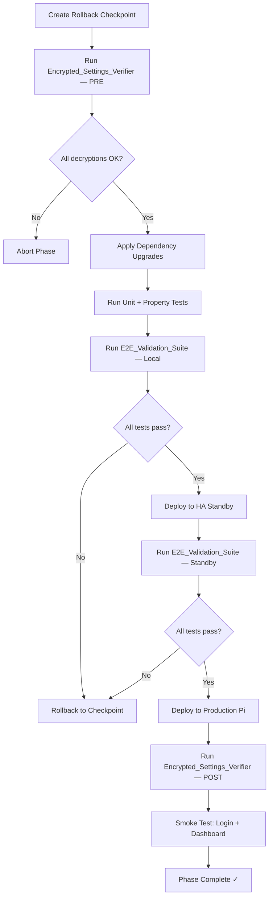
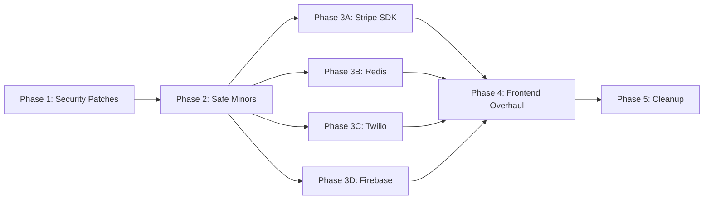

# Design Document: Dependency Upgrade Remediation

## Overview

This design covers the safe, phased upgrade of all outdated dependencies across the OraInvoice platform — Python backend (`pyproject.toml`) and React frontend (`frontend/package.json`). The upgrade is organised into five risk-tiered phases executed sequentially, each gated by a rollback checkpoint and an E2E validation suite.

The core challenge is preserving data integrity across cryptographic boundaries: AES-256-GCM envelope encryption (API keys, TOTP secrets, SMS/email credentials), bcrypt password hashes, JWT sessions (HS256/RS256 dual-algorithm), WebAuthn passkey credentials, and Redis-stored MFA OTP codes. The platform is in early production (1 org, 1 customer, 2 invoices) on a Raspberry Pi 5, so the blast radius is small but the tolerance for data corruption is zero.

### Design Decisions

1. **Gate-before-proceed model**: Each phase creates a Rollback_Checkpoint and must pass the E2E_Validation_Suite before the next phase begins. This is enforced by the upgrade scripts, not by human discipline alone.
2. **Encrypted_Settings_Verifier as a first-class script**: Rather than ad-hoc decryption checks, a dedicated script attempts to decrypt every encrypted field in the DB and produces a machine-readable JSON report. This runs before and after every phase.
3. **Playwright E2E suite grows incrementally**: Phase 1 tests are a subset; each subsequent phase adds tests. Phase 4 (frontend overhaul) runs the full 40-test comprehensive suite.
4. **Frontend Phase 4 is a big-bang upgrade**: React 19 + Router 7 + Tailwind 4 + Vite 8 + TS 6 are tightly coupled and must be upgraded together in a dedicated sprint.
5. **Property tests focus on cryptographic round-trips and auth invariants**: The highest-value properties are encryption round-trip, password hash stability, JWT encode/decode round-trip, and Redis OTP store/retrieve round-trip.

## Architecture

The upgrade pipeline is a linear sequence of phases, each following the same deployment pattern:



### Phase Dependency Graph



Phase 3 sub-phases (A–D) can run in parallel after Phase 2, but Phase 4 depends on all of them completing.

## Components and Interfaces

### 1. Encrypted_Settings_Verifier (`scripts/verify_encrypted_settings.py`)

A standalone async script that connects to the database, iterates over all tables with encrypted columns, attempts decryption, and outputs a JSON report.

```python
# Interface
async def verify_all_encrypted_fields() -> VerificationReport

@dataclass
class FieldResult:
    table: str          # e.g. "integration_configs"
    record_id: str      # e.g. row name or provider_key
    status: str         # "OK" or "FAIL: <error>"

@dataclass
class VerificationReport:
    timestamp: str
    results: dict[str, list[FieldResult]]  # keyed by table name
    total_checked: int
    total_failed: int
    passed: bool        # True if total_failed == 0
```

Tables checked:
- `integration_configs.config_encrypted` (keyed by `name`)
- `sms_verification_providers.credentials_encrypted` (keyed by `provider_key`)
- `email_providers.credentials_encrypted` (keyed by `provider_key`)
- `user_mfa_methods.secret_encrypted` (keyed by `user_id + method`, TOTP only)

### 2. E2E Validation Suite (`tests/e2e/frontend/upgrade-validation.spec.ts`)

A Playwright test suite organised by phase. Each phase imports the previous phase's tests plus its own additions.

```typescript
// Structure
test.describe("Phase 1: Security Patches", () => {
  test("login with email/password", async ({ page }) => { ... });
  test("MFA TOTP verification", async ({ page }) => { ... });
  test("MFA SMS verification", async ({ page }) => { ... });
  test("passkey login", async ({ page }) => { ... });
  test("Stripe integration status", async ({ page }) => { ... });
  test("Xero integration status", async ({ page }) => { ... });
  test("SMS provider status", async ({ page }) => { ... });
  test("email provider status", async ({ page }) => { ... });
  test("create invoice + Xero sync", async ({ page }) => { ... });
  test("process payment", async ({ page }) => { ... });
  test("issue refund + credit note", async ({ page }) => { ... });
});

test.describe("Phase 2: Safe Minors", () => {
  // Inherits Phase 1 tests via shared helper
  test("full signup flow", async ({ page }) => { ... });
  test("password reset flow", async ({ page }) => { ... });
  test("full invoice lifecycle", async ({ page }) => { ... });
  test("refresh token rotation", async ({ page }) => { ... });
  // ... etc
});

// Phase 4 runs the comprehensive 40-test suite
```

### 3. Upgrade Execution Scripts (`scripts/upgrade_phase_N.sh`)

Per-phase shell scripts that:
1. Call `scripts/create_rollback_checkpoint.sh <phase>`
2. Run `scripts/verify_encrypted_settings.py` (pre-check)
3. Execute the pip/npm install commands for that phase
4. Run `pytest` (unit + property tests)
5. Run `npx playwright test` (E2E suite for that phase)
6. Print pass/fail summary

```bash
# Interface for each phase script
#!/bin/bash
set -euo pipefail
PHASE="$1"  # e.g. "phase1"

# 1. Checkpoint
./scripts/create_rollback_checkpoint.sh "$PHASE"

# 2. Pre-verify
python scripts/verify_encrypted_settings.py --phase "$PHASE" --stage pre

# 3. Upgrade
pip install <packages for this phase>
# or: cd frontend && npm install <packages>

# 4. Test
pytest tests/ -x --tb=short
cd frontend && npm run test

# 5. E2E
npx playwright test tests/e2e/frontend/upgrade-validation.spec.ts --grep "$PHASE"

# 6. Post-verify
python scripts/verify_encrypted_settings.py --phase "$PHASE" --stage post
```

### 4. Rollback Checkpoint Script (`scripts/create_rollback_checkpoint.sh`)

Creates the three-part checkpoint: DB dump, Git tag, Docker image tag.

```bash
# Interface
./scripts/create_rollback_checkpoint.sh <phase_name>
# Creates:
#   - pre_upgrade_<phase>_<date>.dump (pg_dump -Fc)
#   - Git tag: pre-dependency-upgrade-<phase>-<date>
#   - Docker tag: invoicing-app:pre-upgrade-<phase>
```

### 5. Rollback Execution Script (`scripts/rollback_upgrade.sh`)

Reverts to a checkpoint.

```bash
# Interface
./scripts/rollback_upgrade.sh <phase_name>
# Steps:
#   1. git checkout pre-dependency-upgrade-<phase>-<date>
#   2. docker compose up -d --build --force-recreate app
#   3. python scripts/verify_encrypted_settings.py --stage rollback
#   4. Smoke test: login + dashboard
```

## Data Models

No new database tables or columns are introduced. The upgrade operates on existing data structures:

### Encrypted Fields (must survive all phases unchanged)

| Table | Column | Encryption | Key Source |
|---|---|---|---|
| `integration_configs` | `config_encrypted` | AES-256-GCM envelope | `settings.encryption_master_key` |
| `sms_verification_providers` | `credentials_encrypted` | AES-256-GCM envelope | `settings.encryption_master_key` |
| `email_providers` | `credentials_encrypted` | AES-256-GCM envelope | `settings.encryption_master_key` |
| `user_mfa_methods` | `secret_encrypted` | AES-256-GCM envelope | `settings.encryption_master_key` |

### Hashed Fields (must verify across all phases)

| Table | Column | Algorithm | Format |
|---|---|---|---|
| `users` | `password_hash` | bcrypt | `$2b$12$...` |
| `user_backup_codes` | `code_hash` | bcrypt | `$2b$12$...` |

### Session/Token Fields (must remain valid)

| Table | Column | Algorithm | Notes |
|---|---|---|---|
| `sessions` | `refresh_token_hash` | SHA-256 | Opaque token, hashed for storage |
| JWT access tokens | (in-flight) | HS256 or RS256 | Dual-algorithm via `app/modules/auth/jwt.py` |

### Redis Keys (must survive Redis client upgrade)

| Key Pattern | Purpose | TTL |
|---|---|---|
| `mfa:otp:{method}:{user_id}` | SMS/email OTP codes | 300s (SMS) / 600s (email) |
| `mfa:attempts:{user_id}` | MFA failure counter | 900s |
| `mfa:challenge:{token_hash}` | MFA challenge session | 300s |
| `mfa:rate:{method}:{user_id}` | OTP send rate limit | 900s |
| Rate limit keys | Per-user/org/IP counters | Varies |
| Connexus token cache | SMS provider access token | Varies |

### Verification Report Schema (new, file-based only)

```json
{
  "timestamp": "2026-04-12T10:30:00Z",
  "phase": "phase1",
  "stage": "pre",
  "results": {
    "integration_configs": [
      {"record_id": "stripe", "status": "OK"},
      {"record_id": "xero", "status": "OK"}
    ],
    "sms_verification_providers": [
      {"record_id": "connexus", "status": "OK"}
    ],
    "email_providers": [
      {"record_id": "brevo", "status": "OK"}
    ],
    "user_mfa_methods": [
      {"record_id": "user-uuid/totp", "status": "OK"}
    ]
  },
  "total_checked": 4,
  "total_failed": 0,
  "passed": true
}
```


## Correctness Properties

*A property is a characteristic or behavior that should hold true across all valid executions of a system — essentially, a formal statement about what the system should do. Properties serve as the bridge between human-readable specifications and machine-verifiable correctness guarantees.*

The following properties are the critical invariants that must hold across all five upgrade phases. They focus on the cryptographic and authentication boundaries where dependency upgrades pose the highest risk of silent data corruption.

### Property 1: Envelope Encryption Round-Trip

*For any* plaintext string (including empty strings, unicode, and binary-safe content), encrypting it with `envelope_encrypt` and then decrypting the result with `envelope_decrypt` shall produce the original plaintext, regardless of which patch/minor version of the `cryptography` library is installed.

This is the single most important property for the entire upgrade. It validates that the AES-256-GCM envelope encryption scheme in `app/core/encryption.py` produces ciphertext that is always recoverable. The `cryptography` library upgrade (46.0.4 → 46.0.7) is a patch release with identical cipher implementations, but this property provides a machine-verified guarantee.

**Validates: Requirements 1.2, 2.3, 10.2, 10.5, 10.7, 11.2**

### Property 2: bcrypt Password Hash Verification Round-Trip

*For any* password string (minimum 1 character, up to 72 bytes — bcrypt's input limit), hashing it with `hash_password` and then verifying the same password against the resulting hash with `verify_password` shall return `True`. Additionally, verifying a different password against the same hash shall return `False`.

This covers both `users.password_hash` and `user_backup_codes.code_hash` since both use bcrypt. The bcrypt hash format (`$2b$...`) is stable across library versions.

**Validates: Requirements 2.4, 10.1, 10.4**

### Property 3: JWT Access Token Encode/Decode Round-Trip

*For any* valid combination of user_id (UUID), org_id (UUID or None), role (string), and email (string), creating an access token with `create_access_token` and then decoding it with `decode_access_token` shall produce a payload containing the same user_id, org_id, role, and email values. This must hold for both HS256 (shared secret) and RS256 (RSA key pair) signing algorithms.

This validates that the PyJWT upgrade (2.10.1 → 2.12.1) preserves the dual-algorithm token creation and verification used during the RS256 migration period.

**Validates: Requirements 2.4, 3.2, 10.6**

### Property 4: Redis OTP Store/Retrieve Round-Trip

*For any* user_id (UUID), MFA method ("sms" or "email"), and OTP code (6-digit string), storing the code in Redis via `_store_otp_in_redis` and then retrieving it via `_get_otp_from_redis` shall return the original code, provided the retrieval occurs before the TTL expires.

This validates that the Redis client upgrade (6.3.0 → 7.4.0) preserves the `setex`/`get` semantics used for MFA OTP storage.

**Validates: Requirements 5.3**

### Property 5: Redis Rate Limit Counter Monotonic Increment

*For any* sequence of N increment operations on a Redis rate limit key (via `incr`), the final counter value shall equal N. The counter shall be associated with an expiry TTL, and after expiry the key shall no longer exist.

This validates that the Redis client upgrade preserves the atomic `incr` + `expire` pattern used by the rate limiting middleware and OTP rate limiter.

**Validates: Requirements 5.4**

## Error Handling

### Encrypted_Settings_Verifier Failures

- If any single field fails to decrypt, the verifier logs the table, record identifier, and exception message, then continues checking remaining fields.
- The final report includes all failures. The upgrade script checks `report.passed` and aborts if `False`.
- Decryption failures do NOT indicate data corruption — they indicate a key mismatch or library incompatibility. The rollback checkpoint preserves the original state.

### Upgrade Script Failures

- All upgrade scripts use `set -euo pipefail` — any command failure aborts the script immediately.
- If `pip install` or `npm install` fails, no tests run and the phase is marked as failed.
- If any `pytest` or `playwright` test fails, the script exits with a non-zero code and prints rollback instructions.

### Rollback Failures

- If `git checkout` fails (dirty working tree), the script prompts for `git stash` or `git reset --hard`.
- If the Docker rebuild fails after rollback, the pre-upgrade Docker image tag (`invoicing-app:pre-upgrade-{phase}`) can be used directly.
- If the database dump restore is needed (rare — only if the upgrade modified DB schema), `pg_restore` is used with `--clean --if-exists`.

### Redis Connectivity During Upgrade

- The Redis client upgrade (6→7) may briefly disconnect during pip install. This is acceptable because:
  - MFA OTP codes have TTLs and will be regenerated on next attempt.
  - Rate limit counters reset naturally.
  - The Connexus token cache refreshes automatically.
- The upgrade script should restart the app after pip install to re-establish connections.

### Phase 4 Frontend Build Failures

- TypeScript errors from React 19 / Router 7 / Tailwind 4 migration are expected and must be fixed before the phase is considered complete.
- The `tsc -b && vite build` command is the gate — zero errors required.
- If the build fails, the developer fixes the code, commits, and re-runs the phase script.

## Testing Strategy

### Dual Testing Approach

This feature requires both unit/example tests and property-based tests:

- **Property-based tests** (Hypothesis for Python, fast-check for TypeScript): Verify the five correctness properties above across hundreds of randomly generated inputs. These catch subtle edge cases in encryption, hashing, and token handling that specific examples would miss.
- **Unit/example tests**: Verify specific upgrade scenarios — correct version pins, script exit codes, E2E test pass/fail gating, rollback procedure steps.
- **E2E tests** (Playwright): Verify end-to-end user flows after each phase — login, MFA, integrations, invoicing workflows.

### Property-Based Testing Configuration

- **Python**: Use `hypothesis` (already in dev dependencies) with `@settings(max_examples=100, deadline=None)`
- **TypeScript**: Use `fast-check` (already in dev dependencies) with `fc.assert(property, { numRuns: 100 })`
- Each property test MUST reference its design document property in a comment tag
- Tag format: `Feature: dependency-upgrade-remediation, Property {number}: {property_text}`
- Each correctness property is implemented by a SINGLE property-based test

### Property Test File Locations

- `tests/test_dependency_upgrade_property.py` — Properties 1–5 (Python, Hypothesis)
- Properties 4 and 5 (Redis) require a running Redis instance or a mock — use `fakeredis` for unit-level property tests

### E2E Test Structure

- `tests/e2e/frontend/upgrade-validation.spec.ts` — Playwright suite organised by phase
- Phase 1: 11 tests (auth + integrations + core workflows)
- Phase 2: +9 tests (signup, password reset, full lifecycle, refresh tokens, admin)
- Phase 3: +6 tests (Stripe operations, Redis-dependent MFA, Firebase OAuth)
- Phase 4: Full 40-test comprehensive suite
- Phase 5: Re-run Phase 1 tests as regression check

### Test Execution Order

1. Property tests run first (fast, catch data integrity issues early)
2. Unit tests run second (verify specific upgrade mechanics)
3. E2E tests run last (slow, require full stack running)

Each phase script runs all three in sequence and fails fast on any failure.
