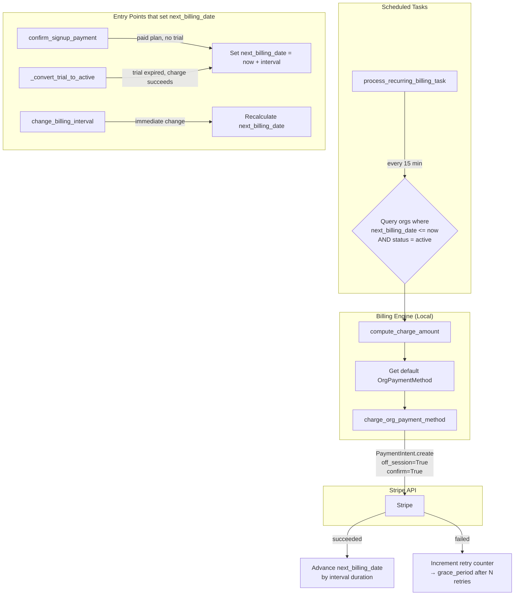

# Design Document: Direct Stripe Billing

## Overview

This feature replaces Stripe Subscription management with direct PaymentIntent-based charging. The application already manages plans, billing intervals, and subscription lifecycle locally. Stripe becomes a pure payment processor — we call `PaymentIntent.create(off_session=True, confirm=True)` against saved payment methods when charges are due.

The motivation is pragmatic: the Stripe account has 0 active subscriptions, and the existing `create_subscription_from_trial` call silently fails due to a Stripe v14 `product_data` incompatibility. Rather than fix the Subscription integration, we lean into the architecture the app already uses — local billing state with Stripe as a charge API.

### Key Changes

1. Add `next_billing_date` to `Organisation` to track when each org is next due for payment
2. New `charge_org_payment_method` function that creates a confirmed off-session PaymentIntent
3. New `process_recurring_billing_task` scheduled task that finds due orgs and charges them
4. Remove all Stripe Subscription CRUD functions (`create_subscription_from_trial`, `update_subscription_interval`, `update_subscription_plan`, `get_subscription_details`, `handle_subscription_webhook`)
5. Update signup, trial conversion, interval changes, and billing dashboard to use local billing state

## Architecture



### Data Flow

- **Signup (paid, no trial):** `confirm_signup_payment` → creates org with `status=active`, sets `next_billing_date = now + interval_duration`. No Stripe Subscription created.
- **Trial → Active:** `_convert_trial_to_active` → charges first payment via `charge_org_payment_method` → sets `status=active`, `next_billing_date = now + interval_duration`.
- **Recurring billing:** `process_recurring_billing_task` runs every 15 minutes → queries due orgs → computes amount → calls `charge_org_payment_method` → advances `next_billing_date`.
- **Interval change (immediate):** Updates `org.billing_interval` and recalculates `next_billing_date = now + new_interval_duration`. No Stripe call.
- **Interval change (scheduled):** Stores pending change in `org.settings`. Applied by the recurring billing task at the end of the current period.
- **Dashboard:** Reads `next_billing_date` directly from the `Organisation` record. No Stripe subscription query.

## Components and Interfaces

### 1. `charge_org_payment_method` — New Function in `stripe_billing.py`

```python
async def charge_org_payment_method(
    *,
    customer_id: str,
    payment_method_id: str,
    amount_cents: int,
    currency: str = "nzd",
    metadata: dict | None = None,
) -> dict:
    """Charge a saved payment method off-session.

    Creates a PaymentIntent with off_session=True, confirm=True.

    Returns:
        {"payment_intent_id": str, "status": str, "amount_cents": int}

    Raises:
        PaymentFailedError: on CardError (includes decline_code)
        PaymentActionRequiredError: when authentication is needed
    """
```

This function is the single entry point for all recurring and trial-conversion charges. It wraps `stripe.PaymentIntent.create` with:
- `customer=customer_id`
- `payment_method=payment_method_id`
- `amount=amount_cents`
- `currency=currency`
- `off_session=True`
- `confirm=True`
- `metadata=metadata`

### 2. `compute_interval_duration` — New Helper in `interval_pricing.py`

```python
from datetime import timedelta
from dateutil.relativedelta import relativedelta

def compute_interval_duration(interval: BillingInterval) -> timedelta | relativedelta:
    """Return the duration for a billing interval.

    - weekly: timedelta(days=7)
    - fortnightly: timedelta(days=14)
    - monthly: relativedelta(months=1)
    - annual: relativedelta(years=1)
    """
```

Used by signup, trial conversion, recurring billing, and interval changes to advance `next_billing_date`.

### 3. `process_recurring_billing_task` — New Task in `subscriptions.py`

```python
async def process_recurring_billing_task() -> dict:
    """Find orgs due for billing and charge them.

    Query: status='active', next_billing_date IS NOT NULL,
           next_billing_date <= utcnow()

    For each org:
    1. Load plan + interval config → compute_effective_price
    2. Apply active coupon discount (if any)
    3. Get default OrgPaymentMethod
    4. Call charge_org_payment_method
    5. On success: advance next_billing_date by interval duration
    6. On failure: increment retry, transition to grace_period after MAX_RETRIES
    """
```

Registered in `_DAILY_TASKS` in `scheduled.py` with a 900-second (15-minute) interval.

### 4. Modified `confirm_signup_payment` — `auth/router.py`

Changes:
- Remove import of `create_subscription_from_trial`
- Remove the entire "5b. Create Stripe Subscription" block
- After creating the org, set `org.next_billing_date = now + compute_interval_duration(billing_interval)` for paid plans with `interval_amount_cents > 0`
- Do not set `org.stripe_subscription_id`

### 5. Modified `_convert_trial_to_active` — `tasks/subscriptions.py`

Changes:
- Replace `create_subscription_from_trial` call with `charge_org_payment_method`
- On success: set `org.status = "active"`, `org.next_billing_date = now + compute_interval_duration(billing_interval)`
- On failure: set `org.status = "grace_period"`, log the error
- Do not set `org.stripe_subscription_id`

### 6. Modified `change_billing_interval` — `billing/router.py`

Changes:
- Remove all calls to `update_subscription_interval` and `get_subscription_details`
- Remove Stripe rollback logic (no Stripe calls to fail)
- **Immediate change (longer interval):** Update `org.billing_interval`, set `org.next_billing_date = now + compute_interval_duration(new_interval)`
- **Scheduled change (shorter interval):** Store pending change in `org.settings` with `effective_at = org.next_billing_date`. The recurring billing task applies it when the current period ends.
- Remove 502 error responses (Stripe is not involved)

### 7. Modified `get_billing_dashboard` — `billing/router.py`

Changes:
- Remove `get_subscription_details` call and the Stripe-based `next_billing_date` lookup
- Read `next_billing_date` directly from `org.next_billing_date`
- Return `None` for `next_billing_date` when `org.status == "trial"`
- Remove the fallback `relativedelta(months=1)` walk-forward logic

### 8. Functions Removed from `stripe_billing.py`

| Function | Reason |
|---|---|
| `create_subscription_from_trial` | Replaced by `charge_org_payment_method` |
| `update_subscription_interval` | Interval changes are local-only |
| `update_subscription_plan` | Plan changes are local-only |
| `get_subscription_details` | Dashboard reads local `next_billing_date` |
| `handle_subscription_webhook` | No subscriptions to receive webhooks for |

### 9. Functions Retained in `stripe_billing.py`

- `create_stripe_customer`
- `create_setup_intent`
- `create_payment_intent` / `create_payment_intent_no_customer`
- `list_payment_methods`
- `set_default_payment_method`
- `detach_payment_method`
- `create_invoice_item`
- `report_metered_usage`
- `create_billing_portal_session`
- `charge_org_payment_method` (new)

### 10. Custom Exception Classes

```python
class PaymentFailedError(Exception):
    """Raised when a PaymentIntent fails due to a card error."""
    def __init__(self, message: str, decline_code: str | None = None):
        self.decline_code = decline_code
        super().__init__(message)

class PaymentActionRequiredError(Exception):
    """Raised when a PaymentIntent requires additional authentication."""
    pass
```

Defined in `stripe_billing.py` alongside the new `charge_org_payment_method` function.

## Data Models

### Organisation Table — New Column

```sql
ALTER TABLE organisations
ADD COLUMN next_billing_date TIMESTAMPTZ NULL;
```

**Alembic migration:** `alembic/versions/XXXX_add_next_billing_date.py`

```python
def upgrade():
    op.add_column(
        "organisations",
        sa.Column("next_billing_date", sa.DateTime(timezone=True), nullable=True),
    )

def downgrade():
    op.drop_column("organisations", "next_billing_date")
```

**SQLAlchemy model addition** to `Organisation` in `app/modules/admin/models.py`:

```python
next_billing_date: Mapped[datetime | None] = mapped_column(
    DateTime(timezone=True), nullable=True
)
```

### `next_billing_date` State Machine

| Org Status | `next_billing_date` Value |
|---|---|
| `trial` | `NULL` |
| `active` (just created, paid plan) | `now() + interval_duration` |
| `active` (trial converted) | `now() + interval_duration` (set after first charge) |
| `active` (after recurring charge) | Previous value + `interval_duration` |
| `grace_period` | Retains last value (retry logic uses it) |
| `suspended` | Retains last value |
| `deleted` | Retains last value |

### Interval Duration Mapping

| Billing Interval | Duration |
|---|---|
| `weekly` | `timedelta(days=7)` |
| `fortnightly` | `timedelta(days=14)` |
| `monthly` | `relativedelta(months=1)` |
| `annual` | `relativedelta(years=1)` |

### Charge Amount Computation

For a given org with plan `P`, billing interval `I`, interval discount `D%`, and optional active coupon:

```
annualised       = P.monthly_price_nzd × 12
per_cycle        = annualised / INTERVAL_PERIODS_PER_YEAR[I]
after_interval   = per_cycle × (1 − D / 100)
after_coupon     = apply_coupon_to_interval_price(after_interval, coupon)
amount_cents     = int(after_coupon × 100)
```

This reuses the existing `compute_effective_price` and `apply_coupon_to_interval_price` functions from `interval_pricing.py`.

### Retry / Grace Period Configuration

```python
MAX_BILLING_RETRIES = 3
GRACE_PERIOD_DAYS = 7
```

Stored as constants in `subscriptions.py`. After `MAX_BILLING_RETRIES` consecutive failures, the org transitions to `grace_period`. The existing `check_grace_period_task` handles suspension after `GRACE_PERIOD_DAYS`.

### `stripe_subscription_id` Deprecation

The column remains on the `organisations` table but:
- No code path writes to it
- No code path reads from it for billing logic
- A future migration will drop the column after confirming no data dependencies

## Correctness Properties

*A property is a characteristic or behavior that should hold true across all valid executions of a system — essentially, a formal statement about what the system should do. Properties serve as the bridge between human-readable specifications and machine-verifiable correctness guarantees.*

### Property 1: Active org next_billing_date is set correctly

*For any* Organisation that transitions to `status="active"` (whether via paid signup or trial conversion), `next_billing_date` must equal the activation timestamp plus `compute_interval_duration(org.billing_interval)`.

**Validates: Requirements 1.2, 1.3, 3.1, 3.3, 4.2**

### Property 2: Trial orgs have null next_billing_date

*For any* Organisation with `status="trial"`, `next_billing_date` must be `NULL`. This holds both at the model level and in the billing dashboard API response.

**Validates: Requirements 1.4, 8.3**

### Property 3: charge_org_payment_method creates correct PaymentIntent

*For any* valid combination of `customer_id`, `payment_method_id`, `amount_cents > 0`, and `currency`, calling `charge_org_payment_method` must create a Stripe PaymentIntent with `off_session=True` and `confirm=True`, and on success return a dict containing `payment_intent_id`, `status`, and `amount_cents` matching the input.

**Validates: Requirements 2.2, 2.3**

### Property 4: CardError raises PaymentFailedError with decline code

*For any* Stripe CardError response, `charge_org_payment_method` must raise `PaymentFailedError` containing the Stripe error message and the `decline_code` from the error.

**Validates: Requirements 2.4**

### Property 5: Recurring billing query returns exactly due orgs

*For any* set of organisations with varying statuses and `next_billing_date` values, the recurring billing query must return exactly those where `status="active"` AND `next_billing_date IS NOT NULL` AND `next_billing_date <= now()`.

**Validates: Requirements 5.1**

### Property 6: Charge amount matches pricing formula

*For any* plan with `monthly_price_nzd > 0`, billing interval `I`, interval discount `D%`, and optional coupon, the computed charge amount in cents must equal `int(apply_coupon_to_interval_price(compute_effective_price(monthly_price, I, D), coupon) × 100)`.

**Validates: Requirements 5.2**

### Property 7: Successful charge advances next_billing_date by interval duration

*For any* Organisation with billing interval `I` and current `next_billing_date = T`, after a successful recurring charge, `next_billing_date` must equal `T + compute_interval_duration(I)`.

**Validates: Requirements 5.4**

### Property 8: Consecutive charge failures transition to grace_period

*For any* active Organisation, after `MAX_BILLING_RETRIES` consecutive charge failures, the Organisation's status must be `"grace_period"`.

**Validates: Requirements 4.4, 5.5**

### Property 9: Independent org processing on failure

*For any* set of due organisations where some charges fail and some succeed, all successful charges must still advance their `next_billing_date`, regardless of failures in other orgs.

**Validates: Requirements 5.6**

### Property 10: Immediate interval change recalculates next_billing_date

*For any* Organisation changing to a longer billing interval (fewer periods per year), `next_billing_date` must be recalculated as `now() + compute_interval_duration(new_interval)`.

**Validates: Requirements 6.2**

### Property 11: Scheduled interval change stores pending change

*For any* Organisation changing to a shorter billing interval (more periods per year), the pending change must be stored in `org.settings["pending_interval_change"]` with `effective_at` equal to the current `next_billing_date`.

**Validates: Requirements 6.3**

### Property 12: Dashboard returns local next_billing_date

*For any* active Organisation with a non-null `next_billing_date`, the billing dashboard response's `next_billing_date` field must equal `org.next_billing_date`.

**Validates: Requirements 8.1**

## Error Handling

### Payment Failures

| Scenario | Handling |
|---|---|
| `stripe.error.CardError` | Raise `PaymentFailedError` with message + decline_code. Caller logs and increments retry counter. |
| PaymentIntent `status="requires_action"` | Raise `PaymentActionRequiredError`. Off-session payments cannot handle 3DS challenges — the org is notified to update their payment method. |
| Stripe API timeout / network error | Caught as generic `stripe.error.StripeError`. Logged, retry counter incremented. |
| No default payment method | Skip org in recurring billing, log warning. Do not transition to grace_period (no charge was attempted). |
| Payment method expired | Handled by existing `check_card_expiry_task` which notifies org admins. Charge will fail with CardError. |

### Retry Strategy

- `MAX_BILLING_RETRIES = 3` consecutive failures before grace_period
- Retry counter stored in `org.settings["billing_retry_count"]`
- Counter resets to 0 on successful charge
- Existing `check_grace_period_task` handles suspension after `GRACE_PERIOD_DAYS`

### Interval Change Edge Cases

- **No-op:** Same interval → return 400 (already handled)
- **Trial org:** Cannot change interval (no active billing). Return 400.
- **Grace period org:** Interval change is allowed (updates local state for when billing resumes)

## Testing Strategy

### Property-Based Tests

Use `hypothesis` (Python) for backend property tests. Each test runs a minimum of 100 iterations.

| Test | Property | Library |
|---|---|---|
| `test_active_org_next_billing_date` | Property 1 | hypothesis |
| `test_trial_org_null_billing_date` | Property 2 | hypothesis |
| `test_charge_creates_correct_payment_intent` | Property 3 | hypothesis |
| `test_card_error_raises_payment_failed` | Property 4 | hypothesis |
| `test_recurring_billing_query_filter` | Property 5 | hypothesis |
| `test_charge_amount_matches_formula` | Property 6 | hypothesis |
| `test_successful_charge_advances_date` | Property 7 | hypothesis |
| `test_max_retries_transitions_to_grace` | Property 8 | hypothesis |
| `test_independent_org_processing` | Property 9 | hypothesis |
| `test_immediate_interval_change_date` | Property 10 | hypothesis |
| `test_scheduled_interval_change_pending` | Property 11 | hypothesis |
| `test_dashboard_returns_local_date` | Property 12 | hypothesis |

Each test is tagged with: `# Feature: direct-stripe-billing, Property N: <property_text>`

### Unit Tests

Unit tests cover specific examples, edge cases, and integration points:

- **Signup flow:** Verify `confirm_signup_payment` creates org with correct `next_billing_date` and no `stripe_subscription_id`
- **Trial conversion:** Verify `_convert_trial_to_active` charges card and sets correct state
- **Code removal:** Verify `stripe_billing.py` no longer exports removed functions (Requirements 7.1–7.5)
- **Code retention:** Verify retained functions still exist (Requirement 7.6)
- **Dashboard:** Verify `get_billing_dashboard` does not call `get_subscription_details`
- **Interval change:** Verify no Stripe calls are made during interval changes
- **Edge cases:** Free plan (amount=0) skips charging, org with no payment method is skipped

### Test File Locations

- `tests/properties/test_direct_billing_properties.py` — Property-based tests
- `tests/test_direct_billing.py` — Unit tests and integration tests
