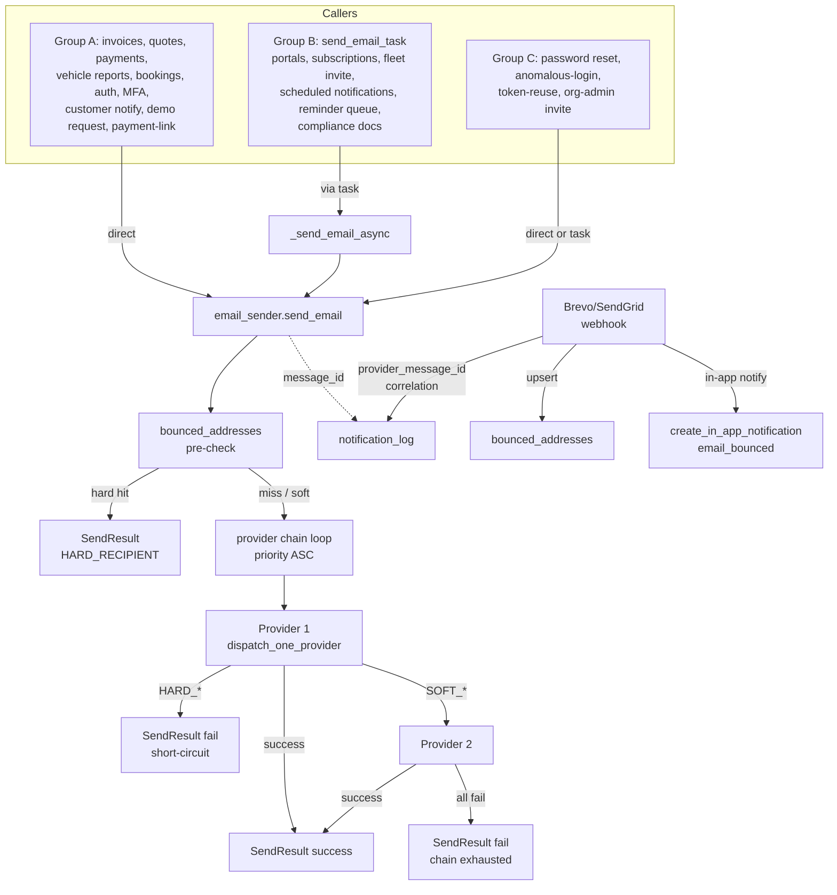
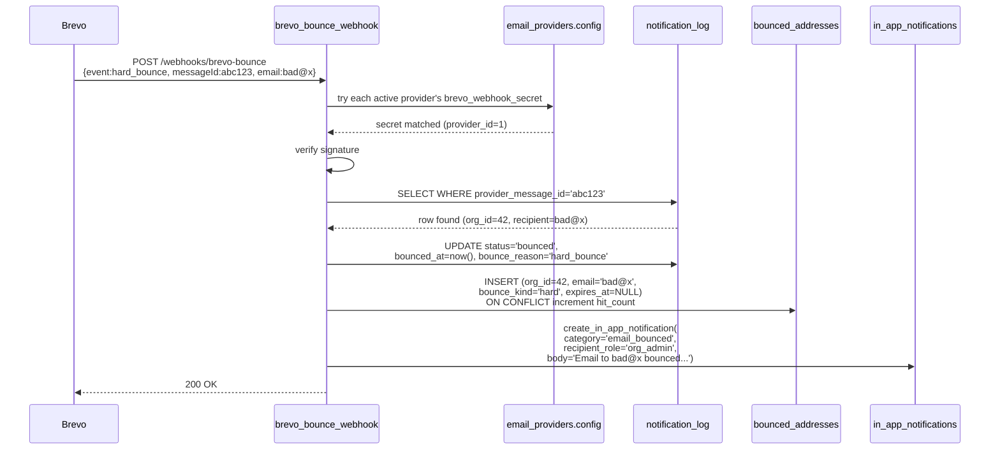

# Design Document: Email Provider Unification

## Overview

This design implements the gap-audited plan in [`plan.md`](plan.md) (Sections 1–14) and the user-facing requirements in [`requirements.md`](requirements.md) (Requirements 1–25).

**One-line summary:** Replace 14 hand-rolled `smtplib` loops, 18 zero-failover `send_email_task` callers, and 4 logger-only stubs with a single async `send_email()` function that reads the `email_providers` table, attempts each active provider in priority order, classifies failures, and falls over to the next provider on retryable errors. Add bounce correlation and a recipient blocklist so a Brevo or SendGrid webhook event flips the originating `notification_log` row to `bounced` and the next outbound to a known-bad address is short-circuited before any provider is tried.

**Key design goals:**

- **One source of truth.** All outbound email goes through `app/integrations/email_sender.py::send_email()`. The `email_providers` table is the only configuration source read at runtime.
- **Backwards-compatible cutover.** Each phase ships independently. The legacy `send_org_email` shim translates the new `SendResult` shape to the old shape for one release so existing tests stay green.
- **Fail fast on hard errors, fall over on soft errors.** A bad recipient address or oversize payload short-circuits the chain. A revoked API key or network glitch falls over to the next provider.
- **Bounded latency.** Every send call is bounded by a per-attempt timeout and a total time budget so a frozen provider can't stall a request past one nginx keepalive cycle.
- **Observability.** Every send writes `provider_key`, `provider_message_id`, and the full `EmailAttempt` chain. Bounce webhooks correlate back to the originating `notification_log` row.

**Out of scope (explicit non-goals):** Per-org email providers, dual-write between `integration_configs[smtp]` and `email_providers`, `is_verified` parity in v1, Mailgun `domain` field, inbound email parsing, email template content changes.

---

## Architecture

### High-Level Flow



### Module Boundary

```
app/integrations/
├── email_sender.py          (NEW — Phase 1)
│   ├── EmailMessage / EmailAttachment    (dataclasses)
│   ├── EmailAttempt / SendResult / FailureKind
│   ├── EMAIL_SIZE_LIMIT / *_TIMEOUT_*    (constants)
│   ├── send_email()                      (public entry point)
│   ├── dispatch_one_provider()           (public helper for test endpoint)
│   ├── _dispatch_brevo_rest()            (private)
│   ├── _dispatch_sendgrid_rest()         (private)
│   ├── _dispatch_smtp()                  (private)
│   ├── _classify_*_error()               (private)
│   ├── _build_mime_message()             (private)
│   └── _check_bounce_blocklist()         (private)
│
└── brevo.py                 (Phase 2 — shim; Phase 9 — delete)
    └── re-exports + send_org_email shim
```

`email_sender.py` is the **only** module that imports `smtplib`, `httpx` for Brevo/SendGrid REST, and `email.mime.*`. Every caller imports `EmailMessage`, `EmailAttachment`, and `send_email` from it.

### Sequence Diagram — Successful Failover (Provider 1 auth-fails, Provider 2 delivers)

```mermaid
sequenceDiagram
    participant Caller as email_invoice (A1)
    participant Sender as send_email
    participant Block as bounced_addresses
    participant P1 as Provider 1<br/>(Brevo REST)
    participant P2 as Provider 2<br/>(SendGrid REST)
    participant Log as notification_log

    Caller->>Sender: send_email(db, msg, org_sender_name=org.name)
    Sender->>Block: SELECT WHERE email_address=msg.to_email
    Block-->>Sender: no rows
    Sender->>Sender: load Active_Provider_Set ORDER BY priority
    Sender->>P1: POST api.brevo.com/v3/smtp/email
    P1-->>Sender: 401 Unauthorized
    Sender->>Sender: classify SOFT_AUTH; record EmailAttempt
    Sender->>P2: POST api.sendgrid.com/v3/mail/send
    P2-->>Sender: 202 + X-Message-Id: abc123
    Sender->>Sender: record EmailAttempt success
    Sender-->>Caller: SendResult(success=True, provider_key='sendgrid', message_id='abc123', attempts=[...×2])
    Caller->>Log: log_email_sent(provider_key='sendgrid',<br/>provider_message_id='abc123', status='sent')
```

### Sequence Diagram — Bounce Webhook Correlation



---

## Components and Interfaces

### 1. Dataclasses (`email_sender.py`)

```python
from dataclasses import dataclass, field
from enum import Enum

@dataclass
class EmailAttachment:
    filename: str
    content: bytes
    mime_type: str = "application/octet-stream"

@dataclass
class EmailMessage:
    to_email: str
    to_name: str | None
    subject: str
    html_body: str | None = None
    text_body: str | None = None
    attachments: list[EmailAttachment] = field(default_factory=list)
    org_id: uuid.UUID | None = None   # used for bounce-blocklist scoping; None = public/external

class FailureKind(str, Enum):
    HARD_RECIPIENT = "hard_recipient"   # bad email address — short-circuits chain
    HARD_PAYLOAD   = "hard_payload"     # message too large / malformed — short-circuits chain
    SOFT_AUTH      = "soft_auth"        # one provider's creds bad — try next
    SOFT_PROVIDER  = "soft_provider"    # network / 5xx / timeout — try next
    BUDGET_EXCEEDED = "budget_exceeded" # total time budget hit — abort chain

@dataclass
class EmailAttempt:
    provider_key: str
    transport: str                      # 'rest_api' | 'smtp'
    success: bool
    error: str | None = None
    failure_kind: FailureKind | None = None
    duration_ms: int = 0

@dataclass
class SendResult:
    success: bool
    provider_key: str | None = None
    transport: str | None = None
    message_id: str | None = None
    error: str | None = None
    attempts: list[EmailAttempt] = field(default_factory=list)

    # Backwards-compat alias used by tests (test_security_focused.py:359, etc.)
    @property
    def provider(self) -> str:
        return self.provider_key or ""
```

**Why dataclasses, not Pydantic:** these are internal value objects, never serialised to API responses. Pydantic adds validation overhead per send; dataclasses are zero-cost.

### 2. Constants

```python
EMAIL_SIZE_LIMIT             = 25 * 1024 * 1024   # 25 MB total payload (matches existing invoice flow)
EMAIL_PER_ATTEMPT_TIMEOUT_SECONDS = 15
EMAIL_TOTAL_BUDGET_SECONDS        = 45
BOUNCE_SOFT_EXPIRY_DAYS      = 7
NO_PROVIDERS_DEDUP_SECONDS   = 60 * 60      # 1 hour
ALL_AUTH_FAIL_DEDUP_SECONDS  = 24 * 60 * 60 # 1 day
```

### 3. Public API

```python
async def send_email(
    db: AsyncSession,
    message: EmailMessage,
    *,
    org_sender_name: str | None = None,
    org_reply_to: str | None = None,
) -> SendResult:
    '''Single entry point. Loads active providers, attempts each in priority order,
    returns the first success or the final failure with full attempt history.

    Caller responsibilities:
      - Open and own the AsyncSession (do NOT call db.commit() — caller's
        get_db_session dependency does that via session.begin()).
      - Provide org_sender_name when an org-specific friendly name should
        appear in the From header (e.g. notify_customer passes org.name).
      - On result.success: persist provider_key + provider_message_id via
        update_log_status / log_email_sent.
      - On not result.success: decide whether to fire create_in_app_notification.
    '''

async def dispatch_one_provider(
    db: AsyncSession,
    provider: EmailProvider,
    message: EmailMessage,
    *,
    org_sender_name: str | None = None,
    org_reply_to: str | None = None,
    timeout_seconds: int = EMAIL_PER_ATTEMPT_TIMEOUT_SECONDS,
) -> EmailAttempt:
    '''Public helper used by the per-provider admin test endpoint
    (email_providers/service.py::test_email_provider). Dispatches to a SINGLE
    provider (no failover, no blocklist check) and returns the attempt outcome.
    Phase 3 refactor: replaces the inline SMTP block in test_email_provider.
    '''
```

### 4. Private Dispatch Functions

```python
async def _dispatch_brevo_rest(
    provider: EmailProvider, message: EmailMessage,
    *, from_name: str, from_email: str, reply_to: str | None,
    timeout_seconds: int,
) -> EmailAttempt:
    '''POST https://api.brevo.com/v3/smtp/email with api-key header.
    Captures messageId from JSON response.
    '''

async def _dispatch_sendgrid_rest(...) -> EmailAttempt:
    '''POST https://api.sendgrid.com/v3/mail/send with Bearer api_key.
    Captures X-Message-Id from response headers.
    '''

async def _dispatch_smtp(...) -> EmailAttempt:
    '''Wraps smtplib in asyncio.to_thread().
    Honours smtp_encryption ∈ {none, tls, ssl}.
    Builds MIME message with multipart/mixed (attachments) or
    multipart/alternative (HTML+text only).
    Generates RFC 5322 Message-ID for SMTP message_id capture.
    '''
```

### 5. Error Classification

```python
def _classify_brevo_rest_error(response: httpx.Response, exc: Exception | None) -> FailureKind:
    if exc is not None:
        return _classify_network_exc(exc)
    if response.status_code in (401, 403):
        return FailureKind.SOFT_AUTH
    if response.status_code == 400:
        body = response.json() if response.headers.get("content-type", "").startswith("application/json") else {}
        if body.get("code") == "invalid_parameter" and "email" in (body.get("message") or "").lower():
            return FailureKind.HARD_RECIPIENT
        return FailureKind.SOFT_PROVIDER  # malformed payload our side, but not safe to retry on others either — TODO mark hard?
    if response.status_code == 413:
        return FailureKind.HARD_PAYLOAD
    return FailureKind.SOFT_PROVIDER

def _classify_smtp_error(exc: Exception) -> FailureKind:
    import smtplib
    if isinstance(exc, smtplib.SMTPRecipientsRefused):
        return FailureKind.HARD_RECIPIENT
    if isinstance(exc, smtplib.SMTPDataError) and getattr(exc, "smtp_code", 0) == 552:
        return FailureKind.HARD_PAYLOAD
    if isinstance(exc, smtplib.SMTPAuthenticationError):
        return FailureKind.SOFT_AUTH
    return FailureKind.SOFT_PROVIDER
```

The classification rules are documented in [Requirement 5](requirements.md#requirement-5-error-classification-and-time-budget).

### 6. Sender Identity Precedence

```python
def _resolve_sender_identity(
    provider: EmailProvider,
    *, org_sender_name: str | None, org_reply_to: str | None,
) -> tuple[str, str | None, str | None] | None:
    '''Returns (from_name, from_email, reply_to) or None to skip provider.

    from_name  = org_sender_name OR provider.config['from_name'] OR ""
    from_email = provider.config['from_email'] OR None  (None → skip provider)
    reply_to   = org_reply_to OR provider.config['reply_to'] OR None
    '''
    config = provider.config or {}
    from_email = config.get("from_email")
    if not from_email:
        return None  # SKIP this provider with SOFT_PROVIDER 'missing from_email'
    from_name = org_sender_name or config.get("from_name") or ""
    reply_to = org_reply_to or config.get("reply_to")
    return from_name, from_email, reply_to
```

### 7. Bounce Blocklist Pre-Check

```python
async def _check_bounce_blocklist(
    db: AsyncSession, *, org_id: uuid.UUID | None, email_address: str,
) -> tuple[bool, str | None]:
    '''Returns (is_blocked, reason). Blocked when an unexpired hard-bounce
    row exists for (org_id, email_address). Soft bounces never block; they
    return (False, 'soft_bounce_observed') so callers can log a warning.
    '''
    stmt = select(BouncedAddress).where(
        BouncedAddress.email_address == email_address,
        sa.or_(
            BouncedAddress.org_id == org_id,
            BouncedAddress.org_id.is_(None),  # platform-wide bounces apply to all orgs
        ),
        sa.or_(
            BouncedAddress.expires_at.is_(None),
            BouncedAddress.expires_at > sa.func.now(),
        ),
    )
    rows = (await db.execute(stmt)).scalars().all()
    for row in rows:
        if row.bounce_kind == "hard":
            return True, row.reason or "hard bounce on file"
    if rows:
        return False, "soft bounce observed (proceeding)"
    return False, None
```

### 8. Main Loop

```python
async def send_email(db, message, *, org_sender_name=None, org_reply_to=None) -> SendResult:
    started = time.monotonic()
    # 0. Payload pre-check
    total_size = len(message.html_body or "") + len(message.text_body or "")
    total_size += sum(len(a.content) for a in message.attachments)
    if total_size > EMAIL_SIZE_LIMIT:
        return SendResult(success=False, error="attachment size exceeds limit",
                          attempts=[EmailAttempt(provider_key="", transport="",
                                                 success=False, failure_kind=FailureKind.HARD_PAYLOAD,
                                                 error="attachment size exceeds limit")])

    # 1. Bounce blocklist pre-check
    blocked, reason = await _check_bounce_blocklist(
        db, org_id=message.org_id, email_address=message.to_email
    )
    if blocked:
        return SendResult(success=False, error="recipient is on the bounce list",
                          attempts=[EmailAttempt(provider_key="bouncelist", transport="precheck",
                                                 success=False, failure_kind=FailureKind.HARD_RECIPIENT,
                                                 error=reason or "blocked")])

    # 2. Load active providers
    providers = await _load_active_providers(db)
    if not providers:
        await _maybe_fire_no_providers_alert(db)
        return SendResult(success=False, error="No active email providers configured",
                          attempts=[])

    # 3. Loop with budget
    attempts: list[EmailAttempt] = []
    for provider in providers:
        if time.monotonic() - started > EMAIL_TOTAL_BUDGET_SECONDS:
            attempts.append(EmailAttempt(provider_key=provider.provider_key, transport="",
                                         success=False, failure_kind=FailureKind.BUDGET_EXCEEDED,
                                         error="time budget exceeded"))
            break
        attempt = await dispatch_one_provider(
            db, provider, message,
            org_sender_name=org_sender_name, org_reply_to=org_reply_to,
        )
        attempts.append(attempt)
        if attempt.success:
            return SendResult(success=True, provider_key=provider.provider_key,
                              transport=attempt.transport, message_id=attempt.error,  # message_id passed via separate field
                              attempts=attempts)
        if attempt.failure_kind in (FailureKind.HARD_RECIPIENT, FailureKind.HARD_PAYLOAD):
            return SendResult(success=False, error=attempt.error, attempts=attempts)

    # 4. Chain exhausted — check if all SOFT_AUTH for the special alert
    if attempts and all(a.failure_kind == FailureKind.SOFT_AUTH for a in attempts):
        await _maybe_fire_all_auth_fail_alert(db)

    last = attempts[-1] if attempts else None
    return SendResult(success=False, error=(last.error if last else "unknown"), attempts=attempts)
```

The implementation above is illustrative; final form may rename `message_id` capture to a dedicated field on `EmailAttempt` rather than reusing `error`. The tests in Phase 1 will pin the exact contract.

### 9. send_email_task Rewrite

Located at `app/tasks/notifications.py::_send_email_async`:

```python
async def _send_email_async(
    log_id: str, to_email: str, subject: str,
    *, html_body: str | None = None, text_body: str | None = None,
    to_name: str | None = None, org_sender_name: str | None = None,
    org_reply_to: str | None = None, template_type: str | None = None,
    org_id: str | None = None,
) -> dict:
    from app.core.database import async_session_factory
    from app.integrations.email_sender import send_email, EmailMessage
    from app.modules.notifications.service import update_log_status

    async with async_session_factory() as session:
        async with session.begin():
            org_uuid = uuid.UUID(org_id) if org_id else None
            message = EmailMessage(
                to_email=to_email, to_name=to_name, subject=subject,
                html_body=html_body, text_body=text_body, attachments=[],
                org_id=org_uuid,
            )
            result = await send_email(
                session, message,
                org_sender_name=org_sender_name, org_reply_to=org_reply_to,
            )
            if result.success:
                await update_log_status(
                    session, log_id=uuid.UUID(log_id),
                    status="sent", sent_at=datetime.now(timezone.utc),
                    provider_key=result.provider_key,
                    provider_message_id=result.message_id,
                )
                return {"success": True, "message_id": result.message_id,
                        "provider": result.provider_key}
            await update_log_status(
                session, log_id=uuid.UUID(log_id),
                status="failed", error_message=result.error,
            )
            return {"success": False, "error": result.error or "Unknown email send error"}
```

This single function fixes all 18 Group B sites at once.

### 10. Backwards-Compat Shim (Phase 2 → Phase 9)

`app/integrations/brevo.py` becomes a thin shim:

```python
# DEPRECATED — for one release only. Phase 9 deletes this file.
from app.integrations.email_sender import (
    EmailMessage, EmailAttachment, SendResult,  # re-exports
    send_email,
)

# Old signature; tests assert on result.provider — supplied via SendResult.provider @property.
async def send_org_email(
    db, *, to_email, to_name, subject, html_body=None, text_body=None,
    attachments=None, org_sender_name=None, org_reply_to=None, **_,
) -> SendResult:
    msg = EmailMessage(
        to_email=to_email, to_name=to_name, subject=subject,
        html_body=html_body, text_body=text_body,
        attachments=attachments or [],
    )
    return await send_email(db, msg,
                            org_sender_name=org_sender_name,
                            org_reply_to=org_reply_to)

class SmtpConfig: ...   # legacy stub used by test_email_infrastructure.py
class EmailClient: ...  # legacy stub
async def get_email_client(db): ...
async def load_smtp_config_from_db(db): ...
```

The shims internally call the new sender; they do **not** re-implement the old SMTP path.

---

## Data Model

### Existing tables (reference, no schema change)

#### `email_providers`

| Column | Type | Notes |
|---|---|---|
| `id` | UUID | PK |
| `provider_key` | VARCHAR(50) | Unique; one of `brevo`, `sendgrid`, `mailgun`, `ses`, `gmail`, `outlook`, `custom_smtp` |
| `display_name`, `description`, `setup_guide` | TEXT | Admin-facing |
| `smtp_host` | VARCHAR | Nullable, falls back to default-host table |
| `smtp_port` | INT | Nullable |
| `smtp_encryption` | VARCHAR | One of `none`, `tls`, `ssl` |
| `priority` | INT | Lower = first try; required for failover ordering |
| `is_active` | BOOLEAN | Multi-active allowed |
| `credentials_set` | BOOLEAN | True after admin saves credentials |
| `credentials_encrypted` | BYTEA | JSON blob, envelope-encrypted |
| `config` | JSONB | `{from_email, from_name, reply_to}` plus per-provider extras like `brevo_webhook_secret` (added in Phase 8c) |
| `created_at`, `updated_at` | TIMESTAMPTZ | |

`credentials_encrypted` decrypts to a JSON object whose shape varies by provider:
- `brevo`: `{"api_key": "xkeysib-...", "smtp_login": "user@brevo.com" | null}`
- `sendgrid`: `{"api_key": "SG...."}`
- `mailgun`, `ses`, `gmail`, `outlook`, `custom_smtp`: `{"username": "...", "password": "..."}`

### Schema changes — Phase 8a (additive, with Phase 2)

#### `notification_log` — new columns

| Column | Type | Notes |
|---|---|---|
| `provider_key` | VARCHAR(50) | NULL allowed; populated by `update_log_status` after success |
| `provider_message_id` | TEXT | NULL allowed; from Brevo `messageId` / SendGrid `X-Message-Id` / RFC 5322 SMTP Message-ID |
| `bounced_at` | TIMESTAMPTZ | NULL allowed; set by bounce webhook |
| `bounce_reason` | TEXT | NULL allowed; verbatim from webhook event |
| `delivered_at` | TIMESTAMPTZ | NULL allowed; set by Brevo `delivered` event |

Indexes:
- `ix_notification_log_provider_message_id ON notification_log(provider_message_id) WHERE provider_message_id IS NOT NULL` — partial index for webhook lookup; excludes the (large) NULL legacy rows.
- `ix_notification_log_provider_key ON notification_log(provider_key)` — non-partial; useful for forensic queries.

State transitions (verified by property test in Phase 8c):

```
queued ──► sent ──┬─► delivered
                  └─► bounced
queued ──► failed
```

### Schema changes — Phase 8c (new table)

#### `bounced_addresses`

| Column | Type | Constraints |
|---|---|---|
| `id` | UUID | PK, default `gen_random_uuid()` |
| `org_id` | UUID | NULL allowed (NULL = platform-wide block); FK → `organisations.id` ON DELETE CASCADE |
| `email_address` | TEXT | NOT NULL, lowercased |
| `bounce_kind` | VARCHAR(10) | NOT NULL, CHECK in (`hard`, `soft`, `blocked`) |
| `reason` | TEXT | NULL allowed |
| `first_seen_at` | TIMESTAMPTZ | NOT NULL, default `now()` |
| `last_seen_at` | TIMESTAMPTZ | NOT NULL, default `now()` |
| `hit_count` | INT | NOT NULL, default 1 |
| `expires_at` | TIMESTAMPTZ | NULL allowed (NULL = never expires; set for `soft` bounces only) |

Indexes:
- `UNIQUE (COALESCE(org_id::text, ''), LOWER(email_address))` — one row per (org, address). The COALESCE expression handles NULL `org_id` (platform-wide block); the LOWER ensures case-insensitive match.
- `ix_bounced_addresses_email ON bounced_addresses(LOWER(email_address))`
- `ix_bounced_addresses_expires ON bounced_addresses(expires_at) WHERE expires_at IS NOT NULL`

The COALESCE in the UNIQUE constraint requires PostgreSQL 11+ (functional unique indexes). All target environments are PG 16.

#### Daily cleanup task

A new entry in `app/tasks/scheduled.py`:

```python
async def cleanup_expired_bounce_rows() -> dict:
    '''Delete bounced_addresses rows where expires_at < now().
    Hard bounces (expires_at IS NULL) are never deleted by this task —
    admins must clear them manually via the Delivery Health UI.
    '''
    async with async_session_factory() as session:
        async with session.begin():
            result = await session.execute(
                delete(BouncedAddress).where(
                    BouncedAddress.expires_at.is_not(None),
                    BouncedAddress.expires_at < sa.func.now(),
                )
            )
            return {"deleted_rows": result.rowcount}
```

Scheduled hourly via the existing scheduled-tasks framework.

---

## API Endpoints

### Existing — modified

| Method | Path | Phase | Change |
|---|---|---|---|
| `GET` | `/api/v2/admin/email-providers` | 6a | Response gains `active_providers: list[str]`; existing `active_provider: str \| None` preserved for backwards compatibility. |
| `POST` | `/api/v2/admin/email-providers/{id}/activate` | 5 | Stops deactivating other rows; idempotent if already active; audit action renamed to `email_provider_activated`. |
| `POST` | `/api/v2/admin/email-providers/{id}/deactivate` | 5 | Acquires row-level lock on Active_Provider_Set; returns HTTP 409 if would leave zero active. |
| `POST` | `/api/v2/admin/email-providers/{id}/test` | 3 | Internal refactor: SMTP path delegates to `dispatch_one_provider`. Wire contract unchanged. |
| `PUT` | `/api/v1/admin/integrations/smtp` | 7 | Returns HTTP 410 Gone with `Location: /api/v2/admin/email-providers`. Logs `legacy_smtp_endpoint_hit`. |
| `POST` | `/api/v1/admin/integrations/smtp/test` | 7 | Same. |
| `POST` | `/api/v1/notifications/webhooks/brevo-bounce` | 8c | Adds Bounce_Correlation: looks up `notification_log` by `provider_message_id`, upserts `bounced_addresses`, fires in-app notification. Per-provider secret support. |
| `POST` | `/api/v1/notifications/webhooks/sendgrid-bounce` | 8c | Same as Brevo. |
| `GET` | `/api/v1/admin/notification-log` | 8a | Response includes `provider_key`, `provider_message_id`, `bounced_at`, `bounce_reason`, `delivered_at` per row. |

### New — Phase 8c (Delivery Health)

| Method | Path | Purpose |
|---|---|---|
| `GET` | `/api/v2/admin/email-providers/delivery-health` | Returns aggregate bounce stats (24h/7d/30d) plus most recent 100 bounce rows. |
| `DELETE` | `/api/v2/admin/email-providers/bounced-addresses/{id}` | Clear a bounce row so the next send to that address is attempted normally. |

#### `GET /api/v2/admin/email-providers/delivery-health` response

```json
{
  "stats": {
    "last_24h": { "total": 12, "by_provider": { "brevo": 9, "sendgrid": 3 } },
    "last_7d":  { "total": 48, "by_provider": { "brevo": 35, "sendgrid": 13 } },
    "last_30d": { "total": 162, "by_provider": { "brevo": 120, "sendgrid": 42 } }
  },
  "recent_bounces": [
    {
      "id": "uuid",
      "email_address": "broken@example.com",
      "bounce_kind": "hard",
      "reason": "550 No such user",
      "provider_key": "brevo",
      "first_seen_at": "2026-05-26T10:15:00Z",
      "last_seen_at": "2026-05-26T10:15:00Z",
      "hit_count": 1,
      "expires_at": null,
      "linked_customer_id": "uuid | null",
      "linked_user_id": "uuid | null"
    }
  ],
  "total": 100
}
```

The `linked_customer_id` / `linked_user_id` fields are computed at response time (lookup by `email_address` within the org) — not stored on the row. They're optional convenience fields for the UI to render a "View customer" link.

### Authorisation

All admin endpoints in this spec require role `global_admin`, except the Delivery Health view which is also accessible to `org_admin` (per Requirement 18.5). Existing role guards on the Email Providers admin page apply unchanged.

### Pagination

The Delivery Health endpoint uses `offset` + `limit` query params (default `limit=100`, max 500), matching the rest of the v2 API. Per the mobile-app steering rule and the existing pattern: `offset`, never `skip`.

---

## Per-Site Migration Patterns

### Group A — Raw smtplib sites (Phase 3)

The migration pattern is identical for every Group_A_Site. The lift-out is a 5-step recipe; the only per-site variation is the variable context (subject, body, attachments, org_sender_name override).

#### Before (representative — `email_invoice` at `app/modules/invoices/service.py:4294`)

```python
# ~250 LOC of:
import smtplib
from email.mime.* import ...

provider_result = await db.execute(
    select(EmailProvider)
    .where(EmailProvider.is_active == True, EmailProvider.credentials_set == True)
    .order_by(EmailProvider.priority)
)
providers = list(provider_result.scalars().all())
last_error = None
for provider in providers:
    try:
        # 80-line block: decrypt creds, build MIME, dispatch via REST or SMTP, capture response
        ...
        # success
        break
    except Exception as e:
        last_error = str(e)
        continue
else:
    # all failed
    await create_in_app_notification(...)
    raise EmailSendError(last_error)
```

#### After

```python
from app.integrations.email_sender import send_email, EmailMessage, EmailAttachment

attachments = [EmailAttachment(filename=name, content=blob, mime_type=mime)
               for (name, blob, mime) in attachment_data]
message = EmailMessage(
    to_email=customer_email, to_name=customer_name,
    subject=subject, html_body=html_body, text_body=text_body,
    attachments=attachments,
    org_id=invoice.org_id,
)
result = await send_email(db, message)

if result.success:
    await log_email_sent(
        db, org_id=invoice.org_id, recipient=customer_email,
        template_type="invoice_issued", subject=subject, status="sent",
        provider_key=result.provider_key, provider_message_id=result.message_id,
    )
else:
    await create_in_app_notification(
        db, org_id=invoice.org_id, category="email_failure", severity="error",
        title="Failed to email invoice",
        body=f"Could not deliver invoice {invoice.number} to {customer_email}: {result.error}",
        link_url=f"/invoices/{invoice.id}",
        audience_roles=["org_admin", "salesperson"],
        metadata={"recipient": customer_email, "attempts": [a.__dict__ for a in result.attempts]},
    )
    raise EmailSendError(result.error or "send failed")
```

The diff is roughly **−250 LOC, +20 LOC** per site.

#### Per-site variations table

| Site | `org_id` source | `org_sender_name` | Special handling |
|---|---|---|---|
| A1 `email_invoice` | `invoice.org_id` | None | Preserve `attachments_skipped_size` body suffix; preserve `log_email_sent` + `create_in_app_notification` calls |
| A2 `send_payment_reminder` | `invoice.org_id` | None | Smaller body, otherwise identical to A1 |
| A3 quote send | `quote.org_id` | None | PDF attachment same pattern as A1 |
| A4 `_send_receipt_email` | `payment.org_id` | None | PDF attachment from `generate_invoice_pdf` |
| A5 `email_service_history_report` | `vehicle.org_id` | None | HTML body from Jinja template, PDF attachment |
| A6 `_send_booking_confirmation_email` | `booking.org_id` | None | Plain text only, no attachment |
| A7 `_send_permanent_lockout_email` | None | None | No org context (security alert); caller opens its own session |
| A8 `_send_invitation_email` | `org.id` (when known) | `org.name` | Dev-fallback: when `result.attempts == []`, log invite URL at WARNING |
| A9 `send_verification_email` | `org.id` | `org.name` | Same pattern as A8 |
| A10 `send_receipt_email` (paid signup) | `org.id` | `org.name` | Platform receipt, not customer-facing |
| A11 `_send_email_otp` | None | None | **MUST RE-RAISE** `RuntimeError` on `not result.success` (MFA contract); also remove the `.limit(1)` BUG-2 |
| A12 `notify_customer` | `org.id` | `org.name` | Preserve `log_email_sent` after success |
| A13 `submit_demo_request` | None | None | Public form; no log_email_sent; on `not result.success` return HTTP 500 |
| A14 `send_invoice_payment_link_email` | `invoice.org_id` | None | Optional PDF attachment; preserve audit-log calls |

### Group B — `send_email_task` callers (Phase 2, no per-site change)

The 18 callers of `send_email_task` continue to call it unchanged. The internal `_send_email_async` rewrite (shown in §10 above) plumbs everything through the unified sender. Per-site test files validate the failover behaviour end-to-end.

The full B-list with current line numbers (HEAD as of 2026-05-26):

| # | File | Function | Notes |
|---|---|---|---|
| B1 | `app/modules/customers/service.py` | `send_portal_link` (~L2346) | uses `org_sender_name` |
| B2 | `app/modules/franchise/service.py` | `_notify_transfer_event` | one of several stages |
| B3-B6 | `app/modules/portal/service.py` | quote-accepted, booking, DSAR, recover | all use `org_sender_name` |
| B7-B9 | `app/modules/notifications/service.py` | overdue, wof/rego, scheduled-rules | three inner sites |
| B10 | `app/modules/notifications/reminder_queue_service.py` | `_send_email_reminder` | scheduled queue |
| B11 | `app/modules/compliance_docs/notification_service.py` | `_dispatch_email` | doc expiry alerts |
| B12-B16 | `app/tasks/subscriptions.py` | dunning, trial, sub-invoice, payment-failed, suspension | platform billing |
| B17 | `app/tasks/scheduled.py` | scheduled notifications | three inner sites |
| B18 | `app/modules/fleet_portal/admin_router.py` | `_send_fleet_portal_invite_email` | uses `org_sender_name` |

### Group C — Stubs (Phase 0.5 + Phase 4)

#### C3 — `_send_password_reset_email` — Phase 0.5 (security hotfix)

Phase 0.5 ships using the existing raw-smtplib + EmailProvider loop (mirroring `_send_invitation_email`). It is **not** a long-lived implementation — Phase 4 rewrites it to call `send_email`. Phase 0.5 exists only to close the broken account-recovery flow ASAP.

```python
async def _send_password_reset_email(email: str, token: str, *, base_url: str) -> None:
    '''Phase 0.5 hotfix — copy of _send_invitation_email pattern.'''
    # ... copy of the existing raw-smtplib loop with EmailProvider ...
```

#### Phase 4 — final form

```python
async def _send_password_reset_email(
    db: AsyncSession, email: str, token: str, *, base_url: str
) -> None:
    '''Send the password reset link via the unified sender.'''
    reset_url = f"{base_url.rstrip('/')}/reset-password/{token}"
    html = render_password_reset_html(reset_url, expiry_hours=1)
    text = render_password_reset_text(reset_url, expiry_hours=1)
    msg = EmailMessage(
        to_email=email, to_name=None,
        subject="Reset your OraInvoice password",
        html_body=html, text_body=text,
        org_id=None,  # account-recovery, no org context
    )
    result = await send_email(db, msg)
    if not result.success:
        # Don't crash the API call; the user gets a generic "if your email is registered..." message.
        logger.warning("password reset email failed for %s: %s", email, result.error)
```

#### C1 — `_send_token_reuse_alert`, C2 — `_send_anomalous_login_alert`, C4 — `_send_org_admin_invitation_email`

All three follow the same pattern: build an `EmailMessage`, call `send_email`, log the outcome. Bodies include:

- **C2 Anomalous-login**: IP address, device fingerprint, timestamp, "if this wasn't you, change your password immediately" CTA.
- **C1 Token-reuse**: "We detected a refresh token replay attempt. All sessions have been invalidated. Sign in again." plus a link to active-sessions page.
- **C4 Org-admin invite**: Uses `send_email_task` (not direct), so it gets the Group B treatment automatically; no per-site change beyond replacing the `logger.info("...queued...")` stub with a real `send_email_task(...)` call.

---

## Concurrency, Locking, and Race Safety

### Activate / Deactivate (Phase 5)

The race scenario: two admin browser tabs each click "Deactivate" on the last two active providers in the same second. Without locking, both reads see two active providers (passing the "≥1 must remain" guard), both writes succeed, and the table ends up with zero active providers — exactly the state we're trying to prevent.

**Solution:** `SELECT ... FOR UPDATE` over the active-providers set inside the deactivate handler.

```python
async def deactivate_email_provider(
    db: AsyncSession, *, provider_id: uuid.UUID, actor_id: uuid.UUID, ip: str | None,
) -> dict:
    # Acquire row-level lock on every active+credentialed row so concurrent
    # deactivate calls serialise on PG row locks.
    locked = await db.execute(
        select(EmailProvider)
        .where(
            EmailProvider.is_active == True,        # noqa: E712
            EmailProvider.credentials_set == True,  # noqa: E712
        )
        .with_for_update()
    )
    rows = list(locked.scalars().all())

    target = next((r for r in rows if r.id == provider_id), None)
    if target is None:
        # Either not in the active set (already inactive) or doesn't have creds.
        # Re-fetch without lock to check if it exists at all.
        existing = (await db.execute(
            select(EmailProvider).where(EmailProvider.id == provider_id)
        )).scalar_one_or_none()
        if existing is None:
            raise HTTPException(404, "Provider not found")
        return _provider_to_dict(existing)  # idempotent

    remaining_after = [r for r in rows if r.id != provider_id]
    if len(remaining_after) == 0:
        raise HTTPException(
            409,
            "Activate another provider before deactivating this one — at least "
            "one active email provider is required for outbound mail.",
        )

    target.is_active = False
    await db.flush()
    await write_audit_log(
        db, org_id=None, user_id=actor_id,
        action="email_provider_deactivated",
        entity_type="email_provider", entity_id=target.id,
        ip_address=ip,
    )
    return _provider_to_dict(target)
```

The activate handler doesn't strictly need a lock (turning one row ON can never violate the invariant), but for defence-in-depth and uniform code shape it acquires the same lock and returns idempotently.

### `send_email` and the request session

`send_email` uses the caller's existing `AsyncSession`. It **does not** open its own session, **does not** call `db.commit()`, and **does not** call `db.flush()` for any side-effect that the caller doesn't already commit. The two reads it does (active providers, bounce blocklist) are inside the caller's existing `session.begin()`.

Read-only safety:
- The active-provider load is a plain `SELECT` — no lock, no write.
- The blocklist pre-check is a plain `SELECT`.
- The "no providers" and "all auth fail" alerts call `create_in_app_notification`, which is a write — but this is acceptable because the caller's session is already in a write transaction.

### Bounce webhook idempotency

A bounce webhook event can be delivered multiple times by the provider. The webhook handler is idempotent because:
- The `bounced_addresses` upsert is keyed on `(org_id, lower(email_address))` — duplicate events bump `hit_count` and `last_seen_at` but do not duplicate rows.
- The `notification_log` update is `SET status='bounced', bounced_at=now(), bounce_reason=...` keyed on `provider_message_id`. Repeating the update is a no-op (status is already bounced).
- The `create_in_app_notification` call is deduplicated upstream by an existing dedup-key mechanism in `app/modules/in_app_notifications/service.py` (24h window per `category + entity_id`).

### Migration 8b race with `rotate_keys.py`

Both the migration and the rotate-keys CLI acquire the PG advisory lock `pg_advisory_lock(hashtext('email_provider_rotate'))` before touching `email_providers`. If the lock is held, the migration aborts with a clear error and instructions to retry. The advisory lock is released automatically when the connection ends or by an explicit `pg_advisory_unlock`.

```python
def upgrade():
    bind = op.get_bind()
    # 60-second timeout — abort cleanly rather than hang the deploy
    bind.execute(sa.text("SET LOCAL lock_timeout = '60s'"))
    try:
        bind.execute(sa.text("SELECT pg_advisory_lock(hashtext('email_provider_rotate'))"))
    except Exception as exc:
        raise RuntimeError(
            "Could not acquire email_provider_rotate advisory lock. "
            "Is rotate_keys.py running? Wait for it to finish, then retry."
        ) from exc
    try:
        # ... actual migration body ...
        pass
    finally:
        bind.execute(sa.text("SELECT pg_advisory_unlock(hashtext('email_provider_rotate'))"))
```

`rotate_keys.py` acquires the same lock around its `EmailProvider` re-encrypt loop:

```python
async with session.begin():
    await session.execute(sa.text("SELECT pg_advisory_lock(hashtext('email_provider_rotate'))"))
    try:
        # ... re-encrypt loop ...
    finally:
        await session.execute(sa.text("SELECT pg_advisory_unlock(hashtext('email_provider_rotate'))"))
```

---

## Frontend Component Breakdown

### Existing — `frontend/src/pages/admin/EmailProviders.tsx`

#### Phase 6a — Multi-active banner

Current code at L442:

```tsx
<span className="font-semibold">Active Provider:</span> {activeProviderName ?? "None"}
```

After:

```tsx
{activeProviders.length === 0 ? (
  <span><span className="font-semibold">Active Providers:</span> None — outbound email disabled</span>
) : activeProviders.length === 1 ? (
  <span><span className="font-semibold">Active Provider:</span> {activeProviders[0].display_name}</span>
) : (
  <span>
    <span className="font-semibold">Active Providers ({activeProviders.length}):</span>{" "}
    {activeProviders.map((p) => p.display_name).join(", ")}
  </span>
)}
```

Data source: the `GET /api/v2/admin/email-providers` response now returns `active_providers: list[str]` (provider keys in priority order). The frontend resolves keys to display names from the same response's `providers` array.

#### Phase 6b — Priority slider visibility

Current code at L239:

```tsx
{provider.is_active && (
  <PriorityInput value={provider.priority} onChange={...} />
)}
```

After:

```tsx
{provider.credentials_set && (
  <PriorityInput
    value={provider.priority}
    onChange={...}
    helperText={!provider.is_active ? "Will apply when activated" : undefined}
  />
)}
```

#### Phase 6c — Failover preview line

New element above the provider list:

```tsx
{activeProviders.length > 1 && (
  <div className="rounded-md bg-blue-50 dark:bg-blue-900/30 p-3 text-sm">
    <span className="font-semibold">Send order:</span>{" "}
    {activeProviders.map((p, i) => (
      <span key={p.provider_key}>
        {i + 1}. {p.display_name}
        {i < activeProviders.length - 1 && " → "}
      </span>
    ))}
  </div>
)}
```

#### Phase 6 — Disable last-deactivate button

```tsx
<MobileButton
  variant="secondary"
  onClick={() => deactivate(provider.id)}
  disabled={provider.is_active && activeProviders.length === 1}
  title={
    provider.is_active && activeProviders.length === 1
      ? "Cannot deactivate the last active provider — activate another first"
      : undefined
  }
>
  Deactivate
</MobileButton>
```

The 409 from the backend is the authoritative guard; the frontend disable is a UX nicety.

#### Phase 6d — Brevo setup guide content

Updated via either an in-app `UPDATE email_providers SET setup_guide = '...' WHERE provider_key = 'brevo'` migration (Phase 6d), or hard-coded in the frontend if `setup_guide` is rendered with `dangerouslySetInnerHTML`. Choice will be made during Phase 6 implementation; default is the migration so it's data-driven.

The new content explains:
1. **REST API key** (no SMTP login): paste only the `xkeysib-...` API key. Used for direct API dispatch.
2. **SMTP key + login**: paste both the API key and the SMTP login (typically `<account-id>@smtp-brevo.com`). Used when API access is restricted.

### New — `frontend/src/pages/admin/EmailDeliveryHealth.tsx`

```tsx
// Either a new tab inside EmailProviders.tsx OR a sibling page at /admin/email-delivery-health
// — final placement decided in Phase 8c implementation; default is a tab so the route stays
//   stable.

interface DeliveryHealthData {
  stats: {
    last_24h: { total: number; by_provider: Record<string, number> };
    last_7d:  { total: number; by_provider: Record<string, number> };
    last_30d: { total: number; by_provider: Record<string, number> };
  };
  recent_bounces: BounceRow[];
  total: number;
}

export default function EmailDeliveryHealth() {
  const { data, isLoading, error, refetch } = useDeliveryHealth();
  const handleClear = async (id: string) => {
    await api.delete(`/admin/email-providers/bounced-addresses/${id}`);
    await refetch();
  };
  return (
    <div className="space-y-6">
      <DeliveryStatsCards stats={data?.stats} />
      <BounceTable rows={data?.recent_bounces ?? []} onClear={handleClear} />
    </div>
  );
}
```

Components:

- **`DeliveryStatsCards`** — three cards (24h / 7d / 30d) showing total bounces and a horizontal bar chart by provider.
- **`BounceTable`** — columns: Recipient, Provider, Kind (hard/soft), Reason, First seen, Last seen, Hits, Expires, Action. The Action column has a "Clear" button per row that calls `DELETE /admin/email-providers/bounced-addresses/{id}`. Confirmation modal: "Clear bounce for `{email}`? The next email to this address will be attempted normally. If the address is still invalid, it will bounce again."
- **`BounceRow`** type matches the API response. When `linked_customer_id` is non-null, the recipient cell is a `<Link to={`/customers/${linked_customer_id}`}>...</Link>`.

### Existing — `frontend/src/pages/admin/Integrations.tsx`

Phase 7: confirm via grep that no SMTP card exists in the tab list. If one is found, remove it. The current state (verified 2026-05-25) has 4 tabs: Carjam, Stripe, SMS Providers, Email Providers — no SMTP card to remove. Phase 7 frontend work is therefore expected to be a no-op; the backend 410-Gone deprecation is the primary deliverable.

### Notification log table (admin notifications viewer)

The existing admin notification-log frontend (location to be confirmed during Phase 8a — likely `frontend/src/pages/admin/NotificationLog.tsx` or under the admin notifications viewer):

- Add column **"Provider"** rendering `provider_key` or `—` when null.
- Status badge: `sent` / `delivered` / `bounced` / `failed` / `queued` with distinct colors (green / blue / red / red / gray).
- Hover-tooltip on bounced status shows `bounce_reason`.

### Mobile

Per `mobile-app.md` steering rule, the mobile app is for org users only and explicitly excludes admin screens (platform management, billing admin, HA replication, global user management). Email Providers configuration and the Delivery Health view are global-admin / org-admin tools; they are **not** added to the mobile app.

The only mobile-relevant change is that mobile-triggered emails (e.g., a job-card-related notification from the field) will benefit from the unified sender's failover automatically — no mobile code changes required.

---

## User Workflow Traces

### Workflow 1: Admin configures multi-provider failover

```
Global admin → Admin → Email Providers
  → sees list of 7 provider rows (all pre-seeded)
  → clicks "Configure" on Brevo
    → enters API key
    → clicks "Save credentials"
    → API: PUT /api/v2/admin/email-providers/{id}/credentials
    → row updates: credentials_set=true, is_active=false
  → priority slider on Brevo row appears (Phase 6b — visible because credentials_set)
  → drags slider to priority=1
  → clicks "Activate"
    → API: POST /api/v2/admin/email-providers/{id}/activate
    → Phase 5 fix: only this row's is_active flips to true
    → other rows untouched
  → repeats for SendGrid (priority=2) and custom_smtp (priority=3)
  → Banner now shows: "Active Providers (3): Brevo, SendGrid, Custom SMTP"
  → Failover preview shows: "Send order: 1. Brevo → 2. SendGrid → 3. Custom SMTP"
```

### Workflow 2: Invoice email with failover

```
Org user clicks "Email invoice" on InvoiceDetail
  → API: POST /api/v1/invoices/{id}/email
  → service: email_invoice() builds EmailMessage with PDF attachment
  → service: send_email(db, msg, ...)
    → bounce blocklist check: customer not blocked
    → load active providers: [brevo, sendgrid, custom_smtp]
    → attempt brevo REST: 401 Unauthorized (admin rotated key, didn't update setting)
    → classify SOFT_AUTH; record EmailAttempt
    → attempt sendgrid REST: 202 Accepted, X-Message-Id: abc123
    → record EmailAttempt success; return SendResult(success=True, provider_key='sendgrid', message_id='abc123')
  → service: log_email_sent(provider_key='sendgrid', provider_message_id='abc123', status='sent')
  → endpoint returns 200 to user
```

### Workflow 3: Hard-bounced address blocks future sends

```
Day 1, 10:00:
  email_invoice → send_email → SendGrid 202 OK, message_id='m1'
  notification_log row created with provider_message_id='m1'

Day 1, 10:02:
  SendGrid POSTs /webhooks/sendgrid-bounce {event:bounce, sg_message_id:'m1', email:'broken@x'}
  webhook → notification_log UPDATE status='bounced', bounce_reason='550 No such user'
  webhook → bounced_addresses INSERT (org_id=42, email='broken@x', kind='hard', expires_at=NULL)
  webhook → in_app_notifications: org_admin sees "Email to broken@x bounced"

Day 2, 09:00:
  Org user clicks "Email invoice" again (didn't see the in-app notification)
  email_invoice → send_email → bounce blocklist check: HIT
  → SendResult(success=False, attempts=[EmailAttempt(provider_key='bouncelist', failure_kind=HARD_RECIPIENT)])
  → email_invoice raises EmailSendError; org user sees error toast on InvoiceDetail
  → org user opens Customer record, fixes the email address
  → re-tries Email invoice; this time send_email proceeds normally
```

### Workflow 4: Admin clears a bounce row

```
Customer reports their email is now working again.
Org admin → Admin → Email Providers → Delivery Health tab
  → finds 'broken@x' row
  → clicks "Clear" → confirmation modal: "Clear bounce for broken@x? The next email will be attempted normally."
  → confirms
  → API: DELETE /api/v2/admin/email-providers/bounced-addresses/{id}
  → row removed from bounced_addresses
  → next email_invoice → send_email → blocklist check passes → email delivers
```

### Workflow 5: All providers deactivated → in-app alert

```
Edge case: an admin clears credentials on every provider, or every provider's keys
have rotated to bad values on the same day.

First send_email call after the change:
  → load active providers: [] (empty)
  → _maybe_fire_no_providers_alert(db)
    → check Redis dedup key 'email_no_providers_alert' — not set
    → create_in_app_notification(category='email_failure', severity='critical',
                                  recipient_role='global_admin',
                                  title='No email providers configured',
                                  body='Outbound email is currently disabled. ...',
                                  link_url='/admin/email-providers')
    → set Redis dedup key with TTL=NO_PROVIDERS_DEDUP_SECONDS (1h)
  → return SendResult(success=False, attempts=[], error='No active email providers configured')

Subsequent send_email calls within 1h:
  → same flow but Redis dedup key is set → skip the in-app notification
  → still return failure to the caller
```

### Workflow 6: All providers fail with auth errors → daily alert

```
Three providers configured, all keys rotated to invalid:
  → send_email loops through all three
  → each returns SOFT_AUTH
  → after the loop, attempts list contains 3 entries all with failure_kind=SOFT_AUTH
  → trigger _maybe_fire_all_auth_fail_alert(db)
    → Redis dedup key 'email_all_auth_fail_alert' with 24h TTL
    → fire in-app notification with body "All providers' credentials appear to be invalid"
  → return SendResult(success=False) with full attempts list
```

---

## Error and Edge Case Handling

### Send-time failures

| Scenario | Failure_Kind | Loop behaviour | Caller surface |
|---|---|---|---|
| Recipient address rejected (Brevo 400 invalid_parameter, SMTP 5xx, smtplib `SMTPRecipientsRefused`) | `HARD_RECIPIENT` | Short-circuit | Caller raises / shows error to user |
| Message too large (SMTP 552, REST 413, our pre-check `>EMAIL_SIZE_LIMIT`) | `HARD_PAYLOAD` | Short-circuit | Caller surfaces "attachment too large" |
| Provider auth fails (REST 401/403, smtplib `SMTPAuthenticationError`) | `SOFT_AUTH` | Continue chain | Logged; if every provider is SOFT_AUTH, daily in-app alert fires |
| Network timeout / 5xx / connect error | `SOFT_PROVIDER` | Continue chain | Logged; if no provider succeeds, last error reported |
| Provider missing `from_email` in `config` | `SOFT_PROVIDER` (`error="missing from_email"`) | Skip + continue | Logged; admins see this in the EmailAttempt audit trail |
| Total time budget exceeded | `BUDGET_EXCEEDED` | Abort remaining | Caller sees `error="time budget exceeded"` and partial attempts |
| Recipient is on the bounce blocklist (hard) | `HARD_RECIPIENT` (pre-check) | Loop never starts | Caller surfaces "recipient is on the bounce list" |

### Receive-time (webhook) failures

| Scenario | Behaviour |
|---|---|
| Webhook signature does not match any configured provider's secret | HTTP 403; payload not processed; warning log line |
| Webhook event for unknown `provider_message_id` | Still upsert into `bounced_addresses` (we know the address bounced even if we lost the log row); log at info level |
| Webhook delivers same event multiple times | Idempotent: notification_log update is a no-op once status='bounced'; bounced_addresses upsert bumps `hit_count` |
| Webhook payload schema differs from documented (provider API change) | Pydantic model raises `ValidationError`; webhook returns HTTP 422; log full payload at error level so we can update the schema |

### Migration failures

| Scenario | Behaviour |
|---|---|
| Phase 8a alembic upgrade fails mid-flight | Migration is additive (NULL columns, partial index); transactional in PG; rollback leaves the table unchanged |
| Phase 8b decryption of legacy `integration_configs[smtp]` row fails | Log error, leave both tables unchanged, emit operator advisory; **do not abort the broader Alembic upgrade** |
| Phase 8b advisory lock cannot be acquired | Migration aborts cleanly with: "Could not acquire email_provider_rotate advisory lock. Is rotate_keys.py running?" |
| Phase 8b legacy row was updated <5min ago | Migration aborts: "Recent write to integration_configs[smtp] detected. Reschedule maintenance window." |
| Phase 8b target email_providers row already has `credentials_set=true` | Skip migration for that provider_key; do not clobber admin's fresh configuration |

### Frontend errors

| Scenario | UI surface |
|---|---|
| `GET /api/v2/admin/email-providers` returns 5xx | Error banner with retry button; "Couldn't load email providers." |
| `POST .../activate` returns 5xx | Toast error "Activation failed"; row reverts to previous state optimistically |
| `POST .../deactivate` returns 409 | Toast error showing the 409 message verbatim ("Activate another provider before deactivating..."); row stays active |
| `GET .../delivery-health` returns 5xx | Error banner; stats cards show `—`; bounce table empty with "Couldn't load delivery health." |
| `DELETE .../bounced-addresses/{id}` returns 5xx | Toast error "Couldn't clear bounce"; row stays in the table |

### Empty / loading states

- Email Providers page during load: skeleton rows × 7.
- Delivery Health stats on first load with no bounces ever: each card shows `0 bounces in last 24h/7d/30d`. Bounce table empty state: "No bounces in the last 30 days. ✓"
- Notification log page during load: existing skeleton; new Provider column shows skeleton too.

---

## Phase Sequencing and Rollback

### Phase order (canonical)

```
0   → 0.5  → 1   → 2   → 3   → 4   → 5   → 6   → 7   → 8a  → 8b  → 8c  → 9
prep   hotfix sender taskF Group migrate activ frnt 410-G schema legacy bounce clean
                       wire A      C    /UI         migrt migrt corr    up
```

Each phase ships independently. Phase 8a must ship alongside or before Phase 2 so the `update_log_status(provider_key=...)` call lands on a real column. Phase 8c must ship after 8a (uses `provider_message_id` column) but is deployable independently of 8b (data migration).

### Rollback strategy

| Phase | Rollback mechanism |
|---|---|
| 0–1 | Don't merge; no production code changes |
| 0.5 | Revert `_send_password_reset_email` impl back to the logger stub (reverts the security hotfix; account recovery breaks again — acceptable rollback only if the hotfix itself misbehaves) |
| 2 | Revert `_send_email_async` rewrite; legacy `send_org_email` shim still works for one release |
| 3 | Revert per-site PR; the unified sender is unaffected |
| 4 | Revert; stubs return to logger-only state |
| 5 | Re-add `update(EmailProvider).values(is_active=False)` line; single-active behaviour returns |
| 6 | Revert frontend changes; banner reverts to singular |
| 7 | Restore legacy admin endpoints (ugly but possible — kept as 410 Gone first to confirm no callers) |
| 8a | Migration `downgrade()` drops the new columns and the partial index |
| 8b | Migration `downgrade()` re-encrypts `email_providers.credentials_encrypted` back into `integration_configs[smtp].config_encrypted` (must be tested in staging) |
| 8c | Migration `downgrade()` drops `bounced_addresses` and the new `notification_log` columns; webhook handlers revert to old payload-only behaviour |
| 9 | Final cleanup; irreversible without git history |

### Shim retention timeline

- `send_org_email` shim: from Phase 2 ship to Phase 9 ship → minimum **one full release**.
- 410-Gone endpoints: from Phase 7 ship to Phase 9 ship → minimum **one full release with zero `legacy_smtp_endpoint_hit` log lines**.
- `RETRY_DELAYS` / `MAX_RETRIES` / `_get_retry_delay`: removed in Phase 9 (Requirement 23.1).

---

## Test Plan

### Existing tests to keep green (per Requirement 19)

`test_email_infrastructure.py`, `test_email_delivery_tracking.py`, `test_email_templates.py`, `test_transfer_notifications.py`, `test_send_portal_link.py`, `test_portal_dsar.py`, `test_portal_quote_acceptance_notification.py`, `test_portal_recover.py`, `test_notification_retry_property.py`, `test_landing_page.py`, `test_rotate_keys.py`, `test_integration_config.py`, `test_security_focused.py`.

### New tests by phase

| Phase | Test file | Coverage |
|---|---|---|
| 0.5 | `tests/test_password_reset_email.py` | Hotfix: email is at least attempted on Forgot Password |
| 1 | `tests/test_email_sender_dispatch.py` | Matrix of (provider_key, credentials shape) → expected transport |
| 1 | `tests/test_email_sender_failover.py` | 3-provider chain: 1st fails connection → 2nd auth fail → 3rd succeeds |
| 1 | `tests/test_email_sender_attachments.py` | Multi-MIME attachments via REST and SMTP |
| 1 | `tests/test_email_sender_overrides.py` | `org_sender_name` / `org_reply_to` precedence |
| 1 | `tests/test_email_sender_error_classification.py` | Each FailureKind correctly classified across REST and SMTP |
| 1 | `tests/test_email_sender_timeouts.py` | Slow provider doesn't stall past per-attempt budget; chain aborts at total budget |
| 2 | `tests/test_send_email_task_integration.py` | End-to-end via `send_email_task` with mock httpx |
| 3 | One per Group_A_Site (9 files; A1+A2+A14 share one): all assert 2-provider failover delivers |
| 4 | `tests/test_password_reset_email.py::test_failover_chain` (rewrite) | Same email delivers when 2 of 3 providers fail |
| 4 | `tests/test_anomalous_login_email.py` | Email actually attempted on anomalous-login event |
| 4 | `tests/test_email_no_providers_alert.py` | In-app notification fires; deduped per hour |
| 4 | `tests/test_email_all_auth_fail_alert.py` | In-app notification fires; deduped per day |
| 5 | `tests/test_email_provider_activate_multi.py` | Activate two providers; both stay active |
| 5 | `tests/test_email_provider_deactivate_last_blocked.py` | Single active provider → 409 on deactivate |
| 5 | `tests/test_email_provider_concurrent_deactivate.py` | Two parallel deactivate calls of last two: exactly one succeeds |
| 8a | `tests/test_notification_log_provider_columns.py` | New columns persisted; serialised in API response |
| 8b | `tests/test_migration_legacy_smtp_to_email_provider.py` | Seed legacy row; run migration; assert new row populated and decryptable; downgrade restores legacy |
| 8b | `tests/test_migration_no_clobber.py` | If target row has credentials_set=true, migration skips it |
| 8b | `tests/test_migration_recent_write_abort.py` | Legacy row updated <5min ago → migration aborts cleanly |
| 8b | `tests/test_migration_advisory_lock.py` | Concurrent rotate_keys → migration aborts with clear error |
| 8c | `tests/test_email_bounce_correlation.py` | Outgoing email gets message_id; bounce webhook flips notification_log to bounced |
| 8c | `tests/test_bounced_address_blocklist.py` | Second send to same hard-bounced address short-circuits |
| 8c | `tests/test_bounce_per_provider_secret.py` | Webhook handler iterates active providers' secrets |
| 8c | `tests/test_email_delivery_event.py` | Brevo `delivered` event sets `delivered_at` |
| 8c | `tests/test_notification_log_state_transitions_property.py` | Hypothesis property test: random orderings of webhook events never produce illegal status transitions |

### Manual smoke tests before each release

Per Requirement 21 and §7.3 of the plan. Sequence per release:

1. Configure 3 providers (Brevo REST, Brevo SMTP-with-login, custom SMTP).
2. Activate all 3 at priorities 1, 2, 3.
3. Send invoice email → verify Brevo REST used.
4. Revoke Brevo REST key → send another → failover to Brevo SMTP.
5. Stop Brevo SMTP host (firewall rule) → send another → failover to custom SMTP.
6. Trigger each email type (invite, verify, paid signup receipt, MFA OTP, portal link, quote accepted, invoice send, payment receipt, vehicle report, booking confirmation, password reset, subscription invoice, dunning, suspension warning, lockout alert) — all deliver.
7. Deactivate all providers → trigger an email → confirm in-app "No email providers configured" notification fires once.
8. Reactivate a provider → mark a recipient as hard-bounced via the test endpoint → trigger send → confirm short-circuit.
9. UI smoke: priority numbers persist; multi-active banner displays; failover preview text correct; setup guide for Brevo mentions both key types; Delivery Health view loads.

---

## Files-Changed Summary

### New files (by phase)

- `app/integrations/email_sender.py` (Phase 1)
- `app/modules/notifications/bounce_correlation.py` (Phase 8c, internal helper module)
- `frontend/src/pages/admin/EmailDeliveryHealth.tsx` (Phase 8c) — or new tab inside `EmailProviders.tsx`
- `alembic/versions/XXXX_add_notification_log_provider_columns.py` (Phase 8a)
- `alembic/versions/XXXX_create_bounced_addresses.py` (Phase 8c)
- `alembic/versions/XXXX_migrate_legacy_smtp_to_email_provider.py` (Phase 8b)
- `alembic/versions/XXXX_update_brevo_setup_guide.py` (Phase 6d, optional)
- Test files enumerated in the Test Plan section above.

### Modified files

| File | Phase(s) | Change |
|---|---|---|
| `app/integrations/brevo.py` | 0, 2, 9 | Move types out → shim → delete |
| `app/tasks/notifications.py` | 2, 9 | `_send_email_async` rewrite; remove dead retry constants in 9 |
| `app/modules/notifications/models.py` | 8a, 8c | Add `provider_key`/`provider_message_id`/`bounced_at`/`bounce_reason`/`delivered_at` to `NotificationLog`; add new `BouncedAddress` model |
| `app/modules/notifications/service.py` | 8a, 8c | Extend `log_email_sent` and `update_log_status` signatures; new `flag_bounce()` helper; update `_log_entry_to_dict` and `list_notification_log` |
| `app/modules/notifications/schemas.py` | 8a | Add new fields to log-entry schema |
| `app/modules/notifications/router.py` | 8c | Bounce webhooks: correlation, per-provider secret, in-app notify |
| `app/modules/invoices/service.py` | 3 (A1, A2) | Replace smtplib loop with `send_email` |
| `app/modules/quotes/service.py` | 3 (A3) | Same |
| `app/modules/payments/service.py` | 3 (A4, A14) | Same; preserve audit-log calls |
| `app/modules/vehicles/report_service.py` | 3 (A5) | Same |
| `app/modules/bookings/service.py` | 3 (A6) | Same |
| `app/modules/auth/service.py` | 0.5, 3 (A7–A10), 4 (C1–C3) | Hotfix C3; migrate A7–A10; implement C1/C2/C3 final form |
| `app/modules/auth/mfa_service.py` | 3 (A11) | Same; remove `.limit(1)` BUG-2 |
| `app/modules/customers/service.py` | 3 (A12) | Same; pass `org_sender_name=org.name` |
| `app/modules/landing/router.py` | 3 (A13) | Same; `org_id=None`, no `log_email_sent` |
| `app/modules/email_providers/service.py` | 3, 5, 6a | `test_email_provider` uses shared `dispatch_one_provider`; activate fix; deactivate guard with `with_for_update`; list response gains `active_providers` |
| `app/modules/email_providers/router.py` | 6a, 8c | Surface `active_providers`; new Delivery Health endpoints |
| `app/modules/email_providers/schemas.py` | 6a, 8c | New response fields and dataclasses |
| `app/modules/admin/router.py` | 7 | 410 Gone; telemetry log line |
| `app/modules/admin/service.py` | 4 (C4), 7 | Implement `_send_org_admin_invitation_email`; remove `save_smtp_config` and legacy `send_test_email` |
| `app/modules/fleet_portal/admin_router.py` | 2 (B18) | No code change; verified Phase 2 plumbing covers it |
| `app/cli/rotate_keys.py` | 8b | Acquire `pg_advisory_lock` around EmailProvider iteration |
| `frontend/src/pages/admin/EmailProviders.tsx` | 6a, 6b, 6c, 6 | Banner, slider, preview, deactivate guard |
| `frontend/src/pages/admin/Integrations.tsx` | 7 | (Likely no-op) Remove SMTP card if any |
| `frontend/src/pages/admin/NotificationLog.tsx` (or equivalent) | 8a | New "Provider" column; bounced/delivered badges |

### Deletions (Phase 9)

- `app/integrations/brevo.py` shim removed
- `RETRY_DELAYS` / `MAX_RETRIES` / `_get_retry_delay` removed from `app/tasks/notifications.py`
- 410 Gone endpoints in `admin/router.py` removed (gated on log telemetry)
- Legacy `save_smtp_config` and `send_test_email` removed from `admin/service.py` (after grep confirms unreferenced — happens in Phase 7, listed here for completeness)

---

## Risk Register and Operational Notes

### Risks (delta over plan §9)

| Risk | Severity | Mitigation |
|---|---|---|
| `_dispatch_smtp` wrapped in `asyncio.to_thread` doesn't release the GIL fast enough under load | Med | smtplib spends most time in socket I/O, which releases the GIL; verified pattern. Add a load test in Phase 1 if Pi PROD's traffic warrants. |
| Bounce blocklist false positives (spam filter mistakenly bounced; admin doesn't know to clear) | Med | Delivery Health view exposes the row with one-click "Clear bounce" + a 7-day soft-bounce auto-expiry |
| `provider_message_id` collisions across providers | Low | `notification_log.provider_message_id` is unique enough across Brevo/SendGrid/SMTP because each transport's IDs follow distinct formats; we additionally key webhook lookups by `(provider_key, provider_message_id)` not message_id alone |
| New per-provider webhook secret rotation breaks during transition | Med | Fall back to env var `app_settings.brevo_webhook_secret` for one release; signing-secret-mismatch logged at error level so ops can spot a rotation gone wrong |
| Tests using `unittest.mock.patch` on the old `send_org_email` symbol break after Phase 9 | Low | Tests in Requirement 19's keep-green list patch by string path; the shim retains the symbol for one release; Phase 9 runs the test suite as a cleanup gate |
| Phase 8b decryption corrupts envelope data on partially-rotated key | Med | Advisory lock prevents concurrent rotation; corrupt-row handling logs and skips per Requirement 15.9 |

### Operational notes

- **No production secrets in test fixtures.** Tests use synthetic API keys and SMTP usernames. The migration test (8b) uses an in-memory key derived at test time.
- **No outbound network in tests.** All REST tests use mock httpx; SMTP tests use `aiosmtpd`-equivalent in-memory fakes.
- **Logging.** All sender code uses `logger = logging.getLogger("app.integrations.email_sender")`. Failure_Kind and provider_key are logged at WARNING (single-provider failure), ERROR (whole-chain failure), and DEBUG (per-attempt timing). The `legacy_smtp_endpoint_hit` log line is at WARNING level so ops can grep access logs over a release window.
- **No PII in logs.** The full recipient address is redacted to `<local>***@<domain>` in logs above DEBUG level. Bounce reasons (which often include the recipient) are redacted similarly.

### Decisions deferred to implementation

1. **Where to surface Delivery Health** — new tab inside `EmailProviders.tsx` vs. new sibling page. Default: tab (less navigation surface). Final call during Phase 8c implementation.
2. **Migration 0065 update vs. new migration for Brevo setup guide** — default new migration so the change is auditable; can be done in-app via direct DB update if release timing is tight.
3. **`_send_email_async` org_id propagation** — the rewrite assumes `org_id` is passed through `send_email_task`. Today's signature already accepts it as a string; verify all 18 callers actually pass it (the `bounced_addresses` org-scoped pre-check needs it). Spot-check during Phase 2 implementation.
4. **Brevo `delivered` event opt-in** — Brevo doesn't send `delivered` by default; admins must enable it on their Brevo account. Document this in the post-Phase-8c release notes.

---

## Requirement → Design Element Mapping

Every numbered requirement in [`requirements.md`](requirements.md) maps to one or more sections of this document.

| Requirement | Design element |
|---|---|
| 1 Unified Sender Public API | Components §3 (Public API), §1 (dataclasses) |
| 2 Multi Active Failover | Components §8 (Main Loop) |
| 3 Provider Dispatch and Transport Selection | Components §4 (Private Dispatch Functions); table in §1 |
| 4 Sender Identity Precedence | Components §6 (`_resolve_sender_identity`) |
| 5 Error Classification and Time Budget | Components §5 (`_classify_*_error`); §8 main loop budget check; §1 constants |
| 6 Group A Migration | Per-Site Migration Patterns > Group A |
| 7 Group B Migration | Per-Site Migration Patterns > Group B; Components §9 (`send_email_task` rewrite) |
| 8 Group C Stubs Implementation | Per-Site Migration Patterns > Group C |
| 9 Activate and Deactivate Endpoints | Concurrency > Activate / Deactivate |
| 10 No-Active-Provider Alerting | Components §8 (`_maybe_fire_no_providers_alert`); Workflow 5 |
| 11 Bounce Correlation and Delivery Tracking | Sequence Diagram (Bounce); Data Model (notification_log); API endpoints (webhook); Workflow 3 |
| 12 Bounced Address Blocklist | Data Model (bounced_addresses); Components §7; Workflow 3 |
| 13 Per-Provider Webhook Secrets | API Endpoints (webhook handlers); Workflow 3; Risks (rotation) |
| 14 Legacy Endpoint Deprecation | API Endpoints (`/api/v1/admin/integrations/smtp` 410); Phase 7 in Sequencing |
| 15 Legacy Configuration Migration | Concurrency > Migration 8b race; Files-Changed > new alembic migration |
| 16 Notification Log Schema Extensions | Data Model (notification_log new columns); Frontend (notification log table) |
| 17 Frontend — Email Providers Admin Page | Frontend > EmailProviders.tsx |
| 18 Frontend — Delivery Health View | Frontend > EmailDeliveryHealth.tsx; API Endpoints (delivery-health) |
| 19 Backwards Compatibility During Transition | Components §10 (shim); Test Plan > Existing tests to keep green |
| 20 Operational Safety and Rollback | Phase Sequencing > Rollback strategy |
| 21 Test Coverage | Test Plan |
| 22 Phase Ordering and Hotfix Cherry-Pick | Phase Sequencing > Phase order |
| 23 Phase 9 Cleanup | Files-Changed > Deletions |
| 24 Documentation and Runbook Deliverables | Operational notes; Phase Sequencing > Shim retention timeline |
| 25 Bounce Correlation Sequencing and Independence | Phase Sequencing (8c after 8a, independent of 8b); Components §7 |

---

## Design Sign-Off Checklist

Before generating tasks, the following must be confirmed:

- [ ] Every requirement above has a non-empty cell in the mapping table — verified
- [ ] Every Group A site has a row in the per-site variations table — verified (A1–A14)
- [ ] Every Group B site is enumerated with current line numbers — verified (B1–B18)
- [ ] Every Group C stub has a final-form code sketch — verified (C1–C4)
- [ ] All four Failure_Kind values have explicit classification rules per transport — verified
- [ ] All schema changes have downgrade paths — verified
- [ ] All concurrent-write paths have explicit locking strategy — verified (Phase 5 deactivate, Phase 8b migration)
- [ ] Every new endpoint has an authorisation rule — verified (`global_admin`; Delivery Health also `org_admin`)
- [ ] Every new frontend component has a parent layout, data source, and error-state behaviour — verified
- [ ] Phase ordering and rollback strategy match the requirements — verified

Once the above ticks land, the design is ready to generate `tasks.md`.
