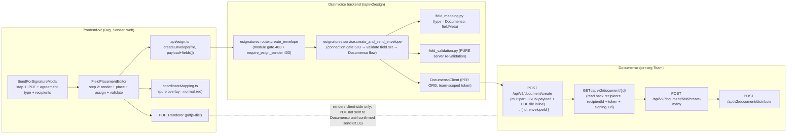
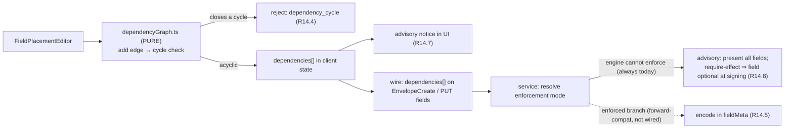
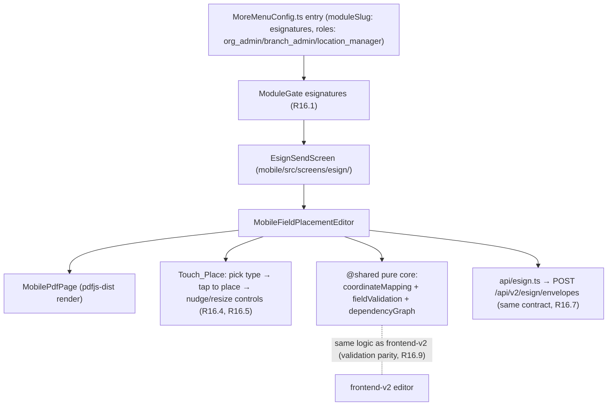
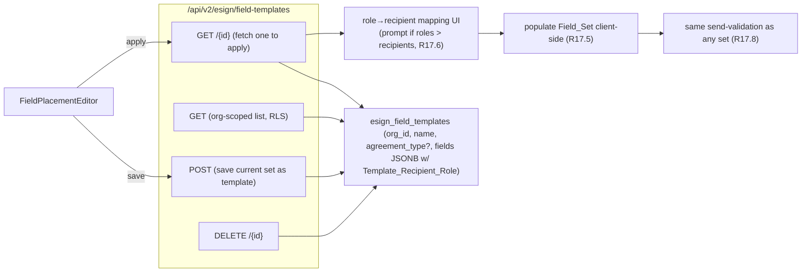

# Design Document — E-Signature Field Placement

## Overview

The E-Signature Field Placement feature adds an in-app, drag-and-drop **field-placement editor** to the already-shipped `esignature-integration` send flow. Today, after an Org_Sender picks a PDF + agreement type + recipients in `SendForSignatureModal`, the backend auto-places exactly **one** SIGNATURE field per signer on the PDF's last page at fixed default coordinates (`_DEFAULT_FIELD_PAGE_*` / `place_signature_field` in `app/modules/esignatures/service.py`). The sender has no control over where fields land and cannot add anything but a signature.

This feature **replaces** that single auto-placement with a sender-defined **Field_Set**. After selecting the PDF and recipients, the Org_Sender renders every page of the PDF in-browser, drags field boxes (Signature, Initials, Name, Date, Email, Text) onto the pages, moves/resizes/deletes them, assigns each to a recipient (color-coded), marks each required/optional (plus label/placeholder for Text), and on send the placed fields are created on the Documenso document via the v2 `POST /api/v2/document/field/create-many` endpoint — **before** distribute — instead of the single auto-placed signature.

The feature is an **extension**, not a redesign. It inherits, unchanged, every guarantee of `esignature-integration`: the per-organisation Documenso connection model and team-scoped token usage (R13.7 there), the `esignatures` module gate (HTTP 403 when disabled), the send RBAC (`require_esign_sender`), the connection-verified gate (503 when missing/unverified), envelope recording, audit/notify side-effects, the safe-api-consumption rules, and the rule that Documenso's own UI is never exposed to org users (R5.3 there). It also preserves the most important safety rule (R17 of that spec): **every signer must carry ≥1 signature-type field before the document is distributed** — only now that field is sender-placed rather than auto-placed.

The riskiest, highest-value part of the design is the **Coordinate_Mapping**: the precise, per-page, scale-independent transform between on-screen overlay CSS pixels and Documenso normalized page units (origin top-left). That transform carries a round-trip correctness property (R7.3, tolerance ≤1 px) and is specified below with function signatures and pseudocode.

The frontend surface is `frontend-v2/` (React 18 + TypeScript + Vite + Tailwind). With the expanded capabilities (R13–R17) the same editor is **also** delivered in the `mobile/` Capacitor app (React 19) for organisation users (R16), and the feature gains post-send editing (R13), advisory conditional fields (R14), a signing-order UI (R15), and saved field templates backed by one new org-scoped table (R17).

### What this feature changes vs. inherits

| Concern | Disposition | Where |
|---|---|---|
| In-browser PDF rendering (every page, progressive, scanned pages) | **New** — PDF.js (`pdfjs-dist`) in `frontend-v2/` | Components → PDF_Renderer |
| Coordinate model + overlay↔normalized mapping (per page, round-trip ≤1 px) | **New** — pure module `coordinateMapping.ts` | Components → Coordinate_Mapping |
| Drag/place/move/resize/delete + assignment + required + text meta editor | **New** — `FieldPlacementEditor` component tree | Components → Editor architecture |
| Field_Set client state, autosave-in-client, cancel/abort | **New** — `useFieldSet` reducer hook | Components → State |
| Field_Set wire contract (frontend → send endpoint) | **New** — extends `EnvelopeCreate` with optional `fields[]` | Data Models → API contract |
| Send orchestration accepts + re-validates + creates the Field_Set | **Changed** — `create_and_send_envelope` gains a field-set path; `field/create-many` replaces single placement | Components → Backend send path |
| Field-type → Documenso type mapping + `fieldMeta` build | **New** (backend) — `field_mapping.py` | Components → Field mapping |
| Per-org token scoping, module gate, RBAC, connection gate | **Inherited unchanged** | `esignature-integration` design |
| Envelope recording, audit, notify, error-envelope-on-failure | **Inherited unchanged** | `esignature-integration` design |
| ≥1 signature field per signer before distribute (R17 safety rule) | **Inherited, re-expressed** over the sender Field_Set | Components → Validation |
| Auto-placement (the `_DEFAULT_FIELD_PAGE_*` path) | **Kept as a fallback** when no Field_Set is supplied (see decision below) | Components → Backward-compat |
| Edit a sent envelope's Field_Set in place (Editable_State gate, atomic replace, void-and-recreate) | **New** — `GET/PUT /envelopes/{id}/fields`; pure `editable_state` gate; `replace_fields` service path | Components → Edit-after-send (R13) |
| Conditional / dependent fields (dependency model, cycle detection, advisory mode) | **New** — `dependencies[]` on the wire; pure `dependency_graph.ts`/`.py`; advisory at signing | Components → Conditional fields (R14) |
| Signing-order mode + per-recipient order (parallel/sequential) | **New (additive)** — `signing_order_mode` + per-recipient `order`; create/distribute payload mapping | Components → Signing order (R15) |
| Mobile field-placement editor (Capacitor, Touch_Place, shared pure core) | **New** — `mobile/` surface reusing the same pure mapping/validation + same backend contract | Components → Mobile editor (R16) |
| Saved field templates (org-scoped, RLS, apply by role) | **New** — `esign_field_templates` table (migration 0234) + `/field-templates` endpoints + client apply | Components → Templates (R17), Data Models |

### Requirements coverage map

- **R1** Render the uploaded PDF (every page, multi-page nav, per-page loading, render-error blocks send, scanned pages, no pre-send upload) → Components (PDF_Renderer), Frontend
- **R2** Field palette + supported field types + per-type required default + type→Documenso mapping → Components (Field_Palette, field mapping), Data Models
- **R3** Place / move / resize / delete + bounds clamping + min size → Components (Editor, interactions), Correctness Properties
- **R4** Assign fields to recipients + distinct colours + cascade-delete on recipient removal + viewers may have none → Components (assignment), Correctness Properties
- **R5** Per-field required flag + Text label/placeholder + carried into `fieldMeta` → Components, Data Models, Correctness Properties
- **R6** Client + server validation before send (signer has signature, assigned, in-bounds; send disabled until valid; server re-validates atomically) → Components (validation), Correctness Properties
- **R7** Coordinate mapping accuracy (overlay→normalized, scale-independent, round-trip ≤1 px, per-page dims) → Components (Coordinate_Mapping), Correctness Properties
- **R8** Persist the Field_Set to Documenso (create→register→field/create-many before distribute; recipientId reconciliation; replaces auto-placement; error→error envelope, no distribute; envelope recorded) → Components (backend send path), Correctness Properties
- **R9** Alignment with existing module constraints (module 403, RBAC 403, per-org token, no Documenso UI, safe consumption + AbortController, connection-gate 503) → Architecture, Components, inherited
- **R10** Accessibility + 44px touch targets + keyboard move/delete + accessible name + touch ≥320px → Components (a11y), Frontend
- **R11** Autosave-in-client + cancel discards + reopen empty + retain on send failure → Components (state), Correctness Properties
- **R12** Human-readable errors (`{ message, code }`, no raw DB/exception text) → Error Handling, Correctness Properties
- **R13** Edit fields after send within limits (Editable_State gate, RBAC 403, server re-validation, atomic Documenso field replace, Non_Editable_State → 422 + Void_And_Recreate, no post-signature mutation, audit, no-partial-on-failure) → Components (Edit-after-send), Data Models, Correctness Properties, Error Handling
- **R14** Conditional / dependent fields (record dependency, trigger ≠ self, supported conditions, cycle rejection, enforced-vs-advisory resolved against engine capability, advisory notice, advisory-require degrades to optional) → Components (Conditional fields), Data Models, Correctness Properties, Error Handling
- **R15** Signing-order UI (parallel/sequential toggle, default parallel, distinct 1-based positions, `signingOrder` + distribution mode to Documenso, viewers excluded from positions) → Components (Signing order), Data Models, Correctness Properties
- **R16** Mobile field-placement editor (`esignatures` ModuleGate, org-roles, More-menu entry, render + Touch_Place, nudge/resize 44 px, 320–430 px, same backend contract, safe consumption + AbortController, validation parity) → Components (Mobile editor), Correctness Properties, Testing
- **R17** Saved field templates per agreement type (org-scoped + RLS store, optional agreement-type, list/delete org-scoped, apply by role mapping, role-overflow prompt, RBAC 403, applied set re-validated) → Components (Templates), Data Models (`esign_field_templates`, migration 0234), Correctness Properties, Error Handling

### Scope and decision notes

These are explicit, documented decisions so a reviewer does not flag them as omissions.

- **No trade-family gating applies — this is an explicit decision.** E-signature field placement is a **universal capability** of the existing `esignatures` module: it is gated **only** by the `esignatures` `ModuleGate` (HTTP 403 when the module is disabled) and the send RBAC (`require_esign_sender`), and is **not** gated by trade family. No `tradeFamily` / `isAutomotive` checks apply to any of its web (`frontend-v2/`) or mobile (`mobile/`) UI, routes, or payload fields, consistent with the existing `esignature-integration` module from which this feature extends. The absence of trade-family gating is therefore intentional (per `trade-family-gating-for-new-features` steering) and a reviewer should not flag it as a missing gate.
- **Auto-placement is KEPT as a fallback, not removed.** The backend treats the Field_Set as **optional** on the wire. When a send carries a non-empty Field_Set, the sender-defined fields are created via `field/create-many` and the legacy `_DEFAULT_FIELD_PAGE_*` single-placement is **not** executed (R8.3). When a send carries **no** Field_Set (a field omitted / `null` / empty list), the existing auto-placement path runs unchanged. Justification: (a) it keeps the existing `esignature-integration` contract and its passing tests intact (no regression for any current caller, including programmatic / non-editor callers); (b) it is the safest migration — the R17 "≥1 signature per signer" guarantee is preserved by *both* paths, so there is never a window where a signer can be sent a document with nothing to sign; (c) it avoids a hard cut-over that would require every send entry-point to adopt the editor in the same release. The editor-driven `SendForSignatureModal` flow always supplies a Field_Set, so for the user-facing surface auto-placement is effectively replaced.
- **PDF.js (`pdfjs-dist`) is the PDF_Renderer.** It is the de-facto standard in-browser PDF engine, renders to `<canvas>`, exposes per-page `getViewport({ scale })` (giving exact per-page CSS dimensions for the Coordinate_Mapping), and handles scanned/image-only pages by rasterising them like any other page. The worker is bundled via Vite. No PDF library is currently a dependency, so `pdfjs-dist` is added to `frontend-v2/package.json`.
- **Drag/resize is hand-rolled on pointer events, not a heavy DnD library.** The interaction surface is small and bespoke (absolute-positioned boxes over a canvas with bounds clamping, min-size, keyboard nudge, and touch), and the dominant complexity is the coordinate mapping rather than the drag mechanics. A pointer-event handler (unifying mouse + touch via the Pointer Events API) keeps the bundle small, gives full control over clamping/min-size, and avoids a dependency whose abstractions fight the canvas overlay. This is a reversible implementation choice.
- **The editor is a new step within the existing modal flow**, not a separate route. `SendForSignatureModal` gains a two-step flow: step 1 is the existing PDF + agreement-type + recipients composer; step 2 is the `FieldPlacementEditor`. The send call moves to the end of step 2 so the Field_Set travels with it.
- **The base feature (R1–R12) adds no new backend table.** The per-send Field_Set is transient send input: it is created on Documenso and reflected in the existing `esign_envelopes` / `esign_recipients` rows; nothing about the placed-field geometry needs to persist in OraInvoice after distribute. The **only** new table this whole spec introduces is `esign_field_templates` (R17, below) — the per-send Field_Set itself remains non-persistent even with edit-after-send (R13 re-reads the live Field_Set from Documenso rather than from a local copy).
- **Mobile is now IN scope (R16).** The earlier base-feature design treated mobile as out of scope; Requirement 16 brings it in. The editor is delivered twice: the `frontend-v2/` web surface (R1–R12) and the `mobile/` Capacitor surface (R16), the latter governed by the mobile steering guide. Both speak the **same** backend contract (no new endpoints for mobile) and reuse the **same** pure coordinate-mapping + validation core (see Components → Mobile editor).

### Scope and decision notes — expanded capabilities (R13–R17)

- **R14 conditional logic resolves to `advisory`, not `enforced`.** Documenso's v2 field model has **no cross-field conditional/dependency primitive** — there is no way to express "show/require field B only when field A = X", and the signing engine evaluates each field independently. The proven `place_signature_field` call and the `field/create-many` wire shape confirm this: a field carries `recipientId, type, pageNumber, pageX, pageY, width, height` (and, if accepted by the target build, an optional `fieldMeta` for per-field presentation/validation such as `required`/label/placeholder — itself an assumption verified in *Documenso capability assumptions* below), with no trigger/condition keys. Therefore the **Dependency_Enforcement_Mode is `advisory` for every Field_Dependency** in this design (R14.6): all fields are presented unconditionally at signing, the dependency model is stored on OraInvoice for the sender's reference, the editor shows the advisory notice (R14.7), and an `advisory` + `require` dependency degrades the dependent field to **optional** at signing time so an unmet advisory condition can never block a recipient (R14.8). The `enforced` branch (R14.5) is designed as a forward-compatible mapping that activates only if a future Documenso build adds the capability — it is not wired today. This is the explicit feasibility resolution the requirements call for.
- **R13 edits by atomic replace, not diff-patch.** Editing a sent-but-unsigned envelope re-reads its current Documenso field set, edits it in the same editor, and on submit the server **replaces** the whole field set (delete existing fields + `field/create-many` the new set) rather than patching individual fields. This matches the create-many-shaped API, keeps the edit atomic (all-or-nothing — R13.8), and avoids brittle per-field id reconciliation. The Editable_State gate (status `sent` AND no recipient signed) is a **pure** predicate over the envelope status + recipients, so it is property-testable.
- **R15 is an additive payload + UI change with no new table.** Signing order is send-time input mapped onto the existing create/distribute calls; it does not need to persist beyond what Documenso records. The OraInvoice request schema gains `signing_order_mode` and an optional per-recipient `order`; the client maps these to Documenso's per-recipient `signingOrder` and the `PARALLEL`/`SEQUENTIAL` distribution mode.
- **R17 templates DO require a new table.** Unlike the transient Field_Set, a Field_Template is durable, named, org-scoped, reusable data, so it needs persistence: a new `esign_field_templates` table with the standard `tenant_isolation` RLS policy (migration 0234), storing field geometry/types/required/labels and a Template_Recipient_Role per field — **never** specific people. Apply is a **client-side** populate: the editor copies each template field and maps its Template_Recipient_Role to a chosen current-send recipient; the resulting Field_Set then goes through the same send-validation as any other (R17.8). No template id is ever sent to Documenso.

#### Documenso capability assumptions

The integrated `DocumensoClient` today exercises only a **narrow slice** of the v2 field/distribute surface: `place_signature_field` ever creates a **single `SIGNATURE` field**, it sends **no `fieldMeta`**, and `send_document` distributes **EMAIL-only** with no signing-order metadata. Four capabilities this design relies on are therefore **unverified against the running Documenso build**. They are documented honestly here — each with the assumption, a verification step, and a documented fallback if unsupported — mirroring how R14 was resolved to advisory rather than silently claiming enforcement. None of these is wired beyond the proven single-`SIGNATURE` path until verification passes.

1. **Non-`SIGNATURE` field types (INITIALS / NAME / DATE / EMAIL / TEXT) on `field/create-many`.**
   - *Assumption:* `field/create-many` accepts the same payload shape for the other five UPPERCASE types as it does for `SIGNATURE`.
   - *Verify:* against the running Documenso build, issue a `field/create-many` carrying one field of each non-`SIGNATURE` type on a throwaway document and confirm each is accepted and renders at signing.
   - *Fallback:* if some types are rejected, restrict the editor's palette to the supported subset and document the supported set; the type→Documenso mapping and validation already reject unsupported types, so an unsupported type can never reach the wire.

2. **`fieldMeta` (`required` / `label` / `placeholder`) on `field/create-many`.**
   - *Assumption:* a `fieldMeta` object is accepted per field and `required`/`label`/`placeholder` are honoured by the signing engine.
   - *Verify:* create fields with `fieldMeta` set and confirm the engine enforces `required` and shows label/placeholder at signing.
   - *Fallback:* if `fieldMeta` is unsupported, `required`/`label`/`placeholder` **cannot be engine-enforced** and are recorded/advisory in OraInvoice only (the same honesty as R14): the editor still captures them and surfaces an advisory notice, and R14.8's "advisory `require` ⇒ optional at signing" degrade holds trivially (nothing is enforced). `build_field_meta` becomes a no-op on the wire until the capability is confirmed.

3. **R13 field replacement (delete / replace fields on a `sent`, unsigned document).**
   - *Assumption:* Documenso v2 supports deleting (or otherwise replacing) a document's fields while it is `sent` and unsigned. The client has **no delete-field method today** and no proven Documenso field-deletion/replacement endpoint exists.
   - *Verify:* confirm a v2 endpoint exists to delete or replace fields on a `sent` unsigned document, and that re-running `field/create-many` after it yields exactly the new set.
   - *Fallback (explicit):* if in-place deletion/replacement is **not** supported, edit-after-send **degrades to Void_And_Recreate only** — which is proven via `cancel_document` (`POST /api/v2/envelope/cancel`) — and the in-place `PUT …/fields` atomic-replace path is **gated behind this capability** and not shipped until verified. The Editable_State gate and re-validation are unchanged; only the persistence verb changes.

4. **R15 signing order (per-recipient `signingOrder` + `SEQUENTIAL`/`PARALLEL` distribution mode).**
   - *Assumption:* `create_document`/`distribute` accept a per-recipient `signingOrder` and a sequential-vs-parallel distribution mode. `send_document` today sends only `meta.distributionMethod: "EMAIL"`.
   - *Verify:* confirm the create/distribute payloads accept `signingOrder` positions and a distribution mode, and that sequential order is actually enforced (recipient *N+1* cannot sign before *N*).
   - *Fallback:* if unsupported, sequential **degrades to parallel** distribution with a clear advisory note in the UI that order is recorded but not enforced — the design does **not** silently claim enforcement. The additive schema fields (`signing_order_mode`, per-recipient `order`) remain accepted and stored regardless.

## Architecture

### Where field placement sits in the existing flow



### Send sequence with a sender-defined Field_Set

```mermaid
sequenceDiagram
  participant U as Org_Sender (web)
  participant E as FieldPlacementEditor
  participant API as POST /api/v2/esign/envelopes
  participant S as esign service
  participant V as field_validation (pure)
  participant C as DocumensoClient
  participant DB as PostgreSQL
  participant DM as Documenso

  U->>E: render PDF, place/assign/size fields, toggle required, label text
  E->>E: client-side validate (each signer has signature, all assigned, in-bounds, min-size)
  Note over E: send control disabled until client validation passes (R6.4/6.5)
  U->>API: PDF + payload {agreement_type, entity, recipients[], fields[]}  (AbortController-bound)
  API->>S: parse multipart; RBAC + module gate already applied
  S->>S: connection gate (missing/unverified → 503, no Documenso call) [inherited]
  S->>V: re-validate field set (server-side, pre-Documenso)
  alt server validation fails (unassigned / out-of-bounds / signer w/o signature / unknown type)
    S-->>API: 422 { message, code }  (no Documenso call, no field created)
  else valid
    S->>C: create_document (multipart: JSON payload + PDF file inline)
    C-->>S: { id, envelopeId } then GET /document/{id} → documentId + recipients[] (each Documenso recipientId + token + signing_url)
    S->>S: reconcile Field_Set recipient refs → Documenso recipientId (match by email against create_result.recipients)
    S->>C: field/create-many { documentId, fields[] (mapped types + fieldMeta) }
    alt field/create-many error
      C-->>S: error
      S->>DB: insert envelope status=error (no distribute)
      S-->>API: 502 { message, code }
    else ok
      S->>C: distribute
      S->>DB: insert envelope status=sent + recipients (signingUrl per recipient)
      S->>S: audit + notify (best-effort) [inherited]
      S-->>API: 201 envelope
    end
  end
```

The ordering is mandatory and unchanged in shape from `esignature-integration`: **create (PDF uploaded inline) → field/create-many (full set) → distribute**. The create step uploads the PDF inline as `multipart/form-data` (a JSON `payload` part plus the raw PDF `file` part) — there is no separate presigned-upload step. The only differences from the existing single-placement send are (1) `field/create-many` now carries the **full sender Field_Set** rather than one signature per signer, and (2) a server-side **re-validation** of the Field_Set runs before any Documenso call.

### Edit-after-send architecture (R13)

Editing reuses the same editor and the same pure validation; only the entry point and the persistence verb differ (replace instead of create). Two new endpoints hang off an existing envelope:

```mermaid
sequenceDiagram
  participant U as Org_Sender (web/mobile)
  participant API as /api/v2/esign/envelopes/{id}/fields
  participant S as esign service
  participant G as editable_state (pure gate)
  participant V as field_validation (pure)
  participant C as DocumensoClient
  participant DB as PostgreSQL
  participant DM as Documenso

  U->>API: GET /envelopes/{id}/fields  (open editor on a sent envelope)
  API->>S: load envelope + recipients (RLS org-scoped)
  S->>G: editable_state(status, recipients)?
  alt Non_Editable_State (signed/terminal)
    S-->>API: 422 { code: not_editable } + offer Void_And_Recreate
  else Editable_State (sent AND nobody signed)
    S->>C: GET /document/{id} → read current fields
    S-->>API: 200 { fields[], recipients[] }  (seed the editor)
  end
  U->>API: PUT /envelopes/{id}/fields { fields[], dependencies[] }
  API->>S: RBAC (require_esign_sender) + module gate already applied
  S->>G: re-check editable_state (guard against a race: someone signed meanwhile)
  S->>V: re-validate edited Field_Set (same rules as send)
  alt invalid OR no longer editable
    S-->>API: 422 { message, code }  (no Documenso mutation)
  else valid
    S->>C: delete existing fields, then field/create-many (edited set)  [atomic replace]
    alt replace fails
      C-->>S: error
      S->>DB: leave prior fields in effect; envelope status unchanged
      S-->>API: 502 { code: documenso_error }  (no partial apply, R13.8)
    else ok
      S->>DB: write audit entry esign.envelope.fields_edited (R13.7)
      S-->>API: 200 { fields[] }
    end
  end
```

- **Editable_State is a pure predicate** (`editable_state(status, recipients) -> bool`): `status == "sent"` AND no recipient has signed. Each recipient's `signed` flag is derived from the persisted `esign_recipients.recipient_status` column (server default `"pending"`), which the Documenso webhook handler maintains using the pure `status.py` reducer (`RecipientState(signed: bool)`, `next_status`, and the Documenso event constants including `DOCUMENT_RECIPIENT_COMPLETED`). The implementer MUST align the set of `recipient_status` values treated as "signed" by `editable_state` with exactly the values the webhook handler writes (i.e. reuse the existing `status.py` `RecipientState`/status vocabulary rather than inventing a parallel type). Every other condition (`viewed`-with-signing, `partially_signed`, `completed`, `declined`, `voided`, `error`, or any signed recipient) is a Non_Editable_State (R13.4, R13.6).
- **Atomic replace (R13.3, R13.8) — gated behind a verified capability.** *When in-place field replacement is supported by the target Documenso build* (capability assumption #3 — the client has **no** delete-field method today and no proven Documenso field-deletion/replacement endpoint exists, so this MUST be verified first), the service deletes the envelope's existing Documenso fields and then `field/create-many`s the edited set; if either step fails, the prior field set is left in effect and a humanized 502 is returned with no partial application. **If in-place replacement is NOT supported, edit-after-send degrades to Void_And_Recreate only** (proven via `cancel_document`), and the in-place `PUT …/fields` replace path is not shipped until the capability is confirmed. Either way, once signing has begun the engine refuses field mutation, which is exactly the Non_Editable_State the gate already blocks (R13.6).
- **Void_And_Recreate (R13.5)** is offered on the Non_Editable_State 422. It reuses the existing `void_envelope` service entry point, which calls the client's `cancel_document` (`POST /api/v2/envelope/cancel`, keyed on the **string** `envelopeId` resolved via `GET /document/{id}`), then opens a fresh send **pre-populated** with a copy of the voided envelope's Field_Set (read from Documenso before void, or from the editor's in-memory set) for editing before the new send is confirmed.
- **Audit (R13.7).** A successful edit writes an `esign.envelope.fields_edited` audit entry via the existing best-effort `write_audit_log` wrapper (SAVEPOINT-isolated, same pattern as send/void).

### Conditional-fields architecture (R14) — advisory

The dependency model lives **alongside** the Field_Set on the wire and is stored on OraInvoice (transiently for an initial send; durably only when saved into a template — R17). Because Documenso cannot enforce it (see decision note), enforcement is `advisory`:



- **Dependency model.** A `FieldDependency` is `{ dependent_field, trigger_field, condition, effect }` where `condition ∈ {is_checked, is_not_checked, equals <v>, not_equals <v>, is_filled, is_empty}` (R14.3) and `effect ∈ {show, require}` (R14.1). The trigger must be **another** field in the same set; a self-trigger is rejected (R14.2).
- **Cycle detection is a pure function** over the dependency edges (dependent → trigger): adding an edge that would close a cycle is rejected with `dependency_cycle` and not stored (R14.4). This is a total graph function, ideal for property testing.
- **Advisory effect at signing (R14.6–R14.8).** All fields are created on Documenso unconditionally. A field that is the dependent of a `require`-effect **advisory** dependency is created with `required = false` in its `fieldMeta`, so an unmet advisory condition cannot block completion (R14.8). The editor surfaces the advisory notice that the dependency is recorded but not enforced (R14.7).

### Signing-order architecture (R15) — additive payload

Signing order is captured in step 1 of `SendForSignatureModal` (and the mobile equivalent) and threaded through the existing create/distribute calls:

- A `Signing_Order_Mode` toggle defaults to `parallel` (R15.2). When `sequential`, the sender orders the **signing** recipients (viewers are excluded from positions but stay on the document — R15.6) into distinct 1-based positions (R15.3).
- On send, the service passes each recipient's `signingOrder` position and sets the distribution mode to `SEQUENTIAL` (R15.4) or `PARALLEL` (R15.5) on `create_document` / `send_document`. This is a small, additive extension of the existing `RecipientSpec` and the `distribute` payload — no new table, no change to the create (PDF inline) → field/create-many → distribute ordering. **This is gated behind capability assumption #4:** `send_document` today sends only `meta.distributionMethod: "EMAIL"`, and per-recipient `signingOrder` plus the `SEQUENTIAL`/`PARALLEL` mode are unverified. If the build does not support them, sequential **degrades to parallel** with a clear advisory note that order is recorded but not enforced (the schema fields are still accepted and stored).

### Mobile editor architecture (R16)

The mobile editor is a second front-end over the **same backend contract** — there are **no new endpoints** for mobile. It honours the mobile steering guide: `esignatures` `ModuleGate`, org-sender roles only, a More-menu entry, v2 absolute paths, safe consumption + `AbortController`, 44 px targets, and the 320–430 px viewport.



- **Shared pure core (R16.9).** The coordinate mapping, send-validation, and dependency-graph logic are pure and framework-agnostic. To guarantee parity, they are extracted to a shared location consumable by both apps (the repo's `@shared/` convention, per the mobile steering "response shape matches `@shared/types/`"); if a shared package proves impractical, the pure modules are duplicated **verbatim** and a single property-test suite runs against both copies to prove parity. Either way the mobile validation is byte-for-byte the same rule set, including the "every signer has ≥1 signature field" gate before the send control enables (R16.9).
- **Touch_Place (R16.4, R16.5).** Instead of fine pointer dragging, the sender selects a Field_Type then taps a page position to place; a selected field is adjusted with on-screen nudge/resize controls, each a ≥44×44 px target. Placement and adjustment still go through the same `clampToPage` + mapping, so geometry invariants hold identically.
- **Same contract (R16.7, R16.8).** The mobile send issues the identical multipart `POST /api/v2/esign/envelopes` with `fields[]` (and `signing_order_mode`, `dependencies[]`), consumes responses with typed generics + `?.`/`?? []`, and binds every in-flight request to an `AbortController` aborted on unmount/cancel.

### Templates architecture (R17)

Templates are the one durable addition. They are org-scoped, RLS-protected rows storing **roles, not people**, applied client-side into the editor:



- **Storage (R17.1–R17.3).** A template stores its `name`, optional `agreement_type`, and a JSONB array of template fields — each with `type`, `page`, Normalized_Coordinates, `required`, optional `text` `label`/`placeholder`, and a `template_recipient_role` slot (e.g. `signer 1`, `signer 2`, `viewer`). No recipient name/email is ever stored (R17.1). Listing and deleting are confined to the caller's org by the `tenant_isolation` RLS policy (R17.3, R17.4).
- **Apply is client-side role mapping (R17.5, R17.6).** Applying fetches the template, then the editor maps each distinct Template_Recipient_Role to one of the current send's recipients. If the template has more roles than the send has recipients to map, the editor prompts the sender to complete the mapping and refuses to apply until every role resolves, so no applied field is left unassigned (R17.6). Each template field is copied into a `PlacedField` with the mapped `recipientKey`; the populated set is then subject to the same send-validation (R17.8).
- **RBAC (R17.7).** Create/apply/delete all require `require_esign_sender`; other roles get 403.

## Components and Interfaces

### Frontend module layout (`frontend-v2/`)

```
frontend-v2/src/components/esign/
  SendForSignatureModal.tsx        # CHANGED: two-step flow; step 2 mounts the editor
  fieldplacement/
    FieldPlacementEditor.tsx       # orchestrator: pages + palette + inspector + validation
    PdfPageCanvas.tsx              # renders ONE page via pdfjs-dist; reports rendered dims
    FieldOverlay.tsx               # one absolutely-positioned, draggable/resizable field box
    FieldPalette.tsx               # the six field-type sources (drag to add / tap to arm)
    RecipientLegend.tsx            # per-recipient colour swatches + active-recipient picker
    FieldInspector.tsx            # selected-field: recipient, required toggle, text label/placeholder, delete
  hooks/
    useFieldSet.ts                 # reducer over the Field_Set (add/move/resize/assign/delete/meta)
    usePdfDocument.ts              # loads the PDF via pdfjs-dist; per-page viewport dims; progressive
  lib/
    coordinateMapping.ts           # PURE overlay↔normalized transforms (round-trip tested)
    fieldValidation.ts             # PURE client-side send-validation (mirrors server rules)
    fieldColors.ts                 # deterministic distinct colour per recipient index
frontend-v2/src/api/
  esign.ts                         # CHANGED: EnvelopeCreate gains optional fields[]; new FieldIn type
```

### PDF_Renderer (R1)

`pdfjs-dist` loads the selected `File` (read as an `ArrayBuffer`) into a `PDFDocumentProxy`. `usePdfDocument` exposes the page count and, per page, a `getViewport({ scale })` from which exact CSS dimensions are derived. `PdfPageCanvas` renders each page to a `<canvas>` sized to that viewport.

- **Render scale.** Each page is rendered at a `renderScale` chosen so the page fits the editor's available width (responsive, ≥320 px, R7.2/R10.5), capped to keep many-page documents light. Crucially, the **render scale never leaks into Normalized_Coordinates** — the mapping divides out the rendered pixel dimensions (see Coordinate_Mapping), so two senders at different zoom/scale produce identical normalized fields (R7.2).
- **All pages, navigable (R1.2).** Pages render in a vertical scroll list (one `PdfPageCanvas` per page). Fields may be placed on any page; the page a field belongs to is its 1-based `page`.
- **Progressive / lazy rendering (many-page PDFs).** Pages mount but defer their actual `page.render()` until near the viewport (IntersectionObserver), so a many-page PDF stays responsive and bounded in memory. A not-yet-rendered page reserves its space using the cheap `getViewport` dimensions (available without rasterising), so scroll position and overlay geometry are stable before pixels arrive.
- **Per-page loading indicator (R1.3).** While a page's `render()` task is in flight, that page shows a spinner overlay; it clears on render completion.
- **Render failure blocks send (R1.4).** If `getDocument` rejects or a page render throws, the editor surfaces a humanized "This document couldn't be displayed for field placement" error and keeps the send control disabled (no Field_Set can be trusted against a document that didn't render).
- **Scanned / image-only pages (R1.5).** PDF.js rasterises image-only pages to the canvas like any other page; fields place on them identically (placement is geometric, never text-anchored).
- **No pre-send upload (R1.6).** Rendering is entirely client-side from the in-memory `ArrayBuffer`. The PDF bytes are only ever sent to Documenso by the existing send pipeline, on confirmed send.

```ts
interface RenderedPage {
  pageNumber: number          // 1-based
  cssWidth: number            // rendered element width in CSS px at the current renderScale
  cssHeight: number           // rendered element height in CSS px at the current renderScale
  renderScale: number         // pdf.js scale used for this page's canvas
  status: 'pending' | 'rendering' | 'rendered' | 'error'
}
```

### Coordinate_Mapping (R7) — the critical transform

Documenso accepts each field as normalized page units with the **origin at the top-left** of the page. The proven `field/create-many` wire keys are **`pageNumber`, `pageX`, `pageY`, `width`, `height`** (a field carries `{ recipientId, type, pageNumber, pageX, pageY, width, height }`, with integer `documentId`/`recipientId` and the UPPERCASE Documenso `type`). The editor works in **overlay CSS pixels** relative to a rendered page element. The mapping converts between the two **per page**, using that specific page's rendered dimensions, so it is independent of render scale and correct for PDFs whose pages differ in size (R7.5). Internally the editor keeps a `NormalizedRect { positionX, positionY, width, height }`; on the wire `positionX → pageX`, `positionY → pageY`, `width → width`, `height → height`, and the field's 1-based page → `pageNumber`.

**Normalized unit convention.** `field/create-many` expects position/size as **percentages of the page** (0–100, "normalised page units"), origin top-left — the field's top-left corner is `pageX`/`pageY` and the box size is `width`/`height`, all as a percent of page width/height (the existing single-placement defaults are `_DEFAULT_FIELD_PAGE_X=65`, `_Y=85`, `_WIDTH=25`, `_HEIGHT=8`, confirming the percent convention). Using percent (rather than absolute PDF points) makes the transform inherently scale-independent and requires only the rendered element's pixel dimensions, which `getViewport` provides. (If a target Documenso build expects absolute PDF points instead, the same functions swap the page-dimension basis from "rendered CSS px" to "PDF point dimensions from `getViewport({ scale: 1 })`"; the round-trip property and call sites are unchanged.)

```ts
/** A field box in on-screen overlay pixels, relative to the rendered page element. */
interface OverlayRect { xPx: number; yPx: number; wPx: number; hPx: number }

/** A field box in normalised page units (percent 0–100, origin top-left), held
 *  internally by the editor. On the wire its fields serialise as
 *  positionX→pageX, positionY→pageY, width→width, height→height. */
interface NormalizedRect { positionX: number; positionY: number; width: number; height: number }

/** The rendered page's CSS pixel dimensions (from RenderedPage). */
interface PageDims { cssWidth: number; cssHeight: number }

/**
 * Overlay px → normalized percent for one page. Divides out the rendered
 * dimensions so the result is independent of render scale (R7.1, R7.2).
 * Pre: dims.cssWidth > 0 && dims.cssHeight > 0.
 */
function overlayToNormalized(rect: OverlayRect, dims: PageDims): NormalizedRect {
  return {
    positionX: (rect.xPx / dims.cssWidth) * 100,
    positionY: (rect.yPx / dims.cssHeight) * 100,
    width:     (rect.wPx / dims.cssWidth) * 100,
    height:    (rect.hPx / dims.cssHeight) * 100,
  }
}

/**
 * Normalized percent → overlay px for one page, at the page's current rendered
 * dimensions. Inverse of overlayToNormalized at the same dims (R7.3).
 */
function normalizedToOverlay(rect: NormalizedRect, dims: PageDims): OverlayRect {
  return {
    xPx: (rect.positionX / 100) * dims.cssWidth,
    yPx: (rect.positionY / 100) * dims.cssHeight,
    wPx: (rect.width      / 100) * dims.cssWidth,
    hPx: (rect.height     / 100) * dims.cssHeight,
  }
}
```

**Round-trip guarantee (R7.3).** For any overlay rect that lies within a page of strictly positive dimensions, `normalizedToOverlay(overlayToNormalized(rect, dims), dims)` reproduces `rect` within ≤1 CSS px on every component. The transform is a pure scalar multiply/divide with no rounding applied internally (rounding, if any, happens only at render time), so the round-trip error is bounded by floating-point epsilon — comfortably inside the 1 px tolerance. This is the single most important property of the feature and is property-tested (Property 1).

**Bounds clamping lives in overlay space (R3.5, R6.3).** Clamping a field so its whole area stays on the page is done on `OverlayRect` against `[0, cssWidth] × [0, cssHeight]` before conversion; equivalently, a normalized rect is in-bounds iff `positionX ≥ 0 && positionY ≥ 0 && positionX + width ≤ 100 && positionY + height ≤ 100`. The server re-checks the normalized form (R6.3) so a hand-crafted out-of-bounds payload is rejected regardless of the client.

```ts
function clampToPage(rect: OverlayRect, dims: PageDims, minWpx: number, minHpx: number): OverlayRect
// width/height >= min (R3.6); x,y >= 0; x+w <= cssWidth; y+h <= cssHeight (R3.5)
```

### Editor component architecture (R3, R4, R5, R10, R11)

**State — `useFieldSet` reducer.** The Field_Set is a flat array of placed fields in client state, keyed by a stable client id. A pure reducer owns every mutation, which makes the client-side rules directly testable.

```ts
type FieldType = 'signature' | 'initials' | 'name' | 'date' | 'email' | 'text'

interface PlacedField {
  clientId: string            // stable local key (e.g. crypto.randomUUID())
  type: FieldType
  page: number                // 1-based page the field sits on
  rect: NormalizedRect        // stored normalized so it is render-scale independent (R7)
  recipientKey: number        // references a SendForSignatureModal RecipientRow.key
  required: boolean           // R5.1; default per type (R2.3)
  label?: string              // text fields only (R5.2)
  placeholder?: string        // text fields only (R5.2)
}

type FieldSetAction =
  | { kind: 'add'; type: FieldType; page: number; rect: NormalizedRect; recipientKey: number }
  | { kind: 'move'; clientId: string; rect: NormalizedRect }
  | { kind: 'resize'; clientId: string; rect: NormalizedRect }
  | { kind: 'assign'; clientId: string; recipientKey: number }
  | { kind: 'setRequired'; clientId: string; required: boolean }
  | { kind: 'setTextMeta'; clientId: string; label?: string; placeholder?: string }
  | { kind: 'delete'; clientId: string }
  | { kind: 'removeRecipient'; recipientKey: number }   // cascade delete (R4.5)
  | { kind: 'reset' }                                    // cancel / reopen (R11.3)
```

- **Fields stored normalized.** Each `PlacedField.rect` is kept in `NormalizedRect` (percent) in state, so it is render-scale independent and ready to send. Overlay rendering converts on the fly with `normalizedToOverlay` against the page's current `PageDims`; user drags convert back with `overlayToNormalized`. This means a viewport resize / zoom never mutates the stored field (R7.2, R11.1).
- **Default required per type (R2.3).** `add` sets `required = type !== 'text'` (signature/initials/name/email/date default required; text defaults optional).
- **Place / move / resize / delete (R3.1–R3.4).** Drag from palette → `add` at the drop point; drag an existing box → `move`; drag a resize handle → `resize`; delete (button or keyboard) → `delete`. All geometric actions pass through `clampToPage` + min-size before the reducer commits, so the invariant "every field is in-bounds and ≥ min-size" holds after every action (R3.5, R3.6).
- **Assignment + colour (R4).** Every field carries exactly one `recipientKey` (R4.1); `add` uses the currently-selected recipient from `RecipientLegend` (R4.2); `assign` changes it (R4.3). Colours are assigned deterministically by recipient index via `fieldColors.ts` (a fixed, high-contrast palette) so each recipient has a distinct colour and every field renders in its recipient's colour (R4.4). When a recipient is removed in step 1, `removeRecipient` cascades to drop that recipient's fields (R4.5). Viewer-role recipients may legitimately have zero fields (R4.6) — no rule forces a field onto them.
- **Required + text meta (R5).** `FieldInspector` shows the selected field's required toggle (R5.1) and, for `text` fields only, label + placeholder inputs (R5.2). Every field renders a visible required/optional indicator (e.g. a `*` badge or "optional" pill) (R5.5).
- **Autosave-in-client + cancel/abort (R11).** The Field_Set lives in React state for the lifetime of the open modal, surviving page scroll/navigation within the editor (R11.1). Cancel dispatches `reset` and aborts any in-flight send via the existing `AbortController` (R11.2); reopening the modal starts from an empty Field_Set (R11.3). On a **failed** send the Field_Set is **retained** (no `reset`) so the sender can correct and retry (R11.4).

**Accessibility & touch (R10).** Every palette item, field box, resize handle, and inspector control has a ≥ 44 × 44 px hit target (R10.1). A selected field is keyboard-movable with arrow keys (nudge; Shift = larger step) (R10.2) and deletable with Delete/Backspace (R10.3). Each field exposes an accessible name conveying its type and assigned recipient, e.g. `aria-label="Signature field for Alex Tran"` (R10.4). Drag/resize is implemented on **Pointer Events**, which unify mouse and touch, so placement works via touch at ≥ 320 px width (R10.5).

### Field mapping and `fieldMeta` (R2.4, R5.3, R5.4) — backend

A small pure module `app/modules/esignatures/field_mapping.py`:

```python
# OraInvoice field type (lowercase) → Documenso field type (UPPERCASE). (R2.4)
_FIELD_TYPE_MAP = {
    "signature": "SIGNATURE", "initials": "INITIALS", "name": "NAME",
    "date": "DATE", "email": "EMAIL", "text": "TEXT",
}

def map_field_type(t: str) -> str: ...   # raises on unknown type (server validation)

def build_field_meta(field: "FieldIn") -> dict | None:
    """Build Documenso fieldMeta: always carry `required`; for TEXT also carry
    label/placeholder when present (R5.3, R5.4)."""
    meta: dict = {"required": field.required}
    if map_field_type(field.type) == "TEXT":
        if field.label:       meta["label"] = field.label
        if field.placeholder: meta["placeholder"] = field.placeholder
    return meta
```

The DocumensoClient gains a multi-field create that mirrors `place_signature_field`'s **exact wire-key names**, just with N fields instead of one:

```python
async def create_fields(self, document_id: str, fields: list[DocumensoFieldSpec]) -> None:
    """POST /api/v2/document/field/create-many with the full sender Field_Set.
    Mirrors place_signature_field's payload exactly, with N fields:
      { documentId: int, fields: [
          { recipientId: int, type: <UPPERCASE>, pageNumber, pageX, pageY, width, height, fieldMeta? }, ...
      ] }.
    documentId/recipientId are integers; pageNumber is 1-based; pageX/pageY/width/height
    are the 0–100 normalised page units (the internal NormalizedRect's positionX/positionY
    map to pageX/pageY)."""
```

`DocumensoFieldSpec` carries the already-mapped UPPERCASE `type`, the resolved integer `recipientId`, the 1-based `pageNumber`, the four normalised page-unit coordinates (`pageX`, `pageY`, `width`, `height`), and the optional `fieldMeta`. The existing `place_signature_field` (single-field) method is retained for the auto-placement fallback path, and `create_fields` reuses its exact key names.

### Backend send path (R8) — changes to `create_and_send_envelope`

`EnvelopeCreate` gains an **optional** `fields: list[FieldIn] | None`. The service flow becomes:

1. **Connection gate + pure recipient/PDF validation** — unchanged from `esignature-integration` (503 if unverified; 422 on non-PDF / bad recipients; ≥1 signer required).
2. **Field_Set branch:**
   - **If `fields` is non-empty:** run server-side **field re-validation** (`field_validation.validate_field_set`, pure) *before any Documenso call* (R6.6). On failure → humanized 422, no Documenso call, no field created. On success → proceed with the sender Field_Set; the legacy auto-placement is **skipped** (R8.3).
   - **If `fields` is empty / omitted:** run the existing auto-placement path unchanged (one SIGNATURE per signer on the last page) — the backward-compat fallback.
3. **Documenso flow (field-set path):** `create_document` (PDF uploaded inline as multipart, then a read-back `GET /document/{id}` returns the created recipients) → **reconcile** each field's `recipientKey`/recipient reference to the Documenso `recipientId` by **matching on email** against `create_result.recipients` (the same `created_by_email` mapping `create_and_send_envelope` already uses today — email is the proven reconciliation key, R8.2) → `create_fields(documentId, mappedSpecs)` (R8.1) → **distribute**.
4. **Failure handling:** if `field/create-many` errors, the service does **not** distribute, records an `error`-status envelope (on a fresh committed session, the existing pattern), and returns a humanized 502 (R8.4) — identical to the existing Documenso-failure handling.
5. **Success:** persist the envelope (`sent`) + recipient rows exactly as today (R8.5), then best-effort audit + notify.

**Server-side Field_Set re-validation (`field_validation.py`, pure).** Mirrors the client rules so a crafted payload cannot bypass them (R6.6):

```python
@dataclass(frozen=True)
class FieldIn:
    type: str            # one of the six lowercase types
    page: int            # 1-based
    recipient_index: int # index into payload.recipients (how the client refs a recipient)
    position_x: float; position_y: float; width: float; height: float  # normalized percent
    required: bool = True
    label: str | None = None
    placeholder: str | None = None

def validate_field_set(fields, recipients, signer_indices) -> ValidationResult:
    # R6.2  every field references a real recipient (recipient_index in range)
    # R6.3  every field in bounds: x>=0, y>=0, x+w<=100, y+h<=100, w>0, h>0
    # R2.4  every field.type maps to a Documenso type (unknown type rejected)
    # R6.1  every SIGNER/APPROVER recipient has >=1 signature-type field
    # returns the offending field / signer in a humanized, leak-free message
```

The "≥1 signature per signer" check (R6.1) is the **same safety rule** as `esignature-integration` R17, re-expressed over the sender Field_Set: viewers are exempt (R4.6); a signer with no signature field blocks the send and the error names that signer.

### Frontend → API contract

`api/esign.ts` extends the existing create contract (additive, backward-compatible):

```ts
export type FieldType = 'signature' | 'initials' | 'name' | 'date' | 'email' | 'text'

/** One placed field in the wire contract. Coordinates are normalized percent
 *  (0–100, origin top-left). `recipient_index` maps the field to the recipient
 *  at that index in `EnvelopeCreate.recipients` — the backend reconciles that
 *  input recipient to its Documenso recipientId by matching on email against the
 *  recipients read back after create_document. */
export interface FieldIn {
  type: FieldType
  page: number                 // 1-based
  recipient_index: number      // index into recipients[]
  position_x: number
  position_y: number
  width: number
  height: number
  required: boolean
  label?: string
  placeholder?: string
}

export interface EnvelopeCreate {
  agreement_type: AgreementType
  originating_entity_type: OriginatingEntityType
  originating_entity_id: string
  recipients: RecipientIn[]
  /** Optional sender-defined field set. Omitted/empty → backend auto-places one
   *  signature per signer (backward-compat fallback). */
  fields?: FieldIn[]
}
```

`recipient_index` (rather than name/email) is the recipient reference on the wire because the modal's recipients are an ordered list with stable positions and the backend already iterates `payload.recipients` in order to reconcile against the Documenso-created recipients — index matching is unambiguous and avoids leaking emails into the field payload. The frontend maps each `PlacedField.recipientKey` to its recipient's array index at submit time.

All consumption stays safe (`?.` / `?? []`, typed generics, no `as any`) and the in-flight send remains bound to the existing `AbortController` (R9.5).

### Edit-after-send components & endpoints (R13)

New endpoints on the existing router (`app/modules/esignatures/router.py`), both guarded by the module gate + `require_esign_sender` (so non-sender roles get 403, R13.2):

```
GET  /api/v2/esign/envelopes/{id}/fields   → { fields: FieldOut[], recipients: RecipientOut[], editable: bool }
PUT  /api/v2/esign/envelopes/{id}/fields   { fields: FieldIn[], dependencies?: DependencyIn[] } → { fields: FieldOut[] }
```

Pure gate + service additions:

```python
# field_validation.py (pure) — Editable_State predicate
def editable_state(status: str, recipients: list["RecipientState"]) -> bool:
    """True iff the envelope may still have its Field_Set replaced in place:
    status == 'sent' AND no recipient has signed (R13.1, R13.4, R13.6)."""
    if status != "sent":
        return False
    return not any(r.signed for r in recipients)

# service.py
async def get_envelope_fields(db, *, org_id, envelope_id) -> EnvelopeFieldsOut: ...
async def replace_envelope_fields(db, *, org_id, user_id, envelope_id, fields, dependencies):
    """Editable_State gate → re-validate (validate_field_set) → atomic Documenso
    replace (delete existing + create-many) → audit. Non_Editable_State → 422
    not_editable; replace failure → 502, prior set left intact (R13.3, R13.7, R13.8)."""
```

The `DocumensoClient` gains a `replace_fields(document_id, specs)` helper (read current fields via `GET /document/{id}`, delete them, then `field/create-many` the new set) — **conditional on capability assumption #3 being verified**, since no delete-field method exists on the client today and no proven Documenso field-deletion endpoint is known; until then the `PUT …/fields` in-place path is not shipped and edit-after-send uses **Void_And_Recreate only**. When supported, the frontend `FieldPlacementEditor` accepts an optional `envelopeId` prop: when present it seeds from `GET …/fields` and submits via `PUT …/fields` instead of the create endpoint, reusing the entire editor + validation unchanged. A Non_Editable_State response renders a humanized banner offering **Void & recreate**, which calls the existing void endpoint then opens a fresh send pre-populated with the copied Field_Set (R13.5).

### Conditional-fields components (R14)

```
frontend-v2/src/components/esign/fieldplacement/
  DependencyInspector.tsx          # define/edit a field's dependency (trigger, condition, effect) + advisory notice
frontend-v2/src/components/esign/lib/  (or @shared/esign/)
  dependencyGraph.ts               # PURE: addDependency(graph, edge) → Result<graph, 'cycle' | 'self'>; cycle detection
```

```ts
type DependencyCondition =
  | { kind: 'is_checked' } | { kind: 'is_not_checked' }
  | { kind: 'equals'; value: string } | { kind: 'not_equals'; value: string }
  | { kind: 'is_filled' } | { kind: 'is_empty' }

interface FieldDependency {
  dependentClientId: string        // the field governed by the rule
  triggerClientId: string          // another field in the same set (≠ dependent, R14.2)
  condition: DependencyCondition   // R14.3
  effect: 'show' | 'require'       // R14.1
}

/** Pure: returns the new graph or an error if the edge is a self-loop or closes a cycle (R14.2, R14.4). */
function addDependency(deps: FieldDependency[], edge: FieldDependency): { ok: true; deps: FieldDependency[] } | { ok: false; reason: 'self' | 'cycle' }
```

Backend mirror `dependency_graph.py` (pure) re-checks acyclicity/self-loop on submit. `build_field_meta` is extended so that a dependent field of a `require`-effect **advisory** dependency is emitted with `required = false` (R14.8); the dependency itself is **not** encoded into Documenso `fieldMeta` (no enforced capability — the `enforced` branch is a documented no-op stub for forward-compat, R14.5).

### Signing-order components (R15)

`SendForSignatureModal` step 1 (and the mobile send screen) gain a `SigningOrderControls` block: a parallel/sequential toggle (default parallel, R15.2) and, when sequential, a drag-to-reorder list of the **signing** recipients assigning distinct 1-based positions (R15.3); viewers are listed as "on document, not in signing order" (R15.6). The wire/schema additions:

```python
# documenso.py — RecipientSpec gains an optional position
@dataclass(frozen=True)
class RecipientSpec:
    name: str; email: str; role: str = "signer"
    signing_order: int | None = None        # 1-based; None for parallel / viewers

# client create + distribute carry the mode
#   create_document(..., distribution_mode="SEQUENTIAL"|"PARALLEL")
#   send_document(document_id, distribution_mode=...)  → meta.distributionMethod unchanged; adds signingOrder per recipient
```

### Mobile components (R16)

```
mobile/src/screens/esign/
  EsignSendScreen.tsx              # ModuleGate 'esignatures' + role guard; step 1 composer + step 2 editor
  MobileFieldPlacementEditor.tsx   # orchestrator (Touch_Place)
  MobilePdfPage.tsx                # one page via pdfjs-dist
  TouchFieldOverlay.tsx            # selected-field nudge/resize controls (≥44px targets)
mobile/src/navigation/
  MoreMenuConfig.ts                # CHANGED: add the More-menu entry (moduleSlug/roles)
  StackRoutes.tsx                  # CHANGED: register the lazy route to EsignSendScreen
mobile/src/api/
  esign.ts                         # same EnvelopeCreate contract; AbortController-bound; typed generics + ?./?? []
# shared pure core (consumed by BOTH apps):
@shared/esign/coordinateMapping.ts | fieldValidation.ts | dependencyGraph.ts
```

The More-menu entry `{ moduleSlug: 'esignatures', roles: ['org_admin','branch_admin','location_manager'] }` is added to `mobile/src/navigation/MoreMenuConfig.ts` (where More-menu entries with their `moduleSlug`/`roles` are configured), and the lazy route to `EsignSendScreen` is registered in `mobile/src/navigation/StackRoutes.tsx` (R16.1–R16.3); the `MoreMenuScreen` (`mobile/src/screens/more/MoreMenuScreen.tsx`) renders those configured entries. The editor reuses the shared pure mapping/validation so client-side rules — including the signer-has-signature gate that enables the send control — are identical to `frontend-v2/` (R16.9).

### Templates components & endpoints (R17)

```
GET    /api/v2/esign/field-templates            → { items: FieldTemplateOut[], total }
POST   /api/v2/esign/field-templates            { name, agreement_type?, fields: TemplateFieldIn[], roles: string[] } → FieldTemplateOut
GET    /api/v2/esign/field-templates/{id}       → FieldTemplateOut   (to apply)
DELETE /api/v2/esign/field-templates/{id}       → 204
```

All four require the module gate + `require_esign_sender` (R17.7) and are org-scoped under RLS (R17.3, R17.4). New module pieces: `templates_service.py` (CRUD over `EsignFieldTemplate`), `EsignFieldTemplate` ORM model, and a client-side `applyTemplate.ts` pure helper:

```ts
interface TemplateField {
  type: FieldType; page: number; rect: NormalizedRect
  required: boolean; label?: string; placeholder?: string
  templateRole: string            // e.g. 'signer 1' — a slot, never a person (R17.1)
}
/** Pure: map each distinct templateRole to a current-send recipientKey; fails if any role is unmapped (R17.5, R17.6). */
function applyTemplate(fields: TemplateField[], roleMap: Record<string, number>):
  { ok: true; placed: PlacedField[] } | { ok: false; unmappedRoles: string[] }
```

### Navigation & Access

This subsection documents, concretely, every place a user reaches the field-placement editor and its sub-surfaces, plus what they see on the error/edge paths. No new top-level web route is introduced for the base flow, edit-after-send, or templates; mobile adds one lazy route reached from the More menu.

- **Web send/editor entry (R1–R12).** The editor is **step 2 of the existing `SendForSignatureModal`**, not a new route. It is launched from the existing `esignature-integration` send entry points — the "Send for signature" action on the invoice, quote, and staff **Documents** tabs. Step 1 is the existing PDF + agreement-type + recipients composer; pressing **Next** mounts `FieldPlacementEditor` as step 2 in the same modal, and the send call moves to the end of step 2 so the Field_Set travels with it.
- **Web edit-after-send entry (R13).** The Org_Sender edits an already-sent agreement from the existing **Agreements dashboard** (the esign envelope list shipped by `esignature-integration`). For an envelope in the **Editable_State** (`sent` AND nobody has signed), an **"Edit fields"** row/detail action is shown; clicking it opens `FieldPlacementEditor` with the `envelopeId` prop set, which seeds the editor from `GET /api/v2/esign/envelopes/{id}/fields` and submits via `PUT …/fields`. For an envelope in a **Non_Editable_State** (signing begun or terminal), the "Edit fields" action is replaced by a humanized banner ("This document can no longer be edited because signing has begun or it's finished…") whose affordance is a **"Void & recreate"** action — it calls the existing void endpoint, then opens a fresh `SendForSignatureModal` pre-populated with a copy of the voided envelope's Field_Set (R13.5).
- **Web templates management surface (R17).** Templates have **no separate top-level route**; their entire management lives inside the editor. The **save-as-template** control and the **apply-template** picker both live in the `FieldPlacementEditor`'s template picker panel. That same panel is the management list: it **lists existing templates** (org-scoped, from `GET /api/v2/esign/field-templates`) and exposes per-row actions **Apply** and **Delete** (`DELETE …/field-templates/{id}`). States:
  - **Empty state** (no templates yet): "No saved templates yet — save your current field layout as a template to reuse it."
  - **Populated state:** one row per template (name + optional agreement type) with **Apply** and **Delete** row actions; Apply opens the role→recipient mapping step (prompting if the template has more roles than the send has recipients, R17.6) before populating the Field_Set.
- **Mobile entry (R16).** The editor is reached from the **More menu** via an entry `{ moduleSlug: 'esignatures', roles: ['org_admin','branch_admin','location_manager'] }` (R16.1–R16.3), a **lazy route registered in `StackRoutes.tsx`**, with the screen content wrapped in `ModuleGate moduleSlug="esignatures"` (already specified in *Components → Mobile components*; cross-referenced here so the navigation story is complete). The entry is hidden when the module is disabled or the user lacks a sender role.
- **Error / edge-case UI (what the user sees).**
  - **Render failure (R1.4):** a humanized banner ("This document couldn't be displayed for field placement…") with the **send control disabled** and no request issued.
  - **Validation failure (R6):** inline indicators on the offending field(s)/signer(s) with the **send control disabled** until every rule passes.
  - **Module disabled / not a sender role:** the entry points are not shown; a direct call returns **403** (`module_disabled` / `forbidden`).
  - **Connection not configured/unverified:** **503** (`integration_not_configured`) surfaced as "The e-signature integration hasn't been set up yet…".
  - **Not editable (R13):** **422** (`not_editable`) rendered as the banner offering **Void & recreate**.

## Data Models

The base feature and most expanded capabilities add **no** new table: the per-send Field_Set (R1–R12), the edit-after-send path (R13, which re-reads the live field set from Documenso), advisory conditional fields (R14, carried transiently on the wire or persisted only inside a template), signing order (R15, additive payload), and the mobile editor (R16, same contract) all reflect into the **existing** rows from `esignature-integration`:

- `esign_envelopes` — unchanged. A field-set send records exactly the same columns (`org_id`, `agreement_type`, `originating_entity_type`/`_id`, `documenso_document_id`, `status`) as an auto-placed send (R8.5). An edit (R13) mutates only the Documenso field set + writes an audit row; the envelope row is unchanged except `updated_at`.
- `esign_recipients` — unchanged. Each recipient row already captures `documenso_recipient_id` (used here to bind fields), `signing_url`, and `recipient_status` (the per-recipient signing status the Editable_State gate reads, R13).

**The one new table is `esign_field_templates` (R17)** — saved templates are durable, named, org-scoped, reusable data, distinct from the transient per-send Field_Set, so they need persistence.

### New table: `esign_field_templates` (R17) — migration 0234

The next free Alembic revision is **0234** (`alembic current` head is **0233**, `2026_06_28_0003-0233_esign_perf_indexes.py`; confirm `alembic current` on each node before deploying). The migration mirrors the existing esign tables' RLS posture exactly.

```python
# alembic/versions/2026_..._0234_esign_field_templates.py
revision = "0234"
down_revision = "0233"

op.create_table(
    "esign_field_templates",
    sa.Column("id", UUID(as_uuid=True), primary_key=True, server_default=sa.text("gen_random_uuid()")),
    sa.Column("org_id", UUID(as_uuid=True), nullable=False),
    sa.Column("name", sa.Text(), nullable=False),
    sa.Column("agreement_type", sa.Text(), nullable=True),     # optional association (R17.2)
    sa.Column("fields", JSONB(), nullable=False),              # TemplateField[] — geometry/type/required/label/role
    sa.Column("roles", JSONB(), nullable=False),               # distinct Template_Recipient_Role slots (R17.1)
    sa.Column("created_at", sa.DateTime(timezone=True), server_default=sa.func.now(), nullable=False),
    sa.Column("updated_at", sa.DateTime(timezone=True), server_default=sa.func.now(), nullable=False),
    sa.Column("created_by", UUID(as_uuid=True), nullable=True),
)
# Indexes MUST be created CONCURRENTLY per the migration checklist (see note below) —
# op.create_index(...) is BANNED. These run in the autocommit block, NOT here.

# RLS — identical tenant_isolation pattern to esign_envelopes (migration 0232)
op.execute("ALTER TABLE esign_field_templates ENABLE ROW LEVEL SECURITY")
op.execute("DROP POLICY IF EXISTS tenant_isolation ON esign_field_templates")
op.execute("""
    CREATE POLICY tenant_isolation ON esign_field_templates
        USING (org_id = current_setting('app.current_org_id', true)::uuid)
        WITH CHECK (org_id = current_setting('app.current_org_id', true)::uuid)
""")

# Indexes — created CONCURRENTLY in an autocommit block (cannot run in a transaction)
with op.get_context().autocommit_block():
    op.execute(
        "CREATE INDEX CONCURRENTLY IF NOT EXISTS ix_esign_field_templates_org "
        "ON esign_field_templates (org_id)"
    )
    op.execute(
        "CREATE INDEX CONCURRENTLY IF NOT EXISTS ix_esign_field_templates_org_agreement "
        "ON esign_field_templates (org_id, agreement_type)"
    )
# downgrade(): DROP POLICY tenant_isolation; DROP TABLE esign_field_templates;
#   and DROP INDEX CONCURRENTLY IF EXISTS for both indexes inside an autocommit_block
```

**Index-creation compliance (per `database-migration-checklist`).** `op.create_index(...)` is **BANNED** for this migration. The `org_id` and `(org_id, agreement_type)` indexes MUST be created with raw `CREATE INDEX CONCURRENTLY IF NOT EXISTS …` inside `op.get_context().autocommit_block()`, with matching `DROP INDEX CONCURRENTLY IF EXISTS …` (also in an autocommit block) in `downgrade()`, following the canonical template `alembic/versions/2026_05_30_2300-0202_add_perf_indexes.py`. Because `CREATE INDEX CONCURRENTLY` cannot run inside a transaction, the `CREATE TABLE` + RLS-policy statements run in the **normal transactional body** of the migration while the `CONCURRENTLY` indexes run in the **autocommit block** of the same migration (alternatively, the indexes may be split into a follow-on migration). The table/columns/RLS posture is otherwise exactly as described above.

The `fields` JSONB stores `TemplateField[]` — each `{ type, page, position_x, position_y, width, height, required, label?, placeholder?, template_role }`. The `roles` JSONB stores the distinct Template_Recipient_Role slot names. **No recipient name or email is ever stored** (R17.1). The ORM model mirrors the migration:

```python
class EsignFieldTemplate(Base):
    __tablename__ = "esign_field_templates"
    id: Mapped[uuid.UUID] = mapped_column(UUID(as_uuid=True), primary_key=True, default=uuid.uuid4)
    org_id: Mapped[uuid.UUID] = mapped_column(UUID(as_uuid=True), nullable=False)
    name: Mapped[str] = mapped_column(Text, nullable=False)
    agreement_type: Mapped[str | None] = mapped_column(Text, nullable=True)
    fields: Mapped[list] = mapped_column(JSONB, nullable=False)     # TemplateField[]
    roles: Mapped[list] = mapped_column(JSONB, nullable=False)      # role slots
    created_at / updated_at / created_by  # standard columns
```

### Request schema additions (`schemas.py`)

The request Pydantic models gain the field-set, signing-order, and dependency inputs (additive, backward-compatible):

```python
class FieldIn(BaseModel):
    type: Literal["signature","initials","name","date","email","text"]   # R2.1
    page: int = Field(ge=1)
    recipient_index: int = Field(ge=0)
    position_x: float = Field(ge=0, le=100)
    position_y: float = Field(ge=0, le=100)
    width: float = Field(gt=0, le=100)
    height: float = Field(gt=0, le=100)
    required: bool = True
    label: str | None = None
    placeholder: str | None = None
    client_id: str | None = None                       # stable key for dependency refs (R14)

class DependencyIn(BaseModel):                          # R14
    dependent_client_id: str
    trigger_client_id: str                              # must differ from dependent (R14.2)
    condition: Literal["is_checked","is_not_checked","equals","not_equals","is_filled","is_empty"]
    value: str | None = None                            # for equals / not_equals
    effect: Literal["show","require"]                   # R14.1

class RecipientIn(BaseModel):                           # signing order additions (R15)
    name: str; email: EmailStr; signing_role: Literal["signer","viewer"] = "signer"
    order: int | None = Field(default=None, ge=1)       # 1-based; None ⇒ parallel/viewer (R15.3, R15.6)

class EnvelopeCreate(BaseModel):
    agreement_type: Literal[...]                        # unchanged
    originating_entity_type: Literal["invoice","quote","staff"]
    originating_entity_id: UUID
    recipients: list[RecipientIn] = Field(min_length=1)
    fields: list[FieldIn] | None = None                 # optional Field_Set (R8.3 fallback)
    dependencies: list[DependencyIn] | None = None      # advisory dependency model (R14)
    signing_order_mode: Literal["parallel","sequential"] = "parallel"   # default parallel (R15.2)

class FieldSetReplace(BaseModel):                       # PUT /envelopes/{id}/fields body (R13)
    fields: list[FieldIn] = Field(min_length=1)
    dependencies: list[DependencyIn] | None = None

class FieldTemplateCreate(BaseModel):                   # POST /field-templates (R17)
    name: str = Field(min_length=1)
    agreement_type: str | None = None
    fields: list[TemplateFieldIn] = Field(min_length=1)
    roles: list[str] = Field(min_length=1)
```

Pydantic field constraints provide a first-pass guard (type in the six values, page ≥ 1, coordinates in `[0,100]`, `order ≥ 1`), but the **authoritative** cross-field rules (in-bounds `x+w ≤ 100`, signer-has-signature, recipient_index in range, dependency acyclicity + trigger ≠ self, distinct signing-order positions, template role completeness) live in the pure validators (`validate_field_set`, `dependency_graph`, `applyTemplate`) so they are property-testable and produce humanized, offender-naming messages (R6, R13, R14, R15, R17).

## Correctness Properties

*A property is a characteristic or behavior that should hold true across all valid executions of a system — essentially, a formal statement about what the system should do. Properties serve as the bridge between human-readable specifications and machine-verifiable correctness guarantees.*

PBT **is** appropriate here: the coordinate mapping, the Field_Set reducer, the field-type mapping, the `build_field_meta` builder, the server-side `validate_field_set`, the Editable_State gate, the dependency-graph cycle detection, and the template role-mapping are all pure functions with large input spaces and clear universal invariants. The service-level properties (faithful creation, ordering, atomicity, atomic field replace, per-org token, connection gate, RLS isolation, error shape) are testable against the service layer with a real test DB plus a mocked/spy `DocumensoClient`. Pure UI rendering, drag/keyboard/touch wiring, the More-menu/ModuleGate wiring, loading indicators, and accessibility-name content are classified EXAMPLE/INTEGRATION/SMOKE in the prework and are covered by the example tests below rather than properties.


Following property reflection, redundant prework items were consolidated: the per-action geometry criteria (3.2, 3.3, 3.5, 3.6) collapse into Property 3; the assignment-integrity criteria (4.1, 4.3) collapse into Property 5; the `fieldMeta` criteria (5.3, 5.4) collapse into Property 8; the coordinate criteria (7.1, 7.5, 7.3) collapse into Property 1; the send-validation criteria (2.4-reject, 6.1, 6.2, 6.3) collapse into Property 10; and the service create/order/atomicity criteria (6.6, 7.4, 8.1, 8.2, 8.3, 8.5) collapse into Property 11.

### Property 1: Coordinate round-trip is identity within 1 px (per page)

*For any* overlay field rect lying within a rendered page of strictly positive CSS dimensions — including pages of differing dimensions in the same document — converting the rect to Normalized_Coordinates with that page's dimensions and back to Overlay_Coordinates at the same dimensions reproduces the original rect within a tolerance of one CSS pixel on every component (`x`, `y`, `width`, `height`).

**Validates: Requirements 7.1, 7.3, 7.5**

### Property 2: Normalized coordinates are independent of render scale

*For any* field expressed as a fixed fraction of its page and *for any* two strictly-positive render scales of that page (across the supported viewport range of 320 px and above), `overlayToNormalized` produces the same Normalized_Coordinates (within floating-point epsilon) at both scales.

**Validates: Requirements 7.2**

### Property 3: Every geometric action leaves a field in-bounds and at least minimum size

*For any* placed field, *for any* page dimensions, and *for any* attempted move or resize (including positions and sizes that fall outside the page or below the minimum), the committed field after the action has `positionX ≥ 0`, `positionY ≥ 0`, `positionX + width ≤ 100`, `positionY + height ≤ 100`, `width ≥ minWidth`, and `height ≥ minHeight`, while its page, type, and assigned recipient are unchanged.

**Validates: Requirements 3.2, 3.3, 3.5, 3.6**

### Property 4: Add records the chosen type, page, and per-type default required flag

*For any* Field_Type and *for any* target page, adding a field grows the Field_Set by exactly one field that carries that type and page, and — when no explicit required choice is given — is required if and only if the type is not `text` (signature, initials, name, email, and date default to required; text defaults to optional).

**Validates: Requirements 2.2, 2.3**

### Property 5: Every field references exactly one valid recipient

*For any* sequence of reducer actions applied over a fixed recipient list, every field in the resulting Field_Set is assigned to exactly one recipient that exists in that list, and re-assigning a field changes only that field's recipient.

**Validates: Requirements 4.1, 4.3**

### Property 6: Removing a recipient removes exactly that recipient's fields

*For any* Field_Set and *for any* recipient, removing that recipient leaves no field assigned to it and leaves every other field unchanged.

**Validates: Requirements 4.5**

### Property 7: Recipients receive pairwise-distinct colours

*For any* recipient list within the colour palette's capacity, the colour assigned to each recipient is distinct from the colour assigned to every other recipient.

**Validates: Requirements 4.4**

### Property 8: Field meta carries required always, and text label/placeholder only for text fields

*For any* field, the built `fieldMeta` includes the field's `required` flag, and includes a `label` and/or `placeholder` if and only if the field's type is `text` and that label/placeholder is present.

**Validates: Requirements 5.3, 5.4**

### Property 9: Field type maps totally to the documented Documenso type

*For any* of the six supported Field_Types, the type mapping returns exactly its documented Documenso type (`signature`→`SIGNATURE`, `initials`→`INITIALS`, `name`→`NAME`, `date`→`DATE`, `email`→`EMAIL`, `text`→`TEXT`), and *for any* unsupported type string the mapping is rejected.

**Validates: Requirements 2.4**

### Property 10: Server-side Field_Set validation is correct and names offenders

*For any* recipient list (mixed signer/viewer) and *for any* Field_Set, server-side validation succeeds if and only if every field references a recipient that exists, every field is within its page bounds (`x ≥ 0`, `y ≥ 0`, `x + width ≤ 100`, `y + height ≤ 100`, `width > 0`, `height > 0`), every field carries a supported type, and every signer recipient has at least one signature-type field; and when validation fails, the returned error is human-readable and identifies the offending field or the unsatisfied signer(s). Viewer recipients with no fields never cause a failure.

**Validates: Requirements 2.4, 4.6, 6.1, 6.2, 6.3**

### Property 11: A valid Field_Set is created faithfully, in order, before distribute

*For any* valid Field_Set send, the service issues the Documenso calls in the order create-document (PDF uploaded inline) → `field/create-many` → distribute; the `field/create-many` payload contains exactly one field per placed field, each carrying the correctly mapped Documenso type, the field's `pageNumber` and Normalized_Coordinates (`pageX`/`pageY`/`width`/`height`), its `fieldMeta`, and a `recipientId` equal to the Documenso recipient identifier of the recipient at that field's `recipient_index` (reconciled by email); the single legacy auto-placement is not used; and the persisted envelope carries the requesting `org_id`, agreement type, originating-entity reference, mapped Documenso document identifier, and status `sent`.

**Validates: Requirements 7.4, 8.1, 8.2, 8.3, 8.5**

### Property 12: An invalid Field_Set is rejected before any Documenso call

*For any* Field_Set that fails server-side validation, the send is rejected with a human-readable error, no Documenso document, recipient, or field is created, and no `sent` envelope is persisted.

**Validates: Requirements 6.6**

### Property 13: A field-creation failure blocks distribute and records an error envelope

*For any* simulated `field/create-many` failure, the service does not call distribute, persists an envelope with status `error`, and returns a human-readable error to the caller.

**Validates: Requirements 8.4**

### Property 14: Sends are blocked unless the org's connection is present and verified

*For any* field-placement send attempted on behalf of an organisation whose Documenso connection is missing or has `is_verified = false`, the send is blocked with a human-readable error and no Documenso API call is made; a send proceeds only when the connection is present and verified.

**Validates: Requirements 9.6**

### Property 15: Field-placement sends use only the calling org's team-scoped token

*For any* set of organisations each with its own connection (distinct base URL, team-scoped token, and Documenso Team id), *for any* field-placement send made on behalf of a given organisation, every Documenso call is issued with that organisation's own team-scoped token scoped to its own Team, and never another organisation's token.

**Validates: Requirements 9.3**

### Property 16: Role-based access control for field-placement send, edit, and templates

*For any* authenticated organisation user, a field-placement send, a post-send Field_Set edit (R13), and a template create/apply/delete (R17) are each permitted if and only if the user holds one of the `org_admin`, `branch_admin`, or `location_manager` roles; all other roles are rejected with HTTP 403.

**Validates: Requirements 9.2, 13.2, 17.7**

### Property 17: Error responses are human-readable and leak nothing

*For any* error returned by a field-placement send — whether from client/server Field_Set validation, a Documenso failure, a connection/configuration problem, or an access-control rejection — the response body contains a non-empty human-readable `message`, may contain a secondary machine-readable `code`, and contains no raw database text and no raw exception/stack-trace text.

**Validates: Requirements 12.1, 12.2, 12.3**

### Property 18: Editable_State gate is exactly "sent and unsigned"

*For any* envelope status drawn from the full status set and *for any* recipient list with arbitrary signed/unsigned states, the Editable_State predicate is true if and only if the status is `sent` AND no recipient has signed; and *for any* edit attempt on an envelope outside the Editable_State, the service rejects the edit (`not_editable`) and makes no Documenso field mutation (no delete and no create-many).

**Validates: Requirements 13.1, 13.4, 13.6**

### Property 19: Editing replaces the Documenso field set atomically

*For any* envelope in the Editable_State and *for any* valid edited Field_Set, a successful edit issues a delete of the envelope's existing Documenso fields followed by a single `field/create-many` of exactly the edited set (each field carrying its correctly mapped type, page, Normalized_Coordinates, and `fieldMeta`), so that only the edited set remains; and *for any* simulated failure of that replacement, no partial set is applied — the prior field set is left in effect and a human-readable error is returned.

**Validates: Requirements 13.3, 13.8**

### Property 20: The stored dependency graph is always acyclic and rejects self-loops

*For any* sequence of dependency-add operations over a fixed Field_Set, processing the sequence yields a dependency graph that is acyclic at every step, and an individual add is rejected if and only if its trigger equals its dependent (self-loop) or it would close a cycle; a rejected dependency is never stored.

**Validates: Requirements 14.2, 14.4**

### Property 21: Advisory dependencies present every field and degrade require-effects to optional

*For any* Field_Set and *for any* acyclic set of advisory Field_Dependencies, the field set created on Documenso contains every placed field (no field is suppressed or hidden by a dependency), and any field that is the dependent of a `require`-effect advisory dependency is created with `required = false` in its `fieldMeta`, so an unmet advisory condition can never block a recipient from completing the document.

**Validates: Requirements 14.6, 14.8**

### Property 22: Signing-order positions and distribution mode map faithfully

*For any* recipient list mixing signers and viewers and *for any* Signing_Order_Mode, the distribution mode sent to Documenso is `SEQUENTIAL` when the mode is sequential and `PARALLEL` otherwise; in sequential mode the `signingOrder` positions assigned to the signing recipients are pairwise distinct, 1-based, and contiguous (a permutation of `1..N`), while viewer recipients receive no position yet still appear as recipients on the document.

**Validates: Requirements 15.3, 15.4, 15.5, 15.6**

### Property 23: Mobile and web editors reach identical validation verdicts

*For any* Field_Set and recipient list, the mobile Mobile_Field_Placement_Editor and the `frontend-v2/` editor produce the same send-validation verdict (because both run the same shared pure validation core), and each editor enables its send control if and only if that verdict is valid — including the rule that every signing recipient has at least one signature-type field.

**Validates: Requirements 16.9**

### Property 24: Saved templates store roles, never people

*For any* Field_Set and *for any* assignment of its fields to recipients, the Field_Template produced when saving stores, per field, the Field_Type, page, Normalized_Coordinates, required flag, and (for text) label/placeholder together with a Template_Recipient_Role slot, and its serialized form contains no recipient name and no recipient email anywhere.

**Validates: Requirements 17.1**

### Property 25: Templates are isolated per organisation

*For any* two organisations each owning templates, listing templates while scoped to one organisation returns only that organisation's templates and never the other's, and a delete scoped to one organisation cannot remove another organisation's template — enforced by the `tenant_isolation` row-level-security policy on `esign_field_templates`.

**Validates: Requirements 17.3, 17.4**

### Property 26: Applying a template is faithful and total over roles

*For any* Field_Template and *for any* role-to-recipient mapping, applying the template succeeds only when every Template_Recipient_Role is mapped — in which case it yields exactly one placed field per template field, each preserving the stored type, page, Normalized_Coordinates, required flag, and text metadata and assigned to the recipient its role maps to — and otherwise fails, naming the unmapped roles and producing no placed fields, so no applied field is ever left unassigned.

**Validates: Requirements 17.5, 17.6**

## Error Handling

All errors returned from the field-placement send reuse the existing `esignature-integration` humanized shape (R12), via the same `esign_error(code, message=...)` / `status_for_code(code)` helpers in `app/modules/esignatures/errors.py` — no new error envelope shape is introduced:

```json
{ "detail": { "message": "Human-readable description and corrective action", "code": "optional_machine_code" } }
```

The codes already registered in `errors.py` (e.g. `module_disabled`, `forbidden`, `integration_not_configured`, `not_pdf`, `no_signers`, `signature_field_failed`, `documenso_error`, `server_error`) are reused as-is. Every **new** code this feature introduces — `field_unassigned`, `field_out_of_bounds`, `invalid_field_type`, `signature_field_missing`, `not_editable`, `dependency_cycle`, `template_not_found`, `template_role_unmapped`, `invalid_signing_order` — MUST be registered in **both** central tables: `ESIGN_ERROR_MESSAGES` (the canonical humanized message) and `ESIGN_ERROR_STATUS` (the HTTP status). Note that `signature_field_missing` (a signer in the Field_Set carries no signature-type field, caught by pre-Documenso validation) is a **new, distinct** code from the existing `no_signers` (no signer recipients at all) and `signature_field_failed` (the Documenso single-placement call itself failed) — all three coexist.

| Condition | HTTP | `code` | `message` (example) | Reqs |
|---|---|---|---|---|
| Module disabled | 403 | `module_disabled` | "The Agreements module is not enabled for your organisation." | R9.1 |
| Not a permitted sender role | 403 | `forbidden` | "You don't have permission to send agreements." | R9.2 |
| Documenso not configured / unverified | 503 | `integration_not_configured` | "The e-signature integration hasn't been set up yet. Ask a platform admin to configure it." | R9.6 |
| Source not a PDF | 422 | `not_pdf` | "The document must be a PDF file." | (inherited) |
| Field assigned to no recipient | 422 | `field_unassigned` | "A field on page {page} isn't assigned to a recipient. Assign it before sending." | R6.2 |
| Field out of page bounds | 422 | `field_out_of_bounds` | "A field on page {page} extends past the edge of the page. Move it fully onto the page." | R6.3 |
| Unsupported field type | 422 | `invalid_field_type` | "One of the fields has an unsupported type." | R2.4 |
| Signer has no signature field | 422 | `signature_field_missing` | "Add a signature field for {names} before sending." | R6.1 |
| Invalid create payload (Pydantic) | 422 | `invalid_payload` | "The agreement details are invalid. Check the recipients and placed fields." | R12.1 |
| Documenso field-create failure | 502 | `documenso_error` | "We couldn't add your fields to the document. The agreement was saved with an error status — please try again." | R8.4 |
| Documenso API failure (create/upload/distribute) | 502 | `documenso_error` | "We couldn't reach the signing service. The agreement was saved with an error status — please try again." | R8.4 |
| PDF cannot be rendered (client) | — (client) | `render_failed` | "This document couldn't be displayed for field placement. Try a different PDF." | R1.4 |
| Envelope no longer editable (signed/terminal) | 422 | `not_editable` | "This document can no longer be edited because signing has begun or it's finished. Void it and recreate to change the fields." | R13.4, R13.6 |
| Editing field replacement failed | 502 | `documenso_error` | "We couldn't update the fields on this document. Your previous fields are unchanged — please try again." | R13.8 |
| Dependency closes a cycle / self-trigger | 422 | `dependency_cycle` | "That dependency would create a loop. A field can't ultimately depend on itself." | R14.2, R14.4 |
| Template not found / not in your org | 404 | `template_not_found` | "That field template doesn't exist or isn't available to your organisation." | R17.3, R17.4 |
| Template applied with an unmapped role | 422 | `template_role_unmapped` | "Map every template role to a recipient before applying: {roles}." | R17.6 |
| Invalid signing order (duplicate/missing positions) | 422 | `invalid_signing_order` | "Give each signer a distinct position before sending in sequential order." | R15.3 |
| Unexpected server error | 500 | `server_error` | "Something went wrong handling your request." | R12.3 |

- **No partial create / no partial distribute (R6.6, R8.4).** Server-side validation runs to completion **before** any Documenso call, so an invalid Field_Set creates nothing. If `field/create-many` itself fails, distribute is never called and the attempt is recorded as an `error` envelope (the existing fresh-session pattern), so the failed attempt survives the request rollback and is auditable.
- **Field-set re-validation is leak-free.** `validate_field_set` produces only humanized messages naming a page or a recipient by name — never raw exception or DB text (R12.3). The router's Pydantic parse failure path reuses the existing `invalid_payload` 422 without leaking internal validation detail beyond the safe `errors()` summary already used by the existing endpoint.
- **Client render error (R1.4).** A PDF that fails to render is a client-only condition: the editor shows the `render_failed` message and keeps the send control disabled; no request is issued.
- **Edit atomicity is leak-free and all-or-nothing (R13.8).** The edit path re-checks the Editable_State immediately before mutating (guarding a race where a recipient signs mid-edit) and replaces the Documenso field set as a delete-then-create-many unit. A failure during replacement leaves the prior field set in effect and returns a humanized 502 — never a partial set. The `not_editable` 422 carries the offer to Void_And_Recreate as a corrective action in its message (R13.4).
- **Dependency validation is humanized (R14.4).** Cycle/self-loop rejection comes from the pure `dependency_graph` validator and names the loop in plain language; no internal node ids or stack traces leak.
- **Template errors are org-safe (R17.4, R17.6).** A template id that belongs to another org is indistinguishable from a missing one (`template_not_found` 404) so RLS isolation does not leak existence; an incomplete role mapping is reported as `template_role_unmapped` listing the unmapped role slots (never recipient PII).

## Testing Strategy

### Dual approach

- **Unit / example tests** cover specific scenarios, UI conditionals, rendering, accessibility-name content, drag/keyboard/touch wiring, and integration wiring.
- **Property-based tests** cover the universal properties above across generated inputs.

### Property-based testing

PBT **is** appropriate for this feature's pure core (coordinate mapping, the Field_Set reducer, field-type mapping, `build_field_meta`, `validate_field_set`) and for the service-level invariants (faithful creation/ordering/atomicity, connection gate, per-org token, RBAC, error shape).

- **Libraries:**
  - Frontend (`frontend-v2/`): **[fast-check](https://fast-check.dev/)** with Vitest — the project's established TS property-testing tool — for the pure coordinate mapping, reducer, colour, client-validation, dependency-graph, and template-apply properties (Properties 1–10, 20, 23, 24, 26 where they concern the client/shared modules).
  - Backend (`app/`): **[Hypothesis](https://hypothesis.readthedocs.io/)** with pytest — already in use across the repo (`.hypothesis/` cache) — for `validate_field_set`, `map_field_type`, `build_field_meta`, `editable_state`, `dependency_graph`, signing-order mapping, template CRUD/RLS, and the service-level properties (Properties 9–22, 25).
  - Mobile (`mobile/`): **fast-check** with Vitest (per the mobile steering's testing stack) drives the validation-parity property (Property 23) against the shared pure core.
  - Do **not** hand-roll generators or a PBT framework.
- **Iterations:** each property test runs a minimum of **100 examples** (`fc.assert(..., { numRuns: 100 })` / `@settings(max_examples=100)` or higher).
- **Tagging:** each property test is tagged with a comment referencing its design property, in the format:
  `# Feature: esignature-field-placement, Property {number}: {property_text}` (Python) /
  `// Feature: esignature-field-placement, Property {number}: {property_text}` (TS).
- **One property → one property-based test.** Each of Properties 1–26 is implemented by a single property test.
- **Generators:**
  - **Page dimensions** generated with strictly-positive CSS widths/heights, including non-square and pairs of differing dimensions (for Property 1's per-page mapping and Property 2's scale-independence); a fractional rect generator places a box guaranteed to fit within `[0,100]` for the round-trip.
  - **Field_Set reducer** driven by generated action sequences (`add`/`move`/`resize`/`assign`/`setRequired`/`setTextMeta`/`delete`/`removeRecipient`) over a generated recipient list, to exercise Properties 3–6 (geometry invariant, add semantics, assignment integrity, cascade delete).
  - **Field types** drawn from the six supported values plus arbitrary unsupported strings for Property 9; **field meta** inputs drawn with/without label/placeholder across all six types for Property 8.
  - **Field_Sets for validation** generated with a mix of in-bounds/out-of-bounds rects, valid/invalid `recipient_index`, supported/unsupported types, and recipient lists mixing signer and viewer roles (including viewers with zero fields and signers with/without a signature field) for Property 10.
  - **Service-level** generators produce valid Field_Sets paired with recipient lists; the `DocumensoClient` is a **spy/mock** that records call order and arguments and returns synthetic recipient ids, so Property 11 (ordering + faithful creation + recipientId reconciliation), Property 12 (atomic rejection), and Property 13 (create-failure) are asserted without any network. Connection states `{absent, present-unverified, present-verified}` drive Property 14; multi-org connections with distinct tokens drive Property 15; the full role set drives Property 16.
  - **Error inputs** spanning every error row in the table feed Property 17 (non-empty message, optional code, no raw DB/exception text).
  - **Editable_State** generated as the cross-product of every envelope status and recipient lists with arbitrary signed/unsigned flags, driving Property 18; the spy `DocumensoClient` asserts no delete/create call on the non-editable branch.
  - **Edit/replace** generators produce an initial set + an edited set; the spy client records the delete-then-create-many order for Property 19, and a fault-injected create-many drives the no-partial branch.
  - **Dependency edge sequences** generated over a fixed Field_Set (including self-loops and cycle-closing edges) drive Property 20; advisory field-sets with `require`/`show` effects drive Property 21 (every field created; require-dependents emitted optional).
  - **Recipient lists mixing signers/viewers** with a chosen mode drive Property 22 (distinct contiguous 1-based positions over signers, correct distribution mode, viewers excluded but present).
  - **Shared-core inputs** (Field_Sets + recipient lists) run through both the web and mobile validation entry points for Property 23, asserting identical verdicts.
  - **Template generators** produce Field_Sets → templates for Property 24 (no PII in the serialized form); two-org fixtures on a real test Postgres with RLS drive Property 25; template + role-map pairs (complete and deficient) drive Property 26.
- **Pure-core isolation.** `coordinateMapping`, the `useFieldSet` reducer, `fieldColors`, `fieldValidation` (client), `dependencyGraph`, `applyTemplate`, `map_field_type`, `build_field_meta`, `validate_field_set`, `editable_state`, and `dependency_graph` (server) are tested with no I/O. Service-level properties (including atomic edit-replace, signing-order mapping, and template org-isolation) use a real test Postgres (so RLS and the connection gate are exercised) plus a mocked/spy `DocumensoClient` — **no real Documenso call is ever made**, the per-org token used on each call is asserted, and no field is created/mutated on the rejection paths.

### Example / integration / smoke tests (not PBT)

These cover criteria classified EXAMPLE/INTEGRATION/SMOKE in the prework:

- **PDF rendering** (Vitest + RTL, mocked `pdfjs-dist`): a multi-page document renders one page surface per page (R1.1, R1.2); a page in `rendering` status shows a loading indicator (R1.3); a `getDocument`/render rejection surfaces the `render_failed` error and keeps send disabled (R1.4); an image-only sample renders and accepts a placed field (R1.5); no API/Documenso call is made during rendering (R1.6).
- **Palette + indicators** (RTL): the palette offers all six types (R2.1); toggling a field between required and optional persists the chosen required flag (R5.1); label and placeholder inputs are available only for `text` fields (R5.2); each field shows a visible required/optional indicator (R5.5).
- **Drag / keyboard / touch wiring** (RTL + synthetic Pointer events): dragging a palette item adds a field at the drop point (R3.1); a selected field moves via arrow keys (R10.2) and deletes via Delete/Backspace, which removes it from the Field_Set and stops rendering it (R10.3, R3.4); placement works via pointer events at a 320 px viewport (R10.5).
- **Assignment wiring** (RTL): placing uses the currently-selected recipient (R4.2); a field renders in its recipient's colour (R4.4 render binding).
- **Accessibility** (RTL + axe): interactive controls meet the 44 × 44 px minimum (R10.1); a selected field's accessible name conveys its type and assigned recipient (R10.4).
- **Autosave / cancel / retry** (RTL): the Field_Set survives in-editor page navigation (R11.1); cancel discards the set and calls `AbortController.abort` (R11.2); reopening starts empty (R11.3); a failed send retains the set for retry (R11.4).
- **Send-control enablement** (RTL): an invalid Field_Set keeps the send control disabled (R6.4); correcting all failures enables it (R6.5).
- **Safe consumption** (RTL/static): the create call uses typed generics, `?.`/`?? []`, and binds the in-flight request to an `AbortController` aborted on unmount/cancel (R9.5).
- **Backward-compat fallback** (pytest): a send with **no** `fields` runs the existing single-signature auto-placement path unchanged (R8.3 fallback); a send **with** `fields` uses `field/create-many` and not the single placement.
- **Module gate** (pytest, reuses existing): a field-placement send under `/api/v2/esign` while the module is disabled returns 403 (R9.1).
- **No Documenso UI exposure** (smoke): no route or link exposes the Documenso admin/org UI to org users (R9.4).
- **Edit-after-send wiring** (pytest + RTL): opening the editor on a `sent`/unsigned envelope seeds from `GET …/fields` (R13.1); a successful edit writes the `esign.envelope.fields_edited` audit row (R13.7); a Non_Editable_State open surfaces the `not_editable` banner offering Void & recreate, and choosing it voids via the existing path then opens a new send pre-populated with the copied set (R13.5).
- **Conditional fields wiring** (RTL): each of the six conditions is selectable and recorded with its effect (R14.1, R14.3); a field with an advisory dependency shows the "recorded but not enforced" notice (R14.7); the capability resolver yields `advisory` under the current Documenso capability and the `enforced` branch is a documented stub (R14.5).
- **Signing-order wiring** (RTL): the mode toggle defaults to parallel (R15.1, R15.2) and the sequential reorder list assigns positions to signers only.
- **Mobile editor** (Vitest + RTL, mocked `pdfjs-dist`, per mobile steering): the More-menu entry and editor are hidden when the `esignatures` module is disabled (R16.1, R16.3) and withheld from non-sender roles (R16.2); selecting a type then tapping places a field (Touch_Place, R16.4); nudge/resize controls meet 44×44 px (R16.5); the screen renders without overflow at 320 and 430 px (R16.6); the mobile send issues the same `POST /api/v2/esign/envelopes` contract (R16.7) with typed generics, `?.`/`?? []`, and `AbortController` cleanup on unmount (R16.8).
- **Templates wiring** (pytest + RTL): saving with/without an agreement type persists the association (R17.2); listing/deleting are org-scoped (example complementing the RLS Property 25); applying with a complete role map populates the editor and the populated set is then run through normal send-validation (R17.8).

### Coverage summary

Every testable acceptance criterion across R1–R17 maps to either a correctness property (Properties 1–26) or a named example/integration/smoke test above. Criteria that are purely about UI feel, rendering fidelity, navigation/gate wiring, or inherited operational guarantees are intentionally covered by example/integration tests rather than properties, consistent with the prework classification.

## Versioning

Shipping this feature is a **MINOR** version bump (a new capability on an existing module) per `versioning-and-changelog`. Keep the bump in sync across `pyproject.toml`, `frontend-v2/package.json`, the `mobile/` app version (verify before release per `versioning-and-changelog.md`), and a new top entry in `CHANGELOG.md` describing the e-signature field-placement editor plus the expanded capabilities (post-send editing, advisory conditional fields, signing-order UI, mobile editor, saved field templates), committed alongside the feature. New runtime additions: `pdfjs-dist` in `frontend-v2/` and `mobile/` (pin both to an exact version). The one schema change is Alembic migration **0234** adding `esign_field_templates`; the docker entrypoint runs `alembic upgrade head` on app start, and `alembic current` should be confirmed on each node (Pi PROD may lag) before deploying.
