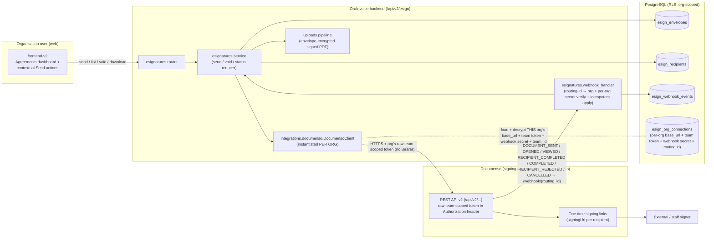
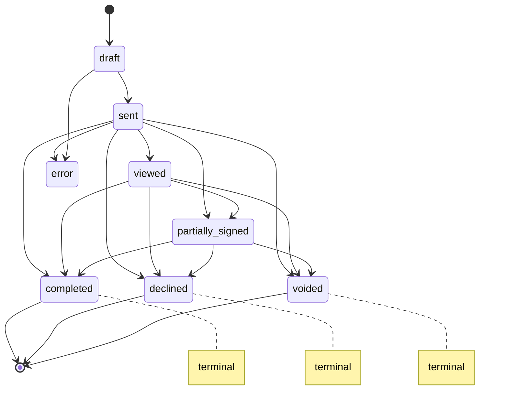
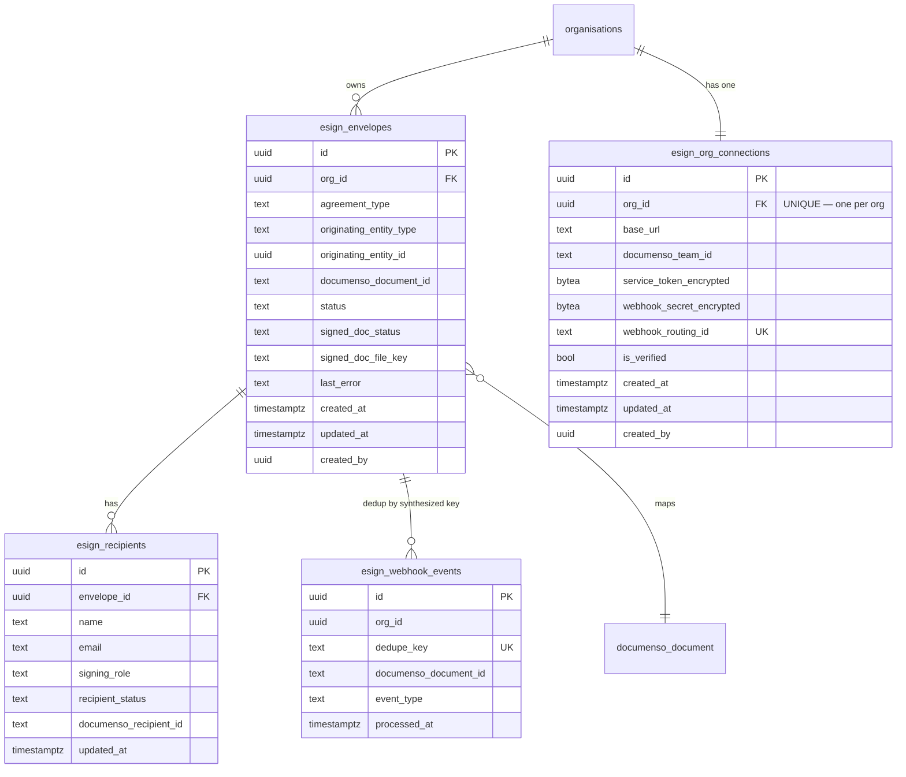

# Design Document — E-Signature Integration

## Overview

The E-Signature Integration adds a new org-gated `esignatures` module that lets authorised organisation users send PDFs for legally-binding digital signature through a **self-hosted Documenso** instance, track signing progress, and store the completed signed PDF back inside OraInvoice. Documenso is the **signing engine only**; OraInvoice remains the **system of record**. A new org-scoped table (`esign_envelopes`) plus a child `esign_recipients` table map OraInvoice documents and recipients onto Documenso document identifiers and per-recipient signing state.

Each organisation has its **own Documenso Team** on the shared self-hosted Documenso instance, with its **own team-scoped API token** and its **own webhook secret**, manually provisioned by a Global Admin during that organisation's onboarding and stored in a **per-org connection record** (`esign_org_connections`). This gives genuine **signing-layer isolation** between tenants — one organisation's documents live inside its own Documenso Team rather than a single shared account. Isolation is therefore enforced at **two layers**: at the Documenso signing layer (each org's documents reside in its own Team, reached only via that org's team-scoped token) **and** inside OraInvoice (org-scoped rows + Postgres RLS + ownership checks on every read/download). The per-org connection follows the app's **existing per-org accounting/Xero connection** precedent (an org-scoped, envelope-encrypted connection record), not a single global integration row.

The design deliberately reuses established OraInvoice infrastructure rather than reinventing it:

| Concern | Existing thing we reuse | Source |
|---|---|---|
| Per-org, envelope-encrypted connection storage (team-scoped token + webhook secret + team id + routing id) | the app's existing **per-org accounting/Xero connection** pattern (org-scoped connection record, envelope-encrypted secrets) + `envelope_encrypt`/`envelope_decrypt_str` | per-org accounting/Xero connection storage, `app/core/encryption.py` |
| Per-org credential loader (decrypt at call time, short-TTL cache keyed by `org_id`) | per-org connection load + small in-process cache (cache-friendly, keyed by `org_id`) — **not** the global-singleton cache | this design (`get_documenso_connection(db, org_id)`) |
| Masked-secret round-trip on save (`_MASK_PATTERN`) | CarJam/Stripe config save heuristic, applied to the per-org connection service | `app/modules/admin/service.py` (`save_carjam_config`) as a mask-pattern reference |
| Module gating + 403 when disabled | `ModuleEndpointMiddleware` (`MODULE_ENDPOINT_MAP`) + `ModuleService.is_enabled` | `app/middleware/modules.py`, `app/core/modules.py` |
| Module catalogue row | `module_registry` seed in migration | `app/modules/module_management/models.py` |
| Encrypted signed-PDF storage | Encrypted uploads pipeline (`envelope_encrypt` + `StorageManager`) | `app/modules/uploads/router.py` (`_store`) |
| Signed agreement surfaced in Staff → Documents tab | merge esign signed docs into the staff documents listing (`GET /api/v2/staff/{id}/documents`); download via the org-checked esign endpoint reading the encrypted pipeline | `app/modules/staff/router.py`, `app/modules/uploads/*` |
| RLS posture (`tenant_isolation` policy) | `current_setting('app.current_org_id', true)::uuid` pattern | migrations `0209`, `0218`, `0223`, `0224` |
| Audit log (best-effort, never rolls back) | `write_audit_log` | audit logging facility |
| In-app notification (role-broadcast, never raises) | `create_in_app_notification` | `app/modules/in_app_notifications/service.py` |
| Array response envelope | `{ items: [...], total: N }` | project convention |
| Async session semantics | `get_db_session` (`session.begin()` auto-commit), `flush()` + `await db.refresh()` | project convention |
| Safe frontend consumption | `?.` / `?? []` / typed generics / AbortController | `.kiro/steering/safe-api-consumption.md` |

### Requirements coverage map

- **R1** Per-org Documenso connection config (Global Admin, per org): store/mask/retrieve team-scoped token + webhook secret in the org's `esign_org_connections` row, connection test, audit, `documenso_team_id` used to scope calls → Components (per-org connection config), Data Models (`esign_org_connections`), Security
- **R2** Module gating + navigation, no trade-family gating → Architecture, Components (module registry + middleware), Frontend
- **R3** Create and send an envelope (PDF + agreement type + ≥1 recipient → Documenso doc + `esign_envelopes` row, error status on failure) → Components (send flow), Data Models, Error Handling
- **R4** Recipient management + email validation atomicity → Components (recipient validation), Data Models (`esign_recipients`), Correctness Properties
- **R5** External signing without an account (Documenso one-time links, no Documenso UI exposure, retry-on-no-delivery) → Architecture, Components
- **R6** Envelope status lifecycle (real Documenso event names) + terminal immutability → Components (status reducer), Correctness Properties
- **R7** Void an envelope (non-terminal only) → Components (void flow), Correctness Properties
- **R8** Per-org webhook routing (`/api/v2/esign/webhook/{routing_id}`) + per-org shared-secret verification (`X-Documenso-Secret`) + synthesized-dedupe-key idempotency → Components (webhook handler), Correctness Properties
- **R9** Store completed signed document via encrypted uploads, attach to originating entity, retry on failure → Components (signed-doc retrieval), Data Models
- **R10** Contextual send actions (invoice/quote/staff Documents) → Frontend
- **R11** Agreements dashboard (list, filter, ordering, detail) → Components (list/detail endpoints), Frontend, Correctness Properties
- **R12** RBAC for sending/voiding (`org_admin`/`branch_admin`/`location_manager` only) → Components (authorization), Correctness Properties
- **R13** Multi-tenant isolation (org_id + RLS + ownership 404) **and signing-layer isolation** (per-org team-scoped token scoped to the org's `documenso_team_id`, R13.7) → Architecture, Data Models, Correctness Properties (Property 20, Property 26)
- **R14** Audit logging + notifications on every transition, best-effort → Components, Error Handling, Correctness Properties
- **R15** Privacy/data protection (encrypted secrets + signed docs, HTTPS, no raw exception/DB text) → Security, Error Handling
- **R16** Human-readable error messages (`{ message, code }`) → Error Handling
- **R17** Signature field placement (≥1 SIGNATURE field per signer before send; block send otherwise) → Components (signature field placement, DocumensoClient), Correctness Properties
- **R18** Per-org webhook subscription registration (register/verify each org's Documenso Team webhook per environment) → Components (webhook subscription registration, per-org connection config)
- **R19** Per-org provisioning + connection lifecycle (record connection, connection test sets `is_verified`, sends blocked while unverified, update clears `is_verified`, Global-Admin "Provision e-signature" action R19.6 + per-org connection management view R19.7) → Components (per-org connection config, optional auto-provisioning), Data Models (`esign_org_connections`), Frontend (Global-Admin surfaces), Correctness Properties (Property 27)
- **R20** Optional best-effort auto-provisioning (Provisioning_Adapter `off|trpc|db`, create Team/token/webhook via Documenso internals, recover-to-manual on failure, manual fallback always available) → Components (Optional auto-provisioning), Security and constraints, Frontend (Global-Admin surfaces), Deployment, Correctness Properties (Property 28)

### Scope and gating decisions

These are explicit, documented decisions so a reviewer does not flag them as omissions.

- **Trade-family gating: none (universal feature).** Per the requirement R2.5 and the always-loaded trade-family-gating steering, the `esignatures` module is available to **every** trade family. No `tradeFamily` gate is applied to the sidebar entry, the dashboard, or the contextual send actions. Gating is purely on the `esignatures` **module** being enabled for the org.
- **Per-org Documenso Teams (signing-layer isolation).** Each organisation has its **own Documenso Team** on the shared self-hosted instance, with its **own team-scoped service token** and its **own webhook secret**, stored in that org's `esign_org_connections` row. Every Documenso call OraInvoice makes on behalf of an org uses **that org's** token, so the org's documents are created and live inside the org's own Team (R13.7). `documenso_team_id` is **actively used** at runtime to scope calls (passed where the v2 API expects `teamId`, and/or implied by the team-scoped token).
- **Residual shared-instance trust — NOT a tenancy defect.** Per-org Teams provide genuine signing-layer isolation between organisations: one org's documents are not visible inside another org's Team, and a compromise of one org's token/secret exposes only **that** org. The residual trust is only that the platform operator (Global_Admin) runs the shared Documenso instance and could access any Team via Documenso server/database access — a standard property of any self-hosted shared instance, not a defect of this design. There is no longer a single shared token or single shared webhook secret across tenants.
- **Documenso never exposed to org users.** Org users only ever interact with OraInvoice surfaces (R5.3). External signers reach Documenso-hosted one-time signing links over the public Cloudflare-tunnel hostname; those links are issued by Documenso and surfaced to OraInvoice only as opaque URLs.
- **Operational concerns out of scope.** Signing certificate provisioning, public hostname/tunnel, SMTP for signer emails, and Pi resource limits are recorded in requirements as accepted non-functional context, not application runtime behaviour.
- **Mobile scope.** The Agreements dashboard and send actions are **web admin** (`frontend-v2/`) surfaces. The mobile Capacitor app is out of scope for this spec (mobile steering scopes admin-style management to web). External signers use a responsive Documenso-hosted page on their own device, so no native work is required to let signers sign.

## Architecture

### System context



### Send → sign → store sequence

```mermaid
sequenceDiagram
  participant U as Org_Sender (web)
  participant API as POST /api/v2/esign/envelopes
  participant S as esign service
  participant C as DocumensoClient
  participant DB as PostgreSQL
  participant DM as Documenso
  participant WH as POST /api/v2/esign/webhook/{routing_id}
  participant ST as uploads pipeline

  U->>API: PDF + agreement_type + recipients[] + originating_entity
  API->>S: validate (org connection verified, role, PDF, ≥1 recipient, all emails valid, each signer gets a field)
  alt connection missing/unverified (R19.3/19.4)
    S-->>API: 503 { message, code } (no Documenso call)
  else validation fails
    S-->>API: 4xx { message, code }  (no Documenso call)
  else valid
    S->>S: load + decrypt THIS org's connection (base_url + team token + team_id)
    S->>C: new DocumensoClient(org base_url, org team token); create_document → upload_pdf → place_signature_field(per signer) → send_document
    alt Documenso error
      C-->>S: error
      S->>DB: insert envelope status=error
      S-->>API: 502 { message, code }
    else ok
      C-->>S: documentId + recipients[] (each carries token + signingUrl)
      S->>DB: insert envelope status=sent + recipients (capture signingUrl per recipient)
      S->>S: audit + notify (best-effort)
      S-->>API: 201 envelope
    end
  end
  Note over DM,WH: later — signer opens/signs
  DM->>WH: webhook to /webhook/{routing_id} ({ event, payload:{id,status,recipients[]}, createdAt }) + X-Documenso-Secret header
  WH->>WH: resolve org by routing_id; load THAT org's webhook secret; constant-time compare header; synthesize + dedupe key
  WH->>DB: apply status transition (terminal-safe), scoped to resolved org
  WH->>S: on DOCUMENT_COMPLETED → retrieve signed PDF (using that org's token)
  S->>DM: download_signed(document_id) (HTTPS)
  S->>ST: envelope_encrypt + store; attach to entity
  WH->>DB: record dedupe_key processed
```

### Status lifecycle



`completed`, `declined`, and `voided` are **terminal** (R6.6): once an envelope is in a terminal status, no subsequent non-void event transitions it out. `error` is non-terminal (a failed send can be retried/voided).

Real Documenso webhook events drive these transitions (see the status reducer below): `DOCUMENT_SENT`, `DOCUMENT_OPENED`/`DOCUMENT_VIEWED` → `viewed`; `DOCUMENT_RECIPIENT_COMPLETED` (one recipient finished) with ≥1 recipient still unsigned → `partially_signed`; `DOCUMENT_COMPLETED` (all signed) → `completed`; `DOCUMENT_RECIPIENT_REJECTED` (declined) → `declined`; `DOCUMENT_CANCELLED` (voided/cancelled in Documenso) on a non-terminal envelope → `voided`.

## Components and Interfaces

### Backend module layout

Following the standard module pattern (`router.py`, `service.py`, `models.py`, `schemas.py`), plus a dedicated client in `app/integrations/` and a status reducer kept pure for testability:

```
app/modules/esignatures/
  __init__.py
  router.py            # /api/v2/esign endpoints (module-gated) + RBAC deps
  webhook_router.py    # /api/v2/esign/webhook/{routing_id} (public PREFIX, per-org-secret-gated, no JWT)
  service.py           # send / void / list / detail / store-signed orchestration
  status.py            # PURE status reducer (event → next status) — no I/O
  validation.py        # PURE recipient-email + PDF validation
  models.py            # EsignEnvelope, EsignRecipient, EsignWebhookEvent, EsignOrgConnection ORM
  schemas.py           # Pydantic request/response models
  connection_service.py# per-org esign_org_connections save/mask/round-trip/test + is_verified lifecycle
  signed_document.py   # retrieve-from-Documenso + store-via-uploads + attach

app/integrations/
  documenso.py         # DocumensoClient (per-org) + get_documenso_connection(db, org_id) loader
  documenso_provisioning.py  # provisioning.py: ProvisioningAdapter (off|trpc|db) — OPTIONAL, best-effort (R20)
```

The webhook router is mounted under a **public prefix** (`/api/v2/esign/webhook/`) so it bypasses JWT auth (Documenso cannot present a user token). The variable `{routing_id}` segment carries the org's opaque `webhook_routing_id`; the handler resolves the org from that id, then authenticates by constant-time comparing the `X-Documenso-Secret` header Documenso sends against **that org's** stored webhook secret. All other endpoints are mounted under `/api/v2/esign` behind the standard auth + module-gate middleware.

### Module registration and gating (R2)

- A migration seeds a `module_registry` row: `slug='esignatures'`, `display_name='Agreements'`, `category` non-admin, `is_core=false`, **no** trade-family entry in `TRADE_FAMILY_REQUIRED_MODULES` (R2.5).
- **The runtime gate is the module, and only the module.** Enablement is decided by `org_modules` (per-org module enablement, configured via Settings → Modules) resolved through `ModuleService.is_enabled(org_id, "esignatures")` (`app/core/modules.py` — Redis + DB, with CORE modules short-circuited). `org_modules` is the **single source of truth**; there is no "enabled if either source" logic and `is_enabled` does **not** consult `feature_flags`.
- **Concrete 403 mechanism (R2.2).** `ModuleMiddleware` (`app/middleware/modules.py`) only returns 403 for request paths that are present in its hardcoded `MODULE_ENDPOINT_MAP` dict. To make requests under `/api/v2/esign` 403 when the module is disabled, the implementation **MUST add the entry `"/api/v2/esign": "esignatures"` to `MODULE_ENDPOINT_MAP`** (a prefix entry covering all esign endpoints). Without this entry the middleware never inspects esign paths and they are silently ungated. Behavioural notes for this middleware: it **skips** any request that has no resolved `org_id` (so the webhook path, which carries no org session, is naturally not gated — no special-casing needed), and it **fails open** on internal errors (a lookup/Redis failure does not 403). Because fail-open means the middleware is not a hard guarantee, the esign router SHOULD **additionally** carry a router-level dependency that calls `ModuleService.is_enabled(org_id, "esignatures")` and raises 403 when disabled — mirroring the staff module's `_require_staff_management_module` dependency, which is how the staff module enforces endpoint-level module 403s. The middleware entry + the router dependency together give defence-in-depth for R2.2.
- **Optional `feature_flags` catalogue row (visibility only, not a runtime gate).** The `feature_flags` table is keyed by **`key`** (not `slug`); its columns include `key, display_name, is_active, default_value, targeting_rules`. The migration MAY optionally seed a catalogue row with `key='esignatures'` purely so the capability is **visible to Global Admin**. This row MUST NOT be wired into the feature-flag middleware's `FLAG_ENDPOINT_MAP` — the module and feature-flag middlewares are independent (each returns 403 on its own gate, so wiring both would compose as a second **AND**-gate and could 403 esign even when the module is enabled). To avoid confusion: this optional flag is **catalogue/visibility only** and has **no** runtime effect on `/api/v2/esign`.
- The webhook endpoint is **not** module-gated (Documenso has no org session, and `ModuleMiddleware` skips requests with no `org_id`); the handler resolves the org from the `webhook_routing_id` in the URL instead.
- **Slug consistency across all four touch-points (mandatory).** The slug `esignatures` MUST be **identical** everywhere it appears: the `MODULE_ENDPOINT_MAP` value (`"/api/v2/esign": "esignatures"`), the `module_registry` seed slug, the router-level `ModuleService.is_enabled(org_id, "esignatures")` dependency, and the frontend `isEnabled('esignatures')` check. It MUST **not** replicate the staff module's latent split, where its endpoint-map value is `staff` while its registry / `is_enabled` slug is `staff_management` — a single canonical slug avoids that class of silent gate mismatch.
- **Gate status code: 403 (intentional divergence from staff's 404).** This design deliberately uses **HTTP 403** for the esign module gate — `ModuleMiddleware` returns 403, and the router-level dependency raises 403 — whereas the staff module's router-level gate returns **HTTP 404 `not_enabled`**. We keep 403 (it matches Property 5 and the Error Handling table), but acknowledge the staff precedent returns 404 so this divergence is intentional and documented rather than an oversight.

### DocumensoClient (`app/integrations/documenso.py`)

A thin async `httpx` client over **Documenso REST API v2** (`/api/v2/...`; v1 is deprecated). The client is **instantiated per organisation** with that org's `base_url` and team-scoped token. Credentials are loaded via a **per-org loader** that reads **only** from the org's `esign_org_connections` row (R1.3, never `.env` for API calls). Because creds are now per-tenant, there is **no** global-singleton cache (the old `stripe_billing` single-value cache framing no longer applies); instead the loader does a per-org connection load that is still cache-friendly via an optional **short-TTL cache keyed by `org_id`**. `_load_connection_from_db(org_id)` opens its own session via `async_session_factory` when needed and decrypts the two secret columns with `envelope_decrypt_str`.

```python
# Per-org connection loader — loads + decrypts THIS org's esign_org_connections row.
# Optional short-TTL (e.g. 300s) cache keyed by org_id; NOT a global singleton.
@dataclass
class DocumensoConnection:
    base_url: str
    service_token: str        # decrypted team-scoped token (raw, no Bearer)
    webhook_secret: str       # decrypted per-org webhook secret
    documenso_team_id: str | None
    is_verified: bool

async def get_documenso_connection(db, org_id: UUID) -> DocumensoConnection: ...
# raises DocumensoNotConfiguredError when the org has no connection row (R1.9)

class DocumensoError(Exception): ...                 # base
class DocumensoNotConfiguredError(DocumensoError): ...# missing creds for this org (R1.9, R1.10)
class DocumensoApiError(DocumensoError):              # upstream non-2xx (R3.5)
    def __init__(self, message: str, *, status: int | None = None): ...

class DocumensoClient:
    # Constructed PER ORG from that org's connection (base_url + team-scoped token + team_id).
    def __init__(self, base_url: str, token: str, http: httpx.AsyncClient,
                 *, team_id: str | None = None): ...

    @classmethod
    def for_org(cls, conn: DocumensoConnection, http: httpx.AsyncClient) -> "DocumensoClient":
        return cls(conn.base_url, conn.service_token, http, team_id=conn.documenso_team_id)

    # Multi-step create flow against API v2 (create is NOT a single call):
    #   (a) POST /api/v2/documents      -> { uploadUrl, documentId, recipients[...] }
    #       each recipient carries a `token` + `signingUrl` (the one-time signing link, R5.1)
    async def create_document(self, *, title: str,
                              recipients: list[RecipientSpec]) -> DocumensoCreateResult: ...
    #   (b) PUT the PDF bytes to the returned uploadUrl
    async def upload_pdf(self, upload_url: str, pdf_bytes: bytes) -> None: ...
    #   (c) place a SIGNATURE field per signer (field types enum incl. SIGNATURE;
    #       requires recipientId, pageNumber, pageX/Y, pageWidth/Height) — or use a template
    async def place_signature_field(self, document_id: str, *, recipient_id: str,
                                    page_number: int, page_x: float, page_y: float,
                                    page_width: float, page_height: float) -> None: ...  # R17.1
    #   (d) POST /api/v2/documents/{id}/send
    async def send_document(self, document_id: str) -> None: ...
    async def download_signed(self, document_id: str) -> bytes: ...        # R9.1
    async def cancel_document(self, document_id: str) -> None: ...         # R7.2 (DOCUMENT_CANCELLED)
    async def test_connection(self) -> bool: ...                          # R1.6
```

- All requests go over **HTTPS** and authenticate with `Authorization: <api_token>` — the **raw team-scoped token value with NO `Bearer` prefix** (R15.4). This is the Documenso convention; do not prepend `Bearer`. The token is **always** the calling org's own team-scoped token, never another org's (R13.7).
- **Team scoping (R1.8, R13.7).** Every Documenso call made on behalf of an org is scoped to that org's own Documenso Team: the client passes `teamId` (`= conn.documenso_team_id`) where the v2 API expects it (e.g. document create/list/template endpoints) and/or relies on the team-scoped token, so the created/queried documents live inside the org's own Team. The client is **constructed per org** (`DocumensoClient.for_org(conn, http)`); there is no process-wide shared client carrying a single token.
- `create_document` returns the Documenso `documentId`, an `uploadUrl` for the PDF bytes, and the `recipients[...]` list where **each recipient carries a `token` and a `signingUrl`** — the one-time signing link surfaced to OraInvoice as an opaque URL (R5.1), captured onto the corresponding `esign_recipients` row.
- **Recipient roles are UPPERCASE in Documenso:** `SIGNER`, `VIEWER`, `CC`, `APPROVER`, `ASSISTANT`. The OraInvoice API accepts lowercase (`signer`/`viewer`) and the client maps them to the uppercase Documenso role (e.g. `signer` → `SIGNER`) when building each `RecipientSpec`.
- If the org has no connection row (or its secrets are absent), `get_documenso_connection` raises `DocumensoNotConfiguredError`, which the service maps to a human-readable "integration not configured" error for **every** operation (R1.9) and for the connection test specifically (R1.10).
- The client never logs the token or webhook secret.

#### Resilience and client lifecycle (performance-and-resilience §2/§3)

The client must not leak `httpx` connection pools and must survive transient upstream failures:

- **Explicit timeouts.** Every call uses an explicit `httpx.Timeout` (e.g. `httpx.Timeout(10.0)`) — never the unbounded default, so a hanging Documenso instance cannot cascade into Esign request latency.
- **Retry with exponential backoff.** Transient failures (`httpx.TimeoutException` and 5xx `HTTPStatusError`) are retried up to 3 attempts with backoff (1s, 2s, 4s). Non-transient failures (4xx, invalid payloads) raise immediately as `DocumensoApiError` and are not retried.
- **Managed client lifecycle.** The `httpx.AsyncClient` is either created per call via `async with httpx.AsyncClient(...) as client:` or held as a shared singleton initialised at app startup and closed on app shutdown. It is **never** instantiated per request and left unclosed (resource-cleanup checklist: "HTTP clients are closed after use or shared as singletons").

```python
async with httpx.AsyncClient(timeout=httpx.Timeout(10.0)) as client:
    for attempt in range(3):
        try:
            resp = await client.post(url, json=payload, headers=auth)
            resp.raise_for_status()
            return resp.json()
        except (httpx.TimeoutException, httpx.HTTPStatusError) as e:
            if attempt == 2 or _is_non_transient(e):
                raise DocumensoApiError("…humanized…", status=_status_of(e))
            await asyncio.sleep(2 ** attempt)
```

#### Fresh session for post-webhook DB work (ISSUE-005 / ISSUE-048 pattern)

Signed-document retrieval is triggered *after* the webhook handler has committed the status transition. Once that session's transaction is committed it is closed, so any follow-up DB work (recording `signed_doc_status`, persisting the file key, attaching to the originating entity) must run on a **fresh** session obtained from `async_session_factory()` with the envelope's `org_id` set on the new RLS context — not on the already-committed webhook session. This is the same fresh-session-after-commit pattern used by the post-payment email path (ISSUE-005/048).

### Per-org connection config and lifecycle (R1, R19)

Documenso connections are **per organisation**, stored in the new org-scoped `esign_org_connections` table (one row per org). This mirrors the app's existing **per-org accounting/Xero connection** storage, **not** the single global `integration_configs` row. A dedicated `connection_service.py` (rather than extending `admin/service.py`'s `valid_names`/`_SAFE_FIELDS`/`_MASKED_FIELDS`, which were for a single global integration row and **no longer apply**) handles save/mask/round-trip/test for the org's connection row. Secrets are envelope-encrypted with `envelope_encrypt(...)` and read back with `envelope_decrypt_str(...)` (note: `envelope_encrypt_str` does **not** exist; do not reference it).

- **Who configures it (R1.1, R19.1).** A Global Admin records the org's connection during onboarding — via that organisation's integration settings or an admin "manage org" view — entering the org's Documenso `base_url`, `documenso_team_id`, team-scoped `service_token`, and `webhook_signing_secret`. OraInvoice **generates** the org's opaque `webhook_routing_id` (it is not entered by the admin).
- **Two provisioning paths from the Global Admin Organisations area (R19.6, R20).** Per-org provisioning is reached from the Global Admin **Organisations list**: a per-row **"Provision e-signature"** action triggers the OPTIONAL best-effort **auto-provision** flow (R19.6, R20 — see "Optional auto-provisioning"), and opening the organisation leads to its **manual** connection management view (below). **Manual is the guaranteed fallback**; auto-provision is convenience-only and may be disabled (`ESIGN_PROVISIONING_MODE=off`).
- **Storage (R1.2, R15.1).** `service_token_encrypted` and `webhook_secret_encrypted` are stored envelope-encrypted (BYTEA) on the org's `esign_org_connections` row; `base_url`, `documenso_team_id`, `webhook_routing_id`, and `is_verified` are non-secret columns.
- **Retrieve at call time (R1.3).** `get_documenso_connection(db, org_id)` loads and decrypts the row at call time; secrets are never read from `.env` for API calls.
- **Masking (R1.4):** `service_token` and `webhook_signing_secret` are returned to the settings UI only as `*_last4` masked forms; plaintext is never returned (R15.3).
- **Masked round-trip (R1.5):** on save, an incoming value matching `_MASK_PATTERN` (`^\*+$|^.{0,4}\*{4,}$`) is skipped, retaining that org's stored secret. `base_url` and `documenso_team_id` are non-secret and saved as-is.
- **Connection test sets `is_verified` (R1.6, R1.10, R19.2).** A Global Admin connection-test action performs an authenticated request against **that org's** Documenso Team using its team-scoped `service_token`, and sets the org's `is_verified` flag according to whether the request succeeds. If the org's connection is not yet configured, it returns a human-readable "configure first" error rather than attempting a call.
- **Audit (R1.7):** writes a `documenso_connection_updated` audit entry (org-scoped) with no plaintext credential values.
- **`documenso_team_id` (R1.8):** persisted and **actively used** at runtime to scope that org's Documenso calls to its own Team (see DocumensoClient → team scoping).
- **Clear `is_verified` on update (R19.5).** When a Global Admin updates the org's connection, `is_verified` is cleared until a subsequent connection test succeeds.
- **Sends blocked while unconfigured/unverified (R19.3, R19.4).** While the org's `esign_org_connections` row is missing or `is_verified=false`, the org's `esignatures` features are treated as unusable: a send is blocked with a humanized error directing the user to have the Documenso integration set up, and **no** Documenso call is made (see Create/send flow step 0; Property 27).
- **Webhook subscription (R18):** the connection surface also reports the org's `webhook_subscription_status` (read-only) and the org's full webhook URL (`/api/v2/esign/webhook/{routing_id}`) so the Global Admin can register it in that org's Documenso Team; see Components → "Webhook subscription registration". This is per-org **and** per-environment.

### API endpoints (`/api/v2/esign` + admin connection management)

All responses are JSON; arrays are wrapped `{ items, total }` (never bare arrays). The org-user endpoints are module-gated (R2.2) and ownership-checked by `org_id` (R13). The connection-management endpoints are Global-Admin-only and operate on a specified org's `esign_org_connections` row.

| Method | Path | Role | Purpose | Reqs |
|---|---|---|---|---|
| `POST` | `/envelopes` | `org_admin`/`branch_admin`/`location_manager` | Create + send envelope (multipart: PDF + JSON metadata) | R3, R4, R10.3/10.4, R12.1, R19.3/19.4 |
| `GET` | `/envelopes` | any org user | List org envelopes, `?status=` filter, recency-ordered | R11.1–11.4, R11.6, R13.3 |
| `GET` | `/envelopes/{id}` | any org user | Envelope detail + per-recipient status + signed-doc link | R11.5, R13.4 |
| `POST` | `/envelopes/{id}/void` | `org_admin`/`branch_admin`/`location_manager` | Void a non-terminal envelope | R7, R12.3 |
| `GET` | `/envelopes/{id}/signed-document` | any org user | Download stored signed PDF (org-checked) | R9, R13.4 |
| `GET` | `/api/v2/admin/organisations/{org_id}/esign/connection` | Global Admin | Read the org's connection (masked secrets + `webhook_routing_id` URL + `is_verified` + `webhook_subscription_status`) — the **manual path**, reached from the org's view | R1.1, R1.4, R18.2, R19.1, R19.7 |
| `PUT` | `/api/v2/admin/organisations/{org_id}/esign/connection` | Global Admin | Save/update the org's connection (masked round-trip; clears `is_verified`) — **manual path** (enter/edit base_url/team_id/service_token/webhook_secret) | R1.2, R1.5, R1.7, R19.1, R19.5, R19.7 |
| `POST` | `/api/v2/admin/organisations/{org_id}/esign/connection/test` | Global Admin | Connection test against the org's Team; sets `is_verified` | R1.6, R1.10, R19.2, R19.7 |
| `POST` | `/api/v2/admin/organisations/{org_id}/esign/auto-provision` | Global Admin | OPTIONAL best-effort auto-provision (create Team + token + webhook); returns masked connection + status; humanized error + manual-completable on failure | R19.6, R20.1–R20.5 |
| `POST` | `/webhook/{routing_id}` | (per-org shared secret only) | Inbound Documenso event for the org resolved from `routing_id` | R8 |

> **Why the connection/auto-provision endpoints are canonically under `/api/v2/admin/organisations/{org_id}/...`.** A Global Admin has **no active org context** (they are not a member of the target org), so a bare `/api/v2/esign/connection` that infers the caller's org would not work for the per-org management/auto-provision flows — the target org id MUST be carried explicitly in the path. `/api/v2/admin/` is already a recognised **global-admin-only, tenant-context-exempt** prefix (`_ADMIN_ONLY_PREFIXES` in `app/middleware/auth.py`). Being **outside** the `/api/v2/esign` `MODULE_ENDPOINT_MAP` prefix also means connection setup/auto-provision are intentionally **not module-gated** — a Global Admin can configure the connection regardless of whether the org has enabled the `esignatures` module (desirable: you configure before/independent of enablement). These endpoints carry the `require_global_admin` dependency. The `/organisations/{org_id}` segment matches the existing admin router's organisation sub-resource naming (e.g. `PUT /organisations/{org_id}`, `GET /organisations/{org_id}/detail`, `POST /organisations/{org_id}/apply-coupon`); these routes therefore live on the **admin surface** — added to the admin router (`app/modules/admin/router.py`) or a dedicated esign-admin router mounted at `/api/v2/admin` (the admin router is mounted at both `/api/v1/admin` and `/api/v2/admin` via the `_V1_ROUTERS_FOR_V2` loop in `app/main.py`). The org-**user** send/list/void/download endpoints stay under `/api/v2/esign/...` and remain module-gated.

**RBAC (R12).** Send and void require one of `org_admin`, `branch_admin`, or `location_manager` (the role `manager` does not exist in this codebase). The dependency is `require_role(ORG_ADMIN, BRANCH_ADMIN, LOCATION_MANAGER)` from `app/modules/auth/rbac.py`; every other role (`salesperson`, `staff_member`, etc.) is rejected with **HTTP 403** (R12.2, R12.3). Read/list/download are available to any authenticated org user (still org-scoped).

**Create/send flow (R3, R4).** `service.create_and_send_envelope(...)`:
0. **Connection gate (R19.3, R19.4).** Load the org's `esign_org_connections` row; if it is missing or `is_verified=false`, block the send with a humanized error (HTTP 503 `integration_not_configured`) directing the user to have the Documenso integration set up, and make **no** Documenso call. Only a present, verified connection proceeds.
1. Authorize role (R12.1) and module (R2.2).
2. Validate source file is a PDF (R3.4) and that there is **≥1 recipient** (R3.3) — pure checks in `validation.py`.
3. Validate **every** recipient email syntactically; if **any** is invalid, reject the **entire** send with a validation error identifying the offending recipient and make **no** Documenso call (R4.2, R4.3, R4.6) — atomic all-or-nothing.
4. Build the org's client (`DocumensoClient.for_org(conn, http)`) and call Documenso (multi-step, API v2) **using that org's team-scoped token, scoped to its `documenso_team_id`** (R13.7): `create_document` → `upload_pdf` → `place_signature_field` (per signer, R17) → `send_document`.
   - On Documenso error: insert envelope row with `status=error`, write audit + notification for the failed attempt (R3.8), and return a human-readable 502 (R3.5).
   - On success: insert `esign_envelopes` row (`org_id`, `agreement_type`, originating-entity ref, `documenso_document_id`, `status=sent`) and one `esign_recipients` row per recipient (R3.2, R4.4); `flush()` then `await db.refresh()` before serialising.
5. Write audit + in-app notification for the successful send (R3.7), best-effort.
6. Originating entity is set from the calling surface: invoice/quote id (R10.3) or staff id (R10.4).

**Status reducer (`status.py`, R6).** A pure function `next_status(current, event, recipients_state) -> EnvelopeStatus | None` encodes the lifecycle. It takes the recipients' signed/unsigned state (sourced from the webhook payload's `recipients[...]` array) as an input — not a synthetic "all signed" boolean — because that is what distinguishes `partially_signed` from `completed`. Mapping by real Documenso event name:
- `DOCUMENT_OPENED` / `DOCUMENT_VIEWED` → `viewed`, unless already terminal (R6.2).
- `DOCUMENT_RECIPIENT_COMPLETED` with **≥1 recipient still unsigned** → `partially_signed` (R6.3).
- `DOCUMENT_COMPLETED` → `completed`, including the all-at-once case with no intervening `partially_signed` and the single-recipient case (R6.4).
- `DOCUMENT_RECIPIENT_REJECTED` → `declined` (R6.5).
- `DOCUMENT_CANCELLED` on a non-terminal envelope → `voided` (R6.6 cancel path).
- Returns `None` (no transition) when `current` is terminal and the event is a non-void event (R6.7). Keeping this pure makes the terminal-immutability and "completed without partial" rules directly property-testable.

**Void flow (R7).** If the envelope is non-terminal, call `DocumensoClient.cancel_document` **on the org's own client** (Documenso `DOCUMENT_CANCELLED`), set `status=voided`, audit + notify (R7.4). If already terminal, reject with a human-readable error (R7.3) and make no Documenso call.

### Signature field placement (R17)

Documenso will not collect a signature unless the document carries a **SIGNATURE field** bound to a signer recipient. Before requesting send, the service guarantees **every signer recipient has ≥1 SIGNATURE field**:

1. After `create_document` + `upload_pdf`, for each recipient whose role maps to `SIGNER` (and `APPROVER`, which also signs), call `place_signature_field(document_id, recipient_id=..., ...)` via `POST /api/v2/documents/{id}/fields` — **or** create the document from a Documenso **template** that already carries signer fields (R17.1).
2. If a signer recipient would end up with **no** SIGNATURE field (e.g. field placement failed or returned no field for that recipient), the service **blocks the send**: it does **not** call `send_document`, and returns a humanized validation error identifying the signer without a field (R17.2). The envelope is recorded with `status=error` consistent with the failed-send path so the attempt is audited.
3. **MVP default placement.** A single SIGNATURE field per signer is placed on the **last page** at a sensible default position. Documented default coordinates (normalised page units, origin top-left): `pageNumber = <last page>`, `pageX = 65`, `pageY = 85`, `pageWidth = 25`, `pageHeight = 8` (a signature box in the lower-right of the final page). Viewers/CC recipients receive no signature field. **Future enhancement:** visual drag-and-drop placement and per-agreement-type Documenso templates; the MVP default-position approach is intentionally minimal.

Because only signers require a field, the field-placement check iterates the signer subset of recipients; a send with zero signer recipients (e.g. all `VIEWER`) is itself a validation error, since there would be nothing to sign.

### Webhook subscription registration (R18)

For signing events to reach OraInvoice, each organisation's **Documenso Team** must carry a **webhook subscription** pointing at that org's OraInvoice webhook URL `/api/v2/esign/webhook/{routing_id}` (carrying that org's `X-Documenso-Secret`). This is **per-org and per-environment** — each org has its own Team, and dev/prod run different Documenso instances/URLs, so every org registers its own subscription independently for each environment (R18.3).

- **Global Admin provisioning / documented setup (R18.1).** Because Documenso's REST API exposes no team/token/webhook-creation endpoints (see Non-Functional Constraints), registering an org's Team webhook subscription is a **manual Global Admin step in the Documenso UI** during that org's onboarding: register a subscription on the org's Team targeting the org's `/api/v2/esign/webhook/{routing_id}` URL with that org's `webhook_signing_secret`. The OraInvoice connection surface emits the exact URL (including the generated `routing_id`) to copy into Documenso.
- **Surface configured state (R18.2).** The org's connection response includes a `webhook_subscription_status` field (e.g. `configured` / `not_configured` / `unknown`) and the org's webhook URL so a Global Admin can confirm that org's subscription is in place for the active environment.
- The URL and secret registered differ per org (each carries its own `routing_id` + secret) and per environment (dev Documenso → dev OraInvoice URL; prod tunnel → prod OraInvoice URL).

### Optional auto-provisioning (Provisioning_Adapter, R20)

Auto-provisioning is an **optional, best-effort** capability that tries to create an organisation's Documenso Team, team-scoped token, and webhook subscription automatically so a Global Admin does not have to do it by hand in the Documenso UI. It is layered **on top of** the per-org manual connection model — it never replaces it. The manual path (R1, R19) remains the **guaranteed, supported fallback at all times** (R20.4); auto-provisioning is a convenience that can be turned off entirely.

**Why it must use Documenso internals.** Documenso's **public REST API exposes NO endpoints** for creating a Team, minting a team API token, or creating a webhook subscription (verified against the running `documenso/documenso:latest` OpenAPI v1+v2 surface — those operations exist only behind Documenso's own UI/admin layer). Therefore any automatic provisioning must drive Documenso's **unsupported internals**. This is **upgrade-fragile**: a Documenso version bump can change the internal tRPC contract or the database schema and break the adapter. The design treats this as best-effort only, isolates it, and gates it behind a platform config flag so it can be disabled the moment it stops working — with the manual path always available.

#### `provisioning.py` module and adapter strategies

A new `app/integrations/documenso_provisioning.py` (referred to as `provisioning.py`) defines a `ProvisioningAdapter` interface and configurable implementations selected by a **platform-level** config/env flag:

```
ESIGN_PROVISIONING_MODE = off | trpc | db
```

```python
@dataclass
class ProvisionedTeam:
    team_id: str

@dataclass
class ProvisionedToken:
    token: str            # plaintext team-scoped token, returned to OraInvoice ONCE

class ProvisioningError(Exception):     # humanized, isolated — never corrupts the manual path
    """Any adapter failure surfaces as this; carries a human-readable message only."""

class ProvisioningAdapter(Protocol):
    async def create_team(self, *, org) -> ProvisionedTeam: ...
    async def mint_team_token(self, *, team_id: str) -> ProvisionedToken: ...
    async def ensure_webhook(self, *, team_id: str, routing_url: str, secret: str) -> None: ...

def get_provisioning_adapter() -> ProvisioningAdapter | None:
    # returns None when ESIGN_PROVISIONING_MODE == "off"; otherwise the trpc or db adapter
    ...
```

The two candidate adapter strategies, selected by `ESIGN_PROVISIONING_MODE`:

- **`trpc` adapter (`TrpcProvisioningAdapter`).** Calls Documenso's **internal admin tRPC endpoints** — the same ones Documenso's own web UI calls — to (a) create a Team, (b) create a team API token, and (c) create the Team's webhook subscription. It authenticates with a **platform-level Documenso admin session/credential held by OraInvoice as platform config** (NOT a per-org credential): a single OraInvoice-operator Documenso admin login/session used only to drive provisioning. This relies on Documenso's tRPC contract, which is **not a public API** and can break on upgrade.
- **`db` adapter (`DbProvisioningAdapter`).** Because Documenso is **self-hosted**, this writes **directly to Documenso's PostgreSQL** using a **platform-config Documenso DB URL**: insert the `Team`, the owner `TeamMember`, a hashed **API token row**, and a **webhook subscription row**. Documenso stores token rows **hashed**, so the adapter must (1) generate the token itself, (2) store its **hash** in Documenso's token table, and (3) return the **plaintext** to OraInvoice once (so OraInvoice can persist it envelope-encrypted in `esign_org_connections`). This relies on Documenso's internal DB schema and is **upgrade-fragile**.
- **`off`.** Auto-provisioning is **disabled**: the auto-provision action is unavailable and only the manual connection config is offered, with the UI indicating auto-provisioning is unavailable (R20.5).

**Isolation guarantee.** The adapter is fully **isolated**: every adapter call is wrapped so that **any** exception (tRPC error, DB error, schema mismatch, version drift) is caught and surfaced as a **humanized `ProvisioningError`**. An adapter failure **NEVER** corrupts or blocks the manual path — the org's `esign_org_connections` row is only ever written with valid values, and a failed run leaves it in a manually-completable state. Both `trpc` and `db` are explicitly marked **best-effort, unsupported, and upgrade-fragile** in code comments and operator docs.

#### Auto-provision flow (`service.auto_provision_connection(db, org_id)`)

The orchestration is **idempotent / re-runnable** where possible and persists progress at each step so a failure is always recoverable by manual completion:

0. **Mode gate.** If `get_provisioning_adapter()` is `None` (mode `off`), return a humanized "auto-provisioning is unavailable; configure manually" result (R20.5). The manual path is unaffected.
1. **Generate OraInvoice-side identifiers first.** Generate the org's `webhook_routing_id` (opaque) and a fresh `webhook_secret` **before** touching Documenso, so the routing URL (`/api/v2/esign/webhook/{routing_id}`) and secret are known and can be registered in one pass. If the org already has a recorded `webhook_routing_id`/secret (a prior partial run), **reuse** them.
2. **`adapter.create_team`** — but if the org's connection already records a `documenso_team_id`, **skip creation and reuse** it (don't create a duplicate Team). Persist `base_url` + `documenso_team_id` immediately.
3. **`adapter.mint_team_token`** — mint the team-scoped token; persist it envelope-encrypted into `service_token_encrypted` immediately.
4. **`adapter.ensure_webhook(team_id, routing_url, secret)`** — create (or confirm) the Team's webhook subscription targeting the org's routing URL with the generated secret; persist `webhook_secret_encrypted` + `webhook_routing_id`.
5. **Connection test + verify.** Run the existing connection test against the org's Team using the freshly-minted token and set `is_verified` from the result (R20.2). Surface the org's webhook URL for the Global Admin to confirm/register.
6. **Failure at any step (R20.1, R20.3).** Catch the `ProvisioningError`, **persist whatever was already created** (team id, token, secret, routing id — partial state is valid and reusable, never broken), set `is_verified=false`, and return a **humanized error** telling the admin to complete the connection manually. No partially-applied broken state is ever left, and the manual path still works on that same row (Property 28).

Because each successful step is persisted before the next is attempted, a re-run reuses already-created artefacts (Team, token, secret, routing id) rather than duplicating them — making the flow safely repeatable and always manually-completable.

#### Auto-provision endpoint

| Method | Path | Role | Purpose | Reqs |
|---|---|---|---|---|
| `POST` | `/api/v2/admin/organisations/{org_id}/esign/auto-provision` | **Global Admin only** | Run `auto_provision_connection` for the target org; returns the resulting connection (masked secrets) + status (`provisioned`/`partial`/`unavailable`) | R20.1–R20.5 |

The endpoint runs `service.auto_provision_connection(db, org_id)` for the target org and returns the resulting connection in the **same masked shape** as the connection GET (secrets as `*_last4`, never plaintext — R1.4/R15.3) plus a status indicating full provisioning, partial/manual-completion-needed, or unavailable (mode `off`). On any adapter failure it returns the humanized error and the (partially-populated, manually-completable) connection.

#### Security and constraints (auto-provisioning)

- **Platform-level credentials, not per-org.** The `trpc` adapter needs a **platform-level Documenso admin session/credential** and the `db` adapter needs a **platform-config Documenso DB URL**. These are held by OraInvoice as **platform configuration** (env / platform config), **envelope-encrypted**, and are **NOT** stored on any org's `esign_org_connections` row. They are used **only** for provisioning and never for per-org Documenso API calls (those always use the org's own team-scoped token, R13.7).
- **Unsupported and upgrade-fragile.** Both adapters drive Documenso **internals** (admin tRPC layer or direct PostgreSQL writes) because Documenso's public REST API exposes no team/token/webhook-creation endpoints. This is explicitly **unsupported** by Documenso and can break on a Documenso upgrade. It is gated behind `ESIGN_PROVISIONING_MODE` so it can be disabled instantly.
- **Manual remains supported.** Disabling auto-provisioning (`mode=off`) loses **no** capability: the per-org manual connection config (R1, R19) is the guaranteed, supported path at all times (R20.4) and the UI indicates auto-provisioning is unavailable (R20.5).
- **Token hashing (db adapter).** Documenso stores API tokens **hashed**. The `db` adapter generates the token, writes only its **hash** into Documenso's token table, and returns the **plaintext** to OraInvoice exactly once for envelope-encrypted storage in `service_token_encrypted` — the plaintext is never logged.

### Webhook handler (`webhook_router.py` + `service.apply_webhook`, R8)

1. Extract the `{routing_id}` path segment and read the `X-Documenso-Secret` header and the request body.
2. **Resolve the org (R8.1).** Look up the `esign_org_connections` row whose `webhook_routing_id == routing_id` (a cross-org lookup under system DB context — see below). If **no** org matches, return **HTTP 401** and modify **nothing** (R8.2). Otherwise load **that org's** decrypted `webhook_secret`.
3. **Per-org shared-secret verify (R8.1, R8.2).** Constant-time compare the header value against the resolved org's webhook secret: `hmac.compare_digest(header_value, org_webhook_secret)`. Documenso does **not** HMAC the body — it sends the configured secret **verbatim** in the `X-Documenso-Secret` header, so this compares the **secret string itself** (NOT a computed signature). `hmac.compare_digest` is used only for timing-safe comparison. On mismatch (or unknown routing id, step 2), return **HTTP 401** and modify **nothing** (R8.2). Verification happens before any DB write to envelopes.
4. Parse the payload `{ event, payload: { id, status, recipients[...] }, createdAt, webhookEndpoint }` and extract the Documenso **document identifier** (`payload.id`) and event type.
5. **Idempotency (R8.3, R8.4):** the payload carries **no unique event id**, so synthesize a **dedupe key** = `SHA-256(event_type + documenso_document_id + recipient_identifier/status + createdAt)`. Attempt to insert that `dedupe_key` into `esign_webhook_events` (unique constraint, stamped with the resolved `org_id`). If it already exists, acknowledge **200** without re-applying any state change. This makes processing exactly-once under retries/duplicates.
6. Look up the envelope by `documenso_document_id` **scoped to the resolved org**. If none maps within that org, acknowledge **200** without modifying anything (R8.5).
7. Update per-recipient status (R4.5), compute `next_status(current, event, recipients_state)` (recipients state taken from the payload's `recipients[...]`) and apply it if non-`None` (terminal-safe). All retrieved/stored data is associated with the resolved/recorded `org_id` (R13.6).
8. On a transition, write audit + notification (R6.8, R14). On reaching `completed`, trigger signed-document retrieval (R9) **using that org's client**.

Idempotency is enforced at two layers: a unique index on the synthesized `dedupe_key` (dedupe) and the terminal-status guard in the reducer (so even a replayed pre-terminal event cannot regress a terminal envelope).

> **Verified against the running Documenso instance.** The webhook authentication scheme was confirmed against the live self-hosted `documenso/documenso:latest` instance (OpenAPI v1+v2 at `localhost:3030`): Documenso sends the configured secret **verbatim** in the `X-Documenso-Secret` header and does **not** HMAC the body. The payload `{ event, payload: { id, status, recipients[...] }, createdAt, webhookEndpoint }` carries **no unique event id**, which is why OraInvoice synthesizes its own `dedupe_key`. The handler therefore performs a constant-time **shared-secret** comparison (not a computed-signature check) against the **org resolved from the `routing_id`**, preserving the verify-before-processing guarantee.

#### Public-surface middleware wiring (R8, security-hardening §1, completeness Rule 6)

The webhook is the only Esign endpoint that bypasses JWT — Documenso cannot present a user token, so the request is authenticated solely by the per-org `X-Documenso-Secret` shared-secret header (matched against the org resolved from the `routing_id`). Because the path now carries a **variable** segment (`/{routing_id}`), it is registered by **prefix**, not exact path. Trace the full request path (Nginx → middleware stack → router) so no layer silently blocks it, mirroring how other prefix-based public routes are registered:

- **Auth middleware (`app/middleware/auth.py`):** register the **prefix** `/api/v2/esign/webhook/` in the `PUBLIC_PREFIXES` collection (not the exact-path `PUBLIC_PATHS` set — that approach was for a single shared webhook with no variable segment) so the JWT check is skipped for every `routing_id`. `AuthMiddleware` sets **discrete** attributes on `request.state` — `request.state.user_id`, `request.state.org_id`, and `request.state.role` (there is **no** `request.state.user` object) — so downstream code must read them defensively as `getattr(request.state, "org_id", None)` / `getattr(request.state, "user_id", None)` / `getattr(request.state, "role", None)`. On the public webhook path (in `PUBLIC_PREFIXES`) these are all `None`, which is expected: the handler does **not** rely on session org context and instead resolves the org from the `routing_id` after `RESET app.current_org_id`. Keep the security-hardening intent — never assume `request.state` carries user context — but express it via these `getattr(..., None)` reads, not a `request.state.user` check.
- **CSRF / security headers (`app/middleware/security_headers.py`):** add the prefix `/api/v2/esign/webhook/` to the `_CSRF_EXEMPT_PREFIXES` collection (prefix, not the exact-path `_CSRF_EXEMPT_PATHS` set). A server-to-server callback carries no CSRF token or session cookie; mirror how other prefix-based public routes are CSRF-exempted.
- **Nginx:** no new `location` block is required — `/api/v2/esign/webhook/{routing_id}` is matched by the existing `/api/` proxy location that already fronts the FastAPI app.
- **Module gate:** the webhook is **not** module-gated. `ModuleMiddleware` skips any request with no resolved `org_id`, and the webhook carries no org session (the org is resolved from the `routing_id`, not the session), so it is naturally bypassed — no special-casing required.

#### System DB context and RLS reset (R13.6, completeness Rule 7)

Because the webhook runs with no JWT, `app.current_org_id` is never set by the session dependency, so RLS would filter both the `esign_org_connections` routing-id lookup and the cross-org envelope lookup to nothing. The handler therefore runs with a **system/elevated DB context**: it explicitly `RESET`s the GUC before the lookups —

```python
await db.execute(text("RESET app.current_org_id"))   # completeness Rule 7 pattern
```

— then (a) resolves the org by `webhook_routing_id` against `esign_org_connections` across orgs (R8.1), (b) looks up the envelope by `documenso_document_id` scoped to that resolved `org_id`, and (c) stamps that `org_id` onto every retrieved/stored row (the webhook-event row and any signed-document record) per R13.6. This matches the established "RLS bypass for cross-org lookups" pattern (reset the GUC, then scope by the resolved row's own `org_id`). RLS remains the defence-in-depth layer for all org-user-facing reads; the application-level ownership check (404 on cross-org, Property 20) is the primary guard for org-user reads and is unaffected by this system-context path.

### Signed-document retrieval and attachment (`signed_document.py`, R9)

On `completed`:
1. `DocumensoClient.download_signed(documenso_document_id)` over HTTPS (R9.1, R15.4).
2. **Always** store the signed PDF through the encrypted uploads pipeline (`envelope_encrypt` on the bytes + `StorageManager`, returning a `file_key`, category `esign_signed/<org_id>/...`); persist that `file_key` on the envelope (`signed_doc_file_key`). **Never** write the plaintext compliance store (R9.2, R15.2). This applies uniformly to **all** originating-entity types — including staff.
3. Attach / surface to the originating entity (the stored file is identical in all cases — only how it is surfaced differs):
   - **staff** → **do NOT create a `ComplianceDocument`.** The Staff → Documents tab is backed by `ComplianceDocument` + `ComplianceFileStorage`, which store files **unencrypted on disk** — that conflicts with R9.2/R15.2. Instead, surface the signed agreement in the Staff → Documents tab by **extending the staff documents listing** (the `GET /api/v2/staff/{id}/documents` response) to **merge in** the esign signed documents for that staff member (or by adding an esign sub-section to that tab). Both the listing entry and its download are served from the **encrypted pipeline**, never copied into `ComplianceFileStorage`.

     **Schema extension required (verified).** The existing `GET /api/v2/staff/{id}/documents` returns a `StaffDocumentListResponse` of `StaffDocumentItem`, whose current fields are **only** `(id, document_type, description, file_name, file_size, created_at, expiry_date)` — there is **no** download-link or source field. Merging esign signed docs therefore requires **extending `StaffDocumentItem`** (and its mapping) with **(a)** a source/origin discriminator (e.g. `source: "compliance" | "esign"`) and **(b)** a way to fetch the esign file (e.g. a nullable `esign_envelope_id` or `download_url`), so the frontend routes esign rows to the org-checked `GET /api/v2/esign/envelopes/{id}/signed-document` (which streams from the encrypted pipeline) while compliance rows keep their existing path. The staff endpoint is gated by `_require_staff_management_module` (module slug `staff_management`); the merge must remain org-scoped and preserve the `{ items, total }` response shape.
   - **invoice/quote** → attach to that entity by storing a reference (the envelope + `file_key`) on the invoice/quote (R9.4) — unchanged; still the encrypted pipeline.
   - **Download path (all cases):** reads are served by the org-checked esign endpoint `GET /api/v2/esign/envelopes/{id}/signed-document`, which streams from the encrypted uploads pipeline (decrypting at read time) after the `org_id` ownership check (R13.4). The staff Documents tab links to this same esign endpoint for esign-origin rows.
4. Write an audit entry that the signed document was stored (R9.6); exclude document contents (R14.4).
5. **Failure handling:**
   - Retrieval failure: keep envelope `completed`, record the retrieval failure on the envelope (`signed_doc_status='pending_retrieval'`), retry on a subsequent webhook or a scheduled sweep (R9.5).
   - Storage failure: reject the storage attempt, store **nowhere** else/temporarily, retry later (R9.7).

A lightweight scheduled task scans `completed` envelopes with `signed_doc_status != 'stored'` and retries, giving the "subsequent scheduled attempt" path for R9.5/R9.7. **Scheduler wiring (verified).** The existing scheduler is a custom asyncio loop in `app/tasks/scheduled.py` driven by a `_DAILY_TASKS` list of `(task_fn, interval_seconds, name)` entries, guarded by a Redis `SETNX` leader lock with node-role checks (WRITE_TASKS are skipped on standby nodes). Because the retry sweep performs DB writes, it MUST be registered as a `_DAILY_TASKS` entry **and** treated as a **WRITE task** so it is skipped on read-only standby nodes and runs only on the primary.

### Email architecture (integration-credentials-architecture)

- **Documenso owns all signer email.** Every signer-facing email — verification, the signing invitation, the one-time signing link, and completion notices to external recipients — is sent by **Documenso itself** through Documenso's own configured SMTP. This is out of OraInvoice's scope; OraInvoice issues no signer email and never holds signer-email SMTP config.
- **MVP: in-app notifications only.** OraInvoice's only sender-facing surface for e-signature events is the existing in-app notification facility (`create_in_app_notification`, R14). The MVP sends **no** OraInvoice-originated email for e-signatures.
- **If OraInvoice email is ever added** (e.g. a future "your agreement is complete" email to the org sender), it MUST go through the unified sender `app/integrations/email_sender.send_email` — **never** `smtplib` directly. A CI guard test (`tests/test_no_smtplib_outside_email_sender.py`) fails the build if any module other than `email_sender.py` imports `smtplib`.

### Frontend components (`frontend-v2/`, React 18 + TS + Vite + Tailwind)

These surfaces live in **`frontend-v2/`** (the active web app); `frontend/` is archived and gets no e-signature work. Every page below satisfies the frontend-feature-completeness checklist (loading / error / empty states, confirmation modals on destructive actions) and the safe-api-consumption rules (`?.`, `?? []`, `?? 0`, typed generics, `AbortController` cleanup).

- **Sidebar entry "Agreements"** gated on the `esignatures` module via the existing module context (R2.3/R2.4). No trade-family gate (R2.5).
- **`AgreementsDashboardPage`** — lists org envelopes via `GET /api/v2/esign/envelopes`, status filter chips, recency-ordered, with a detail drawer showing per-recipient status and a signed-document download link when present (R11). Required states:
  - **Loading skeleton** (`animate-pulse` rows) during the initial fetch — never a blank screen.
  - **Error state** with a human-readable message and a **Retry** button on fetch failure (re-issues the request).
  - **Empty state** with icon + message + guidance when the org has no envelopes (or the active filter matches none).
  - Safe consumption: `res.data?.items ?? []`, `res.data?.total ?? 0`, typed generics on every call (`apiClient.get<EnvelopeListResponse>(...)`), and `AbortController` cleanup in every `useEffect`.
- **`SendForSignatureModal`** — reusable modal: PDF upload/select, agreement-type select (the five `Agreement_Type` values, R3.6), recipient rows (name/email/role). Standard modal pattern (backdrop, centred card, Cancel + Confirm). Surfaces inline validation and server `{ message, code }` errors; the **Send** button shows a loading/disabled state while the request is in flight and re-enables on error so the user can correct and retry. Loading skeleton on the PDF/agreement pickers while any reference data loads.
- **Void action (destructive — frontend-feature-completeness "Every Action Must Have").** Voiding an envelope opens a **confirmation modal** ("Void this agreement? This cannot be undone.") with Cancel + Confirm; the Confirm button is **disabled and shows a spinner** while `POST /envelopes/{id}/void` is in flight, surfaces the server `{ message, code }` on failure (e.g. the R7.3 "already terminal" message), and refreshes the dashboard row on success.
- **Contextual actions (R10):**
  - "Send for signature" on invoice and quote pages → opens the modal pre-bound to that invoice/quote as originating entity (R10.3).
  - "Send for signature" on the Staff → Documents tab → pre-bound to that staff member (R10.4).
  - All three actions are hidden when the module is disabled (R10.5).
- Signed staff agreements appear in the existing Staff → Documents tab because the staff documents listing (`GET /api/v2/staff/{id}/documents`) is extended to merge in the org's esign signed documents for that staff member, served (read/download) from the encrypted uploads pipeline via `GET /api/v2/esign/envelopes/{id}/signed-document` — **not** as plaintext `ComplianceDocument` rows (R9.3).

#### Global-Admin provisioning surfaces (`frontend-v2/` admin area, R19.6, R19.7, R20)

These are **Global-Admin-only** surfaces in the frontend-v2 admin area. They are distinct from the org-user dashboard/modal/contextual actions above, which are **unchanged**.

- **Organisations list — per-row "Provision e-signature" action (R19.6, R20).** The Global Admin **Organisations list** page (`frontend-v2/src/pages/admin/Organisations.tsx`) gets a per-row "Provision e-signature" action that slots into the existing per-row actions column and calls `POST /api/v2/admin/organisations/{org_id}/esign/auto-provision` for that org. It shows **progress** while the best-effort run executes, then:
  - **success →** the row reflects the **verified** connection state (`is_verified=true`) and surfaces the org's webhook URL to confirm/register;
  - **failure →** a **humanized error** (the server `{ message, code }`) plus a **"configure manually"** link that opens that org's E-Signature connection management view (below) pre-populated with whatever partial state was recorded — so the admin can finish it by hand.
  When `ESIGN_PROVISIONING_MODE=off`, the action indicates auto-provisioning is **unavailable** and points the admin to manual configuration (R20.5).
- **E-Signature connection management view (R19.7) — the manual path.** There is **no** existing Global-Admin per-org integration/connection page to mirror: the Xero/integrations settings page (`frontend-v2/src/pages/settings/IntegrationsSettings.tsx`) is **org-level** (org_admin), **not** Global-Admin per-org. The per-org E-Signature connection management view therefore lives in the **Global-Admin org detail page** (`frontend-v2/src/pages/admin/OrganisationDetail.tsx`), reached by opening an org from the Organisations list (`frontend-v2/src/pages/admin/Organisations.tsx`, R19.7), and mirrors the existing Organisations row-action + modal pattern. It is the per-org connection settings GUI to **enter/edit** `base_url`, `documenso_team_id`, `service_token`, and `webhook_secret` (secrets **masked on read**, masked round-trip on save), showing the org's **webhook URL** and **`is_verified`** status, with a **Test** button (runs the connection test, sets `is_verified`). This is the guaranteed manual fallback and is always available regardless of `ESIGN_PROVISIONING_MODE`.
- Both surfaces are **Global-Admin** (frontend-v2 admin area) and follow the frontend-feature-completeness checklist (loading/progress, error with retry, empty/disabled states) and safe-api-consumption rules (`?.`, `?? []`, typed generics, `AbortController` cleanup). **Org-user** dashboard/modal/contextual send actions are **unchanged** by this addition.

## Data Models

### Entity relationship



### Table: `esign_envelopes` (R3.2, R13.1)

| Column | Type | Notes |
|---|---|---|
| `id` | UUID PK | `gen_random_uuid()` |
| `org_id` | UUID NOT NULL | tenant key; RLS scoped; indexed |
| `agreement_type` | TEXT NOT NULL | CHECK in (`sales_agreement`,`purchase_agreement`,`nda`,`employment_agreement`,`contractor_agreement`) (R3.6) |
| `originating_entity_type` | TEXT NOT NULL | CHECK in (`invoice`,`quote`,`staff`) |
| `originating_entity_id` | UUID NOT NULL | soft reference (no hard FK — entities live across modules) |
| `documenso_document_id` | TEXT NULL | NULL only when `status='error'` before doc creation; indexed for webhook lookup |
| `status` | TEXT NOT NULL | CHECK in the 8 `Envelope_Status` values (R6.1); default `draft` |
| `signed_doc_status` | TEXT NOT NULL | `none` / `pending_retrieval` / `stored` (R9.5/9.7) |
| `signed_doc_file_key` | TEXT NULL | uploads-pipeline file key once stored (R9.2) |
| `last_error` | TEXT NULL | human-readable last error (no raw exception/DB text, R15.5) |
| `created_at` | TIMESTAMPTZ NOT NULL | default `now()` |
| `updated_at` | TIMESTAMPTZ NOT NULL | bumped on every transition; dashboard orders by this DESC (R11.4) |
| `created_by` | UUID NULL | sending user |

Indexes: `(org_id, updated_at DESC)` for the dashboard; unique-ish `(documenso_document_id)` (partial, where not null) for webhook mapping.

### Table: `esign_recipients` (R4.1, R4.4, R4.5)

| Column | Type | Notes |
|---|---|---|
| `id` | UUID PK | |
| `envelope_id` | UUID NOT NULL FK → `esign_envelopes(id)` ON DELETE CASCADE | |
| `name` | TEXT NOT NULL | |
| `email` | TEXT NOT NULL | syntactically validated before send (R4.2) |
| `signing_role` | TEXT NOT NULL | stores the **uppercase Documenso role** (`SIGNER`/`VIEWER`/`CC`/`APPROVER`/`ASSISTANT`); the API accepts lowercase `signer`/`viewer` and maps to uppercase before send (R4.1) |
| `recipient_status` | TEXT NOT NULL | per-recipient: `pending`/`viewed`/`signed`/`declined` (R4.4, R4.5); default `pending` |
| `documenso_recipient_id` | TEXT NULL | Documenso-assigned id, for per-recipient webhook mapping |
| `updated_at` | TIMESTAMPTZ NOT NULL | |

No `org_id` column; isolation is via the parent envelope (RLS policy joins through `esign_envelopes`, mirroring the `payslip_allowances` precedent).

### Table: `esign_webhook_events` (R8.3, R8.4)

| Column | Type | Notes |
|---|---|---|
| `id` | UUID PK | |
| `org_id` | UUID NULL | copied from the mapped envelope when known (R13.6); NULL for unmapped events |
| `dedupe_key` | TEXT NOT NULL **UNIQUE** | synthesized idempotency key = `SHA-256(event_type + documenso_document_id + recipient identifier/status + createdAt)`; the payload carries no native event id (R8.3). Second arrival is a no-op (R8.4) |
| `documenso_document_id` | TEXT NULL | `payload.id` from the webhook |
| `event_type` | TEXT NOT NULL | real Documenso event name: `DOCUMENT_SENT` / `DOCUMENT_OPENED` / `DOCUMENT_VIEWED` / `DOCUMENT_RECIPIENT_COMPLETED` / `DOCUMENT_COMPLETED` / `DOCUMENT_RECIPIENT_REJECTED` / `DOCUMENT_CANCELLED` |
| `processed_at` | TIMESTAMPTZ NOT NULL | default `now()` |

The **UNIQUE** constraint on `dedupe_key` is the idempotency mechanism: the handler synthesizes the key from stable payload fields and inserts first; a unique-violation means "already processed" → acknowledge without re-applying (R8.4).

### Table: `esign_org_connections` (R1, R13.7, R15.1, R19) — per-org Documenso connection

One row per organisation (replaces the previous single global `integration_configs[documenso]` row). Modelled on the app's existing **per-org accounting/Xero connection** storage: an org-scoped, envelope-encrypted connection record. The two secret columns are envelope-encrypted via `envelope_encrypt(...)` and decrypted via `envelope_decrypt_str(...)`.

| Column | Type | Notes |
|---|---|---|
| `id` | UUID PK | `gen_random_uuid()` |
| `org_id` | UUID NOT NULL **UNIQUE** | one connection per org; tenant key; RLS scoped |
| `base_url` | TEXT NULL | the org's Documenso base URL (HTTPS, R15.4) |
| `documenso_team_id` | TEXT NULL | the org's Documenso Team id; used to scope every call to the org's Team (R1.8, R13.7) |
| `service_token_encrypted` | BYTEA NULL | envelope-encrypted team-scoped Documenso token (R1.2, R15.1) |
| `webhook_secret_encrypted` | BYTEA NULL | envelope-encrypted per-org webhook secret (R1.2, R15.1) |
| `webhook_routing_id` | TEXT NOT NULL **UNIQUE** | opaque per-org id embedded in the org's webhook URL (`/api/v2/esign/webhook/{routing_id}`); UNIQUE index needed for webhook org-resolution (R8.1) |
| `is_verified` | BOOL NOT NULL | default `false`; set by connection test (R19.2), cleared on update (R19.5) |
| `created_at` | TIMESTAMPTZ NOT NULL | default `now()` |
| `updated_at` | TIMESTAMPTZ NOT NULL | bumped on every update |
| `created_by` | UUID NULL | provisioning Global Admin |

Indexes: UNIQUE on `org_id` (one connection per org), UNIQUE on `webhook_routing_id` (webhook org-resolution lookup). Secret columns are **never** returned in plaintext (masked `*_last4` on read, R1.4); `.env` is never read for these values (R1.3).

### Alembic migration plan

The work is split across **two** revisions parented on the current head **0225**, keeping revision identifiers short (e.g. `0226`, `0227`) to avoid the `alembic_version.version_num` width limit that bit ISSUE-029. The split is mandatory because mixing `CREATE INDEX CONCURRENTLY` with other DDL in a single `upgrade()` changes the transaction semantics for the rest of the migration (database-migration-checklist: banned pattern).

**Migration A — `0226` (down_revision `0225`) tables + constraints + RLS + seeds** (ordinary transactional migration, idempotent throughout):

1. `CREATE TABLE IF NOT EXISTS esign_org_connections (...)` with the `org_id` UNIQUE and `webhook_routing_id` UNIQUE constraints declared inline (per-org connection record).
2. `CREATE TABLE IF NOT EXISTS esign_envelopes (...)` with CHECK constraints added via `DROP CONSTRAINT IF EXISTS` → `ADD CONSTRAINT`.
3. `CREATE TABLE IF NOT EXISTS esign_recipients (...)` with cascade FK.
4. `CREATE TABLE IF NOT EXISTS esign_webhook_events (...)`.
5. Any indexes that are intrinsic to table creation (the `esign_org_connections` `org_id`/`webhook_routing_id` UNIQUE constraints, the `dedupe_key` UNIQUE constraint, and PK/FK indexes) are created **inline at `CREATE TABLE` time** on these brand-new, empty tables — they take no meaningful lock because the tables have zero rows. These are **not** routed through `op.create_index(...)` (still banned); the UNIQUE constraints are declared in the `CREATE TABLE` body or via `CREATE UNIQUE INDEX IF NOT EXISTS` in the same statement set. No performance index belongs here.
6. **RLS** on all four tables (policies below).
7. Seed the `module_registry` row via `INSERT ... ON CONFLICT DO NOTHING`, including the setup-guide columns (see below).
8. **Optionally** seed a `feature_flags` catalogue row keyed `key='esignatures'` (visibility for Global Admin only — **not** a runtime gate; it MUST NOT be wired into `FLAG_ENDPOINT_MAP`) via `INSERT ... ON CONFLICT DO NOTHING`. This step may be omitted entirely; the runtime gate is the module (`MODULE_ENDPOINT_MAP` + `org_modules` + `ModuleService.is_enabled`).
9. `downgrade()` drops policies, disables RLS, drops the four tables, removes the `module_registry` seed, and removes the optional `feature_flags` catalogue row if it was seeded.

**Migration B — `0227` (down_revision `0226`) performance indexes** (separate file, `CREATE INDEX CONCURRENTLY IF NOT EXISTS` inside `op.get_context().autocommit_block()`), following the canonical `0202_add_perf_indexes.py` template:

- `idx_esign_envelopes_org_updated` — `CREATE INDEX CONCURRENTLY IF NOT EXISTS ... ON esign_envelopes (org_id, updated_at DESC)` (dashboard ordering, R11.4).
- `idx_esign_envelopes_documenso_doc` — partial `CREATE INDEX CONCURRENTLY IF NOT EXISTS ... ON esign_envelopes (documenso_document_id) WHERE documenso_document_id IS NOT NULL` (webhook lookup, R8).
- `downgrade()` uses `DROP INDEX CONCURRENTLY IF EXISTS` for each, also inside an `autocommit_block()`.

Each CONCURRENTLY statement runs independently with `IF NOT EXISTS`/`IF EXISTS` guards so a partial-build INVALID index is safely re-runnable. (If the project prefers a single migration, the alternative is to keep these performance indexes as inline `CREATE INDEX` only because the tables are created empty in the same release — but the steering's safer default is the separate CONCURRENTLY migration, which is what this design specifies.)

#### `module_registry` seed (setup-guide-for-new-modules)

`esignatures` is non-core and **not** trade-gated, so its seed MUST carry `setup_question` and `setup_question_description` so it auto-appears in the question-driven Setup Guide without code changes:

```sql
INSERT INTO module_registry
  (id, slug, display_name, description, category, is_core, dependencies,
   incompatibilities, status, setup_question, setup_question_description)
VALUES (
  gen_random_uuid(), 'esignatures', 'Agreements',
  'Send documents for legally-binding digital signature via Documenso.',
  'documents', false, '[]'::jsonb, '[]'::jsonb, 'available',
  'Do you send agreements or documents that need to be signed?',
  'Send sales/purchase agreements, NDAs, and employment/contractor agreements for legally-binding digital signature.'
)
ON CONFLICT (slug) DO NOTHING;
```

#### Mandatory post-migration verification (database-migration-checklist)

After creating the migrations, run them against the running dev database **inside the app container** and verify the CHECK constraints accept the enum values:

```bash
docker compose -f docker-compose.yml -f docker-compose.dev.yml exec app alembic upgrade head
```

Then confirm the `agreement_type`, `originating_entity_type`, `status`, and `signed_doc_status` CHECK constraints accept their defined enum values (insert-and-rollback probes or `pg_constraint` inspection), so a `CheckViolationError` cannot surface at runtime. The Docker entrypoint runs `alembic upgrade head` automatically on app start, but the migration files MUST be present on disk (synced to the Pi via `git pull`) for that to apply on prod.

### RLS policies (R13.2)

Following the established `tenant_isolation` pattern (`current_setting('app.current_org_id', true)::uuid`) used in migrations 0209/0218/0223/0224, with `WITH CHECK` to prevent cross-org inserts/updates:

```sql
-- esign_org_connections — per-org connection, direct org_id scoping
ALTER TABLE esign_org_connections ENABLE ROW LEVEL SECURITY;
DROP POLICY IF EXISTS tenant_isolation ON esign_org_connections;
CREATE POLICY tenant_isolation ON esign_org_connections
    USING (org_id = current_setting('app.current_org_id', true)::uuid)
    WITH CHECK (org_id = current_setting('app.current_org_id', true)::uuid);

-- esign_envelopes — direct org_id scoping
ALTER TABLE esign_envelopes ENABLE ROW LEVEL SECURITY;
DROP POLICY IF EXISTS tenant_isolation ON esign_envelopes;
CREATE POLICY tenant_isolation ON esign_envelopes
    USING (org_id = current_setting('app.current_org_id', true)::uuid)
    WITH CHECK (org_id = current_setting('app.current_org_id', true)::uuid);

-- esign_recipients — scoped through the parent envelope (no own org_id)
ALTER TABLE esign_recipients ENABLE ROW LEVEL SECURITY;
DROP POLICY IF EXISTS tenant_isolation ON esign_recipients;
CREATE POLICY tenant_isolation ON esign_recipients
    USING (envelope_id IN (
        SELECT id FROM esign_envelopes
        WHERE org_id = current_setting('app.current_org_id', true)::uuid));

-- esign_webhook_events — direct org_id scoping (nullable for unmapped events)
ALTER TABLE esign_webhook_events ENABLE ROW LEVEL SECURITY;
DROP POLICY IF EXISTS tenant_isolation ON esign_webhook_events;
CREATE POLICY tenant_isolation ON esign_webhook_events
    USING (org_id = current_setting('app.current_org_id', true)::uuid);
```

**Webhook path note.** Documenso webhooks have no org session, so the webhook handler runs with a system/elevated DB context — it explicitly `RESET`s `app.current_org_id` before resolving the org by `webhook_routing_id` (cross-org lookup on `esign_org_connections`), looking up the envelope, and writing the event, then stamps the resolved `org_id` onto retrieved/stored data (R8.1, R13.6; see Components → Webhook handler → "System DB context and RLS reset"). RLS remains the defence-in-depth layer for all org-user-facing reads; the application ownership check (404 on cross-org) is the primary guard (R13.4/13.5).

### Pydantic schemas (`schemas.py`)

```python
class RecipientIn(BaseModel):
    name: str = Field(min_length=1)
    email: EmailStr                       # syntactic validation (R4.2)
    signing_role: Literal["signer", "viewer"] = "signer"   # mapped to UPPERCASE Documenso role (SIGNER/VIEWER) before send

class EnvelopeCreate(BaseModel):
    agreement_type: Literal["sales_agreement","purchase_agreement","nda",
                            "employment_agreement","contractor_agreement"]  # R3.6
    originating_entity_type: Literal["invoice","quote","staff"]
    originating_entity_id: UUID
    recipients: list[RecipientIn] = Field(min_length=1)   # ≥1 recipient (R3.3)
    # PDF arrives as multipart UploadFile alongside this JSON

class RecipientOut(BaseModel):
    id: UUID; name: str; email: str
    signing_role: str; recipient_status: str

class EnvelopeOut(BaseModel):
    id: UUID
    agreement_type: str
    originating_entity_type: str
    originating_entity_id: UUID
    status: str
    recipients: list[RecipientOut]
    signed_document_url: str | None        # present only when stored (R11.5)
    created_at: datetime
    updated_at: datetime

class EnvelopeListResponse(BaseModel):     # { items, total } envelope
    items: list[EnvelopeOut]
    total: int

class EsignError(BaseModel):               # R16 shape
    message: str                           # always present, human-readable
    code: str | None = None                # optional machine-readable code
```

- `EmailStr` gives syntactic email validation; the service additionally enforces the **atomic all-or-nothing** rule across the recipient list (R4.6).
- No schema ever carries plaintext credentials or signed-document bytes (R14.4, R15.3).

## Correctness Properties

*A property is a characteristic or behavior that should hold true across all valid executions of a system — essentially, a formal statement about what the system should do. Properties serve as the bridge between human-readable specifications and machine-verifiable correctness guarantees.*

The reducer in `status.py` and the validators in `validation.py` are pure functions, which makes the lifecycle, idempotency, and validation rules below directly property-testable in-memory. The isolation, persistence, and side-effect properties are testable against the service layer with a real test DB plus a mocked `DocumensoClient`.

Following property reflection, redundant prework items were consolidated: the per-transition audit/notification criteria (6.8, 7.4, 9.6, 14.1, 14.2) collapse into Property 16; the lifecycle criteria (6.1–6.7) collapse into Properties 9–10; the isolation criteria (13.1, 13.3, 13.5) collapse into Property 14; and the error-shape criteria (15.5, 16.1–16.3) collapse into Property 21.

### Property 1: Credential storage round-trip

*For any* organisation and *for any* pair of non-empty secret strings (team-scoped service token, webhook signing secret), saving that organisation's Documenso connection then retrieving and decrypting the stored value from that organisation's `esign_org_connections` row yields exactly the original strings, and the stored secret columns never equal the plaintext.

**Validates: Requirements 1.2, 15.1**

### Property 2: Masked credentials are never returned in plaintext

*For any* stored per-organisation Documenso credential, every API/connection response that includes that organisation's connection presents only a masked form and contains the plaintext secret nowhere in the response body.

**Validates: Requirements 1.4, 15.3**

### Property 3: Saving a masked value retains the stored secret

*For any* organisation's stored secret, saving back the masked representation of that field leaves that organisation's stored value unchanged (the real secret still decrypts to the original), while saving a non-masked value replaces it.

**Validates: Requirements 1.5**

### Property 4: Unconfigured integration fails every operation with a message

*For any* Documenso operation invoked for an organisation while that organisation has no configured `esign_org_connections` row, the operation fails with a not-configured error that carries a non-empty human-readable message (including the connection test).

**Validates: Requirements 1.9, 1.10**

### Property 5: Module-disabled endpoints are rejected

*For any* endpoint under `/api/v2/esign` (excluding the shared-secret-authenticated webhook), a request from an organisation with the `esignatures` module disabled is rejected with HTTP 403.

**Validates: Requirements 2.2**

### Property 6: No trade-family gating

*For any* trade family, enabling the `esignatures` module is permitted — the module is never blocked by trade-family gating.

**Validates: Requirements 2.5**

### Property 7: Successful send persists a faithful envelope

*For any* valid send (a PDF, one of the five `Agreement_Type` values, a supported originating entity, and a non-empty list of valid recipients), after a successful Documenso call the persisted envelope carries the requesting user's `org_id`, the given agreement type, the given originating-entity reference, the mapped Documenso document identifier, and status `sent`; and one recipient row per input recipient is persisted with an initial per-recipient status of `pending`.

**Validates: Requirements 3.2, 3.6, 4.4, 10.3, 10.4, 13.1**

### Property 8: Send validation is atomic and side-effect-free

*For any* send request that is invalid because it has zero recipients, a non-PDF source file, or at least one syntactically invalid recipient email, the request is rejected with a validation error (identifying the offending recipient where applicable), no Documenso document or recipient is created, and no envelope or recipient row is persisted.

**Validates: Requirements 3.3, 3.4, 4.2, 4.3, 4.6**

### Property 9: Terminal statuses are immutable under non-void events

*For any* envelope already in a terminal status (`completed`, `declined`, `voided`) and *for any* sequence of non-void webhook events, the resulting status is unchanged, and at all times the status is exactly one of the eight defined `Envelope_Status` values.

**Validates: Requirements 6.1, 6.7**

### Property 10: Lifecycle transitions are correct from non-terminal states

*For any* non-terminal envelope: a `DOCUMENT_OPENED` or `DOCUMENT_VIEWED` event yields `viewed`; a `DOCUMENT_RECIPIENT_COMPLETED` event where a proper non-empty subset of recipients has signed yields `partially_signed`; a `DOCUMENT_COMPLETED` event yields `completed` (including when all sign at once with no intervening `partially_signed`, and including the single-recipient case); a `DOCUMENT_RECIPIENT_REJECTED` event yields `declined`; and a `DOCUMENT_CANCELLED` event yields `voided`.

**Validates: Requirements 6.2, 6.3, 6.4, 6.5, 6.6**

### Property 11: Per-recipient status reflects the latest recipient event

*For any* recipient-level status event from Documenso, the persisted per-recipient signing status of the matching recipient is updated to reflect that event.

**Validates: Requirements 4.5**

### Property 12: Void is allowed exactly when non-terminal

*For any* envelope, a void request succeeds — requesting a Documenso void and setting status `voided` — if and only if the envelope is currently non-terminal; a void of an already-terminal envelope is rejected with a human-readable error and makes no Documenso void call.

**Validates: Requirements 5.4, 7.1, 7.2, 7.3**

### Property 13: Per-org webhook routing and shared-secret verification gates all processing

*For any* webhook request to `/api/v2/esign/webhook/{routing_id}`, if the `routing_id` maps to no organisation, OR the `X-Documenso-Secret` header value does not equal the resolved organisation's stored webhook secret (constant-time compared), the request is rejected with HTTP 401 and no connection, envelope, recipient, or event row is created or modified.

**Validates: Requirements 8.1, 8.2**

### Property 14: Webhook processing is idempotent

*For any* verified webhook event, applying it once and applying it any number of additional times produce the same resulting envelope/recipient state, and every duplicate — identified by the synthesized `dedupe_key` (`SHA-256` of event type + document id + recipient identifier/status + `createdAt`) — is acknowledged (HTTP 200) without re-applying its state change.

**Validates: Requirements 8.3, 8.4**

### Property 15: Webhooks for unmapped documents are no-ops

*For any* verified webhook whose Documenso document identifier maps to no envelope, the handler acknowledges (HTTP 200) and creates or modifies no envelope or recipient row.

**Validates: Requirements 8.5**

### Property 16: Every applied transition records audit and notification

*For any* applied envelope status transition among `sent`, `viewed`, `partially_signed`, `completed`, `declined`, and `voided` (and the failed-send case), exactly one org-scoped audit entry and one in-app notification are recorded, and neither contains plaintext credentials nor signed-document contents.

**Validates: Requirements 3.7, 3.8, 6.8, 7.4, 9.6, 14.1, 14.2, 14.4**

### Property 17: Audit and notification side-effects are best-effort

*For any* applied status transition in which writing the audit entry or creating the notification raises an error, the failure is logged and the underlying envelope status change is still persisted (never rolled back). Note that `write_audit_log` does **not** self-guard (a failing INSERT propagates), so the best-effort `try/except` wrapping around it at the call site is mandatory; `create_in_app_notification` already never raises.

**Validates: Requirements 14.3**

### Property 18: Documenso failure records an error envelope

*For any* simulated Documenso API failure during document creation or send, an envelope is persisted with status `error` and a human-readable error is returned to the caller.

**Validates: Requirements 3.5**

### Property 19: Signed documents are stored only via the encrypted pipeline

*For any* signed-PDF byte payload, storing it routes through the encrypted uploads pipeline such that the at-rest bytes are not the plaintext PDF and decrypt back to exactly the original payload, the plaintext compliance store (`ComplianceDocument`/`ComplianceFileStorage`) is never written, and the document is surfaced on its originating entity (for staff: visible and downloadable from the staff Documents tab via the merged staff documents listing, served from the encrypted pipeline through `GET /api/v2/esign/envelopes/{id}/signed-document`; for invoice/quote: referenced on the invoice/quote, served from the encrypted pipeline). On retrieval or storage failure the envelope remains `completed` (or is rejected without any alternative/temporary storage) and is flagged for a later retry.

**Validates: Requirements 9.2, 9.3, 9.4, 9.5, 9.7, 15.2**

### Property 20: Multi-tenant isolation on read and list

*For any* set of envelopes spread across multiple organisations and *for any* requesting organisation, listing returns exactly the envelopes whose `org_id` equals the requester's organisation (empty when none), and a read or signed-document download for an envelope belonging to another organisation is rejected with HTTP 404 indistinguishable from a non-existent envelope. Data stored or retrieved as a result of a webhook is associated with the `org_id` recorded on the mapped envelope.

**Validates: Requirements 11.1, 13.3, 13.4, 13.5, 13.6**

### Property 21: Dashboard filter, ordering, and detail are correct and fail-closed

*For any* organisation dataset: filtering by a valid `Envelope_Status` returns only envelopes of that status within the organisation; results are ordered by `updated_at` descending; each row exposes agreement type, recipients, status, and originating-entity reference; the detail view exposes per-recipient status and includes a signed-document link if and only if a signed document has been stored; and an unapplyable filter returns no envelopes plus a human-readable error rather than an unfiltered list.

**Validates: Requirements 11.2, 11.3, 11.4, 11.5, 11.6**

### Property 22: Role-based access control for send and void

*For any* authenticated organisation user, a send or void request is permitted if and only if the user holds one of the `org_admin`, `branch_admin`, or `location_manager` roles; all other roles (e.g. `salesperson`, `staff_member`) are rejected with HTTP 403.

**Validates: Requirements 12.1, 12.2, 12.3**

### Property 23: HTTPS for all Documenso traffic

*For any* request the Documenso client issues (API calls and signed-document downloads), the request URL uses the `https` scheme; a non-HTTPS configured base URL is rejected.

**Validates: Requirements 15.4**

### Property 24: Error responses are human-readable and leak nothing

*For any* error returned by any Esign_Module endpoint — whether from a Documenso failure, a validation failure, a credential/configuration problem, an access-control rejection, or an unexpected server error — the response body contains a non-empty human-readable `message`, may contain a secondary machine-readable `code`, and contains no raw database text and no raw exception/stack-trace text.

**Validates: Requirements 15.5, 16.1, 16.2, 16.3**

### Property 25: Every signer has a signature field before send

*For any* successful send, every signer recipient has at least one SIGNATURE field placed on the Documenso document before `send_document` is requested; and *for any* send where a signature field cannot be placed for some signer recipient, the send is rejected (no `send_document` call) with a human-readable error identifying that signer.

**Validates: Requirements 17.1, 17.2**

### Property 26: Documenso calls always use the calling org's own team-scoped token

*For any* set of organisations each with its own connection (distinct `base_url`, team-scoped `service_token`, and `documenso_team_id`), and *for any* Documenso API call OraInvoice makes on behalf of a given organisation, the call is issued with that organisation's own team-scoped token scoped to its own `documenso_team_id` (so the document is created/queried within that organisation's own Documenso Team) and never uses another organisation's token.

**Validates: Requirements 13.7**

### Property 27: Sends are blocked while the org's connection is missing or unverified

*For any* send attempted on behalf of an organisation whose `esign_org_connections` row is missing or has `is_verified = false`, the send is blocked with a human-readable error and **no** Documenso API call is made; a send proceeds only when the organisation's connection is present and verified.

**Validates: Requirements 19.3, 19.4**

### Property 28: Failed auto-provisioning never leaves broken state and preserves the manual path

*For any* auto-provision attempt that fails at any step (Team creation, token minting, webhook creation, or the verifying connection test), the organisation's `esign_org_connections` row is left **either** fully provisioned and verified **or** in a manually-completable state — never in a partially-applied broken state: any artefacts successfully created (`documenso_team_id`, team-scoped token, webhook secret, `webhook_routing_id`) are persisted and reusable, `is_verified` is `false` whenever provisioning did not fully succeed, the manual connection path (save/edit/test) still works on that same row, and a non-empty human-readable error is returned to the Global Admin.

**Validates: Requirements 20.1, 20.3, 20.4**

## Error Handling

All errors returned from `/api/v2/esign` (and the admin Documenso endpoints) use a single humanized shape (R16):

```json
{ "detail": { "message": "Human-readable description and corrective action", "code": "optional_machine_code" } }
```

A central helper `humanize_esign_error(exc) -> EsignError` maps internal exceptions to this shape, never leaking raw DB or exception text (R15.5). Mirrors the existing `humanize_restore_db_error` / `humanize_onboarding_error` precedent.

| Condition | HTTP | `code` | `message` (example) | Reqs |
|---|---|---|---|---|
| Module disabled | 403 | `module_disabled` | "The Agreements module is not enabled for your organisation." | R2.2 |
| Not a permitted sender role | 403 | `forbidden` | "You don't have permission to send or void agreements." | R12.2/12.3 |
| No recipients | 422 | `no_recipients` | "Add at least one recipient before sending." | R3.3 |
| Source not a PDF | 422 | `not_pdf` | "The document must be a PDF file." | R3.4 |
| Invalid recipient email | 422 | `invalid_recipient_email` | "The email address for '{name}' is not valid." | R4.3/4.6 |
| Documenso not configured / unverified | 503 | `integration_not_configured` | "The e-signature integration hasn't been configured yet. Ask a platform admin to set it up." | R1.9/1.10, R19.3/19.4 |
| Auto-provisioning failed (best-effort) | 502 | `auto_provision_failed` | "We couldn't finish setting up Documenso automatically. Any progress was saved — please complete the connection manually." | R20.3 |
| Auto-provisioning unavailable (`mode=off`) | 200 | `auto_provision_unavailable` | "Automatic setup is turned off in this environment. Please configure the connection manually." | R20.5 |
| Documenso API failure | 502 | `documenso_error` | "We couldn't reach the signing service. The agreement was saved with an error status — please try again." | R3.5 |
| Void of terminal envelope | 409 | `not_voidable` | "This agreement is already {status} and can no longer be voided." | R7.3 |
| Cross-org / missing envelope | 404 | `not_found` | "Agreement not found." | R13.5 |
| Webhook unknown routing id / bad secret | 401 | (none) | (minimal body; not surfaced to org users) | R8.2 |
| Unapplyable dashboard filter | 200 | `filter_unavailable` | items=[], "We couldn't apply that status filter." | R11.6 |
| Unexpected server error | 500 | `server_error` | "Something went wrong handling your request." | R16.3 |

**Side-effect failures (best-effort, R14.3).** Audit-log writes and notification creation are wrapped so that an exception is logged and swallowed — the envelope status change has already been flushed and is never rolled back. The nuance matters per helper (verified): `create_in_app_notification` (`app/modules/in_app_notifications/service.py`) **already** catches all exceptions internally and never raises, but `write_audit_log` (`app/core/audit.py`) does **not** internally swallow exceptions — a failing `INSERT` propagates to the caller. Therefore the best-effort `try/except` (log, never roll back the envelope transaction) around **`write_audit_log`** at each call site is **mandatory, not optional**; it is what makes audit writes best-effort.

**Signed-document failures (R9.5/9.7).** Retrieval and storage failures do not change the `completed` status; they set `signed_doc_status='pending_retrieval'` and `last_error` to a humanized string, leaving the scheduled sweep to retry. Nothing is written to any alternative or temporary location.

**Documenso outbound errors.** `DocumensoApiError` carries an upstream status for logging only; the message returned to users is always the humanized form, never the raw upstream body.

## Testing Strategy

### Dual approach

- **Unit / example tests** cover specific scenarios, UI conditionals, edge cases, and integration wiring.
- **Property-based tests** cover the universal properties above across generated inputs.

### Property-based testing

PBT **is** appropriate here: the status reducer, validators, masking logic, webhook shared-secret comparison, signature-field-coverage check, and the isolation/idempotency rules are pure or near-pure logic with large input spaces and clear universal invariants.

- **Library:** [Hypothesis](https://hypothesis.readthedocs.io/) (already in use across the repo — see the project's `.hypothesis/` cache and existing property tests under `tests/`). Do **not** hand-roll generators frameworks.
- **Iterations:** each property test runs a minimum of **100 examples** (`@settings(max_examples=100)` or higher).
- **Tagging:** each property test is tagged with a comment referencing its design property, in the format:
  `# Feature: esignature-integration, Property {number}: {property_text}`
- **One property → one property-based test.** Each of Properties 1–28 is implemented by a single property test.
- **Generators:**
  - Statuses drawn from the eight `Envelope_Status` values; terminal subset `{completed, declined, voided}`.
  - Webhook events drawn from the real Documenso event names `{DOCUMENT_SENT, DOCUMENT_OPENED, DOCUMENT_VIEWED, DOCUMENT_RECIPIENT_COMPLETED, DOCUMENT_COMPLETED, DOCUMENT_RECIPIENT_REJECTED, DOCUMENT_CANCELLED}` with recipient signed/unsigned subsets generated from a recipient list (the reducer input).
  - Recipient lists generated with a mix of valid (`EmailStr`-passing) and invalid email strings to exercise atomicity (Property 8) and validation (Properties 7, 11), and with a mix of signer/viewer roles to exercise signature-field coverage (Property 25).
  - Per-org connections generated with arbitrary non-empty unicode secrets (team token + webhook secret) and distinct `base_url`/`documenso_team_id`/`webhook_routing_id` per org for round-trip and masking (Properties 1–3) and for cross-org token isolation (Property 26); `X-Documenso-Secret` header values (matching/mismatching the resolved org's secret) and routing ids (mapping/not mapping to an org) for Property 13.
  - Connection states drawn from `{absent, present-unverified, present-verified}` to exercise the send gate (Property 27).
  - Auto-provision runs generated with a **mocked `ProvisioningAdapter`** programmed to fail at each possible step (create_team / mint_team_token / ensure_webhook / connection test) as well as fully succeed, to exercise Property 28's "no broken partial state, manual path still works" invariant. **Adapter calls to Documenso internals (tRPC / DB) are always mocked — PBT and example tests MUST NOT hit real Documenso internals.**
  - PDF vs non-PDF payloads generated via magic-byte prefixes for Property 8/19.
  - Multi-org datasets generated with random `org_id` partitions for Property 20 and Property 26.
- **Pure-core isolation.** `status.next_status`, `validation.validate_recipients`, `validation.is_pdf`, the signer-field-coverage check, and the shared-secret compare are tested without I/O. Service-level properties (including per-org token isolation, Property 26, the send gate, Property 27, and auto-provision recovery, Property 28) use a real test Postgres (so RLS is exercised) plus a mocked/spy `DocumensoClient` **and a mocked `ProvisioningAdapter`** so no external calls or costs are incurred, the per-org token used on each call can be asserted, and **no real Documenso internals (tRPC/DB) are ever touched**.

### Example / integration tests (not PBT)

These cover criteria classified as EXAMPLE/INTEGRATION/SMOKE in the prework:

- **Per-org connection UI** lists the org's Documenso connection (R1.1); `documenso_team_id`, `base_url`, and the generated `webhook_routing_id` URL round-trip (R1.8, R18.2, R19.1).
- **Connection test sets `is_verified`** against a mocked Documenso: 200 → verified, 401 → not verified (R1.6, R19.2); updating the connection clears `is_verified` (R19.5).
- **Credential-source guard:** a CI-style test asserts the Documenso auth path loads creds via `get_documenso_connection(db, org_id)` and not `settings.*`/`.env` (R1.3), mirroring the `smtplib` guard precedent.
- **Send orchestration** invokes `create_document` → `upload_pdf` → `place_signature_field` (per signer) → `send_document` in order on valid input with a mocked client built from the org's connection (R3.1, R17.1).
- **Signature-field placement** example: a send whose signer has no placeable field is rejected before `send_document` with a humanized error (R17.2); a template-based send that already carries signer fields is accepted (R17.1).
- **Signed-doc retrieval** is invoked on the `completed` transition via `download_signed` (R9.1).
- **Per-org webhook subscription registration** example: the org's connection surface emits its `/api/v2/esign/webhook/{routing_id}` URL and reports `webhook_subscription_status`; provisioning the subscription is a documented manual Documenso-UI step per org and per environment (R18.1, R18.2, R18.3).
- **Auto-provision happy path** (mocked `ProvisioningAdapter`): a `trpc`/`db` adapter that returns a team id, token, and webhook creates the org's connection, runs the connection test, and sets `is_verified=true`, surfacing the webhook URL (R20.1, R20.2). Adapter is mocked — no real Documenso internals are touched.
- **Auto-provision unavailable** (`ESIGN_PROVISIONING_MODE=off`): the endpoint returns the `auto_provision_unavailable` result and the manual path remains usable (R20.5).
- **Global-Admin surfaces** (Vitest + React Testing Library): the Organisations list row renders the "Provision e-signature" action (progress → verified on success; humanized error + "configure manually" link on failure; "unavailable" when mode is `off`), and opening an org renders the E-Signature connection management view (masked secrets, webhook URL, `is_verified`, Test button) (R19.6, R19.7, R20.3, R20.5).
- **Module registry seed** smoke test: migration creates the `esignatures` row (R2.1).
- **Frontend rendering** (Vitest + React Testing Library): sidebar "Agreements" entry shows/hides on module flag (R2.3/2.4); contextual send actions show/hide on invoice, quote, and Staff → Documents surfaces (R10.1/10.2/10.5); the send modal offers all five agreement types and binds the originating entity. Safe consumption (`?.`, `?? []`), typed generics, and `AbortController` cleanup are asserted.
- **External-signing** smoke: a send yields Documenso one-time links without creating OraInvoice accounts, and no route exposes the Documenso admin UI (R5.1/5.3).

### Migration and RLS tests

- The new migration applies and reverts cleanly on a copy of head (`0225`), is idempotent on re-run, and seeds the module registry row.
- RLS smoke tests confirm that with `app.current_org_id` set to org A, queries cannot see org B's `esign_org_connections`/`esign_envelopes`/`esign_recipients`/`esign_webhook_events` rows — complementing the application-level isolation in Property 20 and the per-org token isolation in Property 26.

### Coverage summary

Every testable acceptance criterion maps to either a correctness property (Properties 1–28) or a named example/integration/smoke test above. Criteria that are purely about operational provisioning, UI feel, or separation-of-concerns (the non-functional constraints) are intentionally not given automated tests, consistent with the prework classification.

## Deployment and Operations

These notes record how the feature is deployed and configured; they are operational context, not application runtime behaviour.

- **Documenso runs as a separate stack.** Documenso is **not** part of the OraInvoice app/frontend deployment. It runs from its own `documenso/docker-compose.yml` and is reachable publicly via the Cloudflare tunnel at `https://esignd.oraflows.co.nz`, which is what serves external signer links and receives inbound `POST /api/v2/esign/webhook/{routing_id}` callbacks. The Esign backend and the Agreements/Send UI deploy through the **normal app + `frontend-v2` Pi pipeline** (project-overview deployment process) — no Documenso build is part of that pipeline.
- **Per-org AND per-environment connection provisioning.** Each organisation's Documenso Team, team-scoped `service_token`, `webhook_signing_secret`, and webhook routing URL are provisioned **manually in the Documenso UI** during that org's onboarding (Documenso's REST API exposes no team/token/webhook-creation endpoints — see Non-Functional Constraints), then recorded in OraInvoice's `esign_org_connections` for that org. Because dev and Pi prod run separate Documenso instances/URLs, every org is provisioned **independently per environment** (dev and prod hold separate Teams/tokens/secrets/URLs). The registered webhook URL embeds the org's `webhook_routing_id` (`/api/v2/esign/webhook/{routing_id}`). Secrets are stored envelope-encrypted per org and are never read from `.env` for Documenso API calls.
- **Signing certificate (prod vs dev).** Legally-binding signatures require Documenso to be configured with a **real signing certificate** in production. The dev instance uses a **self-signed certificate with an empty passphrase**, which is fine for integration testing but does **not** produce legally-binding signatures. Provisioning the production `.p12` certificate is an operational prerequisite before prod go-live.
- **Public reachability for webhook delivery.** Documenso delivers webhooks by calling OraInvoice's `/api/v2/esign/webhook/{routing_id}` over the network, so **OraInvoice must be publicly reachable** from the Documenso container for events to arrive. Self-hosted Documenso has a known webhook-delivery issue (documenso#1303) — **test webhook delivery early** from inside the Documenso container (e.g. `curl` the OraInvoice webhook URL from the container) rather than assuming connectivity, especially on the Pi/Cloudflare-tunnel topology.
- **Optional auto-provisioning is config-gated (R20).** Auto-provisioning is controlled by the platform flag `ESIGN_PROVISIONING_MODE` (`off | trpc | db`). When enabled it requires platform-level Documenso credentials in env/platform config (envelope-encrypted): the `trpc` mode needs a **platform Documenso admin session/credential**, the `db` mode needs the **Documenso PostgreSQL DB URL**. Because both modes drive **unsupported, upgrade-fragile** Documenso internals, the **recommended default is `off`** until it has been validated against the specific deployed Documenso version — with **manual per-org provisioning (R1/R19) as the default, always-supported path**. Enable a mode only after confirming the adapter works against that environment's Documenso build, and re-validate after any Documenso upgrade.
- **Production secrets must be regenerated, not reused from the committed dev `.env`.** The dev `documenso/.env` is committed and its values (Documenso encryption keys, SMTP credentials, service token, webhook secret) MUST **not** be reused in production — prod must regenerate fresh secrets. In particular, the **dev Gmail app password committed in `documenso/.env` must be rotated** (a committed credential is considered compromised).

## Versioning

Shipping this feature is a **MINOR** version bump (a new module/feature) per `versioning-and-changelog`. The bump must be kept in sync across `pyproject.toml`, `frontend-v2/package.json`, and a new top entry in `CHANGELOG.md` describing the e-signature integration, committed alongside the feature.
