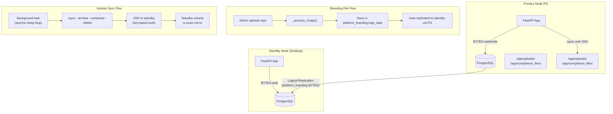

# Design Document: File Storage Replication

## Overview

This feature implements a hybrid file storage and replication strategy for OraInvoice's HA deployment. It has two distinct parts:

1. **Branding files → PostgreSQL BYTEA**: Logos and favicons (small, few files) move from disk into the `platform_branding` table as BYTEA columns. They then replicate automatically via the existing PostgreSQL logical replication pipeline — no additional sync infrastructure needed.

2. **Volume data → rsync**: Job card attachments and compliance documents (large, many files) stay on disk in Docker volumes. A new background service periodically rsyncs the `/app/uploads/` and `/app/compliance_files/` directories from the primary node to the standby node over SSH.

The global admin configures and monitors both systems from a new "Volume Data Replication" section on the existing HA Replication page.

## Architecture



### Key Design Decisions

1. **BYTEA for branding, not for all files**: Branding files are ≤2 MB each, max 3 files. Storing them in PG is negligible overhead and eliminates the need for file sync. Job card attachments can be many MB each with hundreds of files — BYTEA would bloat the WAL and slow replication.

2. **asyncio.create_task with sleep loop, not Celery**: The project doesn't use Celery. The existing heartbeat service uses the same `asyncio.create_task` + sleep loop pattern. Rsync runs as a subprocess — it's non-blocking.

3. **SSH key path stored as filesystem reference**: Per the integration-credentials-architecture steering, the SSH key file itself is NOT stored in the database. The `volume_sync_config` table stores only the path string (e.g., `/root/.ssh/id_rsa`).

4. **Backward compatibility for disk-based branding files**: The existing `serve_branding_file` endpoint continues to serve legacy UUID-based files from disk. New uploads go to DB. Auto-migration on startup moves existing disk files to DB.

5. **Branding file serving changes from UUID path to type path**: Instead of `/api/v1/public/branding/file/{uuid_filename}`, the new endpoint uses `/api/v1/public/branding/file/{file_type}` where `file_type` is `logo`, `dark_logo`, or `favicon`. This is simpler and doesn't leak internal file IDs.

## Components and Interfaces

### Backend — Modified Components

#### `app/modules/branding/models.py` — PlatformBranding Model

Add 9 new columns to the existing model:

```python
# Binary file data
logo_data: Mapped[bytes | None] = mapped_column(LargeBinary, nullable=True)
dark_logo_data: Mapped[bytes | None] = mapped_column(LargeBinary, nullable=True)
favicon_data: Mapped[bytes | None] = mapped_column(LargeBinary, nullable=True)

# MIME types
logo_content_type: Mapped[str | None] = mapped_column(String(100), nullable=True)
dark_logo_content_type: Mapped[str | None] = mapped_column(String(100), nullable=True)
favicon_content_type: Mapped[str | None] = mapped_column(String(100), nullable=True)

# Original filenames
logo_filename: Mapped[str | None] = mapped_column(String(255), nullable=True)
dark_logo_filename: Mapped[str | None] = mapped_column(String(255), nullable=True)
favicon_filename: Mapped[str | None] = mapped_column(String(255), nullable=True)
```

#### `app/modules/branding/service.py` — BrandingService

Add methods:

```python
async def store_branding_file(
    self,
    file_type: str,          # "logo" | "dark_logo" | "favicon"
    file_data: bytes,         # processed image bytes
    content_type: str,        # e.g. "image/png"
    filename: str,            # original filename
) -> PlatformBranding:
    """Store file bytes in the corresponding BYTEA column and update the URL."""

async def get_branding_file(
    self, file_type: str
) -> tuple[bytes, str, str] | None:
    """Return (data, content_type, filename) or None if not stored."""

async def migrate_disk_files_to_db(self) -> dict:
    """Auto-migrate existing disk-based branding files to DB. Idempotent."""
```

#### `app/modules/branding/router.py` — Branding Router

Modify the upload handlers (`upload_logo`, `upload_dark_logo`, `upload_favicon`) to call `store_branding_file()` instead of writing to disk.

Modify `serve_branding_file` to:
1. First check if `file_id` matches a `file_type` (`logo`, `dark_logo`, `favicon`) → serve from DB
2. Otherwise, fall back to serving from disk (backward compatibility for legacy UUID paths)

```python
@public_router.get("/file/{file_id}")
async def serve_branding_file(file_id: str, db: AsyncSession = Depends(get_db_session)):
    # New: serve from DB if file_id is a known file_type
    if file_id in ("logo", "dark_logo", "favicon"):
        svc = BrandingService(db)
        result = await svc.get_branding_file(file_id)
        if result is None:
            raise HTTPException(status_code=404, detail="File not found")
        data, content_type, filename = result
        return Response(
            content=data,
            media_type=content_type,
            headers={"Cache-Control": "public, max-age=86400"},
        )
    # Legacy: serve from disk (existing behavior)
    # ... existing disk-serving code ...
```

### Backend — New Components

#### `app/modules/ha/volume_sync_models.py` — Volume Sync Models

```python
class VolumeSyncConfig(Base):
    __tablename__ = "volume_sync_config"

    id: Mapped[uuid.UUID]           # PK
    standby_ssh_host: Mapped[str]   # e.g. "192.168.1.100"
    ssh_port: Mapped[int]           # default 22
    ssh_key_path: Mapped[str]       # filesystem reference, e.g. "/root/.ssh/id_rsa"
    remote_upload_path: Mapped[str] # e.g. "/app/uploads/"
    remote_compliance_path: Mapped[str]  # e.g. "/app/compliance_files/"
    sync_interval_minutes: Mapped[int]   # default 5, range 1-1440
    enabled: Mapped[bool]           # default False
    created_at: Mapped[datetime]
    updated_at: Mapped[datetime]


class VolumeSyncHistory(Base):
    __tablename__ = "volume_sync_history"

    id: Mapped[uuid.UUID]           # PK
    started_at: Mapped[datetime]
    completed_at: Mapped[datetime | None]
    status: Mapped[str]             # 'running', 'success', 'failure'
    files_transferred: Mapped[int]  # default 0
    bytes_transferred: Mapped[int]  # BigInteger, default 0
    error_message: Mapped[str | None]  # Text
    sync_type: Mapped[str]          # 'automatic' or 'manual'
```

#### `app/modules/ha/volume_sync_schemas.py` — Pydantic Schemas

```python
class VolumeSyncConfigRequest(BaseModel):
    standby_ssh_host: str
    ssh_port: int = 22
    ssh_key_path: str
    remote_upload_path: str = "/app/uploads/"
    remote_compliance_path: str = "/app/compliance_files/"
    sync_interval_minutes: int = Field(default=5, ge=1, le=1440)
    enabled: bool = False

class VolumeSyncConfigResponse(BaseModel):
    model_config = ConfigDict(from_attributes=True)
    id: str
    standby_ssh_host: str
    ssh_port: int
    ssh_key_path: str
    remote_upload_path: str
    remote_compliance_path: str
    sync_interval_minutes: int
    enabled: bool
    created_at: datetime
    updated_at: datetime

class VolumeSyncStatusResponse(BaseModel):
    last_sync_time: datetime | None = None
    last_sync_result: str | None = None       # 'success' | 'failure' | None
    next_scheduled_sync: datetime | None = None
    total_file_count: int = 0
    total_size_bytes: int = 0
    sync_in_progress: bool = False

class VolumeSyncHistoryEntry(BaseModel):
    model_config = ConfigDict(from_attributes=True)
    id: str
    started_at: datetime
    completed_at: datetime | None = None
    status: str
    files_transferred: int
    bytes_transferred: int
    error_message: str | None = None
    sync_type: str

class VolumeSyncTriggerResponse(BaseModel):
    message: str
    sync_id: str
```

#### `app/modules/ha/volume_sync_service.py` — Volume Sync Service

```python
class VolumeSyncService:
    """Manages rsync-based volume replication from primary to standby."""

    _task: asyncio.Task | None = None
    _running_sync: bool = False
    _last_sync_time: datetime | None = None
    _last_sync_result: str | None = None

    async def get_config(self, db: AsyncSession) -> VolumeSyncConfig | None:
        """Load the singleton config row."""

    async def save_config(self, db: AsyncSession, req: VolumeSyncConfigRequest) -> VolumeSyncConfig:
        """Upsert config. Validates SSH host not empty, interval in range."""

    async def get_status(self, db: AsyncSession) -> VolumeSyncStatusResponse:
        """Return current sync status including directory scan results."""

    async def get_history(self, db: AsyncSession, limit: int = 20) -> list[VolumeSyncHistory]:
        """Return recent history entries ordered by started_at DESC."""

    async def trigger_sync(self, db: AsyncSession) -> VolumeSyncHistory:
        """Execute an immediate manual sync. Returns the history entry."""

    async def start_periodic_sync(self, db: AsyncSession) -> None:
        """Start the background asyncio task for periodic sync."""

    async def stop_periodic_sync(self) -> None:
        """Stop the background task."""

    def build_rsync_command(self, config: VolumeSyncConfig, source_path: str, dest_path: str) -> list[str]:
        """Build the rsync command list. Pure function, testable."""

    async def _execute_rsync(self, db: AsyncSession, config: VolumeSyncConfig, sync_type: str) -> VolumeSyncHistory:
        """Run rsync for both upload and compliance directories. Records history."""

    async def _periodic_loop(self, db_factory) -> None:
        """Sleep loop that calls _execute_rsync at the configured interval."""

    def _scan_directories(self) -> tuple[int, int]:
        """Scan /app/uploads/ and /app/compliance_files/ for total file count and size."""
```

The `build_rsync_command` method is a pure function that constructs the command:

```python
def build_rsync_command(self, config: VolumeSyncConfig, source_path: str, dest_path: str) -> list[str]:
    return [
        "rsync",
        "--archive",
        "--compress",
        "--delete",
        "-e", f"ssh -i {config.ssh_key_path} -p {config.ssh_port} -o StrictHostKeyChecking=no",
        source_path,
        f"{config.standby_ssh_host}:{dest_path}",
    ]
```

#### `app/modules/ha/volume_sync_router.py` — Volume Sync Router

All endpoints require `global_admin` role, mounted under `/api/v1/ha/volume-sync/`.

```python
router = APIRouter(prefix="/volume-sync", tags=["HA Volume Sync"])

@router.get("/config", response_model=VolumeSyncConfigResponse)
async def get_volume_sync_config(db): ...

@router.put("/config", response_model=VolumeSyncConfigResponse)
async def update_volume_sync_config(payload: VolumeSyncConfigRequest, db): ...

@router.get("/status", response_model=VolumeSyncStatusResponse)
async def get_volume_sync_status(db): ...

@router.post("/trigger", response_model=VolumeSyncTriggerResponse)
async def trigger_volume_sync(db): ...

@router.get("/history", response_model=list[VolumeSyncHistoryEntry])
async def get_volume_sync_history(db, limit: int = 20): ...
```

### Frontend — Modified Components

#### `frontend/src/pages/admin/HAReplication.tsx`

Add a new "Volume Data Replication" section below the existing sections. This section includes:

1. **Configuration form**: SSH host, port, key path, remote paths, sync interval, enable toggle, Save button
2. **Status card**: Last sync time, result badge, next scheduled sync, file count, total size
3. **Sync Now button**: Triggers manual sync, shows spinner while in progress, disabled during sync
4. **History table**: Columns — Time, Status, Files, Bytes, Duration, Error

New interfaces added to the component:

```typescript
interface VolumeSyncConfig {
  id: string
  standby_ssh_host: string
  ssh_port: number
  ssh_key_path: string
  remote_upload_path: string
  remote_compliance_path: string
  sync_interval_minutes: number
  enabled: boolean
  created_at: string
  updated_at: string
}

interface VolumeSyncStatus {
  last_sync_time: string | null
  last_sync_result: string | null
  next_scheduled_sync: string | null
  total_file_count: number
  total_size_bytes: number
  sync_in_progress: boolean
}

interface VolumeSyncHistoryEntry {
  id: string
  started_at: string
  completed_at: string | null
  status: string
  files_transferred: number
  bytes_transferred: number
  error_message: string | null
  sync_type: string
}
```

The section polls `/ha/volume-sync/status` every 10 seconds (same interval as existing HA polling). All API response data uses `?.` and `?? []` / `?? 0` patterns per the safe-api-consumption steering.

### Startup Integration

In `app/main.py` (or the appropriate startup hook):

```python
@app.on_event("startup")
async def startup_event():
    # ... existing startup code ...

    # Auto-migrate disk-based branding files to DB (idempotent)
    async with async_session_factory() as db:
        svc = BrandingService(db)
        result = await svc.migrate_disk_files_to_db()
        if result.get("migrated"):
            logger.info(f"Migrated {result['migrated']} branding files from disk to DB")

    # Start volume sync periodic task if configured and enabled
    async with async_session_factory() as db:
        vol_svc = VolumeSyncService()
        await vol_svc.start_periodic_sync(db)
```

## Data Models

### Modified Table: `platform_branding`

| Column | Type | Nullable | Default | Description |
|--------|------|----------|---------|-------------|
| logo_data | LargeBinary (BYTEA) | Yes | NULL | Raw logo image bytes |
| dark_logo_data | LargeBinary (BYTEA) | Yes | NULL | Raw dark logo image bytes |
| favicon_data | LargeBinary (BYTEA) | Yes | NULL | Raw favicon image bytes |
| logo_content_type | String(100) | Yes | NULL | MIME type, e.g. "image/png" |
| dark_logo_content_type | String(100) | Yes | NULL | MIME type |
| favicon_content_type | String(100) | Yes | NULL | MIME type |
| logo_filename | String(255) | Yes | NULL | Original filename |
| dark_logo_filename | String(255) | Yes | NULL | Original filename |
| favicon_filename | String(255) | Yes | NULL | Original filename |

### New Table: `volume_sync_config`

| Column | Type | Nullable | Default | Description |
|--------|------|----------|---------|-------------|
| id | UUID | No | uuid4 | Primary key |
| standby_ssh_host | String(255) | No | — | Standby node SSH host/IP |
| ssh_port | Integer | No | 22 | SSH port |
| ssh_key_path | String(500) | No | — | Filesystem path to SSH private key |
| remote_upload_path | String(500) | No | /app/uploads/ | Remote destination for uploads |
| remote_compliance_path | String(500) | No | /app/compliance_files/ | Remote destination for compliance files |
| sync_interval_minutes | Integer | No | 5 | Sync frequency (1–1440) |
| enabled | Boolean | No | false | Whether periodic sync is active |
| created_at | DateTime(tz) | No | now() | Row creation time |
| updated_at | DateTime(tz) | No | now() | Last update time |

### New Table: `volume_sync_history`

| Column | Type | Nullable | Default | Description |
|--------|------|----------|---------|-------------|
| id | UUID | No | uuid4 | Primary key |
| started_at | DateTime(tz) | No | — | When the sync started |
| completed_at | DateTime(tz) | Yes | NULL | When the sync finished |
| status | String(20) | No | — | 'running', 'success', 'failure' |
| files_transferred | Integer | No | 0 | Number of files transferred |
| bytes_transferred | BigInteger | No | 0 | Total bytes transferred |
| error_message | Text | Yes | NULL | Error details on failure |
| sync_type | String(20) | No | — | 'automatic' or 'manual' |

## Correctness Properties

*A property is a characteristic or behavior that should hold true across all valid executions of a system — essentially, a formal statement about what the system should do. Properties serve as the bridge between human-readable specifications and machine-verifiable correctness guarantees.*

### Property 1: Branding file upload round-trip

*For any* valid branding file (logo, dark_logo, or favicon) with valid content type and size within limits, uploading the file and then serving it via `GET /api/v1/public/branding/file/{file_type}` SHALL return the same processed bytes with the correct `Content-Type` header, and the branding record's `_url` field SHALL point to the database-backed serving endpoint.

**Validates: Requirements 1.4, 2.1, 2.5**

### Property 2: Branding upload input validation

*For any* file upload attempt, if the file size exceeds the limit (2 MB for logos, 512 KB for favicons) the upload SHALL be rejected with HTTP 413, and if the content type is not in the allowed set the upload SHALL be rejected with HTTP 415. Files within limits and with allowed types SHALL be accepted.

**Validates: Requirements 1.5, 1.6**

### Property 3: Disk-to-database migration round-trip

*For any* branding record where a `_url` field points to an existing disk-based file and the corresponding `_data` column is NULL, running the migration SHALL populate the BYTEA column with the file's bytes, set the `_content_type` column based on the file extension, and update the `_url` to the database-backed endpoint. Serving the file after migration SHALL return the original disk file's bytes.

**Validates: Requirements 3.1, 3.2, 3.3**

### Property 4: Migration idempotence

*For any* database state, running the branding file migration multiple times SHALL produce the same result — BYTEA columns that are already populated SHALL not be modified, and no errors SHALL occur on subsequent runs.

**Validates: Requirements 3.5, 8.4, 9.3**

### Property 5: Rsync configuration validation

*For any* rsync configuration request, if the `standby_ssh_host` is empty the request SHALL be rejected, and if the `sync_interval_minutes` is outside the range [1, 1440] the request SHALL be rejected. Configurations with non-empty host and valid interval SHALL be accepted.

**Validates: Requirement 4.2**

### Property 6: Rsync command construction

*For any* valid `VolumeSyncConfig` and source/destination path pair, the constructed rsync command SHALL include the `--archive`, `--compress`, and `--delete` flags, SHALL include `-e "ssh -i {ssh_key_path} -p {ssh_port}"` for SSH authentication, and SHALL target `{standby_ssh_host}:{dest_path}` as the remote destination.

**Validates: Requirements 5.2, 5.3, 5.7, 5.8**

### Property 7: Sync history ordering

*For any* set of sync history entries in the database, querying the history endpoint SHALL return entries ordered by `started_at` descending (newest first).

**Validates: Requirement 6.4**

## Error Handling

### Branding File Operations

| Error Condition | Handling | HTTP Status |
|----------------|----------|-------------|
| File too large | Reject with size limit message | 413 |
| Unsupported content type | Reject with allowed types list | 415 |
| Empty file | Reject with "Empty file" message | 400 |
| DB write failure | Log error, return 500 | 500 |
| BYTEA column is NULL on serve | Return 404 "File not found" | 404 |
| Legacy disk file not found | Return 404 "File not found" | 404 |
| Migration: disk file missing | Log warning, leave BYTEA as NULL | N/A (startup) |
| Migration: DB write failure | Log error, continue with next file | N/A (startup) |

### Volume Sync Operations

| Error Condition | Handling | HTTP Status |
|----------------|----------|-------------|
| Empty SSH host in config | Reject with validation error | 422 |
| Sync interval out of range | Reject with validation error | 422 |
| SSH key file not found | Log error, record failure in history | N/A (background) |
| SSH connection refused | Log error, record failure in history | N/A (background) |
| Rsync process timeout | Kill process, record failure in history | N/A (background) |
| Rsync non-zero exit code | Log stderr, record failure in history | N/A (background) |
| Manual trigger while sync running | Return 409 "Sync already in progress" | 409 |
| Config not found on GET | Return 404 | 404 |
| Non-global_admin access | Return 403 | 403 |

### Background Task Resilience

The volume sync background task follows the same resilience pattern as the heartbeat service:
- Exceptions within the sync loop are caught and logged — the loop continues
- If the task crashes, it's restarted on the next config save or manual trigger
- The `_running_sync` flag prevents concurrent sync operations
- Rsync subprocess has a configurable timeout (default: 30 minutes) to prevent hangs

## Testing Strategy

### Property-Based Tests (Hypothesis)

PBT is appropriate for this feature because the core logic involves:
- Pure functions with clear input/output (rsync command construction, MIME type detection, file size validation)
- Round-trip properties (upload → store → serve, disk → migrate → serve)
- Input validation across large input spaces (file sizes, content types, config values)

**Library**: Hypothesis (already used in the project — `.hypothesis/` directory exists)
**Minimum iterations**: 100 per property test
**Tag format**: `Feature: file-storage-replication, Property {N}: {title}`

Each correctness property from the design maps to a single Hypothesis property test:

1. **Property 1** — Generate random bytes (1 byte to 2 MB), random valid content types, upload via test client, serve and compare
2. **Property 2** — Generate random file sizes (0 to 5 MB) and random MIME types, verify accept/reject matches rules
3. **Property 3** — Generate random file bytes, write to temp disk path, set URL, run migration, verify DB contents match
4. **Property 4** — Run migration twice on same state, verify no changes on second run
5. **Property 5** — Generate random config dicts with varying host/interval values, verify validation
6. **Property 6** — Generate random valid configs, call `build_rsync_command()`, verify flags and paths in output
7. **Property 7** — Generate random history entries with random timestamps, insert, query, verify ordering

### Unit Tests (pytest)

- Branding file serving: test each file_type (logo, dark_logo, favicon), test 404 when NULL, test legacy disk fallback
- Upload handlers: test successful upload updates URL, test image processing is called
- Migration: test missing file logs warning, test already-migrated file is skipped
- Volume sync config CRUD: test create, read, update
- Volume sync trigger: test manual trigger creates history entry, test 409 when already running
- Volume sync status: test response shape with no config, with config, with history
- Access control: test all volume sync endpoints reject non-global_admin

### Integration Tests (E2E script)

Following the project's `scripts/test_*_e2e.py` pattern:

```
scripts/test_file_storage_replication_e2e.py
```

Covers:
1. Login as global_admin
2. Upload a logo via the branding endpoint, verify it's served from DB
3. Upload a favicon, verify content type header
4. Save volume sync config, verify it persists
5. Trigger manual sync (will fail without actual standby — verify history records failure)
6. Verify status endpoint returns expected shape
7. Verify history endpoint returns entries in descending order
8. Verify non-admin gets 403 on volume sync endpoints
