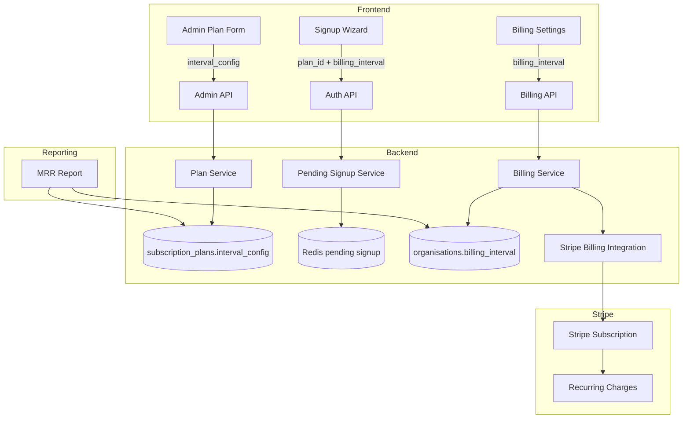
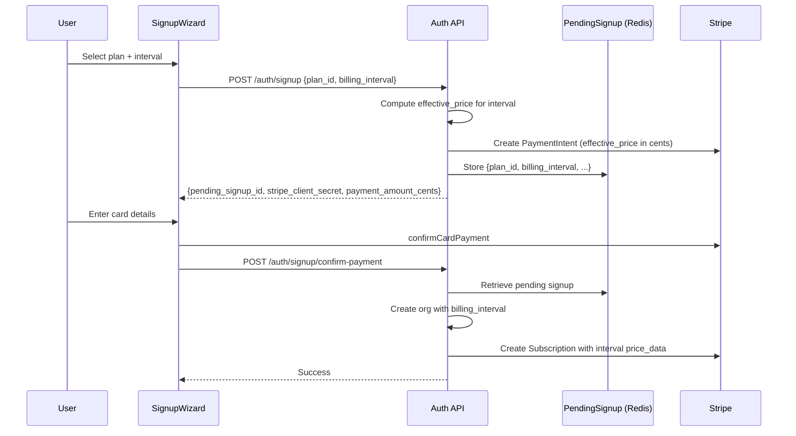
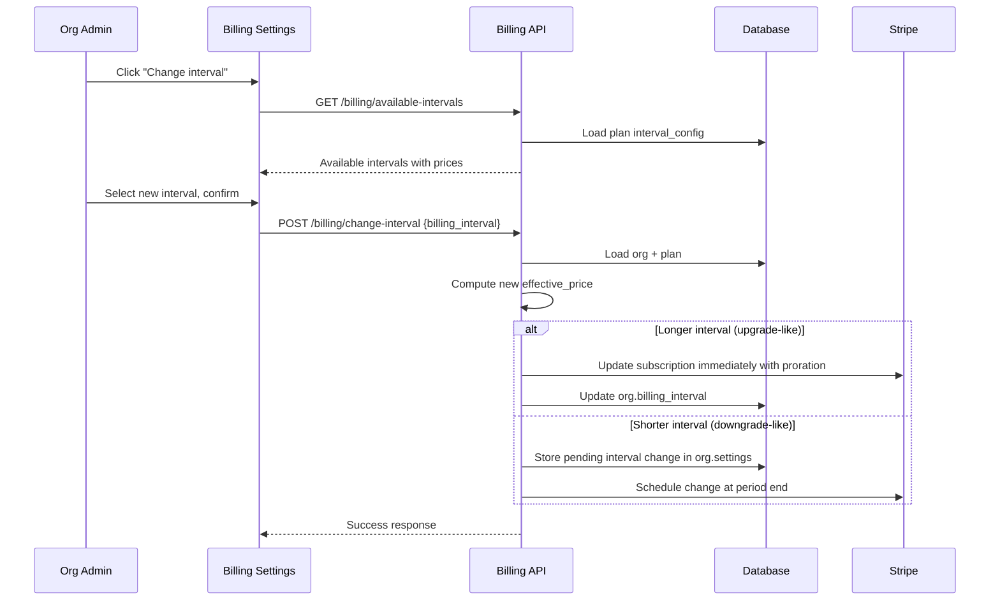
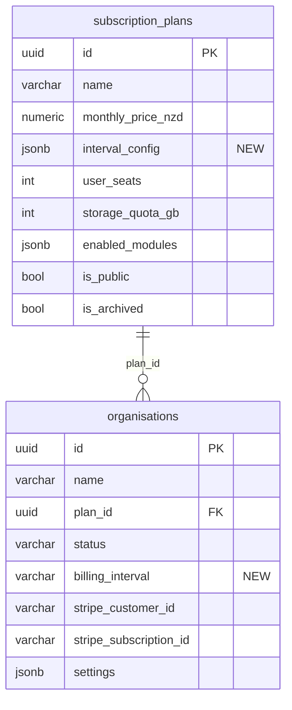

# Design Document: Flexible Billing Intervals

## Overview

This feature extends the platform's billing system from monthly-only to support four billing intervals: **weekly**, **fortnightly**, **monthly**, and **annual**. Admins configure a base monthly price and per-interval discount percentages on each `SubscriptionPlan`. The system computes effective prices, displays savings to end users, and synchronises with Stripe for recurring charges at the chosen interval.

The design touches every layer of the billing stack:

1. **Database** — new JSONB column `interval_config` on `subscription_plans`, new `billing_interval` column on `organisations`
2. **Backend service** — pure price-calculation functions, interval validation, coupon compatibility, MRR normalisation
3. **API** — extended admin plan CRUD, extended public plans endpoint, new interval-change billing endpoint
4. **Frontend** — admin plan form "Pricing" tab, signup wizard `IntervalSelector`, billing settings interval display and change modal
5. **Stripe** — subscription creation with interval-aware `price_data`, interval change with proration, downgrade scheduling

The feature is universal — no trade family gating required.

### Key Design Decisions

- **Discount-from-base model**: All interval prices derive from `monthly_price_nzd` via a formula. This keeps a single source of truth and avoids drift between intervals.
- **JSONB storage**: `interval_config` is stored as JSONB rather than a separate table. The data is small (4 intervals max), always read/written as a unit, and doesn't need relational queries.
- **Stripe `price_data` inline pricing**: We use Stripe's inline `price_data` on subscription items rather than pre-creating Stripe Price objects. This matches the existing pattern in `create_subscription_from_trial` and avoids a Price management layer.
- **Interval change ≠ plan change**: Changing interval on the same plan is a separate operation from upgrade/downgrade. This keeps the billing logic clean and the UI intuitive.

## Architecture



### Data Flow: Interval Selection During Signup



### Data Flow: Interval Change for Existing Org



## Components and Interfaces

### 1. Price Calculation Module (`app/modules/billing/interval_pricing.py`)

Pure functions with no side effects — the core pricing logic.

```python
from decimal import Decimal, ROUND_HALF_UP
from typing import Literal

BillingInterval = Literal["weekly", "fortnightly", "monthly", "annual"]

INTERVAL_PERIODS_PER_YEAR = {
    "weekly": 52,
    "fortnightly": 26,
    "monthly": 12,
    "annual": 1,
}

def compute_effective_price(
    base_monthly_price: Decimal,
    interval: BillingInterval,
    discount_percent: Decimal,
) -> Decimal:
    """Compute the per-cycle effective price for a billing interval.

    Formula:
    - annualised = base_monthly_price × 12
    - per_cycle = annualised / periods_per_year
    - effective = per_cycle × (1 − discount_percent / 100)
    - rounded to 2 decimal places (ROUND_HALF_UP)

    Returns Decimal("0") for free plans regardless of discount.
    """

def compute_savings_amount(
    base_monthly_price: Decimal,
    interval: BillingInterval,
    discount_percent: Decimal,
) -> Decimal:
    """Compute the savings per cycle vs the undiscounted interval price."""

def compute_equivalent_monthly(
    effective_price: Decimal,
    interval: BillingInterval,
) -> Decimal:
    """Convert an effective per-cycle price back to monthly equivalent."""

def validate_interval_config(config: list[dict]) -> list[dict]:
    """Validate interval config: at least one enabled, discounts 0-100.
    Raises ValueError on invalid input. Returns normalised config."""

def build_default_interval_config() -> list[dict]:
    """Return the default config: monthly enabled at 0% discount, others disabled."""

def apply_coupon_to_interval_price(
    effective_price: Decimal,
    coupon_discount_type: str,
    coupon_discount_value: Decimal,
) -> Decimal:
    """Apply a coupon discount on top of the interval effective price."""

def convert_coupon_duration_to_cycles(
    duration_months: int,
    interval: BillingInterval,
) -> int:
    """Convert coupon duration_months to equivalent billing cycles."""

def normalise_to_mrr(
    effective_price: Decimal,
    interval: BillingInterval,
) -> Decimal:
    """Normalise an interval effective price to monthly equivalent for MRR."""
```

### 2. Pydantic Schema Changes

#### `app/modules/admin/schemas.py` — New/Modified Schemas

```python
class IntervalConfigItem(BaseModel):
    """Single interval configuration entry."""
    interval: Literal["weekly", "fortnightly", "monthly", "annual"]
    enabled: bool = False
    discount_percent: float = Field(default=0, ge=0, le=100)

class PlanCreateRequest(BaseModel):
    # ... existing fields ...
    interval_config: list[IntervalConfigItem] | None = None  # NEW

class PlanUpdateRequest(BaseModel):
    # ... existing fields ...
    interval_config: list[IntervalConfigItem] | None = None  # NEW

class IntervalPricing(BaseModel):
    """Computed interval pricing for API responses."""
    interval: str
    enabled: bool
    discount_percent: float
    effective_price: float
    savings_amount: float
    equivalent_monthly: float

class PlanResponse(BaseModel):
    # ... existing fields ...
    interval_config: list[IntervalConfigItem] = Field(default_factory=list)  # NEW
    intervals: list[IntervalPricing] = Field(default_factory=list)  # NEW (computed)
```

#### `app/modules/billing/schemas.py` — New/Modified Schemas

```python
class IntervalChangeRequest(BaseModel):
    """POST /api/v1/billing/change-interval request body."""
    billing_interval: Literal["weekly", "fortnightly", "monthly", "annual"]

class IntervalChangeResponse(BaseModel):
    """Response for interval change."""
    success: bool
    message: str
    new_interval: str
    new_effective_price: float
    effective_immediately: bool
    effective_at: datetime | None = None

class PlanChangeRequest(BaseModel):
    """Extended to include billing_interval."""
    new_plan_id: str
    billing_interval: str | None = None  # NEW — optional, defaults to current

class BillingDashboardResponse(BaseModel):
    # ... existing fields ...
    billing_interval: str = "monthly"  # NEW
    interval_effective_price: float = 0.0  # NEW
    equivalent_monthly_price: float = 0.0  # NEW
    pending_interval_change: dict | None = None  # NEW
```

#### `frontend/src/pages/auth/signup-types.ts` — Extended Types

```typescript
export interface PublicPlan {
  id: string
  name: string
  monthly_price_nzd: number
  trial_duration: number
  trial_duration_unit: string
  intervals: IntervalPricing[]  // NEW
}

export interface IntervalPricing {
  interval: string
  enabled: boolean
  discount_percent: number
  effective_price: number
  savings_amount: number
  equivalent_monthly: number
}

export interface SignupFormData {
  // ... existing fields ...
  billing_interval: string  // NEW
}
```

### 3. API Endpoints

#### Modified Endpoints

| Endpoint | Change |
|----------|--------|
| `POST /api/v1/admin/plans` | Accept optional `interval_config` field |
| `PUT /api/v1/admin/plans/{id}` | Accept optional `interval_config` field |
| `GET /api/v1/admin/plans` | Return `interval_config` and computed `intervals` |
| `GET /api/v1/auth/plans` | Return computed `intervals` (enabled only) for each plan |
| `POST /api/v1/auth/signup` | Accept `billing_interval` in request body |
| `POST /api/v1/billing/upgrade` | Accept optional `billing_interval` in `PlanChangeRequest` |
| `POST /api/v1/billing/downgrade` | Accept optional `billing_interval` in `PlanChangeRequest` |
| `GET /api/v1/billing` | Return `billing_interval`, `interval_effective_price`, `equivalent_monthly_price`, `pending_interval_change` |
| `GET /api/v1/admin/reports/mrr` | Normalise MRR across intervals, add interval breakdown |

#### New Endpoints

| Endpoint | Method | Description |
|----------|--------|-------------|
| `POST /api/v1/billing/change-interval` | POST | Change billing interval for current plan |
| `GET /api/v1/billing/available-intervals` | GET | Return available intervals for current plan with prices |

### 4. Frontend Components

#### `IntervalSelector` Component (`frontend/src/components/billing/IntervalSelector.tsx`)

Reusable segmented toggle for selecting billing intervals. Used in:
- Signup wizard plan selection step
- Plan change modal in billing settings
- Interval change modal in billing settings

Props:
```typescript
interface IntervalSelectorProps {
  intervals: IntervalPricing[]
  selected: string
  onChange: (interval: string) => void
  recommendedInterval?: string
}
```

#### Admin Plan Form — New "Pricing" Tab

Added to the existing `PlanFormModal` tabs (`general`, `modules`, `storage`, **`pricing`**). Contains:
- Toggle switches for each interval (weekly, fortnightly, monthly, annual)
- Monthly always enabled (cannot be disabled)
- Discount percentage input for each enabled interval
- Read-only effective price preview per interval

#### Signup Wizard — IntervalSelector Integration

- `IntervalSelector` rendered above plan cards
- Defaults to `monthly`
- Plan cards update to show `effective_price` for selected interval
- Plans not supporting selected interval shown as unavailable
- Savings badge on discounted intervals
- `billing_interval` included in signup payload

#### Billing Settings — Interval Display & Change Modal

- Current interval displayed alongside plan name and price
- "Change interval" button opens modal with `IntervalSelector`
- Modal shows effective prices and savings for each available interval
- Confirmation step explains proration (upgrade) or scheduling (downgrade)

### 5. Stripe Integration Changes (`app/integrations/stripe_billing.py`)

#### `create_subscription_from_trial` — Extended

```python
async def create_subscription_from_trial(
    *,
    customer_id: str,
    price_id: str | None = None,
    monthly_amount_cents: int | None = None,
    interval_amount_cents: int | None = None,  # NEW
    billing_interval: str = "month",  # NEW
    interval_count: int = 1,  # NEW (2 for fortnightly)
    currency: str = "nzd",
    metadata: dict | None = None,
) -> dict:
```

The `price_data.recurring` block changes from hardcoded `{"interval": "month"}` to:
```python
"recurring": {
    "interval": stripe_interval,       # "week", "month", or "year"
    "interval_count": interval_count,  # 1 for all except fortnightly (2)
}
```

Mapping:
| BillingInterval | Stripe interval | interval_count |
|-----------------|-----------------|----------------|
| weekly          | week            | 1              |
| fortnightly     | week            | 2              |
| monthly         | month           | 1              |
| annual          | year            | 1              |

#### `update_subscription_interval` — New Function

```python
async def update_subscription_interval(
    *,
    subscription_id: str,
    new_amount_cents: int,
    stripe_interval: str,
    interval_count: int = 1,
    proration_behavior: str = "create_prorations",
) -> dict:
    """Update a Stripe subscription's recurring interval and amount."""
```

### 6. Scheduled Tasks Changes (`app/tasks/scheduled.py`)

The existing billing renewal task and trial conversion task (`app/tasks/subscriptions.py`) need to read `org.billing_interval` and pass the correct interval parameters to Stripe when creating or renewing subscriptions.

### 7. Migration Strategy

A single Alembic migration adds:
1. `interval_config JSONB DEFAULT '[]'` to `subscription_plans`
2. `billing_interval VARCHAR(20) DEFAULT 'monthly'` to `organisations`
3. Data migration: set all existing plans to `[{"interval": "monthly", "enabled": true, "discount_percent": 0}]`
4. Data migration: set all existing orgs to `billing_interval = 'monthly'`
5. `monthly_price_nzd` column is preserved — it remains the base price

The migration is backward-compatible: existing code that reads `monthly_price_nzd` continues to work. The new `interval_config` column defaults to empty and the system falls back to monthly-only when absent.


## Data Models

### Database Schema Changes

#### `subscription_plans` Table — New Column

```sql
ALTER TABLE subscription_plans
ADD COLUMN interval_config JSONB NOT NULL DEFAULT '[]';
```

JSONB structure:
```json
[
  {"interval": "weekly",      "enabled": false, "discount_percent": 0},
  {"interval": "fortnightly", "enabled": false, "discount_percent": 0},
  {"interval": "monthly",     "enabled": true,  "discount_percent": 0},
  {"interval": "annual",      "enabled": true,  "discount_percent": 15}
]
```

#### `organisations` Table — New Column

```sql
ALTER TABLE organisations
ADD COLUMN billing_interval VARCHAR(20) NOT NULL DEFAULT 'monthly';

ALTER TABLE organisations
ADD CONSTRAINT ck_organisations_billing_interval
CHECK (billing_interval IN ('weekly', 'fortnightly', 'monthly', 'annual'));
```

### ORM Model Changes

#### `SubscriptionPlan` Model

```python
# New column
interval_config: Mapped[list] = mapped_column(
    JSONB, nullable=False, server_default="'[]'"
)
```

#### `Organisation` Model

```python
# New column
billing_interval: Mapped[str] = mapped_column(
    String(20), nullable=False, server_default="'monthly'"
)
```

The existing `CheckConstraint` on `organisations` is extended to include the new `billing_interval` constraint.

### Pending Signup Data (Redis)

The pending signup JSON blob stored in Redis gains a `billing_interval` field:

```json
{
  "org_name": "Acme Motors",
  "admin_email": "[email]",
  "plan_id": "uuid",
  "billing_interval": "annual",
  "password_hash": "...",
  "coupon_code": null
}
```

### Alembic Migration

```python
# alembic/versions/XXXX_add_billing_intervals.py

def upgrade():
    # 1. Add interval_config to subscription_plans
    op.add_column('subscription_plans',
        sa.Column('interval_config', JSONB, nullable=False, server_default='[]'))

    # 2. Add billing_interval to organisations
    op.add_column('organisations',
        sa.Column('billing_interval', sa.String(20), nullable=False, server_default='monthly'))
    op.create_check_constraint(
        'ck_organisations_billing_interval',
        'organisations',
        "billing_interval IN ('weekly', 'fortnightly', 'monthly', 'annual')")

    # 3. Backfill existing plans with default monthly-only config
    op.execute("""
        UPDATE subscription_plans
        SET interval_config = '[{"interval": "monthly", "enabled": true, "discount_percent": 0}]'::jsonb
        WHERE interval_config = '[]'::jsonb OR interval_config IS NULL
    """)

    # 4. Backfill existing orgs (already defaulted to 'monthly' by server_default)

def downgrade():
    op.drop_constraint('ck_organisations_billing_interval', 'organisations')
    op.drop_column('organisations', 'billing_interval')
    op.drop_column('subscription_plans', 'interval_config')
```

### Entity Relationship Summary




## Correctness Properties

*A property is a characteristic or behavior that should hold true across all valid executions of a system — essentially, a formal statement about what the system should do. Properties serve as the bridge between human-readable specifications and machine-verifiable correctness guarantees.*

### Property 1: Effective price formula correctness

*For any* base monthly price (≥ 0), *for any* billing interval (weekly, fortnightly, monthly, annual), and *for any* discount percentage (0–100), the computed effective price SHALL equal `round((base × 12 / periods_per_year) × (1 − discount / 100), 2)` where `periods_per_year` is 52 for weekly, 26 for fortnightly, 12 for monthly, and 1 for annual. When the base price is 0, the effective price SHALL be 0 regardless of discount.

**Validates: Requirements 2.1, 2.2, 2.3, 2.4, 2.6**

### Property 2: Equivalent monthly rate never exceeds base price

*For any* base monthly price (≥ 0), *for any* billing interval, and *for any* discount percentage (0–100), computing the effective price and then deriving the equivalent monthly rate (`effective_price × periods_per_year / 12`) SHALL produce a value less than or equal to the base monthly price.

**Validates: Requirements 2.5**

### Property 3: Interval config round-trip persistence

*For any* valid interval config (list of interval objects with at least one enabled, all discounts in [0, 100]), storing the config via the plan create/update API and then retrieving it via the plan GET API SHALL return an equivalent interval config.

**Validates: Requirements 1.5, 1.6, 4.1, 4.2**

### Property 4: Interval config validation rejects invalid inputs

*For any* interval config where all intervals have `enabled = false`, the validation function SHALL reject it. *For any* interval config containing a `discount_percent` value outside [0, 100], the validation function SHALL reject it.

**Validates: Requirements 1.2, 1.7, 4.3, 4.4**

### Property 5: Public API returns only enabled intervals

*For any* plan with an interval config, the public plans API response SHALL include only intervals where `enabled` is true. The number of intervals in the response SHALL equal the number of enabled intervals in the config.

**Validates: Requirements 3.1, 3.2**

### Property 6: Savings amount equals undiscounted minus effective price

*For any* base monthly price, *for any* billing interval, and *for any* discount percentage (0–100), the savings amount SHALL equal the undiscounted interval price minus the effective price. When discount is 0, savings SHALL be 0.

**Validates: Requirements 3.3, 5.4, 13.3, 13.4**

### Property 7: Plan availability determined by interval support

*For any* plan and *for any* billing interval, the plan SHALL be marked as available for that interval if and only if the interval is enabled in the plan's interval config.

**Validates: Requirements 5.3, 8.3**

### Property 8: Stripe interval mapping correctness

*For any* billing interval, the Stripe subscription parameters SHALL use: `week` with `interval_count=1` for weekly, `week` with `interval_count=2` for fortnightly, `month` with `interval_count=1` for monthly, `year` with `interval_count=1` for annual. The `unit_amount` SHALL equal `round(effective_price × 100)` (cents).

**Validates: Requirements 6.1, 6.2**

### Property 9: Interval change direction determines timing

*For any* pair of billing intervals where the new interval is longer (fewer periods per year) than the current interval, the change SHALL be applied immediately. *For any* pair where the new interval is shorter (more periods per year), the change SHALL be scheduled for the end of the current billing period.

**Validates: Requirements 7.3, 7.4**

### Property 10: Interval change rollback on Stripe failure

*For any* interval change attempt where the Stripe subscription update fails, the organisation's `billing_interval` field SHALL remain at its previous value (unchanged).

**Validates: Requirements 7.6**

### Property 11: Coupon stacking with interval pricing

*For any* effective interval price and *for any* coupon, the coupon-adjusted price SHALL be: for percentage coupons, `round(effective_price × (1 − coupon_value / 100), 2)`; for fixed amount coupons, `max(0, round(effective_price − coupon_value, 2))`. The coupon discount is applied after the interval discount.

**Validates: Requirements 11.1, 11.2**

### Property 12: Coupon duration conversion to billing cycles

*For any* coupon `duration_months` value and *for any* billing interval, the equivalent billing cycles SHALL be: `duration_months × periods_per_year / 12` (rounded to nearest integer). For example, 3 months = 13 weekly cycles, 7 fortnightly cycles, 3 monthly cycles.

**Validates: Requirements 11.3**

### Property 13: MRR normalisation correctness

*For any* organisation's effective price and billing interval, the MRR contribution SHALL equal `effective_price × periods_per_year / 12`. The sum of all organisations' MRR contributions SHALL equal the total platform MRR.

**Validates: Requirements 12.1**

## Error Handling

### Backend Error Scenarios

| Scenario | Response | Recovery |
|----------|----------|----------|
| Invalid `interval_config` (all disabled) | 400 with validation message | Client fixes input |
| Invalid `discount_percent` (outside 0–100) | 400 with validation message | Client fixes input |
| Plan doesn't support selected `billing_interval` | 400 "Interval not available for this plan" | Client selects different interval |
| Stripe subscription update fails during interval change | 502 + rollback `billing_interval` | Org admin retries |
| Stripe subscription update fails during plan change | 502 + rollback plan and interval | Org admin retries |
| Same effective price on interval change | 400 "No change needed" | Informational, no action |
| Legacy plan with no `interval_config` | Fallback to monthly-only | Transparent to user |
| Free plan with interval selection | Skip Stripe, set interval on org | No payment flow |

### Frontend Error Handling

- API errors on plan load: show retry button, disable interval selector
- Stripe payment failure: show error message, allow retry
- Interval change failure: show error toast, revert UI to previous interval
- Network timeout: show generic error with retry option

### Rollback Strategy

The interval change endpoint follows a two-phase approach:
1. Attempt Stripe update first
2. Only update the database if Stripe succeeds
3. If Stripe fails, return error without modifying the database

This ensures the database and Stripe stay in sync. The existing pattern from the upgrade endpoint (rollback org changes on Stripe failure) is reused.

## Testing Strategy

### Property-Based Testing

Library: **Hypothesis** (Python backend), **fast-check** (TypeScript frontend)

Each correctness property maps to a single property-based test with minimum 100 iterations. Tests are tagged with the format:

```
Feature: flexible-billing-intervals, Property {N}: {title}
```

#### Backend Property Tests (`tests/properties/test_billing_interval_properties.py`)

| Test | Property | Generator |
|------|----------|-----------|
| `test_effective_price_formula` | Property 1 | Random base price (0–10000), random interval, random discount (0–100) |
| `test_equivalent_monthly_never_exceeds_base` | Property 2 | Random base price, random interval, random discount |
| `test_interval_config_round_trip` | Property 3 | Random valid interval configs |
| `test_interval_config_validation_rejects_invalid` | Property 4 | Random configs with all disabled or invalid discounts |
| `test_savings_equals_undiscounted_minus_effective` | Property 6 | Random base price, random interval, random discount |
| `test_stripe_interval_mapping` | Property 8 | All 4 intervals with random prices |
| `test_interval_change_direction` | Property 9 | Random pairs of intervals |
| `test_coupon_stacking` | Property 11 | Random effective prices, random coupon types and values |
| `test_coupon_duration_conversion` | Property 12 | Random duration_months (1–36), random intervals |
| `test_mrr_normalisation` | Property 13 | Random effective prices, random intervals |

#### Frontend Property Tests (`frontend/src/pages/admin/__tests__/billing-intervals.properties.test.ts`)

| Test | Property | Generator |
|------|----------|-----------|
| `test_plan_availability_by_interval` | Property 7 | Random interval configs, random selected intervals |
| `test_public_api_returns_only_enabled` | Property 5 | Random interval configs with mixed enabled/disabled |

### Unit Tests

Unit tests cover specific examples, edge cases, and integration points:

- **Edge cases**: free plan (price=0), 100% discount, 0% discount, single interval enabled, all intervals enabled
- **Legacy fallback**: plan with no `interval_config` treated as monthly-only
- **API integration**: admin plan CRUD with interval_config, public plans endpoint shape
- **Stripe mock tests**: verify correct `price_data` parameters for each interval
- **Rollback test**: mock Stripe failure and verify org.billing_interval unchanged
- **Migration test**: verify existing data is backfilled correctly
- **Coupon edge cases**: fixed amount coupon exceeding effective price (floor at 0), trial_extension coupon (no price effect)
- **Frontend rendering**: IntervalSelector defaults to monthly, plan cards show correct prices, unavailable plans greyed out

### Test Configuration

- Hypothesis: `@settings(max_examples=200)` for core pricing properties
- fast-check: `fc.assert(property, { numRuns: 100 })` for frontend properties
- All property tests reference their design document property in a comment tag

