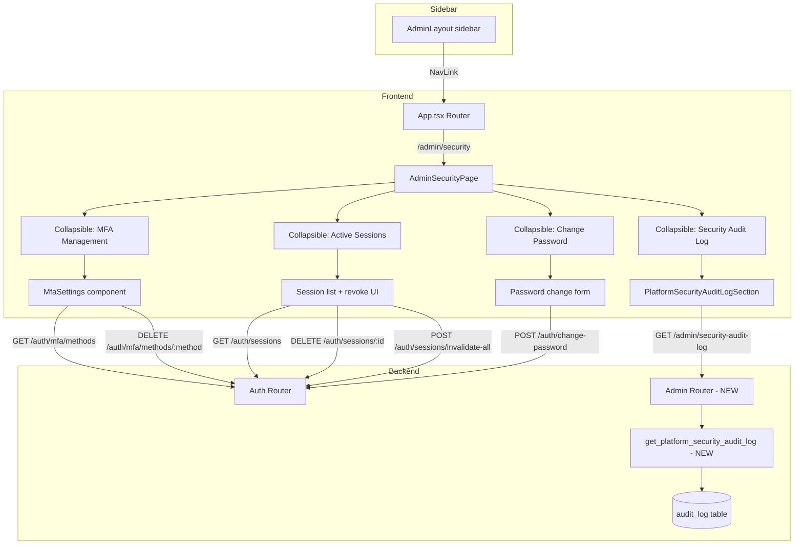

# Design Document: Global Admin Security Settings

## Overview

This feature adds a dedicated `/admin/security` page to the global admin console, consolidating the global admin's personal security management into a single page. The page contains four collapsible sections: MFA Management, Active Sessions, Change Password, and Platform Security Audit Log.

The design maximises reuse of existing components and endpoints:
- **MfaSettings** component is embedded directly (already self-contained with its own API calls)
- **Password change** reuses the existing `POST /auth/change-password` endpoint and `PasswordRequirements`/`PasswordMatch` components
- **Session management** reuses the existing `GET /auth/sessions`, `DELETE /auth/sessions/{session_id}`, and `POST /auth/sessions/invalidate-all` endpoints
- **Platform audit log** requires one new backend endpoint (`GET /admin/security-audit-log`) and a new frontend section component, modelled closely on the existing `SecurityAuditLogSection`

The only new backend code is a single service function and router endpoint for the platform-wide (cross-org) security audit log query.

### Key Design Decisions

1. **Embed MfaSettings directly** rather than creating a wrapper — the component is fully self-contained with its own loading, error, and success states.
2. **Build session management inline** in the new page component rather than extracting a reusable component — the org-level SecuritySettings page uses `SessionPolicySection` (org policy management), which is fundamentally different from personal session viewing/revoking.
3. **Build password change inline** following the exact pattern from `GlobalAdminProfile.tsx` — the form is simple enough that a shared component would add indirection without benefit.
4. **Create a new `PlatformSecurityAuditLogSection` component** rather than parameterising the existing `SecurityAuditLogSection` — the platform version needs an extra "Organisation" column and calls a different endpoint, and modifying the existing component risks regressions on the org-level page.
5. **Endpoint naming**: Requirements reference `POST /auth/sessions/revoke-all`, but the actual existing endpoint is `POST /auth/sessions/invalidate-all`. The implementation will use the real endpoint name.

## Architecture



### Data Flow

1. **Page load**: `AdminSecurityPage` renders four `Collapsible` sections. Only the MFA section is expanded by default, triggering `MfaSettings` to fetch `/auth/mfa/methods`.
2. **Session section expand**: When the user expands the session section, a `useEffect` fires `GET /auth/sessions` with AbortController cleanup.
3. **Password change**: Client-side validation via `allPasswordRulesMet` gates the `POST /auth/change-password` call.
4. **Audit log section expand**: When expanded, fetches `GET /admin/security-audit-log` with filter params and AbortController cleanup.

## Components and Interfaces

### New Components

#### 1. `AdminSecurityPage` (`frontend/src/pages/admin/AdminSecurityPage.tsx`)

The main page component. Renders the page title and four collapsible sections.

```typescript
// No page-level API calls — each section manages its own data
export function AdminSecurityPage() {
  // useToast for cross-section notifications (session revoke, password change)
  // Renders: h1 "Security Settings", 4 Collapsible sections
}
```

#### 2. `PlatformSecurityAuditLogSection` (`frontend/src/components/admin/PlatformSecurityAuditLogSection.tsx`)

A variant of `SecurityAuditLogSection` that calls `GET /admin/security-audit-log` and includes an "Organisation" column.

```typescript
interface PlatformAuditLogEntry extends AuditLogEntry {
  org_name: string | null  // "Platform" for events with no org_id
}

// Same filter controls as SecurityAuditLogSection
// Additional "Organisation" column in the table
// Same pagination, truncation warning, and error handling patterns
```

### Modified Components

#### 3. `AdminLayout` sidebar (`frontend/src/layouts/AdminLayout.tsx`)

Add a "Security" nav item to the `adminNavItems` array in the "Configuration" section, after "Settings":

```typescript
{ to: '/admin/settings', label: 'Settings' },
{ to: '/admin/security', label: 'Security' },  // NEW
```

#### 4. `App.tsx` route registration

Add the route inside the existing admin route group:

```typescript
<Route path="security" element={<SafePage name="admin-security"><AdminSecurityPage /></SafePage>} />
```

### Reused Components (No Modifications)

| Component | Location | Used In |
|-----------|----------|---------|
| `MfaSettings` | `frontend/src/pages/settings/MfaSettings.tsx` | MFA section — embedded directly |
| `PasswordRequirements` | `frontend/src/components/auth/PasswordRequirements.tsx` | Password section |
| `PasswordMatch` | `frontend/src/components/auth/PasswordRequirements.tsx` | Password section |
| `allPasswordRulesMet` | `frontend/src/components/auth/PasswordRequirements.tsx` | Password validation |
| `Collapsible` | `frontend/src/components/ui/Collapsible.tsx` | All four sections |
| `Pagination` | `frontend/src/components/ui/Pagination.tsx` | Audit log section |
| `useToast` / `ToastContainer` | `frontend/src/components/ui/Toast.tsx` | Notifications |

### Reused Backend Endpoints (No Modifications)

| Endpoint | Method | Used For |
|----------|--------|----------|
| `/auth/mfa/methods` | GET | Load MFA method statuses |
| `/auth/mfa/methods/{method}` | DELETE | Disable MFA method |
| `/auth/mfa/default` | PUT | Set default MFA method |
| `/auth/sessions` | GET | List active sessions |
| `/auth/sessions/{session_id}` | DELETE | Revoke single session |
| `/auth/sessions/invalidate-all` | POST | Revoke all other sessions |
| `/auth/change-password` | POST | Change password |

### New Backend Endpoint

#### `GET /admin/security-audit-log`

| Aspect | Detail |
|--------|--------|
| Path | `/admin/security-audit-log` |
| Method | GET |
| Auth | `require_role("global_admin")` |
| Router | `app/modules/admin/router.py` |

**Query Parameters** (same as org-level):

| Param | Type | Default | Description |
|-------|------|---------|-------------|
| `start_date` | `datetime?` | None | Filter entries after this date |
| `end_date` | `datetime?` | None | Filter entries before this date |
| `action` | `str?` | None | Filter by specific action type |
| `user_id` | `UUID?` | None | Filter by user ID |
| `page` | `int` | 1 | Page number (≥1) |
| `page_size` | `int` | 25 | Items per page |

**Response Schema** — `PlatformAuditLogPage`:

```python
class PlatformAuditLogEntry(AuditLogEntry):
    """Extends AuditLogEntry with org_name for cross-org view."""
    org_name: str | None = None  # None → displayed as "Platform"

class PlatformAuditLogPage(BaseModel):
    items: list[PlatformAuditLogEntry]
    total: int
    page: int
    page_size: int
    truncated: bool = False
```

## Data Models

### Existing Models Used (No Changes)

- **`audit_log` table**: Queried by the new platform audit log endpoint. Columns: `id`, `org_id`, `user_id`, `action`, `entity_type`, `entity_id`, `before_value`, `after_value`, `ip_address`, `device_info`, `created_at`.
- **`users` table**: Joined to resolve `user_email` from `user_id`.
- **`organisations` table**: Joined to resolve `org_name` from `org_id`.

### New Pydantic Schemas

Added to `app/modules/auth/security_settings_schemas.py`:

```python
class PlatformAuditLogEntry(AuditLogEntry):
    """Audit log entry enriched with organisation name for platform-wide view."""
    org_name: str | None = None

class PlatformAuditLogPage(BaseModel):
    items: list[PlatformAuditLogEntry]
    total: int
    page: int
    page_size: int
    truncated: bool = False
```

### New Service Function

Added to `app/modules/auth/security_audit_service.py`:

```python
async def get_platform_security_audit_log(
    db: AsyncSession,
    filters: AuditLogFilters,
) -> PlatformAuditLogPage:
    """Query audit log for security-related actions across ALL organisations.

    Unlike get_security_audit_log, this function:
    - Does NOT filter by org_id
    - JOINs with organisations table to resolve org_name
    - Returns PlatformAuditLogEntry with org_name field
    """
```

The SQL query mirrors `get_security_audit_log` but:
1. Removes the `a.org_id = :org_id` WHERE clause
2. Adds `LEFT JOIN organisations o ON o.id = a.org_id` 
3. Selects `o.name AS org_name` (NULL for platform-level events)
4. Retains the same `SECURITY_ACTION_SQL_FILTER`, pagination, and 10,000-entry hard cap

### Frontend TypeScript Interfaces

```typescript
// In AdminSecurityPage.tsx or a shared types file
interface SessionInfo {
  id: string
  device_type: string | null
  browser: string | null
  ip_address: string | null
  last_activity_at: string | null
  created_at: string | null
  current: boolean
}

interface PlatformAuditLogEntry {
  id: string
  timestamp: string
  user_email: string | null
  action: string
  action_description: string
  ip_address: string | null
  browser: string | null
  os: string | null
  org_name: string | null  // "Platform" displayed when null
  entity_type: string | null
  entity_id: string | null
  before_value: Record<string, unknown> | null
  after_value: Record<string, unknown> | null
}
```

## Correctness Properties

*A property is a characteristic or behavior that should hold true across all valid executions of a system — essentially, a formal statement about what the system should do. Properties serve as the bridge between human-readable specifications and machine-verifiable correctness guarantees.*

### Property 1: Session display completeness

*For any* active session returned by `GET /auth/sessions`, the rendered session row SHALL display the device type, browser, operating system, IP address, creation timestamp, and correctly show a "current" badge if and only if the session's `current` field is `true`.

**Validates: Requirements 4.2**

### Property 2: Password validation gates API call

*For any* password string, if `allPasswordRulesMet(password)` returns `false`, then submitting the password change form SHALL NOT trigger a `POST /auth/change-password` API call, and the form state SHALL remain unchanged.

**Validates: Requirements 5.4**

### Property 3: Platform audit log filter acceptance

*For any* valid combination of filter parameters (`start_date`, `end_date`, `action`, `user_id`, `page`, `page_size`), the `GET /admin/security-audit-log` endpoint SHALL return a valid `PlatformAuditLogPage` response without error.

**Validates: Requirements 7.2**

### Property 4: Platform audit log returns cross-org security actions

*For any* set of audit log entries in the database, the `GET /admin/security-audit-log` endpoint SHALL return all entries whose action matches the security action filter (`auth.*`, `org.mfa_policy_updated`, `org.security_settings_updated`, `org.custom_role_*`) regardless of their `org_id` value.

**Validates: Requirements 7.3**

### Property 5: Platform audit log response enrichment

*For any* audit log entry returned by `GET /admin/security-audit-log`, the entry SHALL include a resolved `user_email` (from the `users` table join, or `null` if the user was deleted) and a resolved `org_name` (from the `organisations` table join, or `null` for platform-level events with no `org_id`), conforming to the `PlatformAuditLogEntry` schema.

**Validates: Requirements 7.4, 7.5**

### Property 6: Platform audit log 10,000-entry hard cap

*For any* query where the total matching audit log entries exceed 10,000, the endpoint SHALL return `truncated: true` and the `total` field SHALL be capped at 10,000.

**Validates: Requirements 7.6**

### Property 7: Platform audit log ordering invariant

*For any* page of results returned by `GET /admin/security-audit-log`, the entries SHALL be ordered by `created_at` descending — that is, for every consecutive pair of entries `(entries[i], entries[i+1])`, `entries[i].timestamp >= entries[i+1].timestamp`.

**Validates: Requirements 7.7**

## Error Handling

| Scenario | Component | Behaviour |
|----------|-----------|-----------|
| `/auth/mfa/methods` fails | MfaSettings (existing) | Shows error message within MFA section; other sections unaffected |
| `GET /auth/sessions` fails | Session section | Shows "Failed to load sessions" error within section |
| `DELETE /auth/sessions/{id}` fails | Session section | Shows error toast via `useToast` |
| `POST /auth/sessions/invalidate-all` fails | Session section | Shows error toast via `useToast` |
| `POST /auth/change-password` returns 400 | Password section | Displays `response.data.detail` as inline error |
| `POST /auth/change-password` network error | Password section | Displays generic "Failed to change password" error |
| `GET /admin/security-audit-log` fails | Audit log section | Shows "Failed to load audit log" error within section |
| Component unmount during fetch | All sections | AbortController cleanup prevents state updates on unmounted components |
| API returns unexpected shape | All sections | `?.` and `?? []` / `?? 0` guards prevent crashes (per safe-api-consumption steering) |
| Non-global_admin accesses `/admin/security` | Route guard | `RequireGlobalAdmin` redirects to `/login` |
| Non-global_admin calls `GET /admin/security-audit-log` | Backend | Returns HTTP 403 |

## Testing Strategy

### Unit Tests (Example-Based)

Focus on specific scenarios and component rendering:

- **AdminSecurityPage rendering**: Verify h1 title, four collapsible sections in correct order, MFA section expanded by default
- **Sidebar navigation**: Verify "Security" link exists in Configuration section after "Settings"
- **Route guard**: Verify `/admin/security` is protected by `RequireGlobalAdmin`
- **Session revoke flow**: Mock API, click Revoke, verify session removed from list
- **Password change flow**: Mock API, submit valid form, verify fields cleared and success message
- **Error isolation**: Mock MFA endpoint failure, verify other sections still render
- **Truncation warning**: Mock audit log with `truncated: true`, verify warning banner

### Property-Based Tests (Hypothesis)

Property-based tests validate universal properties across generated inputs. Each test runs a minimum of 100 iterations.

**Library**: Hypothesis (Python, already used in the project)

**Backend properties to test**:

| Property | Tag | What It Tests |
|----------|-----|---------------|
| Property 3 | `Feature: global-admin-security-settings, Property 3: Platform audit log filter acceptance` | Random filter combos always return valid response |
| Property 4 | `Feature: global-admin-security-settings, Property 4: Platform audit log returns cross-org security actions` | Security actions from any org appear in results |
| Property 5 | `Feature: global-admin-security-settings, Property 5: Platform audit log response enrichment` | Every entry has resolved user_email and org_name |
| Property 6 | `Feature: global-admin-security-settings, Property 6: Platform audit log 10,000-entry hard cap` | Truncation flag and total cap enforced |
| Property 7 | `Feature: global-admin-security-settings, Property 7: Platform audit log ordering invariant` | Results always in descending created_at order |

**Frontend properties to test** (via fast-check or similar):

| Property | Tag | What It Tests |
|----------|-----|---------------|
| Property 1 | `Feature: global-admin-security-settings, Property 1: Session display completeness` | Random session data renders all required fields |
| Property 2 | `Feature: global-admin-security-settings, Property 2: Password validation gates API call` | Invalid passwords never trigger API call |

### Integration Tests

- **Endpoint auth guard**: Call `GET /admin/security-audit-log` as unauthenticated user → 403; as `org_admin` → 403; as `global_admin` → 200
- **End-to-end session flow**: Login, list sessions, revoke one, verify it's gone
- **End-to-end password change**: Change password, verify old password no longer works
