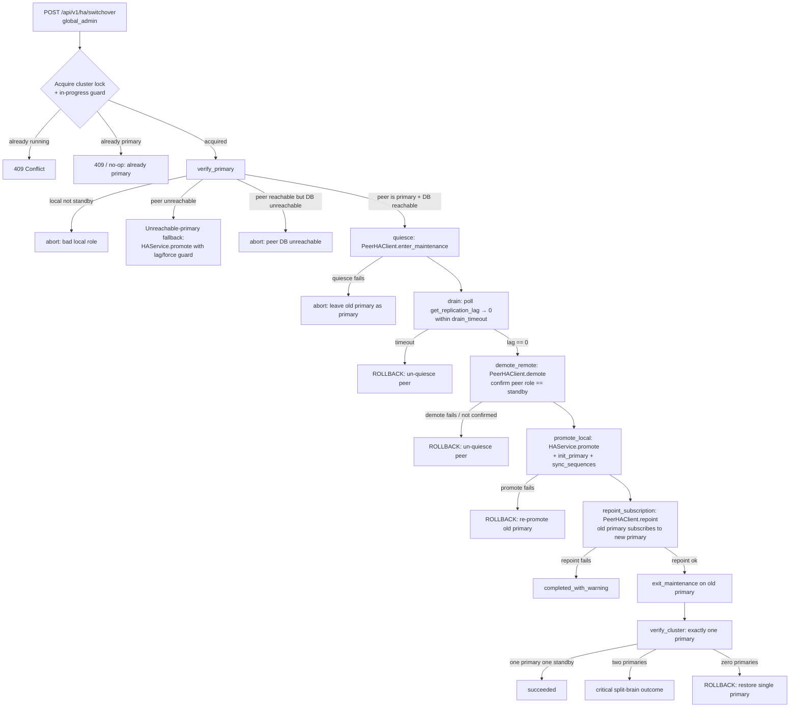
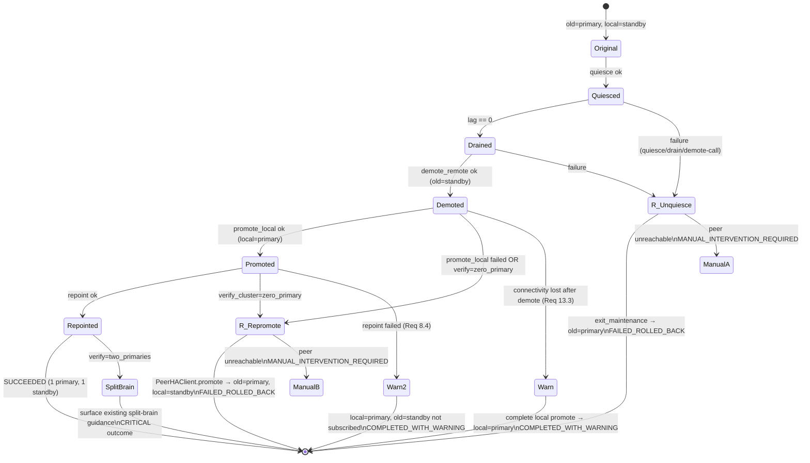

# Design Document — HA Orchestrated Switchover

## Overview

OraInvoice runs a two-node HA cluster on PostgreSQL **logical** replication. One node is `primary` (accepts writes, owns the publication `orainvoice_ha_pub`), the other is `standby` (read-only, owns the subscription `orainvoice_ha_sub`). The existing **Promote to Primary** action mutates only the local node — it validates the local role, checks lag, stops the local subscription, sets `role = primary`, and stamps `promoted_at`. It never touches the peer, so demoting the old primary and re-pointing replication are separate manual steps. Between those steps both nodes believe they are `primary` — a split-brain window.

This feature adds a **single-click orchestrated switchover** that performs the whole role swap as one coordinated operation across both nodes, with no data loss and no split-brain window. It is **purely additive**: the existing `promote`, `demote`, and `demote-and-sync` actions and their endpoints remain unchanged and available as manual fallbacks.

### How it layers on existing code

The orchestrated path is a new **Switchover_Orchestrator** that *composes* existing, already-tested building blocks rather than replacing them:

| Capability | Existing code reused | New code |
|---|---|---|
| Local promote | `HAService.promote()` (lag guard, stop subscription, sequence sync) | called from `promote_local` phase and the unreachable fallback |
| Local config / role cache | `HAService.save_config`, `set_node_role`, `_heartbeat_service.local_role` | unchanged |
| Peer reachability | `HeartbeatService.get_peer_health()`, `peer_role` | augmented with a direct authenticated probe |
| Cross-node calls | wizard authenticate-then-call pattern (`/wizard/authenticate` → JWT → `httpx`) | **extracted** into a reusable `PeerHAClient` |
| Quiesce | `enter_maintenance_mode` / `exit_maintenance_mode` + `StandbyWriteProtectionMiddleware` | invoked remotely via `PeerHAClient` |
| Drain gate | `ReplicationManager.get_replication_lag()` | new poll loop with `Drain_Timeout` |
| Remote demote | `HAService.demote()` (drops publication; its built-in `resume_subscription` no-ops here because the new primary has no publication yet — it catches the error and does not raise, `service.py:454-460`) on the peer | invoked remotely via `PeerHAClient` |
| Re-point old primary | `ReplicationManager.resume_subscription()` — `CREATE SUBSCRIPTION … WITH (copy_data=false)` (`replication.py:556`), non-destructive | new **`POST /ha/replication/resume`** peer endpoint + orchestration ordering (after the new primary's publication exists) |
| Publication on new primary | `ReplicationManager.init_primary()` (creates the publication; `HAService.promote()` already syncs sequences) | called from `promote_local` (no second sequence-sync) |
| Audit / events | `write_audit_log`, `log_ha_event` | one entry per phase + outcome |

The orchestration **sequencing and rollback decisions are factored into pure functions** in `app/modules/ha/switchover_logic.py` so they can be unit- and property-tested without live nodes. The orchestrator (`app/modules/ha/switchover.py`) is a thin async driver that executes those decisions against the real service methods and `PeerHAClient`.

### Scope

- **In scope:** the orchestrated switchover endpoint, progress reporting, `PeerHAClient`, the drain gate, concurrency/idempotency control, rollback, frontend progress modal, audit/event logging.
- **Out of scope (unchanged):** the HA setup wizard, volume sync, auto-promote on outage, split-brain detection middleware, manual promote/demote/demote-and-sync, the heartbeat protocol.
- **Mobile:** explicitly excluded. HA management never appears in the mobile app (per the mobile steering guide). This feature is `frontend-v2` (global admin) only.

## Architecture

The Switchover_Orchestrator runs on the **Local_Node** (the standby the admin clicked on; it becomes the new primary). It drives seven ordered phases. Each phase either acts **locally** (direct service calls) or **remotely on the Old_Primary** (via `PeerHAClient`).



### Components

```mermaid
flowchart LR
    subgraph Local Node (new primary)
        RT[router.py<br/>POST /switchover<br/>GET /switchover/status]
        ORCH[switchover.py<br/>SwitchoverOrchestrator]
        LOGIC[switchover_logic.py<br/>PURE functions]
        SVC[HAService<br/>promote/demote]
        REPL[ReplicationManager]
        HB[HeartbeatService]
        LOCK[(Redis lock<br/>ha:switchover_lock)]
        PROG[(Redis Progress_Store<br/>ha:switchover_progress<br/>+ in-memory fallback)]
        BG[background task<br/>asyncio.create_task]
    end
    subgraph Old Primary (becomes standby)
        PEER[HA admin endpoints<br/>/maintenance-mode /ready<br/>/demote /replication/resume NEW<br/>/identity /heartbeat /replication/status]
    end
    RT -->|pre-flight + lock, returns 202| ORCH
    RT -->|launches| BG
    BG --> ORCH
    ORCH --> LOGIC
    ORCH --> SVC
    ORCH --> REPL
    ORCH --> HB
    ORCH --> LOCK
    ORCH --> PROG
    RT -->|GET /switchover/status reads| PROG
    ORCH -->|PeerHAClient: authenticate then httpx| PEER
```

### Module layout

```
app/modules/ha/
  switchover.py          # SwitchoverOrchestrator (async background driver) — NEW
  switchover_logic.py    # pure phase-ordering + rollback-decision functions — NEW
  peer_client.py         # PeerHAClient (authenticated cross-node RPC) — NEW
  progress_store.py      # Redis-backed switchover Progress_Store (+ in-memory fallback) — NEW
  schemas.py             # + SwitchoverRequest/PhaseResult/Response/Accepted/Status (additive)
  router.py              # + POST /switchover (202), GET /switchover/status,
                         #   POST /replication/resume (non-destructive re-point) — additive
  service.py             # unchanged (reused)
  replication.py         # unchanged (reused — resume_subscription, init_primary, …)
  heartbeat.py           # unchanged (reused)
  middleware.py          # unchanged (reused — set_node_role is a module function here, not on HAService)
  utils.py               # unchanged (reused)
```

### Session strategy

Like the existing replication endpoints, switchover phases that run DDL (publication create on promote) must avoid `idle_in_transaction_session_timeout`. The orchestrator therefore follows the established router pattern: it uses its **own short-lived `async_session_factory()` sessions with explicit `commit`** for role/config changes and DDL, **not** the request-scoped `get_db_session`. The request handler itself opens no long-lived transaction while the multi-phase operation runs.

### Execution model — async, not a blocking request

The orchestration is **not** run synchronously inside the `POST /switchover` request. The drain phase alone can run up to `drain_timeout_seconds` (default 60, max 600), which exceeds the nginx API cap (`proxy_read_timeout 120s`, `nginx/nginx.conf`) and the gunicorn `--timeout 120` (`Dockerfile`). A blocking request would 504 mid-operation and the client would lose the outcome. Additionally the cluster runs **multiple gunicorn workers** (`--workers ${WEB_CONCURRENCY:-2}`, Pi/PROD 2–4), so any in-process state is invisible to the worker that serves the next poll.

Therefore:

1. `POST /switchover` performs only the **synchronous pre-flight** (auth, `CONFIRM`, non-empty reason, HA-configured, local role, lock acquisition), writes the initial `Switchover_Progress` to the **Redis-backed Progress_Store**, **launches the orchestration as a background task** on the worker's event loop (`asyncio.create_task`), and returns **`202 Accepted`** with `{ switchover_id }`.
2. The background task drives the phases, writing each `SwitchoverPhaseResult` and the final `SwitchoverResponse` into the Progress_Store as it goes, then releases the Redis lock in `finally`.
3. `GET /switchover/status?switchover_id=…` reads the Progress_Store and is the **authoritative source of truth** for both live progress and the terminal outcome (Req 14.7, 14.8). The frontend polls it every 2s until a terminal outcome appears.

The cluster-scoped Redis lock (`ha:switchover_lock`, `ex=600`) bounds the background task's lifetime; if the worker is recycled mid-operation (`--max-requests`), the lock TTL expires and the stalled run is visible in the Progress_Store as a non-terminal state for the admin to act on. This mirrors how the existing auto-promote runs as an in-process background activity guarded by `ha:auto_promote_lock`.

## Components and Interfaces

### 1. PeerHAClient (`app/modules/ha/peer_client.py`)

Generalises the wizard's authenticate-then-call pattern (today inlined in `wizard_authenticate` and `wizard_setup`) into a reusable authenticated cross-node client. It authenticates once to obtain a Global_Admin JWT from the Old_Primary, then issues authenticated `httpx` calls to the peer's existing HA endpoints.

**Auth reuse:**
- **JWT acquisition:** `POST {peer}/api/v1/auth/login` with Global_Admin credentials → `access_token`. The token's `role` claim is decoded (base64, no signature verification — same as `wizard_authenticate`) and must equal `global_admin`. The Old_Primary independently authorises every subsequent call via its own `require_role("global_admin")` dependency (Req 16.3).
- **HMAC:** unchanged — HMAC signing remains the heartbeat channel's auth (`hmac_utils.compute_hmac`/`verify_hmac`). The direct probe (`/identity`, `/heartbeat`) verifies the HMAC signature on heartbeat responses; management RPCs use the JWT. The client does not invent a new auth scheme.

**Credential source:** Global_Admin credentials for the peer are read from the same envelope-encrypted HA config store used elsewhere (a new optional `peer_admin_email` / `peer_admin_password` pair on `HAConfig`, envelope-encrypted exactly like `peer_db_password` and `heartbeat_secret`). If peer admin credentials are not configured, the orchestrated path is unavailable and the UI surfaces that the admin must configure peer credentials or use manual actions.

```python
class PeerHAClient:
    def __init__(self, peer_endpoint: str, admin_email: str, admin_password: str,
                 hmac_secret: str, timeout: float = 15.0): ...

    async def authenticate(self) -> None:
        """POST /auth/login, decode JWT, assert role == global_admin. Caches token."""

    async def get_identity(self) -> PeerIdentity:
        """GET /api/v1/ha/identity → returns the FULL HAConfigResponse
        (HAService.get_identity), from which role/node_name/promoted_at are
        extracted into PeerIdentity. Requires the JWT (admin_router). (verify_primary)"""

    async def probe_alive(self) -> bool:
        """GET /api/v1/ha/heartbeat (public_router) — direct reachability probe
        (Req 2.1, 13.4). Verifies the HMAC signature on the heartbeat response if
        present; otherwise treats a 200 with a parseable role as alive. The probe
        is authoritative over the cached HeartbeatService classification (Req 13.5)."""

    async def enter_maintenance(self) -> None:   # POST /api/v1/ha/maintenance-mode  (quiesce)
    async def exit_maintenance(self) -> None:    # POST /api/v1/ha/ready             (un-quiesce / Req 8.5)
    async def demote(self, reason: str) -> None: # POST /api/v1/ha/demote {CONFIRM, reason}
    async def promote(self, reason: str, force: bool) -> None:  # POST /api/v1/ha/promote (rollback re-promote)
    async def repoint_subscription(self) -> None:
        """POST /api/v1/ha/replication/resume on the demoted peer so it subscribes
        to the new primary using the peer's own stored peer-DB config, via
        resume_subscription → CREATE SUBSCRIPTION … WITH (copy_data=false). This is
        non-destructive: NO truncate / full resync (the drain already guaranteed
        identical data) (Req 8.1, 8.2, 8.6). NOT /replication/init, which truncates."""
    async def get_replication_status(self) -> dict:  # GET /api/v1/ha/replication/status (confirm active sub)
```

Every method raises a typed `PeerRPCError` (subclassing on connect-timeout vs HTTP error vs auth failure) so the orchestrator can distinguish "peer unreachable" from "peer rejected the call".

### 2. switchover_logic.py — pure decision functions (`app/modules/ha/switchover_logic.py`)

These functions contain **no I/O**. They take observed state and return the next decision. This is the testable heart of the feature.

```python
# Ordered phase identifiers
PHASE_ORDER = [
    "verify_primary", "quiesce", "drain", "demote_remote",
    "promote_local", "repoint_subscription", "verify_cluster",
]

@dataclass(frozen=True)
class ClusterObservation:
    local_role: str                 # "standby" expected
    peer_reachable_api: bool
    peer_reachable_db: bool
    peer_role: str | None           # from direct probe
    heartbeat_health: str           # healthy|degraded|unreachable|unknown

def choose_path(obs: ClusterObservation) -> str:
    """Return 'orchestrated' | 'fallback' | 'abort:<reason>'.
    - local not standby            -> 'abort:bad_local_role'
    - peer API unreachable          -> 'fallback'
    - direct probe failed but HB ok -> 'fallback' (Req 13.5)
    - peer API up but DB down       -> 'abort:peer_db_unreachable' (Req 2.4, 13.1)
    - peer role != primary          -> 'abort:peer_not_primary' (Req 2.3)
    - else                          -> 'orchestrated'"""

def is_drain_complete(lag_seconds: float | None) -> bool:
    """Zero-lag gate: True only when lag is exactly 0.0 (caught up). None => not complete."""

def next_phase(completed: str) -> str | None:
    """Return the next phase after `completed`, or None when verify_cluster done."""

def rollback_action(failed_phase: str) -> str:
    """Map the failed phase to its compensating action (see Rollback state machine):
    quiesce/drain failure          -> 'unquiesce_peer'        (Req 11.1)
    demote_remote failure          -> 'unquiesce_peer'        (Req 6.4)
    promote_local failure          -> 'repromote_peer'        (Req 7.5, 11.2)
    verify_cluster zero_primary    -> 'repromote_peer'        (Req 9.4)
    post-demote connectivity loss  -> 'complete_with_warning' (Req 13.3)"""

def classify_outcome(phases: list[PhaseResult]) -> str:
    """Pure reducer over phase results -> outcome enum:
    succeeded | failed_rolled_back | completed_with_warning | manual_intervention_required."""

def verify_single_primary(local_role: str, peer_role: str) -> str:
    """Return 'ok' | 'split_brain' | 'zero_primary' from the two observed roles (Req 9, 10)."""
```

### 3. SwitchoverOrchestrator (`app/modules/ha/switchover.py`)

Thin async driver. Holds no business rules of its own beyond glue — it asks `switchover_logic` what to do and calls the real services / `PeerHAClient`. Records a `PhaseResult` for every phase into the progress store and writes audit/event logs.

```python
class SwitchoverOrchestrator:
    def __init__(self, db_factory, peer_client: PeerHAClient, progress_store): ...

    async def run(self, *, user_id, reason, force, drain_timeout) -> SwitchoverResponse:
        """Execute the phase sequence. Always terminates leaving exactly one primary
        (success or rollback) OR reports manual_intervention_required."""

    # phase implementations (each appends a PhaseResult and logs an HA event)
    async def _verify_primary(...): ...
    async def _quiesce(...): ...
    async def _drain(...): ...           # poll loop, reports lag each tick (Req 5.4)
    async def _demote_remote(...): ...
    async def _promote_local(...): ...   # HAService.promote + init_primary + sync_sequences
    async def _repoint_subscription(...): ...
    async def _verify_cluster(...): ...
    async def _rollback(failed_phase): ...
```

### 4. Concurrency / idempotency control

Two guards, both reused from existing patterns:

1. **Cluster-scoped Redis lock** — `redis_pool.set("ha:switchover_lock", worker_id, nx=True, ex=600)`, mirroring the existing `ha:auto_promote_lock` pattern in `heartbeat.py`. Acquired before `verify_primary`, released in a `finally`. If not acquired → **409 Conflict** (Req 12.1, 12.2, 12.5). TTL (600s) is a safety cap well above the worst-case drain timeout.
2. **In-process guard** — a module-level `asyncio.Lock` + an `in_progress: bool` flag, so a second request in the *same* worker is rejected even before touching Redis (defends the window between request arrival and Redis round-trip).
3. **Already-primary no-op** — if local role is already `primary`, return 409 with "node is already primary" without acquiring anything (Req 12.3).

When Redis is unavailable the in-process guard still applies; the orchestrator logs a warning and proceeds (matching the auto-promote degradation behaviour). The lock is always released on termination (Req 12.4).

### 5. Progress store and reporting

The orchestration runs as a background task (see **Execution model**); the Progress_Store is the source of truth, **not** the `POST` response.

**Redis-backed, cross-worker.** The store is a small JSON document in Redis (`redis_pool`, the same channel as the existing `ha:auto_promote_lock`) under key `ha:switchover_progress`, holding `{ switchover_id, in_progress, current_phase, phases[], result|null }` with a TTL (e.g. 900s) refreshed on each write. It is **not** module-level in-memory state — that would be invisible to the other gunicorn workers (Pi/PROD run 2–4) when they serve a poll (Req 14.7). The orchestrator writes the document on every phase transition and on the terminal outcome. Single-row semantics (like `HAConfig`): a new switchover overwrites it when it acquires the lock.

`GET /api/v1/ha/switchover/status` reads this document and returns it (Req 14.8 — survives the initiating request returning/timing out). The frontend polls every 2s until `result` is non-null.

When Redis is unavailable, the orchestrator falls back to a module-level in-memory store and logs a warning; live progress is then only reliable on a single-worker node (dev). The terminal outcome is always also written to the audit log, so the outcome is never lost even if the Progress_Store is evicted.

### 6. Endpoints

All added to the existing `admin_router` in `app/modules/ha/router.py` (already gated by `require_role("global_admin")`, mounted at `/api/v1/ha`). Existing endpoints are untouched. A third additive endpoint, `POST /api/v1/ha/replication/resume`, performs the non-destructive re-point on the demoted peer (`resume_subscription`, `copy_data=false`) — distinct from the existing `/replication/init` (which truncates) and `/replication/resync` (full resync).

```
POST /api/v1/ha/switchover          → SwitchoverAcceptedResponse (202) | 400 | 403 | 404 | 409
GET  /api/v1/ha/switchover/status   → SwitchoverStatusResponse (live progress + terminal result)
```

`POST /switchover` runs the synchronous pre-flight only: it validates `confirmation_text == "CONFIRM"` (reusing `validate_confirmation_text`) and non-empty `reason` (Req 1.3–1.5), rejects when HA is not configured with 404 (Req 1.6), rejects non-`standby` local role (400) / already-primary (409), and acquires the lock (409 if held). On success it seeds the Progress_Store, launches the background task, and returns **`202 Accepted`** with `{ switchover_id }`. The full `SwitchoverResponse` is delivered via `GET /switchover/status` once the background task reaches a terminal outcome (Req 14.7, 14.8). The **unreachable-primary fallback** is fast (a single local `HAService.promote`) and may complete within the `POST`, but it still reports via the same `202` + status-poll contract for a uniform frontend flow.

## Data Models

### HAConfig (existing table — additive columns)

Two new envelope-encrypted columns store the peer's Global_Admin credentials used by `PeerHAClient` (same encryption approach as `peer_db_password`/`heartbeat_secret`). Added via a new idempotent Alembic migration.

`envelope_encrypt` (`app/core/encryption`) returns **bytes**, and the columns it mirrors are `LargeBinary` — `peer_db_password` (`models.py:71`) and `heartbeat_secret` (`models.py:81`) — **not** `text`. The new columns are therefore `LargeBinary` (`bytea`):

| Column | Type | Notes |
|---|---|---|
| `peer_admin_email` | `LargeBinary` (`bytea`) nullable | envelope-encrypted bytes; peer Global_Admin login |
| `peer_admin_password` | `LargeBinary` (`bytea`) nullable | envelope-encrypted bytes; never returned by API (only a `configured` flag) |

The migration adds them as `bytea` (`ADD COLUMN IF NOT EXISTS … bytea`). `peer_admin_configured` is derived exactly like `peer_db_configured` (`cfg.peer_admin_password is not None and len(...) > 0`, plus email present). `HAConfigResponse` gains `peer_admin_configured: bool`. No plaintext credential is ever returned.

### Request/response schemas (`app/modules/ha/schemas.py`, additive)

```python
class SwitchoverRequest(BaseModel):
    confirmation_text: str = Field(description="Must be exactly 'CONFIRM'")
    reason: str = Field(min_length=1, description="Non-empty reason, recorded in audit log")
    force: bool = Field(default=False, description="Used only by the unreachable-primary fallback lag guard")
    drain_timeout_seconds: int = Field(default=60, ge=1, le=600,
        description="Max seconds to wait for replication lag to reach zero")

class SwitchoverPhaseResult(BaseModel):
    phase: str                  # one of PHASE_ORDER
    status: str                 # 'pending' | 'running' | 'succeeded' | 'failed' | 'skipped' | 'rolled_back'
    message: str
    replication_lag_seconds: float | None = None   # populated during drain (Req 5.4)
    started_at: str             # ISO 8601
    finished_at: str | None = None

class SwitchoverOutcome(str, Enum):
    succeeded = "succeeded"
    failed_rolled_back = "failed_rolled_back"
    completed_with_warning = "completed_with_warning"
    manual_intervention_required = "manual_intervention_required"

class SwitchoverResponse(BaseModel):
    switchover_id: str
    outcome: SwitchoverOutcome
    path: str                   # 'orchestrated' | 'fallback'
    phases: list[SwitchoverPhaseResult]   # ordered
    final_local_role: str
    final_peer_role: str | None
    message: str                # human-readable summary
    started_at: str
    finished_at: str
    remediation: str | None = None   # manual step text for completed_with_warning / manual_intervention_required

class SwitchoverAcceptedResponse(BaseModel):
    """202 body for POST /switchover — the operation runs in the background."""
    switchover_id: str
    accepted: bool = True
    path: str                   # 'orchestrated' | 'fallback' (decided in pre-flight)
    message: str                # e.g. "Switchover started; poll /switchover/status"

class SwitchoverStatusResponse(BaseModel):
    in_progress: bool
    switchover_id: str | None = None
    current_phase: str | None = None
    phases: list[SwitchoverPhaseResult] = []
    outcome: SwitchoverOutcome | None = None   # null while running
    result: SwitchoverResponse | None = None   # populated once terminal (source of truth)
```

### PeerHAClient internal model

```python
@dataclass
class PeerIdentity:
    role: str               # 'primary' | 'standby' | 'standalone'
    node_name: str
    promoted_at: str | None
```

### Phase → reused-function mapping (data contract for the orchestrator)

| Phase | Local action | Remote action (PeerHAClient → peer endpoint) | Abort/rollback on failure |
|---|---|---|---|
| `verify_primary` | read local `HAConfig`; `HeartbeatService.get_peer_health()` | `get_identity()` → `/ha/identity`; `probe_alive()` → `/ha/heartbeat`; peer DB reachability via local `asyncpg` connect to `get_peer_db_url` | abort (no changes made) |
| `quiesce` | — | `enter_maintenance()` → `/ha/maintenance-mode` | abort, leave peer primary (Req 4.3) |
| `drain` | `ReplicationManager.get_replication_lag()` poll | — | rollback → `exit_maintenance()` (Req 5.3) |
| `demote_remote` | — | `demote()` → `/ha/demote`; `get_identity()` to confirm `standby` (Req 6.3) | rollback → `exit_maintenance()` (Req 6.4) |
| `promote_local` | `HAService.promote()` → stop sub, role=primary, `promoted_at`, **and already calls `sync_sequences_post_promotion()` internally**; then `ReplicationManager.init_primary()` to create the publication (promote does NOT create it). Do **not** call `sync_sequences_post_promotion()` again — it is redundant. | — | rollback → `repromote_peer` (Req 7.5, 11.2) |
| `repoint_subscription` | — | `repoint_subscription()` → new **`POST /ha/replication/resume`** on the demoted peer, which runs `ReplicationManager.resume_subscription(db, get_peer_db_url(db))` — `CREATE SUBSCRIPTION … WITH (copy_data = false)`, **no truncate, no full resync** (Req 8.6); `get_replication_status()` to confirm active | completed_with_warning (Req 8.4) |
| (post-repoint) | — | `exit_maintenance()` → `/ha/ready` (Req 8.5) | warning only |
| `verify_cluster` | read local role | `get_identity()` for peer role | `verify_single_primary` → success / split-brain / rollback (Req 9) |

## Rollback State Machine

Rollback enforces the **single-primary invariant** (Req 10): a switchover always terminates with exactly one `primary`, or — only if rollback itself cannot reach the peer — it reports `manual_intervention_required` naming the last-known role of each node.

The compensating action is chosen purely by **how far the orchestration progressed** when the failure occurred. The key boundary is whether the Old_Primary has been *demoted* yet:

- **Failure after quiesce, before demote** → the Old_Primary is still `primary`, just write-blocked. Compensation = **un-quiesce** it (`exit_maintenance`). The cluster returns to its original single-primary state with the Local_Node still `standby`. (Req 11.1, 13.2)
- **Failure after demote, before/at local promote** → the Old_Primary is now `standby` and the Local_Node has not safely become primary, risking **zero primaries**. Compensation = **re-promote the Old_Primary** (`PeerHAClient.promote`) and leave the Local_Node `standby`. Confirm the peer reports `primary` before declaring rollback complete. (Req 11.2, 11.3, 7.5, 9.4)
- **Connectivity to peer lost after demote, before re-point** → the Local_Node is already (or can safely be) the sole primary. Do **not** roll back; complete the Local_Node promotion and report `completed_with_warning` with the manual re-point step. (Req 13.3)
- **Rollback cannot contact the Old_Primary** → report `manual_intervention_required` describing the last-known role of each node (Req 11.5, 10.5).



### Single-primary invariant enforcement

`verify_cluster` is the final gate. It calls `verify_single_primary(local_role, peer_role)`:
- `ok` (one primary, one standby) → `succeeded`.
- `split_brain` (two primaries) → critical outcome; surface the **existing** split-brain resolution guidance (`demote-and-sync`, `determine_stale_primary`) — this feature does not auto-resolve split-brain, matching Req 17.4.
- `zero_primary` → enter rollback (`repromote_peer`), then re-verify.

Because `classify_outcome` and `verify_single_primary` are pure, the invariant "no success outcome with two or zero primaries" (Req 10.3, 10.4) is property-testable directly against the reducer.

## Network-Partition and Peer-State Edge Cases

| Scenario | Requirement | Handling |
|---|---|---|
| Peer API reachable, peer **DB** unreachable | 2.4, 13.1 | `verify_primary` probes the peer DB via a short `asyncpg` connect to `get_peer_db_url` (5s timeout, same as health-check). On failure → `abort:peer_db_unreachable` **before quiesce**; no role change; report the DB as the blocking dependency. |
| Connectivity lost **after quiesce, before demote** | 13.2 | Rollback `unquiesce_peer`. Report whether `exit_maintenance` succeeded; if it failed → `manual_intervention_required`. |
| Connectivity lost **after demote, before re-point** | 13.3 | Do not roll back. Complete local promotion; report `completed_with_warning` with manual re-point instructions. |
| Heartbeat reports `degraded` (not `unreachable`) at start | 13.4 | `verify_primary` always performs the **direct authenticated probe** regardless; the orchestrated/fallback choice is made from the probe, not the heartbeat classification. |
| Direct probe fails but heartbeat still says reachable | 13.5 | Treat peer as **unreachable** → use fallback path (`choose_path` returns `'fallback'`). The direct probe is authoritative. |

### Unreachable-primary fallback (Req 3)

When `choose_path` returns `'fallback'`, the orchestrator calls the existing `HAService.promote(db, user_id, reason, force)` verbatim — preserving the 5s lag guard and `force` behaviour (Req 3.2, 3.3), stamping `promoted_at` and setting role `primary` (Req 3.4). The response uses `path="fallback"`, a single synthetic `promote_local` phase, and a `remediation` message that the peer was unreachable and the old primary must be demoted and re-pointed manually once it returns (Req 3.5).

## Correctness Properties

*A property is a characteristic or behavior that should hold true across all valid executions of a system — essentially, a formal statement about what the system should do. Properties serve as the bridge between human-readable specifications and machine-verifiable correctness guarantees.*

The orchestration's sequencing and rollback decisions are factored into the pure functions in `switchover_logic.py` (`choose_path`, `is_drain_complete`, `next_phase`, `rollback_action`, `classify_outcome`, `verify_single_primary`, `severity_for_outcome`) and the existing pure helper `can_promote`. These properties are tested with Hypothesis against those functions, with no live nodes. Cross-node RPC, DDL, and write-side effects are covered separately by integration tests (see Testing Strategy).

### Property 1: Path selection is correct for any cluster observation

*For any* `ClusterObservation`, `choose_path` returns: `abort:bad_local_role` when the local role is not `standby`; otherwise `fallback` when the peer API is unreachable **or** the direct probe failed (regardless of heartbeat health); otherwise `abort:peer_db_unreachable` when the peer API is reachable but the peer DB is not; otherwise `abort:peer_not_primary` when the reachable peer's role is not `primary`; otherwise `orchestrated`.

**Validates: Requirements 1.1, 1.2, 2.1, 2.2, 2.3, 2.4, 3.1, 13.1, 13.4, 13.5**

### Property 2: The drain gate is the data-safety boundary

*For any* executed orchestrated phase sequence, the set of emitted phases is an ordered prefix of `PHASE_ORDER`, and the `demote_remote` phase (and every phase after it) appears only when it is preceded by a `drain` phase that completed with replication lag exactly `0.0`; furthermore `is_drain_complete(lag)` is `True` only when `lag == 0.0` (and always `False` for `None`).

**Validates: Requirements 4.2, 5.1, 5.5, 5.6, 6.3, 7.1, 14.1**

### Property 3: Rollback decisions restore a single primary per phase

*For any* failed phase, `rollback_action` maps it to the compensating action that restores a single-primary cluster: phases up to and including the remote-demote call (`quiesce`, `drain`, `demote_remote`) map to `unquiesce_peer`; `promote_local` and a `zero_primary` verification map to `repromote_peer`; a post-demote connectivity loss maps to `complete_with_warning`.

**Validates: Requirements 4.3, 5.3, 6.4, 6.5, 7.5, 11.1, 11.2, 13.2**

### Property 4: Single-primary invariant on every terminal state

*For any* list of phase results, if `classify_outcome` returns `succeeded` then `verify_single_primary(final_local_role, final_peer_role)` returns `ok` (exactly one primary); and for any rollback terminal state the cluster holds exactly one `primary` unless the outcome is `manual_intervention_required`. Consequently `classify_outcome` never returns `succeeded` when roles indicate two primaries or zero primaries.

**Validates: Requirements 9.1, 9.2, 9.3, 9.4, 10.1, 10.2, 10.3, 10.4**

### Property 5: Outcome classification is correct and retains the failing phase

*For any* list of phase results, `classify_outcome` returns: `succeeded` when all phases through `verify_cluster` succeeded with one primary; `completed_with_warning` when `promote_local` succeeded but `repoint_subscription` failed or connectivity was lost after demote; `failed_rolled_back` when a failure was compensated and a single primary was restored, and the result records the phase that failed; and `manual_intervention_required` when rollback could not restore a single primary.

**Validates: Requirements 8.4, 9.5, 10.5, 11.4, 11.5, 13.3, 14.4**

### Property 6: Unsafe outcomes are recorded at critical severity

*For any* outcome, `severity_for_outcome` returns `critical` exactly for the split-brain, zero-primary, and `manual_intervention_required` outcomes, and a non-critical severity otherwise.

**Validates: Requirements 15.5**

### Property 7: At most one switchover proceeds under concurrency

*For any* number of concurrent switchover attempts against the in-progress guard, at most one acquires the guard and proceeds while the others are rejected with a conflict; and after the proceeding switchover terminates and releases the guard, a subsequent attempt can acquire it.

**Validates: Requirements 12.1, 12.2, 12.4**

### Property 8: Fallback lag guard admits promotion only when safe

*For any* replication-lag value and `force` flag, the unreachable-primary fallback permits promotion (`can_promote`) if and only if the lag is unknown (`None`), at most `5.0` seconds, or `force` is set.

**Validates: Requirements 3.2, 3.3**

## Error Handling

### Backend error taxonomy

Pre-flight outcomes are returned **synchronously** by `POST /switchover`; everything that happens after the background task launches is reported via the **terminal `result` in `GET /switchover/status`** (the `SwitchoverOutcome` enum carries it).

| Condition | HTTP / outcome | Behaviour |
|---|---|---|
| `confirmation_text != "CONFIRM"` | 400 | reject before launch (reuses `validate_confirmation_text`) |
| empty `reason` | 422 | Pydantic `min_length=1` validation |
| HA not configured | 404 | `_load_config` is None (Req 1.6) |
| local role not `standby` | 400 | pre-flight role read (Req 1.2) |
| local role already `primary` | 409 | already-primary no-op (Req 12.3) |
| switchover already running | 409 | in-process guard or Redis lock not acquired (Req 12.1, 12.2) |
| peer admin creds not configured | 409 | orchestrated path unavailable; pre-flight (UI offers manual promote) |
| **accepted (any executing path)** | **202, `{ switchover_id, path }`** | background task launched; poll status |
| peer API unreachable | status `result.path="fallback"` | standalone fallback via `HAService.promote` (Req 3.1) |
| peer DB unreachable | status terminal: `abort:peer_db_unreachable`; no role change | abort before quiesce (Req 2.4, 13.1) |
| peer role not `primary` | status terminal: abort outcome, no role change | (Req 2.3) |
| not global_admin | 403 | `require_role("global_admin")` on `admin_router` (Req 16.1, 16.2) |
| `PeerRPCError` mid-phase | status terminal: outcome per rollback decision | orchestrator catches, runs `_rollback`, classifies outcome |

`POST /switchover` returns **`202` with `SwitchoverAcceptedResponse`** for any operation that passes pre-flight and launches phases. Pre-flight rejections (auth, confirmation, conflict, not-configured, peer-creds) use the HTTP status codes above. The **final** structured `SwitchoverResponse` (including failures that rolled back) is read from `GET /switchover/status` once the background task terminates.

### Exception safety

- Every `PeerHAClient` call is wrapped; a connect timeout vs an HTTP-error vs an auth failure produce distinct `PeerRPCError` subclasses so the orchestrator distinguishes "peer unreachable" (→ fallback/warning per phase) from "peer rejected" (→ rollback).
- `_rollback` itself is wrapped: if the compensating RPC also raises (peer truly gone), the outcome becomes `manual_intervention_required` with last-known roles (Req 10.5, 11.5).
- Audit/event logging never raises into the operation (existing `log_ha_event` is already non-throwing; `write_audit_log` calls are wrapped).
- The Redis lock and in-process guard are released in `finally` (Req 12.4).

## Frontend Component Breakdown

Per `.kiro/steering/spec-completeness-checklist.md`. The active app is **`frontend-v2/`**. All work is on the existing `frontend-v2/src/pages/admin/HAReplication.tsx`; `frontend/` (archived) is not touched.

### 1. Navigation & Access

- **No new navigation.** The feature lives on the existing HA Replication admin page, reached via the existing Global-Admin sidebar entry → HA Replication. Route, guard, and lazy import already exist: the route path segment is **`ha-replication`** under `RequireGlobalAdmin` (`App.tsx:920`), and the page is a **named** export lazy-loaded as `import('@/pages/admin/HAReplication').then(m => ({ default: m.HAReplication }))` (`App.tsx:136`) — not a default export, not `/admin/ha`.
- The orchestrated switchover is surfaced **on the existing Promote control**, not as a separate nav item (Req 17 — additive, manual actions retained).

### 2. Frontend Component Tree

1. **HAReplication.tsx** (existing page, `frontend-v2/src/pages/admin/HAReplication.tsx`)
   - Layout: existing admin layout.
   - State: existing `useState` set + new: `switchoverRunning`, `switchoverId`, `switchoverPhases`, `switchoverOutcome`, `switchoverPath`, `drainTimeout`, plus reuse of `confirmText`, `reason`, `force`, `actionError`.
   - New `ModalAction` member: `'switchover'`. The promote affordance decides between orchestrated switchover and manual promote based on peer reachability (see workflow).
   - API: existing polls unchanged (`/ha/identity`, `/ha/history`, `/ha/replication/status`, `/ha/failover-status`, etc. on the 10s loop; `/ha/replication/health-check` on the 30s loop). New calls: `POST /ha/switchover`, `GET /ha/switchover/status`.

2. **SwitchoverProgressModal** (new, `frontend-v2/src/pages/admin/components/SwitchoverProgressModal.tsx`)
   - Child of HAReplication, rendered via the existing `Modal` component.
   - Props: `open`, `onClose`, `phases`, `currentPhase`, `outcome`, `path`, `running`, `onConfirm`, plus controlled `confirmText`, `reason`, `force`, `drainTimeout` inputs and setters.
   - Renders the ordered phase list live (one row per `PHASE_ORDER` entry) with per-phase status icons and, during `drain`, the live `replication_lag_seconds`.

### 3. User Workflow Trace

**Deciding orchestrated vs manual (the Promote button):**
```
Admin on standby clicks "Promote to Primary"
  → HAReplication reads latest failoverStatus.peer_role + failover/health polls
  → if peer reachable & peer_role == 'primary':
        open SwitchoverProgressModal in "orchestrated" mode
        (banner: "Coordinated switchover will swap both nodes")
  → else (peer unreachable/degraded-probe-fail):
        open SwitchoverProgressModal in "fallback" mode
        (banner per Req 14.6: "Peer unreachable — standalone promotion will be used;
         the old primary must be demoted and re-pointed manually when it returns")
```

**Running the switchover:**
```
Admin types CONFIRM, optional reason, optionally toggles force (fallback only),
  optionally adjusts drain timeout (default 60s)
  → Confirm enabled only when confirmText === 'CONFIRM' and reason non-empty
  → POST /ha/switchover { confirmation_text, reason, force, drain_timeout_seconds }
  → POST returns 202 { switchover_id, path } (does NOT block for the whole operation)
  → modal switches to "running": poll GET /ha/switchover/status?switchover_id every 2s
  → each poll updates the phase list (current phase highlighted; drain shows live lag)
  → when status.result is non-null (terminal) → stop polling, show outcome banner
     (status is the source of truth — survives proxy/client timeout and any worker)
  → on close, trigger fetchData() to refresh the cluster panel
```

**Outcome banners (Req 14.3):**
- `succeeded` → green: "Switchover complete. This node is now primary; the old primary is a healthy standby."
- `completed_with_warning` → amber: shows `remediation` text (e.g. "New primary active; old primary not yet subscribed — run Initialize Replication on it when it returns").
- `failed_rolled_back` → blue/neutral: "Switchover failed at phase X and was rolled back. The original primary is restored." (names failed phase)
- `manual_intervention_required` → red/critical: shows last-known role of each node and links to the existing split-brain guidance.

### 4. Panel/Modal/Drawer Inventory

- **SwitchoverProgressModal**
  - Trigger: the Promote control on the standby card.
  - Contents (pre-run): mode banner (orchestrated/fallback), `reason` input, `CONFIRM` text input, `force` toggle (shown only in fallback mode), `drain_timeout_seconds` number input (orchestrated mode), Confirm/Cancel buttons.
  - Contents (running): ordered phase checklist with status; live lag during drain; Confirm/Cancel replaced by a disabled spinner; Cancel hidden while running (the operation is not cancellable mid-flight — closing only stops polling, documented in the modal).
  - Contents (terminal): outcome banner + remediation; Close button.
  - Close: Close button or backdrop (only when not running). No unsaved-changes concern (transient operation state).

### 5. Toolbar/Action Bar Specification

The existing standby action bar keeps **all** current buttons (Promote, Init Replication, Stop Replication, Re-sync, Enter/Exit Maintenance, Demote-and-Sync, Reset). Only the Promote button's click handler changes to route through the switchover decision. Manual Demote/Demote-and-Sync remain directly accessible (Req 17.2, 17.3). When the orchestrated path is unavailable (no `peer_admin_configured`), Promote falls back to opening the existing manual promote modal and shows an inline note that peer admin credentials are needed for orchestrated switchover.

### 6. List/Table Specification

The live phase list is a fixed 7-row ordered checklist (orchestrated) or a single row (fallback), not a paginated table. No search/sort/filter. Empty state (before first run): the modal opens directly in the pre-run form, so there is no separate empty state.

### 7. Error & Edge Case UI

- **409 (already running / already primary):** inline amber banner in the modal: "A switchover is already in progress" or "This node is already primary"; Confirm stays disabled.
- **403:** should not occur (page is admin-gated) but surfaces the standard error banner.
- **404 (not configured):** the page already handles unconfigured state; Promote is not offered.
- **Network failure on POST:** red inline banner with the error detail; modal stays in pre-run state so the admin can retry.
- **Status-poll failure during run:** keep last known phases, show a subtle "reconnecting…" note, and keep polling `GET /switchover/status` (the Redis-backed store is the source of truth; the 202 `POST` only returns the `switchover_id`). The terminal outcome appears as soon as polling reconnects, even if the original `POST` connection was dropped.
- **Loading:** Confirm button shows a spinner and is disabled while the POST is in flight.

### 8. Integration Points with Existing UI

- Modifies the existing Promote button handler and `ModalAction` union in `HAReplication.tsx`.
- Reuses existing `Modal`, `Button`, `Input`, `AlertBanner`, `Badge`, `Spinner` UI primitives and the existing `safeFetch`/`apiClient` patterns and the 10s/30s polling loops.
- Reuses the existing split-brain guidance UI for the `manual_intervention_required` / split-brain outcome (Req 17.4).
- All API responses consumed with `?.` / `?? []` / `?? null` per safe-api-consumption.

## Audit and HA Event Logging

Per-phase and per-outcome logging reuses `write_audit_log` (audit trail) and `log_ha_event` (HA event log shown on the page):

| Moment | Call | Severity | Content |
|---|---|---|---|
| Switchover start | `write_audit_log(action="ha.switchover_started")` | — | initiating user_id, reason, start time, path (Req 15.1) |
| Each phase complete/fail | `log_ha_event(event_type="switchover_phase")` | `info` ok / `error` fail | phase name, status, message, lag (Req 15.2) |
| Rollback actions | `log_ha_event(event_type="switchover_rollback")` | `warning`/`error` | failed phase, compensating action, result (Req 15.4) |
| Switchover end | `write_audit_log(action="ha.switchover_completed")` | — | final outcome, final roles (Req 15.3) |
| Split-brain / zero-primary / manual-intervention outcome | `log_ha_event(...)` | `critical` | last-known roles, guidance pointer (Req 15.5) — severity chosen by `severity_for_outcome` |

All logging is best-effort and never aborts the operation.

## Testing Strategy

A property-based testing library **is** appropriate here because the orchestration's sequencing and rollback decisions are pure functions with universal invariants over a large input space. The live cross-node RPC and DDL layers are not PBT targets — they are covered by integration tests against the real standby pairs.

### Unit tests (examples, edge cases, error conditions)

- `validate_confirmation_text` / `reason` schema validation: empty/`CONFIRM`/other (Req 1.3–1.5).
- HA-not-configured → 404; not-`standby` → abort; already-`primary` → 409 (Req 1.6, 1.2, 12.3).
- Auth: non-`global_admin` → 403; orchestrator not invoked (Req 16.1, 16.2).
- Fallback wiring: response `path=="fallback"`, single phase, remediation text (Req 3.4, 3.5).
- Drain loop respects `drain_timeout_seconds` and emits a lag-bearing `PhaseResult` per tick (Req 5.2, 5.4).
- **Async execution / 202:** `POST /switchover` returns `202 { switchover_id }` after pre-flight and does not block for the phases; `GET /switchover/status` returns live phases then the terminal `result` (Req 14.7, 14.8). Progress store read after a simulated "different worker" (fresh store instance backed by the same Redis) still returns the run.
- Audit/event logging: mock `write_audit_log` / `log_ha_event` and assert start, per-phase, end, and rollback calls (Req 15.1–15.4).
- Existing-endpoint regression: `/promote`, `/demote`, `/demote-and-sync` unchanged and present (Req 17.1, 17.2); split-brain guidance preserved (Req 17.4).

### Property-based tests (Hypothesis, ≥100 iterations each)

Implemented against `switchover_logic.py` pure functions. Each test is tagged with a comment in the format **`Feature: ha-orchestrated-switchover, Property N: <text>`** and configured for a minimum of 100 examples. One property → one property-based test:

- **Property 1** — `choose_path` decision table over random `ClusterObservation`.
- **Property 2** — drain gate / phase-ordering over simulated executions (the safety-critical "no demote before zero-lag drain").
- **Property 3** — `rollback_action` mapping over all phases.
- **Property 4** — single-primary invariant: `succeeded ⇒ verify_single_primary == ok`; rollback terminal states.
- **Property 5** — `classify_outcome` reducer over representative phase-result lists.
- **Property 6** — `severity_for_outcome` critical-set.
- **Property 7** — concurrency: among N concurrent `run()` calls against the in-process guard, exactly one proceeds; guard reusable after completion (uses `asyncio` + Hypothesis over N).
- **Property 8** — `can_promote` lag/force guard (reaffirmed in the switchover context).

Hypothesis strategies: `ClusterObservation` (roles ∈ {standalone, primary, standby, unknown}, booleans for reachability, health ∈ {healthy, degraded, unreachable, unknown}); phase-result lists built as prefixes of `PHASE_ORDER` with an optional injected failure at a random index; lag values drawn from `none | 0.0 | positive floats`.

### Integration tests (1–3 examples each, against real nodes)

Run against the two real standby pairs documented in the project overview:
- **Dev primary (local :80) ↔ Dev standby (Pi :8081)**
- **PROD primary (Pi :8999) ↔ Prod standby (local :8082)**

Covered (not PBT — external/DDL behaviour):
- `PeerHAClient.authenticate` obtains a Global_Admin JWT and is rejected for non-admin (Req 2.5, 16.3).
- `enter_maintenance` / `exit_maintenance` toggle peer maintenance and the peer keeps serving reads + `/ha/*` while quiesced (Req 4.1, 4.4, 8.5).
- Remote `demote` sets peer role `standby` and drops its publication (Req 6.1, 6.2).
- `promote_local` creates the publication (`init_primary`) and the sequences are already synced by `promote()`; `repoint_subscription` (via `POST /ha/replication/resume`) makes the old primary subscribe to the new primary using stored config **with `copy_data=false` — assert NO truncate and NO full resync occurred** (Req 7.3, 7.4, 8.1, 8.2, 8.3, 8.6).
- Redis cluster lock set on start, gone on finish (Req 12.5).
- A full happy-path switchover on the **Dev** pair leaves exactly one primary and a healthy reversed cluster (Req 9.5, end-to-end).

### Manual failover rehearsal checklist

Run on the **Dev pair first** (never first on PROD), during a maintenance window:
1. Confirm baseline: Dev primary `primary`, Pi standby `standby`, lag ~0, health-check green.
2. Configure peer admin credentials on the standby; verify `peer_admin_configured == true`.
3. On the standby, click Promote → confirm orchestrated mode banner appears (peer reachable).
4. Type `CONFIRM`, enter a reason, run; watch phases advance, drain lag reaches 0.
5. Verify outcome `succeeded`; the former standby is now `primary`, former primary now `standby` and subscribed (replication/status shows active subscription, reversed direction).
6. Run the existing health-check; confirm row counts match.
7. **Rollback rehearsal:** set an artificially low `drain_timeout` with induced lag → confirm `failed_rolled_back` and the original primary is restored (old primary un-quiesced, still primary).
8. **Fallback rehearsal:** stop the peer app container → click Promote → confirm fallback banner, standalone promote succeeds, remediation text shown.
9. Swap back (run switchover in the reverse direction) to restore the original topology.
10. Only after Dev rehearsal passes, schedule the PROD-pair rehearsal in a dedicated window with a fresh backup taken first.
