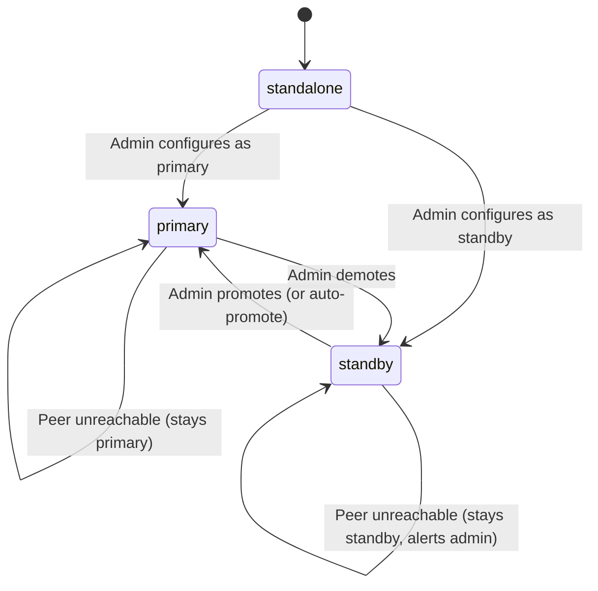
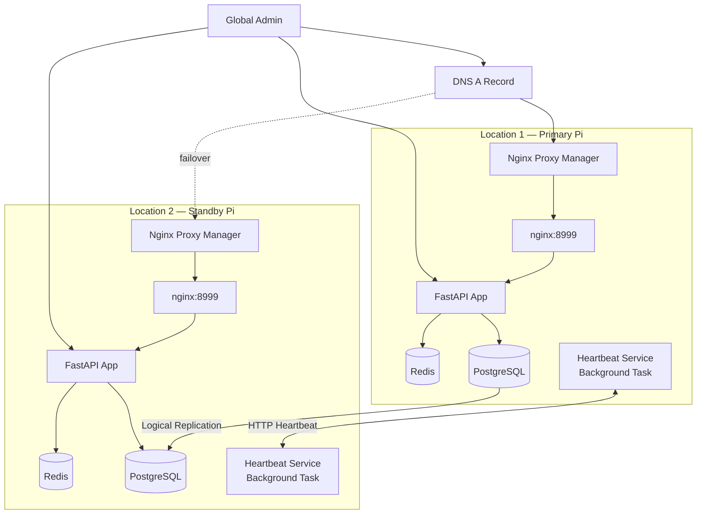

# Design Document: HA Replication

## Overview

The HA Replication feature adds active-standby high availability to OraInvoice across two Raspberry Pi nodes at different physical locations. The primary node serves all read/write traffic while the standby node receives real-time data via PostgreSQL logical replication. A heartbeat service monitors both nodes' health, and the admin GUI provides full visibility and manual failover controls.

DNS/NPM routing is managed externally by the administrator — the app handles:
1. **PostgreSQL logical replication** between the two nodes' databases
2. **Heartbeat health monitoring** via HTTP between the two app instances
3. **Role management** (primary/standby) with promote/demote operations
4. **Write protection** on the standby node
5. **Admin visibility** via dashboard panels and login page indicators

### Key Design Decisions

- **PostgreSQL logical replication over streaming replication** — Logical replication works across independent PostgreSQL instances (each node runs its own Postgres container), doesn't require shared WAL archives, and allows the standby to have its own independent schema for the `ha_config` table. It also works cleanly with Docker volume isolation.
- **App-level heartbeat over external monitoring** — Each node's FastAPI app pings the peer directly, keeping the solution self-contained without requiring external monitoring tools.
- **Manual failover by default** — Automatic promotion is opt-in (`auto_promote_enabled: false`) to prevent split-brain scenarios in a two-node setup without a quorum arbiter.
- **Middleware-based write protection** — A FastAPI middleware checks the node role and rejects non-GET requests on the standby, keeping the protection centralized and transparent to all endpoints.
- **HMAC-signed heartbeats** — Prevents spoofed health checks from triggering incorrect failover decisions.



## Architecture

### System Context



### Component Responsibilities

| Component | Responsibility |
|---|---|
| `HA Router` | REST endpoints for all HA operations: identity, heartbeat, status, configure, promote, demote, re-sync, maintenance |
| `HA Service` | Core business logic for node management, role transitions, replication setup, and health tracking |
| `Heartbeat Service` | Background asyncio task that pings the peer every 10s and tracks health history |
| `Replication Manager` | Manages PostgreSQL logical replication: create publication/subscription, monitor lag, trigger re-sync |
| `Standby Middleware` | FastAPI middleware that rejects writes on standby nodes |
| `HA Status Panel` | React component on the Global Admin Dashboard showing cluster health |
| `Node Status Indicator` | Small React component on the login page showing current node info |

## Components and Interfaces

### Backend Components

#### 1. HA Router (`app/modules/ha/router.py`)

All management endpoints require `global_admin` role. Heartbeat and public status endpoints are open.

```python
# Public endpoints (no auth)
GET    /api/v1/ha/heartbeat              # Peer health check (HMAC-verified)
GET    /api/v1/ha/status                 # Public node status (minimal info)

# Admin endpoints (global_admin only)
GET    /api/v1/ha/identity               # Full node identity and config
PUT    /api/v1/ha/configure              # Set/update HA configuration
POST   /api/v1/ha/promote               # Promote standby to primary
POST   /api/v1/ha/demote                # Demote primary to standby
POST   /api/v1/ha/replication/init       # Initialize replication
GET    /api/v1/ha/replication/status     # Replication health details
POST   /api/v1/ha/replication/resync     # Trigger full re-sync
POST   /api/v1/ha/maintenance-mode       # Enter maintenance mode
POST   /api/v1/ha/ready                  # Exit maintenance mode
GET    /api/v1/ha/history                # Heartbeat history (last 100)
```

#### 2. HA Schemas (`app/modules/ha/schemas.py`)

```python
class HAConfigRequest(BaseModel):
    node_name: str                    # Human-readable name (e.g. "Pi-Main")
    role: str                         # "primary" or "standby"
    peer_endpoint: str                # URL of peer node API (e.g. "http://192.168.x.x:8999")
    auto_promote_enabled: bool = False
    heartbeat_interval_seconds: int = 10
    failover_timeout_seconds: int = 90

class HAConfigResponse(BaseModel):
    node_id: str
    node_name: str
    role: str
    peer_endpoint: str
    auto_promote_enabled: bool
    heartbeat_interval_seconds: int
    failover_timeout_seconds: int
    created_at: datetime
    updated_at: datetime

class HeartbeatResponse(BaseModel):
    node_id: str
    node_name: str
    role: str
    status: str                       # "healthy"
    database_status: str              # "connected" | "error"
    replication_lag_seconds: float | None  # Only on standby
    sync_status: str                  # "healthy" | "lagging" | "disconnected" | "resyncing" | "not_configured"
    uptime_seconds: float
    maintenance: bool
    timestamp: str                    # ISO 8601
    hmac_signature: str               # HMAC of payload

class PublicStatusResponse(BaseModel):
    node_name: str
    role: str
    peer_status: str                  # "healthy" | "degraded" | "unreachable" | "unknown"
    sync_status: str

class PromoteRequest(BaseModel):
    confirmation_text: str            # Must be "CONFIRM"
    reason: str
    force: bool = False               # Required if replication lag > 5s

class DemoteRequest(BaseModel):
    confirmation_text: str            # Must be "CONFIRM"
    reason: str

class ReplicationStatusResponse(BaseModel):
    publication_name: str | None
    subscription_name: str | None
    subscription_status: str | None   # "active" | "disabled" | "error" | None
    replication_lag_seconds: float | None
    last_replicated_at: str | None
    tables_published: int
    is_healthy: bool

class ResyncProgressResponse(BaseModel):
    status: str                       # "idle" | "in_progress" | "completed" | "error"
    tables_synced: int
    tables_total: int
    rows_copied: int
    estimated_seconds_remaining: int | None
    started_at: str | None
    error_message: str | None

class HeartbeatHistoryEntry(BaseModel):
    timestamp: str
    peer_status: str
    replication_lag_seconds: float | None
    response_time_ms: float | None
    error: str | None

class HANodeStatusForDashboard(BaseModel):
    node_name: str
    role: str
    health: str                       # "healthy" | "degraded" | "unreachable"
    sync_status: str
    replication_lag_seconds: float | None
    last_heartbeat: str | None
    maintenance: bool
    is_local: bool                    # True for the node you're connected to
```

#### 3. HA Service (`app/modules/ha/service.py`)

```python
class HAService:
    async def get_config(db) -> HAConfigResponse | None
    async def save_config(db, config: HAConfigRequest, user_id: UUID) -> HAConfigResponse
    async def get_identity(db) -> HAConfigResponse
    async def promote(db, user_id: UUID, reason: str, force: bool) -> dict
    async def demote(db, user_id: UUID, reason: str) -> dict
    async def get_cluster_status(db) -> list[HANodeStatusForDashboard]
    async def enter_maintenance_mode(db, user_id: UUID) -> dict
    async def exit_maintenance_mode(db, user_id: UUID) -> dict
```

#### 4. Heartbeat Service (`app/modules/ha/heartbeat.py`)

A background asyncio task started on app startup (if HA is configured).

```python
class HeartbeatService:
    def __init__(self, peer_endpoint: str, interval: int, secret: str):
        self.peer_endpoint = peer_endpoint
        self.interval = interval
        self.secret = secret
        self.history: deque[HeartbeatHistoryEntry] = deque(maxlen=100)
        self.peer_health: str = "unknown"  # healthy | degraded | unreachable
        self._task: asyncio.Task | None = None

    async def start(self) -> None
    async def stop(self) -> None
    async def _ping_loop(self) -> None
    async def _ping_peer(self) -> HeartbeatHistoryEntry
    def get_peer_health(self) -> str
    def get_history(self) -> list[HeartbeatHistoryEntry]
    def _compute_hmac(self, payload: dict) -> str
    def _verify_hmac(self, payload: dict, signature: str) -> bool
```

#### 5. Replication Manager (`app/modules/ha/replication.py`)

Manages PostgreSQL logical replication via SQL commands executed against the local and peer databases.

```python
class ReplicationManager:
    PUBLICATION_NAME = "orainvoice_ha_pub"
    SUBSCRIPTION_NAME = "orainvoice_ha_sub"

    async def init_primary(db) -> dict
        # CREATE PUBLICATION orainvoice_ha_pub FOR ALL TABLES

    async def init_standby(db, primary_conn_str: str) -> dict
        # CREATE SUBSCRIPTION orainvoice_ha_sub
        #   CONNECTION '<primary_conn_str>'
        #   PUBLICATION orainvoice_ha_pub

    async def get_replication_status(db) -> ReplicationStatusResponse
        # Query pg_stat_subscription, pg_replication_slots

    async def get_replication_lag(db) -> float | None
        # Query pg_stat_subscription for lag

    async def stop_subscription(db) -> None
        # ALTER SUBSCRIPTION ... DISABLE

    async def resume_subscription(db, primary_conn_str: str) -> None
        # ALTER SUBSCRIPTION ... ENABLE
        # or DROP + re-CREATE if slot invalidated

    async def trigger_resync(db, primary_conn_str: str) -> None
        # DROP SUBSCRIPTION, re-CREATE with copy_data=true

    async def drop_publication(db) -> None
    async def drop_subscription(db) -> None
```

#### 6. Standby Middleware (`app/modules/ha/middleware.py`)

```python
class StandbyWriteProtectionMiddleware:
    """Rejects non-GET requests when node is in standby role.

    Allows:
    - All GET/HEAD/OPTIONS requests (reads)
    - All requests to /api/v1/ha/* (HA management)
    - All requests when node role is 'primary' or 'standalone'
    """
    async def __call__(self, request, call_next):
        if node_role == "standby" and request.method not in ("GET", "HEAD", "OPTIONS"):
            if not request.url.path.startswith("/api/v1/ha/"):
                return JSONResponse(status_code=503, content={...})
        return await call_next(request)
```

### Frontend Components

#### 1. HA Status Panel (`frontend/src/components/ha/HAStatusPanel.tsx`)

Displayed on the Global Admin Dashboard. Shows both nodes' status, promote/demote buttons, replication info, and rolling update guide.

#### 2. Node Status Indicator (`frontend/src/components/ha/NodeStatusIndicator.tsx`)

Small component shown on the login page and optionally in the app header. Fetches from `GET /api/v1/ha/status`.

## Data Models

### ha_config Table

```sql
CREATE TABLE ha_config (
    id              UUID PRIMARY KEY DEFAULT gen_random_uuid(),
    node_id         UUID NOT NULL UNIQUE DEFAULT gen_random_uuid(),
    node_name       VARCHAR(100) NOT NULL,
    role            VARCHAR(20) NOT NULL DEFAULT 'standalone',
    peer_endpoint   VARCHAR(500),
    auto_promote_enabled BOOLEAN NOT NULL DEFAULT false,
    heartbeat_interval_seconds INTEGER NOT NULL DEFAULT 10,
    failover_timeout_seconds INTEGER NOT NULL DEFAULT 90,
    maintenance_mode BOOLEAN NOT NULL DEFAULT false,
    last_peer_health VARCHAR(20) DEFAULT 'unknown',
    last_peer_heartbeat TIMESTAMPTZ,
    sync_status     VARCHAR(30) NOT NULL DEFAULT 'not_configured',
    created_at      TIMESTAMPTZ NOT NULL DEFAULT now(),
    updated_at      TIMESTAMPTZ NOT NULL DEFAULT now(),
    CONSTRAINT ck_ha_config_role CHECK (role IN ('standalone', 'primary', 'standby')),
    CONSTRAINT ck_ha_config_sync CHECK (
        sync_status IN ('not_configured', 'initializing', 'healthy', 'lagging', 'disconnected', 'resyncing', 'error')
    )
);
```

### SQLAlchemy ORM Model

```python
class HAConfig(Base):
    __tablename__ = "ha_config"

    id: Mapped[uuid.UUID] = mapped_column(UUID(as_uuid=True), primary_key=True, default=uuid.uuid4)
    node_id: Mapped[uuid.UUID] = mapped_column(UUID(as_uuid=True), unique=True, nullable=False, default=uuid.uuid4)
    node_name: Mapped[str] = mapped_column(String(100), nullable=False)
    role: Mapped[str] = mapped_column(String(20), nullable=False, default="standalone")
    peer_endpoint: Mapped[str | None] = mapped_column(String(500), nullable=True)
    auto_promote_enabled: Mapped[bool] = mapped_column(Boolean, nullable=False, default=False)
    heartbeat_interval_seconds: Mapped[int] = mapped_column(Integer, nullable=False, default=10)
    failover_timeout_seconds: Mapped[int] = mapped_column(Integer, nullable=False, default=90)
    maintenance_mode: Mapped[bool] = mapped_column(Boolean, nullable=False, default=False)
    last_peer_health: Mapped[str] = mapped_column(String(20), default="unknown")
    last_peer_heartbeat: Mapped[datetime | None] = mapped_column(DateTime(timezone=True), nullable=True)
    sync_status: Mapped[str] = mapped_column(String(30), nullable=False, default="not_configured")
    created_at: Mapped[datetime] = mapped_column(DateTime(timezone=True), nullable=False, server_default=func.now())
    updated_at: Mapped[datetime] = mapped_column(DateTime(timezone=True), nullable=False, server_default=func.now(), onupdate=func.now())
```

### Environment Variables

| Variable | Required | Default | Description |
|---|---|---|---|
| `HA_HEARTBEAT_SECRET` | Yes (if HA enabled) | — | Shared HMAC secret for heartbeat signing |
| `HA_PEER_DB_URL` | Yes (if standby) | — | PostgreSQL connection string for the peer's database (used for replication subscription) |

### Redis Keys

| Key | Type | TTL | Purpose |
|---|---|---|---|
| `ha:peer_health` | String | 60s | Cached peer health status |
| `ha:heartbeat_history` | List | None | Last 100 heartbeat results (trimmed on each ping) |
| `ha:resync_progress` | Hash | 1h | Re-sync progress tracking |

## Correctness Properties

### Property 1: RBAC enforcement on HA management endpoints

*For any* user with a role other than `global_admin`, and *for any* HA management endpoint (configure, promote, demote, replication/init, replication/resync, maintenance-mode, ready), the system should return a 403 Forbidden response.

**Validates: Requirements 1.2, 11.1**

### Property 2: Heartbeat HMAC verification

*For any* heartbeat payload and shared secret, computing the HMAC and then verifying it with the same secret should return true. Computing with a different secret should return false.

**Validates: Requirements 11.4**

### Property 3: Peer health classification

*For any* timestamp of the last successful heartbeat and *for any* current time, the peer health should be: "healthy" if the difference is < 30s, "degraded" if 30–60s, "unreachable" if > 60s.

**Validates: Requirements 2.3**

### Property 4: Promotion requires confirmation text

*For any* string that is not exactly `"CONFIRM"`, the promote endpoint should reject the request. Only the exact string `"CONFIRM"` should be accepted.

**Validates: Requirements 7.6**

### Property 5: Promotion blocked when lag exceeds threshold

*For any* replication lag > 5 seconds and `force=false`, the promote endpoint should reject the request. With `force=true`, it should proceed.

**Validates: Requirements 4.5**

### Property 6: Standby write protection

*For any* non-GET/HEAD/OPTIONS request to a path NOT starting with `/api/v1/ha/`, when the node role is "standby", the middleware should return 503. GET requests should pass through. Requests to `/api/v1/ha/*` should pass through regardless of method.

**Validates: Requirements 9.1, 9.3, 9.4**

### Property 7: Public status endpoint exposes only safe fields

*For any* response from `GET /api/v1/ha/status`, the response should contain only: node_name, role, peer_status, and sync_status. No database credentials, user data, or internal configuration should be present.

**Validates: Requirements 8.4, 11.3**

### Property 8: Role state machine validity

*For any* node role, the valid transitions are: standalone→primary, standalone→standby, primary→standby (demote), standby→primary (promote). No other transitions should be allowed.

**Validates: Requirements 4.1, 4.3**

### Property 9: HA config persistence round-trip

*For any* valid HAConfigRequest, saving it to the database and reading it back should return identical values for all fields.

**Validates: Requirements 10.1**

### Property 10: Heartbeat history bounded size

*For any* sequence of heartbeat pings, the history deque should never exceed 100 entries. After 100+ pings, the oldest entries should be evicted.

**Validates: Requirements 2.4**

### Property 11: Auto-promote only when enabled

*For any* state where `auto_promote_enabled=false`, the system should never automatically promote the standby, regardless of how long the primary has been unreachable.

**Validates: Requirements 5.3**

### Property 12: Split-brain detection

*For any* state where both nodes report role="primary", the system should detect this as a split-brain condition and alert the admin rather than attempting resolution.

**Validates: Requirements 5.5**

## Error Handling

### Backend Error Handling

| Error Scenario | HTTP Status | Response | Recovery |
|---|---|---|---|
| Non-global_admin access to management endpoints | 403 | `{"detail": "Global_Admin role required"}` | N/A |
| Promote on a primary node | 400 | `{"detail": "Node is already primary"}` | N/A |
| Demote on a standby node | 400 | `{"detail": "Node is already standby"}` | N/A |
| Promote with lag > 5s and force=false | 400 | `{"detail": "Replication lag is Xs (> 5s). Set force=true to proceed with potential data loss."}` | Admin waits or forces |
| Invalid confirmation text | 400 | `{"detail": "Confirmation text must be exactly 'CONFIRM'"}` | Admin retypes |
| Peer unreachable during replication init | 400 | `{"detail": "Cannot reach peer database at <endpoint>"}` | Admin checks network |
| Replication slot invalidated | 400 | `{"detail": "Replication slot invalidated. Use /replication/resync for full re-sync."}` | Admin triggers re-sync |
| HA not configured | 404 | `{"detail": "HA is not configured. Use PUT /api/v1/ha/configure first."}` | Admin configures HA |
| Invalid HMAC on heartbeat | 401 | `{"detail": "Invalid heartbeat signature"}` | Check shared secret |
| Write attempt on standby | 503 | `{"detail": "This node is in standby mode...", "node_role": "standby", "primary_endpoint": "..."}` | Client connects to primary |

## Testing Strategy

### Property-Based Testing

Python backend tests use `hypothesis` with `@settings(max_examples=100)`. Frontend tests use `fast-check`.

**Backend properties (P1–P12):**
- P1: RBAC enforcement
- P2: HMAC sign/verify round-trip
- P3: Peer health classification from timestamp delta
- P4: Confirmation text validation
- P5: Promotion lag threshold gating
- P6: Standby middleware write protection
- P7: Public status response field safety
- P8: Role state machine transitions
- P9: Config persistence round-trip
- P10: Heartbeat history bounded size
- P11: Auto-promote gating
- P12: Split-brain detection

**Frontend properties:**
- Promote/demote button visibility based on role
- Health indicator color based on status
- Replication lag warning banner visibility

### Unit Tests

- Heartbeat ping success/failure handling
- Replication init SQL generation
- Promote/demote state transitions
- Middleware request filtering
- Config CRUD operations
