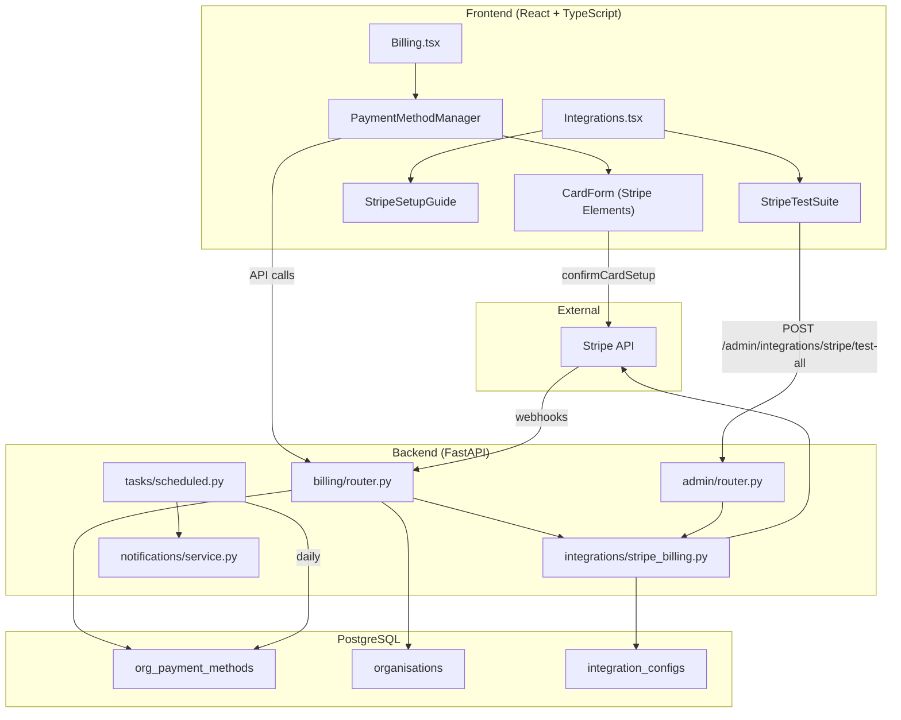

# Design Document: In-App Payment Methods

## Overview

This feature replaces the external Stripe Customer Portal redirect with a fully in-app payment method management experience. Instead of bouncing Org Admins to Stripe's hosted portal, all card management (list, add, set default, remove) happens directly on the WorkshopPro Billing page using Stripe Elements.

The feature spans four areas:

1. **In-app card management UI** — A `PaymentMethodManager` React component on the Billing page that lists saved cards, adds new ones via Stripe Elements `CardElement` (with `hidePostalCode: true` for NZ), sets defaults, and removes cards.
2. **Backend API layer** — New endpoints on the billing router (`GET /billing/payment-methods`, `POST /billing/setup-intent`, `POST /billing/payment-methods/{id}/set-default`, `DELETE /billing/payment-methods/{id}`) backed by a new `org_payment_methods` database table.
3. **Card lifecycle automation** — Signup card persistence, a daily scheduled task for expiry monitoring with notifications, and card verification via SetupIntent micro-authorisation + `setup_intent.succeeded` webhook.
4. **Admin tooling** — A step-by-step Stripe Setup Guide on the Integrations page and a comprehensive "Run All Tests" suite for Stripe functions and webhook handlers.

All Stripe API keys are loaded from the `integration_configs` database table via the Global Admin GUI — no `.env` configuration is used.

## Architecture

The feature follows the existing WorkshopPro architecture: FastAPI backend with SQLAlchemy async models, React + TypeScript frontend with Tailwind CSS.



### Key Design Decisions

1. **Local `org_payment_methods` table instead of always querying Stripe**: Storing payment method metadata locally avoids Stripe API calls on every Billing page load, enables the expiry monitoring scheduled task to query locally, and keeps the UI fast. The table is kept in sync via webhooks and explicit API operations.

2. **SetupIntent with `usage: 'off_session'`**: This triggers Stripe's micro-authorisation check, verifying the card is real before saving it. The existing `create_setup_intent` function needs a minor update to pass this parameter.

3. **Webhook-based verification fallback**: The `setup_intent.succeeded` webhook event is handled as a fallback to confirm card verification if the frontend's `confirmCardSetup` callback is missed (e.g. browser closed mid-flow).

4. **Minimum one payment method enforcement**: The backend enforces this rule — the DELETE endpoint returns 400 if the card is the only one on file. The frontend mirrors this by disabling the Remove button.

5. **Stripe Setup Guide as collapsible UI**: The guide lives on the existing Integrations page Stripe tab, above the API Keys section. It uses localStorage to persist the collapsed/dismissed state.

6. **Test suite uses mock webhook payloads**: Webhook handler tests use constructed event payloads rather than triggering real Stripe webhooks, keeping tests fast and deterministic. Test resources (e.g. test customers) are cleaned up after the run.

## Components and Interfaces

### Backend Components

#### 1. Payment Method Endpoints (billing/router.py)

New endpoints added to the existing billing router:

```python
# GET /billing/payment-methods
# Returns all payment methods for the org from org_payment_methods table
# Requires Org Admin auth, validates stripe_customer_id exists

# POST /billing/setup-intent
# Creates a Stripe SetupIntent with usage='off_session'
# Returns { client_secret, setup_intent_id }

# POST /billing/payment-methods/{payment_method_id}/set-default
# Updates Stripe customer invoice_settings.default_payment_method
# Updates org_payment_methods is_default flags

# DELETE /billing/payment-methods/{payment_method_id}
# Detaches from Stripe, removes from org_payment_methods
# Returns 400 if it's the only card on file
```

#### 2. Stripe Billing Integration Updates (integrations/stripe_billing.py)

New and modified functions:

```python
# Modified: create_setup_intent — add usage='off_session' parameter
# New: list_payment_methods(customer_id) — calls stripe.PaymentMethod.list
# New: set_default_payment_method(customer_id, payment_method_id) — updates customer invoice_settings
# New: detach_payment_method(payment_method_id) — calls stripe.PaymentMethod.detach
# Modified: handle_subscription_webhook — add setup_intent.succeeded handler
```

#### 3. Expiry Monitoring Task (tasks/scheduled.py)

```python
# New: check_card_expiry_task()
# Runs daily, queries org_payment_methods for cards expiring within 2 months
# Only checks default cards or sole cards on file
# Sends notification via notification service
# Tracks expiry_notified_at to prevent duplicates
```

#### 4. Stripe Test Suite Endpoint (admin/router.py)

```python
# POST /admin/integrations/stripe/test-all
# Runs all Stripe function tests and webhook handler tests sequentially
# Returns array of { test_name, category, status, error_message }
# Cleans up test resources after completion
```

### Frontend Components

#### 1. PaymentMethodManager Component

Location: `frontend/src/components/billing/PaymentMethodManager.tsx`

```typescript
interface PaymentMethod {
  id: string;
  stripe_payment_method_id: string;
  brand: string;
  last4: string;
  exp_month: number;
  exp_year: number;
  is_default: boolean;
  is_verified: boolean;
  is_expiring_soon: boolean;
}

// Props: none (fetches data internally via /billing/payment-methods)
// State: payment methods list, loading, error, showAddForm
// Actions: add card, set default, remove card
```

#### 2. CardForm Component

Location: `frontend/src/components/billing/CardForm.tsx`

```typescript
// Uses @stripe/react-stripe-js Elements provider
// Renders CardElement with hidePostalCode: true
// On submit: calls POST /billing/setup-intent, then confirmCardSetup
// On success: calls parent callback to refresh payment methods list
// On error: displays Stripe error message
```

#### 3. StripeSetupGuide Component

Location: `frontend/src/components/admin/StripeSetupGuide.tsx`

```typescript
// Collapsible guide with 7 numbered steps
// Shows progress checkmarks based on saved config state
// Dismissible with localStorage persistence
// Renders above API Keys section on Stripe tab
```

#### 4. StripeTestSuite Component

Location: `frontend/src/components/admin/StripeTestSuite.tsx`

```typescript
interface TestResult {
  test_name: string;
  category: 'api_functions' | 'webhook_handlers';
  status: 'passed' | 'failed' | 'skipped';
  error_message?: string;
  skip_reason?: string;
}

// "Run All Tests" button triggers POST /admin/integrations/stripe/test-all
// Displays results in grouped table (API Functions, Webhook Handlers)
// Shows summary: "X of Y tests passed"
```

### API Interface Contracts

#### GET /billing/payment-methods

Response 200:
```json
{
  "payment_methods": [
    {
      "id": "uuid",
      "stripe_payment_method_id": "pm_xxx",
      "brand": "visa",
      "last4": "4242",
      "exp_month": 12,
      "exp_year": 2026,
      "is_default": true,
      "is_verified": true,
      "is_expiring_soon": false
    }
  ]
}
```

#### POST /billing/setup-intent

Response 200:
```json
{
  "client_secret": "seti_xxx_secret_xxx",
  "setup_intent_id": "seti_xxx"
}
```

#### POST /billing/payment-methods/{payment_method_id}/set-default

Response 200:
```json
{
  "success": true,
  "message": "Default payment method updated"
}
```

#### DELETE /billing/payment-methods/{payment_method_id}

Response 200:
```json
{
  "success": true,
  "message": "Payment method removed"
}
```

Response 400 (only card):
```json
{
  "detail": "You must have at least one valid payment method. Please add a new card before removing this one."
}
```

#### POST /admin/integrations/stripe/test-all

Response 200:
```json
{
  "results": [
    {
      "test_name": "Create Customer",
      "category": "api_functions",
      "status": "passed",
      "error_message": null
    },
    {
      "test_name": "Webhook: setup_intent.succeeded",
      "category": "webhook_handlers",
      "status": "passed",
      "error_message": null
    }
  ],
  "summary": {
    "total": 15,
    "passed": 14,
    "failed": 0,
    "skipped": 1
  }
}
```

## Data Models

### New Table: `org_payment_methods`

```sql
CREATE TABLE org_payment_methods (
    id                        UUID PRIMARY KEY DEFAULT gen_random_uuid(),
    org_id                    UUID NOT NULL REFERENCES organisations(id) ON DELETE CASCADE,
    stripe_payment_method_id  VARCHAR(255) NOT NULL UNIQUE,
    brand                     VARCHAR(50) NOT NULL,
    last4                     VARCHAR(4) NOT NULL,
    exp_month                 SMALLINT NOT NULL,
    exp_year                  SMALLINT NOT NULL,
    is_default                BOOLEAN NOT NULL DEFAULT FALSE,
    is_verified               BOOLEAN NOT NULL DEFAULT FALSE,
    expiry_notified_at        TIMESTAMP WITH TIME ZONE,
    created_at                TIMESTAMP WITH TIME ZONE NOT NULL DEFAULT NOW(),
    updated_at                TIMESTAMP WITH TIME ZONE NOT NULL DEFAULT NOW()
);

CREATE INDEX ix_org_payment_methods_org_id ON org_payment_methods(org_id);
CREATE UNIQUE INDEX uq_org_payment_methods_stripe_pm ON org_payment_methods(stripe_payment_method_id);
```

### SQLAlchemy Model

```python
class OrgPaymentMethod(Base):
    __tablename__ = "org_payment_methods"

    id: Mapped[uuid.UUID] = mapped_column(UUID(as_uuid=True), primary_key=True, default=uuid.uuid4)
    org_id: Mapped[uuid.UUID] = mapped_column(UUID(as_uuid=True), ForeignKey("organisations.id"), nullable=False)
    stripe_payment_method_id: Mapped[str] = mapped_column(String(255), nullable=False, unique=True)
    brand: Mapped[str] = mapped_column(String(50), nullable=False)
    last4: Mapped[str] = mapped_column(String(4), nullable=False)
    exp_month: Mapped[int] = mapped_column(SmallInteger, nullable=False)
    exp_year: Mapped[int] = mapped_column(SmallInteger, nullable=False)
    is_default: Mapped[bool] = mapped_column(Boolean, nullable=False, server_default="false")
    is_verified: Mapped[bool] = mapped_column(Boolean, nullable=False, server_default="false")
    expiry_notified_at: Mapped[datetime | None] = mapped_column(DateTime(timezone=True), nullable=True)
    created_at: Mapped[datetime] = mapped_column(DateTime(timezone=True), nullable=False, server_default=func.now())
    updated_at: Mapped[datetime] = mapped_column(DateTime(timezone=True), nullable=False, server_default=func.now(), onupdate=func.now())
```

### Pydantic Schemas

```python
class PaymentMethodResponse(BaseModel):
    id: uuid.UUID
    stripe_payment_method_id: str
    brand: str
    last4: str
    exp_month: int
    exp_year: int
    is_default: bool
    is_verified: bool
    is_expiring_soon: bool  # computed: expiry within 2 months of current date

class PaymentMethodListResponse(BaseModel):
    payment_methods: list[PaymentMethodResponse]

class SetupIntentResponse(BaseModel):
    client_secret: str
    setup_intent_id: str

class StripeTestResult(BaseModel):
    test_name: str
    category: str  # "api_functions" or "webhook_handlers"
    status: str    # "passed", "failed", "skipped"
    error_message: str | None = None
    skip_reason: str | None = None

class StripeTestAllResponse(BaseModel):
    results: list[StripeTestResult]
    summary: dict  # { total, passed, failed, skipped }
```

### Alembic Migration

A new Alembic migration will create the `org_payment_methods` table. The migration follows the existing naming convention (e.g. `2026_XX_XX_XXXX-XXXX_create_org_payment_methods.py`).


## Correctness Properties

*A property is a characteristic or behavior that should hold true across all valid executions of a system — essentially, a formal statement about what the system should do. Properties serve as the bridge between human-readable specifications and machine-verifiable correctness guarantees.*

### Property 1: List endpoint returns all org payment methods

*For any* organisation with N payment methods in the `org_payment_methods` table, the `GET /billing/payment-methods` endpoint should return exactly N items, and each item should contain the fields: `brand`, `last4`, `exp_month`, `exp_year`, `is_default`, `is_verified`, and `is_expiring_soon`.

**Validates: Requirements 1.1, 1.2, 5.1**

### Property 2: Expiry-soon computation

*For any* payment method with expiry month M and year Y, the `is_expiring_soon` field should be `true` if and only if the card's expiry date (last day of month M/Y) is within 2 months of the current date.

**Validates: Requirements 1.6**

### Property 3: First card becomes default automatically

*For any* organisation with zero existing payment methods, when a new card is added, that card's `is_default` field should be set to `true`.

**Validates: Requirements 2.5**

### Property 4: Exactly one default after set-default

*For any* organisation with one or more payment methods, after calling the set-default endpoint for any card, exactly one payment method in the org should have `is_default = true`, and it should be the card that was just set as default.

**Validates: Requirements 3.1, 5.3**

### Property 5: Deletion reduces payment method count

*For any* organisation with N > 1 payment methods, deleting a non-sole card should result in exactly N - 1 payment methods remaining for that org.

**Validates: Requirements 4.2, 5.4**

### Property 6: Cannot delete sole payment method

*For any* organisation with exactly 1 payment method, attempting to delete that card should return a 400 error and the payment method count should remain 1.

**Validates: Requirements 4.4, 4.7**

### Property 7: Org Admin authentication required

*For any* request to a payment method endpoint (`GET /billing/payment-methods`, `POST /billing/setup-intent`, `POST /billing/payment-methods/{id}/set-default`, `DELETE /billing/payment-methods/{id}`) without valid Org Admin authentication, the backend should return 401 or 403.

**Validates: Requirements 5.5**

### Property 8: No Stripe customer returns 400

*For any* organisation without a `stripe_customer_id`, all payment method endpoints should return a 400 error with a descriptive message.

**Validates: Requirements 5.6**

### Property 9: Only safe card fields stored

*For any* record in the `org_payment_methods` table, the stored fields should be limited to: `stripe_payment_method_id`, `brand`, `last4`, `exp_month`, `exp_year`, `is_default`, `is_verified`, and metadata fields. No full card number or CVV should be present.

**Validates: Requirements 7.2**

### Property 10: Cross-org access denied

*For any* user belonging to organisation A, attempting to access, modify, or delete a payment method belonging to organisation B should be denied.

**Validates: Requirements 7.3**

### Property 11: Signup card saved as default and verified

*For any* successful signup with card payment, the `org_payment_methods` table should contain a record for that org with `is_default = true` and `is_verified = true`, and the `brand`, `last4`, `exp_month`, `exp_year` fields should match the Stripe payment method metadata.

**Validates: Requirements 8.1, 8.2, 8.3**

### Property 12: Expiry monitoring selects correct cards

*For any* set of payment methods across all organisations, the expiry monitoring task should select only cards that are (a) expiring within 2 months based on their `exp_month`/`exp_year`, AND (b) are either the default card or the only card for their organisation. Non-default cards in orgs with other valid cards should not be selected.

**Validates: Requirements 9.1, 9.2, 9.5, 9.6**

### Property 13: No duplicate expiry notifications

*For any* card that has `expiry_notified_at` set (i.e. a notification was already sent), running the expiry monitoring task again should not send another notification for that card.

**Validates: Requirements 9.4**

### Property 14: Expiry notification contains required fields

*For any* expiry notification generated by the scheduled task, the notification content should include the card brand, last four digits, expiry month/year, and a link to the Billing page.

**Validates: Requirements 9.3**

### Property 15: Verification status set on successful setup

*For any* successfully confirmed SetupIntent (either via frontend callback or `setup_intent.succeeded` webhook), the corresponding card in `org_payment_methods` should have `is_verified = true`.

**Validates: Requirements 10.2, 10.5**

### Property 16: Failed setup does not persist card

*For any* SetupIntent that fails confirmation (card declined, invalid, etc.), no corresponding record should be created in the `org_payment_methods` table.

**Validates: Requirements 10.3**

### Property 17: Setup guide progress reflects completion state

*For any* combination of completed Stripe setup steps (API keys saved, webhook secret saved, etc.), the Setup Guide component should show checkmarks for exactly those steps that are completed and no others.

**Validates: Requirements 11.5**

### Property 18: Test results contain required fields

*For any* test result returned by the `POST /admin/integrations/stripe/test-all` endpoint, each result should contain `test_name`, `category` (one of "api_functions" or "webhook_handlers"), and `status` (one of "passed", "failed", "skipped"). If status is "failed", `error_message` should be non-null.

**Validates: Requirements 12.2, 12.3**

### Property 19: Test summary computation

*For any* array of test results, the summary `passed` count should equal the number of results with status "passed", `failed` should equal the count with status "failed", `skipped` should equal the count with status "skipped", and `total` should equal `passed + failed + skipped`.

**Validates: Requirements 12.6**

## Error Handling

### Backend Error Handling

| Scenario | HTTP Status | Response |
|---|---|---|
| No Stripe customer ID on org | 400 | `{"detail": "No Stripe customer configured for this organisation. Please contact support."}` |
| Delete sole payment method | 400 | `{"detail": "You must have at least one valid payment method. Please add a new card before removing this one."}` |
| Payment method not found | 404 | `{"detail": "Payment method not found"}` |
| Payment method belongs to different org | 403 | `{"detail": "Access denied"}` |
| Stripe API error (create SetupIntent) | 502 | `{"detail": "Failed to create setup intent. Please try again."}` |
| Stripe API error (set default) | 502 | `{"detail": "Failed to update default payment method. Please try again."}` |
| Stripe API error (detach) | 502 | `{"detail": "Failed to remove payment method. Please try again."}` |
| Unauthenticated request | 401 | `{"detail": "Not authenticated"}` |
| Non-Org-Admin request | 403 | `{"detail": "Insufficient permissions"}` |
| Stripe test-all endpoint failure | 200 | Individual test marked as "failed" with error message — the endpoint itself always returns 200 |

### Frontend Error Handling

- All API errors display a toast notification with the error message from the backend.
- Stripe Elements errors (card declined, invalid number, etc.) are displayed inline below the CardForm.
- Network errors show a generic "Something went wrong. Please try again." message.
- The PaymentMethodManager shows a retry button if the initial load fails.

### Webhook Error Handling

- The `setup_intent.succeeded` webhook handler logs errors but returns 200 to Stripe to prevent retries for non-transient failures.
- If the payment method referenced in the webhook doesn't exist in `org_payment_methods`, the handler creates the record (sync from Stripe).

### Scheduled Task Error Handling

- The expiry monitoring task wraps each org's processing in a try/except so one org's failure doesn't block others.
- Notification send failures are logged and the `expiry_notified_at` is NOT set, so the next run retries.

## Testing Strategy

### Property-Based Testing

Property-based tests use `hypothesis` (Python) and `fast-check` (TypeScript) to verify universal properties across generated inputs. Each property test runs a minimum of 100 iterations.

**Backend Property Tests** (`tests/properties/test_payment_methods_properties.py`):

| Test | Property | Tag |
|---|---|---|
| test_list_returns_all_org_methods | Property 1 | Feature: in-app-payment-methods, Property 1: List endpoint returns all org payment methods |
| test_expiry_soon_computation | Property 2 | Feature: in-app-payment-methods, Property 2: Expiry-soon computation |
| test_first_card_auto_default | Property 3 | Feature: in-app-payment-methods, Property 3: First card becomes default automatically |
| test_exactly_one_default | Property 4 | Feature: in-app-payment-methods, Property 4: Exactly one default after set-default |
| test_deletion_reduces_count | Property 5 | Feature: in-app-payment-methods, Property 5: Deletion reduces payment method count |
| test_cannot_delete_sole_card | Property 6 | Feature: in-app-payment-methods, Property 6: Cannot delete sole payment method |
| test_no_stripe_customer_returns_400 | Property 8 | Feature: in-app-payment-methods, Property 8: No Stripe customer returns 400 |
| test_signup_card_default_verified | Property 11 | Feature: in-app-payment-methods, Property 11: Signup card saved as default and verified |
| test_expiry_monitoring_selects_correct_cards | Property 12 | Feature: in-app-payment-methods, Property 12: Expiry monitoring selects correct cards |
| test_no_duplicate_expiry_notifications | Property 13 | Feature: in-app-payment-methods, Property 13: No duplicate expiry notifications |
| test_expiry_notification_content | Property 14 | Feature: in-app-payment-methods, Property 14: Expiry notification contains required fields |
| test_verification_on_success | Property 15 | Feature: in-app-payment-methods, Property 15: Verification status set on successful setup |
| test_failed_setup_no_persist | Property 16 | Feature: in-app-payment-methods, Property 16: Failed setup does not persist card |
| test_test_results_structure | Property 18 | Feature: in-app-payment-methods, Property 18: Test results contain required fields |
| test_test_summary_computation | Property 19 | Feature: in-app-payment-methods, Property 19: Test summary computation |

**Frontend Property Tests** (`frontend/src/pages/settings/__tests__/payment-methods.properties.test.ts`):

| Test | Property | Tag |
|---|---|---|
| test_expiry_soon_computation | Property 2 | Feature: in-app-payment-methods, Property 2: Expiry-soon computation |
| test_setup_guide_progress | Property 17 | Feature: in-app-payment-methods, Property 17: Setup guide progress reflects completion state |
| test_test_summary_computation | Property 19 | Feature: in-app-payment-methods, Property 19: Test summary computation |

### Unit Tests

Unit tests cover specific examples, edge cases, and integration points:

**Backend Unit Tests**:
- Endpoint returns empty list for org with no payment methods (Req 1.4)
- SetupIntent endpoint returns client_secret (Req 2.2, 5.2)
- SetupIntent created with `usage: 'off_session'` (Req 10.1)
- Delete default card when it's the only card returns 400 (Req 4.7 edge case)
- Signup payment method save failure doesn't block signup (Req 8.4 edge case)
- Webhook handler processes `setup_intent.succeeded` event (Req 10.5)
- Auth middleware rejects non-Org-Admin users (Req 5.5)
- Cross-org access returns 403 (Req 7.3)
- Test-all endpoint returns results for all 15 test cases (Req 12.4)

**Frontend Unit Tests**:
- PaymentMethodManager renders empty state message (Req 1.4)
- CardForm renders with hidePostalCode: true (Req 2.1)
- Remove button disabled when only one card (Req 4.5)
- Set-as-default hidden on current default card (Req 3.4)
- Setup Guide renders all 7 steps (Req 11.2)
- Setup Guide dismiss persists to localStorage (Req 11.4)
- Test suite displays grouped results (Req 12.5)

### Testing Libraries

- **Backend**: `pytest` + `hypothesis` for property-based tests, `pytest-asyncio` for async tests, `unittest.mock` for Stripe API mocking
- **Frontend**: `vitest` + `fast-check` for property-based tests, `@testing-library/react` for component tests
