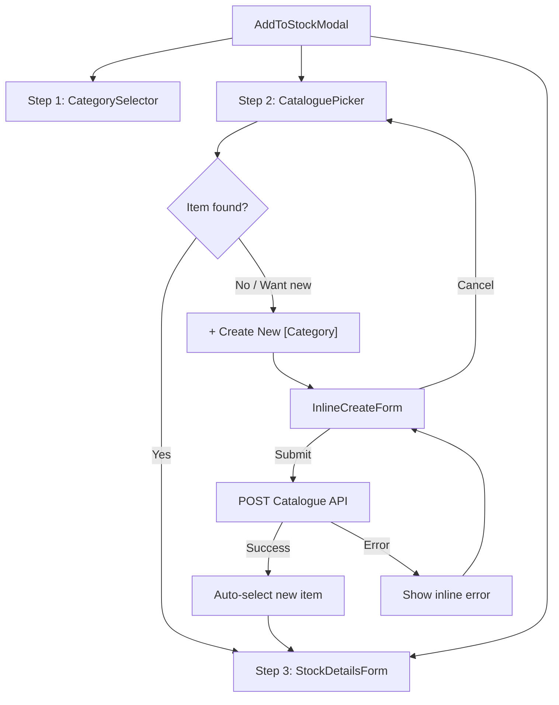
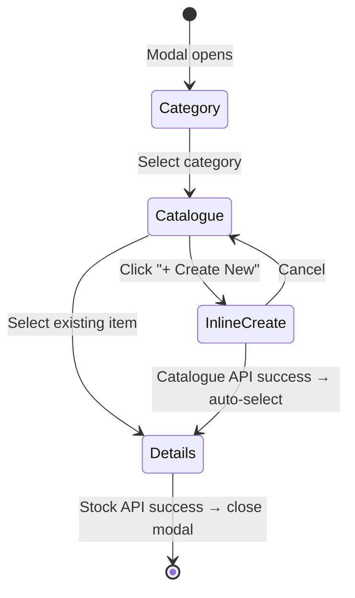

# Design Document: Inline Catalogue from Inventory

## Overview

This feature adds inline catalogue item creation to the existing `AddToStockModal` component. When a user searches the catalogue picker (Step 2) and doesn't find the item they need, they can click a "+ Create New [Category]" button to reveal a compact inline form. This form collects the minimum fields needed to create a catalogue entry, then automatically advances to the stock details step (Step 3) with the new item pre-selected.

The design is purely frontend — no backend changes are required. The inline forms call the same catalogue API endpoints (`POST /api/v1/catalogue/parts`, `POST /api/v1/catalogue/fluids`, `POST /api/v1/catalogue/items`) that the full catalogue pages use. The stock creation then uses the existing `POST /api/v1/inventory/stock-items` endpoint.

### Key Design Decisions

1. **Single new component per category type**: Rather than one monolithic form, we create a small `InlineCreateForm` component that renders category-specific fields based on the selected category. This keeps the AddToStockModal from growing too large.
2. **Reuse existing API client patterns**: All API calls follow the safe-api-consumption steering rules (`?.`, `?? []`, `?? 0`, AbortController cleanup).
3. **No new backend endpoints**: The inline form submits to the same endpoints the full catalogue pages use, ensuring data consistency.
4. **Trade family gating respected**: The "+ Create New" button only appears for categories visible to the user's trade family, using the existing `useTenant()` hook.

## Architecture



### State Flow

The `AddToStockModal` currently manages a `step` state (`'category' | 'catalogue' | 'details'`). The inline create form is rendered as a sub-state within the `'catalogue'` step. A new boolean state `showInlineCreate` controls whether the CataloguePicker or the InlineCreateForm is visible.



## Components and Interfaces

### Modified Component: `AddToStockModal`

Location: `frontend/src/components/inventory/AddToStockModal.tsx`

Changes:
- Add `showInlineCreate` boolean state (default `false`)
- When `showInlineCreate` is true and step is `'catalogue'`, render `InlineCreateForm` instead of `CataloguePicker`
- On successful inline creation, set the selected catalogue item and advance to `'details'` step
- Pass `category` to `InlineCreateForm` so it knows which form fields to render

### Modified Component: `CataloguePicker`

Location: Inside `AddToStockModal.tsx` (currently a local component)

Changes:
- Add `onCreateNew` callback prop
- Render a "+ Create New [Category]" button:
  - Below the results list when results exist
  - In place of the "No active items found" / "No items match your search" empty state messages
- Button label uses the category label from the `CATEGORIES` array (e.g., "Part", "Tyre", "Fluid/Oil")

### New Component: `InlineCreateForm`

Location: `frontend/src/components/inventory/InlineCreateForm.tsx`

```typescript
interface InlineCreateFormProps {
  category: Category                    // 'part' | 'tyre' | 'fluid'
  onSuccess: (item: CatalogueItem) => void  // Called with the newly created catalogue item
  onCancel: () => void                  // Return to CataloguePicker
}
```

This component renders a compact form based on the `category` prop:

**Part fields:**
- name (required, text)
- sell_price_per_unit (required, number)
- gst_mode (required, segmented toggle: inclusive/exclusive/exempt, default "exclusive")
- part_number (optional, text)
- brand (optional, text)
- description (optional, text)

**Tyre fields:**
- name (required, text)
- sell_price_per_unit (required, number)
- gst_mode (required, segmented toggle, default "exclusive")
- tyre_width (optional, text)
- tyre_profile (optional, text)
- tyre_rim_dia (optional, text)
- brand (optional, text)

**Fluid/Oil fields:**
- product_name (required, text)
- sell_price_per_unit (required, number)
- gst_mode (required, segmented toggle, default "exclusive")
- fluid_type (required, toggle: "oil" / "non-oil")
- oil_type (optional, shown when fluid_type is "oil", select dropdown)
- grade (optional, text)
- brand_name (optional, text)

**Service fields** (when category is extended to support services):
- name (required, text)
- default_price (required, number)
- gst_mode (required, segmented toggle, default "exclusive")
- description (optional, text)

### API Mapping

| Category | Endpoint | Key Payload Fields |
|----------|----------|--------------------|
| Part | `POST /api/v1/catalogue/parts` | `{ name, sell_price_per_unit, gst_mode, part_type: "part", part_number?, brand?, description? }` |
| Tyre | `POST /api/v1/catalogue/parts` | `{ name, sell_price_per_unit, gst_mode, part_type: "tyre", tyre_width?, tyre_profile?, tyre_rim_dia?, brand? }` |
| Fluid/Oil | `POST /api/v1/catalogue/fluids` | `{ product_name, sell_price_per_unit, gst_mode, fluid_type, oil_type?, grade?, brand_name? }` |
| Service | `POST /api/v1/catalogue/items` | `{ name, default_price, gst_mode, category: "service", description? }` |

### Response Mapping

After a successful catalogue creation, the API response must be mapped to the `CatalogueItem` interface used by `StockDetailsForm`. The mapping differs per category:

**Parts/Tyres** (from `PartCreateResponse`):
```typescript
{
  id: response.part.id,
  name: response.part.name,
  part_number: response.part.part_number,
  brand: response.part.brand,
  sell_price: response.part.sell_price_per_unit ?? response.part.default_price,
  part_type: response.part.part_type,
  // tyre fields if applicable
}
```

**Fluids** (from fluid create response):
```typescript
{
  id: response.product.id,
  name: response.product.product_name ?? `${response.product.fluid_type}`,
  brand: response.product.brand_name,
  sell_price: response.product.sell_price_per_unit,
  part_type: 'fluid',
  fluid_type: response.product.oil_type ?? response.product.fluid_type,
}
```

**Services** (from `ItemCreateResponse`):
```typescript
{
  id: response.item.id,
  name: response.item.name,
  sell_price: response.item.default_price,
  part_type: 'service',
}
```

## Data Models

No new database models or migrations are required. The feature uses existing models:

### Existing Models Used

- `PartsCatalogue` — stores parts and tyres (distinguished by `part_type` column)
- `FluidOilProduct` — stores fluid/oil products
- `ItemsCatalogue` — stores services/items
- `StockItem` — links a catalogue entry to inventory with quantity tracking
- `StockMovement` — audit trail for stock changes

### Frontend State Model

New state added to `AddToStockModal`:

```typescript
// Inside AddToStockModal component
const [showInlineCreate, setShowInlineCreate] = useState(false)
```

The `InlineCreateForm` manages its own local form state internally, similar to how the existing catalogue page forms work. On successful submission, it calls `onSuccess(catalogueItem)` which triggers the parent to:
1. Set `showInlineCreate = false`
2. Set the selected catalogue item
3. Advance to step `'details'`

### Form Validation Rules

| Field | Rule |
|-------|------|
| name / product_name | Required, non-empty after trim |
| sell_price_per_unit / default_price | Required, must be a valid positive number |
| gst_mode | Required, must be one of: "inclusive", "exclusive", "exempt" |
| fluid_type | Required for fluids, must be "oil" or "non-oil" |
| All optional fields | Sent as `null` if empty |


## Correctness Properties

*A property is a characteristic or behavior that should hold true across all valid executions of a system — essentially, a formal statement about what the system should do. Properties serve as the bridge between human-readable specifications and machine-verifiable correctness guarantees.*

### Property 1: Category-to-API endpoint and type mapping

*For any* category in {part, tyre, fluid, service}, when the InlineCreateForm is submitted with valid data, the resulting API request SHALL target the correct endpoint and include the correct type discriminator field (`part_type: "part"`, `part_type: "tyre"`, fluid endpoint for fluids, items endpoint for services).

**Validates: Requirements 2.3, 3.2, 4.2, 5.2**

### Property 2: API error detail propagation

*For any* category and *for any* API error response containing a `detail` field, the InlineCreateForm SHALL display that exact detail string to the user without modification.

**Validates: Requirements 2.4, 3.3, 4.3, 5.3, 10.2**

### Property 3: Trade family gating of create button

*For any* trade family value and *for any* category, the "+ Create New [Category]" button SHALL be visible if and only if that category is included in the set of categories visible to the user's trade family (i.e., tyres and fluids are only visible for `automotive-transport`).

**Validates: Requirements 1.4**

### Property 4: Create button and banner label matches category

*For any* selected category, the "+ Create New [Category]" button text and the "Quick-create a new [Category] catalogue item" banner text SHALL both contain the human-readable label for that category (e.g., "Part", "Tyre", "Fluid/Oil", "Service").

**Validates: Requirements 1.1, 8.1**

### Property 5: Successful inline creation advances to stock details

*For any* category and *for any* valid catalogue creation API response, the AddToStockModal SHALL transition to the stock details step with the newly created item's ID set as the selected catalogue item.

**Validates: Requirements 6.1**

### Property 6: Inline-created item populates stock form identically

*For any* catalogue item created via the InlineCreateForm, the data passed to StockDetailsForm (name, sell_price, brand, etc.) SHALL be equivalent to the data that would be passed if the same item were selected from the CataloguePicker list.

**Validates: Requirements 6.2**

### Property 7: Form validation rejects missing required fields

*For any* category and *for any* form submission where at least one required field (name/product_name, sell_price_per_unit/default_price, gst_mode) is empty or invalid, the InlineCreateForm SHALL prevent submission and display a validation error.

**Validates: Requirements 2.1, 3.1, 4.1, 5.1**

## Error Handling

### Catalogue API Errors

| Error Type | Handling |
|------------|----------|
| Network error (no response) | Display "Failed to create [category]. Please check your connection and try again." Form remains open and editable. |
| Validation error (400/422) | Extract `detail` from response body and display inline. Form remains open with user's input preserved. |
| Duplicate name (400 with detail) | Display the specific API error message (e.g., "Part with this name already exists"). |
| Auth error (401/403) | Display "Session expired. Please refresh and try again." (unlikely during normal flow). |

### Stock API Errors (Step 3)

Stock API error handling is unchanged from the existing flow. If the stock creation fails after a successful inline catalogue creation:
- The error is displayed in the stock details form
- The user can retry
- The catalogue item already exists and is not rolled back

### Double-Submission Prevention

The submit button is disabled and shows a loading spinner while the API request is in flight. The `saving` state boolean controls this:

```typescript
const [saving, setSaving] = useState(false)

// On submit:
setSaving(true)
try {
  const res = await apiClient.post(endpoint, payload)
  onSuccess(mapResponseToCatalogueItem(res.data))
} catch (err) {
  setFormError(err?.response?.data?.detail ?? 'Failed to create item.')
} finally {
  setSaving(false)
}
```

### Modal Close During Submission

If the user closes the modal while a catalogue API request is in flight, the request completes server-side (the catalogue item is created). This is acceptable per Requirement 10.3 — the item will appear in the full catalogue pages.

## Testing Strategy

### Unit Tests

Unit tests cover specific examples and edge cases:

- Rendering the correct fields for each category (part, tyre, fluid, service)
- The "+ Create New" button appears below results and replaces empty state
- The "+ Create New" button is hidden when no category is selected
- Cancel button returns to CataloguePicker without API calls
- Loading state disables submit button
- Successful creation advances to stock details step
- Network error displays generic message
- Validation error displays specific API detail
- Existing three-step flow still works when selecting an existing item
- Trade family gating hides button for non-automotive categories

### Property-Based Tests

Property-based tests use `fast-check` (the project's frontend already uses Hypothesis for Python; `fast-check` is the TypeScript equivalent for property-based testing).

Each property test runs a minimum of 100 iterations.

**Test configuration:**
- Library: `fast-check` (npm package `fast-check`)
- Framework: Vitest (already used in the project)
- Minimum iterations: 100 per property

**Property tests to implement:**

1. **Feature: inline-catalogue-from-inventory, Property 1: Category-to-API endpoint mapping**
   - Generate random valid form data for each category
   - Verify the constructed endpoint URL and payload type discriminator match the category

2. **Feature: inline-catalogue-from-inventory, Property 2: API error detail propagation**
   - Generate random error detail strings
   - Verify the form displays the exact string from the API response

3. **Feature: inline-catalogue-from-inventory, Property 3: Trade family gating**
   - Generate random trade family values and category combinations
   - Verify button visibility matches the gating rules

4. **Feature: inline-catalogue-from-inventory, Property 4: Category label mapping**
   - Generate random categories
   - Verify button text and banner text contain the correct human-readable label

5. **Feature: inline-catalogue-from-inventory, Property 5: Successful creation state transition**
   - Generate random valid API responses per category
   - Verify the modal transitions to stock details with the correct item ID

6. **Feature: inline-catalogue-from-inventory, Property 6: Response-to-CatalogueItem mapping consistency**
   - Generate random catalogue API responses
   - Verify the mapped CatalogueItem has the same fields regardless of creation path

7. **Feature: inline-catalogue-from-inventory, Property 7: Required field validation**
   - Generate random form states with at least one required field missing/invalid
   - Verify submission is blocked and an error is shown

### Test File Structure

```
tests/
  frontend/
    InlineCreateForm.test.tsx        # Unit tests for form rendering and behavior
    InlineCreateForm.property.test.ts # Property-based tests using fast-check
```
