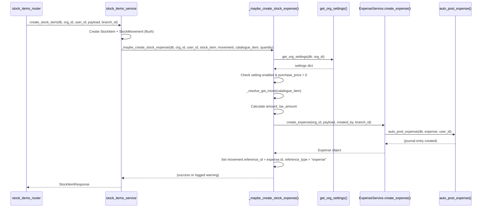

# Inventory Expense Auto-Entry — Design

## Overview

This feature adds automatic expense creation as a side-effect of stock item creation and positive stock adjustments. When a stock item has a `purchase_price > 0` and the org setting `auto_expense_on_stock_purchase` is enabled (default: true), the system creates an `Expense` record via the existing `ExpenseService.create_expense()` method. This expense automatically flows into the ledger (via `auto_post_expense`), cash flow dashboard, expense reports, and Xero sync — no changes to downstream systems are needed.

The design introduces:
1. A shared helper function `_maybe_create_stock_expense()` that encapsulates all auto-expense logic
2. A reusable `_resolve_gst_mode()` helper extracted from `list_stock_items()`
3. Integration points in `create_stock_item()` and `adjust_stock_item()`
4. Modification to `delete_stock_item()` to flag orphaned expenses
5. Branch context propagation into stock item creation
6. A new org settings key with frontend toggle

### Design Rationale

- **Single helper function**: All expense creation logic lives in one place (`_maybe_create_stock_expense`), called from both `create_stock_item` and `adjust_stock_item`. This avoids duplication and makes the logic testable in isolation.
- **Try/except resilience**: The helper wraps expense creation in try/except so that failures (DB errors, ledger posting issues) never block the parent stock operation.
- **Same-transaction semantics**: The expense is created with `db.flush()` (not commit) within the same request transaction, ensuring atomicity when both succeed.
- **Opt-out default**: The setting defaults to `True` when absent, so existing orgs get the feature immediately without migration.

## Architecture



## Components and Interfaces

### 1. `_resolve_gst_mode(catalogue_item) -> str`

**Location**: `app/modules/inventory/stock_items_service.py` (module-level helper)

Extracted from the inline logic in `list_stock_items()`. Pure function that determines the GST mode from a catalogue item's fields.

```python
def _resolve_gst_mode(catalogue_item) -> str:
    """Resolve GST mode from a catalogue item (PartsCatalogue or FluidOilProduct).
    
    Priority:
    1. catalogue_item.gst_mode (if explicitly set)
    2. catalogue_item.is_gst_exempt → "exempt"
    3. catalogue_item.gst_inclusive → "inclusive"
    4. Default → "exclusive"
    """
    gst_mode = getattr(catalogue_item, "gst_mode", None)
    if gst_mode is not None:
        return gst_mode
    if getattr(catalogue_item, "is_gst_exempt", False):
        return "exempt"
    if getattr(catalogue_item, "gst_inclusive", False):
        return "inclusive"
    return "exclusive"
```

### 2. `_calculate_tax_amount(amount: Decimal, gst_mode: str) -> tuple[Decimal, bool]`

**Location**: `app/modules/inventory/stock_items_service.py` (module-level helper)

Pure function that calculates tax amount and tax_inclusive flag based on GST mode.

```python
from decimal import Decimal, ROUND_HALF_UP

def _calculate_tax_amount(amount: Decimal, gst_mode: str) -> tuple[Decimal, bool]:
    """Calculate tax_amount and tax_inclusive flag for a given amount and GST mode.
    
    Returns: (tax_amount, tax_inclusive)
    - "inclusive": tax_amount = amount × 3 / 23, tax_inclusive = True
    - "exclusive": tax_amount = amount × 0.15, tax_inclusive = False
    - "exempt": tax_amount = 0, tax_inclusive = False
    """
    two_dp = Decimal("0.01")
    if gst_mode == "inclusive":
        tax = (amount * Decimal("3") / Decimal("23")).quantize(two_dp, rounding=ROUND_HALF_UP)
        return tax, True
    elif gst_mode == "exclusive":
        tax = (amount * Decimal("0.15")).quantize(two_dp, rounding=ROUND_HALF_UP)
        return tax, False
    else:  # exempt
        return Decimal("0"), False
```

### 3. `_maybe_create_stock_expense(...)` — Core Helper

**Location**: `app/modules/inventory/stock_items_service.py` (module-level async helper)

This is the main orchestration function. It is called after the stock item and movement are flushed.

```python
async def _maybe_create_stock_expense(
    db: AsyncSession,
    *,
    org_id: uuid.UUID,
    user_id: uuid.UUID,
    stock_item: StockItem,
    movement: StockMovement,
    catalogue_item,  # PartsCatalogue | FluidOilProduct
    quantity: Decimal,
    description: str,
) -> None:
    """Create an auto-expense for a stock purchase/adjustment if conditions are met.
    
    Conditions:
    1. stock_item.purchase_price is not None and > 0
    2. org setting auto_expense_on_stock_purchase is True (or absent → default True)
    3. movement.reference_id is not already set (idempotency guard)
    
    On failure: logs warning, does NOT raise.
    """
```

**Logic flow:**
1. Check `movement.reference_id` — if already set, return (idempotency)
2. Check `stock_item.purchase_price` — if None or ≤ 0, return
3. Fetch org settings, check `auto_expense_on_stock_purchase` (default True if absent)
4. Resolve GST mode via `_resolve_gst_mode(catalogue_item)`
5. Calculate `amount = stock_item.purchase_price × quantity`
6. Calculate `tax_amount, tax_inclusive = _calculate_tax_amount(amount, gst_mode)`
7. Build `ExpenseCreate` payload
8. Call `ExpenseService(db).create_expense(org_id, payload, created_by=user_id, branch_id=stock_item.branch_id)`
9. Set `movement.reference_id = expense.id`, `movement.reference_type = "expense"`
10. `await db.flush()`
11. Wrap steps 3–10 in try/except, log warning on failure

### 4. Modified `create_stock_item()`

**Changes:**
- Accept new optional parameter: `branch_id: uuid.UUID | None = None`
- Set `stock_item.branch_id = branch_id` on the StockItem
- After creating the StockMovement and flushing, call `_maybe_create_stock_expense()`
- Resolve catalogue item name for the description: `"Inventory purchase: {qty}x {item_name}"`

### 5. Modified `adjust_stock_item()`

**Changes:**
- After creating the adjustment StockMovement and flushing, if `payload.quantity_change > 0`:
  - Load the catalogue item (needed for GST resolution)
  - Resolve item name for description: `"Stock adjustment: +{qty}x {item_name}"`
  - Call `_maybe_create_stock_expense()`

### 6. Modified `delete_stock_item()`

**Changes:**
- Before deleting, query `StockMovement` rows where `stock_item_id = stock_item.id AND reference_type = 'expense' AND reference_id IS NOT NULL`
- For each such movement, load the `Expense` by `id = movement.reference_id`
- Append `" [Stock item deleted]"` to the expense's `notes` field
- Flush, then proceed with deletion

### 7. Modified `stock_items_router.py`

**Changes to `create_stock_item_endpoint()`:**
- Extract `branch_id` from `getattr(request.state, "branch_id", None)` (matching existing pattern in quotes, invoices, job_cards routers)
- Pass `branch_id` to `create_stock_item()`

### 8. Org Settings Addition

**`app/modules/organisations/service.py`:**
- Add `"auto_expense_on_stock_purchase"` to `SETTINGS_JSONB_KEYS` set

**`app/modules/organisations/schemas.py`:**
- Add field to `OrgSettingsResponse`: `auto_expense_on_stock_purchase: Optional[bool] = Field(None, ...)`
- Add field to `OrgSettingsUpdateRequest`: `auto_expense_on_stock_purchase: Optional[bool] = Field(None, ...)`

### 9. Frontend Settings Toggle

**Location**: Existing Settings page (Inventory or Expenses section)

A simple boolean toggle using the existing `PUT /api/v1/org/settings` endpoint:
```
auto_expense_on_stock_purchase: true | false
```

Label: "Automatically create expense when adding stock"
Description: "When enabled, adding stock items or positive adjustments with a purchase price will automatically create an expense entry."

## Data Models

### Expense Record (auto-created)

| Field | Value | Source |
|-------|-------|--------|
| `org_id` | Stock item's org_id | StockItem.org_id |
| `date` | `date.today()` | System clock |
| `description` | `"Inventory purchase: {qty}x {name}"` or `"Stock adjustment: +{qty}x {name}"` | Computed |
| `amount` | `purchase_price × quantity` | StockItem.purchase_price × quantity |
| `tax_amount` | Calculated per GST mode | `_calculate_tax_amount()` |
| `tax_inclusive` | `True` if inclusive, else `False` | GST mode |
| `category` | `"materials"` | Constant |
| `reference_number` | `"SM:{movement.id}"` | StockMovement.id |
| `notes` | `"Auto-created for stock item: {name} (id: {stock_item.id})"` | Computed |
| `expense_type` | `"expense"` | Constant |
| `created_by` | `user_id` from router | Request context |
| `branch_id` | `stock_item.branch_id` | StockItem.branch_id |

### StockMovement Update (after expense creation)

| Field | Value |
|-------|-------|
| `reference_type` | `"expense"` |
| `reference_id` | `expense.id` (UUID) |

### Organisation Settings (JSONB)

| Key | Type | Default | Description |
|-----|------|---------|-------------|
| `auto_expense_on_stock_purchase` | `bool \| null` | `True` (when absent) | Controls whether stock purchases auto-create expenses |

## Correctness Properties

*A property is a characteristic or behavior that should hold true across all valid executions of a system — essentially, a formal statement about what the system should do. Properties serve as the bridge between human-readable specifications and machine-verifiable correctness guarantees.*

### Property 1: Expense Amount Correctness

*For any* stock operation (creation with quantity Q or positive adjustment with quantity_change Q) where the stock item has a purchase_price P > 0 and the org setting is enabled, the auto-created expense SHALL have `amount == P × Q`.

**Validates: Requirements 1.1, 2.1**

### Property 2: GST Calculation Correctness

*For any* positive amount A and GST mode M in {"inclusive", "exclusive", "exempt"}, the `_calculate_tax_amount(A, M)` function SHALL return:
- M="inclusive": `tax_amount == round(A × 3 / 23, 2)` with ROUND_HALF_UP, `tax_inclusive == True`
- M="exclusive": `tax_amount == round(A × 0.15, 2)` with ROUND_HALF_UP, `tax_inclusive == False`
- M="exempt": `tax_amount == 0`, `tax_inclusive == False`

**Validates: Requirements 5.1, 5.2, 5.3, 5.5**

### Property 3: GST Mode Resolution

*For any* catalogue item with fields `gst_mode`, `is_gst_exempt`, and `gst_inclusive`, the `_resolve_gst_mode()` function SHALL return:
- `gst_mode` if it is not None
- `"exempt"` if `is_gst_exempt` is True (and gst_mode is None)
- `"inclusive"` if `gst_inclusive` is True (and gst_mode is None, is_gst_exempt is False)
- `"exclusive"` otherwise

**Validates: Requirements 5.4**

### Property 4: Bidirectional Traceability

*For any* auto-created expense, the expense's `reference_number` SHALL equal `f"SM:{movement.id}"`, the expense's `created_by` SHALL equal the `user_id` parameter, and the movement's `reference_id` SHALL equal the expense's `id` with `reference_type == "expense"`.

**Validates: Requirements 3.1, 3.2, 3.3, 9.1**

### Property 5: Branch Inheritance

*For any* stock item created with a `branch_id` value B (including None), both the `StockItem.branch_id` and the auto-created expense's `branch_id` SHALL equal B.

**Validates: Requirements 4.1, 4.2, 11.3, 11.4**

### Property 6: Opt-Out Setting Disables Expense Creation

*For any* stock operation (creation or positive adjustment) where the org setting `auto_expense_on_stock_purchase` is explicitly `False`, no expense SHALL be created regardless of purchase_price or quantity values.

**Validates: Requirements 6.3, 6.4**

### Property 7: Resilience — Expense Failure Does Not Fail Parent Operation

*For any* stock operation where `ExpenseService.create_expense()` raises an exception, the parent operation (create_stock_item or adjust_stock_item) SHALL still complete successfully — the stock item and movement are committed.

**Validates: Requirements 1.8, 2.5**

### Property 8: Deletion Flags Linked Expenses

*For any* stock item with N linked expenses (via movements with `reference_type='expense'`), calling `delete_stock_item()` SHALL append `" [Stock item deleted]"` to each linked expense's `notes` field without deleting the expense records.

**Validates: Requirements 8.1, 8.2, 8.3, 8.4**

### Property 9: Idempotency — No Duplicate Expense

*For any* stock movement where `reference_id` is already set (non-null), calling `_maybe_create_stock_expense()` SHALL not create a new expense and SHALL not modify the existing `reference_id`.

**Validates: Requirements 10.2**

## Error Handling

| Scenario | Handling | Impact |
|----------|----------|--------|
| `ExpenseService.create_expense()` raises DB error | Caught by try/except in `_maybe_create_stock_expense()`, logged as warning | Stock item/movement still committed |
| `auto_post_expense()` fails (missing chart of accounts) | Already handled inside `create_expense()` — logs warning, expense still created | Expense exists but no journal entry |
| Catalogue item not found during adjustment expense | Caught by try/except, logged | Adjustment succeeds, no expense |
| `get_org_settings()` fails | Caught by try/except, defaults to creating expense (fail-open) | Expense created as if setting=True |
| Branch validation fails in `create_expense()` | Caught by outer try/except | Stock item created, no expense |

**Design decision**: The helper is fail-open for settings lookup failures (defaults to creating the expense) because the feature is opt-out. If we can't determine the setting, it's safer to create the expense than to silently skip it.

## Testing Strategy

### Property-Based Tests (Hypothesis)

The feature's core logic is well-suited for property-based testing because:
- Pure calculation functions (`_calculate_tax_amount`, `_resolve_gst_mode`) have clear input/output behavior
- The auto-expense helper has universal properties that hold across all valid inputs
- The input space is large (arbitrary prices, quantities, GST modes, branch IDs)

**Library**: Hypothesis (already used in the project — `.hypothesis/` directory exists)

**Configuration**: Minimum 100 iterations per property test (`@settings(max_examples=100)`)

**Tag format**: `# Feature: inventory-expense-auto-entry, Property {N}: {title}`

Properties to implement as PBT:
1. **Property 1**: Expense amount = purchase_price × quantity (generate random Decimals for price/qty)
2. **Property 2**: GST calculation correctness (generate random amounts × 3 GST modes)
3. **Property 3**: GST mode resolution (generate random catalogue item field combinations)
4. **Property 4**: Bidirectional traceability links (generate random UUIDs, verify format)
5. **Property 5**: Branch inheritance (generate random branch_id including None)
6. **Property 6**: Opt-out disables creation (generate random operations with setting=False)
7. **Property 7**: Resilience (generate random exceptions, verify parent succeeds)
8. **Property 8**: Deletion flags expenses (generate stock items with 0–N linked expenses)
9. **Property 9**: Idempotency (generate movements with pre-set reference_id)

### Unit Tests (pytest)

- Specific examples for description format strings
- Edge cases: zero purchase_price, null purchase_price, negative quantity_change
- Settings key presence in `SETTINGS_JSONB_KEYS`
- Schema field presence on `OrgSettingsResponse` and `OrgSettingsUpdateRequest`
- `date.today()` is used for expense date

### Integration Tests

- Full flow: create stock item → verify expense in DB → verify movement links
- Full flow: adjust stock item → verify expense in DB
- Delete stock item → verify expense notes updated
- Settings toggle: disable → create stock item → verify no expense
- Branch context propagation from router through to expense

### Frontend Tests

- Settings toggle renders and calls PUT endpoint
- Toggle state reflects GET response
