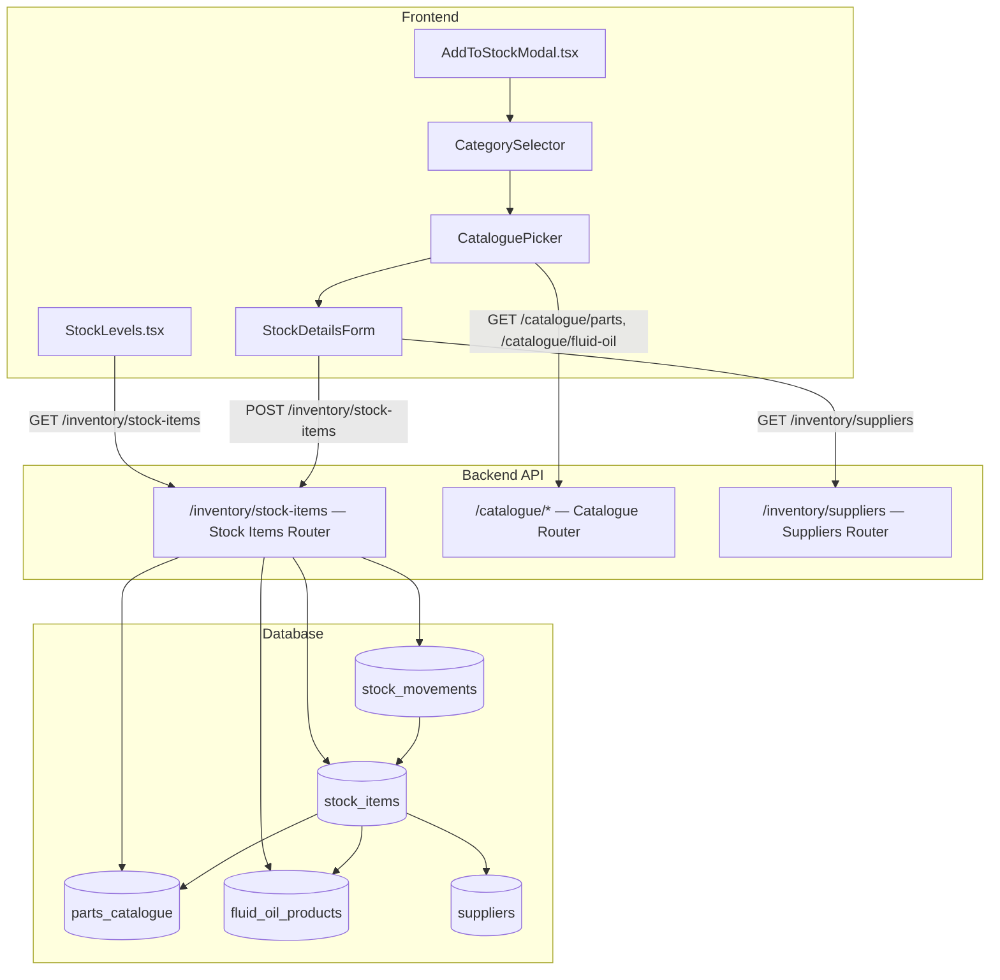
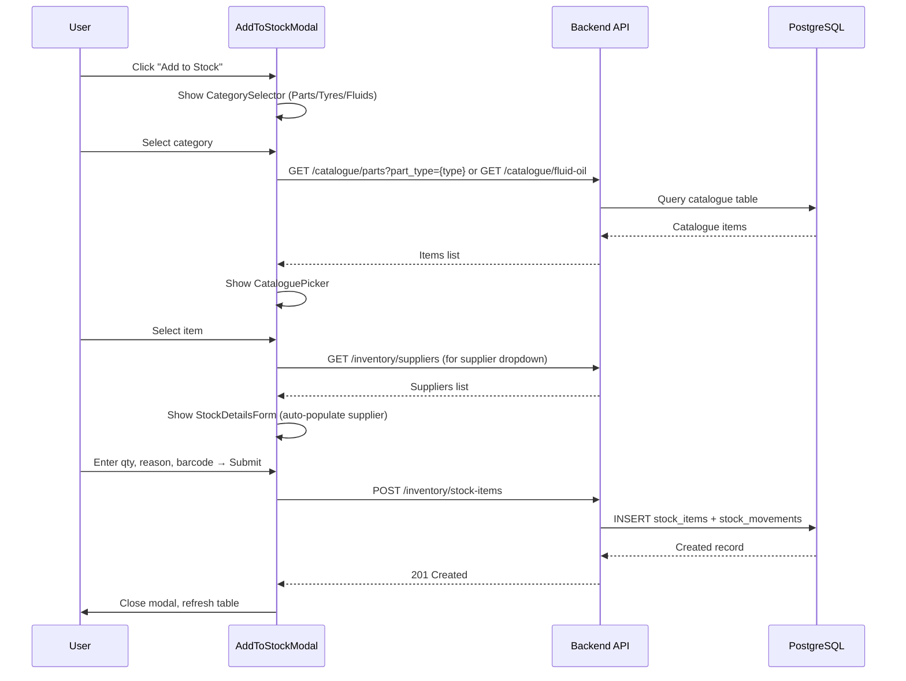

# Design Document: Inventory Stock Management

## Overview

This feature introduces a clear separation between the catalogue (product database) and inventory (explicitly stocked items). Currently, the Stock Levels page queries `parts_catalogue` and `fluid_oil_products` directly, causing packaging quantities to appear as stock levels. The redesign introduces a dedicated `stock_items` table that acts as the single source of truth for inventory. Users explicitly add catalogue items to inventory via a multi-step "Add to Stock" modal, and the Stock Levels page only displays these explicitly tracked items.

### Key Design Decisions

1. **Single `stock_items` table** — Rather than maintaining separate stock tracking per catalogue type, a single polymorphic table references catalogue items by `catalogue_item_id` + `catalogue_type` enum. This simplifies queries, avoids table proliferation, and makes the Stock Levels API a single-table scan with joins.

2. **Catalogue type enum** — `catalogue_type` is constrained to `'part' | 'tyre' | 'fluid'`. Parts and tyres both live in `parts_catalogue` (distinguished by `part_type`), while fluids live in `fluid_oil_products`. The enum maps to the correct source table at query time.

3. **Stock movements reuse** — The existing `stock_movements` table is reused for audit trails. A new `stock_item_id` FK column is added to link movements to the new `stock_items` table, while the existing `product_id` column remains for backward compatibility.

4. **Supplier override** — `stock_items` carries an optional `supplier_id` that defaults to the catalogue item's supplier but can be overridden by the user during the Add to Stock flow.

## Architecture



### Request Flow: Add to Stock



## Components and Interfaces

### Backend Components

#### 1. Stock Items Router (`app/modules/inventory/stock_items_router.py`)

New router mounted at `/inventory/stock-items` with endpoints:

| Method | Path | Description |
|--------|------|-------------|
| `GET` | `/inventory/stock-items` | List all stock items (replaces old stock/report) |
| `POST` | `/inventory/stock-items` | Create a stock item from a catalogue item |
| `PUT` | `/inventory/stock-items/{id}` | Update stock item (barcode, supplier, thresholds) |
| `DELETE` | `/inventory/stock-items/{id}` | Remove item from inventory |

#### 2. Stock Items Service (`app/modules/inventory/stock_items_service.py`)

Business logic layer:

- `list_stock_items(db, org_id, search, below_threshold_only, limit, offset)` — Queries `stock_items` joined to catalogue tables for display names, part numbers, brands. Supports search by name, part number, brand, and barcode.
- `create_stock_item(db, org_id, user_id, payload)` — Validates catalogue item exists and is active, checks uniqueness constraint, creates `stock_items` row + initial `stock_movements` audit record.
- `update_stock_item(db, org_id, stock_item_id, payload)` — Updates barcode, supplier override, thresholds.
- `delete_stock_item(db, org_id, stock_item_id)` — Soft-deletes or hard-deletes the stock item.

#### 3. Stock Items Schemas (`app/modules/inventory/stock_items_schemas.py`)

Pydantic request/response models:

- `CreateStockItemRequest` — `catalogue_item_id`, `catalogue_type`, `quantity`, `reason`, `barcode?`, `supplier_id?`
- `UpdateStockItemRequest` — `barcode?`, `supplier_id?`, `min_threshold?`, `reorder_quantity?`
- `StockItemResponse` — Full stock item with joined catalogue fields
- `StockItemListResponse` — Paginated list with `total`

### Frontend Components

#### 1. AddToStockModal (`frontend/src/components/inventory/AddToStockModal.tsx`)

Multi-step modal with three steps:

- **Step 1 — CategorySelector**: Three cards (Parts, Tyres, Fluids/Oils) with icons. Clicking advances to step 2.
- **Step 2 — CataloguePicker**: Searchable list filtered by selected category. Shows "already in stock" badge for items that have a `stock_items` record. Empty state suggests adding items to catalogue first.
- **Step 3 — StockDetailsForm**: Quantity (required, > 0), reason dropdown, barcode (optional), supplier (auto-populated from catalogue item, editable).

#### 2. Updated StockLevels.tsx

- Adds "Add to Stock" button in header
- Replaces dual API calls (`/inventory/stock/report` + `/inventory/fluid-stock`) with single `GET /inventory/stock-items`
- Adds barcode column to the table
- Adds barcode to search filter


## Data Models

### New Table: `stock_items`

```sql
CREATE TABLE stock_items (
    id              UUID PRIMARY KEY DEFAULT gen_random_uuid(),
    org_id          UUID NOT NULL REFERENCES organisations(id),
    catalogue_item_id UUID NOT NULL,
    catalogue_type  VARCHAR(10) NOT NULL CHECK (catalogue_type IN ('part', 'tyre', 'fluid')),
    current_quantity NUMERIC(12, 3) NOT NULL DEFAULT 0,
    min_threshold   NUMERIC(12, 3) NOT NULL DEFAULT 0,
    reorder_quantity NUMERIC(12, 3) NOT NULL DEFAULT 0,
    supplier_id     UUID REFERENCES suppliers(id),
    barcode         VARCHAR(255),
    created_by      UUID REFERENCES users(id),
    created_at      TIMESTAMPTZ NOT NULL DEFAULT now(),
    updated_at      TIMESTAMPTZ NOT NULL DEFAULT now(),

    CONSTRAINT uq_stock_items_org_catalogue UNIQUE (org_id, catalogue_item_id, catalogue_type)
);

CREATE INDEX idx_stock_items_org ON stock_items(org_id);
CREATE INDEX idx_stock_items_barcode ON stock_items(barcode) WHERE barcode IS NOT NULL;
```

### SQLAlchemy Model: `StockItem`

```python
class StockItem(Base):
    __tablename__ = "stock_items"

    id: Mapped[uuid.UUID] = mapped_column(UUID(as_uuid=True), primary_key=True, default=uuid.uuid4)
    org_id: Mapped[uuid.UUID] = mapped_column(UUID(as_uuid=True), ForeignKey("organisations.id"), nullable=False)
    catalogue_item_id: Mapped[uuid.UUID] = mapped_column(UUID(as_uuid=True), nullable=False)
    catalogue_type: Mapped[str] = mapped_column(String(10), nullable=False)  # 'part', 'tyre', 'fluid'
    current_quantity: Mapped[Decimal] = mapped_column(Numeric(12, 3), nullable=False, server_default="0")
    min_threshold: Mapped[Decimal] = mapped_column(Numeric(12, 3), nullable=False, server_default="0")
    reorder_quantity: Mapped[Decimal] = mapped_column(Numeric(12, 3), nullable=False, server_default="0")
    supplier_id: Mapped[uuid.UUID | None] = mapped_column(UUID(as_uuid=True), ForeignKey("suppliers.id"), nullable=True)
    barcode: Mapped[str | None] = mapped_column(String(255), nullable=True)
    created_by: Mapped[uuid.UUID | None] = mapped_column(UUID(as_uuid=True), ForeignKey("users.id"), nullable=True)
    created_at: Mapped[datetime] = mapped_column(DateTime(timezone=True), server_default=func.now(), nullable=False)
    updated_at: Mapped[datetime] = mapped_column(DateTime(timezone=True), server_default=func.now(), onupdate=func.now(), nullable=False)

    __table_args__ = (
        UniqueConstraint("org_id", "catalogue_item_id", "catalogue_type", name="uq_stock_items_org_catalogue"),
        CheckConstraint("catalogue_type IN ('part', 'tyre', 'fluid')", name="ck_stock_items_catalogue_type"),
    )
```

### Modified Table: `stock_movements`

Add a nullable `stock_item_id` FK to link movements to the new `stock_items` table:

```sql
ALTER TABLE stock_movements ADD COLUMN stock_item_id UUID REFERENCES stock_items(id);
CREATE INDEX idx_stock_movements_stock_item ON stock_movements(stock_item_id) WHERE stock_item_id IS NOT NULL;
```

### Pydantic Schemas

```python
class CreateStockItemRequest(BaseModel):
    catalogue_item_id: uuid.UUID
    catalogue_type: Literal["part", "tyre", "fluid"]
    quantity: float = Field(..., gt=0)
    reason: str = Field(..., min_length=1, max_length=500)
    barcode: str | None = Field(None, max_length=255)
    supplier_id: uuid.UUID | None = None

class UpdateStockItemRequest(BaseModel):
    barcode: str | None = None
    supplier_id: uuid.UUID | None = None
    min_threshold: float | None = Field(None, ge=0)
    reorder_quantity: float | None = Field(None, ge=0)

class StockItemResponse(BaseModel):
    id: str
    catalogue_item_id: str
    catalogue_type: str
    item_name: str
    part_number: str | None
    brand: str | None
    current_quantity: float
    min_threshold: float
    reorder_quantity: float
    is_below_threshold: bool
    supplier_id: str | None
    supplier_name: str | None
    barcode: str | None
    created_at: str

class StockItemListResponse(BaseModel):
    stock_items: list[StockItemResponse]
    total: int
```

### Catalogue Type Resolution

The `catalogue_type` field maps to source tables as follows:

| `catalogue_type` | Source Table | Filter |
|---|---|---|
| `part` | `parts_catalogue` | `part_type = 'part'` |
| `tyre` | `parts_catalogue` | `part_type = 'tyre'` |
| `fluid` | `fluid_oil_products` | — |

The service layer resolves the correct table at query time using a helper:

```python
def _resolve_catalogue_query(catalogue_type: str, catalogue_item_id: uuid.UUID):
    if catalogue_type in ("part", "tyre"):
        return select(PartsCatalogue).where(
            PartsCatalogue.id == catalogue_item_id,
            PartsCatalogue.is_active.is_(True),
        )
    elif catalogue_type == "fluid":
        return select(FluidOilProduct).where(
            FluidOilProduct.id == catalogue_item_id,
            FluidOilProduct.is_active.is_(True),
        )
```

## Correctness Properties

*A property is a characteristic or behavior that should hold true across all valid executions of a system — essentially, a formal statement about what the system should do. Properties serve as the bridge between human-readable specifications and machine-verifiable correctness guarantees.*

### Property 1: Stock Items List Exclusivity

*For any* organisation with a set of catalogue items and a subset that have been added to `stock_items`, the stock items list API should return exactly and only the items present in the `stock_items` table — no catalogue-only items should appear.

**Validates: Requirements 1.1, 1.2, 1.4, 9.1**

### Property 2: Response Data Correctness

*For any* stock item returned by the API, the `current_quantity` field should equal the `stock_items.current_quantity` value (not the catalogue's `qty_per_pack`, `total_volume`, or `current_stock`), the `item_name`/`part_number`/`brand` fields should match the joined catalogue record, and the `barcode` field should match the `stock_items.barcode` value.

**Validates: Requirements 1.3, 9.3, 9.4, 7.2**

### Property 3: Below-Threshold Flag Correctness

*For any* stock item, `is_below_threshold` should be `true` if and only if `current_quantity <= min_threshold` and `min_threshold > 0`.

**Validates: Requirements 9.5**

### Property 4: Category Filtering

*For any* category selection (part, tyre, or fluid), the catalogue picker should return only active items whose type matches the selected category — parts from `parts_catalogue` where `part_type='part'`, tyres from `parts_catalogue` where `part_type='tyre'`, and fluids from `fluid_oil_products`.

**Validates: Requirements 3.3, 4.1**

### Property 5: Multi-Field Search

*For any* search query string `q` and any stock item, the item should appear in search results if and only if `q` is a case-insensitive substring of at least one of: item name, part number, brand, description, or barcode.

**Validates: Requirements 4.2, 7.3**

### Property 6: Already-In-Stock Indicator

*For any* catalogue item displayed in the catalogue picker, the "already in stock" flag should be `true` if and only if a `stock_items` record exists for that catalogue item in the current organisation.

**Validates: Requirements 4.5**

### Property 7: Creation Produces Stock Item and Movement

*For any* valid creation request (existing active catalogue item, quantity > 0, non-empty reason), the system should create exactly one `stock_items` record with the correct fields AND exactly one `stock_movements` record with the initial quantity and reason linked to the new stock item.

**Validates: Requirements 5.5, 5.6, 10.1, 10.2**

### Property 8: Creation Input Validation

*For any* creation request where quantity ≤ 0 OR reason is empty/missing, the API should reject the request with a validation error and no `stock_items` or `stock_movements` records should be created.

**Validates: Requirements 5.2, 5.3, 10.5**

### Property 9: Uniqueness Constraint

*For any* organisation and catalogue item that already has a `stock_items` record, attempting to create a second `stock_items` record for the same catalogue item and organisation should return an error, and the existing record should remain unchanged.

**Validates: Requirements 8.4, 10.3**

### Property 10: Invalid Catalogue Item Rejection

*For any* creation request referencing a `catalogue_item_id` that does not exist or references an inactive catalogue item, the API should return an error and no records should be created.

**Validates: Requirements 10.4**

### Property 11: Supplier Resolution from Catalogue

*For any* catalogue item with an associated `supplier_id`, when a stock item is created without an explicit `supplier_id` in the request, the created `stock_items` record should have its `supplier_id` set to the catalogue item's supplier. *For any* catalogue item without a supplier, the `supplier_id` should be null unless explicitly provided.

**Validates: Requirements 6.1, 6.4**

### Property 12: Barcode Update Round-Trip

*For any* stock item and any valid barcode string, updating the barcode via the update endpoint and then retrieving the stock item should return the same barcode value.

**Validates: Requirements 7.4**

## Error Handling

| Scenario | HTTP Status | Error Response |
|---|---|---|
| Missing org context | 403 | `{"detail": "Organisation context required"}` |
| Catalogue item not found or inactive | 404 | `{"detail": "Catalogue item not found or inactive"}` |
| Stock item already exists for catalogue item | 409 | `{"detail": "This item is already in stock"}` |
| Quantity ≤ 0 | 422 | Pydantic validation error |
| Reason empty/missing | 422 | Pydantic validation error |
| Stock item not found (update/delete) | 404 | `{"detail": "Stock item not found"}` |
| Supplier not found | 404 | `{"detail": "Supplier not found"}` |
| Database constraint violation | 500 | `{"detail": "Internal server error"}` |

### Frontend Error Handling

- API errors displayed as toast notifications or inline form errors
- Network failures show retry option
- Optimistic UI not used — wait for API confirmation before closing modal
- Form validation runs client-side before submission (quantity > 0, reason non-empty)

## Testing Strategy

### Property-Based Testing

Library: **Hypothesis** (Python) for backend, **fast-check** (TypeScript) for frontend.

Each property test runs a minimum of 100 iterations with randomly generated inputs.

Each test is tagged with a comment referencing the design property:
```
# Feature: inventory-stock-management, Property {N}: {property_text}
```

Property tests to implement:

1. **Stock items list exclusivity** — Generate random catalogue items, add random subset to stock, verify API returns exactly the stocked subset.
2. **Response data correctness** — Generate stock items with known catalogue data, verify response fields match.
3. **Below-threshold flag** — Generate stock items with random quantities and thresholds, verify flag correctness.
4. **Category filtering** — Generate mixed catalogue items, verify filtering by category returns correct subset.
5. **Multi-field search** — Generate stock items with random names/barcodes, verify search matches.
6. **Already-in-stock indicator** — Generate catalogue items with/without stock records, verify indicator.
7. **Creation produces records** — Generate valid creation payloads, verify stock_item + movement created.
8. **Creation validation** — Generate invalid payloads (qty ≤ 0, empty reason), verify rejection.
9. **Uniqueness constraint** — Create a stock item, attempt duplicate, verify error.
10. **Invalid catalogue rejection** — Generate non-existent/inactive catalogue IDs, verify error.
11. **Supplier resolution** — Generate catalogue items with/without suppliers, verify stock item supplier field.
12. **Barcode update round-trip** — Update barcode, retrieve, verify match.

### Unit Testing

Unit tests complement property tests for specific examples and edge cases:

- Empty inventory state returns empty list
- Category selector shows exactly 3 options
- Modal step navigation (forward/back)
- Supplier auto-population with specific known supplier
- Barcode field accepts various formats (UPC, EAN, custom codes)
- Concurrent creation attempts for same catalogue item (race condition)
- Deletion of stock item with existing movements
- Search with special characters

### Integration Testing

- Full Add to Stock flow: open modal → select category → pick item → enter details → submit → verify in stock list
- Stock item creation with all three catalogue types (part, tyre, fluid)
- Alembic migration up/down for the new `stock_items` table
