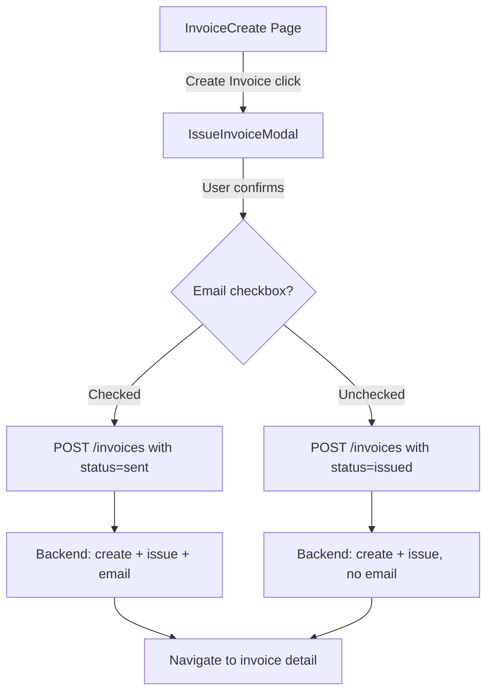
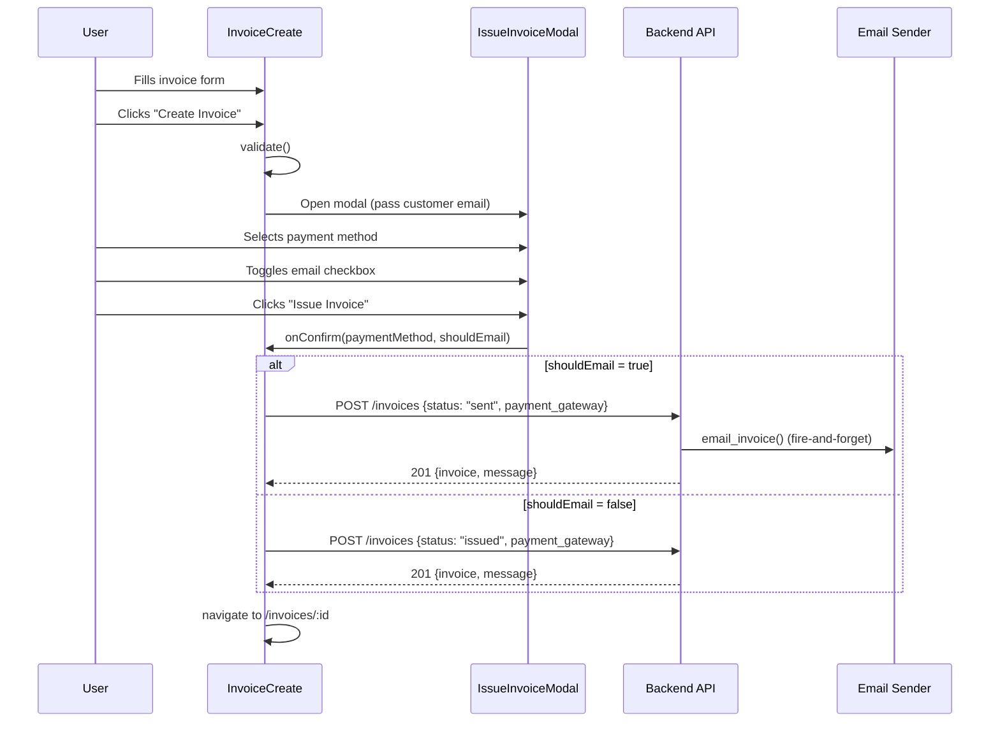

# Design Document: Invoice Issue Modal

## Overview

This feature replaces the current "Create Invoice" button behavior in `InvoiceCreate.tsx`. Currently, clicking "Create Invoice" immediately issues the invoice and emails it. The new flow opens a confirmation modal ("Issue Invoice") where the user selects a payment method and optionally checks a box to email the invoice. The payment method radio buttons are removed from the invoice form body and relocated into this modal. "Stripe" is renamed to "Online Payment" in all user-facing labels.

The backend already supports `payment_gateway` and conditional emailing (via `status: "sent"` vs `status: "issued"`). The primary changes are frontend (new modal component, form restructuring) with a minor backend adjustment to support issuing without emailing.

## Architecture

### Navigation & Access

- **Location**: The modal is triggered from the existing `InvoiceCreate` page (`frontend/src/pages/invoices/InvoiceCreate.tsx`)
- **No new routes needed** — the modal is a child component of InvoiceCreate, not a separate page
- **No new navigation items** — the "Create Invoice" button already exists in the form toolbar
- **Access**: Same role gate as InvoiceCreate — `org_admin` and `salesperson`
- **Edit mode**: When editing a draft invoice at `/invoices/:id/edit`, the same modal appears when clicking "Issue Invoice"

### Existing Flows NOT Affected

| Button | Current Behavior | After This Change |
|--------|-----------------|-------------------|
| Save as Draft | Saves with `status: "draft"`, no email | **Unchanged** |
| Mark Paid & Email | Issues + records payment + emails | **Unchanged** — bypasses the modal entirely |
| QR Payment | Opens QR payment flow | **Unchanged** |
| Cancel | Navigates back | **Unchanged** |
| Create Invoice | Issues + emails immediately | **Changed** → opens modal first |



## Sequence Diagram



## Components and Interfaces

### Component 1: IssueInvoiceModal

**Purpose**: Confirmation modal shown when user clicks "Create Invoice". Collects payment method and email preference before issuing.

**Interface**:
```typescript
interface IssueInvoiceModalProps {
  open: boolean
  onClose: () => void
  onConfirm: (paymentMethod: string, shouldEmail: boolean) => void
  customerEmail: string | null
  loading: boolean
  stripeConnected: boolean
}
```

**Responsibilities**:
- Display payment method radio buttons (Cash, EFTPOS, Bank Transfer, Online Payment)
- Display "Email invoice to customer" checkbox (default checked if customer has email)
- Show customer email address when checkbox is checked
- Disable "Online Payment" option if Stripe is not connected (show "(not configured)" hint)
- Show loading spinner on "Issue Invoice" button during submission (`loading` prop)
- Disable both "Issue Invoice" and "Cancel" buttons during submission
- Show inline error message below buttons if submission fails (`error` prop or internal state)
- Call `onConfirm` with selected values when "Issue Invoice" is clicked

### Component 2: InvoiceCreate (modified)

**Purpose**: Existing invoice creation form — modified to remove inline payment method and wire up the modal.

**Changes**:
- Remove the "Payment Method" radio button section from the form body
- Replace `handleSaveAndSend` direct API call with modal open
- Add `IssueInvoiceModal` state management
- Pass payment method from modal into the API payload

## Data Models

### IssueInvoiceModal State

```typescript
interface IssueModalState {
  paymentMethod: 'cash' | 'eftpos' | 'bank_transfer' | 'stripe'
  emailInvoice: boolean
}
```

**Validation Rules**:
- `paymentMethod` defaults to `'cash'`
- `emailInvoice` defaults to `true` if `customerEmail` is non-null/non-empty, `false` otherwise
- "Online Payment" (`stripe`) is only selectable when `stripeConnected === true`

### API Payload Changes

No schema changes needed. The existing `InvoiceCreateRequest` already supports:
- `payment_gateway: string | null` — receives the selected payment method
- `status: "sent" | "issued" | "draft"` — `"sent"` triggers email, `"issued"` does not

The frontend currently always sends `status: "sent"` from "Create Invoice". The change is:
- If email checkbox checked → `status: "sent"` (existing behavior, backend emails)
- If email checkbox unchecked → `status: "issued"` (backend issues but skips email)

## Key Functions

### `IssueInvoiceModal` Component

```typescript
function IssueInvoiceModal({
  open,
  onClose,
  onConfirm,
  customerEmail,
  loading,
  stripeConnected,
}: IssueInvoiceModalProps): JSX.Element
```

**Preconditions:**
- `open` is a boolean controlling visibility
- `onConfirm` is called only after user clicks "Issue Invoice"
- `customerEmail` may be null if customer has no email

**Postconditions:**
- Calls `onConfirm(paymentMethod, shouldEmail)` on confirm
- Calls `onClose()` on cancel or close button
- Does not make API calls directly (parent handles submission)

### Modified `handleSaveAndSend` → `handleCreateInvoice`

```typescript
// Before: immediately calls API
const handleSaveAndSend = async () => {
  if (!validate()) return
  setSaving(true)
  // ... direct API call with status: 'sent'
}

// After: opens modal, API call happens in handleIssueConfirm
const handleCreateInvoice = () => {
  if (!validate()) return
  setIssueModalOpen(true)
}

const handleIssueConfirm = async (paymentMethod: string, shouldEmail: boolean) => {
  setSaving(true)
  setIssueError(null)
  try {
    const status = shouldEmail ? 'sent' : 'issued'
    const payload = { ...buildPayload(status), payment_gateway: paymentMethod }
    // For edit mode: PUT to update, then the backend issues on status change
    if (isEditMode) {
      await apiClient.put(`/invoices/${invoiceId}`, { ...payload, status })
    } else {
      await apiClient.post('/invoices', payload)
    }
    navigate(`/invoices/${newId}`)
  } catch (err) {
    setIssueError(err?.response?.data?.detail ?? 'Failed to issue invoice')
  } finally {
    setSaving(false)
  }
}
```

**Edit mode behavior**:
- In edit mode (`/invoices/:id/edit`), the trigger button text is "Issue Invoice" instead of "Create Invoice"
- The modal is identical in both modes
- On confirm, edit mode uses PUT (update + issue), create mode uses POST (create + issue)

**Preconditions:**
- Form validation passes before modal opens
- `paymentMethod` is one of: `'cash'`, `'eftpos'`, `'bank_transfer'`, `'stripe'`
- `shouldEmail` determines whether backend sends the email

**Postconditions:**
- Invoice is created with the selected payment gateway
- If `shouldEmail`, backend fires email (existing `email_invoice` flow)
- User is navigated to invoice detail page on success

## Correctness Properties

1. **∀ invoice created via modal**: `invoice.payment_gateway ∈ {cash, eftpos, bank_transfer, stripe}`
2. **∀ invoice where email unchecked**: no email is sent (status = "issued", not "sent")
3. **∀ invoice where email checked AND customer has email**: email is sent (status = "sent")
4. **∀ invoice where email checked AND customer has NO email**: backend skips email gracefully (existing guard in router)
5. **Payment method removed from form body**: the radio buttons only exist inside the modal
6. **"Stripe" label never shown to user**: all user-facing labels show "Online Payment"
7. **Existing flows unchanged**: "Save as Draft", "Mark Paid & Email", "QR Payment", "Cancel" buttons behave identically

## Error Handling

### Error Scenario 1: API failure during issue

**Condition**: POST /invoices returns 4xx or 5xx after user confirms in modal
**Response**: Display error message inline in the modal below the buttons (red text). Modal stays open. "Issue Invoice" button returns to enabled state.
**Recovery**: User can retry by clicking "Issue Invoice" again, or cancel to go back to the form.

### Error Scenario 2: No customer email but checkbox checked

**Condition**: Customer has no email on file, user checks "Email invoice"
**Response**: Backend already handles this — skips email silently (existing guard in `create_invoice_endpoint`)
**Recovery**: No action needed; invoice is still issued successfully

### Error Scenario 3: Stripe not connected but "Online Payment" selected

**Condition**: User somehow selects "Online Payment" when Stripe is disconnected
**Response**: The radio button is disabled when `stripeConnected === false`, preventing selection. Shows "(not configured)" hint text next to the disabled option.
**Recovery**: N/A — prevented by UI

### Error Scenario 4: Network failure during submission

**Condition**: Network drops while the modal is submitting
**Response**: Loading spinner stops, error message "Network error — please check your connection and try again" appears in the modal
**Recovery**: User can retry or cancel

## Testing Strategy

### Unit Testing Approach

- Test `IssueInvoiceModal` renders with correct default state (payment method = cash, email checkbox reflects customer email presence)
- Test clicking "Issue Invoice" calls `onConfirm` with correct arguments
- Test "Online Payment" radio is disabled when `stripeConnected = false`
- Test email checkbox defaults to unchecked when `customerEmail` is null
- Test cancel button calls `onClose`

### Integration Testing Approach

- Test full flow: fill form → click "Create Invoice" → modal opens → select payment method → confirm → API called with correct payload
- Test that `status: "issued"` is sent when email unchecked
- Test that `status: "sent"` is sent when email checked
- Test that payment method from form body is removed (no radio buttons outside modal)

### Property-Based Testing Approach

**Property Test Library**: fast-check

- For any combination of (paymentMethod, emailChecked, customerEmail), the API payload always has a valid `payment_gateway` and the correct `status` value

## Performance Considerations

No performance impact. The modal is a lightweight React component rendered conditionally. No additional API calls are introduced — the same single POST /invoices call is made, just with different `status` values.

## Code Change Map

### What Already Exists (will be reused as-is)

| Item | Location | Notes |
|------|----------|-------|
| `Modal` component | `frontend/src/components/ui/Modal.tsx` | Props: `open`, `onClose`, `title`, `children`, `className` |
| `Button` component | `frontend/src/components/ui/Button.tsx` | Props: `variant`, `size`, `loading`, `onClick`, `disabled` |
| `paymentGateway` state | `InvoiceCreate.tsx` line 918 | `useState('cash')` — values: `cash`, `eftpos`, `bank_transfer`, `stripe` |
| `stripeConnected` state | `InvoiceCreate.tsx` line 919 | `useState(false)` — fetched from `/payments/online-payments/status` |
| `customer` state | `InvoiceCreate.tsx` | Has `.email` field available for the checkbox default |
| `buildPayload(status)` | `InvoiceCreate.tsx` | Already includes `payment_gateway: paymentGateway` in output |
| `isEditMode` / `editId` | `InvoiceCreate.tsx` | Already supports PUT for edits |
| Backend `status: "issued"` | `invoices/router.py` line 139 | `effective_status = "issued"`, `should_email = False` |
| Backend `status: "sent"` | `invoices/router.py` line 138 | `effective_status = "issued"`, `should_email = True` |
| Backend `InvoiceStatus.issued` | `invoices/schemas.py` line 25 | Valid enum value in `InvoiceCreateRequest` |
| `paidModalOpen` pattern | `InvoiceCreate.tsx` line 936 | Existing modal pattern to follow for the new issue modal |

### What Gets Removed

| Item | Location | Reason |
|------|----------|--------|
| Payment Method radio buttons section | `InvoiceCreate.tsx` lines ~2406-2490 | Moves into the new modal |
| "Stripe" label text | `InvoiceCreate.tsx` line ~2454 | Renamed to "Online Payment" |

### What Gets Modified

| Item | Location | Change |
|------|----------|--------|
| `handleSaveAndSend` function | `InvoiceCreate.tsx` line 1663 | Renamed to `handleCreateInvoice`, opens modal instead of calling API directly |
| "Create Invoice" button (header) | `InvoiceCreate.tsx` line 1822 | `onClick` changes from `handleSaveAndSend` to `handleCreateInvoice`; text becomes "Issue Invoice" in edit mode |
| "Create Invoice" button (bottom) | `InvoiceCreate.tsx` line 2521 | Same change as header button |
| `paymentGateway` state default | `InvoiceCreate.tsx` line 918 | Stays `'cash'` default but now set from modal, not inline radios |

### What Gets Created (new code)

| Item | Location | Description |
|------|----------|-------------|
| `IssueInvoiceModal` component | `frontend/src/pages/invoices/IssueInvoiceModal.tsx` (new file) | Modal with payment method radios + email checkbox |
| `issueModalOpen` state | `InvoiceCreate.tsx` | `useState(false)` — controls modal visibility |
| `issueError` state | `InvoiceCreate.tsx` | `useState<string \| null>(null)` — inline error in modal |
| `handleIssueConfirm` function | `InvoiceCreate.tsx` | Receives `(paymentMethod, shouldEmail)` from modal, calls API |

### Backend — No Changes Required

The backend already supports all needed behavior:
- `POST /invoices` with `status: "issued"` → creates + issues, no email
- `POST /invoices` with `status: "sent"` → creates + issues + emails
- `PUT /invoices/:id` with `status: "sent"` → updates + issues + emails (edit mode)
- `payment_gateway` field accepted in `InvoiceCreateRequest` schema
- Stripe payment link auto-generated when `payment_gateway: "stripe"` (existing `_maybe_create_stripe_payment_intent` logic)

## Security Considerations

No new security concerns. The payment method selection is a UI label change only — the backend `payment_gateway` field already accepts these values. No new endpoints or permissions are needed.

## Dependencies

- Existing `Modal` component from `frontend/src/components/ui/Modal.tsx`
- Existing `Button` component from `frontend/src/components/ui`
- Existing `apiClient` from `frontend/src/api/client`
- No new npm packages required
