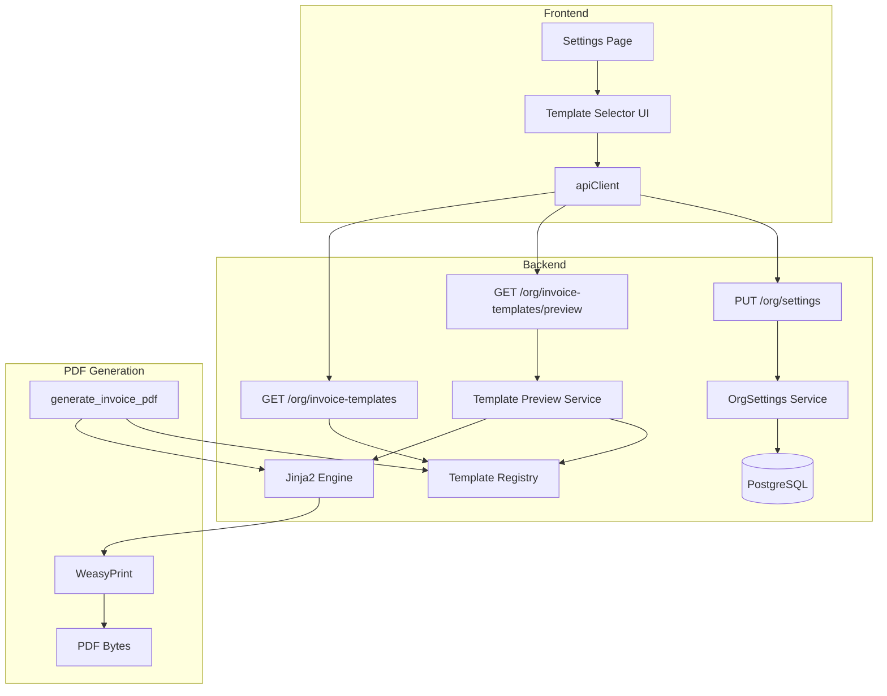
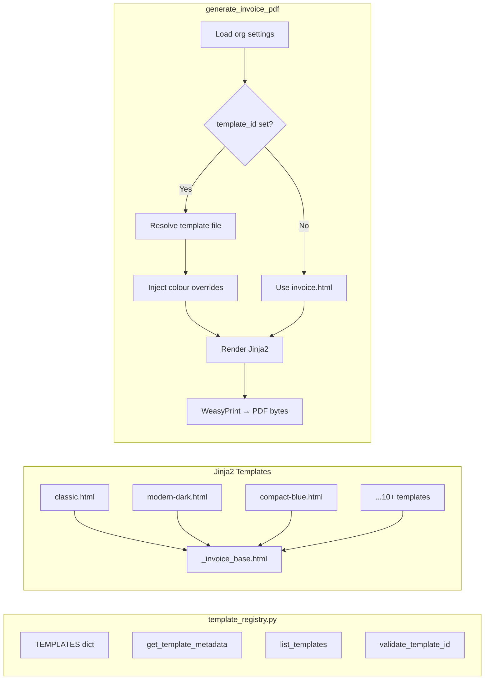
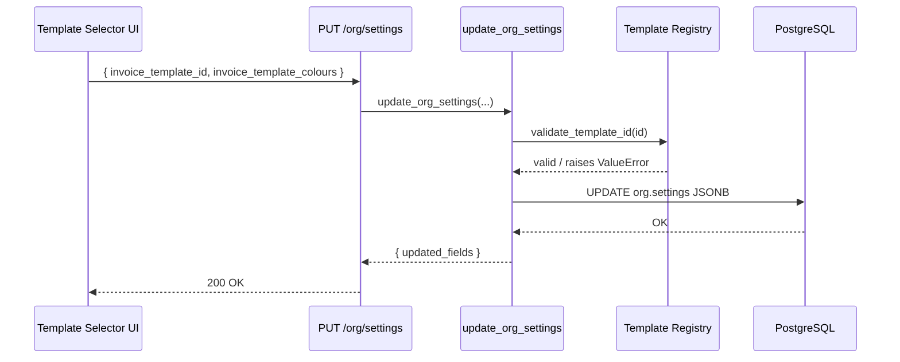
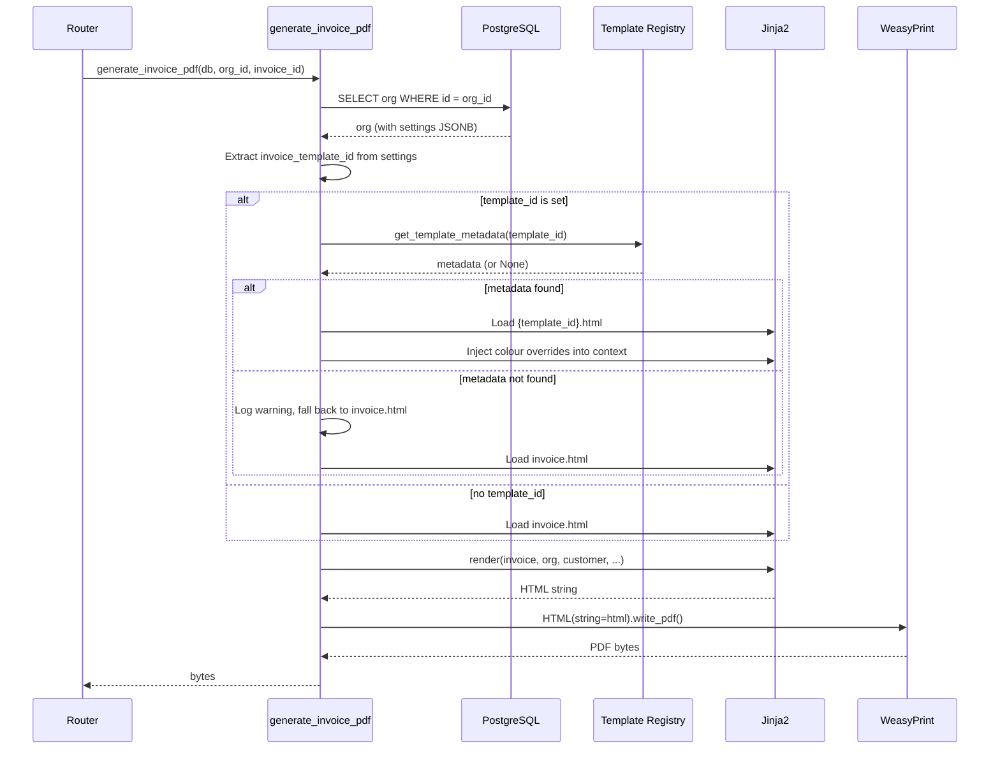

# Design Document: Invoice PDF Templates

## Overview

This feature adds a configurable invoice PDF template system to OraInvoice, allowing org admins to choose from 10+ professionally designed invoice layouts and customise their colour scheme. The system extends the existing WeasyPrint + Jinja2 PDF pipeline with a template registry, colour override mechanism, and a new settings UI tab.

### Key Design Decisions

1. **Template Registry as Python module** — A single `app/modules/invoices/template_registry.py` file defines all template metadata as a dictionary. This avoids a database table for static data that changes only at deploy time, keeps the registry importable by both the backend renderer and the API layer, and makes adding new templates a code-only change.

2. **Jinja2 template inheritance** — All 10+ templates extend a shared `_invoice_base.html` base template that defines the data-rendering blocks (line items, totals, payment history, etc.). Individual templates override only the layout and styling blocks. This ensures every template renders the full invoice data set without duplication.

3. **CSS custom properties for colour overrides** — Each template defines its colour palette using CSS custom properties (`--primary`, `--accent`, `--header-bg`). The renderer injects org-level colour overrides into a `<style>` block before the template's own styles, making colour customisation a simple variable substitution with no template modification.

4. **Static thumbnails committed to repo** — Thumbnail images are pre-generated PNG files stored in `frontend/public/templates/`. This avoids runtime rendering costs and keeps the selector UI fast. Thumbnails are regenerated manually when templates change.

5. **Preview endpoint returns HTML** — The preview endpoint renders the template with sample data and returns HTML. The frontend displays it in an iframe. This reuses the existing Jinja2 rendering pipeline and avoids the overhead of generating a full PDF for previews.

6. **Backward compatibility via fallback** — When `invoice_template_id` is absent from org settings, the renderer uses the existing `invoice.html` unchanged. No migration is needed for existing orgs.

## Architecture

### System Context



### Component Architecture



### Request Flow — Template Selection Save



### Request Flow — PDF Generation with Template



## Components and Interfaces

### 1. Template Registry (`app/modules/invoices/template_registry.py`)

```python
from __future__ import annotations
from dataclasses import dataclass
from typing import Literal

LogoPosition = Literal["left", "center", "side"]
LayoutType = Literal["standard", "compact"]


@dataclass(frozen=True)
class TemplateMetadata:
    """Immutable metadata for a single invoice PDF template."""
    id: str
    display_name: str
    description: str
    thumbnail_path: str          # relative to frontend/public/
    default_primary_colour: str  # hex e.g. "#2563eb"
    default_accent_colour: str
    default_header_bg_colour: str
    logo_position: LogoPosition
    layout_type: LayoutType
    template_file: str           # filename in app/templates/pdf/


# Master registry — source of truth for all templates
TEMPLATES: dict[str, TemplateMetadata] = {
    "classic": TemplateMetadata(
        id="classic",
        display_name="Classic",
        description="Clean, traditional layout with left-aligned logo and blue accents.",
        thumbnail_path="templates/classic.png",
        default_primary_colour="#2563eb",
        default_accent_colour="#1e40af",
        default_header_bg_colour="#ffffff",
        logo_position="left",
        layout_type="standard",
        template_file="classic.html",
    ),
    # ... 9+ more entries (see Data Models section for full list)
}


def list_templates() -> list[dict]:
    """Return all templates as serialisable dicts for the API."""
    return [
        {
            "id": t.id,
            "display_name": t.display_name,
            "description": t.description,
            "thumbnail_path": t.thumbnail_path,
            "default_primary_colour": t.default_primary_colour,
            "default_accent_colour": t.default_accent_colour,
            "default_header_bg_colour": t.default_header_bg_colour,
            "logo_position": t.logo_position,
            "layout_type": t.layout_type,
        }
        for t in TEMPLATES.values()
    ]


def get_template_metadata(template_id: str) -> TemplateMetadata | None:
    """Look up a template by ID. Returns None if not found."""
    return TEMPLATES.get(template_id)


def validate_template_id(template_id: str) -> None:
    """Raise ValueError if template_id is not in the registry."""
    if template_id not in TEMPLATES:
        raise ValueError(
            f"Unknown invoice template '{template_id}'. "
            f"Valid templates: {', '.join(sorted(TEMPLATES.keys()))}"
        )
```

### 2. Template List Endpoint (`app/modules/invoices/router.py`)

```python
@router.get(
    "/invoice-templates",
    summary="List available invoice PDF templates",
    dependencies=[require_role("org_admin", "salesperson")],
)
async def list_invoice_templates():
    """Return the catalogue of available invoice templates.

    Requirements: 1.1, 1.2
    """
    from app.modules.invoices.template_registry import list_templates
    return {"templates": list_templates()}
```

Response shape: `{ templates: [...] }` — follows the project convention of wrapping arrays in objects.

### 3. Template Preview Endpoint (`app/modules/invoices/router.py`)

```python
from pydantic import BaseModel, Field
from typing import Optional


class TemplatePreviewRequest(BaseModel):
    template_id: str = Field(..., description="Template ID from the registry")
    primary_colour: Optional[str] = Field(None, pattern=r"^#[0-9A-Fa-f]{6}$")
    accent_colour: Optional[str] = Field(None, pattern=r"^#[0-9A-Fa-f]{6}$")
    header_bg_colour: Optional[str] = Field(None, pattern=r"^#[0-9A-Fa-f]{6}$")


@router.post(
    "/invoice-templates/preview",
    summary="Preview an invoice template with sample data",
    dependencies=[require_role("org_admin")],
)
async def preview_invoice_template(
    payload: TemplatePreviewRequest,
    request: Request,
    db: AsyncSession = Depends(get_db_session),
):
    """Render a sample invoice using the specified template and colour overrides.

    Returns HTML string for iframe rendering in the frontend.

    Requirements: 6.1, 6.2, 6.5, 6.6
    """
    from app.modules.invoices.template_registry import get_template_metadata
    from app.modules.invoices.template_preview import render_template_preview

    meta = get_template_metadata(payload.template_id)
    if meta is None:
        raise HTTPException(status_code=404, detail=f"Template '{payload.template_id}' not found")

    org_id = getattr(request.state, "org_id", None)
    org_uuid = uuid.UUID(org_id) if org_id else None

    html = await render_template_preview(
        db,
        org_id=org_uuid,
        template_meta=meta,
        colour_overrides={
            "primary_colour": payload.primary_colour,
            "accent_colour": payload.accent_colour,
            "header_bg_colour": payload.header_bg_colour,
        },
    )
    return {"html": html}
```

### 4. Template Preview Service (`app/modules/invoices/template_preview.py`)

```python
async def render_template_preview(
    db: AsyncSession,
    *,
    org_id: uuid.UUID | None,
    template_meta: TemplateMetadata,
    colour_overrides: dict,
) -> str:
    """Render a template with sample invoice data for preview.

    Uses the org's real branding (name, logo, address) but fake invoice data
    (sample customer, 4 line items, sample totals) so the preview is realistic.

    Requirements: 6.2, 6.5
    """
    # 1. Load org branding from DB (or use defaults if no org context)
    # 2. Build sample invoice dict with realistic data
    # 3. Resolve colour values: override > org settings > template defaults
    # 4. Load and render the Jinja2 template
    # 5. Return HTML string
```

### 5. Org Settings Schema Changes (`app/modules/organisations/schemas.py`)

Add to `OrgSettingsUpdateRequest`:

```python
# Invoice template selection
invoice_template_id: Optional[str] = Field(
    None,
    max_length=50,
    description="Invoice PDF template ID from the template registry",
)
invoice_template_colours: Optional[dict] = Field(
    None,
    description="Colour overrides: {primary_colour, accent_colour, header_bg_colour}",
)
```

Add to `OrgSettingsResponse`:

```python
invoice_template_id: Optional[str] = Field(
    None, description="Selected invoice PDF template ID"
)
invoice_template_colours: Optional[dict] = Field(
    None, description="Colour overrides for the selected template"
)
```

### 6. Org Settings Service Validation

In `update_org_settings()`, add validation before persisting:

```python
if "invoice_template_id" in update_kwargs:
    from app.modules.invoices.template_registry import validate_template_id
    validate_template_id(update_kwargs["invoice_template_id"])

if "invoice_template_colours" in update_kwargs:
    colours = update_kwargs["invoice_template_colours"]
    hex_pattern = re.compile(r"^#[0-9A-Fa-f]{6}$")
    for key in ("primary_colour", "accent_colour", "header_bg_colour"):
        val = colours.get(key)
        if val and not hex_pattern.match(val):
            raise ValueError(f"Invalid hex colour for {key}: {val}")
```

### 7. Modified `generate_invoice_pdf()` (`app/modules/invoices/service.py`)

The existing function is modified to:

1. Read `invoice_template_id` and `invoice_template_colours` from `org.settings`
2. If a template ID is set, look it up in the registry
3. If found, load the corresponding `.html` file instead of `invoice.html`
4. Inject colour override CSS variables into the template context
5. If not found, log a warning and fall back to `invoice.html`
6. Pass the same data context to all templates

```python
# In generate_invoice_pdf(), after building org_context:

template_id = settings.get("invoice_template_id")
template_colours = settings.get("invoice_template_colours") or {}
template_file = "invoice.html"  # default

if template_id:
    from app.modules.invoices.template_registry import get_template_metadata
    meta = get_template_metadata(template_id)
    if meta:
        template_file = meta.template_file
        # Resolve colours: org override > template default
        colour_context = {
            "primary_colour": template_colours.get("primary_colour") or meta.default_primary_colour,
            "accent_colour": template_colours.get("accent_colour") or meta.default_accent_colour,
            "header_bg_colour": template_colours.get("header_bg_colour") or meta.default_header_bg_colour,
        }
    else:
        logger.warning("Template '%s' not found in registry, using default", template_id)
        colour_context = {}
else:
    colour_context = {}

template = env.get_template(template_file)
html_content = template.render(
    invoice=invoice_dict,
    org=org_context,
    customer=customer_context,
    currency_symbol=currency_symbol,
    gst_percentage=gst_percentage,
    payment_terms=payment_terms,
    terms_and_conditions=terms_and_conditions,
    colours=colour_context,
    **i18n_ctx,
)
```

### 8. Frontend: Template Selector UI Component

**File:** `frontend/src/pages/settings/InvoiceTemplateTab.tsx`

```typescript
interface TemplateInfo {
  id: string
  display_name: string
  description: string
  thumbnail_path: string
  default_primary_colour: string
  default_accent_colour: string
  default_header_bg_colour: string
  logo_position: string
  layout_type: string
}

interface ColourOverrides {
  primary_colour: string
  accent_colour: string
  header_bg_colour: string
}
```

**Component structure:**

```
InvoiceTemplateTab
├── FilterBar (Layout_Type + Logo_Position filters)
├── TemplateGrid
│   └── TemplateCard[] (thumbnail, name, description, badges)
├── ColourCustomiser (3 colour pickers + Reset to Defaults)
├── PreviewButton → opens PreviewModal (iframe with rendered HTML)
└── SaveButton → PUT /org/settings
```

**Integration with OrgSettings.tsx:**

Add a new tab entry to the `tabs` array in `OrgSettings`:

```typescript
{ id: 'invoice-template', label: 'Invoice Template', content: <InvoiceTemplateTab /> }
```

### 9. Jinja2 Base Template (`app/templates/pdf/_invoice_base.html`)

The base template defines all data-rendering blocks that child templates inherit:

```












```

Each child template overrides `page_styles` and `header`/`footer` for visual identity, while inheriting the data-rendering logic from the base. The base template includes all the conditional logic for optional fields (vehicle info, discounts, payment history, etc.) so it doesn't need to be duplicated.

## Data Models

### Template Registry — Full Template List

| ID | Display Name | Layout | Logo Pos | Default Primary | Default Accent | Default Header BG |
|----|-------------|--------|----------|----------------|---------------|-------------------|
| `classic` | Classic | standard | left | #2563eb | #1e40af | #ffffff |
| `modern-dark` | Modern Dark | standard | left | #6366f1 | #4f46e5 | #1e1b4b |
| `compact-blue` | Compact Blue | compact | left | #0284c7 | #0369a1 | #f0f9ff |
| `bold-header` | Bold Header | standard | center | #dc2626 | #b91c1c | #1a1a1a |
| `minimal` | Minimal | standard | left | #374151 | #6b7280 | #ffffff |
| `trade-pro` | Trade Pro | standard | side | #059669 | #047857 | #ecfdf5 |
| `corporate` | Corporate | standard | center | #1e3a5f | #2563eb | #f8fafc |
| `compact-green` | Compact Green | compact | left | #16a34a | #15803d | #f0fdf4 |
| `elegant` | Elegant | standard | center | #7c3aed | #6d28d9 | #faf5ff |
| `compact-mono` | Compact Mono | compact | side | #1a1a1a | #525252 | #fafafa |
| `sunrise` | Sunrise | standard | side | #ea580c | #c2410c | #fff7ed |
| `ocean` | Ocean | standard | left | #0891b2 | #0e7490 | #ecfeff |

12 templates total: 9 standard + 3 compact. Logo positions: 5 left, 3 center, 4 side (all exceeding the minimum requirements of 2 per position).

### Org Settings JSONB — New Fields

The following fields are added to the `org.settings` JSONB column on the `organisations` table:

```json
{
  "invoice_template_id": "modern-dark",
  "invoice_template_colours": {
    "primary_colour": "#8b5cf6",
    "accent_colour": "#7c3aed",
    "header_bg_colour": "#1e1b4b"
  }
}
```

Both fields are optional. When absent, the system uses the default `invoice.html` template.

### Colour Override Schema

```json
{
  "type": "object",
  "properties": {
    "primary_colour": { "type": "string", "pattern": "^#[0-9A-Fa-f]{6}$" },
    "accent_colour": { "type": "string", "pattern": "^#[0-9A-Fa-f]{6}$" },
    "header_bg_colour": { "type": "string", "pattern": "^#[0-9A-Fa-f]{6}$" }
  },
  "additionalProperties": false
}
```

### Template Preview — Sample Data Structure

The preview endpoint uses this hardcoded sample data:

```python
SAMPLE_INVOICE = {
    "invoice_number": "INV-0042",
    "status": "issued",
    "issue_date": "15 Jan 2026",
    "due_date": "29 Jan 2026",
    "payment_terms": "net_14",
    "currency": "NZD",
    "line_items": [
        {"description": "Full vehicle service", "item_type": "service", "quantity": 1, "unit_price": 250.00, "line_total": 250.00},
        {"description": "Engine oil 5W-30 (5L)", "item_type": "part", "quantity": 1, "unit_price": 89.50, "line_total": 89.50, "part_number": "OIL-5W30"},
        {"description": "Oil filter", "item_type": "part", "quantity": 1, "unit_price": 24.00, "line_total": 24.00, "part_number": "FLT-001"},
        {"description": "Brake pad replacement — front", "item_type": "labour", "quantity": 1.5, "unit_price": 95.00, "hours": 1.5, "hourly_rate": 95.00, "line_total": 142.50},
    ],
    "subtotal": 506.00,
    "discount_amount": 0,
    "gst_amount": 75.90,
    "total": 581.90,
    "balance_due": 581.90,
    "amount_paid": 0,
    "vehicle_rego": "ABC123",
    "vehicle_make": "Toyota",
    "vehicle_model": "Hilux",
    "vehicle_year": 2021,
    "notes_customer": "Next service due at 85,000 km.",
    "additional_vehicles": [],
    "payments": [],
}

SAMPLE_CUSTOMER = {
    "first_name": "James",
    "last_name": "Wilson",
    "display_name": "James Wilson",
    "company_name": "Wilson Contracting Ltd",
    "email": "james@wilsoncontracting.co.nz",
    "phone": "021 555 0123",
    "address": "42 Trade Street, Penrose, Auckland 1061",
}
```

### API Response Shapes

**GET /org/invoice-templates**
```json
{
  "templates": [
    {
      "id": "classic",
      "display_name": "Classic",
      "description": "Clean, traditional layout...",
      "thumbnail_path": "templates/classic.png",
      "default_primary_colour": "#2563eb",
      "default_accent_colour": "#1e40af",
      "default_header_bg_colour": "#ffffff",
      "logo_position": "left",
      "layout_type": "standard"
    }
  ]
}
```

**POST /org/invoice-templates/preview**

Request:
```json
{
  "template_id": "modern-dark",
  "primary_colour": "#8b5cf6",
  "accent_colour": "#7c3aed",
  "header_bg_colour": "#1e1b4b"
}
```

Response:
```json
{
  "html": "<!DOCTYPE html><html>..."
}
```

**PUT /org/settings** (template fields)
```json
{
  "invoice_template_id": "modern-dark",
  "invoice_template_colours": {
    "primary_colour": "#8b5cf6",
    "accent_colour": "#7c3aed",
    "header_bg_colour": "#1e1b4b"
  }
}
```

**GET /org/settings** (includes new fields)
```json
{
  "org_name": "...",
  "invoice_template_id": "modern-dark",
  "invoice_template_colours": {
    "primary_colour": "#8b5cf6",
    "accent_colour": "#7c3aed",
    "header_bg_colour": "#1e1b4b"
  }
}
```

## Correctness Properties

*A property is a characteristic or behavior that should hold true across all valid executions of a system — essentially, a formal statement about what the system should do. Properties serve as the bridge between human-readable specifications and machine-verifiable correctness guarantees.*

### Property 1: Template registry completeness

*For any* template entry in the TEMPLATES registry, all required metadata fields (id, display_name, description, thumbnail_path, default_primary_colour, default_accent_colour, default_header_bg_colour, logo_position, layout_type, template_file) SHALL be non-empty strings, and the corresponding Jinja2 template file SHALL exist in `app/templates/pdf/`.

**Validates: Requirements 1.2, 1.5**

### Property 2: Colour resolution in rendered output

*For any* template in the registry and *for any* valid hex colour triple (primary, accent, header_bg), rendering the template with those colours as overrides SHALL produce HTML containing those exact hex values. When no overrides are provided, the rendered HTML SHALL contain the template's default colour values instead.

**Validates: Requirements 2.2, 2.3, 7.3**

### Property 3: Template data rendering completeness

*For any* template in the registry and *for any* valid invoice data (including edge cases: zero line items, absent optional fields, no logo, any payment status, additional vehicles), the template SHALL render without errors and the output HTML SHALL contain all data values that were provided in the input context (org name, customer name, invoice number, line item descriptions, totals).

**Validates: Requirements 2.4, 9.1, 9.2, 9.3, 9.4, 9.6**

### Property 4: Template ID validation

*For any* string that is not a key in the TEMPLATES registry, calling `validate_template_id()` SHALL raise a ValueError. *For any* string that is a key in the TEMPLATES registry, calling `validate_template_id()` SHALL not raise an exception.

**Validates: Requirements 3.3, 3.4**

### Property 5: Template filtering correctness

*For any* combination of layout_type filter (`standard`, `compact`, or `all`) and logo_position filter (`left`, `center`, `side`, or `all`), the filtered template list SHALL contain exactly those templates whose metadata matches both filter criteria, and no others.

**Validates: Requirements 4.6**

### Property 6: Preview rendering for any template

*For any* valid template ID in the registry, the preview rendering function SHALL return a non-empty HTML string containing the sample invoice data values (sample customer name, sample invoice number, sample line item descriptions).

**Validates: Requirements 6.2, 6.5**

### Property 7: Thumbnail file integrity

*For any* template in the registry, the thumbnail file referenced by `thumbnail_path` SHALL exist in `frontend/public/`, SHALL be a valid PNG or WebP image, and SHALL be at least 400 pixels wide.

**Validates: Requirements 8.1, 8.2**

## Error Handling

### Backend Errors

| Scenario | Handler | Response |
|----------|---------|----------|
| Invalid `invoice_template_id` on PUT /org/settings | `update_org_settings()` calls `validate_template_id()` | HTTP 422 with `"Unknown invoice template '{id}'"` |
| Invalid hex colour in `invoice_template_colours` | Pydantic validation + service-level regex check | HTTP 422 with `"Invalid hex colour for {field}"` |
| Non-existent template ID on preview endpoint | Router checks `get_template_metadata()` returns None | HTTP 404 with `"Template '{id}' not found"` |
| Template ID in org settings doesn't match registry at PDF generation time | `generate_invoice_pdf()` logs warning, falls back to `invoice.html` | PDF generated with default template (no user-facing error) |
| Jinja2 template file missing from disk | Jinja2 `TemplateNotFound` exception | HTTP 500 (caught by FastAPI error handler), logged |
| WeasyPrint rendering failure | Exception in `HTML.write_pdf()` | HTTP 500, logged |
| Org not found during preview | Service raises ValueError | HTTP 404 |

### Frontend Error Handling

| Scenario | Handler | UX |
|----------|---------|-----|
| Template list API fails | `catch` in useEffect | Toast: "Failed to load templates", empty grid with retry prompt |
| Preview API fails | `catch` in preview handler | Toast: "Failed to generate preview" |
| Save API fails (422 — invalid template) | `catch` in save handler | Toast with error detail from response |
| Save API fails (network) | `catch` in save handler | Toast: "Failed to save template settings" |
| Thumbnail image fails to load | `` `onError` handler | Show placeholder with template name |

### Graceful Degradation

- If the template registry module fails to import, `generate_invoice_pdf()` catches the ImportError and uses `invoice.html`
- If `invoice_template_colours` contains invalid keys (not primary/accent/header_bg), they are silently ignored
- If the org has no settings at all, the renderer uses all defaults (existing behaviour preserved)

## Testing Strategy

### Property-Based Tests (Hypothesis)

Property-based testing is appropriate for this feature because:
- The template registry has multiple entries that should all satisfy the same invariants
- Colour overrides accept a large input space (any valid hex colour)
- Template rendering must handle diverse invoice data combinations
- Filtering logic must be correct for all filter combinations

**Library:** Hypothesis (already used in the project — see `.hypothesis/` directory)

**Configuration:** Minimum 100 iterations per property test.

**Tag format:** `Feature: invoice-pdf-templates, Property {N}: {description}`

Each correctness property (1–7) maps to a single Hypothesis test:

| Property | Test File | Strategy |
|----------|-----------|----------|
| 1: Registry completeness | `tests/test_invoice_templates.py` | `st.sampled_from(list(TEMPLATES.keys()))` — pick any template, verify metadata + file exists |
| 2: Colour resolution | `tests/test_invoice_templates.py` | `st.sampled_from(templates) × st.from_regex(r'#[0-9a-f]{6}', fullmatch=True)` — pick template + random colours, render, check output |
| 3: Data rendering completeness | `tests/test_invoice_templates.py` | `st.sampled_from(templates) × st.builds(invoice_data)` — pick template + generated invoice data with optional fields, render, verify |
| 4: Template ID validation | `tests/test_invoice_templates.py` | `st.text(min_size=1, max_size=50)` — random strings, verify validation matches registry membership |
| 5: Filtering correctness | `tests/test_invoice_templates.py` | `st.sampled_from(layout_types) × st.sampled_from(logo_positions)` — all filter combos, verify results |
| 6: Preview rendering | `tests/test_invoice_templates.py` | `st.sampled_from(templates)` — pick any template, call preview, verify HTML content |
| 7: Thumbnail integrity | `tests/test_invoice_templates.py` | `st.sampled_from(templates)` — pick any template, verify thumbnail file |

### Unit Tests (pytest)

| Test | What it verifies |
|------|-----------------|
| `test_registry_has_minimum_templates` | At least 10 templates, 3 compact, 7 standard, 2 per logo position |
| `test_default_fallback_no_template_id` | generate_invoice_pdf uses invoice.html when no template_id set |
| `test_invalid_template_id_fallback` | generate_invoice_pdf falls back to invoice.html and logs warning for unknown ID |
| `test_preview_404_unknown_template` | Preview endpoint returns 404 for non-existent template |
| `test_settings_persist_template_fields` | PUT /org/settings saves and GET returns template_id and colours |
| `test_settings_reject_invalid_template_id` | PUT /org/settings returns 422 for unknown template ID |
| `test_compact_template_reduced_padding` | Compact templates have ≤ 6px padding on line-item rows |
| `test_existing_invoice_html_unchanged` | invoice.html file hash matches known value (backward compat) |
| `test_page_break_css_present` | Templates include CSS for page-break-inside: avoid on thead |

### Frontend Tests (Vitest + React Testing Library)

| Test | What it verifies |
|------|-----------------|
| `test_template_tab_renders` | Invoice Template tab appears in OrgSettings |
| `test_template_cards_display` | Grid shows correct number of cards with required info |
| `test_card_selection_highlight` | Clicking a card adds selected styling |
| `test_current_badge_shown` | Saved template shows "Current" badge |
| `test_colour_pickers_prepopulated` | Selecting a template populates colour pickers with defaults |
| `test_reset_to_defaults` | Reset button restores template default colours |
| `test_filter_by_layout_type` | Filtering by compact shows only compact templates |
| `test_filter_by_logo_position` | Filtering by center shows only center-logo templates |
| `test_preview_modal_opens` | Preview button triggers API call and opens modal |
| `test_save_sends_both_fields` | Save sends invoice_template_id and invoice_template_colours |
| `test_lazy_loading_thumbnails` | Thumbnail img tags have loading="lazy" attribute |
| `test_default_badge_no_selection` | When no template saved, default template shows "Default" badge |
