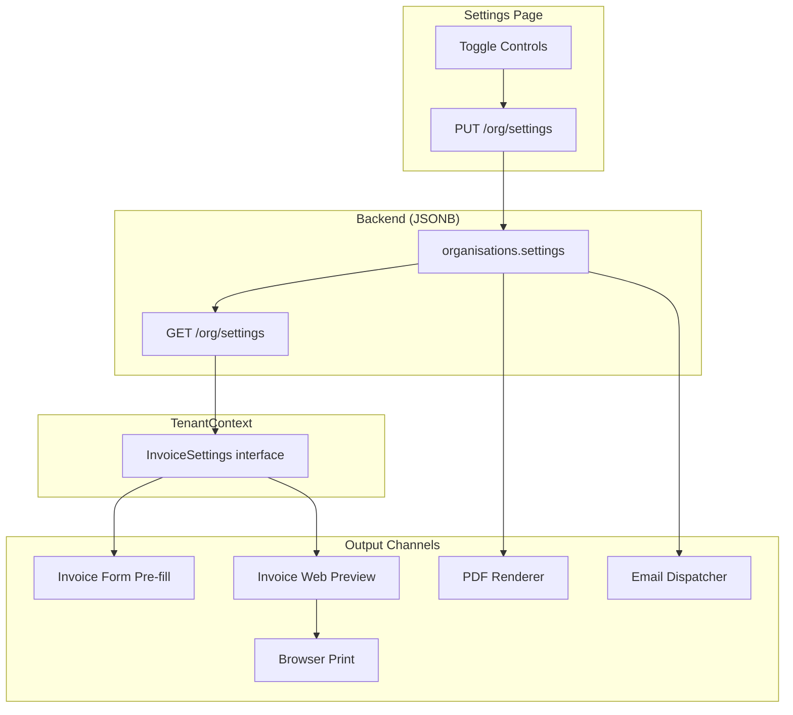

# Design Document: Invoice Settings Integration

## Overview

This feature connects four existing organisation settings fields (Email Signature, Default Invoice Notes, Payment Terms Statement, Terms & Conditions) to their intended output channels via enable/disable toggles. Currently these fields are stored in the JSONB `settings` column on the `organisations` table but are either dead (email_signature, default_notes) or only partially wired (payment_terms_text → PDF only, terms_and_conditions → PDF + stripped pre-fill).

The design adds:
1. Four boolean toggle fields in the JSONB settings (no migration needed)
2. Toggle UI controls on the Settings page
3. Conditional rendering in the web preview, PDF templates, email dispatcher, and invoice form pre-fill
4. TenantContext expansion to expose toggle states and default_notes to the frontend

**Key constraint:** No database migration is required. All new fields are JSONB keys on the existing `organisations.settings` column.

**Key finding from research:** All 12 selectable PDF templates already render notes, payment_terms, and terms_and_conditions. The 9 templates listed in the requirements extend `_invoice_base.html` which defines these blocks. The 3 standalone templates (`invoice.html`, `invoice_share.html`, and the base itself) also have these sections. The actual gap is the **toggle control** — currently these sections render unconditionally whenever content exists. The fix is to pass the toggle state into the template context and conditionally render based on it.

## Architecture



### Data Flow

1. **Settings save:** User toggles a switch → Settings page sends PUT with `{field}_enabled: bool` → stored in JSONB
2. **TenantContext:** On auth, fetches GET /org/settings → maps toggle booleans + default_notes into `InvoiceSettings`
3. **Invoice Form:** Reads TenantContext → conditionally pre-fills notes and T&C based on toggle state
4. **Web Preview:** Reads toggle state from invoice detail API response → conditionally renders payment terms and T&C sections
5. **PDF Renderer:** Reads toggle state from org settings → passes to Jinja2 template context → templates conditionally render
6. **Email Dispatcher:** Reads toggle state from org settings → conditionally appends signature to email body

## Components and Interfaces

### Backend Changes

#### 1. OrgSettingsResponse / OrgSettingsUpdateRequest (schemas.py)

Add four boolean fields to both schemas:

```python
# In OrgSettingsResponse
email_signature_enabled: Optional[bool] = Field(None, description="Enable email signature on outgoing emails")
default_notes_enabled: Optional[bool] = Field(None, description="Pre-fill notes on new invoices")
payment_terms_enabled: Optional[bool] = Field(None, description="Show payment terms on invoices")
terms_and_conditions_enabled: Optional[bool] = Field(None, description="Show T&C on invoices")

# In OrgSettingsUpdateRequest
email_signature_enabled: Optional[bool] = Field(None, description="Enable email signature on outgoing emails")
default_notes_enabled: Optional[bool] = Field(None, description="Pre-fill notes on new invoices")
payment_terms_enabled: Optional[bool] = Field(None, description="Show payment terms on invoices")
terms_and_conditions_enabled: Optional[bool] = Field(None, description="Show T&C on invoices")
```

#### 2. Organisation Service (service.py)

- Add the four toggle keys to `SETTINGS_JSONB_KEYS` set
- In `get_org_settings()`, apply defaults when keys are missing:
  - `email_signature_enabled` → `False`
  - `default_notes_enabled` → `False`
  - `payment_terms_enabled` → `True`
  - `terms_and_conditions_enabled` → `True`

#### 3. Invoice Detail API (invoices/service.py → get_invoice)

Add to the invoice detail response dict:
- `payment_terms_text`: from org settings when `payment_terms_enabled` is `true`, else `null`
- `terms_and_conditions_enabled`: boolean from org settings (so frontend knows whether to render per-invoice T&C)

#### 4. PDF Renderer (invoices/service.py → generate_invoice_pdf)

Pass toggle states into the Jinja2 template context:
```python
html_content = template.render(
    ...
    payment_terms=payment_terms if settings.get("payment_terms_enabled", True) else "",
    terms_and_conditions=terms_and_conditions if settings.get("terms_and_conditions_enabled", True) else "",
    ...
)
```

Notes (`invoice.notes_customer`) are per-invoice data and always render — no toggle needed for display.

#### 5. Email Dispatcher (invoices/service.py → email_invoice)

After building the email body, conditionally append signature:
```python
org_settings = org.settings or {}
if org_settings.get("email_signature_enabled", False):
    signature = org_settings.get("email_signature", "")
    if signature:
        body += f"\n\n---\n{signature}\n"
        # For HTML emails, append <hr> + signature HTML
```

Same logic applies to quote email sending in `quotes/service.py`.

### Frontend Changes

#### 1. TenantContext (contexts/TenantContext.tsx)

Expand `InvoiceSettings` interface:
```typescript
export interface InvoiceSettings {
  prefix: string
  default_due_days: number
  payment_terms_text: string | null
  terms_and_conditions: string | null
  // New fields
  default_notes: string | null
  default_notes_enabled: boolean
  payment_terms_enabled: boolean
  terms_and_conditions_enabled: boolean
}
```

Map from API response in `fetchSettings`:
```typescript
invoice: {
  prefix: data.invoice_prefix,
  default_due_days: data.default_due_days,
  payment_terms_text: data.payment_terms_text,
  terms_and_conditions: data.terms_and_conditions,
  default_notes: data.default_notes ?? null,
  default_notes_enabled: data.default_notes_enabled ?? false,
  payment_terms_enabled: data.payment_terms_enabled ?? true,
  terms_and_conditions_enabled: data.terms_and_conditions_enabled ?? true,
}
```

#### 2. Settings Page (pages/settings/OrgSettings.tsx)

**Branding Tab** — Add toggle for Email Signature:
```
[Toggle] Enable email signature on outgoing emails
[Textarea - dimmed when toggle off] Email Signature content
```

**Invoice Tab** — Add toggle for Default Notes:
```
[Toggle] Pre-fill notes on new invoices
[Textarea - dimmed when toggle off] Default Invoice Notes content
```

Add toggle for Payment Terms:
```
[Toggle] Show payment terms on invoices
[Textarea - dimmed when toggle off] Payment Terms Statement content
```

**Terms Tab** — Add toggle for T&C:
```
[Toggle] Show terms & conditions on invoices
[Rich text editor - dimmed when toggle off] T&C content
```

**Dimming pattern:** When toggle is off, apply `opacity-50 pointer-events-none` to the associated textarea/editor container.

#### 3. Invoice Form (pages/invoices/InvoiceCreate.tsx)

On create (no existing invoice):
```typescript
const { settings } = useTenant()
const initialNotes = settings?.invoice?.default_notes_enabled 
  ? (settings?.invoice?.default_notes ?? '') 
  : ''
const initialTC = settings?.invoice?.terms_and_conditions_enabled
  ? (settings?.invoice?.terms_and_conditions ?? '')
  : ''
```

On edit (existing invoice): use stored `notes_customer` and `terms_and_conditions` from the invoice record.

**T&C field:** Must be a rich text area (contentEditable div) that preserves HTML. Currently the form uses a plain textarea which strips HTML — this is the bug described in Requirement 7.

#### 4. Invoice Web Preview (pages/invoices/InvoiceDetail.tsx)

Add two new sections below the existing Notes section:

```tsx
{/* Payment Terms */}
{invoice?.payment_terms_text && (
  <section className="mb-6">
    <h2 className="text-sm font-medium text-gray-500 uppercase tracking-wider mb-2">Payment Terms</h2>
    <div className="rounded-lg border border-gray-200 bg-gray-50 p-4 text-sm text-gray-700">
      {invoice.payment_terms_text}
    </div>
  </section>
)}

{/* Terms & Conditions */}
{invoice?.terms_and_conditions_enabled && invoice?.terms_and_conditions && (
  <section className="mb-6">
    <h2 className="text-sm font-medium text-gray-500 uppercase tracking-wider mb-2">Terms & Conditions</h2>
    <div 
      className="rounded-lg border border-gray-200 bg-gray-50 p-4 text-sm text-gray-700 prose prose-sm"
      dangerouslySetInnerHTML={{ __html: invoice.terms_and_conditions }}
    />
  </section>
)}
```

The `payment_terms_text` field is only included in the API response when `payment_terms_enabled` is true (server-side filtering), so a simple truthy check suffices. The `terms_and_conditions_enabled` flag is passed explicitly because per-invoice T&C content may exist from before the toggle was added.

### Navigation & Access

This feature modifies existing pages only — no new routes or navigation items needed:
- Settings page: `/settings` (existing, OrgSettings.tsx)
- Invoice form: `/invoices/new` and `/invoices/:id/edit` (existing, InvoiceCreate.tsx)
- Invoice preview: `/invoices` split-panel (existing, InvoiceList.tsx → InvoiceDetail section)

### User Workflow Traces

**Toggle a setting:**
1. User navigates to Settings → Invoice tab
2. User clicks "Pre-fill notes on new invoices" toggle → switch turns blue
3. User types default notes in the textarea
4. User clicks "Save Invoice Settings" → API PUT → toast "Settings saved"

**Create invoice with pre-filled notes:**
1. User clicks "New Invoice" → InvoiceCreate renders
2. TenantContext provides `default_notes_enabled: true` and `default_notes: "Thank you..."`
3. Customer Notes field initializes with "Thank you..."
4. User can edit or clear the pre-filled text
5. User saves → notes_customer stored on invoice record

**View invoice with payment terms:**
1. User clicks an invoice in the list → right panel shows InvoiceDetail
2. API returns `payment_terms_text: "Payment due within 14 days"` (because toggle is true)
3. Preview renders "Payment Terms" section below notes
4. User clicks Print → browser print includes the payment terms section (same DOM)

**Email with signature:**
1. User clicks "Send Invoice" on an issued invoice
2. Backend reads org settings: `email_signature_enabled: true`, `email_signature: "<p>Regards, Team</p>"`
3. Email body is constructed with `<hr>` + signature HTML appended
4. Email sent via SMTP provider

### Error States

- **API error on settings save:** Toast "Failed to save settings" — form state preserved, user can retry
- **TenantContext load failure:** `settings` is null — all toggles treated as defaults (payment_terms/T&C enabled, notes/signature disabled)
- **Empty content with toggle enabled:** No section rendered (all rendering is guarded by content existence check)
- **Malformed HTML in T&C:** Rendered via `dangerouslySetInnerHTML` with Tailwind prose classes — browser handles gracefully. PDF uses Jinja2 `|safe` filter with WeasyPrint's HTML parser.

## Data Models

### JSONB Keys Added to `organisations.settings`

| Key | Type | Default | Description |
|-----|------|---------|-------------|
| `email_signature_enabled` | boolean | `false` | Enable email signature append |
| `default_notes_enabled` | boolean | `false` | Enable notes pre-fill on new invoices |
| `payment_terms_enabled` | boolean | `true` | Show payment terms in preview/PDF |
| `terms_and_conditions_enabled` | boolean | `true` | Show T&C in preview/PDF |

No new database columns, tables, or migrations. These are additional keys in the existing JSONB `settings` column.

### Invoice Detail API Response (additions)

| Field | Type | Source | Condition |
|-------|------|--------|-----------|
| `payment_terms_text` | string \| null | org settings | Only when `payment_terms_enabled` is true |
| `terms_and_conditions_enabled` | boolean | org settings | Always included |

### TenantContext InvoiceSettings (additions)

| Field | Type | Default | Source |
|-------|------|---------|--------|
| `default_notes` | string \| null | null | `data.default_notes` |
| `default_notes_enabled` | boolean | false | `data.default_notes_enabled` |
| `payment_terms_enabled` | boolean | true | `data.payment_terms_enabled` |
| `terms_and_conditions_enabled` | boolean | true | `data.terms_and_conditions_enabled` |

## Correctness Properties

*A property is a characteristic or behavior that should hold true across all valid executions of a system — essentially, a formal statement about what the system should do. Properties serve as the bridge between human-readable specifications and machine-verifiable correctness guarantees.*

### Property 1: Toggle persistence round-trip

*For any* combination of the four boolean toggle values (email_signature_enabled, default_notes_enabled, payment_terms_enabled, terms_and_conditions_enabled), saving them via PUT /org/settings and then reading via GET /org/settings should return the same boolean values.

**Validates: Requirements 1.1, 1.2**

### Property 2: Content independence from toggle state

*For any* text content value (email_signature, default_notes, payment_terms_text, terms_and_conditions) and *for any* toggle state (true or false), the text content stored via PUT should be returned unchanged by GET regardless of the associated toggle's value.

**Validates: Requirements 1.7**

### Property 3: Email signature conditional append

*For any* email body content and *for any* non-empty email signature string, when `email_signature_enabled` is true the sent email body SHALL contain both the original body and the signature separated by `<hr>`, and when `email_signature_enabled` is false the sent email body SHALL NOT contain the signature content.

**Validates: Requirements 3.1, 3.2, 3.3**

### Property 4: Notes pre-fill conditional on toggle

*For any* default_notes string, when creating a new invoice: if `default_notes_enabled` is true the Customer Notes field SHALL initialize to the default_notes value, and if `default_notes_enabled` is false the Customer Notes field SHALL initialize to empty string.

**Validates: Requirements 4.1, 4.2**

### Property 5: Edit mode uses stored invoice values

*For any* existing invoice with stored `notes_customer` and `terms_and_conditions` values, and *for any* org-level toggle state, the invoice edit form SHALL display the invoice's stored values (not the org defaults).

**Validates: Requirements 4.3, 7.2**

### Property 6: Web preview conditional section rendering

*For any* invoice with payment_terms_text and terms_and_conditions content: the web preview SHALL render the payment terms section if and only if `payment_terms_enabled` is true, and SHALL render the T&C section if and only if `terms_and_conditions_enabled` is true.

**Validates: Requirements 5.1, 5.2, 6.1, 6.2**

### Property 7: PDF template toggle-aware rendering

*For any* of the 12 selectable PDF templates and *for any* invoice: notes_customer SHALL always render when present; payment_terms SHALL render if and only if `payment_terms_enabled` is true and content exists; terms_and_conditions SHALL render if and only if `terms_and_conditions_enabled` is true and content exists.

**Validates: Requirements 5.3, 5.4, 6.3, 6.4, 8.1, 8.2, 8.3**

### Property 8: HTML content preservation in T&C

*For any* HTML string containing formatting tags (bold, italic, lists, links, headings), when stored as terms_and_conditions and rendered in the invoice form pre-fill, web preview, or PDF, the HTML formatting SHALL be preserved without tag stripping.

**Validates: Requirements 6.5, 7.1, 7.5**

### Property 9: Invoice detail API conditional payment_terms_text

*For any* org with payment_terms_text configured: the invoice detail API response SHALL include `payment_terms_text` when `payment_terms_enabled` is true, and SHALL NOT include `payment_terms_text` when `payment_terms_enabled` is false.

**Validates: Requirements 9.3, 9.4**

### Property 10: Backward compatibility — existing invoice content always renders

*For any* existing invoice that has `notes_customer` or `terms_and_conditions` stored on the invoice record, that content SHALL render in the PDF regardless of the org-level toggle state (per-invoice data is preserved).

**Validates: Requirements 10.1, 10.2**

## Error Handling

| Scenario | Handling |
|----------|----------|
| Toggle keys missing from JSONB | Backend applies defaults: signature/notes → false, payment_terms/T&C → true |
| Settings API returns error | TenantContext sets `error` state; components use safe defaults via `?? false` / `?? true` |
| Empty signature with toggle enabled | No signature appended (guarded by content existence check) |
| Malformed HTML in T&C | Browser renders best-effort via innerHTML; PDF uses WeasyPrint's tolerant HTML parser |
| Email send fails after signature append | Existing retry logic handles (3 retries with exponential backoff) |
| Frontend receives null for toggle fields | `?? false` / `?? true` fallbacks match backend defaults |
| Large T&C content | No size limit change (existing 50KB max on terms_and_conditions field) |

## Testing Strategy

### Property-Based Tests (Hypothesis)

**Library:** Hypothesis (already used in this project — `.hypothesis/` directory exists)

Each property test runs minimum 100 iterations with generated inputs.

| Property | Test Approach |
|----------|--------------|
| P1: Toggle round-trip | Generate 4 random booleans, PUT, GET, assert equality |
| P2: Content independence | Generate random text + random toggle bool, PUT both, GET, assert text unchanged |
| P3: Email signature | Generate random body + signature + enabled bool, call email builder, assert signature presence/absence |
| P4: Notes pre-fill | Generate random notes + enabled bool, call pre-fill logic, assert result |
| P5: Edit mode stored values | Generate random stored values + random org defaults, call edit init, assert stored values used |
| P6: Preview rendering | Generate random content + toggle bools, render preview logic, assert section presence/absence |
| P7: PDF toggle rendering | Generate random content + toggle bools + template_id, render template, assert section presence/absence |
| P8: HTML preservation | Generate random HTML with formatting tags, round-trip through store/render, assert tags preserved |
| P9: Invoice detail conditional | Generate random payment_terms + enabled bool, call get_invoice, assert field presence/absence |
| P10: Backward compat | Generate random stored invoice content + random toggle state, render PDF, assert content present |

### Unit Tests (pytest)

- Default value tests for each toggle (1.3–1.6)
- Settings page toggle label rendering (2.1–2.4)
- "Use this in future" checkbox behavior unchanged (4.5, 10.3)
- Invoice detail includes `terms_and_conditions_enabled` field (9.5)
- No print:hidden CSS on payment terms / T&C sections (5.5, 6.6)

### Integration Tests

- Full flow: save toggle → create invoice → verify pre-fill
- Full flow: save toggle → generate PDF → verify section presence
- Full flow: save toggle → send email → verify signature presence
- Backward compat: existing invoice with stored T&C → toggle off → PDF still renders T&C

### Tag Format

Each property test is tagged:
```python
# Feature: invoice-settings-integration, Property 1: Toggle persistence round-trip
```
