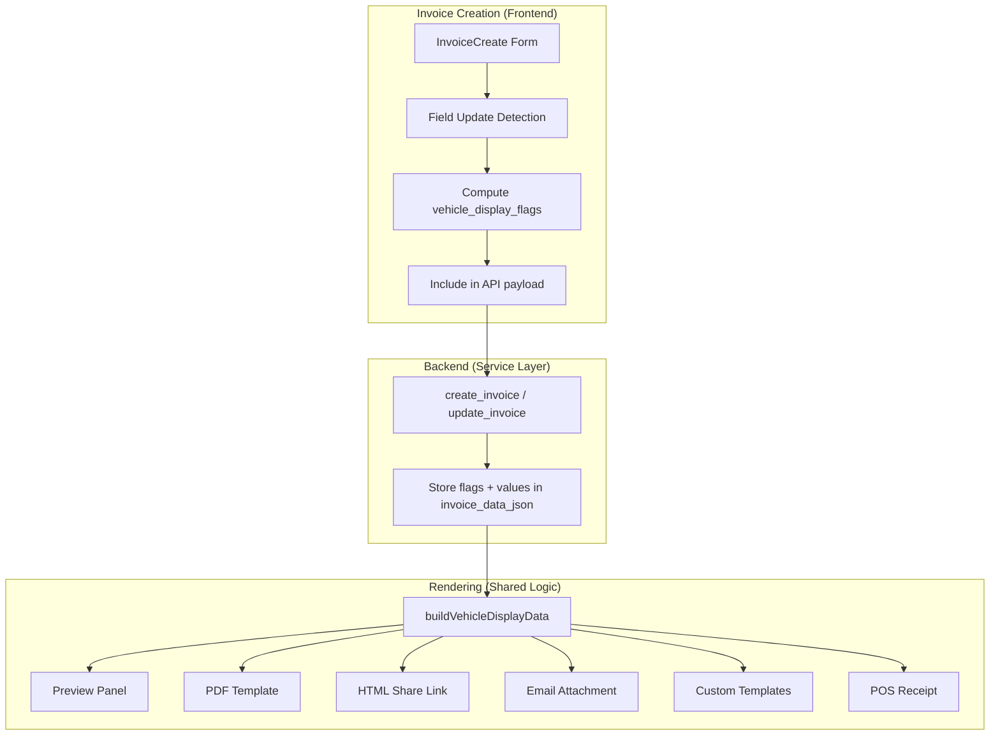

# Design Document: Invoice Vehicle Info Display

## Overview

This feature standardises how vehicle information is displayed on invoices across all rendering surfaces. It introduces:

1. A defined display order for vehicle fields (Registration → Vehicle → Odometer/Service Due → WOF/COF Expiry)
2. Conditional display of WOF/COF expiry and Service Due Date based on whether the user updated those fields during invoice creation
3. A form warning when the service due date is changed (reminding the user to update odometer)
4. Persistent storage of "updated during creation" flags and values in `invoice_data_json`

The core design principle is **self-contained invoice data**: each invoice stores all the vehicle display information it needs (flags + values) so that rendering never requires querying the vehicle record. This ensures historical invoices always render correctly regardless of future vehicle data changes.

## Architecture



The architecture has three layers:
- **Detection layer** (frontend): Compares user-entered values against vehicle record values to determine which fields were "updated"
- **Storage layer** (backend): Persists the flags and snapshot values in `invoice_data_json`
- **Rendering layer** (shared utility): A single pure function that takes invoice data and produces the vehicle display fields, used by all rendering surfaces

## Components and Interfaces

### 1. Vehicle Display Flags (stored in `invoice_data_json`)

A new `vehicle_display` key in `invoice_data_json` stores all vehicle rendering data:

```typescript
interface VehicleDisplayData {
  // Snapshot values at creation time
  rego: string | null
  make: string | null
  model: string | null
  year: number | null
  odometer: number | null
  inspection_type: 'wof' | 'cof' | null
  wof_expiry: string | null       // ISO date string
  cof_expiry: string | null       // ISO date string
  service_due_date: string | null  // ISO date string

  // Update flags — true means user changed this field during creation
  wof_updated: boolean
  cof_updated: boolean
  service_due_updated: boolean
}
```

### 2. Field Update Detection (Frontend)

```typescript
interface FieldUpdateDetectionInput {
  vehicleRecord: {
    wof_expiry: string | null
    cof_expiry: string | null
    service_due_date: string | null
  }
  userEntered: {
    wof_expiry: string | null
    cof_expiry: string | null
    service_due_date: string | null
  }
}

interface FieldUpdateDetectionOutput {
  wof_updated: boolean
  cof_updated: boolean
  service_due_updated: boolean
}
```

Detection logic:
- A field is "updated" if the user-entered value is non-empty AND differs from the vehicle record value
- A field is "not updated" if the user-entered value is empty, null, or identical to the vehicle record value
- Each field is evaluated independently

### 3. Vehicle Display Renderer (Shared Pure Function)

```typescript
interface VehicleDisplayField {
  label: string
  value: string
  hint?: string  // e.g. "or due at 125,000 km"
}

function buildVehicleDisplayFields(
  vehicleDisplay: VehicleDisplayData,
  issueDate: string  // ISO date for future/past comparison
): VehicleDisplayField[]
```

This function returns an ordered array of fields to display. The order is always:
1. Registration (if present)
2. Vehicle (make/model/year combined, if any component present)
3. Odometer OR Service Due Date (mutually exclusive — service due replaces odometer when `service_due_updated` is true)
4. WOF/COF Expiry (conditional on flags and date comparison)

Rules for conditional fields:
- **Service Due Date**: Shown only when `service_due_updated === true`. When shown, includes hint text "or due at {odometer + 10,000} km". Odometer row is omitted.
- **Odometer**: Shown only when `service_due_updated === false` and odometer has a value.
- **WOF Expiry**: Shown when `wof_updated === true` OR when `wof_updated === false` AND `wof_expiry > issueDate`
- **COF Expiry**: Shown when `cof_updated === true` OR when `cof_updated === false` AND `cof_expiry > issueDate`
- **Null/empty fields**: Any field with no value is omitted entirely (no blank row).

### 4. Backend Schema Changes

The `InvoiceCreateRequest` schema already accepts `vehicle_wof_expiry_date`, `vehicle_cof_expiry_date`, and `vehicle_service_due_date`. The new addition is the update flags:

```python
# Added to InvoiceCreateRequest
vehicle_wof_updated: bool = False
vehicle_cof_updated: bool = False
vehicle_service_due_updated: bool = False
```

The service layer stores these in `invoice_data_json.vehicle_display`:

```python
# In create_invoice / update_invoice
invoice_data_json["vehicle_display"] = {
    "rego": vehicle_rego,
    "make": vehicle_make,
    "model": vehicle_model,
    "year": vehicle_year,
    "odometer": vehicle_odometer,
    "inspection_type": inspection_type,
    "wof_expiry": vehicle_wof_expiry_date,
    "cof_expiry": vehicle_cof_expiry_date,
    "service_due_date": vehicle_service_due_date,
    "wof_updated": vehicle_wof_updated,
    "cof_updated": vehicle_cof_updated,
    "service_due_updated": vehicle_service_due_updated,
}
```

### 5. Frontend Form Warning Component

A small inline warning rendered below the Service Due Date field when the value differs from the vehicle record:

```tsx
{isServiceDueDateChanged && (
  <p className="mt-1 text-xs text-amber-600">
    Ensure you have updated the odometer reading too
  </p>
)}
```

The `isServiceDueDateChanged` boolean is computed as:
```typescript
const isServiceDueDateChanged = (
  v.newServiceDueDate != null &&
  v.newServiceDueDate !== '' &&
  v.newServiceDueDate !== (v.service_due_date ?? '')
)
```

### 6. Backward Compatibility

Existing invoices that don't have `vehicle_display` in their `invoice_data_json` fall back to the current behaviour:
- Display all available vehicle fields (rego, make/model/year, odometer)
- Show WOF/COF expiry if the vehicle object has it (using `getInspectionExpiry` helper)
- Never show service due date (since the flag doesn't exist, it defaults to `false`)

The `buildVehicleDisplayFields` function handles this gracefully:
```typescript
function buildVehicleDisplayFields(
  vehicleDisplay: VehicleDisplayData | null | undefined,
  issueDate: string,
  // Fallback fields from invoice columns (for backward compat)
  fallback?: {
    vehicle_rego?: string | null
    vehicle_make?: string | null
    vehicle_model?: string | null
    vehicle_year?: number | null
    vehicle_odometer?: number | null
    vehicle?: { wof_expiry?: string; cof_expiry?: string; inspection_type?: string } | null
  }
): VehicleDisplayField[]
```

When `vehicleDisplay` is null/undefined, the function uses the fallback fields and shows all available data without conditional logic (matching current behaviour).

## Data Models

### invoice_data_json Structure (Updated)

```json
{
  "payment_terms": "net_30",
  "terms_and_conditions": "...",
  "payment_gateway": "stripe",
  "additional_vehicles": [...],
  "fluid_usage": [...],
  "share_token": "...",
  "vehicle_display": {
    "rego": "ABC123",
    "make": "Toyota",
    "model": "Hilux",
    "year": 2019,
    "odometer": 85000,
    "inspection_type": "wof",
    "wof_expiry": "2026-08-15",
    "cof_expiry": null,
    "service_due_date": "2026-09-01",
    "wof_updated": true,
    "cof_updated": false,
    "service_due_updated": true
  }
}
```

No database migration is needed — `invoice_data_json` is a JSONB column that already exists. The new `vehicle_display` key is simply added to the JSON structure.

### API Response (InvoiceResponse)

The existing `InvoiceResponse` already returns `invoice_data_json` contents via individual fields. The `vehicle_display` data will be included in the response as a nested object:

```python
# Added to InvoiceResponse schema
vehicle_display: dict | None = None  # The full vehicle_display object from invoice_data_json
```

## Correctness Properties

*A property is a characteristic or behavior that should hold true across all valid executions of a system — essentially, a formal statement about what the system should do. Properties serve as the bridge between human-readable specifications and machine-verifiable correctness guarantees.*

### Property 1: Display order with null omission

*For any* invoice with vehicle display data, the `buildVehicleDisplayFields` function SHALL return fields in the order [Registration, Vehicle, Odometer/Service Due, WOF/COF Expiry], and any field with a null or empty value SHALL be omitted from the result (no entry in the returned array).

**Validates: Requirements 1.1, 1.3**

### Property 2: Inspection expiry conditional visibility

*For any* invoice with vehicle display data, the WOF/COF expiry field SHALL be included in the display output if and only if: (a) the corresponding `_updated` flag is `true`, OR (b) the `_updated` flag is `false` AND the expiry date is strictly after the invoice issue date. The label SHALL be "WOF Expiry" when `inspection_type !== 'cof'` and "COF Expiry" when `inspection_type === 'cof'`.

**Validates: Requirements 2.1, 2.2, 2.3, 2.4, 2.5, 2.6, 2.7**

### Property 3: Service due date replaces odometer when updated

*For any* invoice with vehicle display data where `service_due_updated === true`, the output SHALL contain a "Service Due" field and SHALL NOT contain a standalone "Odometer" field. Conversely, when `service_due_updated === false`, the output SHALL contain an "Odometer" field (if odometer has a value) and SHALL NOT contain a "Service Due" field.

**Validates: Requirements 3.1, 3.3**

### Property 4: Service due odometer hint calculation

*For any* invoice with vehicle display data where `service_due_updated === true` and `odometer` is a positive integer, the "Service Due" field's hint SHALL equal `"or due at {odometer + 10000} km"` using the invoice's stored `vehicle_odometer` value.

**Validates: Requirements 3.2, 3.4**

### Property 5: Field update detection correctness

*For any* pair of (vehicle record value, user-entered value) for WOF expiry, COF expiry, or service due date: the field SHALL be marked as "updated" if and only if the user-entered value is non-empty AND differs from the vehicle record value. Each of the three fields SHALL be evaluated independently (changing one does not affect the others).

**Validates: Requirements 5.1, 5.2, 5.3, 5.4**

### Property 6: Vehicle update flags and values storage round-trip

*For any* invoice creation payload containing vehicle display data (flags and values), after storage and retrieval, the `invoice_data_json.vehicle_display` object SHALL contain the exact same flag values and date/odometer values that were computed at creation time.

**Validates: Requirements 6.1, 6.4**

### Property 7: Form warning shown iff service due date changed

*For any* form state where the service due date input value differs from the vehicle record's `service_due_date` (and is non-empty), the warning message SHALL be rendered. For any form state where the values match or the input is empty, the warning SHALL NOT be rendered.

**Validates: Requirements 4.1, 4.2**

## Error Handling

| Scenario | Handling |
|----------|----------|
| `vehicle_display` missing from `invoice_data_json` (old invoices) | Fall back to current rendering behaviour using top-level invoice fields |
| `vehicle_display` has null/undefined fields | Omit those fields from display (no crash, no blank rows) |
| `odometer` is null when `service_due_updated` is true | Show service due date without the hint line |
| Invalid date strings in `wof_expiry`/`cof_expiry` | Treat as null — omit from display |
| Frontend sends flags without corresponding date values | Flags are stored but renderer treats null dates as "nothing to show" |
| `issue_date` is null (draft invoice) | Use current date for future/past comparison |

## Testing Strategy

### Property-Based Tests (Hypothesis)

The `buildVehicleDisplayFields` function is a pure function with clear input/output behaviour — ideal for property-based testing.

- **Library**: Hypothesis (Python) for backend logic, fast-check (TypeScript) for the shared frontend utility
- **Minimum iterations**: 100 per property
- **Tag format**: `Feature: invoice-vehicle-info-display, Property {N}: {title}`

Each of the 7 correctness properties above maps to a single property-based test.

### Unit Tests (Example-Based)

- Form warning renders with correct CSS classes (amber text, small size)
- Backward compatibility: invoice without `vehicle_display` renders using fallback fields
- Edge case: all vehicle fields null → empty array returned
- Edge case: odometer is 0 → treated as "no value" (omitted)
- Edge case: service_due_updated=true but service_due_date is null → no service due row shown
- Integration: API payload correctly includes flags when vehicle fields are changed

### Integration Tests

- Create invoice via API with vehicle field changes → verify `invoice_data_json.vehicle_display` is correctly populated
- Render invoice via preview panel, verify vehicle section matches expected output
- Verify existing invoices (without `vehicle_display`) still render correctly after code changes
