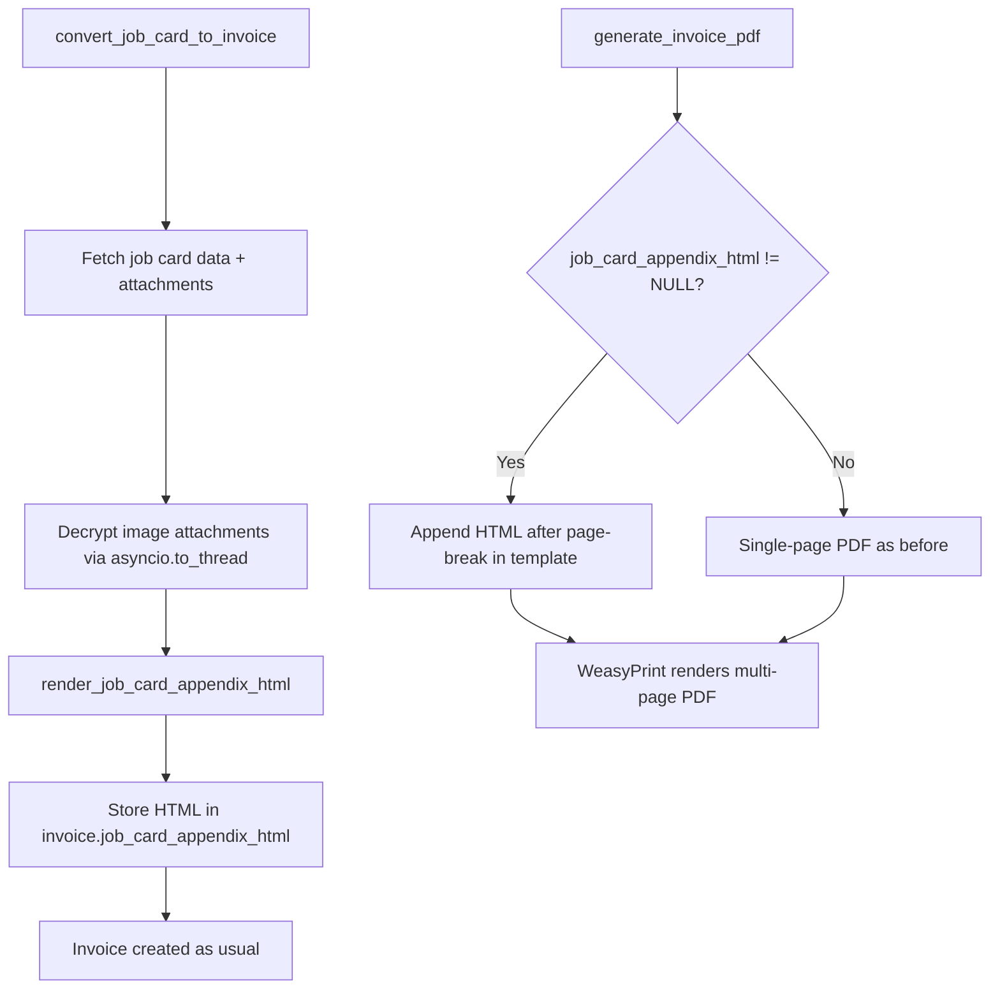
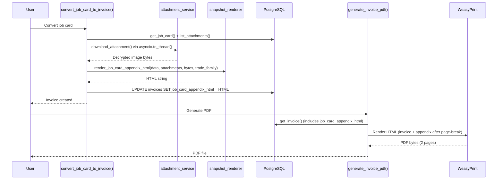

# Design Document: Job Card Invoice Appendix

## Overview

This feature adds a job card appendix page to invoice PDFs. When a completed job card is converted to an invoice, the system renders the job card data into a self-contained HTML fragment (with images base64-embedded) and stores it in a new `job_card_appendix_html` TEXT column on the `invoices` table. The existing WeasyPrint PDF pipeline then appends this HTML after a CSS page break, producing a two-page PDF.

The design follows a **snapshot-at-conversion-time** approach: the appendix HTML is rendered once during `convert_job_card_to_invoice()` and stored permanently. This ensures the appendix reflects the job card state at the moment of invoicing, avoids runtime database queries during PDF generation, and survives job card modifications or deletion.

### Key Design Decisions

| Decision | Rationale |
|----------|-----------|
| Store rendered HTML on invoice, not a reference to job card | Decouples PDF rendering from job card lifecycle; no runtime lookups or decryption needed |
| Base64-embed images in HTML | Self-contained HTML works in WeasyPrint without network/disk access at PDF time |
| Exclude `description` field | Internal work summary not intended for customer-facing documents |
| Jinja2 template for snapshot rendering | Consistent with existing PDF pipeline; autoescaping enabled for security |
| Trade family gating for vehicle section | Vehicle registration is automotive-specific; other trades don't have vehicle data |
| Graceful degradation on failure | Appendix rendering failure must never block invoice creation |

## Architecture

The feature touches three layers of the existing system:



### Integration Points

1. **Database layer**: New nullable TEXT column `job_card_appendix_html` on `invoices` table (Alembic migration)
2. **Conversion flow**: `convert_job_card_to_invoice()` in `app/modules/job_cards/service.py` — calls the snapshot renderer after creating the invoice, then updates the invoice record
3. **Snapshot renderer**: New function `render_job_card_appendix_html()` in `app/modules/job_cards/snapshot_renderer.py` — accepts job card data + attachment bytes, returns HTML string
4. **PDF pipeline**: `generate_invoice_pdf()` in `app/modules/invoices/service.py` — passes `job_card_appendix_html` to the Jinja2 template context
5. **Invoice template**: `app/templates/pdf/invoice.html` — conditionally renders the appendix HTML after a page break

### Compliance with Steering Docs

- **Trade family gating**: The snapshot renderer accepts a `trade_family` parameter. The vehicle registration section is only included when `trade_family == 'automotive-transport'`.
- **Database migration checklist**: After creating the Alembic migration, `alembic upgrade head` must be run inside the Docker container: `docker compose -f docker-compose.yml -f docker-compose.dev.yml exec app alembic upgrade head`
- **Performance & resilience**: Attachment decryption (synchronous disk I/O via `download_attachment()`) is wrapped in `asyncio.to_thread()` to avoid blocking the event loop. If snapshot rendering fails, the error is logged and the invoice is created with `job_card_appendix_html = NULL`.
- **Security hardening**: The appendix HTML never contains `file_key` paths, encryption keys, or internal identifiers. Jinja2 autoescaping is enabled. Only rendered content and base64 data URIs appear in the output.
- **No-shortcut implementations**: The existing `invoice.html` template is extended, not replaced. The appendix is appended after the existing footer with a `page-break-before: always` rule.

## Components and Interfaces

### 1. Snapshot Renderer — `app/modules/job_cards/snapshot_renderer.py`

New module containing the HTML rendering logic.

```python
async def render_job_card_appendix_html(
    job_card_data: dict,
    attachments: list[dict],
    attachment_bytes: dict[str, bytes],  # keyed by attachment id
    trade_family: str | None = None,
) -> str:
    """Render job card data into a self-contained HTML fragment.

    Args:
        job_card_data: Full job card dict as returned by get_job_card()
        attachments: List of attachment metadata dicts from list_attachments()
        attachment_bytes: Map of attachment_id -> decrypted file bytes (images only)
        trade_family: Organisation's trade family slug for conditional sections

    Returns:
        Self-contained HTML string with inline CSS and base64-embedded images
    """
```

**Template**: `app/templates/pdf/job_card_appendix.html` — a Jinja2 template with:
- Inline CSS matching the invoice template's font family and colour scheme
- Conditional sections for each data block (customer, vehicle, service type, line items, time entries, attachments, notes)
- Vehicle registration section gated by `trade_family == 'automotive-transport'`
- Base64 `` tags for image attachments
- Filename-only listing for PDF attachments
- Autoescaping enabled

**Behaviour**:
- Excludes the `description` field from the rendered output
- Omits sections with no data (no empty headers or blank space)
- For missing/failed image attachments, inserts a placeholder text: `[Image unavailable: {filename}]`
- If all attachments fail, omits the entire attachments section

### 2. Updated Conversion Flow — `app/modules/job_cards/service.py`

The `convert_job_card_to_invoice()` function is extended with these steps after creating the invoice:

```python
# After invoice_dict = await create_invoice(...)

# --- Appendix HTML generation (non-blocking) ---
appendix_html = None
try:
    from app.modules.job_cards.attachment_service import (
        list_attachments, download_attachment,
    )
    from app.modules.job_cards.snapshot_renderer import render_job_card_appendix_html

    # Fetch attachment metadata
    attachments = await list_attachments(db, org_id=org_id, job_card_id=job_card_id)

    # Decrypt image attachments (sync I/O wrapped in asyncio.to_thread)
    attachment_bytes = {}
    for att in attachments:
        if att["mime_type"].startswith("image/"):
            try:
                raw = await asyncio.to_thread(
                    download_attachment, org_id, att["file_key"]
                )
                attachment_bytes[str(att["id"])] = raw
            except Exception as e:
                logger.warning("Failed to decrypt attachment %s: %s", att["id"], e)

    # Fetch org trade_family for conditional rendering
    from app.modules.organisations.models import Organisation
    org_result = await db.execute(
        select(Organisation).where(Organisation.id == org_id)
    )
    org_obj = org_result.scalar_one_or_none()
    trade_family = (org_obj.settings or {}).get("trade_family") if org_obj else None

    # Render snapshot (exclude description)
    jc_data_for_snapshot = {k: v for k, v in jc_dict.items() if k != "description"}
    appendix_html = await render_job_card_appendix_html(
        job_card_data=jc_data_for_snapshot,
        attachments=attachments,
        attachment_bytes=attachment_bytes,
        trade_family=trade_family,
    )
except Exception:
    logger.exception("Failed to render job card appendix HTML for job_card=%s", job_card_id)
    appendix_html = None

# Store appendix HTML on the invoice record
if appendix_html is not None:
    from app.modules.invoices.models import Invoice as InvoiceModel
    inv_result = await db.execute(
        select(InvoiceModel).where(InvoiceModel.id == invoice_dict["id"])
    )
    inv_obj = inv_result.scalar_one_or_none()
    if inv_obj:
        inv_obj.job_card_appendix_html = appendix_html
        await db.flush()
```

### 3. Updated PDF Pipeline — `app/modules/invoices/service.py`

In `generate_invoice_pdf()`, the `job_card_appendix_html` value is passed to the template context:

```python
html_content = template.render(
    invoice=invoice_dict,
    org=org_context,
    customer=customer_context,
    currency_symbol=currency_symbol,
    gst_percentage=gst_percentage,
    payment_terms=payment_terms,
    terms_and_conditions=terms_and_conditions,
    colours=colour_context,
    job_card_appendix_html=invoice_dict.get("job_card_appendix_html"),  # NEW
    **i18n_ctx,
)
```

The `get_invoice()` service function already returns all invoice columns, so `job_card_appendix_html` will be included in `invoice_dict` once the model column exists.

### 4. Updated Invoice Template — `app/templates/pdf/invoice.html`

Appended before the closing `</body>` tag, after the existing footer:

```html
<!-- ============================================================ -->
<!--  JOB CARD APPENDIX (second page)                              -->
<!-- ============================================================ -->

<div style="page-break-before: always;"></div>
{{ job_card_appendix_html | safe }}

```

The `| safe` filter is used because the HTML was rendered by our own Jinja2 template with autoescaping — it is trusted content stored on the invoice record.

### 5. E2E Test Script — `scripts/test_job_card_invoice_appendix_e2e.py`

Per the feature testing workflow steering doc, an end-to-end test script that:
1. Logs in as org_admin
2. Creates a customer and job card with line items, time entries, and attachments
3. Completes the job card
4. Converts the job card to an invoice
5. Verifies the invoice has `job_card_appendix_html` populated (non-null)
6. Calls `generate_invoice_pdf()` and verifies the PDF has 2 pages
7. Cleans up test data

## Data Models

### Invoice Model Change

Add one new column to the `Invoice` model in `app/modules/invoices/models.py`:

```python
job_card_appendix_html: Mapped[str | None] = mapped_column(
    Text, nullable=True, comment="HTML snapshot of job card data for PDF appendix"
)
```

### Alembic Migration

Migration file: `alembic/versions/XXXX_add_job_card_appendix_html.py`

```python
def upgrade():
    op.add_column(
        "invoices",
        sa.Column("job_card_appendix_html", sa.Text(), nullable=True,
                   comment="HTML snapshot of job card data for PDF appendix"),
    )

def downgrade():
    op.drop_column("invoices", "job_card_appendix_html")
```

After creating the migration, run inside the Docker container:
```bash
docker compose -f docker-compose.yml -f docker-compose.dev.yml exec app alembic upgrade head
```

### Data Flow




## Correctness Properties

*A property is a characteristic or behavior that should hold true across all valid executions of a system — essentially, a formal statement about what the system should do. Properties serve as the bridge between human-readable specifications and machine-verifiable correctness guarantees.*

### Property 1: Round-trip content integrity

*For any* valid job card data dict containing a customer name, line item descriptions, time entry staff names, assigned staff name, notes text, and date values, rendering the appendix HTML and then extracting the text content from the HTML SHALL contain each of those values in the output.

**Validates: Requirements 2.3, 5.1, 5.3, 5.4, 5.5, 5.8, 5.9, 5.10, 7.1**

### Property 2: Description field exclusion

*For any* valid job card data dict with a non-empty `description` field, the rendered appendix HTML SHALL NOT contain the description field value anywhere in the output text.

**Validates: Requirements 2.2, 7.2**

### Property 3: Image attachment base64 embedding

*For any* valid job card data dict with N image attachments (where each attachment has corresponding decrypted bytes provided), the rendered appendix HTML SHALL contain exactly N `10 MB) | WeasyPrint may be slow but will still render; application logs a warning if size exceeds 10 MB |

## Testing Strategy

### Property-Based Tests (Hypothesis)

The snapshot renderer is a pure function (data in → HTML out) that is well-suited for property-based testing. Each correctness property above maps to a Hypothesis test.

**Library**: [Hypothesis](https://hypothesis.readthedocs.io/) (already used in the project — `.hypothesis/` directory exists)

**Configuration**: Minimum 100 iterations per property test (`@settings(max_examples=100)`)

**Tag format**: Each test is tagged with a comment referencing the design property:
```python
# Feature: job-card-invoice-appendix, Property 1: Round-trip content integrity
```

**Test file**: `tests/test_job_card_appendix_properties.py`

**Generator strategy**: A custom Hypothesis strategy generates valid job card data dicts with:
- Random customer names, emails, phones, addresses
- Random line items (0-10) with item_type, description, quantity, unit_price
- Random time entries (0-5) with staff_name, start/stop times, duration
- Random notes text
- Random service type name and field values
- Random attachment metadata with generated image bytes (small PNGs)
- Random vehicle_rego strings
- Random description strings (for exclusion testing)

### Unit Tests (pytest)

Specific examples and edge cases:

| Test | What it verifies |
|------|-----------------|
| `test_empty_job_card_renders` | Minimal job card (no line items, no time entries, no attachments) produces valid HTML |
| `test_missing_image_shows_placeholder` | Attachment metadata present but bytes missing → placeholder text in output |
| `test_all_images_missing_omits_section` | All attachment bytes missing → no attachments section in HTML |
| `test_no_time_entries_omits_section` | Empty time_entries → no time tracking section |
| `test_no_line_items_omits_section` | Empty line_items → no line items section |
| `test_no_service_type_omits_section` | service_type_name=None → no service type section |
| `test_appendix_header_text` | Output contains "Job Card Summary" header |
| `test_autoescaping_prevents_xss` | Customer name with `<script>` tag is escaped in output |

### Integration Tests

| Test | What it verifies |
|------|-----------------|
| `test_convert_stores_appendix_html` | `convert_job_card_to_invoice()` populates `job_card_appendix_html` on the invoice |
| `test_convert_with_failed_renderer` | Renderer exception → invoice created with NULL appendix |
| `test_pdf_with_appendix_has_two_pages` | `generate_invoice_pdf()` with non-null appendix → PDF has 2+ pages |
| `test_pdf_without_appendix_unchanged` | `generate_invoice_pdf()` with NULL appendix → single-page PDF |
| `test_malformed_appendix_still_produces_pdf` | Malformed HTML in appendix → valid PDF still generated |

### E2E Test Script

**File**: `scripts/test_job_card_invoice_appendix_e2e.py`

Per the feature testing workflow steering doc, this script:
1. Logs in as `demo@orainvoice.com`
2. Creates a customer
3. Creates a job card with line items
4. Completes the job card
5. Converts the job card to an invoice
6. Verifies the invoice has `job_card_appendix_html` populated
7. Generates the invoice PDF
8. Verifies the PDF has 2 pages (using PyPDF2 or similar)
9. Cleans up test data

Run with: `docker exec invoicing-app-1 python scripts/test_job_card_invoice_appendix_e2e.py`
