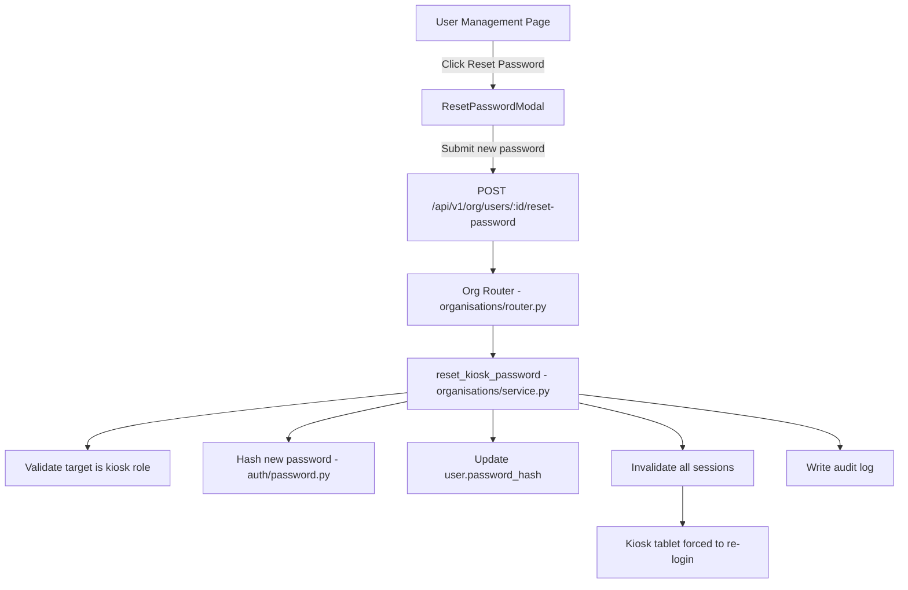
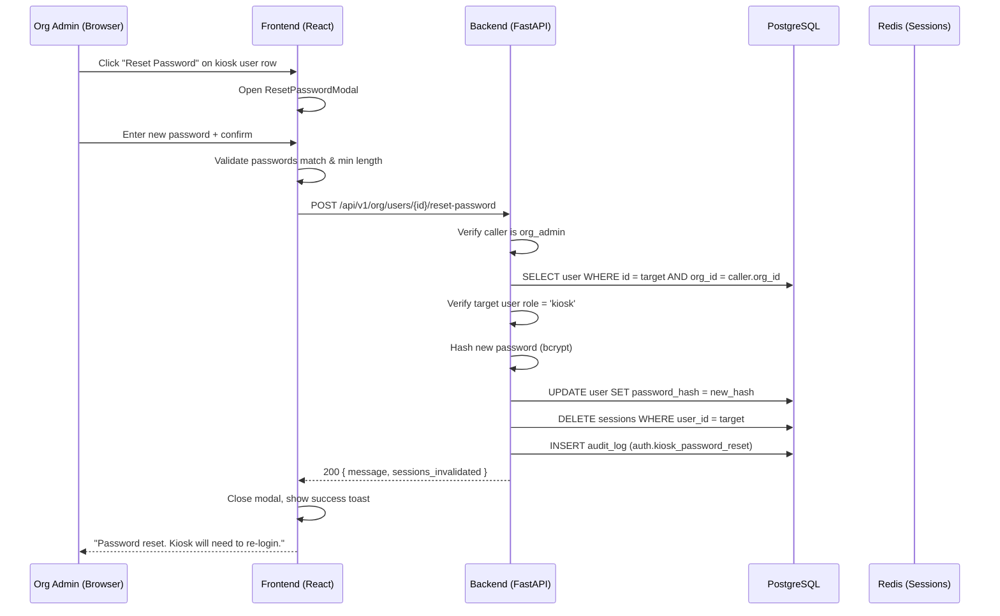

# Design Document: Kiosk User Password Reset by Org Admin

## Overview

This feature adds the ability for an org admin to reset a kiosk user's password directly from the User Management page. Currently, kiosk users are created with a password set at invite time, but there is no mechanism to change that password later without going through the self-service password reset flow (which requires email access that kiosk accounts may not actively monitor).

The implementation adds a "Reset Password" button to the kiosk user's action row in the User Management table, which opens a modal where the admin types a new password. The backend receives the new password, hashes it with bcrypt, updates the user record, and invalidates all active sessions for that kiosk user (forcing re-authentication on the tablet).

## Architecture



## Sequence Diagram



## Components and Interfaces

### Component 1: Backend Endpoint

**Purpose**: Accept a new password from an org admin and update the kiosk user's credentials.

**Interface**:
```python
# POST /api/v1/org/users/{target_user_id}/reset-password
# Router: app/modules/organisations/router.py
# Dependencies: require_role("org_admin")

@router.post(
    "/users/{target_user_id}/reset-password",
    response_model=KioskPasswordResetResponse,
    responses={
        400: {"description": "Validation error or target is not a kiosk user"},
        401: {"description": "Authentication required"},
        403: {"description": "Org_Admin role required"},
        404: {"description": "User not found in this organisation"},
    },
    summary="Reset password for a kiosk user",
    dependencies=[require_role("org_admin")],
)
async def reset_kiosk_password(
    target_user_id: str,
    payload: KioskPasswordResetRequest,
    request: Request,
    db: AsyncSession = Depends(get_db_session),
) -> KioskPasswordResetResponse: ...
```

**Responsibilities**:
- Validate the target user belongs to the same org as the caller
- Verify the target user has role "kiosk"
- Hash the new password and update the user record
- Invalidate all active sessions for the target user
- Write an audit log entry
- Return success with session invalidation count

### Component 2: Service Function

**Purpose**: Business logic for resetting a kiosk user's password.

**Interface**:
```python
# app/modules/organisations/service.py

async def reset_kiosk_user_password(
    db: AsyncSession,
    *,
    org_id: uuid.UUID,
    acting_user_id: uuid.UUID,
    target_user_id: uuid.UUID,
    new_password: str,
    ip_address: str | None = None,
) -> dict:
    """Reset the password for a kiosk user and invalidate their sessions.
    
    Returns: {"user_id": str, "sessions_invalidated": int}
    Raises: ValueError if target not found, not in org, or not a kiosk user.
    """
```

**Responsibilities**:
- Query the target user and validate org membership + kiosk role
- Hash the new password using `hash_password()`
- Update `user.password_hash` in the database
- Delete all active sessions for the target user
- Write audit log with action `auth.kiosk_password_reset`
- Return result dict

### Component 3: Frontend Modal (ResetPasswordModal)

**Purpose**: UI for the org admin to enter and confirm a new password for the kiosk user.

**Interface**:
```typescript
// frontend/src/pages/settings/UserManagement.tsx (inline or extracted)

interface ResetPasswordModalProps {
  open: boolean
  onClose: () => void
  userId: string
  userEmail: string
  onSuccess: () => void
}
```

**Responsibilities**:
- Display a modal with password and confirm password fields
- Validate minimum 8 characters and passwords match (client-side)
- Submit to `POST /api/v1/org/users/{id}/reset-password`
- Show success toast on completion
- Show error toast on failure

### Component 4: Reset Password Button

**Purpose**: Action button in the User Management table for kiosk users.

**Placement**: In the actions column, alongside "Revoke Sessions", "Deactivate", and "Delete" buttons — only visible for active kiosk users.

## Data Models

### Request Schema

```python
class KioskPasswordResetRequest(BaseModel):
    """POST /api/v1/org/users/{id}/reset-password request body."""

    new_password: str = Field(
        ...,
        min_length=8,
        max_length=128,
        description="New password for the kiosk user (min 8 characters)",
    )
```

**Validation Rules**:
- `new_password` must be between 8 and 128 characters
- No old password required (admin override)
- No HIBP check (kiosk passwords are set by admin, not user-chosen)

### Response Schema

```python
class KioskPasswordResetResponse(BaseModel):
    """POST /api/v1/org/users/{id}/reset-password response."""

    message: str = Field(..., description="Success message")
    user_id: str = Field(..., description="UUID of the user whose password was reset")
    sessions_invalidated: int = Field(0, description="Number of sessions terminated")
```

## Key Functions with Formal Specifications

### Function: reset_kiosk_user_password()

```python
async def reset_kiosk_user_password(
    db: AsyncSession,
    *,
    org_id: uuid.UUID,
    acting_user_id: uuid.UUID,
    target_user_id: uuid.UUID,
    new_password: str,
    ip_address: str | None = None,
) -> dict:
```

**Preconditions:**
- `org_id` is a valid UUID of an existing organisation
- `acting_user_id` is a valid UUID of an org_admin user in the same org
- `target_user_id` is a valid UUID
- `new_password` is a non-empty string with length >= 8

**Postconditions:**
- If target user exists, belongs to org, has role "kiosk", and is active:
  - `user.password_hash` is updated to bcrypt hash of `new_password`
  - All sessions for `target_user_id` are deleted from the sessions table
  - An audit log entry is written with action `auth.kiosk_password_reset`
  - Returns `{"user_id": str(target_user_id), "sessions_invalidated": N}`
- If target user not found or not in org: raises `ValueError("User not found")`
- If target user role != "kiosk": raises `ValueError("Password reset is only allowed for kiosk users")`
- If target user is inactive: raises `ValueError("Cannot reset password for inactive user")`

**Loop Invariants:** N/A (no loops)

## Algorithmic Pseudocode

### Password Reset Algorithm

```python
ALGORITHM reset_kiosk_user_password(db, org_id, acting_user_id, target_user_id, new_password, ip_address)
INPUT: db session, org_id UUID, acting_user_id UUID, target_user_id UUID, new_password str
OUTPUT: dict with user_id and sessions_invalidated count

BEGIN
    # Step 1: Fetch and validate target user
    user = SELECT * FROM users WHERE id = target_user_id AND org_id = org_id
    
    IF user IS NULL THEN
        RAISE ValueError("User not found")
    END IF
    
    IF user.role != "kiosk" THEN
        RAISE ValueError("Password reset is only allowed for kiosk users")
    END IF
    
    IF user.is_active == False THEN
        RAISE ValueError("Cannot reset password for inactive user")
    END IF
    
    # Step 2: Hash and update password
    new_hash = bcrypt.hashpw(new_password, bcrypt.gensalt())
    user.password_hash = new_hash
    db.flush()
    
    # Step 3: Invalidate all sessions
    result = DELETE FROM sessions WHERE user_id = target_user_id
    sessions_count = result.rowcount
    db.flush()
    
    # Step 4: Write audit log
    write_audit_log(
        db, org_id, acting_user_id,
        action="auth.kiosk_password_reset",
        entity_type="user",
        entity_id=target_user_id,
        after_value={"target_email": user.email},
        ip_address=ip_address
    )
    
    RETURN {"user_id": str(target_user_id), "sessions_invalidated": sessions_count}
END
```

## Example Usage

### Backend endpoint call:
```python
# POST /api/v1/org/users/550e8400-e29b-41d4-a716-446655440000/reset-password
# Headers: Authorization: Bearer <org_admin_jwt>
# Body: {"new_password": "NewKioskPass123"}

# Response 200:
# {"message": "Password reset successfully", "user_id": "550e8400-...", "sessions_invalidated": 2}
```

### Frontend usage:
```typescript
// In UserManagement.tsx actions column for kiosk users
const resetKioskPassword = async (userId: string, newPassword: string) => {
  await apiClient.post(`/org/users/${userId}/reset-password`, {
    new_password: newPassword,
  })
  addToast('success', 'Password reset. Kiosk will need to re-login.')
  fetchData()
}
```

## Correctness Properties

1. **Role Restriction**: For any user U where U.role ≠ "kiosk", a password reset request targeting U must return a 400 error — the endpoint must never modify passwords for non-kiosk users.

2. **Org Isolation**: For any target user T and calling admin A, if T.org_id ≠ A.org_id, the request must return 404 — an admin must never be able to reset passwords for users in other organisations.

3. **Session Invalidation Completeness**: After a successful password reset for user U, the count of active sessions for U in the database must be 0 — all sessions must be terminated.

4. **Password Hash Validity**: After a successful reset with password P, `verify_password(P, user.password_hash)` must return True — the stored hash must correctly verify against the new password.

5. **Audit Trail Completeness**: Every successful password reset must produce exactly one audit log entry with action `auth.kiosk_password_reset`, the acting admin's user_id, and the target user's entity_id.

## Error Handling

### Error Scenario 1: Target is not a kiosk user

**Condition**: Admin attempts to reset password for a user with role other than "kiosk"
**Response**: 400 `{"detail": "Password reset is only allowed for kiosk users"}`
**Recovery**: No action needed — inform admin this action is kiosk-only

### Error Scenario 2: Target user not found or wrong org

**Condition**: The target_user_id doesn't exist or belongs to a different organisation
**Response**: 404 `{"detail": "User not found"}`
**Recovery**: No action needed — prevents information leakage about other orgs

### Error Scenario 3: Password too short

**Condition**: New password is less than 8 characters
**Response**: 422 (Pydantic validation) `{"detail": [{"msg": "String should have at least 8 characters"}]}`
**Recovery**: Frontend validates before submission; backend validates as safety net

### Error Scenario 4: Target user is inactive

**Condition**: Admin tries to reset password for a deactivated kiosk user
**Response**: 400 `{"detail": "Cannot reset password for inactive user"}`
**Recovery**: Admin should reactivate the user first if needed

## Testing Strategy

### Unit Testing Approach

- Test service function with mocked DB for all validation paths (not found, wrong role, inactive)
- Test successful password reset updates hash and invalidates sessions
- Test audit log is written on success

### Property-Based Testing Approach

**Property Test Library**: Hypothesis (Python backend)

- **Property 1 (Role Restriction)**: Generate random role strings; verify only "kiosk" passes validation
- **Property 2 (Password Hash Validity)**: Generate random passwords (8-128 chars); verify hash_password → verify_password roundtrip

### Integration Testing Approach

- Test full endpoint with authenticated org_admin calling reset on a kiosk user
- Test endpoint rejects non-org_admin callers (403)
- Test endpoint rejects cross-org attempts (404)

## Security Considerations

- **Authorization**: Only org_admin role can call this endpoint (enforced by `require_role("org_admin")`)
- **Org isolation**: Target user must belong to the same org as the caller (prevents cross-tenant attacks)
- **Role restriction**: Only kiosk users can have their password reset this way (prevents admin from resetting other admin passwords)
- **Session invalidation**: All existing sessions are terminated after reset (prevents continued access with old credentials)
- **Audit logging**: Every reset is logged with the acting admin's identity for accountability
- **No old password required**: This is intentional — the admin is performing an override, not a self-service change
- **Password length**: Minimum 8 characters enforced by Pydantic schema validation

## Dependencies

- `bcrypt` — Password hashing (already in use)
- `app/modules/auth/password.py` — `hash_password()` function
- `app/modules/auth/service.py` — `write_audit_log()` function
- `app/modules/organisations/router.py` — Existing org router (add new endpoint)
- `app/modules/organisations/service.py` — Existing org service (add new function)
- `app/modules/organisations/schemas.py` — Existing schemas (add new request/response)
- `frontend/src/components/ui/Modal` — Existing Modal component
- `frontend/src/components/ui/Input` — Existing Input component
- `frontend/src/components/ui/Button` — Existing Button component
