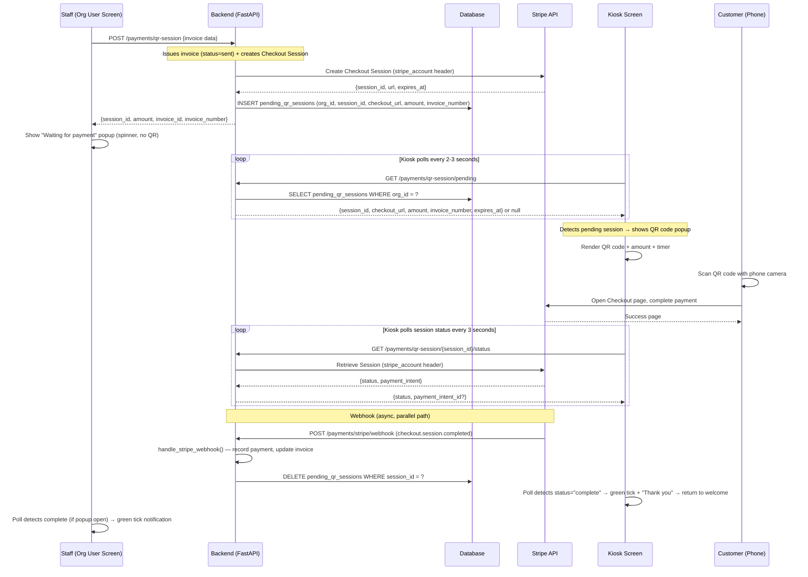

# Design Document: Kiosk QR Payment

## Overview

This feature adds QR code–based payment to the invoice creation and kiosk workflows. When a staff member clicks "QR Payment" on the InvoiceCreate page, the system issues the invoice AND creates a Stripe Checkout Session in one action. The org user sees a "waiting for payment" popup (no QR code — just a spinner). The kiosk screen, which continuously polls for pending QR sessions, detects the new session and displays the QR code. The customer scans the QR code with their phone, pays via Stripe Checkout, and both screens update automatically.

**Key design decisions:**
- "QR Payment" button on InvoiceCreate issues invoice + creates Checkout Session in one API call
- QR code displays ONLY on the kiosk screen (customer-facing), NOT on the org user's screen
- Kiosk discovers pending sessions via lightweight polling endpoint (`GET /api/v1/payments/qr-session/pending`)
- Pending QR session stored in a DB table (`pending_qr_sessions`) scoped to org — simple, no Redis dependency
- Reuse the existing webhook handler (`handle_stripe_webhook`) — QR payments flow through the same `checkout.session.completed` event
- Frontend QR generation uses a client-side library (`qrcode.react`) — no server-side QR rendering
- No new Stripe configuration needed per org — uses existing Connect integration

## Architecture



### Dual Recording Paths

Payment recording happens via **two independent, idempotent paths**:

1. **Webhook path** (primary, reliable): Stripe sends `checkout.session.completed` → existing `handle_stripe_webhook()` records payment. Works even if kiosk loses connection.
2. **Poll-detected path** (UX only): Frontend detects completion via polling. Does NOT record the payment — it only updates the UI. The webhook is the authoritative recorder.

This means the frontend poll endpoint is read-only. It never writes payment records. The webhook handler's existing idempotency check (`stripe_payment_intent_id` uniqueness) prevents duplicates regardless of timing.

## Components and Interfaces

### Backend API Endpoints

#### 1. Create QR Payment Session (Issue Invoice + Create Checkout)

```
POST /api/v1/payments/qr-session
Authorization: Bearer token (org_admin, salesperson)
```

**Request:**
```json
{
  "customer_id": "uuid",
  "items": [...],
  "subject": "...",
  "notes_customer": "...",
  "terms_and_conditions": "...",
  "discount_type": "percent" | "fixed",
  "discount_value": 0,
  "shipping_charges": 0,
  "adjustment": 0,
  "salesperson_id": "uuid | null",
  "global_vehicle_id": "uuid | null",
  "vehicle_odometer": null
}
```

*Note: This is the same payload as InvoiceCreate's save action, but the endpoint issues the invoice (status="sent") and creates the Checkout Session in one call.*

**Response (201):**
```json
{
  "session_id": "cs_...",
  "invoice_id": "uuid",
  "invoice_number": "INV-2026-001",
  "amount": 125.50,
  "amount_cents": 12550,
  "expires_at": "2026-05-08T14:30:00Z"
}
```

**Error responses:**
- 400: Invalid invoice data (validation errors)
- 400: Stripe Connect not configured for org
- 502: Stripe API error (with descriptive message)

**Implementation:** New function `create_qr_payment_session()` in `app/modules/payments/service.py` that:
1. Creates the invoice using existing `create_invoice()` with status="sent"
2. Fetches org's `stripe_connect_account_id`
3. Calculates application fee via `get_application_fee_percent()`
4. Calls Stripe API to create Checkout Session with:
   - `payment_method_types`: `["card", "afterpay_clearpay"]`
   - `expires_at`: current time + 30 minutes
   - `metadata`: `{invoice_id, org_id, platform: "orainvoice", source: "kiosk_qr"}`
   - `payment_intent_data.application_fee_amount`: calculated fee
   - `success_url`: `{base_url}/payments/qr-success?invoice_id={id}&session_id={CHECKOUT_SESSION_ID}`
   - `cancel_url`: `{base_url}/payments/qr-cancel?invoice_id={id}`
5. Stores pending QR session in `pending_qr_sessions` table
6. Returns session details to frontend

#### 2. Get Pending QR Session (Kiosk Polling Endpoint)

```
GET /api/v1/payments/qr-session/pending
Authorization: Bearer token (org_admin, salesperson, kiosk)
```

**Response (200) — session exists:**
```json
{
  "session_id": "cs_...",
  "checkout_url": "https://checkout.stripe.com/c/pay/cs_...",
  "amount": 125.50,
  "invoice_number": "INV-2026-001",
  "expires_at": "2026-05-08T14:30:00Z",
  "created_at": "2026-05-08T14:00:00Z"
}
```

**Response (200) — no session:**
```json
{
  "session": null
}
```

**Implementation:** Queries `pending_qr_sessions` table for the requesting user's org. Returns the active session if one exists, or null. Lightweight — no Stripe API calls.

#### 3. Check Session Status (Polling Endpoint)

```
GET /api/v1/payments/qr-session/{session_id}/status
Authorization: Bearer token (org_admin, salesperson, kiosk)
```

**Response (200):**
```json
{
  "status": "open" | "complete" | "expired",
  "payment_intent_id": "pi_..." | null
}
```

**Implementation:** Calls Stripe API: `GET /v1/checkout/sessions/{session_id}` with `stripe_account` header. Uses the requesting org's `stripe_connect_account_id`. Returns simplified status.

#### 4. Expire/Cancel Session

```
POST /api/v1/payments/qr-session/{session_id}/expire
Authorization: Bearer token (org_admin, salesperson)
```

**Response (200):**
```json
{
  "status": "expired"
}
```

**Implementation:** Calls Stripe API to expire the session, then deletes the `pending_qr_sessions` row. If session is already expired/complete, handles gracefully.

### Frontend Components

#### KioskQrPopup (on Kiosk Screen)

**Location:** `frontend/src/pages/kiosk/KioskQrPopup.tsx`

**Props:**
```typescript
interface KioskQrPopupProps {
  session: {
    session_id: string
    checkout_url: string
    amount: number
    invoice_number: string
    expires_at: string
  }
  onPaymentComplete: () => void
  onExpired: () => void
}
```

**Behavior:**
- Renders full-screen overlay with QR code, amount, invoice number, scan instructions
- Starts countdown timer from `expires_at`
- Polls `GET /payments/qr-session/{session_id}/status` every 3 seconds
- On "complete": shows green tick + "Thank you" + amount for 4 seconds, then calls `onPaymentComplete`
- On timer expiry: calls `onExpired` (kiosk returns to welcome)
- Warning colour on timer when < 2 minutes

#### KioskPage Enhancement

The existing `KioskPage.tsx` gains a polling loop that checks for pending QR sessions:
- While on the `welcome` screen, polls `GET /payments/qr-session/pending` every 2-3 seconds
- When a pending session is detected, overlays `KioskQrPopup` on top of the welcome screen
- When payment completes or expires, removes the popup and continues showing welcome

#### QrPaymentWaitingPopup (on Org User Screen)

**Location:** `frontend/src/pages/invoices/QrPaymentWaitingPopup.tsx`

**Props:**
```typescript
interface QrPaymentWaitingPopupProps {
  sessionId: string
  amount: number
  invoiceNumber: string
  onClose: () => void
  onPaymentComplete: () => void
}
```

**Behavior:**
- Shows spinner + "Waiting for payment..." text
- Shows amount and invoice number for reference
- Has a "Close" button (dismisses popup, does NOT cancel payment)
- Polls session status every 3 seconds
- On "complete": shows green tick + "Payment received — $X.XX" for 3 seconds, then calls `onPaymentComplete`
- On unmount: clears polling interval

#### Integration Point: InvoiceCreate Page

The InvoiceCreate page gains a "QR Payment" button in the action bar:
- Visible only when `org.stripe_connect_account_id` is set (from `useTenant()`)
- On click: validates form, calls `POST /payments/qr-session` with the invoice payload
- On success: opens `QrPaymentWaitingPopup` with the returned session details
- On payment complete: navigates to invoice detail page

## Data Models

### New Table: `pending_qr_sessions`

| Column | Type | Description |
|--------|------|-------------|
| `id` | UUID | Primary key |
| `org_id` | UUID | FK to organisations, indexed |
| `session_id` | VARCHAR(255) | Stripe Checkout Session ID |
| `checkout_url` | TEXT | Full Stripe Checkout URL |
| `amount` | NUMERIC(12,2) | Payment amount in NZD |
| `invoice_number` | VARCHAR(50) | Invoice number for display |
| `invoice_id` | UUID | FK to invoices |
| `expires_at` | TIMESTAMPTZ | When the session expires |
| `created_at` | TIMESTAMPTZ | When the session was created |

**Constraints:**
- UNIQUE on `org_id` (one active session per org)
- UNIQUE on `session_id`

**Cleanup:** Rows are deleted when:
1. Payment completes (webhook clears it)
2. Session is manually expired/cancelled
3. A new session is created for the same org (replaces the old one)

### Existing Table: `payments`

QR payments are recorded in the existing `payments` table:

| Field | Value for QR payments |
|-------|----------------------|
| `method` | `'stripe'` (existing CHECK constraint) |
| `payment_method_type` | `'qr_checkout'` (new value, VARCHAR(50) — no migration needed) |
| `stripe_payment_intent_id` | The PI ID from the completed session |
| `recorded_by` | Set by webhook handler |
| `surcharge_amount` | `0.00` (no surcharge on QR payments) |

### Webhook Handler Enhancement

The existing `handle_stripe_webhook()` function needs a minor enhancement:

```python
# In handle_stripe_webhook(), after extracting metadata:
source = metadata.get("source", "payment_link")
if source == "kiosk_qr":
    payment_method_type = "qr_checkout"
    # Also clear the pending_qr_session for this org
    await clear_pending_qr_session(db, org_id=metadata.get("org_id"), session_id=session_id)
else:
    payment_method_type = surcharge_method or None
```

## Correctness Properties

### Property 1: QR Payment Button Visibility

*For any* organisation, the "QR Payment" button SHALL be visible on InvoiceCreate if and only if the organisation has a non-empty `stripe_connect_account_id`.

**Validates: Requirements 1.1, 1.2**

### Property 2: Connected Account Isolation

*For any* organisation with a `stripe_connect_account_id`, all Stripe API calls made by the QR payment service (session creation, status check, expiry) SHALL include that organisation's account ID as the `stripe_account` parameter, and the status endpoint SHALL return 404/error for session IDs not belonging to the requesting organisation's connected account.

**Validates: Requirements 10.1, 10.3, 11.2**

### Property 3: Amount Conversion Accuracy

*For any* invoice with a total value T (where T > 0), the Checkout Session `amount_total` SHALL equal `int(T * 100)` (conversion from NZD dollars to cents with no floating-point drift).

**Validates: Requirements 2.2**

### Property 4: Application Fee Calculation

*For any* payment amount A (in cents) and platform fee percentage P (where P >= 0), the `application_fee_amount` on the Checkout Session SHALL equal `int(A * P / 100)`.

**Validates: Requirements 2.4**

### Property 5: Session Metadata Completeness

*For any* created QR Checkout Session, the session metadata SHALL contain `invoice_id` (matching the source invoice UUID), `org_id` (matching the organisation UUID), and `source` equal to `"kiosk_qr"`. The `success_url` SHALL contain the invoice_id, and the `cancel_url` SHALL contain the invoice_id.

**Validates: Requirements 2.5, 2.6, 2.8**

### Property 6: Pending Session Org Scoping

*For any* org_id, there SHALL be at most one row in `pending_qr_sessions` with that org_id at any time. Creating a new session for an org SHALL replace any existing pending session for that org.

**Validates: Requirements 3.2, 4.2**

### Property 7: Timer Display and Warning State

*For any* remaining time T in seconds (where T >= 0), the countdown timer SHALL display as `MM:SS` format (zero-padded). *For any* T < 120, the timer SHALL have warning styling applied. *For any* T >= 120, the timer SHALL have normal styling.

**Validates: Requirements 6.1, 6.3**

### Property 8: Idempotent Payment Recording

*For any* `stripe_payment_intent_id` that already exists in the payments table, processing a duplicate `checkout.session.completed` webhook event SHALL NOT create a new payment record (the existing record is returned/acknowledged instead).

**Validates: Requirements 8.2**

### Property 9: Complete Session Response Includes Payment Intent

*For any* Checkout Session with status `"complete"`, the status endpoint response SHALL include a non-null `payment_intent_id`. *For any* session with status `"open"` or `"expired"`, the `payment_intent_id` SHALL be null.

**Validates: Requirements 11.4**

### Property 10: Currency Formatting

*For any* numeric amount value, the QR displays SHALL show it formatted as NZD currency with a `$` prefix and exactly 2 decimal places (e.g., `$0.01`, `$1,234.56`).

**Validates: Requirements 5.3**

## Error Handling

### Backend Errors

| Scenario | HTTP Status | Response | Frontend Behavior |
|----------|-------------|----------|-------------------|
| Invoice validation fails | 400 | `{"detail": "...validation errors..."}` | Show error toast |
| Stripe Connect not configured | 400 | `{"detail": "Stripe Connect not configured for this organisation"}` | Show error, hide QR button |
| Stripe API error (rate limit, network) | 502 | `{"detail": "Payment service temporarily unavailable"}` | Show retry button |
| Stripe API error (invalid request) | 400 | `{"detail": "Failed to create payment session: <stripe message>"}` | Show error toast |
| Session not found on status check | 404 | `{"detail": "Session not found"}` | Stop polling |
| No pending session for org | 200 | `{"session": null}` | Continue polling (normal state) |

### Frontend Error Handling

| Scenario | Behavior |
|----------|----------|
| QR session creation fails | Show error toast on InvoiceCreate, don't open popup |
| Kiosk pending-session poll fails (network) | Silently retry on next interval |
| Kiosk status poll fails (network) | Silently retry on next interval |
| Kiosk status poll fails (401/403) | Stop polling, dismiss popup |
| Component unmounts during poll | AbortController cancels in-flight request |

### Edge Cases

1. **Customer pays after session expires on kiosk:** The Stripe session has its own 30-minute expiry. If the customer opened the checkout page before the timer expired on the kiosk, they can still complete payment. The webhook records it regardless of kiosk state.

2. **Kiosk loses network during payment:** Webhook records the payment server-side. When kiosk reconnects, the pending session will be gone (cleared by webhook), and the kiosk returns to normal.

3. **Multiple QR sessions for same org:** The `pending_qr_sessions` table has a UNIQUE constraint on `org_id`. Creating a new session replaces the old one. The old Stripe session remains valid until its natural expiry but won't be displayed on the kiosk.

4. **Staff closes waiting popup then creates another QR payment:** The new session replaces the old pending session. The kiosk switches to displaying the new QR code.

5. **Org user navigates away from InvoiceCreate:** The payment session remains active. The kiosk continues showing the QR code. Payment can still complete via webhook.

## Testing Strategy

### Property-Based Tests (Hypothesis)

The following properties will be tested using Hypothesis with minimum 100 iterations each:

- **Property 3** (Amount conversion): Generate random Decimal values, verify `int(amount * 100)` conversion
- **Property 4** (Fee calculation): Generate random amounts and percentages, verify fee formula
- **Property 5** (Metadata completeness): Generate random UUIDs, verify metadata dict construction
- **Property 7** (Timer formatting): Generate random seconds 0–3600, verify MM:SS format and warning threshold
- **Property 8** (Idempotency): Generate random payment events, verify no duplicates created
- **Property 10** (Currency formatting): Generate random floats, verify NZD format output

**Library:** Hypothesis (already used in this project — see `.hypothesis/` directory)
**Config:** Minimum 100 examples per test, deadline=None for async tests

### Unit Tests (pytest)

- QR session creation with valid/invalid invoice data
- Pending session storage and retrieval (org scoping)
- Status endpoint authorization (org isolation)
- Expire endpoint behavior for various session states
- Webhook handler with `source: "kiosk_qr"` metadata
- Pending session cleanup on payment complete

### Frontend Unit Tests (Vitest)

- KioskQrPopup renders QR code, timer, amount
- KioskQrPopup polling starts/stops correctly
- KioskPage polls for pending sessions and shows popup
- QrPaymentWaitingPopup shows spinner, handles close
- QrPaymentWaitingPopup detects payment complete
- InvoiceCreate shows/hides QR Payment button based on Stripe Connect status

### Integration Tests

- Full flow: create QR session → mock Stripe responses → kiosk detects → poll status → detect complete
- Webhook processing of QR-originated checkout.session.completed event
- Pending session cleanup after payment
