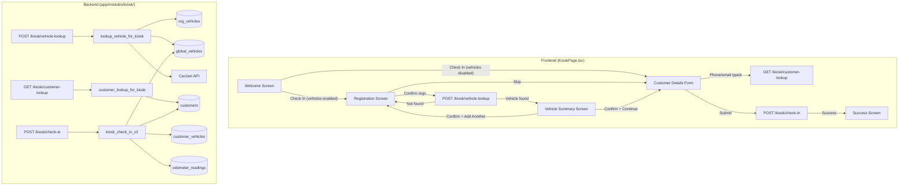
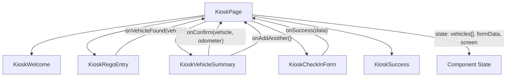

# Design Document: Kiosk Vehicle Check-In

## Overview

This feature enhances the existing kiosk check-in flow with a multi-step vehicle registration lookup experience. When the "vehicles" module is enabled for an organisation, customers see a registration entry screen between the welcome screen and the customer details form. The system performs a cascading vehicle lookup (org DB → global DB → CarJam API), displays vehicle details for confirmation, supports optional odometer entry, allows adding multiple vehicles per session, and links all confirmed vehicles to the customer record upon check-in completion.

The design preserves the existing customer details form exactly as-is, adding only a gated preceding vehicle step. A new auto-fill feature on the customer details screen recognises returning customers by phone or email and pre-populates their details.

### Key Design Decisions

1. **Frontend state machine expansion**: The `KioskPage` screen state machine expands from `welcome → form → success` to `welcome → rego → vehicle-summary → form → success`, with conditional transitions based on module gating.
2. **New kiosk-scoped endpoints**: Two new backend endpoints (`POST /kiosk/vehicle-lookup` and `GET /kiosk/customer-lookup`) provide kiosk-role-accessible versions of existing functionality without exposing org_admin/salesperson-only routes.
3. **Enhanced check-in payload**: The existing `POST /kiosk/check-in` endpoint is enhanced to accept a list of vehicle entries (each with `global_vehicle_id` and optional `odometer_km`) alongside customer details.
4. **Component-level state preservation**: All vehicle and form data lives in `KioskPage` component state, passed down to child screens, ensuring navigation between steps preserves progress.

## Architecture



### Component Hierarchy



## Components and Interfaces

### Frontend Components

#### KioskPage (enhanced)

The orchestrator component. Manages the screen state machine and holds all session data.

```typescript
// New screen states
type KioskScreen = 'welcome' | 'rego' | 'vehicle-summary' | 'form' | 'success' | 'error'

// Vehicle entry collected during the session
interface KioskVehicleEntry {
  global_vehicle_id: string
  rego: string
  make: string | null
  model: string | null
  body_type: string | null
  year: number | null
  wof_expiry: string | null
  rego_expiry: string | null
  last_odometer: number | null
  odometer_km: number | null  // customer-entered value
}

// Session state held in KioskPage
interface KioskSessionState {
  screen: KioskScreen
  vehicles: KioskVehicleEntry[]
  currentLookupResult: VehicleLookupResult | null
  formData: KioskFormData
  successData: KioskSuccessData | null
}
```

#### KioskRegoEntry (new)

Dedicated registration number input screen with kiosk-optimised touch targets.

```typescript
interface KioskRegoEntryProps {
  vehicleCount: number  // shows "X vehicles added" badge
  onVehicleFound: (result: VehicleLookupResult) => void
  onSkip: () => void
  onBack: () => void
}
```

#### KioskVehicleSummary (new)

Displays looked-up vehicle details and optional odometer input.

```typescript
interface KioskVehicleSummaryProps {
  vehicle: VehicleLookupResult
  vehicleCount: number
  onConfirm: (odometer_km: number | null) => void
  onAddAnother: () => void
  onBack: () => void
}
```

#### KioskCheckInForm (enhanced)

The existing form gains a debounced customer auto-fill lookup. The form fields, validation, and submit behaviour remain identical.

```typescript
// New addition: auto-fill suggestion
interface AutoFillSuggestion {
  id: string
  first_name: string
  last_name: string
  phone: string
  email: string | null
}
```

### Backend Endpoints

#### POST /kiosk/vehicle-lookup (new)

Kiosk-role-accessible vehicle lookup using the same cascading strategy as the existing `lookup_vehicle()` service function.

```python
class KioskVehicleLookupRequest(BaseModel):
    rego: str = Field(..., min_length=1, max_length=10)

class KioskVehicleLookupResponse(BaseModel):
    id: str  # global_vehicle_id
    rego: str
    make: str | None
    model: str | None
    body_type: str | None
    year: int | None
    colour: str | None
    wof_expiry: str | None
    rego_expiry: str | None
    odometer: int | None
    source: str  # "cache" | "carjam" | "manual"
```

- Role: `kiosk`
- Rate limit: 30/min (shared kiosk rate limiter)
- Cascading lookup: org_vehicles → global_vehicles → CarJam API
- On CarJam not found: returns 404 with `suggest_manual_entry: false` (kiosk doesn't support manual entry)

#### GET /kiosk/customer-lookup (new)

Debounced customer auto-fill lookup by phone or email.

```python
class KioskCustomerLookupResponse(BaseModel):
    items: list[KioskCustomerMatch]
    total: int

class KioskCustomerMatch(BaseModel):
    id: str
    first_name: str
    last_name: str
    phone: str | None
    email: str | None
```

- Role: `kiosk`
- Rate limit: 30/min (shared kiosk rate limiter)
- Query params: `phone` (optional), `email` (optional) — at least one required
- Matches on exact phone OR case-insensitive email within the org
- Returns up to 5 matches (wrapped in `{ items: [...], total: N }`)

#### POST /kiosk/check-in (enhanced)

Enhanced to accept a list of vehicle entries.

```python
class KioskVehicleEntrySchema(BaseModel):
    global_vehicle_id: str
    odometer_km: int | None = None

class KioskCheckInRequestV2(BaseModel):
    first_name: str = Field(..., min_length=1, max_length=100)
    last_name: str = Field(..., min_length=1, max_length=100)
    phone: str = Field(..., min_length=7)
    email: str | None = None
    vehicles: list[KioskVehicleEntrySchema] = Field(default_factory=list)
    existing_customer_id: str | None = None  # set when auto-fill was used

class KioskCheckInResponseV2(BaseModel):
    customer_first_name: str
    is_new_customer: bool
    vehicles_linked: int
```

- Backward compatible: if `vehicles` is empty, behaves like the current endpoint (no vehicle linking)
- When `existing_customer_id` is provided, updates that customer instead of creating a new one
- Links each vehicle, records odometer readings with `source="kiosk"`, skips duplicates (idempotent)

## Data Models

### Existing Models (no changes)

| Model | Table | Role |
|-------|-------|------|
| `GlobalVehicle` | `global_vehicles` | Cached CarJam vehicle data |
| `OrgVehicle` | `org_vehicles` | Manually-entered org-scoped vehicles |
| `CustomerVehicle` | `customer_vehicles` | Links vehicles to customers within an org |
| `OdometerReading` | `odometer_readings` | Historical odometer entries |
| `Customer` | `customers` | Customer records per org |

### Request/Response Schemas (new)

```python
# In app/modules/kiosk/schemas.py

class KioskVehicleLookupRequest(BaseModel):
    """POST /kiosk/vehicle-lookup request body."""
    rego: str = Field(..., min_length=1, max_length=10)

    @field_validator("rego")
    @classmethod
    def clean_rego(cls, v: str) -> str:
        return v.strip().upper()

class KioskVehicleLookupResponse(BaseModel):
    """Vehicle lookup result for kiosk display."""
    id: str
    rego: str
    make: str | None = None
    model: str | None = None
    body_type: str | None = None
    year: int | None = None
    colour: str | None = None
    wof_expiry: str | None = None
    rego_expiry: str | None = None
    odometer: int | None = None
    source: str

class KioskCustomerMatch(BaseModel):
    """A matched customer for auto-fill."""
    id: str
    first_name: str
    last_name: str
    phone: str | None = None
    email: str | None = None

class KioskCustomerLookupResponse(BaseModel):
    """GET /kiosk/customer-lookup response."""
    items: list[KioskCustomerMatch]
    total: int

class KioskVehicleEntry(BaseModel):
    """A single vehicle entry in the check-in request."""
    global_vehicle_id: str
    odometer_km: int | None = None

    @field_validator("global_vehicle_id")
    @classmethod
    def validate_uuid(cls, v: str) -> str:
        import uuid
        uuid.UUID(v)  # raises ValueError if invalid
        return v

class KioskCheckInRequestV2(BaseModel):
    """Enhanced check-in request with vehicle list."""
    first_name: str = Field(..., min_length=1, max_length=100)
    last_name: str = Field(..., min_length=1, max_length=100)
    phone: str = Field(..., min_length=7)
    email: str | None = None
    vehicles: list[KioskVehicleEntry] = Field(default_factory=list)
    existing_customer_id: str | None = None

    # Reuse existing validators from KioskCheckInRequest
    @field_validator("phone")
    @classmethod
    def validate_phone(cls, v: str) -> str:
        import re
        digits = re.sub(r"[\s\-\+\(\)]", "", v)
        if len(digits) < 7 or not digits.isdigit():
            raise ValueError("Phone must contain at least 7 digits")
        return v.strip()

    @field_validator("email")
    @classmethod
    def validate_email(cls, v: str | None) -> str | None:
        import re
        if v is None:
            return None
        if not re.match(r"^[^@\s]+@[^@\s]+\.[^@\s]+$", v):
            raise ValueError("Invalid email format")
        return v.strip().lower()

class KioskCheckInResponseV2(BaseModel):
    """Enhanced check-in response."""
    customer_first_name: str
    is_new_customer: bool
    vehicles_linked: int
```

### Frontend Types

```typescript
// In frontend/src/pages/kiosk/types.ts

export interface VehicleLookupResult {
  id: string
  rego: string
  make: string | null
  model: string | null
  body_type: string | null
  year: number | null
  colour: string | null
  wof_expiry: string | null
  rego_expiry: string | null
  odometer: number | null
  source: string
}

export interface KioskVehicleEntry {
  global_vehicle_id: string
  rego: string
  make: string | null
  model: string | null
  body_type: string | null
  year: number | null
  wof_expiry: string | null
  rego_expiry: string | null
  last_odometer: number | null
  odometer_km: number | null
}

export interface KioskFormData {
  first_name: string
  last_name: string
  phone: string
  email: string
}

export interface KioskSuccessData {
  customer_first_name: string
}

export interface AutoFillMatch {
  id: string
  first_name: string
  last_name: string
  phone: string | null
  email: string | null
}

export interface CheckInPayload {
  first_name: string
  last_name: string
  phone: string
  email: string | null
  vehicles: Array<{ global_vehicle_id: string; odometer_km: number | null }>
  existing_customer_id: string | null
}

export interface CheckInResponse {
  customer_first_name: string
  is_new_customer: boolean
  vehicles_linked: number
}
```

## Correctness Properties

*A property is a characteristic or behavior that should hold true across all valid executions of a system — essentially, a formal statement about what the system should do. Properties serve as the bridge between human-readable specifications and machine-verifiable correctness guarantees.*

### Property 1: Module-gated screen transition

*For any* organisation module configuration, when the customer taps "Check In" on the welcome screen, the next screen SHALL be the Registration_Screen if and only if the "vehicles" module is enabled; otherwise it SHALL be the Customer_Details_Screen.

**Validates: Requirements 1.1, 1.2**

### Property 2: Registration input normalization

*For any* string entered as a vehicle registration number, the value submitted to the backend SHALL equal the input with all leading/trailing whitespace removed and all characters converted to uppercase.

**Validates: Requirements 2.4**

### Property 3: Vehicle lookup cache round-trip

*For any* valid vehicle data returned by the CarJam API and stored in the Global_Vehicle_DB, a subsequent lookup for the same registration number SHALL return the cached data (source="cache") without making another CarJam API call.

**Validates: Requirements 3.4**

### Property 4: Vehicle summary displays all available fields

*For any* vehicle lookup result where make, model, body_type, wof_expiry, rego_expiry, or odometer are non-null, the Vehicle_Summary_Screen rendered output SHALL contain each of those non-null field values.

**Validates: Requirements 4.1, 4.2, 4.3, 4.4, 4.5**

### Property 5: Vehicle list accumulation invariant

*For any* sequence of N vehicle confirmations during a single check-in session, the session's vehicle list SHALL contain exactly N entries, each corresponding to a confirmed vehicle.

**Validates: Requirements 5.3, 5.4**

### Property 6: Check-in links all confirmed vehicles

*For any* valid customer data and list of N confirmed vehicles submitted via check-in, the system SHALL create exactly N Customer_Vehicle_Link records (one per vehicle) associated with the customer and organisation.

**Validates: Requirements 6.1, 6.2, 7.3**

### Property 7: Odometer recording for vehicles with readings

*For any* vehicle entry in the check-in request that has a non-null odometer_km value, the system SHALL create an odometer_reading record with source="kiosk" and the provided reading value for that vehicle.

**Validates: Requirements 6.3**

### Property 8: Idempotent vehicle linking

*For any* vehicle and customer pair within an organisation, calling the link operation multiple times SHALL result in exactly one Customer_Vehicle_Link record (no duplicates created).

**Validates: Requirements 6.4**

### Property 9: Auto-fill populates all non-null fields

*For any* customer record returned by the auto-fill lookup, tapping the auto-fill suggestion SHALL populate every non-null field (first_name, last_name, phone, email) from that record into the corresponding form fields.

**Validates: Requirements 9.3**

### Property 10: Customer lookup matching semantics

*For any* phone number or email address, the customer auto-fill lookup SHALL return all customers in the organisation whose phone matches exactly OR whose email matches case-insensitively, and no other customers.

**Validates: Requirements 9.5, 9.7**

### Property 11: Session state preservation during navigation

*For any* accumulated session state (confirmed vehicles and form data), navigating between the Registration_Screen, Vehicle_Summary_Screen, and Customer_Details_Screen SHALL preserve all previously confirmed vehicle entries and form field values without loss.

**Validates: Requirements 10.1, 10.2**

## Error Handling

### Frontend Error Handling

| Scenario | Behaviour |
|----------|-----------|
| Vehicle lookup returns 404 (not found) | Show "Vehicle not found" message on Registration_Screen with options to re-enter or skip |
| Vehicle lookup returns 429 (rate limit) | Show "Too many lookups, please wait" message with retry countdown |
| Vehicle lookup returns 5xx / network error | Show generic error with "Try Again" button |
| Customer auto-fill lookup fails | Silently ignore — form continues to work normally without auto-fill |
| Check-in submission fails (any error) | Show error banner on form with "Try Again" button; preserve all form data and vehicle list |
| AbortController signal aborted | Ignore error (component unmounted or new request superseded) |

### Backend Error Handling

| Scenario | HTTP Response | Detail |
|----------|--------------|--------|
| Invalid rego format (empty after strip) | 422 | Pydantic validation error |
| CarJam API not found | 404 | `{ "detail": "No vehicle found for registration 'XXX'", "rego": "XXX" }` |
| CarJam rate limit exceeded | 429 | `{ "detail": "Vehicle lookup rate limit exceeded" }` + Retry-After header |
| CarJam service error | 502 | `{ "detail": "Vehicle lookup service error: ..." }` |
| Kiosk rate limit exceeded | 429 | `{ "detail": "Rate limit exceeded" }` + Retry-After header |
| Invalid global_vehicle_id in check-in | 422 | Pydantic validation error (UUID format) |
| Vehicle not found during linking | 404 | `{ "detail": "Vehicle with id 'X' not found" }` |
| Customer not found (existing_customer_id) | 404 | `{ "detail": "Customer not found in this organisation" }` |
| Database error during commit | 500 | `{ "detail": "Check-in failed. Please try again." }` |

### State Reset on Error

- On check-in submission failure: preserve all state, allow retry
- On unrecoverable error (e.g., org context missing): redirect to welcome, clear state
- On session timeout (success screen countdown): clear all state, return to welcome

## Testing Strategy

### Property-Based Tests (Hypothesis — Python backend)

The backend service logic is well-suited for property-based testing. The following properties will be tested using Hypothesis with a minimum of 100 iterations per property:

| Property | Test Target | Library |
|----------|-------------|---------|
| Property 2: Rego normalization | `KioskVehicleLookupRequest` validator | Hypothesis |
| Property 3: Cache round-trip | `lookup_vehicle_for_kiosk()` with mocked DB | Hypothesis |
| Property 6: Vehicle linking count | `kiosk_check_in_v2()` with mocked DB | Hypothesis |
| Property 7: Odometer recording | `kiosk_check_in_v2()` with mocked DB | Hypothesis |
| Property 8: Idempotent linking | `_ensure_vehicle_linked()` | Hypothesis |
| Property 10: Customer lookup matching | `customer_lookup_for_kiosk()` with mocked DB | Hypothesis |

### Property-Based Tests (fast-check — TypeScript frontend)

Frontend state machine and validation logic will be tested with fast-check:

| Property | Test Target | Library |
|----------|-------------|---------|
| Property 1: Module-gated transition | Screen state machine logic | fast-check |
| Property 4: Vehicle summary display | `KioskVehicleSummary` render | fast-check |
| Property 5: Vehicle list accumulation | Session state reducer | fast-check |
| Property 9: Auto-fill population | Form state update logic | fast-check |
| Property 11: State preservation | Navigation state transitions | fast-check |

### Unit Tests (Example-Based)

| Area | Tests |
|------|-------|
| KioskRegoEntry | Renders input with correct styles, Skip/Back/Confirm buttons work, empty validation shown |
| KioskVehicleSummary | Renders vehicle details, odometer input accepts numbers, Confirm/Back/Add Another buttons |
| KioskCheckInForm | Existing validation rules preserved, auto-fill banner appears on match, multiple matches show list |
| Backend schemas | Pydantic validation for all new schemas (edge cases: empty strings, invalid UUIDs, boundary lengths) |
| Backend router | Rate limiting applied, correct roles enforced, response shapes match schemas |

### Integration Tests

| Area | Tests |
|------|-------|
| POST /kiosk/vehicle-lookup | Full cascade: org_vehicles → global_vehicles → CarJam (mocked) |
| GET /kiosk/customer-lookup | Phone match, email match (case-insensitive), no match, multiple matches |
| POST /kiosk/check-in (enhanced) | New customer + vehicles, existing customer + vehicles, no vehicles (backward compat) |
| Rate limiting | 31st request within 60s returns 429 |
| Role enforcement | Endpoint rejects non-kiosk roles |

### Test Configuration

- **Hypothesis**: `@settings(max_examples=100)` on all property tests
- **fast-check**: `fc.assert(property, { numRuns: 100 })` on all frontend property tests
- **Tag format**: `Feature: kiosk-vehicle-checkin, Property {N}: {title}`

