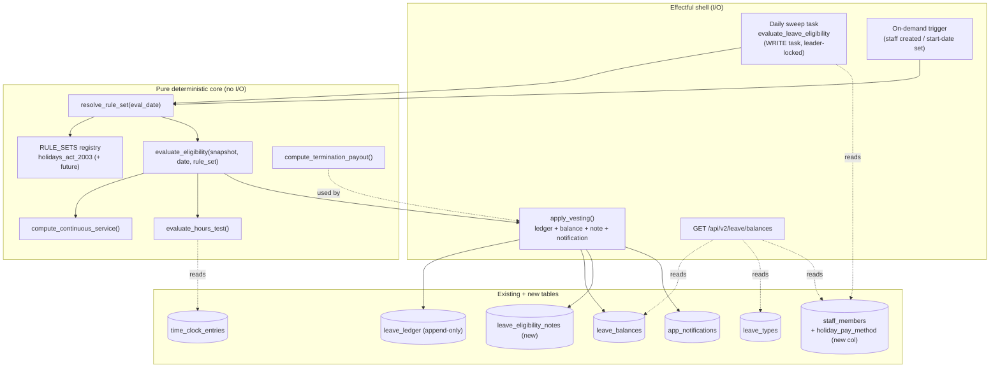
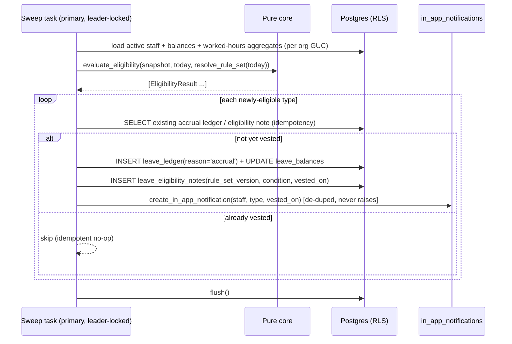
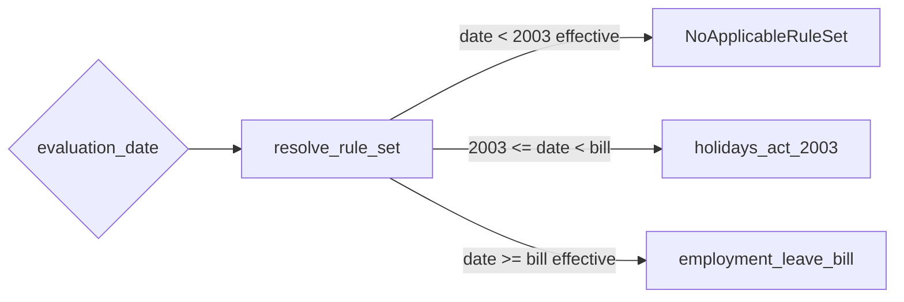

# Design Document

## Overview

This feature adds an **org-wide Leave Balances view** and the **versioned eligibility / accrual rules engine** that drives statutory leave under New Zealand law. It is deliberately a *gaps-only* build: the per-staff leave plumbing already exists and is reused as-is.

What already exists (verified in the codebase, reused unchanged unless noted):

- Tables `leave_types`, `leave_balances` (`accrued_hours` / `used_hours` / `pending_hours`, `anniversary_date`, `last_accrual_at`), append-only `leave_ledger` (`reason` ∈ `accrual`, `request_approved`, `request_cancelled`, `adjustment`, `carry_over`, `expiry`) — `app/modules/leave/models.py`.
- Endpoints `GET /api/v2/staff/{id}/leave/balances`, `GET /api/v2/staff/{id}/leave/ledger`, `POST /api/v2/staff/{id}/leave/balances/{leave_type_id}/adjust`, `GET/POST/PATCH /api/v2/leave/types` — `app/modules/leave/router.py`.
- A non-versioned daily accrual engine `app/modules/leave/accrual.py` (`accrue_for_staff`) wired into the scheduler as the `accrue_leave` WRITE task.
- The module gate `_require_staff_management_module` (404 `not_enabled`) — `app/modules/staff/router.py` and mirrored in `app/modules/leave/router.py`.
- In-app notifications `create_in_app_notification` (`app/modules/in_app_notifications/service.py`) — never raises, `audience_roles` defaults to `['org_admin']`.
- The scheduler `app/tasks/scheduled.py` (`_DAILY_TASKS`, `WRITE_TASKS`, Redis leader lock, standby skip).
- Termination payout machinery `app/modules/payslips/termination.py` (s27 greater-of OWP/AWE, casual 8%, `average_daily_pay_snapshot`).
- Per-staff leave **components** `pages/staff/leave/LeaveTab.tsx` + `BalanceCardsRow` / `LedgerTable` / `AdjustBalanceModal` / `CasualLeaveBanner` (Staff Phase 2). **Caveat: these are currently orphaned** — none is imported or rendered anywhere, and `StaffDetail`'s tabs are only `overview | roster | payslips | documents` (no Leave tab). They are reusable as components but are **not** a live, reachable UI today; this feature is the first surface to mount them (see §Frontend).

The genuinely new backend work is the **versioned, effective-dated rule-set** (`RULE_SETS` registry + resolver), a **pure-core eligibility evaluator** (`evaluate_eligibility`), an **idempotent vesting applier** that posts ledger rows + notifications + an `Eligibility_Note`, a **scheduled eligibility sweep**, and an **org-wide balances list endpoint** `GET /api/v2/leave/balances`. The new frontend work is the **Leave Balances page** (the first surface to mount the orphaned Phase-2 leave components) and the **NZ Holidays Act 2003 reference guide**.

A hard design constraint from the requirements: **eligibility never branches on employment type**. It keys on exactly two facts — Continuous_Service (day-1 / 6-month / 12-month milestones from `employment_start_date`) and the Hours_Test. The only employment-type-specific path is **casual**, which selects `Casual_PAYG` (8% pay-as-you-go) instead of accruing annual holidays. Employment type is otherwise a display filter/grouping convenience only.

## Requirements Coverage Map

| Requirement | Where addressed |
|---|---|
| R1 Org-wide balances list | `GET /api/v2/leave/balances` (§API), `LeaveBalancesPage` (§Frontend) |
| R2 Filter/group by employment type | List endpoint `employment_type` filter + `group_by` (§API); engine independence (§Rules Engine) |
| R3 Per-staff balances + ledger | Reuse existing per-staff endpoints (§API) |
| R4 Surface manual adjustment | Reuse adjust endpoint; `AdjustBalanceModal` (§Frontend) |
| R5 Surface leave-type config link | `LeaveBalancesPage` config link (§Frontend) |
| R6 Versioned effective-dated rule-set | `RULE_SETS` registry + `resolve_rule_set` (§Rules Engine) |
| R7 Continuous service + milestones | `compute_continuous_service`, `evaluate_eligibility` (§Components) |
| R8 Hours test | `evaluate_hours_test` + `HoursTestSource` (§Components) |
| R9 Annual holidays vesting | `RULE_SETS['holidays_act_2003']`, `apply_vesting` (§Components) |
| R10 Day-one entitlements | Rule-set `day_one_entitlements`; existing `public_holidays.py` reuse |
| R11 Casual PAYG (8%) + single-active-method | `holiday_pay_method` field + invariant (§Data Models) |
| R12 Eligibility-onset notification | `apply_vesting` → `create_in_app_notification`, de-dup (§Components) |
| R13 Explanatory eligibility note | `leave_eligibility_notes` table (§Data Models) |
| R14 Termination payout pre/post 12mo | `compute_termination_payout` pure fn (§Components) |
| R15 NZ Holidays Act reference guide | `GET /api/v2/leave/reference-guide` + static page (§Frontend) |
| R16 Module gating + RBAC | `_require_staff_management_module` + `leave.balance_view` / `leave.balance_adjust` (§API) |
| R17 Future Employment Leave Bill | Additive `RULE_SETS` registration (§Rules Engine) |

## Architecture

The feature splits cleanly into a **pure deterministic core** (no I/O, fully property-testable) and a thin **effectful shell** (DB reads/writes, notifications, scheduler) that calls the core.



### Org scoping & RLS

Every new table carries `org_id` with Postgres RLS `ENABLE` + a `tenant_isolation` policy keyed on `current_setting('app.current_org_id', true)::uuid` — identical to migration `0224`. Every query in the list endpoint filters by the resolved `org_id`. List responses use the `{ items, total }` envelope. All write paths use `await db.flush()` (never `commit()`); the `leave_ledger` is append-only (corrections write compensating rows).

### Module gating

Reuse `_require_staff_management_module(request, db)` (returns 404 `{ "detail": "not_enabled", "module": "staff_management" }`). Add the prefix entry `"/api/v2/leave": "staff_management"` to `MODULE_ENDPOINT_MAP` in `app/middleware/modules.py` for defence-in-depth (the middleware currently maps `/api/v2/staff` only; the leave router relies solely on the dependency today). The router-level dependency remains the authoritative gate because `ModuleMiddleware` fails open on internal errors.

## Components and Interfaces

### 1. Rule-set registry & resolver — `app/modules/leave/rules/registry.py` (new)

Rule parameters are **code-defined, version-controlled configuration** (not DB config). Justification:

- The rules are law, not tenant data: identical for every org, changing only when Parliament changes the Act. Version-controlling them in code gives PR review, diffability, and test coverage of each law version — a DB row could drift silently per-org and bypass review.
- The `effective_from` boundary and the additive future-version requirement (R17) are satisfied by appending a frozen dataclass to the registry — no migration, no rewrite of `holidays_act_2003`.
- The engine stamps the resolved `Rule_Set_Version` *name* onto each vesting record (`leave_eligibility_notes.rule_set_version`), so audit/history is preserved even though the parameters themselves live in code.

```python
from dataclasses import dataclass
from datetime import date
from decimal import Decimal

@dataclass(frozen=True)
class Milestone:
    key: str                       # "day_1" | "six_months" | "twelve_months"
    months: int                    # 0 | 6 | 12

@dataclass(frozen=True)
class HoursTestBounds:
    min_avg_hours_per_week: Decimal     # 10
    min_hours_every_week: Decimal       # 1
    min_hours_every_month: Decimal      # 40

@dataclass(frozen=True)
class LeaveRule:
    leave_type_code: str                # "annual" | "sick" | ...
    milestone_key: str                  # gating Service_Milestone
    requires_hours_test: bool
    accrues: bool                       # False => day-one/event entitlement only
    entitlement_weeks: Decimal | None   # annual = 4; None for non-accruing

@dataclass(frozen=True)
class RuleSet:
    version: str                        # "holidays_act_2003"
    effective_from: date
    milestones: tuple[Milestone, ...]
    hours_test: HoursTestBounds
    rules: tuple[LeaveRule, ...]
    day_one_entitlements: tuple[str, ...]   # ("public_holiday", "alternative_holiday", "jury_service")

RULE_SETS: tuple[RuleSet, ...] = (HOLIDAYS_ACT_2003,)   # future: (..., EMPLOYMENT_LEAVE_BILL)

def resolve_rule_set(evaluation_date: date, rule_sets: tuple[RuleSet, ...] = RULE_SETS) -> RuleSet:
    """Strictly select the latest rule-set whose effective_from <= evaluation_date.
    Raises NoApplicableRuleSet when none apply (evaluation_date precedes all)."""
    eligible = [rs for rs in rule_sets if rs.effective_from <= evaluation_date]
    if not eligible:
        raise NoApplicableRuleSet(evaluation_date)
    return max(eligible, key=lambda rs: rs.effective_from)
```

`HOLIDAYS_ACT_2003` encodes: milestones day_1/6mo/12mo; hours-test bounds (10 / 1 / 40); rules `annual` (12-month, no hours test, accrues, 4 weeks), `sick`/`bereavement`/`family_violence` (6-month + hours test, non-accruing under this engine's vesting gate — accrual amounts handled by the existing per-method accrual handlers); day-one entitlements `public_holiday`, `alternative_holiday`, `jury_service`.

The future `EMPLOYMENT_LEAVE_BILL` (≈2028) plugs in additively as a second `RuleSet` tuple entry with its own `effective_from` and hours-based-from-day-1 parameters (annual `0.0769` hrs/contracted hr, sick `0.0385` hrs/hr cap 160, bereavement + FV from day 1). Registering it does not touch `HOLIDAYS_ACT_2003`; the resolver automatically selects it for evaluation dates on/after its effective date.

### 2. Staff snapshot & continuous service — `app/modules/leave/rules/service_period.py` (new)

```python
@dataclass(frozen=True)
class StaffSnapshot:
    staff_id: uuid.UUID
    org_id: uuid.UUID
    employment_start_date: date | None
    employment_type: str            # for casual identification ONLY
    standard_hours_per_week: Decimal | None
    holiday_pay_method: str         # "accrued" | "casual_payg"
    fixed_term_months: int | None   # for casual_payg fixed-term rules
    hours_test_input: HoursTestInput | None   # worked-hours aggregates, or None when unavailable

def compute_continuous_service(start: date | None, evaluation_date: date) -> ServicePeriod | None:
    """Completed-months elapsed from start to evaluation_date. Trial period is
    irrelevant — never delays/resets. Returns None when start is None."""
```

`compute_continuous_service` returns `None` when `employment_start_date` is missing (R7.4: skip all milestone processing, surface `start_date_required`). Otherwise it yields completed months and which milestones (day_1 ≤ 0mo, six_months ≤ 6mo, twelve_months ≤ 12mo) are reached.

### 3. Hours-test source — `app/modules/leave/rules/hours_test.py` (new)

The Hours_Test is computed from **actual worked hours**. The real source is `time_clock_entries.worked_minutes` (verified: `app/modules/time_clock/models.py`, `TimeClockEntry.worked_minutes: int | None`, populated at clock-out). The aggregator sums `worked_minutes` over the qualifying period (the last 6 months ending at the evaluation date, aligned to the 6-month milestone), bucketed by ISO week and by calendar month.

```python
@dataclass(frozen=True)
class HoursTestInput:
    weeks: tuple[Decimal, ...]      # hours worked per ISO week in the qualifying period
    months: tuple[Decimal, ...]     # hours worked per calendar month
    total_hours: Decimal
    period_weeks: int

@dataclass(frozen=True)
class HoursTestResult:
    met: bool
    reason: str | None              # e.g. "no_worked_hours_data", "avg_below_10h"

def evaluate_hours_test(inp: HoursTestInput | None, bounds: HoursTestBounds) -> HoursTestResult:
    """Met iff avg >= 10 h/wk AND (every week >= 1h OR every month >= 40h).
    When inp is None (no worked-hours data) -> met=False, reason='no_worked_hours_data' (R8.5)."""
```

When timeclock data is unavailable for the staff member (no entries in the qualifying period, or `worked_minutes` all NULL), `evaluate_hours_test(None, ...)` returns `met=False` with a recorded reason — never an exception, never a silent pass.

### 4. Pure eligibility evaluator — `app/modules/leave/rules/eligibility.py` (new)

```python
@dataclass(frozen=True)
class EligibilityResult:
    leave_type_code: str
    eligible: bool
    milestone_key: str
    hours_test: HoursTestResult | None
    reason: str | None              # why not eligible, or the triggering condition when eligible
    rule_set_version: str

def evaluate_eligibility(
    snapshot: StaffSnapshot,
    evaluation_date: date,
    rule_set: RuleSet,
) -> list[EligibilityResult]:
    """Pure. Keyed ONLY on Continuous_Service + Hours_Test. Never branches on
    employment_type except: casual selects Casual_PAYG so the annual rule is
    reported eligible=False with reason='casual_payg' (no statutory annual accrual).
    Returns one result per rule in the rule-set."""
```

Behaviour:

- No `employment_start_date` → returns results all `eligible=False`, `reason="start_date_required"` (no partial calculation, R7.4).
- For each `LeaveRule`: eligible iff the gating milestone is reached **and** (`requires_hours_test` is False **or** `evaluate_hours_test` is met). Casual staff must still meet the same milestones + hours test (R7.6) — casual never gets day-1 statutory accrual.
- Annual rule for casual staff (`holiday_pay_method == "casual_payg"`) → `eligible=False`, `reason="casual_payg"` so the applier never vests an accruing annual balance (R9.5, R11.2).
- Each result stamped with `rule_set.version`.

### 5. Idempotent vesting applier — `app/modules/leave/rules/vesting.py` (new)

```python
async def apply_vesting(
    db: AsyncSession,
    *,
    snapshot: StaffSnapshot,
    results: list[EligibilityResult],
    evaluation_date: date,
    rule_set: RuleSet,
) -> list[VestingOutcome]:
    """For each newly-satisfied eligibility (eligible=True with no prior vesting
    record for (staff_id, leave_type_id)):
      1. append a leave_ledger row reason='accrual' with the vested hours
         (for accruing rules only; non-accruing entitlements vest the note +
         notification but post a 0-hour marker is NOT written — they just begin
         displaying),
      2. update leave_balances.accrued_hours (+ last_accrual_at),
      3. insert a leave_eligibility_notes row (rule_set_version, milestone,
         hours-test condition, vested_on),
      4. create the eligibility-onset in-app notification (de-duped).
    Idempotent: a prior accrual ledger row for (staff,type,occurred_at) OR a prior
    eligibility note for (staff,type) short-circuits. Uses flush(), never commit()."""
```

Idempotency & de-dup rules:

- **Vesting row de-dup** keys on the existing accrual idempotency: a `leave_ledger` `reason='accrual'` row for `(staff_id, leave_type_id, occurred_at=vested_on)` already existing → skip the ledger insert (reuses the `accrual.py` pattern).
- **Note de-dup**: `leave_eligibility_notes` has `UNIQUE(staff_id, leave_type_id)` — one onset note per staff×type ever (R13.4 append-only, never deleted).
- **Notification de-dup** (R12.4): before creating, the applier checks for any existing `app_notifications` row with `entity_type='leave_eligibility'` and `entity_id` = a deterministic UUID derived from `(staff_id, leave_type_id)`, OR equivalently checks for the existing eligibility note (one note ⇒ one notification). It does **not** create a second notification regardless of which Vesting_Event triggered it or when the prior one was created. `create_in_app_notification` is exception-safe so a notification failure never rolls back the vesting.

Annual vesting hours for the 12-month milestone reuse the existing rule (`standard_hours_per_week × entitlement_weeks`, 4 weeks; 40h/wk fallback), matching `accrual.py::_process_anniversary`.

### 6. Scheduled sweep + on-demand trigger — `app/modules/leave/rules/sweep.py` (new) + `app/tasks/scheduled.py` (edit)

```python
async def evaluate_leave_eligibility_task() -> dict:
    """Daily sweep across all active staff in all orgs. For each staff:
      snapshot -> resolve_rule_set(today) -> evaluate_eligibility -> apply_vesting.
    Per-org RLS GUC set per staff's org. Idempotent: repeat-day runs are no-ops."""
```

Wiring (mirrors the existing `accrue_leave` task):

- Append `(evaluate_leave_eligibility_task, 86400, "evaluate_leave_eligibility")` to `_DAILY_TASKS`.
- Add `"evaluate_leave_eligibility"` to `WRITE_TASKS` (it writes ledger/balances/notes/notifications) so it is **skipped on standby** and runs only under the **Redis leader lock** on the primary.

On-demand evaluation: when a staff member is created or their `employment_start_date` is set/changed (staff service), call a thin `evaluate_one_staff(db, staff_id, today)` so day-one entitlements and any already-passed milestones vest immediately rather than waiting for the nightly tick.

### 7. Termination payout (calculation only) — `app/modules/leave/rules/termination.py` (new pure fn)

```python
@dataclass(frozen=True)
class TerminationPayout:
    rule_applied: str               # "pre_12mo_8pct" | "post_12mo_accrued" | "casual_payg_already_paid"
    amount: Decimal
    detail: dict                    # inputs used (gross, accrued_hours, owp, awe)

def compute_termination_payout(
    *,
    continuous_service_months: int,
    gross_earnings: Decimal,
    remaining_accrued_hours: Decimal,
    ordinary_weekly_pay: Decimal,
    average_weekly_earnings: Decimal,
    holiday_pay_method: str,
    standard_hours_per_week: Decimal,
) -> TerminationPayout:
    """Pure. Pre-12mo -> 8% of gross. On/after 12mo -> remaining accrued hours
    converted to weeks × greater_of(OWP, AWE). Casual_PAYG -> 0 (already paid).
    Records which rule applied (R14.3)."""
```

This is representation/calculation only — no payroll execution. The existing `app/modules/payslips/termination.py` remains the place where a real payslip is produced; this pure function is used for the balances-view "what-if" display and to anchor the pre/post property tests.

### Sequence — eligibility onset



## Data Models

### New column on `staff_members`

`holiday_pay_method TEXT NOT NULL DEFAULT 'accrued'` — `'accrued'` | `'casual_payg'`. Models the single-active-pay-method invariant (R11.6): exactly one method per staff at a time. CHECK constraint restricts the value domain. Casual staff default-resolve to `casual_payg` via the staff service; fixed-term staff set it by agreement (>3 & <12 months) or automatically (≤3 months) per R11.4/R11.5.

> **Authoritative casual field.** `staff_members` carries **two** classification columns — `employment_basis` and `employment_type` (verified in `app/modules/staff/models.py`). Casual detection in this feature (the migration `0226` backfill, the staff-service default-resolution, and `StaffSnapshot.employment_type`) keys on **`employment_type == 'casual'`** — this is the single authoritative source for "casual". `employment_basis` is **not** consulted for pay-method resolution. Any place that reads "casual" MUST read `employment_type`, never `employment_basis`, to avoid the two columns disagreeing. Justification for a column rather than a table: it is a single current-state scalar per staff, not history; the history of *why* lives in the append-only `leave_eligibility_notes` + `audit_log`.

### New table `leave_eligibility_notes`

Lightweight, append-only vesting record + Eligibility_Note store. Justification for a new table over a ledger/notification field: the note must be queryable per `(staff, leave_type)` to surface in the balances drill-in (R13.3), must carry the `rule_set_version` stamp (R6.6), and must be retained append-only and never deleted (R13.4) independent of notification dismissal. Overloading `leave_ledger.reason` free-text would break its tight numeric-delta contract; overloading a notification row would couple retention to the notification lifecycle.

```sql
CREATE TABLE IF NOT EXISTS leave_eligibility_notes (
    id                uuid PRIMARY KEY DEFAULT gen_random_uuid(),
    org_id            uuid NOT NULL REFERENCES organisations(id) ON DELETE CASCADE,
    staff_id          uuid NOT NULL REFERENCES staff_members(id) ON DELETE CASCADE,
    leave_type_id     uuid NOT NULL REFERENCES leave_types(id)   ON DELETE RESTRICT,
    rule_set_version  text NOT NULL,
    milestone_key     text NOT NULL,                     -- day_1 | six_months | twelve_months
    hours_test_met    boolean NULL,                      -- NULL when the rule has no hours test
    condition_text    text NOT NULL,                     -- human-readable trigger (R13.2)
    vested_on         date NOT NULL,
    created_at        timestamptz NOT NULL DEFAULT now(),
    CONSTRAINT uq_leave_eligibility_notes_staff_type UNIQUE (staff_id, leave_type_id)
);
```

`UNIQUE(staff_id, leave_type_id)` enforces R12.4/R13.1 one-onset-note-ever and underpins notification de-dup. RLS `ENABLE` + `tenant_isolation` policy. No UPDATE/DELETE in service code (append-only).

### Reused tables (unchanged)

`leave_types`, `leave_balances`, `leave_ledger`, `app_notifications`, `time_clock_entries`, `staff_members` (other columns), `audit_log`.

### Migration plan

Current Alembic HEAD is **`0225`** (verified: `0225_pay_periods_cycle_unique`). New migrations chain as `0226`+.

- **Migration `0226` (transactional)** — `down_revision = "0225"`:
  - `ALTER TABLE staff_members ADD COLUMN IF NOT EXISTS holiday_pay_method text NOT NULL DEFAULT 'accrued'` + CHECK `holiday_pay_method IN ('accrued','casual_payg')` (guarded `IF NOT EXISTS` via `information_schema` check before adding the constraint).
  - `CREATE TABLE IF NOT EXISTS leave_eligibility_notes (...)` with inline PK/FK/UNIQUE.
  - `ALTER TABLE leave_eligibility_notes ENABLE ROW LEVEL SECURITY` + `DROP POLICY IF EXISTS tenant_isolation` + `CREATE POLICY tenant_isolation ... USING (org_id = current_setting('app.current_org_id', true)::uuid)` — mirrors `0224`.
  - Backfill: set `holiday_pay_method='casual_payg'` for existing `employment_type='casual'` staff (idempotent UPDATE).
  - Idempotent throughout (`IF NOT EXISTS` / `IF EXISTS` / `information_schema` guards), re-runnable.
- **Migration `0227` (autocommit, perf indexes)** — `down_revision = "0226"`, only if needed: `CREATE INDEX CONCURRENTLY` for the org-wide list (`idx_leave_balances_org` on `leave_balances(org_id)`, `idx_leave_elig_notes_staff_type` on `leave_eligibility_notes(staff_id, leave_type_id)`), wrapped in `op.get_context().autocommit_block()`, each `IF NOT EXISTS`. Separate file because mixing `CONCURRENTLY` with transactional DDL is a banned pattern — mirrors `0202_add_perf_indexes.py` and the `0224` autocommit phase.

## Rules-Engine Versioning

The versioned, effective-dated rule-set is the core of this feature. Design decisions:

1. **Code-defined config, not DB config** (R17.3 "version-scoped configuration rather than hard-coded constants"): parameters live in frozen dataclasses in `RULE_SETS`, *named and effective-dated*, so they are version-scoped configuration — not constants scattered through the engine, and not silent per-org DB rows. The engine logic reads only `rule_set.*`; no thresholds are hard-coded in `evaluate_eligibility`.
2. **Strict resolver** (R6.3, R6.4): `resolve_rule_set` selects the latest version with `effective_from <= evaluation_date`, choosing the maximum `effective_from` on ties of applicability. Evaluation dates before the earliest version raise `NoApplicableRuleSet`.
3. **Additive future version** (R17.1, R17.2, R17.4): appending `EMPLOYMENT_LEAVE_BILL` to the `RULE_SETS` tuple is the entire integration. While `today < EMPLOYMENT_LEAVE_BILL.effective_from`, the resolver keeps returning `holidays_act_2003`. While the bill is unregistered, only `holidays_act_2003` is ever returned.
4. **Version stamping** (R6.6): every vesting writes `leave_eligibility_notes.rule_set_version = rule_set.version`.



## API

### New endpoint: `GET /api/v2/leave/balances` (org-wide list)

```
GET /api/v2/leave/balances
  ?employment_type=<filter>        # optional; display filter only (R2.1)
  &group_by=employment_type        # optional grouping (R2.2)
  &offset=0&limit=50               # offset/limit pagination (R1.7)
Response 200: { items: StaffLeaveBalances[], total: number }
  StaffLeaveBalances = {
    staff_id, staff_name, employment_type, holiday_pay_method,
    balances: LeaveBalanceResponse[],     # only VESTED types (R1.6)
    eligibility_notes: EligibilityNote[]  # surfaced per type (R13.3)
  }
404 { detail: not_enabled }  when staff_management disabled (R1.2)
403  when caller lacks leave.balance_view (R16.3)
200 { items: [], total: 0 }  when nothing in scope (R1.8)
```

- Gated by `_require_staff_management_module` (404 `not_enabled`) **and** a `leave.balance_view` permission check (403). Module-enabled is treated as a precondition in addition to the permission (R16.2).
- Org-scoped via RLS; only leave types with a vested entitlement (an accrual ledger row or eligibility note, or a non-zero balance) are included per staff row (R1.6). `available_hours = accrued − used − pending` is the existing `LeaveBalanceResponse.computed_field`.
- `employment_type` filter and `group_by` operate **after** eligibility — engine independence (R2.4) is preserved because eligibility was computed by the sweep with no employment-type input.

### Reused endpoints (unchanged)

- `GET /api/v2/staff/{id}/leave/balances` — per-staff balances drill-in (R3.1).
- `GET /api/v2/staff/{id}/leave/ledger?leave_type_id=&offset=&limit=` — ledger history, ordered by `occurred_at` (R3.2–R3.5).
- `POST /api/v2/staff/{id}/leave/balances/{leave_type_id}/adjust` — manual adjustment, appends `adjustment` ledger row atomically, writes audit (R4.2, R4.6, R4.7). `reason` is required by `AdjustBalanceRequest` (min_length=1) → 422 when missing (R4.3). Currently gated by `_require_org_admin`; this is re-mapped to the `leave.balance_adjust` permission (see RBAC).

### Reference guide content: `GET /api/v2/leave/reference-guide`

Returns the NZ Holidays Act 2003 reference content as structured JSON (sections for annual/sick/bereavement/family-violence/public holidays/alternative holidays/jury service, the Hours_Test, the Service_Milestones, and the parental-leave-out-of-scope note). Module-gated; available even when content is partially populated (R15.6). The frontend may alternatively render a static page — the endpoint exists so content is editable without a redeploy.

No webhooks are emitted by any endpoint in this feature.

### RBAC

The permission registry (`app/modules/auth/permission_registry.py`) derives `{slug}.{action}` keys per enabled module and supports non-CRUD `CUSTOM_PERMISSIONS`. We add two custom permissions under the `staff_management` module group:

```python
CUSTOM_PERMISSIONS["staff_management"] = [
    PermissionItem(key="leave.balance_view",   label="View Leave Balances"),
    PermissionItem(key="leave.balance_adjust", label="Adjust Leave Balances"),
]
```

These map to `custom_role_permissions` via the existing `has_permission(role, perm, custom_role_permissions=...)` path (verified in `app/modules/auth/rbac.py` and used by `app/modules/timesheets/router.py`). Built-in `org_admin` retains both (back-compat with today's `_require_org_admin` adjust gate). `leave.balance_view` gates the org-wide list (403 otherwise, R16.3); `leave.balance_adjust` gates the adjust endpoint (403 otherwise, R16.5). Both queries restrict to the requesting org (R16.6).

## Frontend (frontend-v2)

### New page: Leave Balances

`LeaveBalancesPage` at route `/leave/balances`, a **standalone page** (not a tab on any existing page), registered with `<ModuleRoute moduleSlug="staff_management">` in `App.tsx` (mirrors the `timesheets` route registration). It mirrors the page pattern of `pages/staff-timesheets/TimesheetsPage.tsx` (page header with eyebrow + title + sub, summary cards, list); its `employment_type` filter and group-by are in-page controls, not route tabs.

**Sidebar entry (concrete placement).** The sidebar (`components/shell/Sidebar.tsx`) is a flat list of module-gated groups — there is **no** "Staff/Leave" sub-navigation. Add a **new top-level item to the existing `People` `NAV_GROUPS` group**, immediately after the existing `leave-approvals` item, of the form:

```ts
{ id: 'leave-balances', to: '/leave/balances', label: 'Leave Balances', icon: ICON.staff, module: 'staff_management' }
```

It reuses `ICON.staff` (there is no dedicated leave icon; the sibling `leave-approvals` item reuses `ICON.staff` too). It is **not** `adminOnly` at the sidebar level — visibility is module-gated and the endpoint enforces the `leave.balance_view` permission (403) so non-permitted users who navigate directly are still rejected.

> **Reuse caveat — the per-staff leave UI is currently unmounted.** `pages/staff/leave/LeaveTab.tsx` and its children (`BalanceCardsRow`, `LedgerTable`, `AdjustBalanceModal`, `CasualLeaveBanner`) were built in Staff Phase 2 but are **orphaned**: none is imported or rendered anywhere today, and `StaffDetail`'s tabs are only `overview | roster | payslips | documents` (no Leave tab). This feature is therefore the **first** surface to actually mount them. They are reused as **components**, but "reuse unchanged / existing live view" is inaccurate — wiring them into the drill-in is real work, not a no-op.

- **List + filter/group**: org-wide table of staff with their vested balances; an `employment_type` filter dropdown and a "group by employment type" toggle. A persistent note: *"Employment type is a display convenience only — it does not change statutory leave eligibility."* (R2.5).
- **Drill-in**: clicking a staff row opens the per-staff `LeaveTab` view (`pages/staff/leave/LeaveTab.tsx`) reusing `BalanceCardsRow`, `LedgerTable`, `CasualLeaveBanner` — balances + ledger history. **Prop-shape gap:** `LeaveTab` requires a full `Staff` object plus an `isAdmin` prop and fetches via `useStaffLeave(staffId)`, but the org-wide list returns the lightweight `StaffLeaveBalances` row (`staff_id`, `staff_name`, `employment_type`, …), **not** a full `Staff`. The drill-in MUST therefore either (a) fetch the full staff record (the backend endpoint `GET /api/v2/staff/{staff_id}` → `StaffMemberResponse` exists, but **no** frontend `getStaff(id)` helper does yet — one must be added to `api/staff.ts`) before mounting `LeaveTab`, or (b) refactor `LeaveTab` to accept a `staffId` and load its own staff context (preferred — avoids a new round-trip wrapper and matches the existing `useStaffLeave(staffId)` data flow). Pass `isAdmin` from the caller's `leave.balance_adjust` permission. Reuse the `pages/staff/leave/types.ts::Staff` shape.
- **Adjust modal**: reuse `AdjustBalanceModal.tsx` (posts to the existing adjust endpoint; atomic ledger+balance). Shown only when the user holds `leave.balance_adjust`.
- **Config link**: link to Settings → Leave Types; disabled/hidden when the user lacks leave-type config permission (R5.3). On navigation failure, show an error with a manual retry, no auto-retry (R5.4).
- **Eligibility_Note surfacing**: each vested type shows its onset note ("Annual holidays vested — 12 months continuous service reached on 2026-03-01") from `eligibility_notes` (R13.3). Casual rows show the `CasualLeaveBanner` "paid as 8% pay-as-you-go" indicator (R11.3).
- **Reference guide**: a `LeaveReferenceGuidePage` at `/leave/reference-guide`, linked from the balances page header (R15.5).

Safe consumption per steering: `const items = res.data?.items ?? []`, `res.data?.total ?? 0`, typed generics (no `as any`), `AbortController` in every `useEffect`, and explicit loading / empty / error states (reuse the spinner + error-banner-with-retry patterns already in `TimesheetsPage`/`PayslipDetail`).

## Error Handling

| Condition | Handling |
|---|---|
| `staff_management` disabled | 404 `{ detail: "not_enabled", module: "staff_management" }` (existing dependency) |
| Caller lacks `leave.balance_view` | 403 |
| Caller lacks `leave.balance_adjust` on adjust | 403 |
| Adjust without reason | 422 (Pydantic `min_length=1`) |
| Adjust fails mid-write | `session.begin()` auto-rollback → no orphan ledger row (R4.7); service uses `flush()` so the surrounding transaction commits ledger+balance together or neither |
| `employment_start_date` missing | Engine returns `start_date_required`; sweep records reason, skips milestone processing, no partial calc (R7.4) |
| Worked-hours data unavailable | `evaluate_hours_test(None,...)` → `met=False, reason='no_worked_hours_data'` (R8.5); never raises |
| `evaluation_date` precedes all rule-sets | `NoApplicableRuleSet` raised in core; sweep logs and skips that staff (no vesting) |
| Notification transport fails | `create_in_app_notification` swallows + logs; vesting still commits (notification is best-effort) |
| Repeat sweep on same day | Idempotent no-op (existing accrual-ledger + unique-note guards) |
| Reference guide not populated | Endpoint returns available sections; module can still be enabled (R15.6) |

All append-only invariants are enforced in service code (never UPDATE/DELETE `leave_ledger` or `leave_eligibility_notes`) and at the DB layer (CHECK enums, UNIQUE constraints).

## Correctness Properties

*A property is a characteristic or behavior that should hold true across all valid executions of a system — essentially, a formal statement about what the system should do. Properties serve as the bridge between human-readable specifications and machine-verifiable correctness guarantees.*

This feature is well suited to property-based testing because the engine's core (`resolve_rule_set`, `compute_continuous_service`, `evaluate_hours_test`, `evaluate_eligibility`, `compute_termination_payout`, and the idempotent `apply_vesting`) is pure or has clear input/output behaviour over a large input space (arbitrary dates, service lengths, worked-hours shapes, and staff configurations). UI copy, navigation, and RBAC gate wiring are covered by example/integration tests instead (see Testing Strategy).

### Property 1: Available-hours invariant

*For any* leave balance, the displayed `available_hours` equals `accrued_hours − used_hours − pending_hours`.

**Validates: Requirements 1.5**

### Property 2: Organisation isolation (RLS)

*For any* set of organisations each populated with random staff, balances, ledger rows, and eligibility notes, a balances or ledger query made in the context of organisation A returns only rows belonging to organisation A — never a row from any other organisation.

**Validates: Requirements 1.4, 16.6**

### Property 3: List envelope and total

*For any* org-wide balances request over generated backing data, the response is of the form `{ items, total }` where `total` equals the number of in-scope staff rows and `items` is a list (empty when nothing is in scope).

**Validates: Requirements 1.3, 1.8**

### Property 4: Only vested types are shown

*For any* generated staff member, the leave types appearing in that staff's balances row are exactly those with a vested entitlement (an eligibility note or a non-zero/created balance); types with no vested entitlement are omitted, and every type that has vested appears.

**Validates: Requirements 1.6, 12.3, 13.3**

### Property 5: Pagination is a faithful slice

*For any* `offset` and `limit` over the ordered in-scope result set, the returned page equals the corresponding slice of the full ordered set, `total` is independent of pagination, and concatenating successive pages reproduces the full set with no overlap or omission.

**Validates: Requirements 1.7**

### Property 6: Employment-type filter

*For any* `employment_type` filter value, every staff member returned has that employment type, and no in-scope staff member of that type is omitted.

**Validates: Requirements 2.1**

### Property 7: Employment-type grouping partitions the set

*For any* grouping by employment type, the groups form a partition of the filtered staff set — every staff member appears in exactly one group (the group of its employment type), with no loss or duplication.

**Validates: Requirements 2.2**

### Property 8: Eligibility is independent of employment type

*For any* staff snapshot, changing `employment_type` to any non-casual value leaves the eligibility results for all statutory leave types unchanged; the only employment-type effect is that casual selects `Casual_PAYG`.

**Validates: Requirements 2.4, 7.5**

### Property 9: Ledger is ordered by occurrence date

*For any* set of ledger rows, the served ledger history is sorted by `occurred_at`.

**Validates: Requirements 3.3**

### Property 10: Ledger entries expose delta, reason, and occurrence

*For any* ledger entry returned, the rendered entry contains its `delta_hours`, its `reason`, and its `occurred_at`.

**Validates: Requirements 3.4**

### Property 11: Single-leave-type ledger filter

*For any* `leave_type_id` filter, every returned ledger row has that `leave_type_id`.

**Validates: Requirements 3.5**

### Property 12: Append-only history (ledger and notes)

*For any* sequence of serving, adjusting, correcting, or vesting operations, no existing `leave_ledger` row and no existing `leave_eligibility_notes` row is ever updated or deleted — the row count is non-decreasing and every previously written row is still present and unchanged; corrections add new compensating rows.

**Validates: Requirements 3.6, 3.7, 13.4**

### Property 13: Adjustment requires a non-blank reason

*For any* manual adjustment whose reason is empty or all-whitespace, the adjustment is rejected with a validation error and the balance and ledger are unchanged.

**Validates: Requirements 4.3**

### Property 14: Adjustment is atomic

*For any* adjustment that fails after the point a ledger row would be created, the transaction rolls back so that neither the ledger row nor the balance change persists — the adjustment and its ledger row commit together or neither does.

**Validates: Requirements 4.7**

### Property 15: Rule-set resolver selects the latest applicable version

*For any* registry of rule-sets and any evaluation date, `resolve_rule_set` returns the version with the maximum `effective_from` among those whose `effective_from` is on or before the evaluation date; when none apply it raises `NoApplicableRuleSet`. In particular, for dates in `[holidays_act_2003.effective_from, employment_leave_bill.effective_from)` it returns `holidays_act_2003`.

**Validates: Requirements 6.3, 6.4, 6.5, 17.4**

### Property 16: Future versions register additively

*For any* evaluation date strictly before a newly registered later version's `effective_from`, resolving against the extended registry yields the same version as resolving against the registry without that later version — registering a new version never changes resolution for earlier dates.

**Validates: Requirements 17.1, 17.2**

### Property 17: Vesting is stamped with the resolved version

*For any* vesting event, the recorded `leave_eligibility_notes.rule_set_version` equals the version returned by `resolve_rule_set` for the evaluation date, and every rule evaluated is associated with that version.

**Validates: Requirements 6.1, 6.6**

### Property 18: Continuous service computation

*For any* `employment_start_date` on or before the evaluation date, `compute_continuous_service` equals the number of completed months between the two dates, is monotonically non-decreasing in the evaluation date, and the set of reached milestones is exactly those whose month threshold is ≤ the completed months.

**Validates: Requirements 7.1, 7.2**

### Property 19: Trial period never affects service

*For any* staff snapshot, varying the probation/trial-period data leaves the computed continuous service and all eligibility results unchanged.

**Validates: Requirements 7.3**

### Property 20: Missing start date skips milestone processing

*For any* snapshot with no `employment_start_date`, every eligibility result is `eligible=False` with reason `start_date_required`, and no partial milestone calculation is performed.

**Validates: Requirements 7.4**

### Property 21: Casual never accrues statutory annual holidays

*For any* casual staff member (`holiday_pay_method = casual_payg`), no accruing annual-holidays balance is ever vested, regardless of service length; casual classification alone never grants any day-one statutory accrual.

**Validates: Requirements 7.6, 9.5, 11.2**

### Property 22: Hours-test predicate

*For any* worked-hours input, `evaluate_hours_test` returns met exactly when the average is at least 10 hours per week AND (every week has at least 1 hour OR every month has at least 40 hours); when the input is unavailable it returns not-met with a recorded reason and never raises.

**Validates: Requirements 8.1, 8.5**

### Property 23: Six-month + hours-test gate for sick, bereavement, and family-violence

*For any* staff snapshot and for each of the sick, bereavement, and family-violence leave types, the type is eligible exactly when the six-month milestone is reached AND the Hours_Test is met.

**Validates: Requirements 8.2, 8.3, 8.4**

### Property 24: Annual-holidays vesting at twelve months

*For any* non-casual staff snapshot, an accruing annual-holidays entitlement is vested if and only if the twelve-month milestone is reached; when vested, the amount equals 4 × the staff member's standard weekly hours and is recorded as exactly one `leave_ledger` row with `reason = accrual` carrying those hours.

**Validates: Requirements 9.1, 9.2, 9.3, 9.4**

### Property 25: Day-one entitlements

*For any* staff snapshot with an `employment_start_date`, the public-holiday and jury-service entitlements are available from day 1 (continuous service ≥ 0), independent of the milestone gates that apply to accruing leave.

**Validates: Requirements 10.1, 10.4**

### Property 26: Exactly one active annual pay method

*For any* staff state or transition, exactly one annual-holiday pay method is active — `Casual_PAYG` or accrued — and the two never coexist: a `casual_payg` staff member has no accruing annual-holidays balance vested, and an accrued staff member is not paid `Casual_PAYG`.

**Validates: Requirements 11.6**

### Property 27: At most one eligibility-onset notification per staff and leave type

*For any* sequence of eligibility evaluations and vesting events, at most one eligibility-onset in-app notification is created per `(staff_id, leave_type_id)` — once a notification exists for that pair, no further notification is created regardless of which Vesting_Event triggers it or when the existing one was created; the first notification includes the staff member, the leave type, and the vested date.

**Validates: Requirements 12.1, 12.2, 12.4**

### Property 28: Eligibility note created with triggering condition

*For any* vesting event, exactly one `leave_eligibility_notes` row is created for the `(staff, leave_type)` pair, recording the leave type, the triggering Service_Milestone or Hours_Test condition, and the vested date.

**Validates: Requirements 13.1, 13.2**

### Property 29: Termination payout pre/post twelve months and casual

*For any* termination inputs, `compute_termination_payout` returns: when `holiday_pay_method = casual_payg`, amount 0 with rule `casual_payg_already_paid`; otherwise when continuous service is under twelve months, 8% of gross earnings with rule `pre_12mo_8pct`; otherwise the remaining accrued annual-holiday hours converted to weeks times the greater of ordinary weekly pay and average weekly earnings with rule `post_12mo_accrued`. The returned `rule_applied` always matches the branch taken.

**Validates: Requirements 14.1, 14.2, 14.3, 14.4**

## Testing Strategy

### Dual approach

- **Property-based tests** (Hypothesis) cover the pure core and the idempotent applier — Properties 1–29 above. The library is **Hypothesis** (already in use; `.hypothesis/` present in the repo). Each property test runs a **minimum of 100 iterations** (`@settings(max_examples=100)` or the shared `PBT_SETTINGS` profile in `tests/properties/conftest.py`).
- **Example / integration tests** cover the items the prework classified as non-property: module gating (404 `not_enabled`), RBAC 403s (`leave.balance_view` / `leave.balance_adjust`), the existing adjust-endpoint side effects (ledger row + audit), reference-guide content/availability, casual pay-method band rules (R11.4/R11.5), and the day-one public-holiday/alternative-holiday OWD logic (reusing the existing `app/modules/leave/public_holidays.py` tests).
- **Smoke / structural test**: a lint-style test asserting `evaluate_eligibility` reads thresholds only from `rule_set.*` (no hard-coded milestone/hours literals) — guards R17.3.

### Test tagging

Each property test references its design property with a comment in the format:

```
# Feature: leave-balances-eligibility, Property 15: Rule-set resolver selects the latest applicable version
```

### Generators (Hypothesis strategies)

- `staff_snapshots()` — random `employment_start_date` (incl. `None`, Feb-29 edges), `employment_type` (incl. casual), `standard_hours_per_week` (incl. `None`→fallback), `holiday_pay_method`, fixed-term months, and worked-hours inputs (incl. empty/`None`).
- `evaluation_dates()` — dates spanning before/within/after each rule-set's `effective_from`.
- `hours_test_inputs()` — per-week and per-month hour buckets covering the average/every-week/every-month boundaries (incl. empty and zero).
- `rule_set_registries()` — random tuples of rule-sets with distinct `effective_from` dates to exercise the resolver, plus the real `RULE_SETS`.
- `ledger_histories()` and `multi_org_fixtures()` — for ordering, filtering, append-only, pagination, and RLS-isolation properties.

### Placement

- Pure-core property tests: `tests/properties/test_leave_eligibility_engine.py`, `test_leave_rule_resolver.py`, `test_leave_hours_test.py`, `test_leave_termination_payout.py`.
- Applier / idempotency / RLS property tests (DB-backed, transactional fixtures): `tests/properties/test_leave_vesting.py`.
- API example/integration tests: `tests/integration/test_leave_balances_api.py`.

All DB-backed tests set the per-org RLS GUC (`app.current_org_id`) in the test fixture, use `flush()`-based transactional rollback between cases, and never assert against committed cross-test state.
