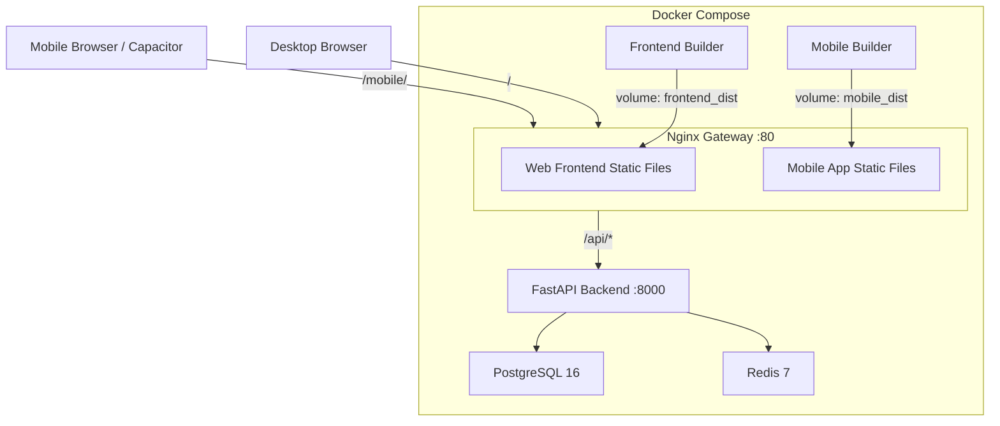
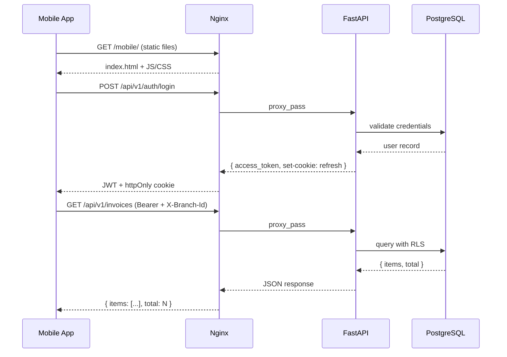
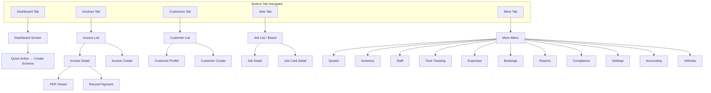

# Design Document — OraInvoice Mobile App

## Overview

The OraInvoice Mobile App is a mobile-first web application that provides the full OraInvoice feature set through a touch-optimised interface. It is built with the same tech stack as the web app — React 19, TypeScript, Vite, and Tailwind CSS — but with mobile-first layouts, touch gestures, and native device integration via Capacitor.

**Key architectural decisions:**

1. **Not React Native** — The mobile app is a standard React web app optimised for mobile viewports (320px–430px). It runs in a browser during development and gets wrapped by Capacitor for native iOS/Android distribution. This maximises code sharing with the existing web app.

2. **Separate Docker container** — The mobile app builds and serves independently from the web frontend, with its own Vite config, Dockerfile, and nginx routing. This allows independent deployment cycles.

3. **Shared backend** — The mobile app calls the exact same FastAPI backend API endpoints as the web app. No backend changes are required. The API client, auth flow, branch context, and module gating logic are shared or mirrored from the web frontend.

4. **Shared TypeScript types** — API request/response interfaces are extracted into a `shared/types/` directory that both `frontend/` and `mobile/` import via TypeScript path aliases, eliminating type drift.

5. **Four-phase delivery** — The 44 requirements are grouped into four phases (MVP, Extended Operations, Financial/Compliance, Advanced Features), matching the requirements document. Each phase builds on the previous one.

### Design Rationale

Using the same React + Vite + Tailwind stack (rather than React Native) provides:
- **Zero learning curve** — The existing team already knows the stack
- **Maximum code sharing** — Contexts, hooks, API client, and type definitions are reusable
- **Browser-testable** — The app is testable at phone viewport sizes in Chrome DevTools during development
- **Capacitor for native** — Camera, biometrics, push notifications, and filesystem access come from Capacitor plugins, not native code

## Architecture

### System Context



### Request Flow



### Navigation Architecture



## Components and Interfaces

### Project Structure

```
mobile/
├── capacitor.config.ts          # Capacitor configuration
├── Dockerfile                   # Docker build for dev
├── index.html                   # Entry HTML
├── package.json                 # Dependencies (mirrors frontend + Capacitor)
├── postcss.config.js
├── tailwind.config.js
├── tsconfig.json                # Extends shared tsconfig, adds path aliases
├── vite.config.ts               # Mobile-specific Vite config
├── ios/                         # Capacitor iOS project (gitignored, generated)
├── android/                     # Capacitor Android project (gitignored, generated)
└── src/
    ├── main.tsx                 # Entry point
    ├── App.tsx                  # Root component with providers + router
    ├── index.css                # Tailwind imports + mobile base styles
    ├── api/
    │   └── client.ts            # API client (shared from frontend or mirrored)
    ├── components/
    │   ├── ui/                  # Mobile UI primitives
    │   │   ├── MobileCard.tsx
    │   │   ├── MobileList.tsx
    │   │   ├── MobileListItem.tsx
    │   │   ├── MobileForm.tsx
    │   │   ├── MobileFormField.tsx
    │   │   ├── MobileButton.tsx
    │   │   ├── MobileInput.tsx
    │   │   ├── MobileSelect.tsx
    │   │   ├── MobileModal.tsx
    │   │   ├── MobileSearchBar.tsx
    │   │   ├── MobileBadge.tsx
    │   │   ├── MobileSpinner.tsx
    │   │   ├── MobileToast.tsx
    │   │   ├── MobileEmptyState.tsx
    │   │   └── index.ts
    │   ├── gestures/            # Touch gesture components
    │   │   ├── SwipeAction.tsx
    │   │   ├── PullRefresh.tsx
    │   │   └── DragDrop.tsx
    │   ├── layout/              # App shell components
    │   │   ├── TabNavigator.tsx
    │   │   ├── AppHeader.tsx
    │   │   ├── MobileLayout.tsx
    │   │   ├── OfflineIndicator.tsx
    │   │   └── BranchBadge.tsx
    │   └── common/              # Shared feature components
    │       ├── ModuleGate.tsx
    │       ├── LineItemEditor.tsx
    │       ├── CustomerPicker.tsx
    │       ├── ItemPicker.tsx
    │       ├── PDFViewer.tsx
    │       ├── CameraCapture.tsx
    │       └── DateRangePicker.tsx
    ├── contexts/                # React contexts (shared/mirrored from frontend)
    │   ├── AuthContext.tsx
    │   ├── ModuleContext.tsx
    │   ├── TenantContext.tsx
    │   ├── BranchContext.tsx
    │   ├── ThemeContext.tsx
    │   ├── OfflineContext.tsx
    │   └── BiometricContext.tsx
    ├── hooks/                   # Custom hooks
    │   ├── useApiList.ts        # Paginated list fetching with pull-refresh
    │   ├── useApiDetail.ts      # Single resource fetching
    │   ├── useSwipeActions.ts   # Swipe gesture state
    │   ├── usePullRefresh.ts    # Pull-to-refresh logic
    │   ├── useOfflineQueue.ts   # Offline mutation queue
    │   ├── useCamera.ts         # Capacitor camera wrapper
    │   ├── useBiometric.ts      # Capacitor biometric wrapper
    │   ├── usePushNotifications.ts  # FCM registration
    │   ├── useDeepLink.ts       # Deep link handler
    │   └── useTimer.ts          # Job time tracking timer
    ├── navigation/              # Navigation configuration
    │   ├── TabConfig.ts         # Tab definitions with module gating
    │   ├── StackRoutes.tsx      # Stack navigation per tab
    │   └── DeepLinkConfig.ts    # Deep link URL patterns
    ├── screens/                 # Screen components (organised by tab)
    │   ├── auth/
    │   │   ├── LoginScreen.tsx
    │   │   ├── MfaScreen.tsx
    │   │   ├── ForgotPasswordScreen.tsx
    │   │   └── BiometricLockScreen.tsx
    │   ├── dashboard/
    │   │   └── DashboardScreen.tsx
    │   ├── invoices/
    │   │   ├── InvoiceListScreen.tsx
    │   │   ├── InvoiceDetailScreen.tsx
    │   │   ├── InvoiceCreateScreen.tsx
    │   │   └── InvoicePDFScreen.tsx
    │   ├── customers/
    │   │   ├── CustomerListScreen.tsx
    │   │   ├── CustomerProfileScreen.tsx
    │   │   └── CustomerCreateScreen.tsx
    │   ├── jobs/
    │   │   ├── JobListScreen.tsx
    │   │   ├── JobBoardScreen.tsx
    │   │   ├── JobDetailScreen.tsx
    │   │   ├── JobCardListScreen.tsx
    │   │   └── JobCardDetailScreen.tsx
    │   ├── quotes/
    │   │   ├── QuoteListScreen.tsx
    │   │   ├── QuoteDetailScreen.tsx
    │   │   └── QuoteCreateScreen.tsx
    │   ├── inventory/
    │   │   ├── InventoryListScreen.tsx
    │   │   └── InventoryDetailScreen.tsx
    │   ├── staff/
    │   │   ├── StaffListScreen.tsx
    │   │   └── StaffDetailScreen.tsx
    │   ├── time-tracking/
    │   │   └── TimeTrackingScreen.tsx
    │   ├── expenses/
    │   │   ├── ExpenseListScreen.tsx
    │   │   └── ExpenseCreateScreen.tsx
    │   ├── bookings/
    │   │   ├── BookingCalendarScreen.tsx
    │   │   └── BookingCreateScreen.tsx
    │   ├── vehicles/
    │   │   ├── VehicleListScreen.tsx
    │   │   └── VehicleProfileScreen.tsx
    │   ├── accounting/
    │   │   ├── ChartOfAccountsScreen.tsx
    │   │   ├── JournalEntryListScreen.tsx
    │   │   ├── JournalEntryDetailScreen.tsx
    │   │   ├── BankAccountsScreen.tsx
    │   │   ├── BankTransactionsScreen.tsx
    │   │   ├── ReconciliationScreen.tsx
    │   │   ├── GstPeriodsScreen.tsx
    │   │   ├── GstFilingDetailScreen.tsx
    │   │   └── TaxPositionScreen.tsx
    │   ├── compliance/
    │   │   ├── ComplianceDashboardScreen.tsx
    │   │   └── ComplianceUploadScreen.tsx
    │   ├── reports/
    │   │   ├── ReportsMenuScreen.tsx
    │   │   └── ReportViewScreen.tsx
    │   ├── notifications/
    │   │   └── NotificationPreferencesScreen.tsx
    │   ├── pos/
    │   │   └── POSScreen.tsx
    │   ├── construction/
    │   │   ├── ProgressClaimListScreen.tsx
    │   │   ├── VariationListScreen.tsx
    │   │   ├── RetentionSummaryScreen.tsx
    │   │   └── ConstructionDetailScreen.tsx
    │   ├── franchise/
    │   │   ├── FranchiseDashboardScreen.tsx
    │   │   ├── LocationDetailScreen.tsx
    │   │   └── StockTransferListScreen.tsx
    │   ├── recurring/
    │   │   ├── RecurringListScreen.tsx
    │   │   └── RecurringDetailScreen.tsx
    │   ├── purchase-orders/
    │   │   ├── POListScreen.tsx
    │   │   └── PODetailScreen.tsx
    │   ├── projects/
    │   │   ├── ProjectListScreen.tsx
    │   │   └── ProjectDashboardScreen.tsx
    │   ├── schedule/
    │   │   └── ScheduleCalendarScreen.tsx
    │   ├── sms/
    │   │   └── SMSComposeScreen.tsx
    │   ├── settings/
    │   │   └── SettingsScreen.tsx
    │   ├── kiosk/
    │   │   └── KioskScreen.tsx
    │   └── more/
    │       └── MoreMenuScreen.tsx
    └── types/                   # Mobile-specific types
        ├── navigation.ts
        └── capacitor.ts
```

### Shared Types Directory

```
shared/
└── types/
    ├── api.ts                   # Common API response wrappers
    ├── auth.ts                  # AuthUser, LoginCredentials, MFA types
    ├── customer.ts              # Customer, CustomerCreate
    ├── invoice.ts               # Invoice, InvoiceLineItem, InvoiceCreate
    ├── quote.ts                 # Quote, QuoteLineItem
    ├── job.ts                   # Job, JobCard, TimeEntry
    ├── inventory.ts             # InventoryItem
    ├── staff.ts                 # StaffMember
    ├── expense.ts               # Expense
    ├── booking.ts               # Booking
    ├── vehicle.ts               # Vehicle
    ├── accounting.ts            # Account, JournalEntry, BankAccount
    ├── compliance.ts            # ComplianceDocument
    ├── module.ts                # ModuleInfo
    ├── branch.ts                # Branch
    ├── report.ts                # Report types
    ├── notification.ts          # NotificationPreference
    └── index.ts                 # Barrel export
```

### Core Component Interfaces

#### TabNavigator

```typescript
interface TabConfig {
  id: string
  label: string
  icon: React.ComponentType<{ className?: string }>
  screen: React.ComponentType
  /** Module slug required for this tab to be visible. Null = always visible. */
  moduleSlug: string | null
  /** Trade family required. Null = all trade families. */
  tradeFamily: string | null
  /** Roles that can see this tab. Empty = all roles. */
  allowedRoles: UserRole[]
}

interface TabNavigatorProps {
  tabs: TabConfig[]
  activeTab: string
  onTabChange: (tabId: string) => void
}
```

#### MobileList (generic paginated list)

```typescript
interface MobileListProps<T> {
  items: T[]
  renderItem: (item: T) => React.ReactNode
  onRefresh: () => Promise<void>
  onLoadMore: () => void
  isLoading: boolean
  isRefreshing: boolean
  hasMore: boolean
  emptyMessage: string
  searchValue?: string
  onSearchChange?: (value: string) => void
  searchPlaceholder?: string
}
```

#### SwipeAction

```typescript
interface SwipeActionConfig {
  label: string
  icon: React.ComponentType<{ className?: string }>
  color: string  // Tailwind colour class
  onAction: () => void
}

interface SwipeActionProps {
  children: React.ReactNode
  leftActions?: SwipeActionConfig[]
  rightActions?: SwipeActionConfig[]
  threshold?: number  // px to trigger, default 80
}
```

#### PullRefresh

```typescript
interface PullRefreshProps {
  children: React.ReactNode
  onRefresh: () => Promise<void>
  isRefreshing: boolean
  threshold?: number  // px to trigger, default 60
}
```

#### ModuleGate

```typescript
interface ModuleGateProps {
  moduleSlug: string
  tradeFamily?: string
  roles?: UserRole[]
  children: React.ReactNode
  fallback?: React.ReactNode  // Default: null (hidden)
}
```

#### useApiList Hook

```typescript
interface UseApiListOptions<T> {
  endpoint: string
  /** Key in the response object that contains the array (e.g. 'items', 'invoices') */
  dataKey: string
  pageSize?: number
  searchParam?: string
  initialFilters?: Record<string, string>
}

interface UseApiListResult<T> {
  items: T[]
  total: number
  isLoading: boolean
  isRefreshing: boolean
  error: string | null
  hasMore: boolean
  search: string
  setSearch: (value: string) => void
  refresh: () => Promise<void>
  loadMore: () => void
  filters: Record<string, string>
  setFilters: (filters: Record<string, string>) => void
}
```

### Docker Setup

#### mobile/Dockerfile

```dockerfile
FROM node:20-alpine
WORKDIR /app
COPY package.json package-lock.json* ./
RUN npm install --no-audit
COPY . .
RUN rm -rf dist && npx vite build
CMD ["node", "-e", "setInterval(()=>{},60000)"]
```

#### docker-compose.yml additions

```yaml
  # --- Mobile App (builds static files, nginx serves them) ---
  mobile:
    build:
      context: ./mobile
      dockerfile: Dockerfile
    restart: unless-stopped
    volumes:
      - mobile_dist:/app/dist
    depends_on:
      - app

volumes:
  mobile_dist:
```

#### nginx/nginx.conf additions

```nginx
    # --- Mobile App: static files from shared volume ---

    location /mobile/assets/ {
        alias /usr/share/nginx/mobile/assets/;
        expires 1y;
        add_header Cache-Control "public, immutable";
        try_files $uri =404;
    }

    location /mobile/ {
        alias /usr/share/nginx/mobile/;
        add_header Cache-Control "no-cache, no-store, must-revalidate";
        add_header Pragma "no-cache";
        try_files $uri $uri/ /mobile/index.html;
    }
```

The nginx container volume mount adds:
```yaml
      - mobile_dist:/usr/share/nginx/mobile:ro
```

### Capacitor Setup

```typescript
// mobile/capacitor.config.ts
import type { CapacitorConfig } from '@capacitor/cli'

const config: CapacitorConfig = {
  appId: 'nz.co.oraflows.invoice',
  appName: 'OraInvoice',
  webDir: 'dist',
  server: {
    // In dev, point to the Docker nginx URL
    // In production builds, serve from the bundled dist/
    url: process.env.CAPACITOR_SERVER_URL || undefined,
    cleartext: true,  // Allow HTTP in dev
  },
  plugins: {
    PushNotifications: {
      presentationOptions: ['badge', 'sound', 'alert'],
    },
    Camera: {
      // Photo quality and size limits
    },
    BiometricAuth: {
      // Biometric configuration
    },
  },
}

export default config
```

**Capacitor plugins required:**
- `@capacitor/camera` — Photo capture for compliance docs, expense receipts
- `@capacitor/push-notifications` — Firebase Cloud Messaging
- `@capacitor/browser` — Opening external links
- `@capacitor/share` — Native share sheet for portal links
- `@capacitor/preferences` — Persistent key-value storage (offline queue)
- `@capacitor/app` — Deep link handling, app state
- `@capacitor/haptics` — Tactile feedback on gestures
- `@capacitor/network` — Network status monitoring
- `capacitor-native-biometric` — Face ID / Touch ID / fingerprint

### API Client

The mobile app uses the same API client pattern as the web frontend. The `mobile/src/api/client.ts` file mirrors `frontend/src/api/client.ts` with one difference: the `baseURL` is still `/api/v1` (requests go through nginx to the same backend).

```typescript
// mobile/src/api/client.ts — identical pattern to frontend
const apiClient = axios.create({
  baseURL: '/api/v1',
  headers: { 'Content-Type': 'application/json' },
  withCredentials: true,
})

// Same interceptors: Bearer token injection, X-Branch-Id header, 401 refresh
```

All API calls follow the Safe API Consumption patterns:
- `res.data?.items ?? []` for arrays
- `res.data?.total ?? 0` for numbers
- Typed generics on all API calls (no `as any`)
- AbortController cleanup in every useEffect

### Context Providers

The mobile app wraps the same provider hierarchy as the web app:

```tsx
// mobile/src/App.tsx
<AuthProvider>
  <TenantProvider>
    <ModuleProvider>
      <BranchProvider>
        <ThemeProvider>
          <OfflineProvider>
            <BiometricProvider>
              <MobileLayout>
                <AppRoutes />
              </MobileLayout>
            </BiometricProvider>
          </OfflineProvider>
        </ThemeProvider>
      </BranchProvider>
    </ModuleProvider>
  </TenantProvider>
</AuthProvider>
```

Contexts are either:
1. **Imported from shared** — `AuthContext`, `ModuleContext`, `TenantContext`, `BranchContext` (identical logic)
2. **Mobile-specific** — `BiometricContext` (Capacitor biometric state), `OfflineContext` (enhanced with Capacitor Network plugin)

### Screen Inventory by Tab

**Dashboard Tab (1 screen)**
- DashboardScreen — Summary cards, quick actions, clock in/out button

**Invoices Tab (4 screens)**
- InvoiceListScreen — Searchable paginated list with swipe actions
- InvoiceDetailScreen — Full invoice with line items, totals, payment history
- InvoiceCreateScreen — Form with customer picker, line item editor
- InvoicePDFScreen — Full-screen PDF viewer

**Customers Tab (3 screens)**
- CustomerListScreen — Searchable list with swipe actions (Call, Email, SMS)
- CustomerProfileScreen — Full profile with invoices, quotes, job history
- CustomerCreateScreen — Minimal form (first name required, rest optional)

**Jobs Tab (5 screens)**
- JobListScreen — List view with status filters
- JobBoardScreen — Kanban board with drag-drop
- JobDetailScreen — Full job with time entries, linked invoices
- JobCardListScreen — Automotive job cards (trade-family gated)
- JobCardDetailScreen — Vehicle info, service items, parts, labour

**More Tab (40+ screens across modules)**
- MoreMenuScreen — Grid/list of module-gated menu items
- Quotes: QuoteListScreen, QuoteDetailScreen, QuoteCreateScreen
- Inventory: InventoryListScreen, InventoryDetailScreen
- Staff: StaffListScreen, StaffDetailScreen
- Time Tracking: TimeTrackingScreen
- Expenses: ExpenseListScreen, ExpenseCreateScreen
- Bookings: BookingCalendarScreen, BookingCreateScreen
- Vehicles: VehicleListScreen, VehicleProfileScreen (automotive only)
- Accounting: ChartOfAccountsScreen, JournalEntryListScreen, JournalEntryDetailScreen
- Banking: BankAccountsScreen, BankTransactionsScreen, ReconciliationScreen
- Tax: GstPeriodsScreen, GstFilingDetailScreen, TaxPositionScreen
- Compliance: ComplianceDashboardScreen, ComplianceUploadScreen
- Reports: ReportsMenuScreen, ReportViewScreen
- Notifications: NotificationPreferencesScreen
- POS: POSScreen
- Construction: ProgressClaimListScreen, VariationListScreen, RetentionSummaryScreen, ConstructionDetailScreen
- Franchise: FranchiseDashboardScreen, LocationDetailScreen, StockTransferListScreen
- Recurring: RecurringListScreen, RecurringDetailScreen
- Purchase Orders: POListScreen, PODetailScreen
- Projects: ProjectListScreen, ProjectDashboardScreen
- Schedule: ScheduleCalendarScreen
- SMS: SMSComposeScreen
- Settings: SettingsScreen
- Kiosk: KioskScreen

**Auth Screens (outside tab navigator, 4 screens)**
- LoginScreen, MfaScreen, ForgotPasswordScreen, BiometricLockScreen

**Total: ~75 screens**

## Data Models

### Navigation Types

```typescript
// mobile/src/types/navigation.ts

export type TabId = 'dashboard' | 'invoices' | 'customers' | 'jobs' | 'more'

export interface TabDefinition {
  id: TabId
  label: string
  icon: string  // Icon name from icon set
  moduleSlug: string | null
  tradeFamily: string | null
  allowedRoles: UserRole[]
}

export interface ScreenRoute {
  path: string
  component: React.LazyExoticComponent<React.ComponentType>
  moduleSlug?: string
  tradeFamily?: string
  roles?: UserRole[]
}

export interface DeepLinkPattern {
  pattern: RegExp
  screen: string
  paramExtractor: (match: RegExpMatchArray) => Record<string, string>
}
```

### Offline Queue Types

```typescript
// mobile/src/types/offline.ts

export type OfflineMutationType = 'create' | 'update' | 'delete'

export interface OfflineMutation {
  id: string                    // UUID
  timestamp: number             // Date.now()
  type: OfflineMutationType
  endpoint: string              // API endpoint path
  method: 'POST' | 'PUT' | 'PATCH' | 'DELETE'
  body: Record<string, unknown> | null
  entityType: string            // 'invoice', 'customer', 'expense', etc.
  entityLabel: string           // Human-readable label for conflict UI
  status: 'pending' | 'syncing' | 'synced' | 'failed'
  errorMessage?: string
  retryCount: number
}

export interface OfflineQueueState {
  mutations: OfflineMutation[]
  isOnline: boolean
  isSyncing: boolean
  lastSyncAt: number | null
}
```

### Gesture Types

```typescript
// mobile/src/types/gestures.ts

export interface SwipeState {
  offsetX: number
  isOpen: 'left' | 'right' | null
  isDragging: boolean
}

export interface PullRefreshState {
  pullDistance: number
  isRefreshing: boolean
  isPulling: boolean
}
```

### Shared API Types (examples)

```typescript
// shared/types/api.ts

/** Standard paginated list response wrapper */
export interface PaginatedResponse<T> {
  items: T[]
  total: number
}

/** Named list response (some endpoints use custom keys) */
export interface NamedListResponse<K extends string, T> {
  [key in K]: T[]
} & { total?: number }

// shared/types/invoice.ts
export interface Invoice {
  id: string
  invoice_number: string
  customer_id: string
  customer_name: string
  status: 'draft' | 'sent' | 'paid' | 'overdue' | 'cancelled'
  subtotal: number
  tax_amount: number
  discount_amount: number
  total: number
  amount_paid: number
  amount_due: number
  due_date: string
  created_at: string
  line_items: InvoiceLineItem[]
}

export interface InvoiceLineItem {
  id: string
  description: string
  quantity: number
  unit_price: number
  tax_rate: number
  amount: number
}

// shared/types/customer.ts
export interface Customer {
  id: string
  first_name: string
  last_name: string | null
  email: string | null
  phone: string | null
  company: string | null
  address: string | null
}

export interface CustomerCreate {
  first_name: string
  last_name?: string
  email?: string
  phone?: string
  company?: string
  address?: string
}
```


## Correctness Properties

*A property is a characteristic or behavior that should hold true across all valid executions of a system — essentially, a formal statement about what the system should do. Properties serve as the bridge between human-readable specifications and machine-verifiable correctness guarantees.*

### Property 1: Navigation visibility respects module, trade family, and role filters

*For any* combination of enabled modules, trade family, and user role, the set of visible navigation items (tabs, More menu items, quick actions) SHALL be exactly those items whose required module is in the enabled set (or has no module requirement), whose required trade family matches the current trade family (or has no trade family requirement), and whose allowed roles include the current user role (or has no role restriction). No item outside this set shall be visible, and every item inside this set shall be visible.

**Validates: Requirements 5.2, 5.3, 5.4, 5.5, 6.3, 28.2**

### Property 2: Line item total calculation is mathematically correct

*For any* set of line items where each item has a quantity (≥ 0), unit price (≥ 0), and tax rate (0–1), the calculated subtotal SHALL equal the sum of (quantity × unit price) for all items, the calculated tax amount SHALL equal the sum of (quantity × unit price × tax rate) for all items, and the calculated total SHALL equal subtotal + tax − discount. This property applies to both invoice and quote line item editors.

**Validates: Requirements 15.2, 16.2**

### Property 3: Branch header injection matches selected branch

*For any* selected branch ID (including null for "All Branches"), every API request made through the API client SHALL include the `X-Branch-Id` header with the selected branch ID when a specific branch is selected, and SHALL omit the `X-Branch-Id` header when "All Branches" (null) is selected.

**Validates: Requirements 13.4, 44.2, 44.3**

### Property 4: Safe API response handling never throws on malformed responses

*For any* API response shape — including responses with missing fields, null values, empty objects `{}`, or unexpected types — the API consumption hooks (`useApiList`, `useApiDetail`) SHALL not throw exceptions and SHALL fall back to safe defaults (empty arrays `[]` for lists, `0` for numbers, `null` for objects).

**Validates: Requirements 13.1**

### Property 5: Offline queue stores all mutations with correct metadata

*For any* mutation (create, update, or delete) performed while the device is offline, the Offline_Queue SHALL contain an entry with the correct endpoint, HTTP method, request body, entity type, and a timestamp that is monotonically non-decreasing relative to previously queued mutations.

**Validates: Requirements 30.3**

### Property 6: Offline queue replays mutations in chronological order

*For any* sequence of offline mutations with arbitrary timestamps, when the device regains connectivity and the queue is replayed, the mutations SHALL be sent to the backend in strictly non-decreasing timestamp order.

**Validates: Requirements 30.4**

### Property 7: Offline queue persistence round-trip preserves all mutations

*For any* offline queue state containing zero or more mutations, serialising the queue to device local storage and then deserialising it SHALL produce a queue that is deeply equal to the original — same mutations in the same order with all fields preserved.

**Validates: Requirements 30.7**

### Property 8: Deep link URL routing resolves to the correct screen

*For any* valid deep link URL matching a registered pattern (e.g. `/invoices/:id`, `/jobs/:id`, `/customers/:id`, `/compliance`), the deep link router SHALL resolve the URL to the correct screen identifier and extract the correct parameters (e.g. the `:id` value). URLs that do not match any registered pattern SHALL resolve to a default/fallback screen.

**Validates: Requirements 39.2, 42.1, 42.2, 42.3, 42.4**

## Error Handling

### Network Errors

| Scenario | Behaviour |
|---|---|
| API request fails with network error (offline) | Display offline indicator, queue mutation if write operation, show cached data for reads |
| API request fails with 401 | Attempt token refresh via refresh cookie. If refresh fails, redirect to login screen |
| API request fails with 403 | Display "Access denied" toast. Do not retry |
| API request fails with 404 | Display "Not found" message on the screen |
| API request fails with 422 | Display validation errors from the response body inline on the form |
| API request fails with 500 | Display "Something went wrong" toast with retry option |
| API request times out (>30s) | Display timeout message with retry option |

### Authentication Errors

| Scenario | Behaviour |
|---|---|
| Login with invalid credentials | Display backend error message below the form |
| MFA code invalid | Display error, allow retry, do not lock out |
| MFA code expired | Display "Code expired" message, offer to resend |
| Biometric verification fails | Increment failure counter. After 3 failures, fall back to password login |
| Refresh token expired | Clear session, redirect to login. If biometric enabled, show biometric lock screen |
| Google Sign-In fails | Display error message, offer standard login as fallback |

### Offline Errors

| Scenario | Behaviour |
|---|---|
| Mutation queued while offline | Store in Offline_Queue with pending status. Show "Saved offline" toast |
| Sync conflict on replay | Mark mutation as failed, display conflict in a resolution UI. Allow user to retry or discard |
| Sync fails with server error | Mark mutation as failed, increment retry count. Auto-retry up to 3 times with exponential backoff |
| Queue exceeds storage limit | Display warning, prevent new mutations until queue is synced or cleared |

### Capacitor / Device Errors

| Scenario | Behaviour |
|---|---|
| Camera permission denied | Display message explaining camera is needed, link to device settings |
| Push notification permission denied | Display message explaining benefits, link to device settings |
| Biometric hardware unavailable | Hide biometric option in settings, use password login |
| Device storage full | Display warning when offline queue cannot persist |
| Deep link to non-existent resource | Navigate to the screen, let the API 404 handler display "Not found" |

### Form Validation

| Scenario | Behaviour |
|---|---|
| Required field empty on submit | Highlight field with red border, display "Required" message below field |
| Email format invalid | Display "Invalid email address" below field |
| Phone format invalid | Display "Invalid phone number" below field |
| Numeric field with non-numeric input | Prevent non-numeric characters via input type="number" |
| Line item quantity ≤ 0 | Display "Quantity must be greater than 0" |

## Testing Strategy

### Testing Framework

- **Unit tests**: Vitest + React Testing Library (same as web frontend)
- **Property-based tests**: fast-check (already used in the web frontend)
- **E2E tests**: Playwright at mobile viewport sizes (375×812 iPhone X)
- **Visual regression**: Playwright screenshot comparison at 320px, 375px, 430px widths

### Dual Testing Approach

**Unit tests** cover:
- Specific rendering examples (screen renders with mock data)
- User interaction flows (tap, swipe, pull-refresh)
- Edge cases (empty states, error states, loading states)
- Integration points (Capacitor plugin mocks)
- Form validation rules

**Property-based tests** cover:
- Navigation visibility filtering (Property 1) — generate random module/role/trade-family configs
- Line item calculations (Property 2) — generate random line items with varying quantities/prices/tax rates
- Branch header injection (Property 3) — generate random branch IDs
- Safe API response handling (Property 4) — generate random malformed API responses
- Offline queue storage (Property 5) — generate random mutations
- Offline queue replay ordering (Property 6) — generate random mutation sequences
- Offline queue persistence round-trip (Property 7) — generate random queue states
- Deep link routing (Property 8) — generate random valid/invalid deep link URLs

### Property Test Configuration

- **Library**: fast-check v4
- **Minimum iterations**: 100 per property test
- **Tag format**: `Feature: mobile-app, Property {number}: {property_text}`

### Test File Organisation

```
mobile/src/__tests__/
├── properties/                    # Property-based tests
│   ├── navigation-visibility.property.test.ts
│   ├── line-item-calculation.property.test.ts
│   ├── branch-header.property.test.ts
│   ├── safe-api-response.property.test.ts
│   ├── offline-queue.property.test.ts
│   └── deep-link-routing.property.test.ts
├── screens/                       # Screen unit tests
│   ├── LoginScreen.test.tsx
│   ├── DashboardScreen.test.tsx
│   ├── InvoiceListScreen.test.tsx
│   └── ...
├── components/                    # Component unit tests
│   ├── TabNavigator.test.tsx
│   ├── SwipeAction.test.tsx
│   ├── PullRefresh.test.tsx
│   ├── ModuleGate.test.tsx
│   └── ...
├── hooks/                         # Hook unit tests
│   ├── useApiList.test.ts
│   ├── useOfflineQueue.test.ts
│   └── ...
└── contexts/                      # Context unit tests
    ├── AuthContext.test.tsx
    ├── ModuleContext.test.tsx
    └── ...
```

### E2E Test Strategy

Playwright tests run against the Docker development environment at mobile viewport sizes:
- Login and authentication flows
- Navigation between tabs
- CRUD operations on invoices, customers, jobs
- Pull-to-refresh and swipe actions
- Offline mode simulation (network throttling)
- Deep link navigation

### What Is NOT Tested with PBT

The following are tested with example-based unit tests or integration tests only:
- **UI rendering** — Specific screen layouts, component rendering, dark/light mode
- **Capacitor integrations** — Camera, biometrics, push notifications (mocked in unit tests)
- **CRUD operations** — Standard create/read/update/delete flows with mock API
- **Navigation** — Specific screen-to-screen navigation (tap → navigate)
- **Gesture interactions** — Swipe and pull-refresh gesture mechanics
