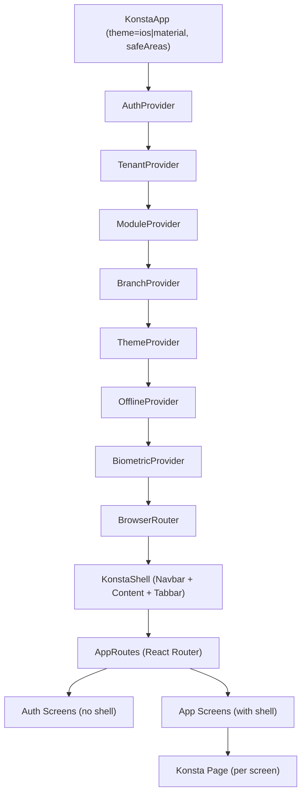

# Design Document: Mobile Konsta UI Redesign

## Overview

This design covers the frontend-only redesign of the OraInvoice mobile app, replacing the existing custom Tailwind-based UI components with Konsta UI v5 components that render native-feeling iOS and Material Design interfaces. The redesign preserves all business logic, contexts, API calls, module gating, and data flows unchanged.

### Design Goals

1. **Native feel**: Konsta UI auto-renders iOS-style on iPhone and Material Design on Android from the same component code
2. **Zero business logic changes**: All calculations, sorting, formatting, status maps, and API contracts remain byte-for-byte identical
3. **Incremental migration**: Each screen can be migrated independently — the KonstaApp wrapper and navigation shell are set up first, then screens are converted one by one
4. **Preserved architecture**: The existing context hierarchy, module gating, and routing structure remain intact

### Key Design Decisions

| Decision | Rationale |
|----------|-----------|
| Wrap KonstaApp **outside** all context providers | Konsta UI provides platform theming only — it has no dependency on app state. Placing it outermost avoids re-renders when contexts change. |
| Replace custom `TabNavigator` with Konsta `Tabbar` | Konsta Tabbar provides native tab bar styling with platform-aware animations and safe area handling built in. |
| Replace custom `AppHeader` with Konsta `Navbar` | Konsta Navbar provides native back-button behaviour, title centering, and right-slot actions matching iOS/Material patterns. |
| Use Konsta `Sheet` for More drawer (not `Panel`) | Bottom sheet is the standard mobile pattern for secondary navigation. Panel (side drawer) feels more desktop-oriented. |
| Keep existing `ModuleGate` component unchanged | It already implements the correct filtering logic. Konsta UI components are wrapped inside it. |
| Keep existing hooks (`useCamera`, `useTimer`, `usePullRefresh`, etc.) | These hooks encapsulate Capacitor plugin logic and are UI-library agnostic. They work with any component library. |
| Use Konsta `Page` with `ptr` prop for pull-to-refresh | Replaces the custom `PullRefresh` gesture component with Konsta's built-in pull-to-refresh, which handles the native feel automatically. |
| Multi-step forms use Konsta `Block` sections with stepper | Large forms (invoice create, job card create) are split into sequential steps rather than a single long scroll, matching native mobile form patterns. |

---

## Architecture

### High-Level Component Tree



### App Entry Point Changes

The root `App.tsx` wraps everything in `KonstaApp` as the outermost element:

```tsx
import { App as KonstaApp } from 'konsta/react'
import { Capacitor } from '@capacitor/core'

const platform = Capacitor.getPlatform()
const konstaTheme = platform === 'ios' ? 'ios' : 'material'

export default function App() {
  return (
    <KonstaApp theme={konstaTheme} safeAreas>
      <AuthProvider>
        <TenantProvider>
          <ModuleProvider>
            <BranchProvider>
              <ThemeProvider>
                <OfflineProvider>
                  <BiometricProvider>
                    <KonstaShell>
                      <DeepLinkHandler />
                      <AppRoutes />
                    </KonstaShell>
                  </BiometricProvider>
                </OfflineProvider>
              </ThemeProvider>
            </BranchProvider>
          </ModuleProvider>
        </TenantProvider>
      </AuthProvider>
    </KonstaApp>
  )
}
```

### File Organisation

```
mobile/src/
├── App.tsx                          # Root: KonstaApp wrapper + providers
├── components/
│   ├── common/                      # Shared components (preserved)
│   │   ├── CameraCapture.tsx        # Preserved — uses useCamera hook
│   │   ├── CustomerPicker.tsx       # Restyle with Konsta Searchbar + List
│   │   ├── ItemPicker.tsx           # Restyle with Konsta Searchbar + List
│   │   ├── LineItemEditor.tsx       # Restyle with Konsta Card per line item
│   │   ├── ModuleGate.tsx           # Preserved unchanged
│   │   └── PushNotificationHandler.tsx  # Preserved unchanged
│   ├── konsta/                      # NEW: Konsta-specific wrapper components
│   │   ├── KonstaShell.tsx          # Layout shell: Navbar + content + Tabbar
│   │   ├── KonstaTabbar.tsx         # Bottom tab bar using Konsta Tabbar
│   │   ├── KonstaNavbar.tsx         # Screen-level navbar with back/actions
│   │   ├── MoreDrawer.tsx           # Konsta Sheet with module-gated nav items
│   │   ├── KonstaFAB.tsx            # Floating action button wrapper
│   │   ├── StatusBadge.tsx          # Status chip using STATUS_CONFIG colours
│   │   ├── BranchPickerSheet.tsx    # Branch selector bottom sheet
│   │   └── HapticButton.tsx         # Button wrapper that triggers haptics
│   ├── layout/                      # Existing layout (deprecated, kept for reference)
│   └── ui/                          # Existing UI components (deprecated gradually)
├── hooks/                           # All existing hooks preserved
│   ├── useApiList.ts                # Preserved
│   ├── useApiDetail.ts              # Preserved
│   ├── useCamera.ts                 # Preserved
│   ├── useHaptics.ts                # NEW: Haptic feedback hook
│   ├── usePullRefresh.ts            # Preserved (used as fallback)
│   ├── usePushNotifications.ts      # Preserved
│   ├── useTimer.ts                  # Preserved
│   └── useGeolocation.ts            # NEW: Geolocation hook for job timer
├── navigation/
│   ├── AppRoutes.tsx                # Preserved — route definitions
│   ├── StackRoutes.tsx              # Preserved — lazy screen imports
│   ├── TabConfig.ts                 # Extended with dynamic 4th tab logic
│   ├── MoreMenuConfig.ts            # NEW: More drawer item definitions
│   └── DeepLinkHandler.tsx          # Preserved
├── screens/                         # Each screen migrated to use Konsta components
│   ├── auth/                        # Login, MFA, Signup, etc.
│   ├── dashboard/                   # Dashboard with Konsta Cards
│   ├── invoices/                    # Invoice list, detail, create/edit
│   ├── customers/                   # Customer list, profile, create
│   ├── quotes/                      # Quote list, detail, create
│   ├── jobs/                        # Job cards, active jobs board
│   ├── vehicles/                    # Vehicle list, profile
│   ├── bookings/                    # Booking calendar
│   └── ...                          # All other module screens
├── utils/
│   ├── invoiceCalc.ts               # Preserved: subtotal, discount, GST, total
│   ├── statusConfig.ts              # Preserved: STATUS_CONFIG colour map
│   ├── formatNZD.ts                 # Preserved: currency formatting
│   ├── jobSort.ts                   # Preserved: statusOrder sorting
│   ├── creditCalc.ts               # Preserved: computeCreditableAmount, computePaymentSummary
│   └── templateStyles.ts            # Preserved: resolveTemplateStyles
└── contexts/                        # All 7 contexts preserved unchanged
```

---

## Components and Interfaces

### KonstaShell — Layout Shell

The central layout component that replaces `MobileLayout`. It conditionally renders the Konsta Navbar, content area, and Tabbar based on auth state and route.

```typescript
interface KonstaShellProps {
  children: ReactNode
}
```

**Behaviour:**
- On auth routes (`/login`, `/mfa-verify`, `/forgot-password`, `/signup`, etc.): renders children only (no navbar, no tabbar)
- On authenticated routes: renders `KonstaNavbar` + scrollable content + `KonstaTabbar`
- On kiosk role: renders content only (no tabbar)
- Reads route metadata to determine navbar title, back button visibility, and right actions

### KonstaTabbar — Bottom Tab Bar

Replaces the existing `TabNavigator` with Konsta UI's `Tabbar` and `TabbarLink` components.

```typescript
// Uses existing TabConfig interface from navigation/TabConfig.ts
// Extended with dynamic 4th tab resolution

interface TabbarProps {
  // No props — reads context internally
}
```

**Dynamic 4th Tab Logic (Requirement 4.4–4.7):**

```typescript
function resolveFourthTab(enabledModules: string[]): TabConfig {
  if (enabledModules.includes('jobs')) return JOBS_TAB
  if (enabledModules.includes('quotes')) return QUOTES_TAB
  if (enabledModules.includes('bookings')) return BOOKINGS_TAB
  return REPORTS_TAB  // fallback
}
```

**Konsta UI mapping:**
| Existing | Konsta UI |
|----------|-----------|
| Custom `<nav>` with `<button>` | `<Tabbar>` with `<TabbarLink>` |
| Manual SVG icons | Ionicons via `icon` prop |
| Manual active state | `active` prop on `TabbarLink` |
| Manual safe area padding | Built-in via KonstaApp `safeAreas` |

### KonstaNavbar — Screen Header

Replaces `AppHeader` with per-screen Konsta `Navbar` components.

```typescript
interface KonstaNavbarProps {
  title: string
  subtitle?: string           // Branch selector pill
  showBack?: boolean          // Auto-detected from route depth
  onBack?: () => void
  rightActions?: ReactNode    // Search, filter, overflow menu
}
```

**Behaviour:**
- Root screens (dashboard, invoice list, etc.): title centered, no back button
- Detail screens (invoice detail, customer profile): back button on left, title centered
- Branch selector: when `branch_management` module is enabled, shows a tappable pill subtitle that opens `BranchPickerSheet`
- Right slot: screen-specific actions (search icon, filter icon, overflow `•••` menu)

### MoreDrawer — More Tab Sheet

A Konsta `Sheet` component that opens when the More tab is tapped.

```typescript
interface MoreDrawerProps {
  isOpen: boolean
  onClose: () => void
}

interface MoreMenuItem {
  id: string
  label: string
  icon: string              // Ionicon name
  path: string
  moduleSlug: string | null
  tradeFamily: string | null
  allowedRoles: UserRole[]
  adminOnly: boolean
  category: MoreMenuCategory
  badge?: number            // e.g. compliance expiring count
}

type MoreMenuCategory =
  | 'Sales'
  | 'Operations'
  | 'People'
  | 'Industry'
  | 'Assets & Compliance'
  | 'Communications'
  | 'Finance'
  | 'Other'
  | 'Account'
```

**Filtering:** Uses the existing `filterNavigationItems()` function from `TabConfig.ts` — identical logic to the desktop sidebar.

**Rendering:** Groups items by `category`, renders section headers with `BlockTitle`, and each item as a Konsta `ListItem` with leading icon, title, optional badge, and chevron.

### KonstaFAB — Floating Action Button

```typescript
interface KonstaFABProps {
  label: string             // e.g. "+ New Invoice"
  onClick: () => void
  icon?: ReactNode
}
```

Positioned bottom-right, above the Tabbar. Uses the primary brand colour from TenantContext. Triggers light haptic on tap.

### StatusBadge — Status Chip

```typescript
interface StatusBadgeProps {
  status: string            // Invoice or job status key
  size?: 'sm' | 'md'
}
```

Uses the existing `STATUS_CONFIG` map to resolve label, text colour, and background colour. Renders as a Konsta `Chip` component.

### HapticButton — Button with Haptic Feedback

```typescript
interface HapticButtonProps extends KonstaButtonProps {
  hapticStyle?: 'light' | 'medium' | 'heavy' | 'selection'
}
```

Wraps Konsta `Button` and triggers the appropriate haptic impact on press via the `useHaptics` hook.

### BranchPickerSheet — Branch Selector

```typescript
interface BranchPickerSheetProps {
  isOpen: boolean
  onClose: () => void
  onSelect: (branchId: string) => void
}
```

A Konsta `Sheet` listing available branches as `ListItem` components with radio selection. Updates `localStorage` and triggers `BranchContext` refresh.

---

## Screen-by-Screen Component Mapping

### Authentication Screens

| Screen | Route | Konsta Components | Key Behaviour |
|--------|-------|-------------------|---------------|
| Login | `/login` | `Page`, `Block`, `List`, `ListInput`, `Button` | Hero gradient header, email/password inputs, Google/Passkey buttons, dark/light aware |
| MFA Verify | `/login/mfa` | `Page`, `Block`, `ListInput`, `Segmented`, `SegmentedButton`, `Button` | 6-digit numeric input, method selector, verify button |
| Signup | `/signup` | `Page`, `Block`, `Button`, `Stepper` (custom) | 4-step wizard with progress dots |
| Forgot Password | `/forgot-password` | `Page`, `Block`, `ListInput`, `Button` | Single form, email input |
| Reset Password | `/reset-password` | `Page`, `Block`, `ListInput`, `Button` | Single form, new password input |
| Verify Email | `/verify-email` | `Page`, `Block` | Auto-verify status display |
| Landing | `/` | `Page`, `Block`, `Card`, `Button` | Marketing page, hero gradient, feature cards, pricing |
| Public Payment | `/pay/:token` | `Page`, `Block`, `Card`, `Button` | Invoice summary, Stripe Elements, pay button |

### Core App Screens

| Screen | Route | Konsta Components | Module Gate |
|--------|-------|-------------------|-------------|
| Dashboard | `/dashboard` | `Page`, `Card` (2-col grid), `Chip` (quick actions), `List`, `BlockTitle` | None |
| Invoice List | `/invoices` | `Page`, `Searchbar`, `Chip` (status filters), `List`, `ListItem`, `Fab` | None |
| Invoice Detail | `/invoices/:id` | `Page`, `Navbar`, `Card` (hero), `Block`, `List`, `Sheet` (actions) | None |
| Invoice Create/Edit | `/invoices/new`, `/invoices/:id/edit` | `Page`, `Block` (per step), `ListInput`, `List`, `Card`, `Sheet` (pickers), `Button` | None |
| Customer List | `/customers` | `Page`, `Searchbar`, `List`, `ListItem`, `Fab` | None |
| Customer Create | `/customers/new` | `Page`, `List`, `ListInput`, `Button` | None |
| Customer Profile | `/customers/:id` | `Page`, `Card` (header), `Segmented` (tabs), `List`, `ListItem` | None |
| Quote List | `/quotes` | `Page`, `Searchbar`, `Chip`, `List`, `ListItem`, `Fab` | `quotes` |
| Quote Detail | `/quotes/:id` | `Page`, `Card`, `List`, `Sheet` (actions) | `quotes` |
| Quote Create | `/quotes/new` | `Page`, `Block` (stepper), `ListInput`, `Button` | `quotes` |
| Job Card List | `/job-cards` | `Page`, `List`, `ListItem`, `Chip` (status), `Toggle` (assigned filter), `Fab` | `jobs` |
| Job Card Detail | `/job-cards/:id` | `Page`, `Card` (hero), `Block`, `List`, `Sheet` (actions) | `jobs` |
| Job Card Create | `/job-cards/new` | `Page`, `Block` (stepper), `ListInput`, `Button` | `jobs` |
| Active Jobs Board | `/jobs` | `Page`, `Card` (per job with timer), `Button` | `jobs` |
| Vehicle List | `/vehicles` | `Page`, `Searchbar`, `List`, `ListItem`, `Chip` (WOF expiry) | `vehicles` + `automotive-transport` |
| Vehicle Profile | `/vehicles/:id` | `Page`, `Card` (hero), `Block`, `List` | `vehicles` + `automotive-transport` |
| Booking Calendar | `/bookings` | `Page`, `Block` (calendar), `List`, `Sheet` (edit), `Fab` | `bookings` |

### Module Screens (More Drawer Access)

| Screen | Route | Konsta Components | Module Gate |
|--------|-------|-------------------|-------------|
| Inventory | `/inventory` | `Page`, `Segmented` (tabs), `Searchbar`, `List`, `Sheet` (detail), `Card` (reorder alerts) | `inventory` |
| Catalogue Items | `/items` | `Page`, `Segmented` (tabs), `List`, `ListItem`, `Sheet` (edit), `Fab` | `inventory` |
| Staff | `/staff` | `Page`, `List`, `ListItem`, `Chip` (role badge), `Sheet` (edit) | `staff` |
| Projects | `/projects` | `Page`, `List`, `ListItem`, `Progressbar` | `projects` |
| Expenses | `/expenses` | `Page`, `List`, `ListItem`, `Fab`, Camera integration | `expenses` |
| Time Tracking | `/time-tracking` | `Page`, `Button` (clock in/out), `List`, `ListInput` (manual entry) | `time_tracking` |
| Schedule | `/schedule` | `Page`, `Block` (calendar), `List` | `scheduling` |
| POS | `/pos` | `Page`, `Card` (product grid 2-col), `Sheet` (order panel + payment) | `pos` |
| Recurring | `/recurring` | `Page`, `List`, `ListItem`, `Chip` (frequency badge) | `recurring_invoices` |
| Purchase Orders | `/purchase-orders` | `Page`, `List`, `ListItem`, `Sheet` (detail) | `purchase_orders` |
| Progress Claims | `/progress-claims` | `Page`, `List`, `ListItem` | `progress_claims` + `building-construction` |
| Variations | `/variations` | `Page`, `List`, `ListItem` | `variations` + `building-construction` |
| Retentions | `/retentions` | `Page`, `List`, `Card` (summary) | `retentions` + `building-construction` |
| Floor Plan | `/floor-plan` | `Page`, `Block` (SVG/canvas layout) | `tables` + `food-hospitality` |
| Kitchen Display | `/kitchen` | `Page`, `Card` (large order cards) | `kitchen_display` + `food-hospitality` |
| Assets | `/assets` | `Page`, `List`, `ListItem` | `assets` |
| Compliance | `/compliance` | `Page`, `Card` (summary), `List`, `Chip` (expiry pills), Camera integration | `compliance_docs` |
| SMS | `/sms` | `Page`, `Messages` (Konsta), `Messagebar` | `sms` |
| Reports | `/reports` | `Page`, `Card` (category cards), `Sheet` (date picker), `Block` (chart/table) | None |
| Notifications | `/notifications` | `Page`, `List`, `ListItem`, `Toggle` | None |
| Portal | `/portal` | `Page`, Konsta-restyled portal components | None |
| Kiosk | `/kiosk` | `Page`, `Button` (large) | Role: `kiosk` |

---

## Data Models

All data models are **preserved unchanged** from the existing codebase. The redesign does not introduce new data models or modify existing ones. Key models referenced by the UI:

### Existing Models (No Changes)

| Model | Location | Used By |
|-------|----------|---------|
| `Invoice` | `@shared/types/invoice` | Invoice list, detail, create/edit, dashboard |
| `LineItem` | `@shared/types/invoice` | Invoice create/edit, quote create |
| `Customer` | `@shared/types/customer` | Customer list, profile, pickers |
| `Vehicle` | `@shared/types/vehicle` | Vehicle list, profile, invoice/job pickers |
| `JobCard` | `@shared/types/jobCard` | Job card list, detail, active jobs board |
| `PaymentRecord` | `@shared/types/payment` | Invoice detail payments section |
| `CreditNote` | `@shared/types/creditNote` | Invoice detail credit notes section |
| `CatalogueItem` | `@shared/types/catalogue` | Item picker, POS product grid |
| `StockItem` | `@shared/types/inventory` | Inventory list, stock adjustment |
| `InvoiceAttachment` | `@shared/types/attachment` | Invoice detail attachments section |

### New Interfaces (UI-Only)

```typescript
/** Configuration for a More drawer menu item */
interface MoreMenuItem {
  id: string
  label: string
  icon: string                    // Ionicon name
  path: string
  moduleSlug: string | null
  tradeFamily: string | null
  allowedRoles: UserRole[]
  adminOnly: boolean
  category: MoreMenuCategory
  badge?: number
}

/** Screen metadata for KonstaNavbar configuration */
interface ScreenMeta {
  title: string
  showBack: boolean
  rightActions: NavAction[]
  showBranchSelector: boolean
}

interface NavAction {
  icon: string
  label: string
  onPress: () => void
}
```

### New Hooks

```typescript
/** useHaptics — wraps @capacitor/haptics with platform guard */
interface UseHapticsResult {
  light: () => Promise<void>
  medium: () => Promise<void>
  heavy: () => Promise<void>
  selection: () => Promise<void>
}

/** useGeolocation — wraps @capacitor/geolocation with silent failure */
interface UseGeolocationResult {
  getCurrentPosition: () => Promise<{ lat: number; lng: number } | null>
}
```

---

## Correctness Properties

*A property is a characteristic or behavior that should hold true across all valid executions of a system — essentially, a formal statement about what the system should do. Properties serve as the bridge between human-readable specifications and machine-verifiable correctness guarantees.*

### Property 1: Tab bar always shows core tabs and resolves dynamic 4th tab

*For any* set of enabled module slugs (including the empty set), the bottom tab bar resolution function SHALL return exactly 5 tabs where: (a) Home, Invoices, Customers, and More are always present, and (b) the 4th tab is Jobs if `jobs` is enabled, else Quotes if `quotes` is enabled, else Bookings if `bookings` is enabled, else Reports as fallback.

**Validates: Requirements 4.3, 4.4, 4.5, 4.6, 4.7**

### Property 2: Navigation item filtering matches sidebar logic

*For any* combination of enabled module slugs, trade family (including null), user role, and set of navigation items (each with moduleSlug, tradeFamily, and allowedRoles), the `filterNavigationItems` function SHALL return only items where: (a) the item's moduleSlug is null OR is in the enabled set, AND (b) the item's tradeFamily is null OR matches the current trade family, AND (c) the item's allowedRoles is empty OR contains the user's role. No other items shall be included or excluded.

**Validates: Requirements 5.2, 5.4, 5.5, 5.6, 55.2, 55.4, 55.5**

### Property 3: Invoice calculation correctness

*For any* valid set of line items (each with non-negative quantity, non-negative unit_price, tax_rate in [0, 1], gst_inclusive boolean, and optional inclusive_price), discount type ('percentage' or 'fixed') with non-negative value, non-negative shipping charges, and adjustment value, the invoice total calculation SHALL satisfy: `total = (subtotal - discountAmount) + taxAmount + shippingCharges + adjustment`, where subtotal is the sum of line item amounts, discountAmount is `subtotal * discountValue / 100` for percentage or `discountValue` for fixed, and taxAmount handles inclusive/exclusive/exempt per line with rounding to 2 decimal places.

**Validates: Requirements 20.8, 56.1**

### Property 4: Job card sorting invariant

*For any* list of job cards (each with a status in {open, in_progress, completed, invoiced} and a created_at ISO timestamp), sorting with the statusOrder function SHALL produce a list where: (a) all `in_progress` jobs appear before all `open` jobs, (b) all `open` jobs appear before all `completed` and `invoiced` jobs, and (c) within each status group, jobs are ordered by `created_at` descending (most recent first).

**Validates: Requirements 25.1, 56.3**

### Property 5: Currency formatting correctness

*For any* numeric value (including 0, negative numbers, and large numbers up to 1e12), `formatNZD(value)` SHALL return a string that starts with `"NZD"` followed by a locale-formatted number with exactly 2 decimal places. Additionally, `formatNZD(null)` and `formatNZD(undefined)` SHALL both return `"NZD0.00"`.

**Validates: Requirements 56.4**

### Property 6: Status colour mapping completeness

*For any* valid invoice status key in the set {draft, issued, partially_paid, paid, overdue, voided, refunded, partially_refunded}, `STATUS_CONFIG[status]` SHALL return an object with a non-empty `label` string, a non-empty `color` string containing a Tailwind text colour class, and a non-empty `bg` string containing a Tailwind background colour class.

**Validates: Requirements 10.3, 56.2**

---

## Error Handling

### API Error Handling

All API calls follow the existing safe consumption pattern:

| Error Type | Handling |
|------------|----------|
| Network error (offline) | Show red offline banner via `@capacitor/network` listener. API calls fail gracefully — show error banner with retry button on the screen. |
| 401 Unauthorized | Existing AuthContext mutex refresh handles this. If refresh fails, redirect to login. No changes needed. |
| 404 Not Found | Show "Not found" empty state on detail screens. Navigate back on list screens. |
| 500 Server Error | Show error banner with retry button. Log error for debugging. |
| AbortController cancellation | Silently ignored (existing pattern: `if (!axios.isCancel(err)) handleError(err)`). |
| Malformed response | Safe consumption patterns (`?.` and `?? []`) prevent crashes. Render empty/default state. |

### Native Plugin Error Handling

| Plugin | Error Handling |
|--------|---------------|
| Camera | Falls back to `<input type="file">` on web. On native, catches permission denial and shows toast. Never blocks the form. |
| Geolocation | Silent failure — if permission denied or timeout, continues without coordinates. Never blocks timer start. |
| Push Notifications | If permission denied, continues without push. Shows in-app notifications only. |
| Haptics | If device doesn't support haptics or running in browser, `useHaptics` hook no-ops silently. |
| Network | If Network plugin unavailable, offline banner is not shown (assumes online). |

### Form Validation Errors

| Form | Validation |
|------|------------|
| Invoice Create | Customer required, at least one line item with description. Show inline Konsta `ListInput` error state. |
| Customer Create | First Name required. Show inline error. |
| MFA Verify | 6-digit code required. Show error toast on invalid code. |
| Record Payment | Amount > 0 and ≤ balance due. Show inline error. |
| Void Invoice | Reason required. Show inline error. |

---

## Testing Strategy

### Testing Framework

- **Unit tests**: Vitest + React Testing Library (existing setup)
- **Property tests**: fast-check v4 (already in devDependencies)
- **Component tests**: React Testing Library with Konsta UI components
- **Property test configuration**: Minimum 100 iterations per property test

### Property-Based Tests

Each property test must be tagged with a comment referencing the design property:

```typescript
// Feature: mobile-konsta-redesign, Property 1: Tab bar always shows core tabs and resolves dynamic 4th tab
```

| Property | Test File | What It Generates | What It Asserts |
|----------|-----------|-------------------|-----------------|
| 1: Tab bar resolution | `components/konsta/__tests__/KonstaTabbar.property.test.ts` | Random sets of module slugs | Core tabs always present, 4th tab follows priority chain |
| 2: Navigation filtering | `navigation/__tests__/TabConfig.property.test.ts` | Random module sets, trade families, roles, nav items | Only correctly-gated items pass filter |
| 3: Invoice calculation | `utils/__tests__/invoiceCalc.property.test.ts` | Random line items with various tax modes, discounts, shipping | Total = (subtotal - discount) + tax + shipping + adjustment |
| 4: Job card sorting | `utils/__tests__/jobSort.property.test.ts` | Random lists of job cards with various statuses and dates | in_progress before open before others, created_at desc within groups |
| 5: Currency formatting | `utils/__tests__/formatNZD.property.test.ts` | Random numbers, null, undefined | Output starts with "NZD", has 2 decimal places |
| 6: Status colour mapping | `utils/__tests__/statusConfig.property.test.ts` | Random valid status keys | Returns object with non-empty label, color, bg |

### Example-Based Unit Tests

Focus areas for example-based tests (not exhaustive):

- **KonstaApp wrapper**: Renders with correct theme per platform, safeAreas enabled, wraps providers
- **KonstaShell**: Hides shell on auth routes, shows shell on authenticated routes, hides tabbar for kiosk role
- **MoreDrawer**: Opens on More tab tap, groups items by category, navigates and closes on item tap
- **Screen smoke tests**: Each screen renders without crashing with mocked API data
- **ModuleGate**: Hides content when module disabled, shows when enabled, respects trade family and role
- **FAB**: Appears on list screens, navigates to create form on tap
- **Pull-to-refresh**: Triggers API refetch on pull gesture
- **Camera integration**: Falls back to file input in browser, calls Capacitor Camera on native
- **Haptics**: Calls correct impact style, no-ops on web

### Integration Tests

- Context preservation: All 7 contexts still provide correct values after KonstaApp wrapping
- API endpoint signatures: Verify all API calls use correct paths, methods, and parameters
- TenantContext brand colour propagation: Changing primary colour updates Konsta component styling
- Push notification registration: Device token sent to backend on login

### Test Organisation

```
mobile/src/
├── components/konsta/__tests__/
│   ├── KonstaShell.test.tsx
│   ├── KonstaTabbar.test.tsx
│   ├── KonstaTabbar.property.test.ts    # Property 1
│   ├── MoreDrawer.test.tsx
│   ├── StatusBadge.test.tsx
│   └── StatusBadge.property.test.ts     # Property 6
├── navigation/__tests__/
│   └── TabConfig.property.test.ts       # Property 2
├── utils/__tests__/
│   ├── invoiceCalc.property.test.ts     # Property 3
│   ├── jobSort.property.test.ts         # Property 4
│   └── formatNZD.property.test.ts       # Property 5
├── screens/<feature>/__tests__/
│   └── <Screen>.test.tsx                # Example-based per screen
└── hooks/__tests__/
    ├── useHaptics.test.ts
    └── useGeolocation.test.ts
```

### What Is NOT Tested with PBT

| Area | Reason | Alternative |
|------|--------|-------------|
| UI rendering and layout | Visual, not computable | Snapshot tests, manual inspection |
| Capacitor plugin integration | External service behaviour | Mocked integration tests |
| Dark mode styling | CSS visual check | Visual regression |
| Safe area insets | Device-specific layout | Manual testing on device |
| Touch target sizes (44×44px) | Layout measurement | Manual accessibility audit |
| API endpoint signatures | Deterministic, doesn't vary with input | Example-based integration tests |
