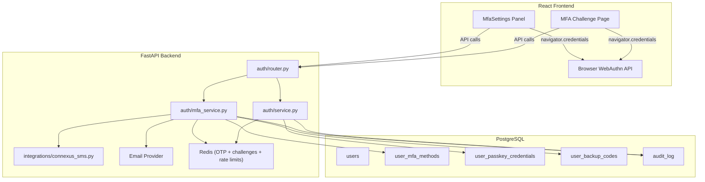
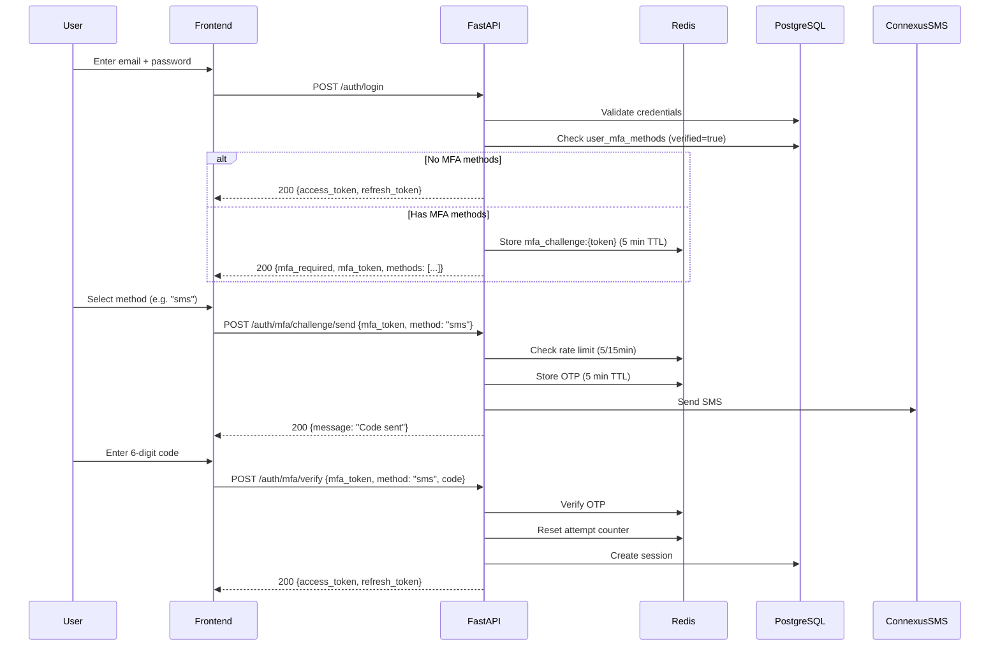

# Design Document: Multi-Method MFA

## Overview

This design extends BudgetFlow's existing MFA infrastructure to support four concurrent second-factor methods (TOTP, SMS, Email, Passkey/WebAuthn) with unified enrolment, challenge, and management flows. The system builds on the current `mfa_service.py` (TOTP/SMS/Email enrolment and verification), `service.py` (passkey registration/login via `py_webauthn`), and the JSONB-based storage on the `users` table (`mfa_methods`, `passkey_credentials`, `backup_codes_hash`).

Key design decisions:

1. **Normalised database tables** — Migrate from JSONB columns on `users` to dedicated `user_mfa_methods`, `user_passkey_credentials`, and `user_backup_codes` tables. This enables proper indexing, foreign key constraints, and avoids JSONB mutation race conditions when multiple methods are modified concurrently.
2. **Unified MFA challenge flow** — A single `/auth/mfa/challenge` endpoint returns available methods; the user picks one and verifies via `/auth/mfa/verify`. Passkey verification delegates to the WebAuthn assertion ceremony.
3. **OTP rate limiting via Redis** — Sliding-window counters per user per method (5 requests / 15 min) stored in Redis, consistent with the existing Redis-based OTP storage pattern.
4. **Connexus SMS integration** — Replace the placeholder `_send_sms_otp` stub with the existing `ConnexusSmsClient.send()` from `app/integrations/connexus_sms.py`.
5. **Frontend MFA Settings panel** — Replace the read-only MFA section in `Profile.tsx` with an interactive `MfaSettings` component containing method cards, guided enrolment wizards, passkey management, and backup code generation.

## Architecture



### Login Flow with MFA



## Components and Interfaces

### Backend API Endpoints

All endpoints are under `/api/v1/auth/`.

#### Enrolment Endpoints

| Method | Path | Auth | Description |
|--------|------|------|-------------|
| POST | `/mfa/enrol` | JWT | Start enrolment for a method (totp, sms, email). Returns QR URI for TOTP or sends OTP for SMS/email. |
| POST | `/mfa/enrol/verify` | JWT | Verify enrolment code to activate a method. |
| POST | `/passkey/register/options` | JWT | Generate WebAuthn registration options. Accepts `device_name`. |
| POST | `/passkey/register/verify` | JWT | Verify attestation response and store credential. |

#### Challenge / Login Endpoints

| Method | Path | Auth | Description |
|--------|------|------|-------------|
| POST | `/mfa/challenge/send` | MFA token | Send OTP for selected method (sms/email) during login challenge. |
| POST | `/mfa/verify` | MFA token | Verify MFA code (totp, sms, email, backup). Issues JWT tokens on success. |
| POST | `/passkey/login/options` | None | Generate WebAuthn assertion options for a user (by email). |
| POST | `/passkey/login/verify` | None | Verify assertion response. Issues JWT tokens. |

#### Management Endpoints

| Method | Path | Auth | Description |
|--------|------|------|-------------|
| GET | `/mfa/methods` | JWT | List all MFA methods with status for the current user. |
| DELETE | `/mfa/methods/{method}` | JWT | Disable/remove an MFA method. Requires `password` in body. |
| POST | `/mfa/backup-codes` | JWT | Generate (or regenerate) 10 backup codes. Invalidates previous set. |
| GET | `/passkey/credentials` | JWT | List registered passkeys (id, name, created_at, last_used_at). |
| PATCH | `/passkey/credentials/{credential_id}` | JWT | Rename a passkey (update friendly name). |
| DELETE | `/passkey/credentials/{credential_id}` | JWT | Remove a passkey. Requires `password` in body. |

### Request/Response Schemas

```python
# --- Enrolment ---
class MFAEnrolRequest(BaseModel):
    method: Literal["totp", "sms", "email"]
    phone_number: str | None = None  # Required for SMS

class MFAEnrolResponse(BaseModel):
    method: str
    qr_uri: str | None = None       # TOTP only
    secret: str | None = None        # TOTP manual entry fallback
    message: str

class MFAEnrolVerifyRequest(BaseModel):
    method: Literal["totp", "sms", "email"]
    code: str  # 6-digit code

# --- Challenge ---
class MFAChallengeResponse(BaseModel):
    mfa_required: bool = True
    mfa_token: str
    methods: list[str]  # ["totp", "sms", "email", "passkey"]

class MFAChallengeSendRequest(BaseModel):
    mfa_token: str
    method: Literal["sms", "email"]

class MFAVerifyRequest(BaseModel):
    mfa_token: str
    method: Literal["totp", "sms", "email", "backup"]
    code: str

# --- Management ---
class MFAMethodStatus(BaseModel):
    method: str
    enabled: bool
    verified_at: datetime | None = None
    phone_number: str | None = None  # Masked, e.g. "***1234"

class MFADisableRequest(BaseModel):
    password: str

class PasskeyCredentialInfo(BaseModel):
    credential_id: str
    device_name: str
    created_at: datetime
    last_used_at: datetime | None = None

class PasskeyRenameRequest(BaseModel):
    device_name: str  # max 50 chars

class PasskeyRemoveRequest(BaseModel):
    password: str

class MFABackupCodesResponse(BaseModel):
    codes: list[str]  # 10 plain-text codes, shown once
```

### Service Layer

#### `mfa_service.py` — Extended

Key functions (new or modified):

| Function | Description |
|----------|-------------|
| `enrol_mfa(db, user, method, phone_number)` | Start enrolment. TOTP: generate secret, return QR + plain secret. SMS: validate phone, send OTP via Connexus. Email: send OTP. Stores pending record in `user_mfa_methods`. |
| `verify_enrolment(db, user, method, code)` | Verify enrolment code. Marks method as `verified=True`. For TOTP, validates against stored secret. For SMS/email, validates Redis OTP. |
| `send_challenge_otp(db, user_id, method, mfa_token)` | During login challenge, send OTP for selected method. Enforces rate limit. |
| `verify_mfa(db, mfa_token, method, code, ...)` | Verify MFA code during login. 5-attempt lockout. Issues JWT on success. |
| `disable_mfa_method(db, user, method, password)` | Remove method after password confirmation. Checks org MFA policy for last-method guard. |
| `get_user_mfa_status(db, user)` | Return list of `MFAMethodStatus` for all 4 method types. |
| `generate_backup_codes(db, user)` | Generate 10 codes, hash with bcrypt, store in `user_backup_codes`, return plain codes. Invalidates previous set. |
| `check_otp_rate_limit(user_id, method)` | Redis sliding window: 5 sends per method per 15 min. Raises `RateLimitExceeded` if exceeded. |

#### `service.py` — Passkey Functions (Extended)

| Function | Description |
|----------|-------------|
| `generate_passkey_register_options(user, device_name)` | Generate WebAuthn registration challenge. Exclude existing credential IDs. Max 10 credentials enforced. 60s timeout. |
| `verify_passkey_registration(db, user, credential_response)` | Verify attestation, store credential in `user_passkey_credentials`. Also ensure `passkey` entry exists in `user_mfa_methods`. |
| `generate_passkey_login_options(db, user_id)` | Generate WebAuthn assertion challenge with user's credential IDs. 60s timeout. |
| `verify_passkey_login(db, credential_response, ...)` | Verify assertion, check sign count for clone detection. Flag credential if sign count anomaly. Issue JWT tokens. |
| `list_passkey_credentials(db, user)` | Return list of credentials with friendly name, dates. |
| `rename_passkey(db, user, credential_id, new_name)` | Update friendly name. |
| `remove_passkey(db, user, credential_id, password)` | Delete credential after password confirmation. Last-method guard. |

### Frontend Components

| Component | Location | Description |
|-----------|----------|-------------|
| `MfaSettings` | `frontend/src/pages/settings/MfaSettings.tsx` | Main MFA management panel. Renders method cards, backup codes section. |
| `MfaMethodCard` | `frontend/src/components/mfa/MfaMethodCard.tsx` | Card for each method type showing status, enable/disable actions. |
| `TotpEnrolWizard` | `frontend/src/components/mfa/TotpEnrolWizard.tsx` | Step-by-step TOTP setup: QR code display, manual secret, code verification. |
| `SmsEnrolWizard` | `frontend/src/components/mfa/SmsEnrolWizard.tsx` | Phone number input with international validation, OTP verification. |
| `EmailEnrolWizard` | `frontend/src/components/mfa/EmailEnrolWizard.tsx` | OTP verification for email method. |
| `PasskeyManager` | `frontend/src/components/mfa/PasskeyManager.tsx` | List passkeys, register new, rename, remove. WebAuthn API detection. |
| `BackupCodesPanel` | `frontend/src/components/mfa/BackupCodesPanel.tsx` | Generate/regenerate codes, copy/download, warning display. |
| `MfaChallengePage` | `frontend/src/pages/auth/MfaChallenge.tsx` | Login MFA challenge: method selection, code input, passkey assertion. |
| `PasswordConfirmModal` | `frontend/src/components/mfa/PasswordConfirmModal.tsx` | Reusable modal for password confirmation before destructive actions. |

## Data Models

### Database Schema Changes

#### New Table: `user_mfa_methods`

Replaces the `mfa_methods` JSONB column on `users`.

```sql
CREATE TABLE user_mfa_methods (
    id              UUID PRIMARY KEY DEFAULT gen_random_uuid(),
    user_id         UUID NOT NULL REFERENCES users(id) ON DELETE CASCADE,
    method          VARCHAR(10) NOT NULL,  -- 'totp', 'sms', 'email', 'passkey'
    verified        BOOLEAN NOT NULL DEFAULT FALSE,
    phone_number    VARCHAR(20),           -- SMS only, stored in clear for sending
    secret_encrypted BYTEA,                -- TOTP only, envelope-encrypted secret
    enrolled_at     TIMESTAMPTZ NOT NULL DEFAULT now(),
    verified_at     TIMESTAMPTZ,
    CONSTRAINT uq_user_mfa_method UNIQUE (user_id, method),
    CONSTRAINT chk_method CHECK (method IN ('totp', 'sms', 'email', 'passkey'))
);

CREATE INDEX idx_user_mfa_methods_user ON user_mfa_methods(user_id);
```

#### New Table: `user_passkey_credentials`

Replaces the `passkey_credentials` JSONB column on `users`.

```sql
CREATE TABLE user_passkey_credentials (
    id              UUID PRIMARY KEY DEFAULT gen_random_uuid(),
    user_id         UUID NOT NULL REFERENCES users(id) ON DELETE CASCADE,
    credential_id   VARCHAR(512) NOT NULL UNIQUE,  -- base64-encoded WebAuthn credential ID
    public_key      TEXT NOT NULL,                  -- base64-encoded DER public key
    public_key_alg  INTEGER NOT NULL,               -- COSE algorithm identifier
    sign_count      BIGINT NOT NULL DEFAULT 0,
    device_name     VARCHAR(50) NOT NULL DEFAULT 'My Passkey',
    flagged         BOOLEAN NOT NULL DEFAULT FALSE,  -- clone detection flag
    created_at      TIMESTAMPTZ NOT NULL DEFAULT now(),
    last_used_at    TIMESTAMPTZ
);

CREATE INDEX idx_passkey_creds_user ON user_passkey_credentials(user_id);
CREATE INDEX idx_passkey_creds_credential_id ON user_passkey_credentials(credential_id);
```

#### New Table: `user_backup_codes`

Replaces the `backup_codes_hash` JSONB column on `users`.

```sql
CREATE TABLE user_backup_codes (
    id          UUID PRIMARY KEY DEFAULT gen_random_uuid(),
    user_id     UUID NOT NULL REFERENCES users(id) ON DELETE CASCADE,
    code_hash   VARCHAR(128) NOT NULL,  -- bcrypt hash
    used        BOOLEAN NOT NULL DEFAULT FALSE,
    created_at  TIMESTAMPTZ NOT NULL DEFAULT now(),
    used_at     TIMESTAMPTZ
);

CREATE INDEX idx_backup_codes_user ON user_backup_codes(user_id);
```

#### Migration: Deprecate JSONB Columns

An Alembic migration will:
1. Create the three new tables.
2. Migrate existing data from `users.mfa_methods`, `users.passkey_credentials`, and `users.backup_codes_hash` into the new tables.
3. Drop the JSONB columns from `users` (or mark as deprecated with a follow-up migration).

### Redis Keys

| Key Pattern | TTL | Description |
|-------------|-----|-------------|
| `mfa:otp:{method}:{user_id}` | 300s (SMS) / 600s (email) | Stored OTP code for enrolment or challenge verification |
| `mfa:attempts:{user_id}` | 900s | Failed MFA attempt counter (max 5) |
| `mfa:rate:{method}:{user_id}` | 900s | OTP send rate limit counter (max 5 per 15 min) |
| `mfa:challenge:{mfa_token_hash}` | 300s | MFA challenge session data (user_id, available methods) |
| `webauthn:register:{user_id}` | 60s | WebAuthn registration challenge |
| `webauthn:login:{user_id}` | 60s | WebAuthn authentication challenge |

### SQLAlchemy Models

```python
class UserMfaMethod(Base):
    __tablename__ = "user_mfa_methods"

    id = Column(UUID, primary_key=True, default=uuid.uuid4)
    user_id = Column(UUID, ForeignKey("users.id", ondelete="CASCADE"), nullable=False)
    method = Column(String(10), nullable=False)
    verified = Column(Boolean, nullable=False, default=False)
    phone_number = Column(String(20), nullable=True)
    secret_encrypted = Column(LargeBinary, nullable=True)
    enrolled_at = Column(DateTime(timezone=True), nullable=False, server_default=func.now())
    verified_at = Column(DateTime(timezone=True), nullable=True)

    __table_args__ = (
        UniqueConstraint("user_id", "method", name="uq_user_mfa_method"),
        CheckConstraint("method IN ('totp', 'sms', 'email', 'passkey')", name="chk_method"),
    )


class UserPasskeyCredential(Base):
    __tablename__ = "user_passkey_credentials"

    id = Column(UUID, primary_key=True, default=uuid.uuid4)
    user_id = Column(UUID, ForeignKey("users.id", ondelete="CASCADE"), nullable=False)
    credential_id = Column(String(512), nullable=False, unique=True)
    public_key = Column(Text, nullable=False)
    public_key_alg = Column(Integer, nullable=False)
    sign_count = Column(BigInteger, nullable=False, default=0)
    device_name = Column(String(50), nullable=False, default="My Passkey")
    flagged = Column(Boolean, nullable=False, default=False)
    created_at = Column(DateTime(timezone=True), nullable=False, server_default=func.now())
    last_used_at = Column(DateTime(timezone=True), nullable=True)


class UserBackupCode(Base):
    __tablename__ = "user_backup_codes"

    id = Column(UUID, primary_key=True, default=uuid.uuid4)
    user_id = Column(UUID, ForeignKey("users.id", ondelete="CASCADE"), nullable=False)
    code_hash = Column(String(128), nullable=False)
    used = Column(Boolean, nullable=False, default=False)
    created_at = Column(DateTime(timezone=True), nullable=False, server_default=func.now())
    used_at = Column(DateTime(timezone=True), nullable=True)
```


## Correctness Properties

*A property is a characteristic or behavior that should hold true across all valid executions of a system — essentially, a formal statement about what the system should do. Properties serve as the bridge between human-readable specifications and machine-verifiable correctness guarantees.*

### Property 1: TOTP secret conforms to RFC 6238

*For any* TOTP enrolment response, the generated secret SHALL be a valid base32 string, and constructing a `pyotp.TOTP` with that secret using a 30-second interval and SHA-1 algorithm SHALL produce valid 6-digit codes that verify within a ±1 window.

**Validates: Requirements 1.1, 1.2**

### Property 2: TOTP provisioning URI correctness

*For any* TOTP enrolment response, the returned provisioning URI SHALL be a valid `otpauth://totp/` URI containing the issuer "BudgetFlow" and the user's email, and the plain-text secret SHALL be included in the response for manual entry.

**Validates: Requirements 1.2, 1.5**

### Property 3: TOTP enrolment round-trip

*For any* user with a pending TOTP enrolment, generating the current valid TOTP code from the stored secret and submitting it for verification SHALL result in the TOTP method being marked as `verified=True` in the database.

**Validates: Requirements 1.3**

### Property 4: Invalid TOTP code rejection

*For any* user with a pending TOTP enrolment and *for any* 6-digit string that does not match the current or adjacent TOTP window, submitting that code SHALL be rejected and the method SHALL remain unverified.

**Validates: Requirements 1.4**

### Property 5: OTP enrolment round-trip (SMS and Email)

*For any* user and *for any* OTP-based method (SMS or email), initiating enrolment SHALL store a 6-digit OTP in Redis, and submitting that exact OTP SHALL mark the method as verified and persist method-specific data (phone number for SMS). The OTP SHALL be consumed after successful verification.

**Validates: Requirements 2.1, 2.3, 3.1, 3.3**

### Property 6: Invalid OTP rejection

*For any* user with a pending SMS or email enrolment and *for any* code that does not match the stored OTP, verification SHALL be rejected and the method SHALL remain unverified.

**Validates: Requirements 2.4, 3.4**

### Property 7: OTP expiry matches method configuration

*For any* OTP stored in Redis, the TTL SHALL be 300 seconds for SMS and 600 seconds for email.

**Validates: Requirements 2.2, 3.2**

### Property 8: Multi-method concurrent enrolment

*For any* user, enrolling and verifying all four method types (totp, sms, email, passkey) SHALL succeed, and querying the user's MFA methods SHALL return exactly those four methods. The unique constraint (user_id, method) SHALL prevent duplicate method entries.

**Validates: Requirements 4.1**

### Property 9: MFA challenge lists all verified methods

*For any* user with N verified MFA methods (where N ≥ 1), the MFA challenge response SHALL contain `mfa_required=true`, a valid `mfa_token`, and a `methods` list containing exactly the N verified method types.

**Validates: Requirements 4.2, 6.2**

### Property 10: MFA challenge method isolation

*For any* user with multiple verified methods, selecting a specific method during the MFA challenge SHALL only send/accept codes for that method. A valid code for method A SHALL NOT satisfy verification when submitted for method B.

**Validates: Requirements 4.3**

### Property 11: Method disable removes method and associated data

*For any* user with a verified MFA method, disabling that method with a valid password SHALL remove the method record from the database. For TOTP, the encrypted secret SHALL be deleted. For SMS, the phone number SHALL be deleted.

**Validates: Requirements 4.5, 7.2, 7.3, 7.4**

### Property 12: Last-method guard in MFA-mandatory organisations

*For any* user with exactly one remaining verified MFA method in an organisation where MFA is mandatory, attempting to disable that method SHALL be rejected with an error indicating at least one method must remain active.

**Validates: Requirements 4.6, 13.5**

### Property 13: Backup code generation produces exactly 10 hashed codes

*For any* user, generating backup codes SHALL return exactly 10 plain-text alphanumeric codes, and the database SHALL contain exactly 10 corresponding entries with bcrypt hashes that do not equal the plain-text codes.

**Validates: Requirements 5.1, 5.2**

### Property 14: Backup code regeneration invalidates previous codes

*For any* user who generates backup codes and then regenerates them, *for all* codes from the first generation, attempting to use any of them SHALL fail. Only codes from the latest generation SHALL be valid.

**Validates: Requirements 5.3**

### Property 15: Backup code single-use enforcement

*For any* valid backup code, using it once during MFA verification SHALL succeed, and using the same code a second time SHALL fail. The code SHALL be marked as consumed with a `used_at` timestamp.

**Validates: Requirements 5.6**

### Property 16: MFA-enabled login returns challenge token, not access tokens

*For any* user with at least one verified MFA method, providing valid credentials to the login endpoint SHALL return an `MFAChallengeResponse` with `mfa_required=true` and an `mfa_token`, and SHALL NOT return `access_token` or `refresh_token`.

**Validates: Requirements 6.1**

### Property 17: Successful MFA verification issues JWT tokens

*For any* valid MFA verification (correct code for the selected method), the response SHALL contain both `access_token` and `refresh_token`, and a new session SHALL be created in the database.

**Validates: Requirements 6.5**

### Property 18: MFA lockout after 5 consecutive failures

*For any* user, after 5 consecutive failed MFA verification attempts, the 6th attempt SHALL be rejected with a lockout error regardless of whether the submitted code is correct. The lockout SHALL persist until the Redis counter expires (15 minutes).

**Validates: Requirements 6.6**

### Property 19: MFA challenge token expires after 5 minutes

*For any* MFA challenge token stored in Redis, the TTL SHALL be 300 seconds. Attempting to verify with an expired token SHALL fail.

**Validates: Requirements 6.7**

### Property 20: Destructive MFA operations require password confirmation

*For any* MFA method disable or passkey removal request, submitting without a valid password SHALL be rejected with an authentication error. Only requests with the correct current password SHALL proceed.

**Validates: Requirements 7.1, 13.3**

### Property 21: OTP rate limiting (5 per method per 15 minutes)

*For any* user and *for any* OTP method (SMS or email), sending 5 OTP requests within a 15-minute window SHALL succeed, and the 6th request SHALL be rejected with a rate-limit error. Rate limits for SMS and email SHALL be tracked independently.

**Validates: Requirements 9.1, 9.2, 9.3**

### Property 22: MFA endpoints require authenticated session

*For any* MFA enrolment or management endpoint, requests without a valid JWT access token SHALL be rejected with HTTP 401.

**Validates: Requirements 10.1, 10.2**

### Property 23: Audit logging for all MFA operations

*For any* MFA operation (enrolment start, verification success/failure, method removal, backup code generation, passkey registration/removal), an entry SHALL be written to the `audit_log` table with the appropriate action, user_id, and operation details.

**Validates: Requirements 10.3**

### Property 24: WebAuthn registration options correctness

*For any* passkey registration request, the returned options SHALL contain the Relying Party ID matching the BudgetFlow domain, a timeout of 60000 milliseconds, and an exclude list containing all of the user's existing credential IDs.

**Validates: Requirements 11.1, 11.2**

### Property 25: Passkey friendly name persistence

*For any* passkey registration with a user-provided device name, the stored credential SHALL have that exact friendly name. *For any* rename operation with a new name, querying the credential afterward SHALL return the updated name.

**Validates: Requirements 11.4, 13.2**

### Property 26: Passkey credential limit enforcement

*For any* user with 10 registered passkey credentials, attempting to register an 11th SHALL be rejected with an error indicating the maximum has been reached.

**Validates: Requirements 11.6**

### Property 27: WebAuthn assertion options contain user credentials

*For any* user with registered passkeys, the authentication ceremony options SHALL contain an allow list with all of the user's non-flagged credential IDs and a timeout of 60000 milliseconds.

**Validates: Requirements 12.1**

### Property 28: Sign count monotonic update

*For any* passkey authentication where the authenticator returns a sign count S' strictly greater than the stored sign count S, the stored sign count SHALL be updated to S'.

**Validates: Requirements 12.3**

### Property 29: Clone detection via sign count

*For any* passkey authentication where the authenticator returns a sign count S' ≤ the stored sign count S (and S > 0), the authentication SHALL be rejected and the credential SHALL be flagged (`flagged=True`).

**Validates: Requirements 12.5**

### Property 30: Passkey list returns complete credential info

*For any* user with registered passkeys, the list endpoint SHALL return all credentials, each containing `credential_id`, `device_name`, `created_at`, and `last_used_at` fields.

**Validates: Requirements 13.1**

### Property 31: Passkey removal deletes credential

*For any* user with a passkey credential, after password-confirmed removal, the credential SHALL no longer exist in the `user_passkey_credentials` table, and the credential ID SHALL not appear in subsequent list queries.

**Validates: Requirements 13.4**

## Error Handling

### Backend Error Responses

| Scenario | HTTP Status | Error Detail |
|----------|-------------|--------------|
| Invalid MFA method type | 400 | "Unsupported MFA method: {method}" |
| Missing phone number for SMS enrolment | 400 | "phone_number is required for SMS MFA enrolment" |
| Invalid/expired OTP code | 400 | "Invalid or expired verification code" |
| Invalid TOTP code | 400 | "Invalid TOTP code" |
| MFA token expired or invalid | 401 | "Invalid or expired MFA token" |
| JWT access token missing/expired | 401 | "Authentication required" |
| Incorrect password for disable/remove | 401 | "Invalid password" |
| MFA lockout (5 failures) | 429 | "MFA verification locked due to too many failed attempts. Try again later." |
| OTP rate limit exceeded | 429 | "Too many code requests. Please wait before requesting a new code." |
| Last MFA method in mandatory org | 409 | "Cannot disable the last MFA method. At least one method is required by your organisation." |
| Passkey limit reached (10) | 409 | "Maximum number of passkeys (10) reached. Remove an existing passkey to register a new one." |
| WebAuthn registration challenge expired | 400 | "Registration challenge expired or not found" |
| WebAuthn assertion failed | 400 | "Passkey authentication failed" |
| Sign count anomaly (clone detection) | 403 | "Passkey credential flagged for security review. Please contact your administrator." |
| SMS delivery failure | 502 | "SMS could not be delivered. Please try again." |
| Email delivery failure | 502 | "Verification email could not be sent. Please try again." |
| Browser does not support WebAuthn | N/A | Frontend displays: "Your browser does not support passkeys. Please use a supported browser." |

### Error Handling Strategy

1. **Validation errors** (400) — Return immediately with descriptive messages. Do not leak internal state.
2. **Authentication errors** (401) — Uniform error messages to prevent user enumeration.
3. **Rate limiting** (429) — Include `Retry-After` header with seconds until the window resets.
4. **Conflict errors** (409) — Clear explanation of why the operation cannot proceed and what the user should do.
5. **External service failures** (502) — Log the full error internally, return a user-friendly message, allow retry.
6. **All errors** — Write to `audit_log` for security-relevant operations (failed verifications, lockouts, clone detection).

### Redis Failure Handling

If Redis is unavailable:
- OTP storage/retrieval fails → Return 503 "Service temporarily unavailable"
- Rate limit checks fail → Fail open (allow the request) but log a warning
- MFA challenge storage fails → Return 503

## Testing Strategy

### Property-Based Testing

Library: **Hypothesis** (Python backend), **fast-check** (TypeScript frontend)

Each property test MUST:
- Run a minimum of 100 iterations
- Reference the design property with a comment tag
- Use the format: `# Feature: multi-method-mfa, Property {N}: {title}`

Property tests cover the 31 correctness properties defined above, focusing on:
- OTP generation, storage, and verification round-trips
- Backup code generation, hashing, single-use enforcement, and regeneration invalidation
- Rate limiting counter behavior across methods
- Sign count monotonicity and clone detection
- Method enable/disable state transitions
- Last-method guard logic
- MFA challenge token lifecycle

### Unit Testing

Unit tests complement property tests for specific examples and edge cases:
- WebAuthn registration/assertion ceremonies (mocked authenticator responses)
- SMS/email delivery failure handling (mocked Connexus/email client)
- Browser WebAuthn API detection (mocked `window.PublicKeyCredential`)
- Specific OTP expiry edge cases (code submitted at exactly the expiry boundary)
- Password confirmation with incorrect passwords
- Concurrent enrolment of the same method type (unique constraint enforcement)

### Integration Testing

- Full login → MFA challenge → verify → token issuance flow
- Enrolment → verification → disable → re-enrolment lifecycle
- Backup code generation → use during login → regeneration → old codes invalid
- Passkey registration → authentication → sign count update → clone detection

### Frontend Testing

- React Testing Library for component rendering and interaction flows
- fast-check property tests for:
  - MFA method status display logic
  - Backup code formatting and clipboard operations
  - WebAuthn API detection conditional rendering
- Vitest for unit tests with `--run` flag (no watch mode)
