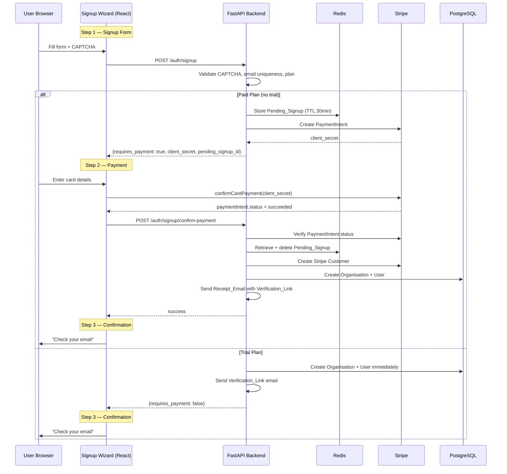
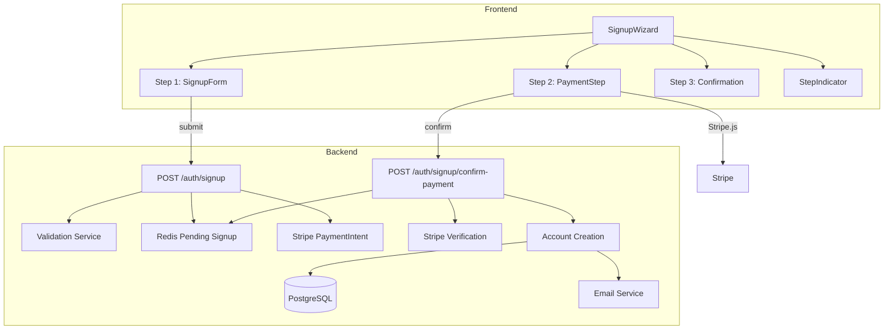

# Design Document: Multi-Step Signup Wizard

## Overview

This design addresses a critical payment bypass vulnerability in the current signup flow. Today, `POST /auth/signup` calls `public_signup()` which immediately creates `Organisation` and `User` database records regardless of whether the user completes payment. A user on a paid plan can skip the Stripe payment step, verify their email via the link sent during signup, and log in without paying.

The fix defers account creation for paid plans: the backend stores form data in Redis as a `Pending_Signup` and creates a Stripe `PaymentIntent`. Only after Stripe confirms payment does the `Payment_Confirmation_API` create the actual database records. Trial plans continue to create accounts immediately since no payment is required.

The frontend is refactored into a proper multi-step wizard with animated transitions, a step indicator, and inline payment handling — all on a single page without URL changes.

### Key Design Decisions

1. **Redis for pending signups** — Redis is already in the stack (`invoicing-redis-1`) and provides natural TTL-based expiry. A 30-minute TTL handles cleanup automatically without scheduled tasks.
2. **`pending_signup_id` as the sole lookup key** — The `Payment_Confirmation_API` accepts only a `pending_signup_id` (not `organisation_id`), preventing callers from referencing arbitrary organisations. This closes the security hole.
3. **Password hashed before Redis storage** — The plaintext password is hashed immediately during form validation and only the hash is stored in Redis, so even a Redis compromise doesn't leak passwords.
4. **Stripe PaymentIntent created without a Stripe Customer** — For pending signups, we create the PaymentIntent without first creating a Stripe Customer (which would be orphaned if payment never completes). The Stripe Customer is created only during account activation in `confirm-payment`.
5. **Coupon zero-price shortcut** — If a coupon reduces the effective price to zero, the backend skips PaymentIntent creation entirely and creates the account immediately, returning `requires_payment: false`.

## Architecture



### Component Interaction



## Components and Interfaces

### Backend API Changes

#### `POST /auth/signup` (Modified)

The endpoint is split into two code paths based on whether the plan requires payment.

**Request body** (unchanged schema `PublicSignupRequest`, add optional `coupon_code`):
```python
class PublicSignupRequest(BaseModel):
    org_name: str
    admin_email: EmailStr
    admin_first_name: str
    admin_last_name: str
    password: str
    plan_id: str
    captcha_code: str
    coupon_code: str | None = None  # NEW
```

**Response** (modified `PublicSignupResponse`):
```python
class PublicSignupResponse(BaseModel):
    message: str
    requires_payment: bool
    # Present only when requires_payment is True:
    pending_signup_id: str | None = None
    stripe_client_secret: str | None = None
    payment_amount_cents: int = 0
    plan_name: str | None = None
    # Present only when requires_payment is False (trial):
    organisation_id: str | None = None
    admin_email: str
    trial_ends_at: datetime | None = None
```

**Paid plan flow:**
1. Validate CAPTCHA (existing)
2. Validate plan exists, is public, not archived
3. Check email not already registered in `users` table
4. Hash password with bcrypt
5. Apply coupon if provided — if effective price becomes 0, skip to trial flow
6. Store `Pending_Signup` in Redis: `pending_signup:{id}` with 30-min TTL
7. Create Stripe PaymentIntent (no Stripe Customer yet)
8. Return `{requires_payment: true, pending_signup_id, stripe_client_secret, payment_amount_cents, plan_name}`

**Trial plan flow** (unchanged logic):
1. Validate CAPTCHA, plan, email
2. Create Organisation + User in DB immediately
3. Send verification email
4. Return `{requires_payment: false, organisation_id, admin_email, trial_ends_at}`

#### `POST /auth/signup/confirm-payment` (Modified)

**Request body:**
```python
class ConfirmPaymentRequest(BaseModel):
    payment_intent_id: str
    pending_signup_id: str  # Changed from organisation_id
```

**Flow:**
1. Retrieve `Pending_Signup` from Redis using `pending_signup_id` — reject if not found
2. Verify PaymentIntent status with Stripe — reject if not `succeeded`
3. Create Stripe Customer (now that payment is confirmed)
4. Create Organisation (status=`active`) and User in DB
5. Save payment method to `org_payment_methods`
6. Delete `Pending_Signup` from Redis (prevent replay)
7. Send Receipt_Email with verification link
8. Return success

### Redis Data Model: Pending_Signup

```json
{
  "key": "pending_signup:{uuid}",
  "ttl": 1800,
  "value": {
    "org_name": "My Workshop",
    "admin_email": "[email]",
    "admin_first_name": "[name]",
    "admin_last_name": "[name]",
    "password_hash": "$2b$12$...",
    "plan_id": "uuid",
    "plan_name": "Professional",
    "payment_amount_cents": 4900,
    "stripe_payment_intent_id": "pi_xxx",
    "coupon_code": "SAVE20",
    "coupon_discount_type": "percentage",
    "coupon_discount_value": 20,
    "ip_address": "203.0.113.1",
    "created_at": "2025-01-15T10:30:00Z"
  }
}
```

An additional index key `pending_email:{email_hash}` → `pending_signup_id` enables the "replace existing pending signup" requirement (Req 6.3). This key shares the same 30-min TTL.

### Frontend Components

#### `SignupWizard` (refactored from `Signup`)

Top-level component managing wizard state. Uses a `step` state variable (`'form' | 'payment' | 'done'`) and renders the appropriate child component with CSS `transform: translateX()` transitions.

**Step indicator**: A horizontal bar showing steps 1–3 (or 1–2 for trial plans) with the current step highlighted.

**Animation**: Steps slide horizontally using CSS transitions (`transition: transform 300ms ease-in-out`). All three step containers are rendered in a flex row, and the visible step is controlled by translating the container.

#### `SignupForm` (Step 1)

Extracted from the current `Signup` component's form rendering. Contains all existing fields plus the coupon input. On submit, calls `POST /auth/signup` and passes the result up to `SignupWizard`.

#### `PaymentStep` (Step 2)

Refactored from the existing `PaymentForm` component. Now receives `pending_signup_id` instead of `organisation_id`. Displays plan name and amount. On Stripe success, calls `POST /auth/signup/confirm-payment` with `{payment_intent_id, pending_signup_id}`.

#### `ConfirmationStep` (Step 3)

The existing "Check your email" UI, extracted into its own component.

### Frontend Type Changes

```typescript
// Updated response type
interface SignupResponse {
  message: string
  requires_payment: boolean
  pending_signup_id?: string        // NEW — replaces organisation_id for paid flow
  stripe_client_secret?: string
  payment_amount_cents: number
  plan_name?: string                // NEW
  organisation_id?: string          // Only for trial flow
  admin_email: string
  trial_ends_at?: string
}
```

## Data Models

### Redis Keys

| Key Pattern | Value | TTL | Purpose |
|---|---|---|---|
| `pending_signup:{uuid4}` | JSON blob with form data + password hash + Stripe PI ID | 1800s (30 min) | Holds validated signup data until payment completes |
| `pending_email:{sha256(email)}` | `pending_signup_id` string | 1800s (30 min) | Index to find/replace existing pending signup for same email |

### Database Changes

No new tables or columns are required. The existing `organisations`, `users`, `org_payment_methods`, and `subscription_plans` tables are sufficient. The key change is *when* records are inserted — after payment confirmation instead of before.

### Existing Tables Used

- `subscription_plans` — read plan details (price, trial_duration, is_public, is_archived)
- `organisations` — created with status `active` (paid) or `trial` (trial plans)
- `users` — admin user created with `is_email_verified=False`
- `org_payment_methods` — payment method saved after Stripe confirmation
- `coupons` — validated via existing `/coupons/validate` endpoint


## Correctness Properties

*A property is a characteristic or behavior that should hold true across all valid executions of a system — essentially, a formal statement about what the system should do. Properties serve as the bridge between human-readable specifications and machine-verifiable correctness guarantees.*

### Property 1: Paid plan signup creates pending signup with TTL and no database records

*For any* valid signup form data with a paid plan (trial_duration == 0), calling the signup endpoint shall produce a Pending_Signup in Redis with a TTL of 1800 seconds, return `requires_payment: true` with a `pending_signup_id` and `stripe_client_secret`, and shall NOT create any Organisation or User records in the database.

**Validates: Requirements 1.1, 6.1**

### Property 2: Valid payment confirmation creates account, sends email, and deletes pending signup

*For any* valid Pending_Signup in Redis and a Stripe PaymentIntent with status "succeeded", calling the payment confirmation endpoint shall create an Organisation (status=active) and User in the database, send a receipt email to the user's email address, and delete the Pending_Signup key from Redis so the same signup cannot be replayed.

**Validates: Requirements 1.2, 4.1, 7.2**

### Property 3: Non-succeeded PaymentIntent statuses are rejected

*For any* Stripe PaymentIntent status that is not "succeeded" (e.g., "requires_payment_method", "processing", "canceled", "requires_action"), calling the payment confirmation endpoint shall return a "Payment not completed" error and shall NOT create any Organisation or User records in the database.

**Validates: Requirements 1.3**

### Property 4: Trial plan creates account immediately

*For any* valid signup form data with a trial plan (trial_duration > 0), calling the signup endpoint shall create an Organisation with status "trial" and a User record in the database immediately, return `requires_payment: false`, and send a verification email.

**Validates: Requirements 1.5**

### Property 5: Client-side validation rejects invalid form data

*For any* signup form data where at least one field is invalid (empty org name, invalid email format, password not meeting complexity rules, missing plan, passwords not matching), the `validateSignupForm` function shall return a non-empty errors object identifying the invalid field(s).

**Validates: Requirements 2.2**

### Property 6: Receipt email contains payment summary and verification link

*For any* plan name and payment amount, the generated receipt email content shall contain the plan name, the formatted amount charged, and a verification link URL with a valid token.

**Validates: Requirements 4.2**

### Property 7: Verification link activates account

*For any* valid verification token associated with an unverified user, calling the verify-signup-email endpoint shall set `is_email_verified=True` on the user record.

**Validates: Requirements 4.3**

### Property 8: Coupon discount correctly applied to PaymentIntent amount

*For any* paid plan with price P and a valid percentage coupon with discount D%, the PaymentIntent amount shall equal `round(P * (1 - D/100))`. For a fixed-amount coupon with discount F, the amount shall equal `max(0, P - F)`.

**Validates: Requirements 5.2**

### Property 9: Trial-extension coupon converts paid plan to trial

*For any* paid plan (trial_duration == 0) and a valid trial-extension coupon with value V days, calling the signup endpoint shall create the account immediately with trial status and `trial_ends_at` set to V days from now, returning `requires_payment: false`.

**Validates: Requirements 5.4**

### Property 10: Duplicate email replaces existing pending signup

*For any* email address that already has a Pending_Signup in Redis, submitting a new signup with the same email shall replace the old Pending_Signup with a new one, such that only one Pending_Signup exists for that email at any time.

**Validates: Requirements 6.3**

### Property 11: Signup rejects invalid CAPTCHA or already-registered email

*For any* signup request where the CAPTCHA is invalid OR the email is already registered to an existing User, the signup endpoint shall reject the request without creating a Pending_Signup or any database records.

**Validates: Requirements 7.3, 7.4**

## Error Handling

### Backend Errors

| Scenario | HTTP Status | Error Message | Recovery |
|---|---|---|---|
| Invalid CAPTCHA | 400 | "Invalid CAPTCHA code. Please try again." | Frontend refreshes CAPTCHA image |
| Email already registered | 400 | "A user with this email already exists" | User tries different email or logs in |
| Plan not found / archived / not public | 400 | "Subscription plan not found" / specific message | Frontend reloads plans |
| Stripe PaymentIntent creation fails | 500 | "Payment setup failed. Please try again." | User retries form submission |
| Pending signup not found (expired) | 400 | "Invalid or expired signup session. Please start over." | Frontend resets to step 1 |
| PaymentIntent not succeeded | 400 | "Payment not completed. Status: {status}" | User retries payment |
| Stripe verification fails | 400 | "Could not verify payment with Stripe" | User retries confirmation |
| Invalid coupon code | 400 | "Invalid coupon code" (from existing endpoint) | User removes coupon or tries another |
| Database error during account creation | 500 | "An error occurred during signup. Please try again." | User retries; Stripe payment is idempotent |

### Frontend Error Handling

- **Step 1 errors**: Displayed as an `AlertBanner` above the form. Validation errors shown inline per field.
- **Step 2 Stripe errors**: Displayed inline in the payment form. User stays on step 2 and can retry.
- **Step 2 backend errors**: After Stripe succeeds but `confirm-payment` fails, error shown with a "Retry" button that re-calls `confirm-payment` (idempotent since pending signup still exists).
- **Network errors**: Generic "Network error. Please try again." with retry option.
- **Session expiry**: If the user takes >30 minutes on the payment step, the pending signup expires. The `confirm-payment` call returns "Invalid or expired signup session" and the frontend resets to step 1 with a message explaining the timeout.

### Edge Cases

- **Browser refresh on payment step**: The `pending_signup_id` and `stripe_client_secret` are held in React state. A refresh loses them, returning the user to step 1. This is acceptable since the pending signup in Redis will be replaced on re-submission.
- **Double-click on pay button**: The button is disabled during processing (`processing` state). Stripe's PaymentIntent is idempotent.
- **Coupon reduces price to zero**: Backend skips PaymentIntent, creates account immediately. Frontend skips payment step.
- **Trial-extension coupon on paid plan**: Backend converts to trial flow. Frontend skips payment step.

## Testing Strategy

### Property-Based Testing

Use `fast-check` (JavaScript) for frontend property tests and `hypothesis` (Python) for backend property tests. Each property test must run a minimum of 100 iterations.

**Frontend property tests** (`frontend/src/pages/auth/__tests__/signup-wizard.properties.test.ts`):
- Property 5: Validation function rejects invalid inputs — generate random invalid form data combinations and verify errors are returned
- Tag: `Feature: multi-step-signup-wizard, Property 5: Client-side validation rejects invalid form data`

**Backend property tests** (`tests/properties/test_signup_wizard_properties.py`):
- Property 1: Paid plan pending signup — generate random valid form data + paid plans, verify Redis storage and no DB records
- Property 2: Payment confirmation creates account — generate random pending signups + succeeded PIs, verify DB records + Redis deletion
- Property 3: Non-succeeded PI rejection — generate random non-succeeded statuses, verify rejection
- Property 4: Trial plan immediate creation — generate random valid form data + trial plans, verify DB records
- Property 6: Receipt email content — generate random plan names and amounts, verify email contains required info
- Property 7: Verification activates account — generate random valid tokens, verify user activation
- Property 8: Coupon discount calculation — generate random prices and coupon values, verify correct amount
- Property 9: Trial-extension coupon — generate random paid plans + trial-extension coupons, verify trial conversion
- Property 10: Duplicate email replacement — generate random emails, submit twice, verify single pending signup
- Property 11: CAPTCHA/email rejection — generate invalid CAPTCHAs and existing emails, verify rejection

Each property test must be tagged with: `Feature: multi-step-signup-wizard, Property {N}: {title}`

### Unit Tests

Unit tests complement property tests for specific examples and edge cases:

**Frontend** (`frontend/src/pages/auth/__tests__/signup-wizard.test.tsx`):
- Wizard renders step indicator correctly for paid vs trial plans
- Step transitions work (form → payment → done, form → done for trial)
- Payment step displays plan name and amount
- Error messages display correctly on payment failure
- Retry button appears when confirm-payment fails after Stripe success
- Coupon input shows/hides correctly
- Coupon discount display updates plan prices

**Backend** (`tests/test_signup_wizard.py`):
- Expired pending signup returns correct error
- Coupon reducing price to zero skips PaymentIntent
- Pending signup Redis key has correct TTL
- Confirm-payment with non-existent pending_signup_id returns 400
- Confirm-payment deletes Redis key after success (replay prevention)
- Email already registered returns 400 without creating pending signup

### Integration Tests

- Full paid plan flow: form submit → pending signup created → Stripe payment → confirm → account active
- Full trial plan flow: form submit → account created → verification email sent
- Coupon flow: apply coupon → discounted amount in PaymentIntent
- Expiry flow: submit form → wait for TTL → confirm fails with "expired"
