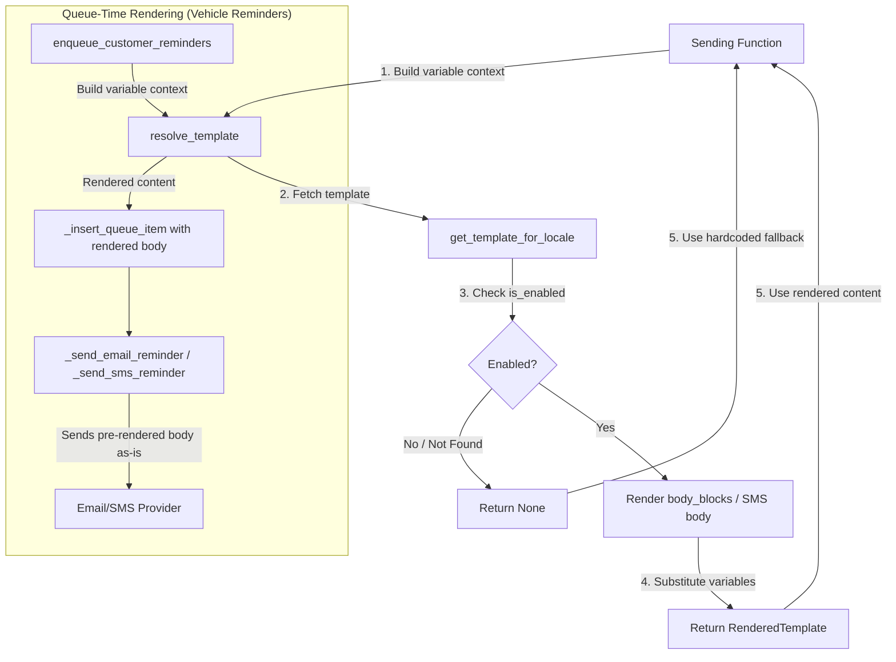

# Design Document: Notification Template Integration

## Overview

This feature wires the existing notification template storage and rendering system to the actual email/SMS sending functions across the codebase. Currently, organisations can configure templates via the Settings UI, but the sending functions ignore them and use hardcoded subject/body content. This design introduces a single reusable `resolve_template()` function that each sending function calls before composing its message, falling back gracefully to hardcoded content when no enabled template exists.

**Key design goals:**
- Zero schema/migration changes — all infrastructure already exists
- Zero frontend changes — template management UI already works
- Graceful degradation — any template resolution failure falls back silently to existing hardcoded content
- Single integration pattern — every sending function follows the same try-template-then-fallback approach

## Architecture



**Integration pattern for direct-send functions:**
```python
# Try template first
rendered = await resolve_template(
    db, org_id=org_id,
    template_type="invoice_issued",
    channel="email",
    variables={...}
)
if rendered:
    subject = rendered.subject
    body = rendered.body
else:
    # Existing hardcoded content (unchanged)
    subject = f"Invoice {inv_number} from {org_name}"
    body = f"Hi,\n\nPlease find attached..."
```

**Integration pattern for queue-time rendering (vehicle reminders):**
```python
# In enqueue_customer_reminders, before _insert_queue_item:
rendered = await resolve_template(
    db, org_id=org_id,
    template_type="wof_expiry_reminder",
    channel="email",
    variables={...}
)
if rendered:
    email_subject = rendered.subject
    email_body = rendered.body
else:
    # Existing hardcoded queue body generation
    email_subject = f"WOF Expiry reminder for {rego}"
    email_body = f"<p>Hi {customer.first_name},</p>..."
```

## Components and Interfaces

### RenderedTemplate (dataclass)

A simple return type for `resolve_template()`.

```python
from dataclasses import dataclass

@dataclass
class RenderedTemplate:
    subject: str
    body: str
```

### resolve_template() Function

**Location:** `app/modules/notifications/service.py`

```python
async def resolve_template(
    db: AsyncSession,
    *,
    org_id: uuid.UUID,
    template_type: str,
    channel: str = "email",
    variables: dict[str, str],
) -> RenderedTemplate | None:
```

**Behaviour:**
1. Calls `get_template_for_locale(db, org_id=org_id, template_type=template_type, channel=channel)`
2. If template is `None` → return `None`
3. If `is_enabled` is `False` → return `None`
4. For email channel: render `body_blocks` into plain text using `_render_blocks_to_text()`
5. For SMS channel: use the template's `body` field directly (SMS templates store body as a single string in body_blocks[0].content or a dedicated field)
6. Substitute `{{variable_name}}` placeholders with values from `variables` dict
7. For missing variables: replace with empty string (not raw placeholder)
8. Return `RenderedTemplate(subject=rendered_subject, body=rendered_body)`
9. Entire function wrapped in try/except → logs warning, returns `None` on any error

**Transaction Safety (CRITICAL — per steering doc performance-and-resilience.md, ISSUE-044):**
- `resolve_template()` is **READ-ONLY** — it performs a single SELECT query to fetch the template
- It MUST NOT call `db.commit()`, `db.rollback()`, or `db.flush()`
- It runs inside the caller's existing `session.begin()` context manager — any write operation would conflict with the transaction lifecycle
- The try/except wrapper catches ALL exceptions (including `InvalidRequestError` from closed transactions) and returns `None` — this ensures a DB issue in template resolution never crashes the sending function

**DB Session Availability per Sending Function:**

| Function | Has `db` param? | Notes |
|---|---|---|
| `email_invoice()` | ✓ Yes | First param |
| `_send_receipt_email()` | ✓ Yes | First param |
| `send_payment_reminder()` | ✓ Yes | First param |
| `_send_booking_confirmation_email()` | ✓ Yes | First param |
| `send_quote()` | ✓ Yes | First param |
| `_send_invitation_email()` | ✓ Yes | Optional `db: AsyncSession | None = None` |
| `_send_password_reset_email()` | ✗ No | **Must add `db` param** — caller (`request_password_reset`) has `db` available, just needs to pass it through |
| `_send_email_reminder()` (queue) | ✗ No | Creates its own session via `async_session_factory()` — template applied at **queue time** (in `enqueue_customer_reminders` which has `db`), not at send time |

**Implementation note for `_send_password_reset_email()`:** Add `db: AsyncSession | None = None` as an optional parameter. When `db` is provided, call `resolve_template()`. When `db` is `None` (backward compat), fall back to hardcoded content. The caller `request_password_reset()` already has `db` and will pass it through.

### _render_blocks_to_text() Helper

**Location:** `app/modules/notifications/service.py`

Converts `body_blocks` JSONB array into plain-text email body:

```python
def _render_blocks_to_text(body_blocks: list[dict[str, Any]]) -> str:
```

**Block type rendering rules:**
| Block Type | Plain-Text Output |
|---|---|
| `header` | `{content}\n\n` |
| `text` | `{content}\n\n` |
| `button` | `{content}\n{url}\n\n` |
| `divider` | `---\n\n` |
| `footer` | `{content}\n` |
| `image` | (skipped in plain text) |

### _substitute_variables() Helper

**Location:** `app/modules/notifications/service.py`

```python
def _substitute_variables(text: str, variables: dict[str, str]) -> str:
```

Replaces `{{variable_name}}` with the corresponding value from `variables`. If a variable is not in the dict, replaces with empty string `""`. Uses regex: `r"\{\{(\w+)\}\}"`.

**Key difference from existing `render_sms_body()`:** The existing function leaves unmatched placeholders as-is. The new `_substitute_variables()` replaces unmatched placeholders with empty string to ensure no raw `{{...}}` appears in customer-facing content.

### Files Modified

| File | Changes |
|---|---|
| `app/modules/notifications/service.py` | Add `RenderedTemplate`, `resolve_template()`, `_render_blocks_to_text()`, `_substitute_variables()` |
| `app/modules/invoices/service.py` | Modify `email_invoice()`, `send_payment_reminder()` (email + SMS branches) |
| `app/modules/payments/service.py` | Modify `_send_receipt_email()` |
| `app/modules/bookings/service.py` | Modify `_send_booking_confirmation_email()` |
| `app/modules/quotes/service.py` | Modify `send_quote()` |
| `app/modules/auth/service.py` | Modify `_send_invitation_email()`, `_send_password_reset_email()` |
| `app/modules/notifications/reminder_queue_service.py` | Modify `enqueue_customer_reminders()` queue body generation |

## Data Models

No new tables or columns. The feature uses existing infrastructure:

### Existing: `notification_templates` table

| Column | Type | Usage |
|---|---|---|
| `id` | UUID | Primary key |
| `org_id` | UUID | FK to organisations |
| `template_type` | VARCHAR(50) | e.g. `invoice_issued`, `wof_expiry_reminder` |
| `channel` | VARCHAR(10) | `email` or `sms` |
| `subject` | VARCHAR(255) | Email subject line (nullable for SMS) |
| `body_blocks` | JSONB | Array of `{type, content, url?}` blocks |
| `is_enabled` | BOOLEAN | Whether the template is active |
| `updated_at` | TIMESTAMPTZ | Last modification time |

**Unique constraint:** `(org_id, template_type, channel)`

### Variable Context Mapping Per Template Type

| Template Type | Channel | Variables Provided |
|---|---|---|
| `invoice_issued` | email | `customer_first_name`, `customer_last_name`, `invoice_number`, `total_due`, `due_date`, `payment_link`, `org_name`, `org_email`, `org_phone` |
| `payment_received` | email | `customer_first_name`, `customer_last_name`, `invoice_number`, `total_due`, `org_name`, `org_email`, `org_phone` |
| `payment_overdue_reminder` | email | `customer_first_name`, `customer_last_name`, `invoice_number`, `total_due`, `due_date`, `payment_link`, `org_name` |
| `payment_overdue_reminder` | sms | `customer_first_name`, `customer_last_name`, `invoice_number`, `total_due`, `due_date`, `org_name` |
| `booking_confirmation` | email | `customer_first_name`, `booking_service`, `booking_date`, `org_name`, `org_phone`, `vehicle_rego` |
| `quote_sent` | email | `customer_first_name`, `customer_last_name`, `quote_number`, `quote_total`, `quote_valid_until`, `org_name`, `org_email`, `org_phone` |
| `wof_expiry_reminder` | email/sms | `customer_first_name`, `customer_last_name`, `vehicle_rego`, `vehicle_make`, `vehicle_model`, `expiry_date`, `org_name`, `org_phone`, `org_email` |
| `cof_expiry_reminder` | email/sms | Same as `wof_expiry_reminder` |
| `registration_expiry_reminder` | email/sms | Same as `wof_expiry_reminder` |
| `service_due_reminder` | email/sms | `customer_first_name`, `customer_last_name`, `vehicle_rego`, `vehicle_make`, `vehicle_model`, `service_due_date`, `org_name`, `org_phone`, `org_email` |
| `user_invitation` | email | `user_name`, `org_name`, `signup_link` |
| `password_reset` | email | `user_name`, `reset_link`, `org_name` |

## Correctness Properties

*A property is a characteristic or behavior that should hold true across all valid executions of a system — essentially, a formal statement about what the system should do. Properties serve as the bridge between human-readable specifications and machine-verifiable correctness guarantees.*

### Property 1: Enabled template resolution produces output

*For any* enabled template (with non-empty body_blocks for email, or non-empty body for SMS) and any valid variable context, `resolve_template()` SHALL return a non-None `RenderedTemplate` with non-empty `subject` (for email) and non-empty `body`.

**Validates: Requirements 1.2**

### Property 2: Complete placeholder substitution (no raw placeholders in output)

*For any* template content containing `{{variable_name}}` placeholders and any variable context (whether complete or partial), the rendered output from `resolve_template()` SHALL contain zero occurrences of the `{{...}}` pattern — provided variables are substituted with their values, and missing variables are substituted with empty string.

**Validates: Requirements 1.5, 1.6**

### Property 3: Body block content preservation

*For any* array of body_blocks where each block has a non-empty `content` field, the plain-text output of `_render_blocks_to_text()` SHALL contain each block's content text in the order the blocks appear in the array.

**Validates: Requirements 11.1, 11.2, 11.3, 11.4, 11.6**

## Error Handling

### resolve_template() Error Strategy

The entire `resolve_template()` function is wrapped in a single try/except block:

```python
async def resolve_template(...) -> RenderedTemplate | None:
    try:
        # ... fetch, check enabled, render, substitute ...
        return RenderedTemplate(subject=..., body=...)
    except Exception as exc:
        logger.warning(
            "Template resolution failed for org=%s type=%s channel=%s: %s",
            org_id, template_type, channel, exc,
        )
        return None
```

**Rationale:** Notification delivery must never be blocked by template issues. A `None` return signals the calling function to use its hardcoded fallback, which is the pre-existing behaviour that has been working in production.

### Sending Function Error Handling

Each sending function already has its own error handling for SMTP/SMS failures. The template integration adds no new failure modes to the send path — it only affects content selection:

```python
rendered = await resolve_template(db, org_id=org_id, ...)
if rendered:
    subject = rendered.subject
    body = rendered.body
else:
    # Hardcoded fallback — existing code, unchanged
    subject = "..."
    body = "..."
# ... rest of sending logic unchanged ...
```

### Failure Scenarios

| Scenario | Behaviour |
|---|---|
| DB unreachable during template fetch | `resolve_template` catches exception, logs warning, returns `None` → hardcoded fallback |
| Template has malformed `body_blocks` JSON | `_render_blocks_to_text` fails, caught by outer try/except → returns `None` |
| Variable context missing expected keys | Placeholders replaced with empty string (not an error) |
| Template `is_enabled=False` | Returns `None` immediately (normal flow, no error) |
| Template not found for org | Returns `None` immediately (normal flow, no error) |

## Testing Strategy

### Property-Based Tests (Hypothesis)

Property-based tests validate the universal correctness properties of the template resolution and rendering logic. Each test runs a minimum of 100 iterations with randomly generated inputs.

**Library:** Hypothesis (already used in the project — `.hypothesis/` directory exists)

**Configuration:** `@settings(max_examples=100)`

| Property | Test Description | Tag |
|---|---|---|
| Property 1 | Generate random enabled templates with body_blocks, call `resolve_template` (mocked DB), verify non-None result | `Feature: notification-template-integration, Property 1: Enabled template resolution produces output` |
| Property 2 | Generate random template strings with `{{var}}` placeholders and random variable dicts, call `_substitute_variables`, verify no `{{...}}` in output | `Feature: notification-template-integration, Property 2: Complete placeholder substitution` |
| Property 3 | Generate random body_blocks arrays, call `_render_blocks_to_text`, verify each block's content appears in output in order | `Feature: notification-template-integration, Property 3: Body block content preservation` |

### Unit Tests (pytest)

Unit tests cover specific integration scenarios and edge cases:

**Template Resolution:**
- `test_resolve_template_returns_none_when_template_not_found`
- `test_resolve_template_returns_none_when_template_disabled`
- `test_resolve_template_returns_none_on_db_error`
- `test_resolve_template_logs_warning_on_error`
- `test_resolve_template_delegates_to_get_template_for_locale`

**Per Sending Function (template enabled vs disabled):**
- `test_email_invoice_uses_template_when_enabled`
- `test_email_invoice_uses_hardcoded_when_template_disabled`
- `test_send_payment_reminder_email_uses_template`
- `test_send_payment_reminder_email_uses_hardcoded_fallback`
- `test_send_payment_reminder_sms_uses_template`
- `test_send_payment_reminder_sms_uses_hardcoded_fallback`
- `test_send_receipt_email_uses_template`
- `test_send_receipt_email_uses_hardcoded_fallback`
- `test_booking_confirmation_uses_template`
- `test_booking_confirmation_uses_hardcoded_fallback`
- `test_send_quote_uses_template`
- `test_send_quote_uses_hardcoded_fallback`
- `test_invitation_email_uses_template`
- `test_invitation_email_uses_hardcoded_fallback`
- `test_password_reset_uses_template`
- `test_password_reset_uses_hardcoded_fallback`

**Queue-Time Rendering:**
- `test_enqueue_reminders_uses_template_for_email_body`
- `test_enqueue_reminders_uses_hardcoded_when_no_template`
- `test_enqueue_reminders_stores_rendered_subject`
- `test_send_email_reminder_sends_queue_body_unchanged`

**Variable Context Verification:**
- `test_email_invoice_passes_correct_variables`
- `test_payment_reminder_passes_correct_variables`
- `test_booking_confirmation_passes_correct_variables`
- `test_quote_sent_passes_correct_variables`
- `test_vehicle_reminder_passes_correct_variables`

**Body Block Rendering Edge Cases:**
- `test_render_blocks_empty_array_returns_empty_string`
- `test_render_blocks_unknown_type_skipped`
- `test_render_blocks_divider_renders_separator`
