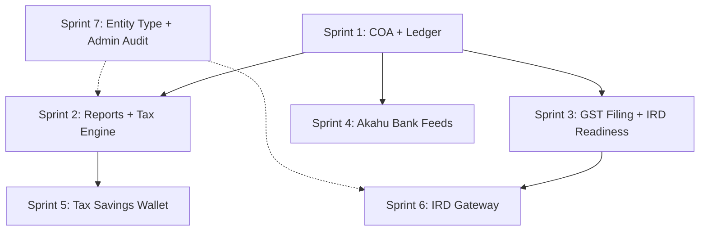
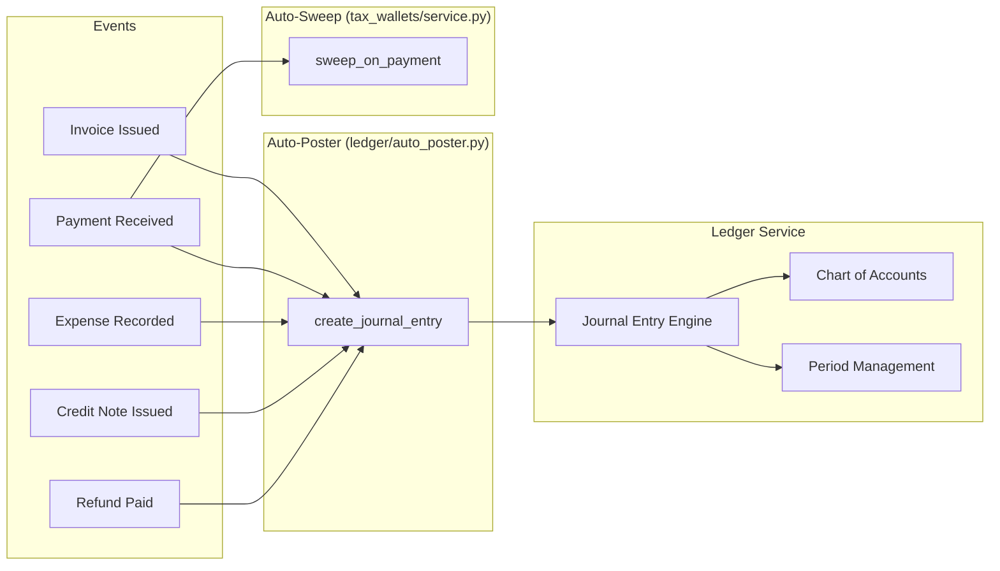
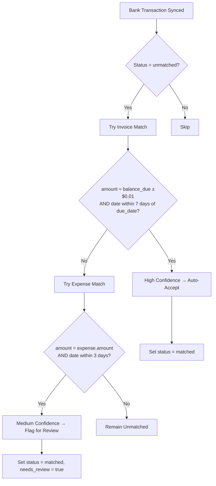
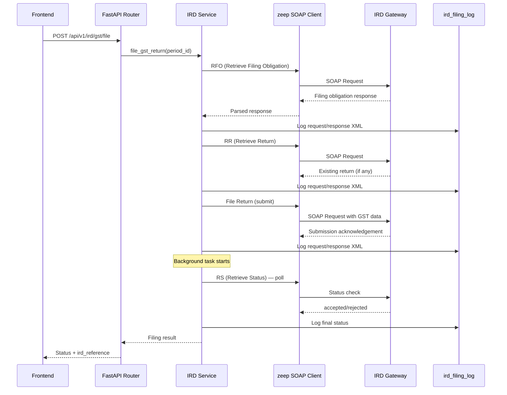

# Design Document — OraFlows Accounting & Tax

## Overview

OraFlows Accounting & Tax transforms OraInvoice from an invoicing platform into a full NZ-compliant accounting solution. The feature set spans 7 sprints in strict dependency order:

1. **Sprint 1** — Chart of Accounts (COA) + Double-Entry Ledger (foundation)
2. **Sprint 2** — Financial Reports (P&L, Balance Sheet, Aged Receivables) + Income Tax Estimator
3. **Sprint 3** — GST Filing Periods + IRD Readiness (mod-11 validation, period locking)
4. **Sprint 4** — Akahu Bank Feeds + Reconciliation Engine
5. **Sprint 5** — Tax Savings Wallets (virtual set-aside with auto-sweep)
6. **Sprint 6** — IRD Gateway SOAP Integration (GST + Income Tax filing)
7. **Sprint 7** — Business Entity Type Classification + Admin Integrations Audit

All features are multi-tenant with PostgreSQL RLS, use envelope encryption for external credentials, follow the existing FastAPI module pattern (`router.py`, `service.py`, `models.py`, `schemas.py`), and target NZ SMBs (sole traders, partnerships, companies).

### Key Design Decisions

| Decision | Rationale |
|---|---|
| Double-entry ledger with auto-posting | Ensures accounting equation always holds; eliminates manual bookkeeping for common events |
| Virtual tax wallets (not real bank accounts) | Simpler implementation; no money movement; ledger-based tracking only |
| Akahu for bank feeds (not screen scraping) | Official NZ open banking API; OAuth 2.0; reliable and compliant |
| zeep for IRD SOAP | Only mature Python SOAP library; IRD Gateway is SOAP-only |
| NZ COA seed data on org creation | Immediate usability; accounts can be customised later |
| Expenses remain NZD-only | No currency field on expenses table; FX expenses deferred |

### Dependency Graph



---

## Architecture

### Backend Module Layout

New modules follow the existing `app/modules/{name}/` pattern with `models.py`, `schemas.py`, `service.py`, `router.py`.

```
app/modules/
├── ledger/                    # Sprint 1 — COA + Journal Engine
│   ├── models.py              # Account, JournalEntry, JournalLine, AccountingPeriod
│   ├── schemas.py             # Pydantic request/response schemas
│   ├── service.py             # COA CRUD, journal posting, period management
│   ├── auto_poster.py         # Event-driven auto-posting engine
│   └── router.py              # /api/v1/ledger/* endpoints
├── banking/                   # Sprint 4 — Akahu + Reconciliation
│   ├── models.py              # AkahuConnection, BankAccount, BankTransaction
│   ├── schemas.py
│   ├── akahu.py               # Akahu OAuth + sync service
│   ├── reconciliation.py      # Auto-matching engine
│   ├── service.py             # Banking CRUD + reconciliation API logic
│   └── router.py              # /api/v1/banking/* endpoints
├── tax_wallets/               # Sprint 5 — Tax Savings Wallets
│   ├── models.py              # TaxWallet, TaxWalletTransaction
│   ├── schemas.py
│   ├── service.py             # Wallet CRUD, auto-sweep, summary
│   └── router.py              # /api/v1/tax-wallets/* endpoints
├── ird/                       # Sprint 6 — IRD Gateway
│   ├── models.py              # IrdFilingLog (extends accounting_integrations for provider='ird')
│   ├── schemas.py
│   ├── gateway.py             # SOAP client (zeep), filing operations
│   ├── service.py             # Filing orchestration, status polling
│   └── router.py              # /api/v1/ird/* endpoints
├── reports/                   # Sprint 2 — Extended (existing module)
│   ├── service.py             # + P&L, Balance Sheet, Aged Receivables, Tax Estimator, Tax Position
│   └── router.py              # + new report endpoints
└── accounting/                # Existing — Xero/MYOB sync (unchanged)
```

### Service Layer Architecture



### Auto-Posting Engine Design

The auto-poster is called synchronously within the same database transaction as the originating event. This ensures atomicity — if the journal entry fails validation, the entire transaction rolls back.

**Invocation points** (added to existing service functions):

| Event | Existing Service Function | Auto-Post Call |
|---|---|---|
| Invoice issued | `invoices/service.py::issue_invoice()` | `auto_post_invoice(db, invoice)` |
| Payment received | `payments/service.py::record_payment()` | `auto_post_payment(db, payment, invoice)` |
| Expense recorded | `expenses/service.py::create_expense()` | `auto_post_expense(db, expense)` |
| Credit note issued | `invoices/service.py::create_credit_note()` | `auto_post_credit_note(db, credit_note, invoice)` |
| Refund paid | `payments/service.py::record_refund()` | `auto_post_refund(db, payment, invoice)` |

**Journal entry templates:**

| Event | Debit Account | Credit Account | Amount |
|---|---|---|---|
| Invoice issued | 1100 Accounts Receivable | 4000 Sales Revenue | net amount (NZD) |
| Invoice issued (GST) | 1100 Accounts Receivable | 2100 GST Payable | GST amount (NZD) |
| Payment received | 1000 Bank/Cash | 1100 Accounts Receivable | payment amount |
| Expense recorded | 6xxx Expense Account | 2000 Accounts Payable | expense amount |
| Expense GST | 1200 GST Receivable | 2000 Accounts Payable | tax_amount |
| Credit note | 4000 Sales Revenue + 2100 GST Payable | 1100 Accounts Receivable | credit note amount |
| Refund paid | 1100 Accounts Receivable | 1000 Bank/Cash | refund amount |

**FX handling:** For foreign currency invoices, amounts are converted to NZD using `invoice.exchange_rate_to_nzd` before posting. The ledger is NZD-only.

### Reconciliation Engine Design

The reconciliation engine runs after each bank transaction sync and attempts to match unmatched transactions against invoices and expenses.



**Matching algorithm:**
1. For each unmatched credit transaction (positive amount), query invoices where `balance_due` is within ±$0.01 of the transaction amount and `due_date` is within 7 days of the transaction date. If exactly one match → high confidence → auto-accept.
2. For each unmatched debit transaction (negative amount), query expenses where `amount` matches and `date` is within 3 days. If exactly one match → medium confidence → flag for review.
3. Multiple matches → remain unmatched (user must manually resolve).

**Constraint:** A matched transaction has exactly one of `matched_invoice_id`, `matched_expense_id`, or `matched_journal_id` set — enforced by a database CHECK constraint.

### IRD Gateway SOAP Client Architecture



**SOAP client configuration:**
- Library: `zeep` with `httpx` transport
- Auth: OAuth 2.0 + client-signed JWT + TLS 1.3 mutual auth
- Timeouts: 30s for filing operations, 10s for status checks
- Retry: 3 attempts with exponential backoff on transient errors (network, HTTP 5xx)
- Logging: All request/response XML to `ird_filing_log` table only (never stdout)
- Credentials: Stored in `accounting_integrations` table with `provider='ird'`, envelope encrypted

---

## Components and Interfaces

### API Endpoints

#### Sprint 1 — Ledger Endpoints

| Method | Path | Description |
|---|---|---|
| GET | `/api/v1/ledger/accounts` | List COA accounts (filterable by type, active) |
| POST | `/api/v1/ledger/accounts` | Create custom account |
| PUT | `/api/v1/ledger/accounts/{id}` | Update account |
| DELETE | `/api/v1/ledger/accounts/{id}` | Delete account (rejects system/in-use) |
| GET | `/api/v1/ledger/journal-entries` | List journal entries (filterable by date, source_type) |
| POST | `/api/v1/ledger/journal-entries` | Create manual journal entry |
| GET | `/api/v1/ledger/journal-entries/{id}` | Get journal entry with lines |
| POST | `/api/v1/ledger/journal-entries/{id}/post` | Post a draft journal entry |
| GET | `/api/v1/ledger/periods` | List accounting periods |
| POST | `/api/v1/ledger/periods` | Create accounting period |
| POST | `/api/v1/ledger/periods/{id}/close` | Close an accounting period |

#### Sprint 2 — Report Endpoints (added to existing reports module)

| Method | Path | Description |
|---|---|---|
| GET | `/api/v1/reports/profit-loss` | P&L report (date range, basis, branch filter) |
| GET | `/api/v1/reports/balance-sheet` | Balance Sheet (as_at_date, branch filter) |
| GET | `/api/v1/reports/aged-receivables` | Aged receivables by customer |
| GET | `/api/v1/reports/tax-estimate` | Income tax estimate for tax year |
| GET | `/api/v1/reports/tax-position` | Combined GST + income tax + wallet dashboard |

#### Sprint 3 — GST Filing Endpoints

| Method | Path | Description |
|---|---|---|
| GET | `/api/v1/gst/periods` | List GST filing periods |
| POST | `/api/v1/gst/periods/generate` | Generate periods for a tax year |
| GET | `/api/v1/gst/periods/{id}` | Get period detail with return data |
| POST | `/api/v1/gst/periods/{id}/ready` | Mark period as ready for filing |
| POST | `/api/v1/gst/periods/{id}/lock` | Lock invoices/expenses in period |

#### Sprint 4 — Banking Endpoints

| Method | Path | Description |
|---|---|---|
| GET | `/api/v1/banking/connect` | Initiate Akahu OAuth flow |
| GET | `/api/v1/banking/callback` | Akahu OAuth callback |
| GET | `/api/v1/banking/accounts` | List connected bank accounts |
| POST | `/api/v1/banking/accounts/{id}/link` | Link bank account to GL account |
| POST | `/api/v1/banking/sync` | Trigger manual transaction sync |
| GET | `/api/v1/banking/transactions` | List bank transactions (filterable) |
| POST | `/api/v1/banking/transactions/{id}/match` | Manually match transaction |
| POST | `/api/v1/banking/transactions/{id}/exclude` | Exclude transaction |
| POST | `/api/v1/banking/transactions/{id}/create-expense` | Create expense from transaction |
| GET | `/api/v1/banking/reconciliation-summary` | Match counts + last sync |

#### Sprint 5 — Tax Wallet Endpoints

| Method | Path | Description |
|---|---|---|
| GET | `/api/v1/tax-wallets` | List all wallets with balances |
| GET | `/api/v1/tax-wallets/{type}/transactions` | Transaction history per wallet |
| POST | `/api/v1/tax-wallets/{type}/deposit` | Manual deposit |
| POST | `/api/v1/tax-wallets/{type}/withdraw` | Manual withdrawal |
| GET | `/api/v1/tax-wallets/summary` | Balances + due dates + shortfall + traffic light |

#### Sprint 6 — IRD Gateway Endpoints

| Method | Path | Description |
|---|---|---|
| POST | `/api/v1/ird/connect` | Store IRD credentials (encrypted) |
| GET | `/api/v1/ird/status` | Connection status + active services |
| POST | `/api/v1/ird/gst/preflight/{period_id}` | Preflight check (RFO + RR) |
| POST | `/api/v1/ird/gst/file/{period_id}` | Submit GST return |
| GET | `/api/v1/ird/gst/status/{period_id}` | Poll filing status |
| POST | `/api/v1/ird/income-tax/file` | Submit income tax return |
| GET | `/api/v1/ird/filing-log` | Filing audit log |

#### Sprint 7 — Organisation Entity Endpoints

| Method | Path | Description |
|---|---|---|
| PUT | `/api/v1/organisations/{id}/business-type` | Set business type + NZBN |
| GET | `/api/v1/integrations/{provider}/test` | Test connection for any provider |

### Frontend Component Structure

```
frontend/src/pages/
├── accounting/                          # New page group
│   ├── ChartOfAccounts.tsx              # COA list + CRUD
│   ├── JournalEntries.tsx               # Journal entry list + create
│   ├── JournalEntryDetail.tsx           # Single entry with lines
│   └── AccountingPeriods.tsx            # Period list + close
├── reports/                             # Existing — extended
│   ├── ProfitAndLoss.tsx                # New P&L report page
│   ├── BalanceSheet.tsx                 # New Balance Sheet page
│   └── AgedReceivables.tsx              # New Aged Receivables page
├── banking/                             # New page group
│   ├── BankAccounts.tsx                 # Connected accounts list
│   ├── BankTransactions.tsx             # Transaction list + reconciliation
│   └── ReconciliationDashboard.tsx      # Summary + match actions
├── tax/                                 # New page group
│   ├── TaxWallets.tsx                   # Wallet balances + transactions
│   ├── GstPeriods.tsx                   # GST filing periods list
│   ├── GstFilingDetail.tsx              # Single period + file action
│   └── TaxPosition.tsx                  # Combined dashboard widget
└── settings/                            # Existing — extended
    ├── BusinessSettings.tsx             # + business_type, NZBN fields
    └── IntegrationsSettings.tsx         # + Akahu, IRD cards
```


---

## Data Models

### New Tables

#### 1. `accounts` (Sprint 1 — Chart of Accounts)

```sql
CREATE TABLE accounts (
    id              UUID PRIMARY KEY DEFAULT gen_random_uuid(),
    org_id          UUID NOT NULL REFERENCES organisations(id),
    code            VARCHAR(10) NOT NULL,
    name            VARCHAR(200) NOT NULL,
    account_type    VARCHAR(20) NOT NULL,  -- asset|liability|equity|revenue|expense|cogs
    sub_type        VARCHAR(50),           -- e.g. current_asset, accounts_receivable
    description     TEXT,
    is_system       BOOLEAN NOT NULL DEFAULT false,
    is_active       BOOLEAN NOT NULL DEFAULT true,
    parent_id       UUID REFERENCES accounts(id),
    tax_code        VARCHAR(20),           -- GST, EXEMPT, NONE
    xero_account_code VARCHAR(20),
    created_at      TIMESTAMPTZ NOT NULL DEFAULT now(),
    updated_at      TIMESTAMPTZ NOT NULL DEFAULT now(),

    CONSTRAINT uq_accounts_org_code UNIQUE (org_id, code),
    CONSTRAINT ck_accounts_type CHECK (
        account_type IN ('asset','liability','equity','revenue','expense','cogs')
    )
);
-- RLS
ALTER TABLE accounts ENABLE ROW LEVEL SECURITY;
CREATE POLICY accounts_org_isolation ON accounts
    USING (org_id = current_setting('app.current_org_id')::uuid);
```

**SQLAlchemy model** (follows `app/modules/invoices/models.py` pattern):

```python
class Account(Base):
    __tablename__ = "accounts"
    id: Mapped[uuid.UUID] = mapped_column(UUID(as_uuid=True), primary_key=True, default=uuid.uuid4, server_default=func.gen_random_uuid())
    org_id: Mapped[uuid.UUID] = mapped_column(UUID(as_uuid=True), ForeignKey("organisations.id"), nullable=False)
    code: Mapped[str] = mapped_column(String(10), nullable=False)
    name: Mapped[str] = mapped_column(String(200), nullable=False)
    account_type: Mapped[str] = mapped_column(String(20), nullable=False)
    sub_type: Mapped[str | None] = mapped_column(String(50), nullable=True)
    description: Mapped[str | None] = mapped_column(Text, nullable=True)
    is_system: Mapped[bool] = mapped_column(Boolean, nullable=False, server_default="false")
    is_active: Mapped[bool] = mapped_column(Boolean, nullable=False, server_default="true")
    parent_id: Mapped[uuid.UUID | None] = mapped_column(UUID(as_uuid=True), ForeignKey("accounts.id"), nullable=True)
    tax_code: Mapped[str | None] = mapped_column(String(20), nullable=True)
    xero_account_code: Mapped[str | None] = mapped_column(String(20), nullable=True)
    created_at: Mapped[datetime] = mapped_column(DateTime(timezone=True), nullable=False, server_default=func.now())
    updated_at: Mapped[datetime] = mapped_column(DateTime(timezone=True), nullable=False, server_default=func.now(), onupdate=func.now())

    __table_args__ = (
        UniqueConstraint("org_id", "code", name="uq_accounts_org_code"),
        CheckConstraint("account_type IN ('asset','liability','equity','revenue','expense','cogs')", name="ck_accounts_type"),
    )
```

#### 2. `journal_entries` (Sprint 1)

```sql
CREATE TABLE journal_entries (
    id              UUID PRIMARY KEY DEFAULT gen_random_uuid(),
    org_id          UUID NOT NULL REFERENCES organisations(id),
    entry_number    VARCHAR(20) NOT NULL,
    entry_date      DATE NOT NULL,
    description     VARCHAR(500) NOT NULL,
    reference       VARCHAR(100),
    source_type     VARCHAR(50) NOT NULL,  -- invoice|payment|expense|credit_note|manual
    source_id       UUID,
    period_id       UUID REFERENCES accounting_periods(id),
    is_posted       BOOLEAN NOT NULL DEFAULT false,
    created_by      UUID NOT NULL REFERENCES users(id),
    created_at      TIMESTAMPTZ NOT NULL DEFAULT now(),
    updated_at      TIMESTAMPTZ NOT NULL DEFAULT now(),

    CONSTRAINT ck_journal_entries_source_type CHECK (
        source_type IN ('invoice','payment','expense','credit_note','manual')
    )
);
ALTER TABLE journal_entries ENABLE ROW LEVEL SECURITY;
CREATE POLICY journal_entries_org_isolation ON journal_entries
    USING (org_id = current_setting('app.current_org_id')::uuid);
```

#### 3. `journal_lines` (Sprint 1)

```sql
CREATE TABLE journal_lines (
    id                UUID PRIMARY KEY DEFAULT gen_random_uuid(),
    journal_entry_id  UUID NOT NULL REFERENCES journal_entries(id) ON DELETE CASCADE,
    org_id            UUID NOT NULL REFERENCES organisations(id),
    account_id        UUID NOT NULL REFERENCES accounts(id),
    debit             NUMERIC(12,2) NOT NULL DEFAULT 0,
    credit            NUMERIC(12,2) NOT NULL DEFAULT 0,
    description       VARCHAR(500),

    CONSTRAINT ck_journal_lines_one_side CHECK (
        (debit > 0 AND credit = 0) OR (debit = 0 AND credit > 0)
    )
);
ALTER TABLE journal_lines ENABLE ROW LEVEL SECURITY;
CREATE POLICY journal_lines_org_isolation ON journal_lines
    USING (org_id = current_setting('app.current_org_id')::uuid);
```

#### 4. `accounting_periods` (Sprint 1)

```sql
CREATE TABLE accounting_periods (
    id          UUID PRIMARY KEY DEFAULT gen_random_uuid(),
    org_id      UUID NOT NULL REFERENCES organisations(id),
    period_name VARCHAR(50) NOT NULL,
    start_date  DATE NOT NULL,
    end_date    DATE NOT NULL,
    is_closed   BOOLEAN NOT NULL DEFAULT false,
    closed_by   UUID REFERENCES users(id),
    closed_at   TIMESTAMPTZ,
    created_at  TIMESTAMPTZ NOT NULL DEFAULT now(),
    updated_at  TIMESTAMPTZ NOT NULL DEFAULT now(),

    CONSTRAINT ck_accounting_periods_dates CHECK (start_date < end_date)
);
ALTER TABLE accounting_periods ENABLE ROW LEVEL SECURITY;
CREATE POLICY accounting_periods_org_isolation ON accounting_periods
    USING (org_id = current_setting('app.current_org_id')::uuid);
```

#### 5. `gst_filing_periods` (Sprint 3)

```sql
CREATE TABLE gst_filing_periods (
    id            UUID PRIMARY KEY DEFAULT gen_random_uuid(),
    org_id        UUID NOT NULL REFERENCES organisations(id),
    period_type   VARCHAR(20) NOT NULL,  -- two_monthly|six_monthly|annual
    period_start  DATE NOT NULL,
    period_end    DATE NOT NULL,
    due_date      DATE NOT NULL,
    status        VARCHAR(20) NOT NULL DEFAULT 'draft',
    filed_at      TIMESTAMPTZ,
    filed_by      UUID REFERENCES users(id),
    ird_reference VARCHAR(50),
    return_data   JSONB,
    created_at    TIMESTAMPTZ NOT NULL DEFAULT now(),
    updated_at    TIMESTAMPTZ NOT NULL DEFAULT now(),

    CONSTRAINT ck_gst_filing_periods_type CHECK (
        period_type IN ('two_monthly','six_monthly','annual')
    ),
    CONSTRAINT ck_gst_filing_periods_status CHECK (
        status IN ('draft','ready','filed','accepted','rejected')
    )
);
ALTER TABLE gst_filing_periods ENABLE ROW LEVEL SECURITY;
CREATE POLICY gst_filing_periods_org_isolation ON gst_filing_periods
    USING (org_id = current_setting('app.current_org_id')::uuid);
```

#### 6. `akahu_connections` (Sprint 4)

```sql
CREATE TABLE akahu_connections (
    id                      UUID PRIMARY KEY DEFAULT gen_random_uuid(),
    org_id                  UUID NOT NULL REFERENCES organisations(id),
    access_token_encrypted  BYTEA,
    token_expires_at        TIMESTAMPTZ,
    is_active               BOOLEAN NOT NULL DEFAULT false,
    last_sync_at            TIMESTAMPTZ,
    created_at              TIMESTAMPTZ NOT NULL DEFAULT now(),
    updated_at              TIMESTAMPTZ NOT NULL DEFAULT now(),

    CONSTRAINT uq_akahu_connections_org UNIQUE (org_id)
);
ALTER TABLE akahu_connections ENABLE ROW LEVEL SECURITY;
CREATE POLICY akahu_connections_org_isolation ON akahu_connections
    USING (org_id = current_setting('app.current_org_id')::uuid);
```

#### 7. `bank_accounts` (Sprint 4)

```sql
CREATE TABLE bank_accounts (
    id                    UUID PRIMARY KEY DEFAULT gen_random_uuid(),
    org_id                UUID NOT NULL REFERENCES organisations(id),
    akahu_account_id      VARCHAR(100) NOT NULL,
    account_name          VARCHAR(200) NOT NULL,
    account_number        VARCHAR(50),
    bank_name             VARCHAR(100),
    account_type          VARCHAR(50),
    balance               NUMERIC(12,2) NOT NULL DEFAULT 0,
    currency              VARCHAR(3) NOT NULL DEFAULT 'NZD',
    is_active             BOOLEAN NOT NULL DEFAULT true,
    last_refreshed_at     TIMESTAMPTZ,
    linked_gl_account_id  UUID REFERENCES accounts(id),
    created_at            TIMESTAMPTZ NOT NULL DEFAULT now(),
    updated_at            TIMESTAMPTZ NOT NULL DEFAULT now(),

    CONSTRAINT uq_bank_accounts_org_akahu UNIQUE (org_id, akahu_account_id)
);
ALTER TABLE bank_accounts ENABLE ROW LEVEL SECURITY;
CREATE POLICY bank_accounts_org_isolation ON bank_accounts
    USING (org_id = current_setting('app.current_org_id')::uuid);
```

#### 8. `bank_transactions` (Sprint 4)

```sql
CREATE TABLE bank_transactions (
    id                      UUID PRIMARY KEY DEFAULT gen_random_uuid(),
    org_id                  UUID NOT NULL REFERENCES organisations(id),
    bank_account_id         UUID NOT NULL REFERENCES bank_accounts(id),
    akahu_transaction_id    VARCHAR(100) NOT NULL,
    date                    DATE NOT NULL,
    description             VARCHAR(500) NOT NULL,
    amount                  NUMERIC(12,2) NOT NULL,  -- positive=credit, negative=debit
    balance                 NUMERIC(12,2),
    merchant_name           VARCHAR(200),
    category                VARCHAR(100),
    reconciliation_status   VARCHAR(20) NOT NULL DEFAULT 'unmatched',
    matched_invoice_id      UUID REFERENCES invoices(id),
    matched_expense_id      UUID REFERENCES expenses(id),
    matched_journal_id      UUID REFERENCES journal_entries(id),
    akahu_raw               JSONB,
    created_at              TIMESTAMPTZ NOT NULL DEFAULT now(),
    updated_at              TIMESTAMPTZ NOT NULL DEFAULT now(),

    CONSTRAINT uq_bank_transactions_org_akahu UNIQUE (org_id, akahu_transaction_id),
    CONSTRAINT ck_bank_transactions_status CHECK (
        reconciliation_status IN ('unmatched','matched','excluded','manual')
    ),
    CONSTRAINT ck_bank_transactions_one_match CHECK (
        (CASE WHEN matched_invoice_id IS NOT NULL THEN 1 ELSE 0 END +
         CASE WHEN matched_expense_id IS NOT NULL THEN 1 ELSE 0 END +
         CASE WHEN matched_journal_id IS NOT NULL THEN 1 ELSE 0 END) <= 1
    )
);
ALTER TABLE bank_transactions ENABLE ROW LEVEL SECURITY;
CREATE POLICY bank_transactions_org_isolation ON bank_transactions
    USING (org_id = current_setting('app.current_org_id')::uuid);
```

#### 9. `tax_wallets` (Sprint 5)

```sql
CREATE TABLE tax_wallets (
    id              UUID PRIMARY KEY DEFAULT gen_random_uuid(),
    org_id          UUID NOT NULL REFERENCES organisations(id),
    wallet_type     VARCHAR(20) NOT NULL,  -- gst|income_tax|provisional_tax
    balance         NUMERIC(12,2) NOT NULL DEFAULT 0,
    target_balance  NUMERIC(12,2),
    created_at      TIMESTAMPTZ NOT NULL DEFAULT now(),
    updated_at      TIMESTAMPTZ NOT NULL DEFAULT now(),

    CONSTRAINT uq_tax_wallets_org_type UNIQUE (org_id, wallet_type),
    CONSTRAINT ck_tax_wallets_type CHECK (
        wallet_type IN ('gst','income_tax','provisional_tax')
    )
);
ALTER TABLE tax_wallets ENABLE ROW LEVEL SECURITY;
CREATE POLICY tax_wallets_org_isolation ON tax_wallets
    USING (org_id = current_setting('app.current_org_id')::uuid);
```

#### 10. `tax_wallet_transactions` (Sprint 5)

```sql
CREATE TABLE tax_wallet_transactions (
    id                  UUID PRIMARY KEY DEFAULT gen_random_uuid(),
    org_id              UUID NOT NULL REFERENCES organisations(id),
    wallet_id           UUID NOT NULL REFERENCES tax_wallets(id),
    amount              NUMERIC(12,2) NOT NULL,  -- positive=deposit, negative=withdrawal
    transaction_type    VARCHAR(20) NOT NULL,
    source_payment_id   UUID REFERENCES payments(id),
    description         VARCHAR(200),
    created_by          UUID REFERENCES users(id),
    created_at          TIMESTAMPTZ NOT NULL DEFAULT now(),

    CONSTRAINT ck_wallet_tx_type CHECK (
        transaction_type IN ('auto_sweep','manual_deposit','manual_withdrawal','tax_payment')
    )
);
ALTER TABLE tax_wallet_transactions ENABLE ROW LEVEL SECURITY;
CREATE POLICY tax_wallet_transactions_org_isolation ON tax_wallet_transactions
    USING (org_id = current_setting('app.current_org_id')::uuid);
```

#### 11. `ird_filing_log` (Sprint 6)

```sql
CREATE TABLE ird_filing_log (
    id              UUID PRIMARY KEY DEFAULT gen_random_uuid(),
    org_id          UUID NOT NULL REFERENCES organisations(id),
    filing_type     VARCHAR(20) NOT NULL,  -- gst|income_tax
    period_id       UUID,
    request_xml     TEXT,
    response_xml    TEXT,
    status          VARCHAR(20) NOT NULL,
    ird_reference   VARCHAR(50),
    created_at      TIMESTAMPTZ NOT NULL DEFAULT now(),

    CONSTRAINT ck_ird_filing_log_type CHECK (
        filing_type IN ('gst','income_tax')
    )
);
ALTER TABLE ird_filing_log ENABLE ROW LEVEL SECURITY;
CREATE POLICY ird_filing_log_org_isolation ON ird_filing_log
    USING (org_id = current_setting('app.current_org_id')::uuid);
```

### Modifications to Existing Tables

#### `invoices` — Add GST lock column (Sprint 3)

```sql
ALTER TABLE invoices ADD COLUMN is_gst_locked BOOLEAN NOT NULL DEFAULT false;
```

#### `expenses` — Add GST lock column (Sprint 3)

```sql
ALTER TABLE expenses ADD COLUMN is_gst_locked BOOLEAN NOT NULL DEFAULT false;
```

#### `organisations` — Add business entity fields (Sprint 7) + settings extensions

```sql
-- Sprint 7: queryable columns
ALTER TABLE organisations
    ADD COLUMN business_type VARCHAR(20) DEFAULT 'sole_trader',
    ADD COLUMN nzbn VARCHAR(13),
    ADD COLUMN nz_company_number VARCHAR(10),
    ADD COLUMN gst_registered BOOLEAN NOT NULL DEFAULT false,
    ADD COLUMN gst_registration_date DATE,
    ADD COLUMN income_tax_year_end DATE DEFAULT '2026-03-31',
    ADD COLUMN provisional_tax_method VARCHAR(20) DEFAULT 'standard';

ALTER TABLE organisations ADD CONSTRAINT ck_organisations_business_type CHECK (
    business_type IN ('sole_trader','partnership','company','trust','other')
);
ALTER TABLE organisations ADD CONSTRAINT ck_organisations_provisional_method CHECK (
    provisional_tax_method IN ('standard','estimation','aim')
);
```

**Settings JSONB extensions** (Sprint 3 + Sprint 5):

```json
{
  "gst_basis": "invoice",           // Sprint 3: "invoice" or "payments"
  "tax_sweep_enabled": true,         // Sprint 5
  "tax_sweep_gst_auto": true,        // Sprint 5
  "income_tax_sweep_pct": null       // Sprint 5: manual % override
}
```

### COA Seed Data (Sprint 1)

Standard NZ chart of accounts seeded on organisation creation:

| Code | Name | Type | Sub-Type | is_system | xero_account_code |
|---|---|---|---|---|---|
| 1000 | Bank/Cash | asset | current_asset | true | 090 |
| 1100 | Accounts Receivable | asset | current_asset | true | |
| 1200 | GST Receivable | asset | current_asset | true | |
| 1300 | Inventory | asset | current_asset | true | |
| 1500 | Fixed Assets | asset | non_current_asset | true | |
| 1600 | Accumulated Depreciation | asset | non_current_asset | true | |
| 2000 | Accounts Payable | liability | current_liability | true | |
| 2100 | GST Payable | liability | current_liability | true | |
| 2200 | PAYE Payable | liability | current_liability | true | |
| 2300 | Income Tax Payable | liability | current_liability | true | |
| 2500 | Loans | liability | non_current_liability | true | |
| 3000 | Retained Earnings | equity | equity | true | |
| 3100 | Share Capital | equity | equity | true | |
| 3200 | Owner Drawings | equity | equity | true | |
| 4000 | Sales Revenue | revenue | revenue | true | 200 |
| 4100 | Other Income | revenue | revenue | true | |
| 5000 | Cost of Goods Sold | cogs | cogs | true | |
| 5100 | Direct Labour | cogs | cogs | true | |
| 6000 | Rent | expense | expense | false | |
| 6100 | Utilities | expense | expense | false | |
| 6200 | Insurance | expense | expense | false | |
| 6300 | Vehicle | expense | expense | false | |
| 6400 | Travel | expense | expense | false | |
| 6500 | Entertainment | expense | expense | false | |
| 6600 | Professional Fees | expense | expense | false | |
| 6700 | Marketing | expense | expense | false | |
| 6800 | Software Subscriptions | expense | expense | false | |
| 6900 | Bank Fees | expense | expense | false | |
| 6950 | Depreciation | expense | expense | false | |
| 6990 | Other Expenses | expense | expense | false | |

### NZ Income Tax Brackets (Sprint 2)

Used by the Tax Estimator for `business_type = 'sole_trader'`:

| Bracket | Rate |
|---|---|
| $0 – $14,000 | 10.5% |
| $14,001 – $48,000 | 17.5% |
| $48,001 – $70,000 | 30% |
| $70,001 – $180,000 | 33% |
| $180,001+ | 39% |

For `business_type = 'company'`: flat 28%.

### IRD Mod-11 Algorithm (Sprint 3)

```python
def validate_ird_number(ird: str) -> bool:
    """Validate NZ IRD number using mod-11 check digit algorithm."""
    digits = [int(d) for d in ird.replace("-", "").strip()]
    if len(digits) not in (8, 9):
        return False
    # Pad to 9 digits
    if len(digits) == 8:
        digits = [0] + digits
    weights = [3, 2, 7, 6, 5, 4, 3, 2]
    weighted_sum = sum(d * w for d, w in zip(digits[:8], weights))
    remainder = weighted_sum % 11
    if remainder == 0:
        return digits[8] == 0
    if remainder == 1:
        return False  # invalid
    check_digit = 11 - remainder
    return digits[8] == check_digit
```


---

## Correctness Properties

*A property is a characteristic or behavior that should hold true across all valid executions of a system — essentially, a formal statement about what the system should do. Properties serve as the bridge between human-readable specifications and machine-verifiable correctness guarantees.*

### Property 1: Journal Entry Balance Invariant

*For any* journal entry (manual or auto-posted), the sum of all debit amounts across its journal lines must equal the sum of all credit amounts. An entry where debits ≠ credits must be rejected with a descriptive error including the imbalance amount.

**Validates: Requirements 2.3, 2.4**

### Property 2: Auto-Posted Entries Always Balance

*For any* auto-posted journal entry (triggered by invoice issuance, payment receipt, expense recording, credit note, or refund), the generated journal lines must satisfy sum(debits) = sum(credits). This is a specialization of Property 1 that verifies the auto-poster templates never produce unbalanced entries.

**Validates: Requirements 4.7**

### Property 3: Closed Period Rejects Posting

*For any* closed accounting period and *any* journal entry targeting that period, the posting operation must be rejected with a descriptive error. No journal entries may be added to a closed period.

**Validates: Requirements 2.5, 3.2**

### Property 4: Accounting Period Date Ordering

*For any* accounting period, start_date must be strictly before end_date. Attempts to create a period where start_date >= end_date must be rejected.

**Validates: Requirements 3.5**

### Property 5: System Account Deletion Protection

*For any* account with is_system = true, deletion must be rejected. *For any* account that has one or more associated journal lines, deletion must be rejected regardless of is_system flag.

**Validates: Requirements 1.5, 1.6**

### Property 6: Account Code Uniqueness Per Org

*For any* organisation, no two accounts may share the same code. Attempting to create a second account with a duplicate (org_id, code) pair must be rejected.

**Validates: Requirements 1.3**

### Property 7: Invoice Auto-Post Correctness

*For any* issued invoice with net amount N, GST amount G, and exchange_rate_to_nzd R, the auto-poster must create a journal entry with: DR Accounts Receivable = (N + G) × R, CR Sales Revenue = N × R, CR GST Payable = G × R. The entry must have source_type = 'invoice' and source_id = invoice.id.

**Validates: Requirements 4.1, 4.6, 4.8**

### Property 8: Payment Auto-Post Correctness

*For any* payment of amount A received against an invoice, the auto-poster must create a journal entry with: DR Bank/Cash = A, CR Accounts Receivable = A. The entry must have source_type = 'payment' and source_id = payment.id.

**Validates: Requirements 4.2, 4.6**

### Property 9: Expense Auto-Post Correctness

*For any* recorded expense with amount E and tax_amount T, the auto-poster must create a journal entry with: DR Expense Account = (E - T), DR GST Receivable = T, CR Accounts Payable = E. The entry must have source_type = 'expense' and source_id = expense.id.

**Validates: Requirements 4.3, 4.6**

### Property 10: Credit Note Auto-Post Reversal

*For any* credit note of amount C against an invoice, the auto-poster must create a journal entry that reverses the original invoice posting proportionally. The entry must have source_type = 'credit_note'.

**Validates: Requirements 4.4, 4.6**

### Property 11: Balance Sheet Accounting Equation

*For any* set of balanced journal entries posted to the ledger, the balance sheet as at any date must satisfy: total_assets = total_liabilities + total_equity. The "balanced" field must be true.

**Validates: Requirements 7.3, 7.4**

### Property 12: P&L Aggregation by Account Type

*For any* date range and set of posted journal entries, the P&L report must correctly aggregate: revenue accounts into total_revenue, COGS accounts into total_cogs, expense accounts into total_expenses, and compute net_profit = total_revenue - total_cogs - total_expenses.

**Validates: Requirements 6.1, 6.2**

### Property 13: P&L Cash vs Accrual Basis Filtering

*For any* date range, when basis = "accrual" the P&L must include journal entries by entry_date regardless of payment status. When basis = "cash", the P&L must include only journal entries with source_type = 'payment'. If payment dates differ from invoice dates in the period, the two bases must produce different totals.

**Validates: Requirements 6.3, 6.4, 12.4**

### Property 14: Aged Receivables Bucketing

*For any* set of outstanding invoices, each invoice must be placed in exactly one ageing bucket based on (report_date - due_date): current (0–30 days), 31–60, 61–90, or 90+. Per-customer totals must equal the sum of that customer's invoices in each bucket.

**Validates: Requirements 8.1, 8.2, 8.3**

### Property 15: Company Tax Rate

*For any* organisation with business_type = "company" and *any* non-negative taxable income I, the estimated_tax must equal I × 0.28.

**Validates: Requirements 9.1**

### Property 16: Sole Trader Progressive Tax Brackets

*For any* organisation with business_type = "sole_trader" and *any* non-negative taxable income I, the estimated_tax must equal the sum of: min(I, 14000) × 0.105 + min(max(I - 14000, 0), 34000) × 0.175 + min(max(I - 48000, 0), 22000) × 0.30 + min(max(I - 70000, 0), 110000) × 0.33 + max(I - 180000, 0) × 0.39.

**Validates: Requirements 9.2**

### Property 17: Tax Cannot Exceed Income

*For any* tax calculation (company or sole trader), the estimated_tax must be less than or equal to taxable_income.

**Validates: Requirements 9.6**

### Property 18: Provisional Tax Calculation

*For any* prior year tax amount P, the provisional_tax_amount must equal P × 1.05.

**Validates: Requirements 9.4**

### Property 19: GST Period Date Generation

*For any* period_type (two_monthly, six_monthly, annual) and *any* tax year, the generated GST filing periods must have: non-overlapping date ranges that cover the entire tax year, due_date = 28th of the month following period_end, and correct period count (6 for two_monthly, 2 for six_monthly, 1 for annual).

**Validates: Requirements 11.2**

### Property 20: GST Filing Status Transitions

*For any* GST filing period, only the following status transitions are valid: draft → ready → filed → accepted, or draft → ready → filed → rejected. Any other transition must be rejected.

**Validates: Requirements 11.4**

### Property 21: IRD Mod-11 Validation

*For any* 8 or 9 digit number, the IRD mod-11 validator must: apply weights [3,2,7,6,5,4,3,2] to the first 8 digits, compute weighted_sum mod 11, accept if remainder = 0 and check digit = 0, reject if remainder = 1, and verify check_digit = 11 - remainder otherwise. *For all* known valid IRD numbers, validate must return true. *For all* known invalid IRD numbers, validate must return false.

**Validates: Requirements 13.1, 13.2, 13.3, 13.4, 13.5**

### Property 22: GST Lock on Filing

*For any* GST filing period that transitions to "filed" status, all invoices and expenses within that period's date range must have is_gst_locked set to true. *For any* entity with is_gst_locked = true, edit attempts must be rejected with a descriptive error.

**Validates: Requirements 14.1, 14.2, 14.3**

### Property 23: GST Basis Filtering

*For any* GST return calculation, when gst_basis = "invoice" the calculation must filter by invoice.issue_date. When gst_basis = "payments" the calculation must filter by payment.created_at. If an invoice is issued in period A but paid in period B, the two bases must attribute it to different periods.

**Validates: Requirements 12.2, 12.3, 12.4**

### Property 24: Reconciliation High Confidence Match

*For any* bank transaction with positive amount A and *any* invoice with balance_due B where |A - B| ≤ 0.01 and the transaction date is within 7 days of the invoice due_date, the reconciliation engine must flag this as a high confidence match and auto-accept it (set reconciliation_status = 'matched').

**Validates: Requirements 18.1, 18.3**

### Property 25: Reconciliation Medium Confidence Match

*For any* bank transaction with negative amount A and *any* expense with amount E where |abs(A) - E| ≤ 0.01 and the transaction date is within 3 days of the expense date, the reconciliation engine must flag this as medium confidence and NOT auto-accept (flag for user review).

**Validates: Requirements 18.2, 18.4**

### Property 26: Matched Transaction Single FK Constraint

*For any* matched bank transaction, at most one of matched_invoice_id, matched_expense_id, or matched_journal_id may be non-null. Setting more than one must be rejected.

**Validates: Requirements 18.5**

### Property 27: Tax Wallet Balance Invariant

*For any* tax wallet, the balance field must equal the sum of all tax_wallet_transaction amounts for that wallet. After any sequence of deposits and withdrawals, balance = Σ(transaction.amount).

**Validates: Requirements 20.4**

### Property 28: GST Auto-Sweep Calculation

*For any* GST-inclusive payment of amount P, the auto-sweep must deposit P × (15/115) into the GST wallet. The deposited amount must be rounded to 2 decimal places.

**Validates: Requirements 21.1**

### Property 29: Income Tax Auto-Sweep Calculation

*For any* payment received, the auto-sweep must calculate the income tax component using the organisation's effective_tax_rate and deposit that amount into the income tax wallet.

**Validates: Requirements 21.2**

### Property 30: Sweep Settings Toggle

*For any* organisation with tax_sweep_enabled = false, no auto-sweep wallet transactions must be created when payments are received. *For any* organisation with tax_sweep_gst_auto = false but tax_sweep_enabled = true, GST sweep must be skipped but income tax sweep must still execute.

**Validates: Requirements 21.4, 21.5**

### Property 31: Wallet Withdrawal Floor

*For any* tax wallet with balance B and *any* withdrawal amount W where W > B, the withdrawal must be rejected. The wallet balance must never go below zero.

**Validates: Requirements 22.3**

### Property 32: Traffic Light Indicator

*For any* tax wallet with balance B and obligation O, the traffic light must be: "green" when B ≥ O, "amber" when B ≥ O × 0.5 and B < O, "red" when B < O × 0.5.

**Validates: Requirements 23.2**

### Property 33: RLS Isolation Across All New Tables

*For any* two organisations A and B, and *for all* new tables (accounts, journal_entries, journal_lines, accounting_periods, gst_filing_periods, akahu_connections, bank_accounts, bank_transactions, tax_wallets, tax_wallet_transactions, ird_filing_log), data created by org A must not be visible when the RLS context is set to org B.

**Validates: Requirements 1.4, 2.6, 3.4, 11.3, 15.6, 16.4, 17.6, 19.6, 20.3, 22.4, 28.2, 32.1**

### Property 34: Credential Encryption Round-Trip

*For any* plaintext credential string, envelope_encrypt followed by envelope_decrypt_str must return the original string. This must hold for all external service tokens (Akahu, IRD, TLS certificates).

**Validates: Requirements 15.2, 24.2, 33.1**

### Property 35: Credential Masking in API Responses

*For any* API response that includes stored credentials (Akahu tokens, IRD credentials), the response must contain only masked values (e.g., `****` or last 4 characters visible). Raw tokens must never appear in responses.

**Validates: Requirements 15.4, 25.2, 31.6, 33.2**

### Property 36: Mask Detection Prevents Overwrite

*For any* API request containing a value matching the mask pattern (/^\*+$|^.{0,4}\*{4,}/), the service must detect the mask and skip the database update for that field. The original encrypted credential must remain unchanged.

**Validates: Requirements 15.5, 25.3, 33.3**

### Property 37: NZBN Validation

*For any* string, the NZBN validator must accept it only if it consists of exactly 13 digits. All other strings (wrong length, non-digit characters) must be rejected with a descriptive error.

**Validates: Requirements 30.1, 30.2**

### Property 38: IRD Filing Rate Limit

*For any* organisation and *any* GST filing period, at most one filing submission is allowed. A second filing attempt for the same period must be rejected.

**Validates: Requirements 25.5**

### Property 39: Audit Logging for Sensitive Operations

*For any* sensitive accounting operation (integration connect/disconnect/test, GST/income tax filing, period close/lock, credential access), an audit log entry must be created containing user_id, org_id, action type, and entity_id.

**Validates: Requirements 31.5, 37.1, 37.2**

### Property 40: GST Return XML Serialization Round-Trip

*For any* valid GST return data object, serializing to IRD XML schema and parsing back must produce an equivalent data object. This ensures the XML mapping does not lose or corrupt data.

**Validates: Requirements 26.3**


---

## Error Handling

### Ledger Errors (Sprint 1)

| Error Condition | HTTP Status | Error Code | Message Pattern |
|---|---|---|---|
| Unbalanced journal entry | 422 | `JOURNAL_IMBALANCE` | "Journal entry does not balance: debits={X}, credits={Y}, difference={Z}" |
| Post to closed period | 409 | `PERIOD_CLOSED` | "Cannot post to closed period '{name}' ({start} – {end})" |
| Delete system account | 409 | `SYSTEM_ACCOUNT` | "Cannot delete system account '{code} – {name}'" |
| Delete account with lines | 409 | `ACCOUNT_IN_USE` | "Cannot delete account '{code}' — {N} journal lines reference it" |
| Duplicate account code | 409 | `DUPLICATE_CODE` | "Account code '{code}' already exists in this organisation" |
| Journal line both debit and credit | 422 | `INVALID_LINE` | "Journal line must have exactly one of debit or credit > 0" |

### Report Errors (Sprint 2)

| Error Condition | HTTP Status | Error Code | Message Pattern |
|---|---|---|---|
| Invalid date range | 422 | `INVALID_DATE_RANGE` | "start_date must be before end_date" |
| Unknown business_type for tax | 422 | `UNKNOWN_BUSINESS_TYPE` | "Tax estimation not supported for business_type '{type}'" |
| No P&L data for tax year | 404 | `NO_DATA` | "No financial data found for tax year {year}" |

### GST Filing Errors (Sprint 3)

| Error Condition | HTTP Status | Error Code | Message Pattern |
|---|---|---|---|
| Invalid status transition | 409 | `INVALID_TRANSITION` | "Cannot transition from '{current}' to '{target}'" |
| Edit GST-locked invoice | 409 | `GST_LOCKED` | "Invoice {number} is locked — GST period has been filed" |
| Edit GST-locked expense | 409 | `GST_LOCKED` | "Expense is locked — GST period has been filed" |
| Invalid IRD number | 422 | `INVALID_IRD` | "IRD number fails mod-11 check digit validation" |

### Banking Errors (Sprint 4)

| Error Condition | HTTP Status | Error Code | Message Pattern |
|---|---|---|---|
| Akahu OAuth failure | 502 | `AKAHU_AUTH_FAILED` | "Failed to connect to Akahu: {reason}" |
| Akahu sync timeout | 504 | `AKAHU_TIMEOUT` | "Bank sync timed out after 10 seconds" |
| Match already reconciled | 409 | `ALREADY_MATCHED` | "Transaction already matched to {entity_type} {entity_id}" |
| Multiple match FKs | 422 | `MULTIPLE_MATCHES` | "Transaction can only be matched to one entity" |

### Tax Wallet Errors (Sprint 5)

| Error Condition | HTTP Status | Error Code | Message Pattern |
|---|---|---|---|
| Withdrawal exceeds balance | 422 | `INSUFFICIENT_BALANCE` | "Withdrawal of ${amount} exceeds wallet balance of ${balance}" |
| Wallet not found | 404 | `WALLET_NOT_FOUND` | "No {type} wallet found for this organisation" |

### IRD Gateway Errors (Sprint 6)

| Error Condition | HTTP Status | Error Code | Message Pattern |
|---|---|---|---|
| IRD not connected | 409 | `IRD_NOT_CONNECTED` | "IRD Gateway is not connected — configure in Settings > Integrations" |
| Period already filed | 409 | `ALREADY_FILED` | "GST period {period} has already been filed (ref: {ird_ref})" |
| IRD rejection | 422 | `IRD_REJECTED` | "IRD rejected the return: {ird_error_code} — {plain_english}" |
| IRD transient error | 502 | `IRD_GATEWAY_ERROR` | "IRD Gateway temporarily unavailable — please retry" |
| Filing rate limited | 429 | `FILING_RATE_LIMITED` | "Only one filing per period is allowed" |
| SOAP timeout | 504 | `IRD_TIMEOUT` | "IRD Gateway did not respond within 30 seconds" |

### Credential Errors (Cross-Cutting)

| Error Condition | HTTP Status | Error Code | Message Pattern |
|---|---|---|---|
| Masked value detected | — | — | Silently skip update (no error returned) |
| Decryption failure | 500 | `DECRYPTION_FAILED` | "Failed to decrypt stored credentials — contact support" |

### Error Response Format

All errors follow the existing FastAPI pattern:

```json
{
  "detail": {
    "code": "JOURNAL_IMBALANCE",
    "message": "Journal entry does not balance: debits=1500.00, credits=1000.00, difference=500.00"
  }
}
```

---

## Testing Strategy

### Dual Testing Approach

This feature uses both unit tests and property-based tests for comprehensive coverage:

- **Unit tests** (pytest): Specific examples, edge cases, integration points, error conditions
- **Property-based tests** (Hypothesis): Universal properties across randomly generated inputs

Both are complementary — unit tests catch concrete bugs with known inputs, property tests verify general correctness across the input space.

### Property-Based Testing Configuration

- **Library:** [Hypothesis](https://hypothesis.readthedocs.io/) (already used in the project — see `.hypothesis/` directory and existing `tests/test_*_property.py` files)
- **Minimum iterations:** 100 per property test (via `@settings(max_examples=100)`)
- **Tag format:** Each test is annotated with a comment referencing the design property:
  ```python
  # Feature: oraflows-accounting, Property 1: Journal Entry Balance Invariant
  ```
- **Each correctness property maps to exactly ONE property-based test function**

### Test File Structure

```
tests/
├── test_oraflows_accounting_property.py    # All 40 property-based tests
├── test_ledger_unit.py                     # Sprint 1 unit tests
├── test_reports_financial_unit.py          # Sprint 2 unit tests
├── test_gst_filing_unit.py                # Sprint 3 unit tests
├── test_banking_unit.py                   # Sprint 4 unit tests
├── test_tax_wallets_unit.py               # Sprint 5 unit tests
├── test_ird_gateway_unit.py               # Sprint 6 unit tests
├── test_entity_type_unit.py               # Sprint 7 unit tests
scripts/
├── test_coa_ledger_e2e.py                 # Sprint 1 e2e
├── test_financial_reports_e2e.py          # Sprint 2 e2e
├── test_gst_filing_e2e.py                # Sprint 3 e2e
├── test_banking_e2e.py                   # Sprint 4 e2e
├── test_tax_wallets_e2e.py               # Sprint 5 e2e
├── test_ird_gateway_e2e.py               # Sprint 6 e2e
└── test_entity_type_e2e.py               # Sprint 7 e2e
```

### Property Test Coverage Map

| Property # | Test Function | Sprint |
|---|---|---|
| 1 | `test_journal_entry_balance_invariant` | 1 |
| 2 | `test_auto_posted_entries_always_balance` | 1 |
| 3 | `test_closed_period_rejects_posting` | 1 |
| 4 | `test_accounting_period_date_ordering` | 1 |
| 5 | `test_system_account_deletion_protection` | 1 |
| 6 | `test_account_code_uniqueness_per_org` | 1 |
| 7 | `test_invoice_auto_post_correctness` | 1 |
| 8 | `test_payment_auto_post_correctness` | 1 |
| 9 | `test_expense_auto_post_correctness` | 1 |
| 10 | `test_credit_note_auto_post_reversal` | 1 |
| 11 | `test_balance_sheet_accounting_equation` | 2 |
| 12 | `test_pnl_aggregation_by_account_type` | 2 |
| 13 | `test_pnl_cash_vs_accrual_basis` | 2 |
| 14 | `test_aged_receivables_bucketing` | 2 |
| 15 | `test_company_tax_rate` | 2 |
| 16 | `test_sole_trader_progressive_brackets` | 2 |
| 17 | `test_tax_cannot_exceed_income` | 2 |
| 18 | `test_provisional_tax_calculation` | 2 |
| 19 | `test_gst_period_date_generation` | 3 |
| 20 | `test_gst_filing_status_transitions` | 3 |
| 21 | `test_ird_mod11_validation` | 3 |
| 22 | `test_gst_lock_on_filing` | 3 |
| 23 | `test_gst_basis_filtering` | 3 |
| 24 | `test_reconciliation_high_confidence_match` | 4 |
| 25 | `test_reconciliation_medium_confidence_match` | 4 |
| 26 | `test_matched_transaction_single_fk` | 4 |
| 27 | `test_tax_wallet_balance_invariant` | 5 |
| 28 | `test_gst_auto_sweep_calculation` | 5 |
| 29 | `test_income_tax_auto_sweep_calculation` | 5 |
| 30 | `test_sweep_settings_toggle` | 5 |
| 31 | `test_wallet_withdrawal_floor` | 5 |
| 32 | `test_traffic_light_indicator` | 5 |
| 33 | `test_rls_isolation_all_tables` | Cross-cutting |
| 34 | `test_credential_encryption_round_trip` | Cross-cutting |
| 35 | `test_credential_masking_in_responses` | Cross-cutting |
| 36 | `test_mask_detection_prevents_overwrite` | Cross-cutting |
| 37 | `test_nzbn_validation` | 7 |
| 38 | `test_ird_filing_rate_limit` | 6 |
| 39 | `test_audit_logging_sensitive_operations` | Cross-cutting |
| 40 | `test_gst_return_xml_round_trip` | 6 |

### Unit Test Focus Areas

Unit tests should focus on specific examples and edge cases that complement the property tests:

- **Sprint 1:** COA seed data verification (all 30 accounts exist), specific journal entry examples, Xero account code fallback behavior
- **Sprint 2:** P&L with known invoice/expense data, balance sheet with known entries, tax estimate for specific income amounts ($0, $14,000, $48,000, $70,000, $180,000 bracket boundaries)
- **Sprint 3:** GST period generation for specific years, known valid/invalid IRD numbers (e.g., 49-091-850 valid, 12-345-678 invalid), GST lock/unlock flow
- **Sprint 4:** Akahu OAuth mock flow, specific transaction matching scenarios, edge cases (exact amount match on boundary dates, multiple potential matches)
- **Sprint 5:** Wallet creation on first access, manual deposit/withdrawal flow, auto-sweep with $0 payment, sweep with disabled settings
- **Sprint 6:** Mock SOAP responses for each IRD operation, GST XML mapping for specific return data, error code to plain English mapping
- **Sprint 7:** Business type setting affects tax calculation, NZBN edge cases (12 digits, 14 digits, letters), integration card disconnect deletes tokens

### E2E Test Requirements

Each sprint's e2e script (in `scripts/`) must cover:
1. Authentication flow (valid token required)
2. CRUD operations for all new entities
3. Edge cases and error conditions
4. OWASP security checks: broken access control (cross-org), injection attempts, data integrity
5. Test data cleanup using `TEST_E2E_` prefix on all created entities
