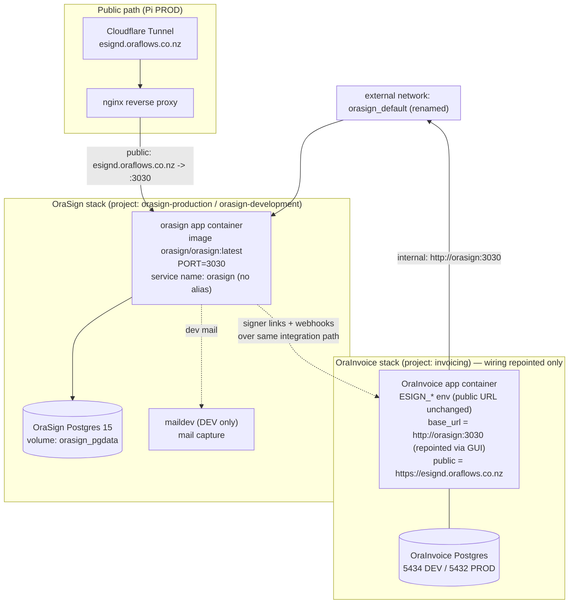

# Design Document

## Overview

OraSign is deployed as a **completely separate, standalone product** that runs alongside OraInvoice. It owns its own PostgreSQL database, its own containers, its own named volume, and its own Docker Compose project (`orasign-development` in DEV, `orasign-production` in PROD). It is never merged into the OraInvoice compose project.

The design now **fully completes the rename to OraSign at the wiring layer**: the external Docker network is renamed `documenso_default` → `orasign_default`, and the app service is named `orasign` and reached internally as `http://orasign:3030`. There is **no `documenso` compatibility alias** — the legacy name is removed everywhere. OraInvoice reaches the signing service in two ways:

1. **Internal server-to-server calls** — the OraInvoice `app` container joins the external Docker network `orasign_default` and calls the service at `http://orasign:3030`. This is the per-organisation connection `base_url` stored encrypted in the OraInvoice database, and `ESIGN_ALLOW_INSECURE_INTERNAL_BASE_URL=true` permits the plain-HTTP internal host (see `docker-compose.dev.yml`).
2. **Public signer links** — `ESIGN_PUBLIC_DOCUMENSO_URL=https://esignd.oraflows.co.nz` (unchanged), used to build `{public}/sign/{token}` links delivered to signers.

Because the network and internal host are renamed with no alias, a **minimal OraInvoice-side wiring change is now required** (and is therefore in scope as a direct consequence of the rename). This wiring change is strictly limited to non-application configuration:

- `docker-compose.dev.yml`: repoint the app service's `networks:` entry and the bottom `networks:` declaration from `documenso_default` to `orasign_default`, and update the related comments from `http://documenso:3030` to `http://orasign:3030`.
- Any Pi PROD compose that joins the network must be checked and updated the same way, per environment.
- The per-organisation connection `base_url` stored in the OraInvoice database must be repointed from `http://documenso:3030` to `http://orasign:3030` through the Global Admin GUI — a runtime operator step, not a code change.
- Optionally (cosmetic, comment-only) the comment in `app/config.py` (line ~171) referencing `http://documenso:3030` may be updated to the new host.

No OraInvoice **application code, database columns** (`documenso_document_id` / `documenso_team_id` / `documenso_recipient_id`), **error code** (`documenso_error`), or **esignatures module logic** changes. The design achieves the rename by:

- Naming the OraSign app service `orasign` on the renamed external network `orasign_default` (no alias), and overriding its listen port to **3030**, so `http://orasign:3030` resolves to the OraSign app container.
- Keeping the public host `esignd.oraflows.co.nz` (Cloudflare Tunnel → nginx) pointed at the OraSign app container's published port.

The design is derived directly from the real artifacts in the repository:

- `OraSign/docker/production/compose.yml` (project `orasign-production`) — the standalone production stack we adapt.
- `OraSign/docker/development/compose.yml` (project `orasign-development`) — the dev variant.
- `OraSign/docker/Dockerfile` + `OraSign/docker/start.sh` — the app image, which runs `npx prisma migrate deploy` against its own DB on startup.
- `OraSign/.env.example` — the full, authoritative env var set.
- `documenso/docker-compose.yml` — the legacy local stack being retired (project `documenso`, services `documenso-db`, `documenso-maildev`, `documenso`, volume `documenso_db`, port 3030).
- `docker-compose.dev.yml` — shows the OraInvoice `app` joining `documenso_default` and the `ESIGN_*` env; this file receives the minimal wiring change (network rename to `orasign_default`).

### Design goals (traced to requirements)

| Goal | Requirements |
|---|---|
| OraSign runs as its own compose project with its own DB, containers, volume | 1, 2 |
| OraSign owns and initialises its own schema via Prisma migrations | 2 |
| Full configuration/secret set defined per environment | 3 |
| Distinct port + volume; reachable at the renamed internal/public URLs | 4 |
| OraInvoice changes limited to network wiring + base_url repoint (no app/code/DB changes) | 5 |
| Deployable to local DEV and Pi PROD as a separate stack | 6 |
| Legacy `documenso` stack and network name retired | 7 |
| Data persisted and backed up | 8 |
| Signing verified end-to-end | 9 |

## Architecture

The OraSign stack is two long-lived services (`orasign` app + `database` postgres), an optional dev-only mail capture service, a named data volume, and a connection to the external `orasign_default` network that OraInvoice attaches to (after the wiring rename).



Two independent resolution paths both terminate at the single OraSign `orasign` app container:

- **Internal:** `OraInvoice app → orasign_default → DNS name "orasign" → orasign:3030`. After the wiring change, OraInvoice's per-org `base_url` is repointed to `http://orasign:3030`, which Docker's embedded DNS resolves to the OraSign service by its real service name (no alias).
- **Public:** `signer browser → Cloudflare Tunnel → nginx → esignd.oraflows.co.nz → orasign:3030`. This serves signer links built from `ESIGN_PUBLIC_DOCUMENSO_URL` (unchanged).

### Key architectural decisions

**Decision 1 — Rename the network and internal host to OraSign (no compatibility alias).**

The rename is completed end-to-end: the external network becomes `orasign_default` and the app service is reached as `http://orasign:3030`. No `documenso` alias is retained. This is the cleanest outcome — there is no lingering legacy name on the network or DNS — at the cost of a minimal, well-bounded OraInvoice-side wiring change.

- Chosen: **rename to `orasign_default`** and address the service by its real name `orasign`. Requires (a) repointing `docker-compose.dev.yml`'s `networks:` references and comments, (b) updating any Pi PROD compose that joins the network, and (c) repointing the per-org `base_url` from `http://documenso:3030` to `http://orasign:3030` via the Global Admin GUI. None of these touch OraInvoice application code, DB columns, error codes, or the esignatures module.
- Rejected: keeping `documenso_default` with a `documenso` service alias — avoids the wiring change but leaves the legacy name embedded in the network and DNS contract indefinitely, which contradicts the goal of fully retiring the documenso name.

**Decision 2 — Override the app listen port to 3030.**

The OraSign production compose defaults `PORT` to 3000. OraInvoice's `base_url` (after repointing) is `http://orasign:3030`. We set `PORT=3030` in the OraSign env so the container listens on 3030 and `orasign:3030` resolves correctly. The published host port is also distinct from any OraInvoice port (see Network and Port Allocation).

**Decision 3 — Fresh DB in both DEV and PROD (no data carry-over).**

Both DEV and PROD start with a fresh, empty OraSign database. There is no `pg_dump`/restore of legacy documenso data into OraSign. The operator has accepted the consequence: any signing document previously created in the legacy documenso service becomes unreachable from OraInvoice, because the stored `documenso_document_id` / `documenso_recipient_id` / `documenso_team_id` references will dangle against the fresh OraSign DB. In-flight and historical signings on the old service will not resolve against the new OraSign database. A pre-cutover `pg_dump` of the legacy DB is retained only as an **optional safety archive** and is never restored into OraSign. See the Data Models section for the cutover detail.

## Components and Interfaces

### Component 1: OraSign App Container (`orasign`)

- **Image:** `orasign/orasign:latest` (built from `OraSign/docker/Dockerfile`).
- **Responsibility:** serves the OraSign web app + API; runs `npx prisma migrate deploy` on startup (`start.sh`); seals signed PDFs with the mounted PKCS#12 certificate.
- **Listen port:** `PORT=3030` (overrides the image default 3000) so it matches OraInvoice's configured internal URL.
- **Network identity:** joined to `orasign_default` under its real service name `orasign` (no alias); also on the stack's default network to reach `database`.
- **Startup ordering:** `depends_on: database (condition: service_healthy)` — the app starts only after Postgres passes `pg_isready` (Requirement 1.4).
- **Health/reachability:** `GET /api/health` (per `start.sh`) used for verification at the configured URL.

Interface contract (what OraInvoice calls after the wiring repoint): the OraSign service exposes its HTTP API surface at `http://orasign:3030` for server-to-server calls and at `https://esignd.oraflows.co.nz` for signer-facing pages and links.

### Component 2: OraSign Database Container (`database`)

- **Image:** `postgres:15`.
- **Responsibility:** stores the OraSign schema and data only. No OraInvoice access.
- **Credentials:** `POSTGRES_USER`, `POSTGRES_PASSWORD`, `POSTGRES_DB` from the OraSign env file.
- **Healthcheck:** `pg_isready -U ${POSTGRES_USER}` (already in both compose files).
- **Persistence:** backed by the named volume (see Data Models).

### Component 3: Mail capture (DEV only)

The legacy `documenso` stack used `documenso-maildev` (MailDev web inbox on port 1080). The OraSign dev compose ships `inbucket` instead (web UI on 9000, SMTP 2500). Either satisfies "capture dev mail". To preserve operator muscle memory from the documenso stack, the standalone dev compose **replaces `documenso-maildev` with a `maildev` service** (web inbox on 1080, SMTP 1025 internal) and points OraSign SMTP at it. Inbucket remains an acceptable alternative if the team prefers the upstream dev default.

### Component 4: Reverse proxy / tunnel (PROD, external to this stack)

Cloudflare Tunnel and nginx already route `esignd.oraflows.co.nz`. This spec does not change the tunnel; it only ensures the nginx upstream for `esignd.oraflows.co.nz` points at the OraSign app container's published port (3030) instead of the retired documenso container.

### Derived compose definitions

**Production (`OraSign/docker/production/compose.yml`, adapted in place):**

The current file is already the right shape (project `orasign-production`, `database` + `orasign` services, volume `database`, cert mount at `/opt/orasign/cert.p12`). The additions required are the external network `orasign_default` joined under the real service name (no alias) and an explicit port:

```yaml
name: orasign-production

services:
  database:
    image: postgres:15
    environment:
      - POSTGRES_USER=${POSTGRES_USER:?err}
      - POSTGRES_PASSWORD=${POSTGRES_PASSWORD:?err}
      - POSTGRES_DB=${POSTGRES_DB:?err}
    healthcheck:
      test: ['CMD-SHELL', 'pg_isready -U ${POSTGRES_USER}']
      interval: 10s
      timeout: 5s
      retries: 5
    volumes:
      - orasign_pgdata:/var/lib/postgresql/data   # renamed from `database` to avoid ambiguity

  orasign:
    image: orasign/orasign:latest
    depends_on:
      database:
        condition: service_healthy
    environment:
      - PORT=${PORT:-3030}                        # override default 3000 -> 3030
      # ... full env set (see Configuration & Secrets) ...
      - NEXT_PRIVATE_SIGNING_LOCAL_FILE_PATH=${NEXT_PRIVATE_SIGNING_LOCAL_FILE_PATH:-/opt/orasign/cert.p12}
    ports:
      - ${ORASIGN_HOST_PORT:-3030}:${PORT:-3030}
    networks:
      default: {}
      orasign_default: {}                          # OraInvoice reaches http://orasign:3030 (no alias)
    volumes:
      - /opt/orasign/cert.p12:/opt/orasign/cert.p12:ro

volumes:
  orasign_pgdata:

networks:
  orasign_default:
    external: true
```

**Development (`OraSign/docker/development/compose.yml`, standalone variant):**

The committed dev compose is the *contributor* stack (database + inbucket + redis + minio + gotenberg) intended for running OraSign from source. For the standalone-service use case (running the published image as the local e-signature backend that OraInvoice talks to), the dev stack mirrors production with dev-friendly mail capture:

```yaml
name: orasign-development

services:
  database:
    image: postgres:15
    environment:
      - POSTGRES_USER=${POSTGRES_USER:-orasign}
      - POSTGRES_PASSWORD=${POSTGRES_PASSWORD:-password}
      - POSTGRES_DB=${POSTGRES_DB:-orasign}
    healthcheck:
      test: ['CMD-SHELL', 'pg_isready -U ${POSTGRES_USER:-orasign}']
      interval: 10s
      timeout: 5s
      retries: 5
    volumes:
      - orasign_pgdata_dev:/var/lib/postgresql/data

  maildev:                                         # replaces documenso-maildev
    image: maildev/maildev:latest
    environment:
      - MAILDEV_INCOMING_USER=orasign
      - MAILDEV_INCOMING_PASS=orasign
    ports:
      - '1080:1080'

  orasign:
    image: orasign/orasign:latest
    depends_on:
      database:
        condition: service_healthy
    environment:
      - PORT=${PORT:-3030}
      # ... full env set, SMTP pointed at maildev:1025 ...
    ports:
      - ${ORASIGN_HOST_PORT:-3030}:${PORT:-3030}
    networks:
      default: {}
      orasign_default: {}                          # reached as http://orasign:3030 (no alias)
    volumes:
      - ./certs/cert.p12:/opt/orasign/cert.p12:ro

volumes:
  orasign_pgdata_dev:

networks:
  orasign_default:
    external: true
```

Both files keep the project name distinct (`orasign-production` / `orasign-development`), keep the volume name distinct from `documenso_db`, and attach to `orasign_default` as an external consumer under the real service name `orasign` — never the legacy `documenso` name or alias.

## Data Models

OraSign owns its full relational schema through its Prisma migrations under `OraSign/packages/prisma/migrations`. This spec does not define those tables; it defines the **operational data model** — what storage OraSign owns and how it stays isolated from OraInvoice.

### Storage ownership

| Item | DEV | PROD |
|---|---|---|
| Compose project | `orasign-development` | `orasign-production` |
| DB image | `postgres:15` | `postgres:15` |
| DB name / user | `orasign` / `orasign` | from env (`POSTGRES_DB` / `POSTGRES_USER`) |
| Named volume | `orasign_pgdata_dev` | `orasign_pgdata` |
| App listen port | 3030 | 3030 |
| Published host port | `ORASIGN_HOST_PORT` (default 3030) | `ORASIGN_HOST_PORT` (default 3030) |

The OraInvoice volumes (`postgres` data on 5434/5432) and the legacy `documenso_db` volume are never referenced. Because Docker namespaces volumes by project, `orasign-production_orasign_pgdata` cannot collide with `documenso_documenso_db` or any `invoicing_*` volume (Requirements 4.3, 6.4).

### Data isolation

- OraSign connects only to its own `database` service via `NEXT_PRIVATE_DATABASE_URL` / `NEXT_PRIVATE_DIRECT_DATABASE_URL` (host `database`, the in-stack service name).
- It has no connection string, credential, or network route to the OraInvoice Postgres. The two databases share no tables and no schema (Requirement 2.3).
- OraInvoice continues to store the foreign references it already holds (`documenso_document_id`, `documenso_team_id`, `documenso_recipient_id`) — opaque IDs that point at rows inside the OraSign database. Those columns are unchanged (out of scope). Note that with a fresh OraSign DB (see cutover decision below), any such reference created against the legacy documenso service will not resolve against the new OraSign database.

### Schema initialisation

On every app start, `start.sh` runs `npx prisma migrate deploy --schema ../../packages/prisma/schema.prisma` against the OraSign DB before `node build/server/main.js`. A fresh volume is therefore brought to the current schema automatically; an existing volume has only outstanding migrations applied (Requirements 2.2, 6.5).

### PROD cutover decision: fresh DB (no data carry-over)

**Decision: both DEV and PROD start with a fresh, empty OraSign database.** There is no `pg_dump`/restore of the legacy documenso data into OraSign.

Consequence (accepted by the operator): any signing document previously created in the legacy documenso service becomes **unreachable from OraInvoice**. The OraInvoice rows that reference those documents by `documenso_document_id` / `documenso_recipient_id` / `documenso_team_id` will **dangle** — the IDs point at rows that do not exist in the fresh OraSign database. In-flight and historical signings on the old service will **not** resolve against the new OraSign DB. New signings created after cutover work normally end-to-end.

A pre-cutover `pg_dump` of the legacy documenso database is taken **only as an optional safety archive**. It is stored off to the side for emergency reference and is **never restored into OraSign**. The cutover does not depend on it.

Because the schema initialises from empty, Prisma `migrate deploy` simply brings the fresh volume to the current OraSign schema on first start (Requirements 2.2, 6.5). No legacy-schema compatibility analysis is required.

## Configuration and Secrets

OraSign is configured entirely through environment variables (authoritative list in `OraSign/.env.example`). Each environment has its own `.env` file (`OraSign/docker/production/.env`, `OraSign/docker/development/.env`) that is **excluded from version control** (Requirement 3.7). Compose enforces required values with the `${VAR:?err}` syntax, so an unset required value fails startup with a message naming the variable (Requirement 3.6).

### Required (startup fails if unset — `:?err`)

| Variable | Purpose | Notes |
|---|---|---|
| `NEXTAUTH_SECRET` | Auth session signing | Random ≥32 chars |
| `NEXT_PRIVATE_ENCRYPTION_KEY` | Symmetric encryption (primary) | Random ≥32 chars |
| `NEXT_PRIVATE_ENCRYPTION_SECONDARY_KEY` | Symmetric encryption (secondary) | Random ≥32 chars |
| `NEXT_PUBLIC_WEBAPP_URL` | Public origin | PROD: `https://esignd.oraflows.co.nz`; DEV: `http://localhost:3030` |
| `NEXT_PRIVATE_DATABASE_URL` | Connection to OraSign DB | host = `database` (in-stack service) |
| `POSTGRES_USER` / `POSTGRES_PASSWORD` / `POSTGRES_DB` | DB provisioning | Owned by OraSign |
| `NEXT_PRIVATE_SMTP_TRANSPORT` | Email transport selector | `smtp-auth` \| `smtp-api` \| `resend` \| `mailchannels` |
| `NEXT_PRIVATE_SMTP_FROM_NAME` / `NEXT_PRIVATE_SMTP_FROM_ADDRESS` | Sender identity | |

### Important defaults / optional

| Variable | Default | Notes |
|---|---|---|
| `PORT` | `3030` (we override the image default 3000) | Must be 3030 to match OraInvoice's configured internal URL |
| `ORASIGN_HOST_PORT` | `3030` | Published host port; distinct from OraInvoice ports |
| `NEXT_PRIVATE_DIRECT_DATABASE_URL` | falls back to `NEXT_PRIVATE_DATABASE_URL` | Used for migrations (non-pooled) |
| `NEXT_PUBLIC_UPLOAD_TRANSPORT` | `database` | Keeps uploads in the OraSign DB; no S3 dependency by default |
| `NEXT_PRIVATE_SIGNING_LOCAL_FILE_PATH` | `/opt/orasign/cert.p12` | Cert mount target |
| `NEXT_PRIVATE_SIGNING_PASSPHRASE` | — | PKCS#12 passphrase |
| `NEXT_PRIVATE_INTERNAL_WEBAPP_URL` | `http://localhost:$PORT` | Self-requests for background jobs |

### Email transport choices

- **DEV:** `NEXT_PRIVATE_SMTP_TRANSPORT=smtp-auth` pointed at the `maildev` service (`NEXT_PRIVATE_SMTP_HOST=maildev`, `NEXT_PRIVATE_SMTP_PORT=1025`) so all signing emails are captured at `http://localhost:1080` instead of being delivered. This replaces the documenso-maildev capture.
- **PROD:** `resend` (the build ships the nodemailer-resend transport) with `NEXT_PRIVATE_RESEND_API_KEY`, or MailChannels, or an authenticated SMTP relay — chosen by the operator. Real delivery only in PROD.

### Signing certificate

The PKCS#12 certificate is mounted **read-only** into the app container at `NEXT_PRIVATE_SIGNING_LOCAL_FILE_PATH`. PROD mounts the host path `/opt/orasign/cert.p12`; DEV mounts `./certs/cert.p12`. `start.sh` checks the cert is present and readable at boot and warns (does not crash) if missing — signing is then unavailable until the cert is supplied (Requirement 3.5).

### Secret handling

Secrets live only in the per-environment `.env` files, git-ignored. Nothing secret is committed. The OraSign DB credentials, encryption keys, NEXTAUTH secret, signing passphrase, and any email API keys are all sourced from these files at compose up.

## Reachability / Minimal-OraInvoice-Wiring Strategy

This is the crux of the design: make `http://orasign:3030` and `https://esignd.oraflows.co.nz` resolve to the OraSign app container, with a **minimal, well-bounded OraInvoice wiring change** — the network reference, the per-org `base_url` repoint, and an optional config comment — and **no OraInvoice application/code/DB/error-code changes** (Requirements 4 and 5).

### Internal path — `http://orasign:3030`

1. The OraInvoice `app` service's network membership is repointed from `documenso_default` to `orasign_default` in `docker-compose.dev.yml` (and any Pi PROD compose that joins the network, per environment).
2. The OraSign `orasign` service attaches to `orasign_default` under its real service name (no alias).
3. The OraSign app listens on `PORT=3030`.
4. The per-org connection `base_url` stored in the OraInvoice DB is repointed from `http://documenso:3030` to `http://orasign:3030` via the Global Admin GUI (a runtime operator step).
5. Result: Docker's embedded DNS resolves `orasign` (from OraInvoice's network namespace on `orasign_default`) to the OraSign container's IP, and `:3030` hits the listening app. `ESIGN_ALLOW_INSECURE_INTERNAL_BASE_URL=true` (already set, unchanged) permits the plain-HTTP internal call.

### Public path — `https://esignd.oraflows.co.nz`

1. Cloudflare Tunnel for `esignd.oraflows.co.nz` already terminates at the Pi's nginx (unchanged tunnel config).
2. nginx's upstream for that host is pointed at the OraSign app container's published port (3030) instead of the retired documenso container.
3. OraSign's `NEXT_PUBLIC_WEBAPP_URL=https://esignd.oraflows.co.nz` makes it build signer links on that host, matching OraInvoice's `ESIGN_PUBLIC_DOCUMENSO_URL` (unchanged).

### OraInvoice changes — in scope vs out of scope

**In scope (a direct consequence of the rename — configuration/wiring only):**

- `docker-compose.dev.yml`: the app service's `networks:` entry and the bottom `networks:` declaration change from `documenso_default` to `orasign_default`; related comments referencing `http://documenso:3030` are updated to `http://orasign:3030`.
- Any Pi PROD compose that joins the network is checked and updated the same way, per environment.
- The per-org connection `base_url` is repointed from `http://documenso:3030` to `http://orasign:3030` through the Global Admin GUI (runtime data change, not code).
- Optional/cosmetic: the comment in `app/config.py` (line ~171) referencing `http://documenso:3030` may be updated to the new host (comment only).

**Out of scope (explicitly unchanged):**

- All OraInvoice application code (`app/`, `frontend-v2/`, `mobile/`, `tests/`, `scripts/`) and the `DocumensoClient` integration class.
- The OraInvoice database columns `documenso_document_id`, `documenso_team_id`, `documenso_recipient_id`.
- The OraInvoice API error code `documenso_error`.
- The OraInvoice esignatures module logic and the `NEXT_PRIVATE_DOCUMENSO_*` / `ESIGN_DOCUMENSO_*` environment variable names.

### Why the application stays untouched

OraInvoice's contract is two strings: an internal `base_url` and a public host. The internal one is satisfied by repointing a single stored value plus the compose network reference; the public one by the nginx upstream re-point. Neither requires editing OraInvoice application code, DB schema/columns, error codes, or module logic (Requirement 5.1).

## Deployment Procedures

OraSign deploys as its own compose project, independent of the OraInvoice lifecycle (Requirement 6.3).

### Prerequisite: create the external network and apply the wiring change

The renamed network `orasign_default` must exist before either stack starts. Create it once:

```bash
docker network create orasign_default
```

Apply the one-time OraInvoice wiring change (see "Minimal-OraInvoice-Wiring Strategy"):

- Edit `docker-compose.dev.yml` — change the app service `networks:` entry and the bottom `networks:` declaration from `documenso_default` to `orasign_default`; update the related comments to `http://orasign:3030`.
- Check and update any Pi PROD compose that joins the signing network the same way.
- After OraSign is up, repoint the per-org `base_url` from `http://documenso:3030` to `http://orasign:3030` in the Global Admin GUI.

### Local DEV bring-up

```bash
# from repo root
docker compose -f OraSign/docker/development/compose.yml --env-file OraSign/docker/development/.env up -d
```

- Project: `orasign-development`. Web UI / API: `http://localhost:3030`. Captured mail: `http://localhost:1080`.
- The OraInvoice dev app (rejoined to `orasign_default`) reaches it at `http://orasign:3030` once the GUI `base_url` is repointed.

### Pi PROD bring-up

```bash
ssh nerdy@192.168.1.90 "cd /home/nerdy/invoicing && \
  docker compose -f OraSign/docker/production/compose.yml --env-file OraSign/docker/production/.env up -d"
```

- Project: `orasign-production`. Reached internally at `http://orasign:3030`, publicly at `https://esignd.oraflows.co.nz`.
- Runs alongside the existing `invoicing` PROD project; rebuilding OraInvoice's `app` does not restart OraSign and vice versa (Requirement 6.3).
- It slots into the existing Pi flow as an additional, separate `docker compose ... up -d` step — it is **not** added to the `invoicing` redeploy command.

### Retiring the legacy `documenso` stack

The cutover replaces the old documenso service and its network name with the OraSign stack on the renamed network. Because PROD starts with a fresh OraSign DB, the only legacy data step is an optional safety archive.

```bash
# 1. (Optional safety archive — NOT restored into OraSign) dump the legacy DB.
docker compose -f documenso/docker-compose.yml --env-file documenso/.env \
  exec -T documenso-db pg_dump -U "$POSTGRES_USER" "$POSTGRES_DB" \
  | gzip > documenso_legacy_archive_$(date +%F).sql.gz
# 2. Stop and remove the legacy stack (frees the old documenso_default network).
docker compose -f documenso/docker-compose.yml --env-file documenso/.env down
# 3. Create the renamed network and apply the OraInvoice wiring change (see prerequisite above).
docker network create orasign_default
# 4. Recreate the OraInvoice app on the renamed network, then bring up OraSign.
docker compose -f OraSign/docker/production/compose.yml --env-file OraSign/docker/production/.env up -d
# 5. Repoint the per-org base_url to http://orasign:3030 via the Global Admin GUI.
# 6. Re-point nginx upstream for esignd.oraflows.co.nz to the OraSign app port, reload nginx.
# 7. Run end-to-end verification (Requirement 9) before declaring cutover complete.
```

After retirement, no OraSign workload depends on the `documenso` project, the `documenso-documenso-1` container, the `documenso_db` volume, or the `documenso_default` network — OraSign owns its own DB and app and consumes only the renamed `orasign_default` network (Requirement 7.5).

### Backup / restore of the OraSign DB (Pi PROD)

**Backup** (Requirement 8.3):

```bash
docker compose -p orasign-production exec -T database \
  pg_dump -U "$POSTGRES_USER" "$POSTGRES_DB" | gzip > orasign_$(date +%F).sql.gz
```

**Restore** (Requirement 8.4) into the `orasign_pgdata` volume:

```bash
gunzip -c orasign_<date>.sql.gz | \
  docker compose -p orasign-production exec -T database \
  psql -U "$POSTGRES_USER" -d "$POSTGRES_DB"
```

Volume-level snapshots (`docker run --rm -v orasign-production_orasign_pgdata:/data ...`) are an alternative for full-volume capture.

## Correctness Properties

*A property is a characteristic or behavior that should hold true across all valid executions of a system — essentially, a formal statement about what the system should do. Properties serve as the bridge between human-readable specifications and machine-verifiable correctness guarantees.*

This feature is infrastructure and deployment configuration, so its correctness is established by **deterministic integration and smoke checks**, not by randomized property-based testing (the behavior is network/volume/config wiring that does not vary meaningfully with generated inputs). The following invariants are nonetheless stated as universally-quantified properties for clarity and traceability; each is validated by a single deterministic check rather than 100+ generated cases.

### Property 1: Data isolation

*For all* OraSign data reads and writes, the target is the OraSign database only; the OraSign database and the OraInvoice database share no tables and no schema, and no OraSign container mounts, links to, or holds a connection string for any OraInvoice database, container, or volume.

**Validates: Requirements 1.5, 2.3, 2.4, 2.5**

### Property 2: URL resolution

*For all* requests OraInvoice issues to its Configured_API_URL after the wiring repoint — the internal host `http://orasign:3030` on the renamed `orasign_default` network and the public host `https://esignd.oraflows.co.nz` — the request resolves to the standalone OraSign app container.

**Validates: Requirements 4.5, 7.2**

### Property 3: Persistence across restart and recreation

*For all* OraSign data written before a restart or container recreation that retains the Data_Volume, the same data is present and readable after the stack comes back up.

**Validates: Requirements 8.1, 8.2**

### Property 4: End-to-end signing reachability

*For all* signing requests sent from the OraInvoice integration path to the Configured_API_URL while the OraSign stack is running, the OraSign service accepts the request, creates the corresponding signing document in its own OraSign database, returns a result OraInvoice can consume, and delivers the completion event back to OraInvoice over the same configured path.

**Validates: Requirements 5.2, 5.3, 9.1, 9.2, 9.3**

## Error Handling

| Failure | Behavior | Requirement |
|---|---|---|
| Required env var unset at startup | Compose `${VAR:?err}` aborts `up` with a message naming the variable; the app never starts in a misconfigured state | 3.6 |
| Database not yet healthy | `depends_on: condition: service_healthy` holds the app container until `pg_isready` passes; no migrations or serving against a down DB | 1.4 |
| Pending Prisma migrations | `prisma migrate deploy` runs in `start.sh` before the server boots; a migration failure exits the start script so the container does not serve a half-migrated schema | 2.2, 6.5 |
| Signing certificate missing/unreadable | `start.sh` logs a warning and continues; signing is unavailable until the cert is mounted (the app stays up so non-signing flows work) | 3.5 |
| `orasign_default` network absent | Compose `up` fails fast on the external network; operator creates it with `docker network create orasign_default` | 7.4 |
| OraInvoice still wired to the old `documenso_default` network | OraInvoice cannot resolve `orasign` until its compose network reference is repointed and the app is recreated on `orasign_default`; cutover applies the wiring change before verification | 7.1, 7.5 |
| End-to-end verification step fails | The verification procedure reports which stage failed — reachability, document creation, or signing-event delivery — and PROD cutover is gated on a clean DEV pass | 9.4, 9.5 |
| Email delivery failure (PROD) | Transport errors are logged by OraSign; signing document creation is independent of email so the core flow is not blocked | 3.4 |

## Testing Strategy

Because this is an infrastructure/deployment feature (Docker Compose, networking, volumes, env), property-based testing does not apply — the criteria test wiring and external-service behavior, not pure functions with meaningful input variation. Verification uses **smoke checks** (one-time config/setup assertions) and **integration tests** (1–3 representative executions). Property-based testing with randomized generators is deliberately not used.

### Smoke checks (config / setup — single execution)

- Compose project names are `orasign-development` / `orasign-production` and contain `database`, `orasign`, and a named volume (1.1, 1.2).
- OraSign services do not appear in any OraInvoice compose file (1.3, 5.1).
- DB image is `postgres:15` with OraSign-owned `POSTGRES_*` (2.1).
- All required env vars are set; `.env` files are git-ignored (3.1–3.4, 3.7).
- Signing cert mounted `:ro` at the configured path (3.5).
- Published host port and volume name do not collide with OraInvoice's (80/8999/5434/5432, `documenso_db`) (4.1, 4.3, 6.4, 7.3).
- Public signer host `esignd.oraflows.co.nz` routing preserved; the per-org record is repointed to `http://orasign:3030` via the Global Admin GUI (no app/code change) (5.4, 5.5).
- Backup and restore runbooks exist and execute (8.3, 8.4).
- Health endpoint responds at the Configured_API_URL (9.1).

### Integration tests (1–3 examples) — validate the correctness properties

- **Property 1 (isolation):** inspect the OraSign app container — assert its only DB route is the in-stack `database`; connect to both databases and assert disjoint table sets; assert no OraInvoice mounts/links (1.5, 2.3, 2.4, 2.5).
- **Property 2 (URL resolution):** from the OraInvoice app container (now on `orasign_default`), `curl http://orasign:3030/api/health` succeeds; externally, `curl https://esignd.oraflows.co.nz/api/health` succeeds; both reach the OraSign app identity (4.2, 4.4, 4.5, 7.2, 7.4).
- **Property 3 (persistence):** write a signing document, `docker compose down` (without `-v`), `up`, assert the document is still present (8.1, 8.2).
- **Property 4 (end-to-end signing):** from an OraInvoice org, initiate a signing request → assert the document row is created in the OraSign DB and a consumable response returns; complete the document → assert OraInvoice receives the signing event over the existing path (5.2, 5.3, 9.2, 9.3).
- **Lifecycle independence:** restart the OraInvoice `app`; assert OraSign keeps serving, and vice versa (6.3). Stop the legacy `documenso` project; assert OraSign keeps running (7.5).
- **Startup migrations:** start on a fresh volume; assert `migrate deploy` ran and the schema exists before serving (2.2, 6.5).

### Failure-path checks (edge cases)

- Unset each required env var in turn; assert `up` fails naming that variable (3.6).
- Force each end-to-end stage to fail; assert the verification procedure names the failing stage (9.5).

### Verification gating

End-to-end verification (Property 4) must pass in **local DEV** before the Pi PROD cutover proceeds (9.4). A "pass" means: health check green at both the internal (`http://orasign:3030`) and public URLs, a signing document created and visible in the OraSign DB, and the completion event observed back in OraInvoice. Because both environments start with a fresh OraSign DB, the cutover does not require any data-restore confirmation — only that the optional legacy archive (if taken) is set aside and the operator has accepted that legacy documents will not resolve against the new DB.
