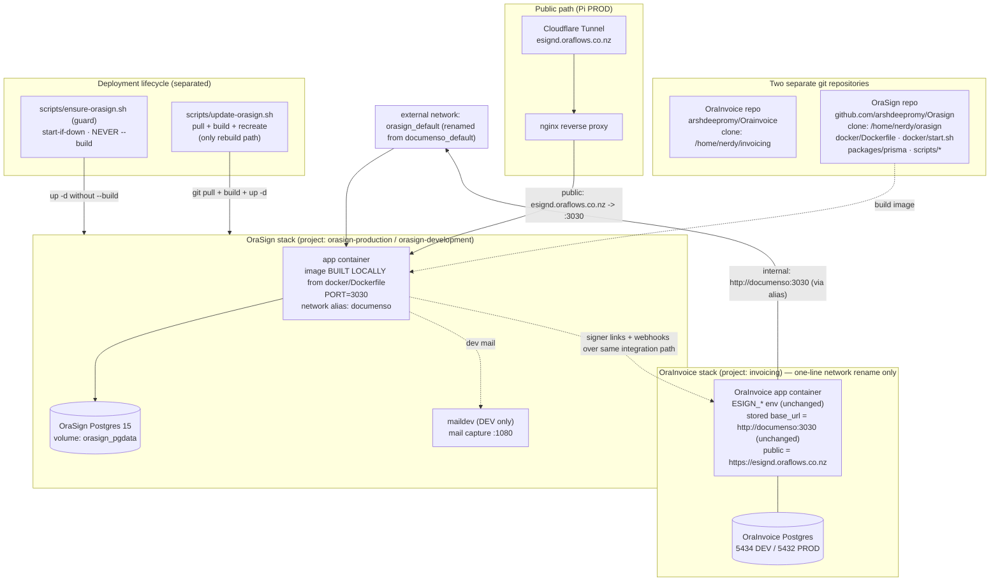

# Design Document

## Overview

OraSign is deployed as a **completely separate, standalone product** that runs alongside OraInvoice on the same host. It lives in its **own git repository** — `github.com/arshdeepromy/Orasign` (private, clean single-commit history) — cloned to its **own path** on each host (recommended `/home/nerdy/orasign` on the Pi), entirely independent of the OraInvoice clone at `/home/nerdy/invoicing`. OraSign owns its own PostgreSQL database, its own containers, its own named volume, and its own Docker Compose project (`orasign-development` in DEV, `orasign-production` in PROD). It is never merged into the OraInvoice compose project.

The integration keeps working with **no change to OraInvoice application code or the OraInvoice database** by using a **compatibility network alias**. Two things move at the wiring layer:

1. The external Docker network is **renamed** `documenso_default` → `orasign_default`.
2. The OraSign app service attaches to `orasign_default` with the network **alias `documenso`**, so the base_url already stored (envelope-encrypted) in the OraInvoice database — `http://documenso:3030` — still resolves to the OraSign app container.

Because the network name changes but the alias preserves the DNS contract, the **only permitted OraInvoice edit is a single one-line change** to the external-network name reference in `docker-compose.dev.yml` (and the equivalent reference on the Pi, if its compose declares it). No OraInvoice application code, database columns, stored base_url value, error code, or esignatures module logic changes.

OraInvoice reaches the signing service in two ways, both unchanged in contract:

1. **Internal server-to-server calls** — the OraInvoice `app` container joins the external network (now `orasign_default`) and calls the service at `http://documenso:3030`. That host resolves via the `documenso` network alias on the OraSign app container. `ESIGN_ALLOW_INSECURE_INTERNAL_BASE_URL=true` (already set, unchanged) permits the plain-HTTP internal host.
2. **Public signer links** — `ESIGN_PUBLIC_DOCUMENSO_URL=https://esignd.oraflows.co.nz` (unchanged), used to build `{public}/sign/{token}` links delivered to signers.

OraSign's **deployment mirrors OraInvoice's local-build model**: the app image is **built locally** from the OraSign repo's `docker/Dockerfile` (not pulled from a public registry). A deploy is `git pull` of the OraSign repo at its clone path, then `docker compose ... build`, then `up -d`.

Because the two products share a host but not a lifecycle, their deploy flows are strictly separated:

- **An OraInvoice deploy never redeploys, rebuilds, or recreates OraSign.** It invokes a small **guard script** that starts OraSign only if it is not already running, and never rebuilds.
- A separate **explicit update command** (`update-orasign`) is the only path that pulls the OraSign repo, rebuilds the image, and recreates the containers.

Both DEV and PROD start with a **fresh, empty OraSign database (Option B)**. There is no carry-over or migration of legacy documenso data; the decision is final.

### Source artifacts this design is derived from

**OraSign repository (`github.com/arshdeepromy/Orasign`, cloned to `/home/nerdy/orasign`):**

- `docker/production/compose.yml` — the standalone production stack (project `orasign-production`); adapted here to build locally, listen on 3030, join `orasign_default` with alias `documenso`, and use volume `orasign_pgdata`.
- `docker/development/compose.yml` — the dev variant (project `orasign-development`).
- `docker/Dockerfile` — the app image built locally.
- `docker/start.sh` — runs `prisma migrate deploy` against the OraSign DB on startup.
- `.env.example` — the authoritative env var set.
- `packages/prisma` — the OraSign-owned schema and migrations.

**OraInvoice repository (`arshdeepromy/Orainvoice`, this workspace):**

- `docker-compose.dev.yml` — declares external network `documenso_default` and joins the `app` service to it with the `ESIGN_*` env. This file receives the **single permitted one-line change** (network name `documenso_default` → `orasign_default`).
- `documenso/docker-compose.yml` — the **retired** legacy local stack (project `documenso`, container `documenso-documenso-1`, port 3030, maildev on 1080, volume `documenso_db`). Replaced by the OraSign stack.

### Design goals (traced to requirements)

| Goal | Requirements |
|---|---|
| OraSign source lives only in its own repo; built/deployed from its own clone path | 1 |
| OraSign runs as its own compose project with its own DB, containers, volume | 2 |
| OraSign owns and initialises its own fresh schema via Prisma migrations | 3 |
| Full configuration/secret set defined per environment | 4 |
| Network renamed to `orasign_default`; `documenso` alias preserves internal URL; distinct port/volume | 5 |
| OraInvoice change limited to a one-line network reference; no app/DB/base_url/error-code changes | 6 |
| Image built locally from `docker/Dockerfile`; deploy = pull + build + up | 7 |
| Deploy lifecycle separated: guard starts-if-down, update-command is the only rebuild path | 8 |
| Deployable to local DEV and Pi PROD as a separate stack | 9 |
| Legacy `documenso` stack and network name retired | 10 |
| Data persisted and backed up | 11 |
| Signing verified end-to-end | 12 |

## Architecture

The OraSign stack is two long-lived services (`app` + `database`), an optional dev-only mail-capture service, a named data volume, a locally-built app image, and a connection to the external `orasign_default` network that OraInvoice attaches to (after the one-line rename).



Two independent resolution paths both terminate at the single OraSign `app` container:

- **Internal:** `OraInvoice app → orasign_default → DNS alias "documenso" → app:3030`. The stored base_url `http://documenso:3030` is unchanged; Docker's embedded DNS resolves the `documenso` alias on the renamed network to the OraSign container.
- **Public:** `signer browser → Cloudflare Tunnel → nginx → esignd.oraflows.co.nz → app:3030`, serving signer links built from `ESIGN_PUBLIC_DOCUMENSO_URL` (unchanged).

### Key architectural decisions

**Decision 1 — Rename the network but keep a `documenso` alias (no OraInvoice app/DB change).**

The external network becomes `orasign_default`, but the OraSign app service carries the network alias `documenso`, so the stored base_url `http://documenso:3030` keeps resolving. This retires the `documenso_default` network **name** while preserving the DNS contract OraInvoice already depends on.

- Chosen: **rename the network to `orasign_default` + alias `documenso`.** The only OraInvoice touch is a one-line external-network name reference in `docker-compose.dev.yml` (and the equivalent Pi reference if present). No application code, DB columns, stored base_url, error code, or module logic changes (Requirement 6).
- Rejected: renaming the internal host to `orasign` and repointing the stored base_url via the GUI — this would drop the alias but forces a runtime data change to every org's connection record and leaves a migration burden with no functional benefit for this cutover.

**Decision 2 — Build the app image locally, mirroring OraInvoice.**

OraSign's compose uses `build:` (context = repo root, dockerfile = `docker/Dockerfile`) rather than `image: orasign/orasign:latest`. This mirrors the OraInvoice model where the `app` image is built locally, and removes any dependency on a public image registry (Requirement 7).

**Decision 3 — Override the app listen port to 3030.**

The app listens on `PORT=3030` so `http://documenso:3030` (unchanged stored base_url) resolves to the container. The published host port is distinct from any OraInvoice port (80/8999) — see Network and Port Allocation.

**Decision 4 — Fresh DB in both DEV and PROD (Option B, final).**

Both environments start with a fresh, empty OraSign database. There is no `pg_dump`/restore of legacy documenso data into OraSign. Consequence, accepted by the operator: any signing document previously created in the legacy service becomes unreachable from OraInvoice, because the stored `documenso_document_id` / `documenso_recipient_id` / `documenso_team_id` references dangle against the fresh DB. New signings after cutover work end-to-end. A pre-cutover `pg_dump` of the legacy DB is retained only as an **optional safety archive** and is never restored.

**Decision 5 — Separate the deploy lifecycles with a guard and an explicit update command.**

An OraInvoice deploy must never rebuild OraSign. A **guard script** (`scripts/ensure-orasign.sh`, in the OraSign repo) is invoked from the OraInvoice deploy flow; it starts OraSign only if it is down and never rebuilds. A separate **`scripts/update-orasign.sh`** is the sole path that pulls, rebuilds, and recreates (Requirement 8). See Deployment Lifecycle Separation.

## Components and Interfaces

### Component 1: OraSign App Container (`app`)

- **Image:** built **locally** from `docker/Dockerfile` in the OraSign repo (no registry pull).
- **Responsibility:** serves the OraSign web app + API; runs `prisma migrate deploy` on startup (`docker/start.sh`); seals signed PDFs with the mounted PKCS#12 certificate.
- **Listen port:** `PORT=3030` (matches the unchanged OraInvoice internal base_url).
- **Network identity:** joined to `orasign_default` with the network **alias `documenso`**; also on the stack's default network to reach `database`.
- **Startup ordering:** `depends_on: database (condition: service_healthy)` — the app starts only after Postgres passes `pg_isready` (Requirement 2.4).
- **Health/reachability:** `GET /api/health` (per `start.sh`) used for verification at the Configured_API_URL.

Interface contract (unchanged for OraInvoice): the OraSign service exposes its HTTP API at `http://documenso:3030` for server-to-server calls (via the alias) and at `https://esignd.oraflows.co.nz` for signer-facing pages and links.

### Component 2: OraSign Database Container (`database`)

- **Image:** `postgres:15`.
- **Responsibility:** stores the OraSign schema and data only. No OraInvoice access.
- **Credentials:** `POSTGRES_USER`, `POSTGRES_PASSWORD`, `POSTGRES_DB` from the OraSign env file.
- **Healthcheck:** `pg_isready -U ${POSTGRES_USER}`.
- **Persistence:** backed by the named volume (`orasign_pgdata` PROD / `orasign_pgdata_dev` DEV).

### Component 3: Mail capture (DEV only)

The dev compose ships a `maildev` service (web inbox on 1080, SMTP 1025 internal) so signing emails are captured locally rather than delivered. This preserves the operator muscle memory from the retired `documenso-maildev`. Inbucket (the upstream OraSign dev default) is an acceptable alternative.

### Component 4: Reverse proxy / tunnel (PROD, external to this stack)

Cloudflare Tunnel and nginx already route `esignd.oraflows.co.nz`. This spec does not change the tunnel; it only ensures the nginx upstream for `esignd.oraflows.co.nz` points at the OraSign app container's published port (3030) instead of the retired documenso container.

### Component 5: Guard script (`scripts/ensure-orasign.sh`, OraSign repo)

- **Responsibility:** ensure the OraSign stack is running without ever rebuilding it. Invoked by the OraInvoice deploy flow.
- **Behavior:** checks whether the stack is up (`docker compose -p orasign-production ps` + container health); if running → no-op (idempotent); if stopped → `docker compose ... up -d` **without** `--build`.
- **Placement rationale:** the authoritative guard lives in the **OraSign repo** because it owns the compose files, project name, env path, and health semantics. The OraInvoice deploy flow only needs to know one path (`/home/nerdy/orasign/scripts/ensure-orasign.sh`), keeping OraInvoice free of OraSign-specific detail.

### Component 6: Update command (`scripts/update-orasign.sh`, OraSign repo)

- **Responsibility:** the **only** path that pulls the OraSign repo, rebuilds the locally-built image, and recreates containers.
- **Behavior:** `git pull` at the clone path → `docker compose ... build` → `docker compose ... up -d`. Run explicitly by an operator; never invoked by the OraInvoice deploy flow.

### Derived compose definitions

**Production (`docker/production/compose.yml` in the OraSign repo, adapted):**

Key adaptations: `build:` instead of `image:` (local build), `PORT=3030`, join external `orasign_default` with alias `documenso`, volume `orasign_pgdata`, cert mounted read-only.

```yaml
name: orasign-production

services:
  database:
    image: postgres:15
    environment:
      - POSTGRES_USER=${POSTGRES_USER:?err}
      - POSTGRES_PASSWORD=${POSTGRES_PASSWORD:?err}
      - POSTGRES_DB=${POSTGRES_DB:?err}
    healthcheck:
      test: ['CMD-SHELL', 'pg_isready -U ${POSTGRES_USER}']
      interval: 10s
      timeout: 5s
      retries: 5
    volumes:
      - orasign_pgdata:/var/lib/postgresql/data

  app:
    build:
      context: ..                       # repo root of the OraSign clone
      dockerfile: docker/Dockerfile      # build locally, do NOT pull from a registry
    depends_on:
      database:
        condition: service_healthy
    environment:
      - PORT=${PORT:-3030}               # listen on 3030 to match the unchanged base_url
      # ... full env set (see Configuration & Secrets) ...
      - NEXT_PRIVATE_SIGNING_LOCAL_FILE_PATH=${NEXT_PRIVATE_SIGNING_LOCAL_FILE_PATH:-/opt/orasign/cert.p12}
    ports:
      - ${ORASIGN_HOST_PORT:-3030}:${PORT:-3030}
    networks:
      default: {}
      orasign_default:
        aliases:
          - documenso                    # so http://documenso:3030 still resolves (no OraInvoice change)
    volumes:
      - /opt/orasign/cert.p12:/opt/orasign/cert.p12:ro

volumes:
  orasign_pgdata:

networks:
  orasign_default:
    external: true
```

**Development (`docker/development/compose.yml` in the OraSign repo, standalone variant):**

```yaml
name: orasign-development

services:
  database:
    image: postgres:15
    environment:
      - POSTGRES_USER=${POSTGRES_USER:-orasign}
      - POSTGRES_PASSWORD=${POSTGRES_PASSWORD:-password}
      - POSTGRES_DB=${POSTGRES_DB:-orasign}
    healthcheck:
      test: ['CMD-SHELL', 'pg_isready -U ${POSTGRES_USER:-orasign}']
      interval: 10s
      timeout: 5s
      retries: 5
    volumes:
      - orasign_pgdata_dev:/var/lib/postgresql/data

  maildev:                               # replaces documenso-maildev
    image: maildev/maildev:latest
    environment:
      - MAILDEV_INCOMING_USER=orasign
      - MAILDEV_INCOMING_PASS=orasign
    ports:
      - '1080:1080'

  app:
    build:
      context: ..
      dockerfile: docker/Dockerfile      # build locally
    depends_on:
      database:
        condition: service_healthy
    environment:
      - PORT=${PORT:-3030}
      # ... full env set, SMTP pointed at maildev:1025 ...
    ports:
      - ${ORASIGN_HOST_PORT:-3030}:${PORT:-3030}
    networks:
      default: {}
      orasign_default:
        aliases:
          - documenso                    # reached as http://documenso:3030 (via alias)
    volumes:
      - ./certs/cert.p12:/opt/orasign/cert.p12:ro

volumes:
  orasign_pgdata_dev:

networks:
  orasign_default:
    external: true
```

Both files keep the project name distinct (`orasign-production` / `orasign-development`), keep the volume name distinct from `documenso_db`, build the image locally, and attach to `orasign_default` with the `documenso` alias.

### The single permitted OraInvoice change

`docker-compose.dev.yml` today joins the OraInvoice `app` to the external network `documenso_default`. The **only** edit is repointing that external-network name to `orasign_default`. The `app` service's network membership entry and the bottom `networks:` declaration both reference the same name:

```diff
   app:
     networks:
       - default
-      - documenso_default
+      - orasign_default
...
 networks:
-  documenso_default:
+  orasign_default:
     external: true
```

Comments in that file that mention the network/host may be updated for accuracy, but that is cosmetic. The stored base_url stays `http://documenso:3030`, resolved via the alias. On the Pi, if OraInvoice's Pi compose (`docker-compose.pi.yml` or an override) declares the same external network, apply the identical one-line rename there; if it does not declare the network, no Pi-side OraInvoice change is needed.

## Data Models

OraSign owns its full relational schema through its Prisma migrations under the OraSign repo's `packages/prisma/migrations`. This spec does not define those tables; it defines the **operational data model** — what storage OraSign owns and how it stays isolated from OraInvoice.

### Storage ownership

| Item | DEV | PROD |
|---|---|---|
| Repo clone path | local OraSign clone | `/home/nerdy/orasign` |
| Compose project | `orasign-development` | `orasign-production` |
| App image | built locally from `docker/Dockerfile` | built locally from `docker/Dockerfile` |
| DB image | `postgres:15` | `postgres:15` |
| DB name / user | `orasign` / `orasign` | from env (`POSTGRES_DB` / `POSTGRES_USER`) |
| Named volume | `orasign_pgdata_dev` | `orasign_pgdata` |
| App listen port | 3030 | 3030 |
| Published host port | `ORASIGN_HOST_PORT` (default 3030) | `ORASIGN_HOST_PORT` (default 3030) |
| Network alias on `orasign_default` | `documenso` | `documenso` |

The OraInvoice volumes (Postgres data on 5434/5432) and the legacy `documenso_db` volume are never referenced. Because Docker namespaces volumes by project, `orasign-production_orasign_pgdata` cannot collide with `documenso_documenso_db` or any `invoicing_*` volume (Requirements 5.5, 9.3).

### Data isolation

- OraSign connects only to its own `database` service via `NEXT_PRIVATE_DATABASE_URL` / `NEXT_PRIVATE_DIRECT_DATABASE_URL` (host `database`, the in-stack service name).
- It has no connection string, credential, or network route to the OraInvoice Postgres. The two databases share no tables and no schema (Requirement 3.3).
- OraInvoice continues to store the foreign references it already holds (`documenso_document_id`, `documenso_team_id`, `documenso_recipient_id`) — opaque IDs unchanged (out of scope). With a fresh OraSign DB, any such reference created against the legacy service will not resolve (accepted cutover consequence, Requirement 3.7).

### Schema initialisation

On every app start, `docker/start.sh` runs `prisma migrate deploy` against the OraSign DB before booting the server. A fresh volume is brought to the current schema automatically; an existing volume has only outstanding migrations applied (Requirements 3.2, 9.4).

### Fresh-database cutover (Option B — final)

Both DEV and PROD start with a fresh, empty OraSign database; there is no restore of legacy documenso data. A pre-cutover `pg_dump` of the legacy DB is taken **only as an optional safety archive** and is never restored into OraSign (Requirement 3.6, 3.8). New signings created after cutover work normally; legacy signings do not resolve against the new DB (accepted).

## Configuration and Secrets

OraSign is configured entirely through environment variables (authoritative list in the OraSign repo's `.env.example`). Each environment has its own `.env` file (`docker/production/.env`, `docker/development/.env` inside the OraSign clone) that is **excluded from version control** (Requirement 4.7). Compose enforces required values with `${VAR:?err}`, so an unset required value fails startup with a message naming the variable (Requirement 4.6).

### Required (startup fails if unset — `:?err`)

| Variable | Purpose | Notes |
|---|---|---|
| `NEXTAUTH_SECRET` | Auth session signing | Random ≥32 chars |
| `NEXT_PRIVATE_ENCRYPTION_KEY` | Symmetric encryption (primary) | Random ≥32 chars |
| `NEXT_PRIVATE_ENCRYPTION_SECONDARY_KEY` | Symmetric encryption (secondary) | Random ≥32 chars |
| `NEXT_PUBLIC_WEBAPP_URL` | Public origin | PROD: `https://esignd.oraflows.co.nz`; DEV: `http://localhost:3030` |
| `NEXT_PRIVATE_DATABASE_URL` | Connection to OraSign DB | host = `database` (in-stack service) |
| `POSTGRES_USER` / `POSTGRES_PASSWORD` / `POSTGRES_DB` | DB provisioning | Owned by OraSign |
| `NEXT_PRIVATE_SMTP_TRANSPORT` | Email transport selector | `smtp-auth` \| `smtp-api` \| `resend` \| `mailchannels` |
| `NEXT_PRIVATE_SMTP_FROM_NAME` / `NEXT_PRIVATE_SMTP_FROM_ADDRESS` | Sender identity | |

### Important defaults / optional

| Variable | Default | Notes |
|---|---|---|
| `PORT` | `3030` (override the image default) | Must be 3030 to match OraInvoice's unchanged internal URL |
| `ORASIGN_HOST_PORT` | `3030` | Published host port; distinct from OraInvoice ports (80/8999) |
| `NEXT_PRIVATE_DIRECT_DATABASE_URL` | falls back to `NEXT_PRIVATE_DATABASE_URL` | Used for migrations (non-pooled) |
| `NEXT_PUBLIC_UPLOAD_TRANSPORT` | `database` | Keeps uploads in the OraSign DB; no S3 dependency by default |
| `NEXT_PRIVATE_SIGNING_LOCAL_FILE_PATH` | `/opt/orasign/cert.p12` | Cert mount target |
| `NEXT_PRIVATE_SIGNING_PASSPHRASE` | — | PKCS#12 passphrase |
| `NEXT_PRIVATE_INTERNAL_WEBAPP_URL` | `http://localhost:$PORT` | Self-requests for background jobs |

### Email transport choices

- **DEV:** `NEXT_PRIVATE_SMTP_TRANSPORT=smtp-auth` pointed at the `maildev` service (`NEXT_PRIVATE_SMTP_HOST=maildev`, `NEXT_PRIVATE_SMTP_PORT=1025`) so all signing emails are captured at `http://localhost:1080`.
- **PROD:** `resend` (nodemailer-resend transport), MailChannels, or an authenticated SMTP relay — chosen by the operator. Real delivery only in PROD.

### Signing certificate

The PKCS#12 certificate is mounted **read-only** into the app container at `NEXT_PRIVATE_SIGNING_LOCAL_FILE_PATH`. PROD mounts the host path `/opt/orasign/cert.p12`; DEV mounts `./certs/cert.p12`. `start.sh` warns (does not crash) if the cert is missing — signing is unavailable until supplied, non-signing flows stay up (Requirement 4.5).

### Secret handling

Secrets live only in the per-environment `.env` files inside the OraSign clone, git-ignored. Nothing secret is committed (Requirement 4.7).

## Network and Port Allocation

This is the crux of the design: make `http://documenso:3030` and `https://esignd.oraflows.co.nz` resolve to the OraSign app container with **only a one-line OraInvoice network reference change** and **no OraInvoice application/code/DB/error-code/base_url change** (Requirements 5 and 6).

### Internal path — `http://documenso:3030` (unchanged base_url)

1. The external network is renamed to `orasign_default`. The OraInvoice `app` service's network reference is repointed from `documenso_default` to `orasign_default` in `docker-compose.dev.yml` (and the equivalent Pi reference if declared).
2. The OraSign `app` service attaches to `orasign_default` with the network **alias `documenso`**.
3. The OraSign app listens on `PORT=3030`.
4. The stored per-org base_url stays `http://documenso:3030` — **no change**.
5. Result: Docker's embedded DNS resolves the `documenso` alias (from OraInvoice's namespace on `orasign_default`) to the OraSign container's IP, and `:3030` hits the listening app. `ESIGN_ALLOW_INSECURE_INTERNAL_BASE_URL=true` (unchanged) permits the plain-HTTP internal call.

### Public path — `https://esignd.oraflows.co.nz`

1. Cloudflare Tunnel for `esignd.oraflows.co.nz` already terminates at the Pi's nginx (unchanged tunnel config).
2. nginx's upstream for that host points at the OraSign app container's published port (3030) instead of the retired documenso container.
3. OraSign's `NEXT_PUBLIC_WEBAPP_URL=https://esignd.oraflows.co.nz` makes it build signer links on that host, matching OraInvoice's `ESIGN_PUBLIC_DOCUMENSO_URL` (unchanged).

### Port and volume collision avoidance

- Published host port `ORASIGN_HOST_PORT` (default 3030) is distinct from OraInvoice's host ports (80 DEV, 8999 PROD) and DB ports (5434/5432).
- The named volume (`orasign_pgdata` / `orasign_pgdata_dev`) is distinct from `documenso_db` and any `invoicing_*` volume; Docker's per-project namespacing guarantees no collision (Requirements 5.2, 5.5, 9.3).

## Deployment (Local-Build, Mirroring OraInvoice)

OraSign deploys as its own compose project from its own repo clone, independent of the OraInvoice lifecycle (Requirement 7).

### Prerequisite: create the external network and apply the one-line OraInvoice change

The renamed network must exist before either stack starts:

```bash
docker network create orasign_default
```

Apply the single permitted OraInvoice edit (see "The single permitted OraInvoice change"): repoint `docker-compose.dev.yml`'s external network name from `documenso_default` to `orasign_default`, and the equivalent Pi reference if declared. The stored base_url is untouched.

### Full OraSign deploy = pull + build + up (mirrors OraInvoice)

```bash
# on the host, in the OraSign clone
cd /home/nerdy/orasign
git pull origin main
docker compose -f docker/production/compose.yml --env-file docker/production/.env build
docker compose -f docker/production/compose.yml --env-file docker/production/.env up -d
```

This is exactly the OraInvoice pattern (`git pull` + `docker compose ... up -d --build`) applied to the OraSign repo. The image is built locally from `docker/Dockerfile`; nothing is pulled from a public registry (Requirement 7.1, 7.2, 7.4).

### Local DEV bring-up

```bash
cd <orasign-clone>
docker compose -f docker/development/compose.yml --env-file docker/development/.env up -d --build
```

- Project: `orasign-development`. Web UI / API: `http://localhost:3030`. Captured mail: `http://localhost:1080`.
- The OraInvoice dev app (rejoined to `orasign_default`) reaches it at `http://documenso:3030` via the alias, with no base_url change.

### Pi PROD bring-up (separate step, not part of the invoicing redeploy)

```bash
ssh nerdy@192.168.1.90 "cd /home/nerdy/orasign && \
  git pull origin main && \
  docker compose -f docker/production/compose.yml --env-file docker/production/.env build && \
  docker compose -f docker/production/compose.yml --env-file docker/production/.env up -d"
```

- Project: `orasign-production`. Reached internally at `http://documenso:3030` (alias), publicly at `https://esignd.oraflows.co.nz`.
- Runs alongside the existing `invoicing` PROD project. It is **not** added to the `invoicing` redeploy command (Requirement 8.1).

## Deployment Lifecycle Separation

The OraInvoice and OraSign deploy lifecycles are strictly separated so that deploying OraInvoice never disturbs a running OraSign stack, and OraSign is only rebuilt on an explicit command (Requirement 8).

### Guard script — `scripts/ensure-orasign.sh` (in the OraSign repo)

Idempotent: if the stack is already running, it does nothing; if stopped, it starts it **without** `--build`; it never rebuilds or upgrades (Requirements 8.3, 8.4, 8.5).

```bash
#!/usr/bin/env bash
# scripts/ensure-orasign.sh — start OraSign only if it is not already running.
# NEVER rebuilds. Invoked by the OraInvoice deploy flow.
set -euo pipefail

ORASIGN_DIR="${ORASIGN_DIR:-/home/nerdy/orasign}"
PROJECT="${ORASIGN_PROJECT:-orasign-production}"
COMPOSE=(docker compose -f "$ORASIGN_DIR/docker/production/compose.yml" \
  --env-file "$ORASIGN_DIR/docker/production/.env" -p "$PROJECT")

# Count running containers in the OraSign project.
running="$("${COMPOSE[@]}" ps --status running --quiet | wc -l | tr -d ' ')"

if [ "$running" -gt 0 ]; then
  echo "[ensure-orasign] OraSign already running ($running containers) — no action."
  exit 0
fi

echo "[ensure-orasign] OraSign not running — starting WITHOUT rebuild."
"${COMPOSE[@]}" up -d            # note: no --build, no git pull, no --force-recreate
echo "[ensure-orasign] OraSign started."
```

Idempotency (the guard-idempotency property): running the guard N times while the stack is up produces the same state as running it once — the first invocation short-circuits on the running-container check, and subsequent invocations do the same. The guard has no rebuild, pull, or recreate path, so it cannot mutate a running stack.

### How the OraInvoice deploy flow invokes the guard

The Pi PROD redeploy sequence from the steering doc gains **one line** that calls the guard after the OraInvoice services are up. The guard ensures OraSign is running but never rebuilds it:

```bash
ssh nerdy@192.168.1.90 "cd /home/nerdy/invoicing && \
  git pull origin main && \
  docker compose -f docker-compose.yml -f docker-compose.pi.yml up -d --build --force-recreate app && \
  docker compose -f docker-compose.yml -f docker-compose.pi.yml -f docker-compose.pi-v2.yml up -d --build --force-recreate frontend-v2-build nginx-v2 && \
  docker compose -f docker-compose.yml -f docker-compose.pi.yml restart nginx && \
  /home/nerdy/orasign/scripts/ensure-orasign.sh"      # <-- start-if-down guard; never rebuilds OraSign
```

The guard is the integration point: an OraInvoice redeploy ensures OraSign is up (starting it if a host reboot or manual stop left it down) but leaves a running OraSign untouched and never rebuilds it (Requirements 8.1, 8.2, 8.7).

### Update command — `scripts/update-orasign.sh` (in the OraSign repo)

The **only** path that pulls, rebuilds, and recreates OraSign (Requirement 8.6). Run explicitly by an operator; never called by the OraInvoice deploy flow.

```bash
#!/usr/bin/env bash
# scripts/update-orasign.sh — the ONLY path that pulls + rebuilds + recreates OraSign.
set -euo pipefail

ORASIGN_DIR="${ORASIGN_DIR:-/home/nerdy/orasign}"
PROJECT="${ORASIGN_PROJECT:-orasign-production}"
COMPOSE=(docker compose -f "$ORASIGN_DIR/docker/production/compose.yml" \
  --env-file "$ORASIGN_DIR/docker/production/.env" -p "$PROJECT")

cd "$ORASIGN_DIR"
echo "[update-orasign] Pulling latest OraSign source..."
git pull origin main

echo "[update-orasign] Building image locally from docker/Dockerfile..."
"${COMPOSE[@]}" build

echo "[update-orasign] Recreating containers..."
"${COMPOSE[@]}" up -d

echo "[update-orasign] OraSign updated."
```

This cleanly divides responsibilities: the guard keeps OraSign **available** during unrelated OraInvoice deploys; the update command is the deliberate, explicit act that changes the running OraSign version (Requirement 8.6, 8.7).

## Retiring the Legacy Documenso Stack

The cutover replaces the old documenso service and its network name with the OraSign stack on the renamed network. Because PROD starts with a fresh OraSign DB, the only legacy data step is an optional safety archive.

```bash
# 1. (Optional safety archive — NOT restored into OraSign) dump the legacy DB.
docker compose -f documenso/docker-compose.yml --env-file documenso/.env \
  exec -T documenso-db pg_dump -U "$POSTGRES_USER" "$POSTGRES_DB" \
  | gzip > documenso_legacy_archive_$(date +%F).sql.gz
# 2. Stop and remove the legacy stack (frees the old documenso_default network).
docker compose -f documenso/docker-compose.yml --env-file documenso/.env down
# 3. Create the renamed network and apply the one-line OraInvoice change (see prerequisite).
docker network create orasign_default
# 4. Recreate the OraInvoice app on the renamed network.
docker compose -f docker-compose.yml -f docker-compose.pi.yml up -d --force-recreate app
# 5. Build + bring up OraSign from its own clone (local build).
cd /home/nerdy/orasign && git pull origin main && \
  docker compose -f docker/production/compose.yml --env-file docker/production/.env up -d --build
# 6. Re-point nginx upstream for esignd.oraflows.co.nz to the OraSign app port, reload nginx.
# 7. Run end-to-end verification (Requirement 12) before declaring cutover complete.
```

After retirement, no OraSign workload depends on the `documenso` project, the `documenso-documenso-1` container, the `documenso_db` volume, or the legacy `documenso_default` network **name** — OraSign owns its own DB and app and consumes only the renamed `orasign_default` network under the `documenso` alias (Requirements 10.4, 10.5). The stored base_url `http://documenso:3030` still resolves because of the alias (Requirement 10.2).

## Persistence and Backup

### Persistence

The OraSign DB is persisted in its named volume so data survives app/DB container restarts and recreation. Restarting or recreating containers without removing the volume retains all stored data (Requirements 11.1, 11.2).

### Backup (Pi PROD) — Requirement 11.3

```bash
docker compose -p orasign-production exec -T database \
  pg_dump -U "$POSTGRES_USER" "$POSTGRES_DB" | gzip > orasign_$(date +%F).sql.gz
```

### Restore into the `orasign_pgdata` volume — Requirement 11.4

```bash
gunzip -c orasign_<date>.sql.gz | \
  docker compose -p orasign-production exec -T database \
  psql -U "$POSTGRES_USER" -d "$POSTGRES_DB"
```

Volume-level snapshots (`docker run --rm -v orasign-production_orasign_pgdata:/data ...`) are an alternative for full-volume capture.

## Implementation Notes / File Manifest

Exactly which files change, and in which repo:

### OraSign repository (`github.com/arshdeepromy/Orasign`, cloned to `/home/nerdy/orasign`)

| File | Change |
|---|---|
| `docker/production/compose.yml` | Adapt: `build:` (context `..`, dockerfile `docker/Dockerfile`) instead of `image:`; `PORT=3030`; join external `orasign_default` with alias `documenso`; volume `orasign_pgdata`; cert mount `:ro`. |
| `docker/development/compose.yml` | Standalone variant: local build; `PORT=3030`; `orasign_default` + `documenso` alias; volume `orasign_pgdata_dev`; `maildev` service on 1080. |
| `docker/Dockerfile` | Used as-is for the local image build (context = repo root). No change required beyond confirming it builds. |
| `docker/start.sh` | Used as-is; runs `prisma migrate deploy` on startup. |
| `.env.example` → `docker/production/.env`, `docker/development/.env` | Create per-environment env files (git-ignored) with the full required var set. |
| `scripts/ensure-orasign.sh` | **New** guard script: start-if-down, never rebuild (idempotent). |
| `scripts/update-orasign.sh` | **New** explicit update command: the only pull + build + recreate path. |
| `.gitignore` | Ensure `docker/**/.env` and `certs/` are excluded. |

### OraInvoice repository (`arshdeepromy/Orainvoice`, this workspace)

| File | Change |
|---|---|
| `docker-compose.dev.yml` | **One-line change:** external network name `documenso_default` → `orasign_default` (app service `networks:` entry + bottom `networks:` declaration). Comments may be updated cosmetically. Stored base_url unchanged. |
| Pi compose (`docker-compose.pi.yml` / override) | If it declares the external signing network, apply the identical one-line rename; otherwise no change. |
| Deploy flow (steering / operator runbook) | Append one line invoking `/home/nerdy/orasign/scripts/ensure-orasign.sh` after the OraInvoice services are up. |
| `documenso/docker-compose.yml` and `documenso/` | **Retire** the legacy stack (stop/remove; keep files for reference/archive only). No runtime dependency remains. |

**Explicitly NOT changed in OraInvoice:** application code (`app/`, `frontend-v2/`, `mobile/`, `tests/`, `scripts/`), the `DocumensoClient` class, the DB columns (`documenso_document_id` / `documenso_team_id` / `documenso_recipient_id`), the stored per-org `base_url` value, the API error code (`documenso_error`), the esignatures module logic, and the `NEXT_PRIVATE_DOCUMENSO_*` / `ESIGN_DOCUMENSO_*` env var names.

## Correctness Properties

*A property is a characteristic or behavior that should hold true across all valid executions of a system — essentially, a formal statement about what the system should do. Properties serve as the bridge between human-readable specifications and machine-verifiable correctness guarantees.*

This feature is infrastructure and deployment configuration, so its correctness is established by **deterministic integration and smoke checks**, not by randomized property-based testing — the behavior is network/volume/config/script wiring that does not vary meaningfully with generated inputs. The invariants below are stated as universally-quantified properties for clarity and traceability; each is validated by a single deterministic check rather than 100+ generated cases.

### Property 1: Data isolation

*For all* OraSign data reads and writes, the target is the OraSign database only; the OraSign database and the OraInvoice database share no tables and no schema, and no OraSign container mounts, links to, or holds a connection string for any OraInvoice database, container, or volume.

**Validates: Requirements 2.5, 3.3, 3.4, 3.5**

### Property 2: URL resolution via the `documenso` alias

*For all* requests OraInvoice issues to its unchanged Configured_API_URL — the internal host `http://documenso:3030` resolved via the `documenso` alias on the renamed `orasign_default` network, and the public host `https://esignd.oraflows.co.nz` — the request resolves to the standalone OraSign app container, with no change to OraInvoice application code, database, or the stored base_url value.

**Validates: Requirements 5.4, 6.2, 6.3, 10.2**

### Property 3: Guard idempotency

*For all* invocations of the guard script while the OraSign stack is already running, the guard makes no change to the stack (no rebuild, no recreate, no restart); and when the stack is not running, the guard starts it without rebuilding — so any number of guard runs converge to "running, unchanged image".

**Validates: Requirements 8.3, 8.4, 8.5**

### Property 4: Persistence across restart and recreation

*For all* OraSign data written before a restart or container recreation that retains the Data_Volume, the same data is present and readable after the stack comes back up.

**Validates: Requirements 11.1, 11.2**

### Property 5: End-to-end signing reachability

*For all* signing requests sent from the OraInvoice integration path to the Configured_API_URL while the OraSign stack is running, the OraSign service accepts the request, creates the corresponding signing document in its own OraSign database, returns a result OraInvoice can consume, and delivers the completion event back to OraInvoice over the same configured path.

**Validates: Requirements 6.4, 12.1, 12.2, 12.3**

## Error Handling

| Failure | Behavior | Requirement |
|---|---|---|
| Required env var unset at startup | Compose `${VAR:?err}` aborts `up` with a message naming the variable; the app never starts misconfigured | 4.6 |
| Database not yet healthy | `depends_on: condition: service_healthy` holds the app until `pg_isready` passes | 2.4 |
| Pending Prisma migrations | `prisma migrate deploy` runs in `start.sh` before the server boots; a migration failure exits the script so no half-migrated schema is served | 3.2, 9.4 |
| Signing certificate missing/unreadable | `start.sh` logs a warning and continues; signing unavailable until the cert is mounted (non-signing flows stay up) | 4.5 |
| `orasign_default` network absent | Compose `up` fails fast on the external network; operator creates it with `docker network create orasign_default` | 10.5 |
| OraInvoice still wired to `documenso_default` | OraInvoice cannot resolve `documenso` until the one-line network reference is repointed and the app recreated on `orasign_default`; cutover applies the change before verification | 6.1, 10.5 |
| Local image build fails | `docker compose build` (in the update command) fails before `up`; the previously running container keeps serving; operator fixes the build and reruns `update-orasign` | 7.1, 7.2 |
| OraInvoice deploy runs while OraSign is up | The guard's running-container check short-circuits; OraSign is left untouched and is never rebuilt | 8.1, 8.3, 8.5 |
| OraInvoice deploy runs while OraSign is down | The guard runs `up -d` without `--build`, restoring OraSign at its current image | 8.4 |
| End-to-end verification step fails | The verification procedure reports which stage failed — reachability, document creation, or signing-event delivery — and PROD cutover is gated on a clean DEV pass | 12.4, 12.5 |
| Email delivery failure (PROD) | Transport errors are logged by OraSign; signing document creation is independent of email so the core flow is not blocked | 4.4 |

## Testing Strategy

Because this is an infrastructure/deployment feature (Docker Compose, networking, volumes, env, shell scripts), property-based testing does not apply — the criteria test wiring, script control-flow, and external-service behavior, not pure functions with meaningful input variation. Verification uses **smoke checks** (one-time config/setup assertions) and **integration tests** (1–3 representative executions). Randomized property-based testing is deliberately not used.

### Smoke checks (config / setup — single execution)

- OraSign source resides only in the OraSign repo; no OraSign source or compose service appears in any OraInvoice compose file (Requirements 1.1, 1.2, 2.3).
- Compose project names are `orasign-development` / `orasign-production` and contain `database`, `app`, and a named volume (2.1, 2.2).
- The app service uses `build:` (context `..`, dockerfile `docker/Dockerfile`) — no `image:` pulled from a registry (7.1, 7.4).
- DB image is `postgres:15` with OraSign-owned `POSTGRES_*` (3.1).
- All required env vars are set; `.env` files are git-ignored (4.1–4.4, 4.7).
- Signing cert mounted `:ro` at the configured path (4.5).
- App service declares network alias `documenso` on `orasign_default` (5.3).
- Published host port and volume name do not collide with OraInvoice's (80/8999/5434/5432, `documenso_db`) (5.2, 5.5, 9.3).
- The only OraInvoice edit in the diff is the one-line external-network name change; stored base_url is `http://documenso:3030` (unchanged) (6.1, 6.2, 6.5).
- Guard and update scripts exist in the OraSign repo and are executable (8.2, 8.6).
- Backup and restore runbooks exist and execute (11.3, 11.4).
- Health endpoint responds at the Configured_API_URL (12.1).

### Integration tests (1–3 examples) — validate the correctness properties

- **Property 1 (isolation):** inspect the OraSign app container — assert its only DB route is the in-stack `database`; connect to both databases and assert disjoint table sets; assert no OraInvoice mounts/links (2.5, 3.3, 3.4, 3.5).
- **Property 2 (URL resolution via alias):** from the OraInvoice app container (now on `orasign_default`), `curl http://documenso:3030/api/health` succeeds via the alias with the stored base_url unchanged; externally, `curl https://esignd.oraflows.co.nz/api/health` succeeds; both reach the OraSign app identity (5.4, 6.2, 6.3, 10.2).
- **Property 3 (guard idempotency):** with OraSign up, capture container IDs and image digest; run `ensure-orasign.sh` three times; assert container IDs and image digest are unchanged and no `build`/`create` occurred. Then `docker compose -p orasign-production down`, run the guard once, assert the stack comes up **without** a rebuild (image digest equals the pre-existing local build) (8.3, 8.4, 8.5).
- **Property 4 (persistence):** write a signing document, `docker compose down` (without `-v`), `up`, assert the document is still present (11.1, 11.2).
- **Property 5 (end-to-end signing):** from an OraInvoice org, initiate a signing request → assert the document row is created in the OraSign DB and a consumable response returns; complete the document → assert OraInvoice receives the signing event over the existing path (6.4, 12.2, 12.3).
- **Update-command exclusivity:** run `update-orasign.sh`; assert it pulls, rebuilds (new image digest), and recreates. Confirm no other script or the guard performs a rebuild (8.6).
- **Lifecycle independence:** redeploy the OraInvoice `app` (with the guard line); assert OraSign keeps serving and its image digest is unchanged, and vice versa (8.1, 8.7). Stop the legacy `documenso` project; assert OraSign keeps running (10.4).
- **Startup migrations:** start on a fresh volume; assert `migrate deploy` ran and the schema exists before serving (3.2, 9.4).

### Failure-path checks (edge cases)

- Unset each required env var in turn; assert `up` fails naming that variable (4.6).
- Break the local build (e.g., bad Dockerfile stage); assert `update-orasign.sh` fails at `build` and the running container is untouched (7.1).
- Force each end-to-end stage to fail; assert the verification procedure names the failing stage (12.5).

### Verification gating

End-to-end verification (Property 5) must pass in **local DEV** before the Pi PROD cutover proceeds (12.4). A "pass" means: health check green at both the internal (`http://documenso:3030` via alias) and public URLs, a signing document created and visible in the OraSign DB, and the completion event observed back in OraInvoice. Because both environments start with a fresh OraSign DB, the cutover does not require any data-restore confirmation — only that the optional legacy archive (if taken) is set aside and the operator has accepted that legacy documents will not resolve against the new DB.
