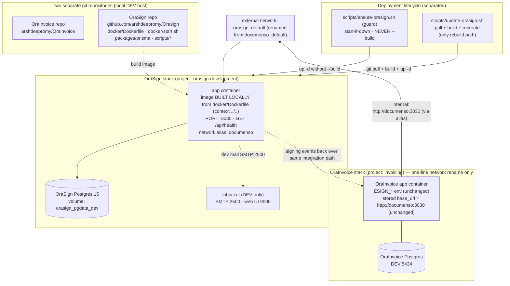

# Design Document

## Overview

OraSign is deployed as a **completely separate, standalone product** that runs alongside OraInvoice on the **local DEV** Ubuntu host. It lives in its **own git repository** — `github.com/arshdeepromy/Orasign` (private, clean single-commit history) — cloned to its **own path** on the host, entirely independent of the OraInvoice clone. OraSign owns its own PostgreSQL database, its own containers, its own named volume, and its own Docker Compose project (`orasign-development`). It is never merged into the OraInvoice compose project.

**Scope: local DEV only.** This design covers standing OraSign up as a standalone stack on the local DEV host and verifying end-to-end signing there. Pi PROD deployment (public URL, Cloudflare Tunnel, nginx route, PROD compose project, `ESIGN_*` wiring in `.env.pi`) is **out of scope** and deferred to a future follow-up spec — see [Future Work](#future-work). Today the e-signature integration exists **only** in local DEV: it is wired through `docker-compose.dev.yml`, the only OraInvoice compose file that declares the external `documenso_default` network and the `ESIGN_*` environment. Pi PROD has no such wiring, so a Pi rollout is greenfield, not an adaptation.

The integration keeps working with **no change to OraInvoice application code or the OraInvoice database** by using a **compatibility network alias**. Two things move at the wiring layer:

1. The external Docker network is **renamed** `documenso_default` → `orasign_default`.
2. The OraSign app service attaches to `orasign_default` with the network **alias `documenso`**, so the base_url already stored (envelope-encrypted) in the OraInvoice database — `http://documenso:3030` — still resolves to the OraSign app container.

Because the network name changes but the alias preserves the DNS contract, the **only permitted OraInvoice edit is a single one-line change** to the external-network name reference in `docker-compose.dev.yml`. No OraInvoice application code, database columns, stored base_url value, error code, or esignatures module logic changes.

OraInvoice reaches the signing service over **internal server-to-server calls**: the OraInvoice `app` container joins the external network (now `orasign_default`) and calls the service at `http://documenso:3030`. That host resolves via the `documenso` network alias on the OraSign app container. `ESIGN_ALLOW_INSECURE_INTERNAL_BASE_URL=true` (already set, unchanged) permits the plain-HTTP internal host. In DEV, OraSign serves its own signer-facing pages at `http://localhost:3030` (`NEXT_PUBLIC_WEBAPP_URL`).

### The dev compose is authored from scratch, not adapted

The OraSign repo's existing `docker/development/compose.yml` is a **contributor** stack — services `database` (postgres:15, volume `orasign_database`), `inbucket` (mail capture, ports 9000/2500/1100), `redis`, `minio`, and `gotenberg`. It has **no OraSign app service and no `orasign_default` network**; contributors run the app on the host via the toolchain, not in a container. It therefore cannot be lightly adapted — there is no app service to repoint.

This design **authors a new standalone dev compose file** — `docker/development/compose.standalone.yml` — that defines:

- an **`app`** service built locally from `docker/Dockerfile`,
- a **`database`** service (`postgres:15`) with its own volume `orasign_pgdata_dev`,
- the external **`orasign_default`** network, with the `app` carrying the alias **`documenso`**,
- an **`inbucket`** service for local mail capture.

It deliberately **omits `redis`, `minio`, and `gotenberg`** — none are needed for the OraInvoice signing integration in DEV (uploads use the database transport; OraInvoice sends only PDFs, so no document conversion is required).

OraSign's **deployment mirrors OraInvoice's local-build model**: the app image is **built locally** from the OraSign repo's `docker/Dockerfile` (not pulled from a public registry). A deploy is `git pull` of the OraSign repo at its clone path, then `docker compose ... up -d --build`.

Because the two products share a host but not a lifecycle, their deploy flows are strictly separated:

- **An OraInvoice deploy never redeploys, rebuilds, or recreates OraSign.** It can invoke a small **guard script** that starts OraSign only if it is not already running, and never rebuilds.
- A separate **explicit update command** (`update-orasign.sh`) is the only path that pulls the OraSign repo, rebuilds the image, and recreates the containers.

DEV starts with a **fresh, empty OraSign database (Option B)**. There is no carry-over or migration of legacy documenso data; the decision is final.

### Source artifacts this design is derived from

**OraSign repository (`github.com/arshdeepromy/Orasign`, cloned locally):**

- `docker/development/compose.yml` — the **contributor** stack (services `database`, `inbucket`, `redis`, `minio`, `gotenberg`; **no app service, no `orasign_default` network**). Reference only; not used directly.
- `docker/production/compose.yml` — an image-based production stack. **Reference only; out of scope for this DEV spec.**
- `docker/Dockerfile` — the app image built locally; does `COPY . .` from the repo root.
- `docker/start.sh` — runs `npx prisma migrate deploy --schema ../../packages/prisma/schema.prisma` on startup and serves the app; exposes `/api/health`.
- `packages/prisma` — the OraSign-owned schema and migrations.

**OraInvoice repository (`arshdeepromy/Orainvoice`, this workspace):**

- `docker-compose.dev.yml` — declares external network `documenso_default` and joins the `app` service to it with the `ESIGN_*` env. This file receives the **single permitted one-line change** (network name `documenso_default` → `orasign_default`).
- `documenso/docker-compose.yml` — the **retired** legacy local stack (project `documenso`, container `documenso-documenso-1`, port 3030, maildev on 1080, volume `documenso_db`). Replaced by the OraSign stack.

### Design goals (traced to requirements)

| Goal | Requirements |
|---|---|
| OraSign source lives only in its own repo; built/deployed from its own clone path | 1 |
| OraSign runs as its own DEV compose project with its own DB, containers, volume | 2 |
| OraSign owns and initialises its own fresh schema via Prisma migrations | 3 |
| Full DEV configuration/secret set defined | 4 |
| Network renamed to `orasign_default`; `documenso` alias preserves internal URL; distinct port/volume | 5 |
| OraInvoice change limited to a one-line network reference; no app/DB/base_url/error-code changes | 6 |
| Image built locally from `docker/Dockerfile` (context `../..`); deploy = pull + build + up | 7 |
| Deploy lifecycle separated: guard starts-if-down, update-command is the only rebuild path | 8 |
| Deployable to local DEV as a separate stack | 9 |
| Legacy `documenso` stack and network name retired | 10 |
| Data persisted and backed up (dev-scoped) | 11 |
| PDF-only; no gotenberg in the DEV stack | 12 |
| Signing verified end-to-end in local DEV | 13 |

## Architecture

The OraSign DEV stack is two long-lived services (`app` + `database`), a dev-only mail-capture service (`inbucket`), a named data volume, a locally-built app image, and a connection to the external `orasign_default` network that OraInvoice attaches to (after the one-line rename).



A single internal resolution path terminates at the OraSign `app` container:

- **Internal:** `OraInvoice app → orasign_default → DNS alias "documenso" → app:3030`. The stored base_url `http://documenso:3030` is unchanged; Docker's embedded DNS resolves the `documenso` alias on the renamed network to the OraSign container. `ESIGN_ALLOW_INSECURE_INTERNAL_BASE_URL=true` (unchanged) permits the plain-HTTP internal call.

### Key architectural decisions

**Decision 1 — Rename the network but keep a `documenso` alias (no OraInvoice app/DB change).**

The external network becomes `orasign_default`, but the OraSign app service carries the network alias `documenso`, so the stored base_url `http://documenso:3030` keeps resolving. This retires the `documenso_default` network **name** while preserving the DNS contract OraInvoice already depends on.

- Chosen: **rename the network to `orasign_default` + alias `documenso`.** The only OraInvoice touch is a one-line external-network name reference in `docker-compose.dev.yml`. No application code, DB columns, stored base_url, error code, or module logic changes (Requirement 6).
- Rejected: renaming the internal host to `orasign` and repointing the stored base_url via the GUI — this would drop the alias but forces a runtime data change to every org's connection record with no functional benefit for this cutover.

**Decision 2 — Author a new standalone dev compose; do not adapt the contributor stack.**

The OraSign repo's `docker/development/compose.yml` is a contributor stack with **no app service and no `orasign_default` network** (its services are `database`, `inbucket`, `redis`, `minio`, `gotenberg`). This design creates a **new** file, `docker/development/compose.standalone.yml`, that defines an `app` service (built locally), a `database` service, the `orasign_default` external network with the `documenso` alias on `app`, and `inbucket` for mail. It omits `redis`, `minio`, and `gotenberg` as unnecessary for the DEV integration (Requirements 2.3, 12.2).

**Decision 3 — Build the app image locally from context `../..`, mirroring OraInvoice.**

The `app` service uses `build:` with **`context: ../..`** (the repo root, because the compose file lives under `docker/development/`) and **`dockerfile: docker/Dockerfile`**. The Dockerfile does `COPY . .` from the repo root, so the build context must be the repo root. This mirrors the OraInvoice model where the `app` image is built locally, and removes any dependency on a public image registry (Requirement 7).

**Decision 4 — Override the app listen port to 3030.**

The app listens on `PORT=3030` so `http://documenso:3030` (unchanged stored base_url) resolves to the container. The published host port is distinct from OraInvoice's DEV host port (80) — see Network and Port Allocation.

**Decision 5 — Fresh DB in DEV (Option B, final).**

DEV starts with a fresh, empty OraSign database. There is no `pg_dump`/restore of legacy documenso data into OraSign. Consequence, accepted by the operator: any signing document previously created in the legacy service becomes unreachable from OraInvoice, because the stored `documenso_document_id` / `documenso_recipient_id` / `documenso_team_id` references dangle against the fresh DB. New signings after cutover work end-to-end. A pre-cutover `pg_dump` of the legacy DB is retained only as an **optional safety archive** and is never restored.

**Decision 6 — Separate the deploy lifecycles with a guard and an explicit update command.**

An OraInvoice deploy must never rebuild OraSign. A **guard script** (`scripts/ensure-orasign.sh`, in the OraSign repo) starts OraSign only if it is down and never rebuilds. A separate **`scripts/update-orasign.sh`** is the sole path that pulls, rebuilds, and recreates (Requirement 8). Both are written to be reusable by the future Pi PROD spec. See Deployment Lifecycle Separation.

## Components and Interfaces

### Component 1: OraSign App Container (`app`)

- **Image:** built **locally** from `docker/Dockerfile` in the OraSign repo (no registry pull), with build context `../..` (repo root).
- **Responsibility:** serves the OraSign web app + API; runs `npx prisma migrate deploy` on startup (`docker/start.sh`); seals signed PDFs with the mounted PKCS#12 certificate.
- **Listen port:** `PORT=3030` (matches the unchanged OraInvoice internal base_url).
- **Network identity:** joined to `orasign_default` with the network **alias `documenso`**; also on the stack's default network to reach `database` and `inbucket`.
- **Startup ordering:** `depends_on: database (condition: service_healthy)` — the app starts only after Postgres passes `pg_isready` (Requirement 2.5).
- **Health/reachability:** `GET /api/health` (per `start.sh`) used for verification at the Configured_API_URL. Note: the `/health` path in the contributor dev compose is the **gotenberg** container's healthcheck, not the OraSign app's — the app health endpoint is `/api/health`.

Interface contract (unchanged for OraInvoice): the OraSign service exposes its HTTP API at `http://documenso:3030` for server-to-server calls (via the alias). In DEV it serves signer-facing pages at `http://localhost:3030`.

### Component 2: OraSign Database Container (`database`)

- **Image:** `postgres:15`.
- **Responsibility:** stores the OraSign schema and data only. No OraInvoice access.
- **Credentials:** `POSTGRES_USER`, `POSTGRES_PASSWORD`, `POSTGRES_DB` from the OraSign env file.
- **Healthcheck:** `pg_isready -U ${POSTGRES_USER}`.
- **Persistence:** backed by the named volume `orasign_pgdata_dev` (distinct from the contributor stack's `orasign_database` and from OraInvoice/legacy volumes).

### Component 3: Mail capture — `inbucket` (DEV only)

The standalone dev compose reuses **inbucket** (the OraSign contributor stack's existing mail tool) so signing emails are captured locally rather than delivered. Inbucket exposes SMTP on **2500** (internal target for OraSign's SMTP env) and a web inbox on **9000** (POP3 on 1100 is unused here). This replaces the retired `documenso-maildev` (which used SMTP 1025 / web 1080).

### Component 4: Guard script (`scripts/ensure-orasign.sh`, OraSign repo)

- **Responsibility:** ensure the OraSign stack is running without ever rebuilding it.
- **Behavior:** checks whether the stack is up (`docker compose -p orasign-development ps`); if running → no-op (idempotent); if stopped → `docker compose ... up -d` **without** `--build`.
- **Placement rationale:** the authoritative guard lives in the **OraSign repo** because it owns the compose files, project name, env path, and health semantics. Framed for DEV use here and reusable by the future Pi PROD spec.

### Component 5: Update command (`scripts/update-orasign.sh`, OraSign repo)

- **Responsibility:** the **only** path that pulls the OraSign repo, rebuilds the locally-built image, and recreates containers.
- **Behavior:** `git pull` at the clone path → `docker compose ... build` → `docker compose ... up -d`. Run explicitly by an operator; never invoked by the OraInvoice deploy flow.

### Standalone dev compose definition

**New file: `docker/development/compose.standalone.yml` in the OraSign repo.** Authored from scratch (the contributor `compose.yml` has no app service and no `orasign_default` network). Defines `app` (local build), `database` (postgres:15), `inbucket` (mail), the `orasign_default` external network, and the `documenso` alias on `app`.

```yaml
name: orasign-development

services:
  database:
    image: postgres:15
    environment:
      - POSTGRES_USER=${POSTGRES_USER:-orasign}
      - POSTGRES_PASSWORD=${POSTGRES_PASSWORD:-password}
      - POSTGRES_DB=${POSTGRES_DB:-orasign}
    healthcheck:
      test: ['CMD-SHELL', 'pg_isready -U ${POSTGRES_USER:-orasign}']
      interval: 10s
      timeout: 5s
      retries: 5
    volumes:
      - orasign_pgdata_dev:/var/lib/postgresql/data

  inbucket:                              # local mail capture (SMTP 2500, web UI 9000)
    image: inbucket/inbucket:latest
    ports:
      - '9000:9000'                      # web inbox
      - '2500:2500'                      # SMTP (OraSign SMTP target)

  app:
    build:
      context: ../..                     # repo root (Dockerfile does COPY . . from root)
      dockerfile: docker/Dockerfile      # build locally, do NOT pull from a registry
    depends_on:
      database:
        condition: service_healthy
    environment:
      - PORT=${PORT:-3030}               # listen on 3030 to match the unchanged base_url
      - NEXTAUTH_SECRET=${NEXTAUTH_SECRET:?err}
      - NEXT_PRIVATE_ENCRYPTION_KEY=${NEXT_PRIVATE_ENCRYPTION_KEY:?err}
      - NEXT_PRIVATE_ENCRYPTION_SECONDARY_KEY=${NEXT_PRIVATE_ENCRYPTION_SECONDARY_KEY:?err}
      - NEXT_PUBLIC_WEBAPP_URL=${NEXT_PUBLIC_WEBAPP_URL:-http://localhost:3030}
      - NEXT_PRIVATE_DATABASE_URL=${NEXT_PRIVATE_DATABASE_URL:?err}
      - NEXT_PRIVATE_DIRECT_DATABASE_URL=${NEXT_PRIVATE_DIRECT_DATABASE_URL:-${NEXT_PRIVATE_DATABASE_URL}}
      - NEXT_PUBLIC_UPLOAD_TRANSPORT=${NEXT_PUBLIC_UPLOAD_TRANSPORT:-database}
      # Mail -> inbucket (captured locally, not delivered)
      - NEXT_PRIVATE_SMTP_TRANSPORT=${NEXT_PRIVATE_SMTP_TRANSPORT:-smtp-auth}
      - NEXT_PRIVATE_SMTP_HOST=${NEXT_PRIVATE_SMTP_HOST:-inbucket}
      - NEXT_PRIVATE_SMTP_PORT=${NEXT_PRIVATE_SMTP_PORT:-2500}
      - NEXT_PRIVATE_SMTP_FROM_NAME=${NEXT_PRIVATE_SMTP_FROM_NAME:-OraSign}
      - NEXT_PRIVATE_SMTP_FROM_ADDRESS=${NEXT_PRIVATE_SMTP_FROM_ADDRESS:-no-reply@orasign.local}
      - NEXT_PRIVATE_SIGNING_LOCAL_FILE_PATH=${NEXT_PRIVATE_SIGNING_LOCAL_FILE_PATH:-/opt/orasign/cert.p12}
      - NEXT_PRIVATE_SIGNING_PASSPHRASE=${NEXT_PRIVATE_SIGNING_PASSPHRASE}
    ports:
      - ${ORASIGN_HOST_PORT:-3030}:${PORT:-3030}
    networks:
      default: {}
      orasign_default:
        aliases:
          - documenso                    # so http://documenso:3030 still resolves (no OraInvoice change)
    volumes:
      - ./certs/cert.p12:/opt/orasign/cert.p12:ro

volumes:
  orasign_pgdata_dev:

networks:
  orasign_default:
    external: true
```

This file keeps the project name `orasign-development`, keeps the volume name distinct from `documenso_db` and from the contributor `orasign_database`, builds the image locally with context `../..`, points SMTP at `inbucket:2500`, and attaches `app` to `orasign_default` with the `documenso` alias. It contains **no `redis`, `minio`, or `gotenberg`** (Requirement 12.2).

### The single permitted OraInvoice change

`docker-compose.dev.yml` today joins the OraInvoice `app` to the external network `documenso_default`. The **only** edit is repointing that external-network name to `orasign_default`. The `app` service's network membership entry and the bottom `networks:` declaration both reference the same name:

```diff
   app:
     networks:
       - default
-      - documenso_default
+      - orasign_default
...
 networks:
-  documenso_default:
+  orasign_default:
     external: true
```

Comments in that file that mention the network/host may be updated for accuracy, but that is cosmetic. The stored base_url stays `http://documenso:3030`, resolved via the alias. The existing `ESIGN_*` env values (`ESIGN_ALLOW_INSECURE_INTERNAL_BASE_URL`, `ESIGN_PUBLIC_DOCUMENSO_URL`) are unchanged and out of scope.

## Data Models

OraSign owns its full relational schema through its Prisma migrations under the OraSign repo's `packages/prisma/migrations`. This spec does not define those tables; it defines the **operational data model** — what storage OraSign owns and how it stays isolated from OraInvoice.

### Storage ownership (DEV)

| Item | Value |
|---|---|
| Repo clone path | local OraSign clone (separate from OraInvoice clone) |
| Compose project | `orasign-development` |
| Compose file | `docker/development/compose.standalone.yml` (new) |
| App image | built locally from `docker/Dockerfile`, context `../..` |
| DB image | `postgres:15` |
| DB name / user | `orasign` / `orasign` (defaults; overridable via env) |
| Named volume | `orasign_pgdata_dev` |
| App listen port | 3030 |
| Published host port | `ORASIGN_HOST_PORT` (default 3030) |
| Mail capture | `inbucket` — SMTP 2500, web UI 9000 |
| Network alias on `orasign_default` | `documenso` |

The OraInvoice volumes (Postgres data on 5434), the legacy `documenso_db` volume, and the contributor stack's `orasign_database` volume are never referenced. Because Docker namespaces volumes by project, `orasign-development_orasign_pgdata_dev` cannot collide with `documenso_documenso_db` or any `invoicing_*` volume (Requirements 5.5, 9.2).

### Data isolation

- OraSign connects only to its own `database` service via `NEXT_PRIVATE_DATABASE_URL` / `NEXT_PRIVATE_DIRECT_DATABASE_URL` (host `database`, the in-stack service name).
- It has no connection string, credential, or network route to the OraInvoice Postgres. The two databases share no tables and no schema (Requirement 3.3).
- OraInvoice continues to store the foreign references it already holds (`documenso_document_id`, `documenso_team_id`, `documenso_recipient_id`) — opaque IDs unchanged (out of scope). With a fresh OraSign DB, any such reference created against the legacy service will not resolve (accepted cutover consequence, Requirement 3.7).

### Schema initialisation

On every app start, `docker/start.sh` runs `npx prisma migrate deploy --schema ../../packages/prisma/schema.prisma` against the OraSign DB before booting the server. A fresh volume is brought to the current schema automatically; an existing volume has only outstanding migrations applied (Requirements 3.2, 9.3).

### Fresh-database cutover (Option B — final)

DEV starts with a fresh, empty OraSign database; there is no restore of legacy documenso data. A pre-cutover `pg_dump` of the legacy DB is taken **only as an optional safety archive** and is never restored into OraSign (Requirements 3.6, 3.8). New signings created after cutover work normally; legacy signings do not resolve against the new DB (accepted).

## Configuration and Secrets

OraSign is configured entirely through environment variables (authoritative list in the OraSign repo's `.env.example`). DEV uses its own `.env` file (recommended `docker/development/.env` inside the OraSign clone) that is **excluded from version control** (Requirement 4.7). Compose enforces required values with `${VAR:?err}`, so an unset required value fails startup with a message naming the variable (Requirement 4.6).

### Required (startup fails if unset — `:?err`)

| Variable | Purpose | DEV value / notes |
|---|---|---|
| `NEXTAUTH_SECRET` | Auth session signing | Random ≥32 chars |
| `NEXT_PRIVATE_ENCRYPTION_KEY` | Symmetric encryption (primary) | Random ≥32 chars |
| `NEXT_PRIVATE_ENCRYPTION_SECONDARY_KEY` | Symmetric encryption (secondary) | Random ≥32 chars |
| `NEXT_PUBLIC_WEBAPP_URL` | Public origin (DEV) | `http://localhost:3030` |
| `NEXT_PRIVATE_DATABASE_URL` | Connection to OraSign DB | host = `database` (in-stack service) |
| `POSTGRES_USER` / `POSTGRES_PASSWORD` / `POSTGRES_DB` | DB provisioning | `orasign` / (set) / `orasign` |
| `NEXT_PRIVATE_SMTP_FROM_NAME` / `NEXT_PRIVATE_SMTP_FROM_ADDRESS` | Sender identity | e.g. `OraSign` / `no-reply@orasign.local` |

### Important defaults / optional (DEV)

| Variable | Default | Notes |
|---|---|---|
| `PORT` | `3030` | Must be 3030 to match OraInvoice's unchanged internal URL |
| `ORASIGN_HOST_PORT` | `3030` | Published host port; distinct from OraInvoice's DEV port (80) |
| `NEXT_PRIVATE_DIRECT_DATABASE_URL` | falls back to `NEXT_PRIVATE_DATABASE_URL` | Used for migrations (non-pooled) |
| `NEXT_PUBLIC_UPLOAD_TRANSPORT` | `database` | Keeps uploads in the OraSign DB; no S3/minio dependency |
| `NEXT_PRIVATE_SMTP_TRANSPORT` | `smtp-auth` | Points at inbucket |
| `NEXT_PRIVATE_SMTP_HOST` | `inbucket` | In-stack service name |
| `NEXT_PRIVATE_SMTP_PORT` | `2500` | inbucket SMTP port |
| `NEXT_PRIVATE_SIGNING_LOCAL_FILE_PATH` | `/opt/orasign/cert.p12` | Cert mount target |
| `NEXT_PRIVATE_SIGNING_PASSPHRASE` | — | PKCS#12 passphrase |

### Email transport (DEV)

`NEXT_PRIVATE_SMTP_TRANSPORT=smtp-auth` pointed at the `inbucket` service (`NEXT_PRIVATE_SMTP_HOST=inbucket`, `NEXT_PRIVATE_SMTP_PORT=2500`) so all signing emails are captured at the inbucket web UI on `http://localhost:9000`. No mail leaves the host (Requirement 4.4).

### Signing certificate

The PKCS#12 certificate is mounted **read-only** into the app container at `NEXT_PRIVATE_SIGNING_LOCAL_FILE_PATH` (default `/opt/orasign/cert.p12`). DEV mounts `./certs/cert.p12`. `start.sh` warns (does not crash) if the cert is missing — signing is unavailable until supplied, non-signing flows stay up (Requirement 4.5).

### Secret handling

Secrets live only in the DEV `.env` file inside the OraSign clone, git-ignored. Nothing secret is committed (Requirement 4.7).

## Network and Port Allocation

This is the crux of the design: make `http://documenso:3030` resolve to the OraSign app container with **only a one-line OraInvoice network reference change** and **no OraInvoice application/code/DB/error-code/base_url change** (Requirements 5 and 6).

### Internal path — `http://documenso:3030` (unchanged base_url)

1. The external network is renamed to `orasign_default`. The OraInvoice `app` service's network reference is repointed from `documenso_default` to `orasign_default` in `docker-compose.dev.yml`.
2. The OraSign `app` service attaches to `orasign_default` with the network **alias `documenso`**.
3. The OraSign app listens on `PORT=3030`.
4. The stored per-org base_url stays `http://documenso:3030` — **no change**.
5. Result: Docker's embedded DNS resolves the `documenso` alias (from OraInvoice's namespace on `orasign_default`) to the OraSign container's IP, and `:3030` hits the listening app. `ESIGN_ALLOW_INSECURE_INTERNAL_BASE_URL=true` (unchanged) permits the plain-HTTP internal call.

### Port and volume collision avoidance

- Published host port `ORASIGN_HOST_PORT` (default 3030) is distinct from OraInvoice's DEV host port (80) and DB port (5434), and from inbucket's ports (9000/2500).
- The named volume `orasign_pgdata_dev` is distinct from `documenso_db`, the contributor `orasign_database`, and any `invoicing_*` volume; Docker's per-project namespacing guarantees no collision (Requirements 5.2, 5.5, 9.2).

## Deployment to Local DEV (Local-Build, Mirroring OraInvoice)

OraSign deploys as its own compose project from its own repo clone, independent of the OraInvoice lifecycle (Requirement 7, 9).

### Prerequisite: create the external network and apply the one-line OraInvoice change

The renamed network must exist before either stack starts:

```bash
docker network create orasign_default
```

Apply the single permitted OraInvoice edit (see "The single permitted OraInvoice change"): repoint `docker-compose.dev.yml`'s external network name from `documenso_default` to `orasign_default`. The stored base_url is untouched.

### Local DEV bring-up = pull + build + up (mirrors OraInvoice)

```bash
# in the OraSign clone
cd <orasign-clone>
git pull origin main
docker compose -f docker/development/compose.standalone.yml --env-file docker/development/.env up -d --build
```

- Project: `orasign-development`. Web UI / API: `http://localhost:3030`. Captured mail: `http://localhost:9000` (inbucket).
- The image is built locally from `docker/Dockerfile` with context `../..`; nothing is pulled from a public registry (Requirements 7.1, 7.2, 7.4).
- The OraInvoice dev app (rejoined to `orasign_default`) reaches it at `http://documenso:3030` via the alias, with no base_url change.

## Deployment Lifecycle Separation

The OraInvoice and OraSign deploy lifecycles are strictly separated so that deploying OraInvoice never disturbs a running OraSign stack, and OraSign is only rebuilt on an explicit command (Requirement 8). Both scripts live in the OraSign repo and are written for DEV use here, reusable by the future Pi PROD spec.

### Guard script — `scripts/ensure-orasign.sh` (in the OraSign repo)

Idempotent: if the stack is already running, it does nothing; if stopped, it starts it **without** `--build`; it never rebuilds or upgrades (Requirements 8.1–8.4).

```bash
#!/usr/bin/env bash
# scripts/ensure-orasign.sh — start OraSign only if it is not already running.
# NEVER rebuilds. Safe to invoke from an OraInvoice deploy flow.
set -euo pipefail

ORASIGN_DIR="${ORASIGN_DIR:-$(cd "$(dirname "$0")/.." && pwd)}"
PROJECT="${ORASIGN_PROJECT:-orasign-development}"
COMPOSE=(docker compose -f "$ORASIGN_DIR/docker/development/compose.standalone.yml" \
  --env-file "$ORASIGN_DIR/docker/development/.env" -p "$PROJECT")

# Count running containers in the OraSign project.
running="$("${COMPOSE[@]}" ps --status running --quiet | wc -l | tr -d ' ')"

if [ "$running" -gt 0 ]; then
  echo "[ensure-orasign] OraSign already running ($running containers) — no action."
  exit 0
fi

echo "[ensure-orasign] OraSign not running — starting WITHOUT rebuild."
"${COMPOSE[@]}" up -d            # note: no --build, no git pull, no --force-recreate
echo "[ensure-orasign] OraSign started."
```

Idempotency (the guard-idempotency property): running the guard N times while the stack is up produces the same state as running it once — the first invocation short-circuits on the running-container check, and subsequent invocations do the same. The guard has no rebuild, pull, or recreate path, so it cannot mutate a running stack.

### Update command — `scripts/update-orasign.sh` (in the OraSign repo)

The **only** path that pulls, rebuilds, and recreates OraSign (Requirement 8.5). Run explicitly by an operator; never called by the OraInvoice deploy flow.

```bash
#!/usr/bin/env bash
# scripts/update-orasign.sh — the ONLY path that pulls + rebuilds + recreates OraSign.
set -euo pipefail

ORASIGN_DIR="${ORASIGN_DIR:-$(cd "$(dirname "$0")/.." && pwd)}"
PROJECT="${ORASIGN_PROJECT:-orasign-development}"
COMPOSE=(docker compose -f "$ORASIGN_DIR/docker/development/compose.standalone.yml" \
  --env-file "$ORASIGN_DIR/docker/development/.env" -p "$PROJECT")

cd "$ORASIGN_DIR"
echo "[update-orasign] Pulling latest OraSign source..."
git pull origin main

echo "[update-orasign] Building image locally from docker/Dockerfile (context ../..)..."
"${COMPOSE[@]}" build

echo "[update-orasign] Recreating containers..."
"${COMPOSE[@]}" up -d

echo "[update-orasign] OraSign updated."
```

This cleanly divides responsibilities: the guard keeps OraSign **available** during unrelated OraInvoice deploys; the update command is the deliberate, explicit act that changes the running OraSign version (Requirements 8.5, 8.6).

## Retiring the Legacy Documenso Stack

The cutover replaces the old documenso service and its network name with the OraSign stack on the renamed network, in local DEV. Because DEV starts with a fresh OraSign DB, the only legacy data step is an optional safety archive.

```bash
# 1. (Optional safety archive — NOT restored into OraSign) dump the legacy DB.
docker compose -f documenso/docker-compose.yml --env-file documenso/.env \
  exec -T documenso-db pg_dump -U "$POSTGRES_USER" "$POSTGRES_DB" \
  | gzip > documenso_legacy_archive_$(date +%F).sql.gz
# 2. Stop and remove the legacy stack (frees the old documenso_default network and the `documenso` alias).
docker compose -f documenso/docker-compose.yml --env-file documenso/.env down
# 3. Create the renamed network and apply the one-line OraInvoice change (see prerequisite).
docker network create orasign_default
# 4. Recreate the OraInvoice dev app on the renamed network.
docker compose -f docker-compose.yml -f docker-compose.dev.yml up -d --force-recreate app
# 5. Build + bring up OraSign from its own clone (local build).
cd <orasign-clone> && git pull origin main && \
  docker compose -f docker/development/compose.standalone.yml --env-file docker/development/.env up -d --build
# 6. Run end-to-end verification (Requirement 13) before declaring cutover complete.
```

After retirement, no OraSign workload depends on the `documenso` project, the `documenso-documenso-1` container, the `documenso_db` volume, or the legacy `documenso_default` network **name** — OraSign owns its own DB and app and consumes only the renamed `orasign_default` network under the `documenso` alias (Requirements 10.4, 10.5). The stored base_url `http://documenso:3030` still resolves because of the alias (Requirement 10.2).

## Persistence and Backup (DEV-scoped)

### Persistence

The OraSign DB is persisted in its named volume `orasign_pgdata_dev` so data survives app/DB container restarts and recreation. Restarting or recreating containers without removing the volume retains all stored data (Requirements 11.1, 11.2).

### Backup — Requirement 11.3

```bash
docker compose -p orasign-development exec -T database \
  pg_dump -U "$POSTGRES_USER" "$POSTGRES_DB" | gzip > orasign_$(date +%F).sql.gz
```

### Restore into the `orasign_pgdata_dev` volume — Requirement 11.4

```bash
gunzip -c orasign_<date>.sql.gz | \
  docker compose -p orasign-development exec -T database \
  psql -U "$POSTGRES_USER" -d "$POSTGRES_DB"
```

Volume-level snapshots (`docker run --rm -v orasign-development_orasign_pgdata_dev:/data ...`) are an alternative for full-volume capture.

## Implementation Notes / File Manifest

Exactly which files are created or changed, and in which repo:

### OraSign repository (`github.com/arshdeepromy/Orasign`, cloned locally)

| File | Change |
|---|---|
| `docker/development/compose.standalone.yml` | **New (authored from scratch).** Defines `app` (local build, context `../..`, dockerfile `docker/Dockerfile`, `PORT=3030`), `database` (`postgres:15`, volume `orasign_pgdata_dev`), `inbucket` (mail, SMTP 2500 / web 9000), external `orasign_default` network, and `documenso` alias on `app`. No `redis`/`minio`/`gotenberg`. |
| `docker/development/compose.yml` | **Unchanged (contributor stack).** Not used by the standalone deploy; kept for contributors. |
| `docker/Dockerfile` | Used as-is for the local image build (context = repo root; `COPY . .`). No change required beyond confirming it builds. |
| `docker/start.sh` | Used as-is; runs `npx prisma migrate deploy --schema ../../packages/prisma/schema.prisma` on startup; exposes `/api/health`. |
| `docker/development/.env` | **New (git-ignored).** DEV env with the full required var set (`NEXT_PUBLIC_WEBAPP_URL=http://localhost:3030`, SMTP → inbucket, DB creds, signing cert path/passphrase). |
| `certs/cert.p12` | **New (git-ignored).** DEV signing certificate, mounted read-only into the app. |
| `scripts/ensure-orasign.sh` | **New** guard script: start-if-down, never rebuild (idempotent). |
| `scripts/update-orasign.sh` | **New** explicit update command: the only pull + build + recreate path. |
| `.gitignore` | Ensure `docker/**/.env` and `certs/` are excluded. |

### OraInvoice repository (`arshdeepromy/Orainvoice`, this workspace)

| File | Change |
|---|---|
| `docker-compose.dev.yml` | **One-line change:** external network name `documenso_default` → `orasign_default` (app service `networks:` entry + bottom `networks:` declaration). Comments may be updated cosmetically. Stored base_url and `ESIGN_*` values unchanged. |
| `documenso/docker-compose.yml` and `documenso/` | **Retire** the legacy stack (stop/remove; keep files for reference/archive only). No runtime dependency remains. |

**Explicitly NOT changed in OraInvoice:** application code (`app/`, `frontend-v2/`, `mobile/`, `tests/`, `scripts/`), the `DocumensoClient` class, the DB columns (`documenso_document_id` / `documenso_team_id` / `documenso_recipient_id`), the stored per-org `base_url` value, the API error code (`documenso_error`), the esignatures module logic, and the `NEXT_PRIVATE_DOCUMENSO_*` / `ESIGN_DOCUMENSO_*` env var names.

## Correctness Properties

*A property is a characteristic or behavior that should hold true across all valid executions of a system — essentially, a formal statement about what the system should do. Properties serve as the bridge between human-readable specifications and machine-verifiable correctness guarantees.*

This feature is infrastructure and deployment configuration, so its correctness is established by **deterministic integration and smoke checks**, not by randomized property-based testing — the behavior is network/volume/config/script wiring that does not vary meaningfully with generated inputs. The invariants below are stated as universally-quantified properties for clarity and traceability; each is validated by a single deterministic check rather than 100+ generated cases.

### Property 1: Data isolation

*For all* OraSign data reads and writes, the target is the OraSign database only; the OraSign database and the OraInvoice database share no tables and no schema, and no OraSign container mounts, links to, or holds a connection string for any OraInvoice database, container, or volume.

**Validates: Requirements 2.6, 3.3, 3.4, 3.5**

### Property 2: URL resolution via the `documenso` alias

*For all* requests OraInvoice issues to its unchanged Configured_API_URL — the internal host `http://documenso:3030` resolved via the `documenso` alias on the renamed `orasign_default` network — the request resolves to the standalone OraSign app container, with no change to OraInvoice application code, database, or the stored base_url value.

**Validates: Requirements 5.4, 6.2, 6.3, 10.2**

### Property 3: Guard idempotency

*For all* invocations of the guard script while the OraSign stack is already running, the guard makes no change to the stack (no rebuild, no recreate, no restart); and when the stack is not running, the guard starts it without rebuilding — so any number of guard runs converge to "running, unchanged image".

**Validates: Requirements 8.2, 8.3, 8.4**

### Property 4: Persistence across restart and recreation

*For all* OraSign data written before a restart or container recreation that retains the Data_Volume, the same data is present and readable after the stack comes back up.

**Validates: Requirements 11.1, 11.2**

### Property 5: End-to-end signing in DEV

*For all* signing requests sent from the OraInvoice integration path to the Configured_API_URL while the OraSign stack is running in local DEV, the OraSign service accepts the request, creates the corresponding signing document in its own OraSign database, returns a result OraInvoice can consume, and delivers the completion event back to OraInvoice over the same configured path.

**Validates: Requirements 6.4, 13.2, 13.3**

## Error Handling

| Failure | Behavior | Requirement |
|---|---|---|
| Required env var unset at startup | Compose `${VAR:?err}` aborts `up` with a message naming the variable; the app never starts misconfigured | 4.6 |
| Database not yet healthy | `depends_on: condition: service_healthy` holds the app until `pg_isready` passes | 2.5 |
| Pending Prisma migrations | `npx prisma migrate deploy --schema ../../packages/prisma/schema.prisma` runs in `start.sh` before the server boots; a migration failure exits the script so no half-migrated schema is served | 3.2, 9.3 |
| Signing certificate missing/unreadable | `start.sh` logs a warning and continues; signing unavailable until the cert is mounted (non-signing flows stay up) | 4.5 |
| `orasign_default` network absent | Compose `up` fails fast on the external network; operator creates it with `docker network create orasign_default` | 10.5 |
| OraInvoice still wired to `documenso_default` | OraInvoice cannot resolve `documenso` until the one-line network reference is repointed and the app recreated on `orasign_default`; cutover applies the change before verification | 6.1, 10.5 |
| Local image build fails | `docker compose build` (in the update command) fails before `up`; the previously running container keeps serving; operator fixes the build and reruns `update-orasign` | 7.1, 7.2 |
| OraInvoice deploy runs while OraSign is up | The guard's running-container check short-circuits; OraSign is left untouched and is never rebuilt | 8.2, 8.4 |
| OraInvoice deploy runs while OraSign is down | The guard runs `up -d` without `--build`, restoring OraSign at its current image | 8.3 |
| Non-PDF document sent for signing | Document conversion is unsupported (no gotenberg in the DEV stack); OraInvoice uploads only PDFs, so this does not arise in normal use (flagged, out of scope) | 12.3 |
| End-to-end verification step fails | The verification procedure reports which stage failed — reachability, document creation, or signing-event delivery | 13.4 |
| Email delivery in DEV | All mail is captured by inbucket (SMTP 2500) and viewable at `http://localhost:9000`; nothing leaves the host; signing document creation is independent of email so the core flow is not blocked | 4.4 |

## Testing Strategy

Because this is an infrastructure/deployment feature (Docker Compose, networking, volumes, env, shell scripts), property-based testing does not apply — the criteria test wiring, script control-flow, and external-service behavior, not pure functions with meaningful input variation. Verification uses **smoke checks** (one-time config/setup assertions) and **integration tests** (1–3 representative executions), all in local DEV. Randomized property-based testing is deliberately not used.

### Smoke checks (config / setup — single execution)

- OraSign source resides only in the OraSign repo; no OraSign source or compose service appears in any OraInvoice compose file (Requirements 1.1, 1.2, 2.4).
- The standalone dev compose file (`docker/development/compose.standalone.yml`) exists, its project name is `orasign-development`, and it contains `app`, `database`, `inbucket`, and the `orasign_pgdata_dev` volume — and does **not** contain `redis`, `minio`, or `gotenberg` (2.1, 2.2, 2.3, 12.2).
- The app service uses `build:` (context `../..`, dockerfile `docker/Dockerfile`) — no `image:` pulled from a registry (7.1, 7.4).
- DB image is `postgres:15` with OraSign-owned `POSTGRES_*` (3.1).
- All required env vars are set; the DEV `.env` file is git-ignored (4.1–4.4, 4.7).
- SMTP env points at `inbucket:2500`; mail is viewable at `http://localhost:9000` (4.4).
- Signing cert mounted `:ro` at the configured path (4.5).
- App service declares network alias `documenso` on `orasign_default` (5.3).
- Published host port and volume name do not collide with OraInvoice's (80/5434, `documenso_db`) or the contributor `orasign_database` (5.2, 5.5, 9.2).
- The only OraInvoice edit in the diff is the one-line external-network name change; stored base_url is `http://documenso:3030` (unchanged) (6.1, 6.2, 6.5).
- Guard and update scripts exist in the OraSign repo and are executable (8.1, 8.5).
- Backup and restore runbooks exist and execute (11.3, 11.4).
- Health endpoint responds at `/api/health` (13.1). (Note: `/health` in the contributor compose is gotenberg's, not the app's.)

### Integration tests (1–3 examples) — validate the correctness properties

- **Property 1 (isolation):** inspect the OraSign app container — assert its only DB route is the in-stack `database`; connect to both databases and assert disjoint table sets; assert no OraInvoice mounts/links (2.6, 3.3, 3.4, 3.5).
- **Property 2 (URL resolution via alias):** from the OraInvoice app container (now on `orasign_default`), `curl http://documenso:3030/api/health` succeeds via the alias with the stored base_url unchanged (5.4, 6.2, 6.3, 10.2).
- **Property 3 (guard idempotency):** with OraSign up, capture container IDs and image digest; run `ensure-orasign.sh` three times; assert container IDs and image digest are unchanged and no `build`/`create` occurred. Then `docker compose -p orasign-development down`, run the guard once, assert the stack comes up **without** a rebuild (image digest equals the pre-existing local build) (8.2, 8.3, 8.4).
- **Property 4 (persistence):** write a signing document, `docker compose down` (without `-v`), `up`, assert the document is still present (11.1, 11.2).
- **Property 5 (end-to-end signing in DEV):** from an OraInvoice org, initiate a signing request → assert the document row is created in the OraSign DB and a consumable response returns; complete the document → assert OraInvoice receives the signing event over the existing path; assert the notification email is captured in inbucket (6.4, 13.2, 13.3).
- **Update-command exclusivity:** run `update-orasign.sh`; assert it pulls, rebuilds (new image digest), and recreates. Confirm no other script or the guard performs a rebuild (8.5).
- **Lifecycle independence:** redeploy the OraInvoice `app` (optionally with the guard line); assert OraSign keeps serving and its image digest is unchanged, and vice versa (8.6). Stop the legacy `documenso` project; assert OraSign keeps running (10.4).
- **Startup migrations:** start on a fresh volume; assert `migrate deploy` ran and the schema exists before serving (3.2, 9.3).

### Failure-path checks (edge cases)

- Unset each required env var in turn; assert `up` fails naming that variable (4.6).
- Break the local build (e.g., bad Dockerfile stage); assert `update-orasign.sh` fails at `build` and the running container is untouched (7.1).
- Force each end-to-end stage to fail; assert the verification procedure names the failing stage (13.4).

### Verification (local DEV)

End-to-end verification (Property 5) is performed in **local DEV**. A "pass" means: health check green at the internal URL (`http://documenso:3030/api/health` via the alias), a signing document created and visible in the OraSign DB, the notification email captured in inbucket, and the completion event observed back in OraInvoice. Because DEV starts with a fresh OraSign DB, verification does not require any data-restore confirmation — only that the optional legacy archive (if taken) is set aside and the operator has accepted that legacy documents will not resolve against the new DB.

## Future Work

Pi PROD deployment of OraSign is a **separate follow-up spec** and is out of scope here. It is a greenfield first-time deployment because none of the required PROD wiring exists on the Pi today:

- **Cloudflare Tunnel** for a public `esignd` hostname (e.g. `esignd.oraflows.co.nz`) — not configured.
- **nginx route** pointing an `esignd` upstream at the OraSign app port — does not exist.
- **`ESIGN_*` environment** in `.env.pi` (`ESIGN_ALLOW_INSECURE_INTERNAL_BASE_URL`, `ESIGN_PUBLIC_DOCUMENSO_URL`) — absent; Pi PROD has no e-signature wiring at all.
- **PROD compose project** (`orasign-production`) and the external signing network on the Pi — not present.
- **Network wiring** joining the OraInvoice Pi compose to a shared signing network — not declared.

The Guard_Script (`scripts/ensure-orasign.sh`) and Update_Command (`scripts/update-orasign.sh`) authored here are written to be reusable by that future spec (project name, compose file path, and env path are parameterised via environment variables), so the Pi PROD spec can point them at a production compose file and project without rewriting their control flow.
